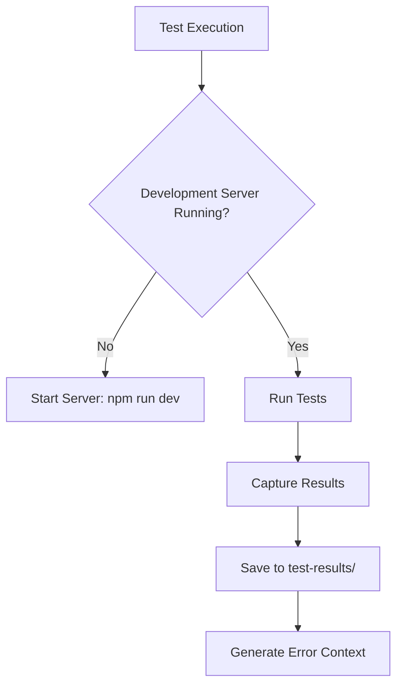
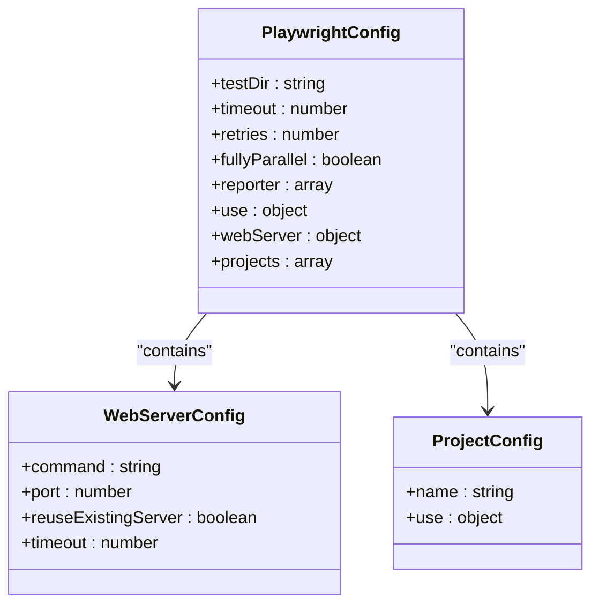
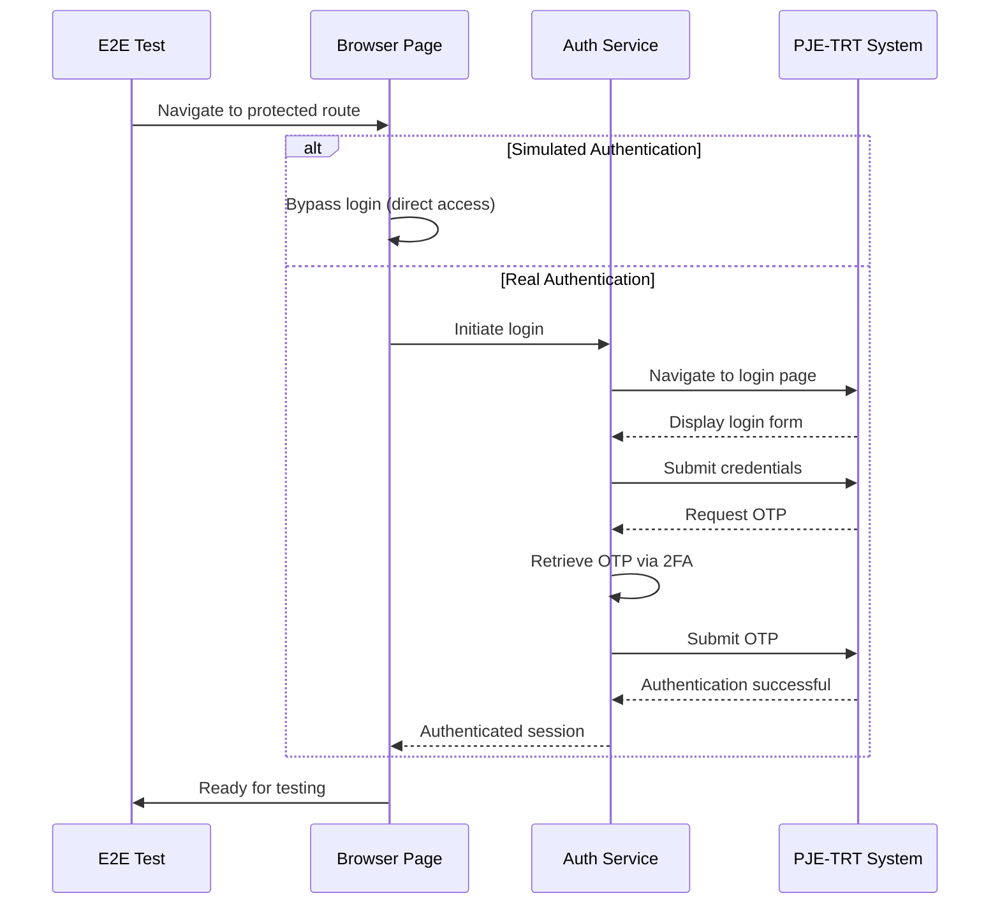
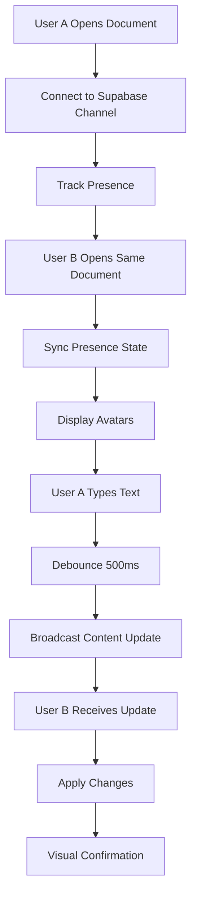
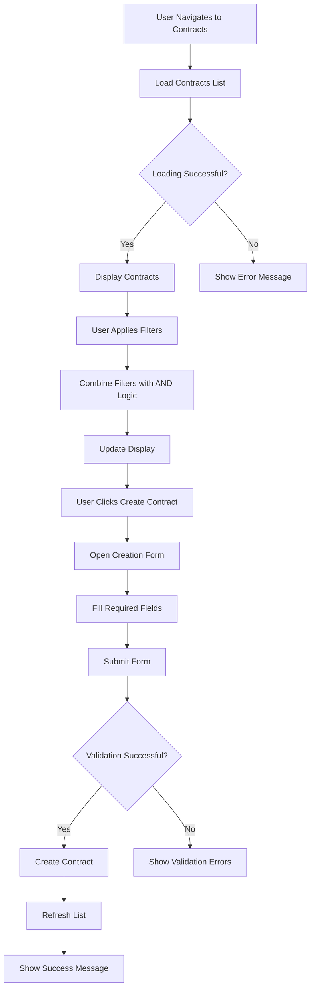
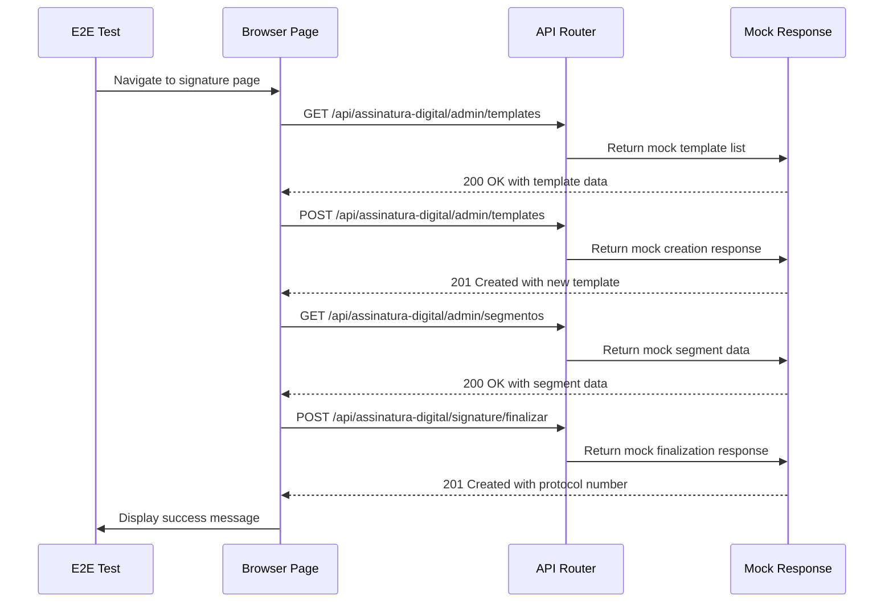
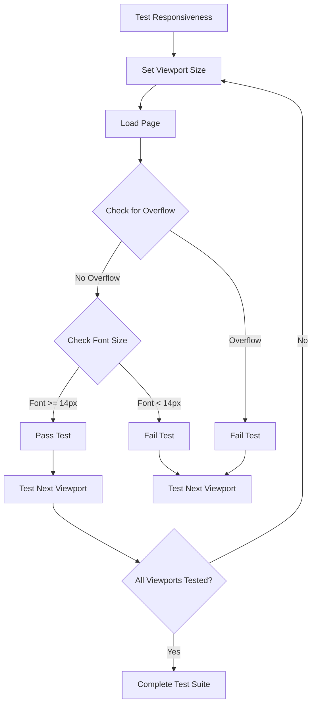

# End-to-End Tests

<cite>
**Referenced Files in This Document**   
- [playwright.config.ts](file://playwright.config.ts)
- [e2e/dashboard.spec.ts](file://e2e/dashboard.spec.ts)
- [e2e/documentos/documentos.spec.ts](file://e2e/documentos/documentos.spec.ts)
- [e2e/formsign.spec.ts](file://e2e/formsign.spec.ts)
- [e2e/responsiveness.spec.ts](file://e2e/responsiveness.spec.ts)
- [package.json](file://package.json)
- [components/documentos/document-editor.tsx](file://components/documentos/document-editor.tsx)
- [hooks/use-realtime-collaboration.ts](file://hooks/use-realtime-collaboration.ts)
- [openspec/specs/documentos-editor/spec.md](file://openspec/specs/documentos-editor/spec.md)
- [backend/captura/services/trt/trt-auth.service.ts](file://backend/captura/services/trt/trt-auth.service.ts)
- [backend/captura/services/browser/browser-connection.service.ts](file://backend/captura/services/browser/browser-connection.service.ts)
- [tests/setup.ts](file://tests/setup.ts)
</cite>

## Table of Contents
1. [Introduction](#introduction)
2. [Test Environment Setup](#test-environment-setup)
3. [Playwright Configuration](#playwright-configuration)
4. [Authentication Handling](#authentication-handling)
5. [Critical User Journeys](#critical-user-journeys)
6. [Document Editor Collaboration](#document-editor-collaboration)
7. [Hearing Calendar Interactions](#hearing-calendar-interactions)
8. [Financial Module Workflows](#financial-module-workflows)
9. [Contract Management](#contract-management)
10. [Network Mocking](#network-mocking)
11. [Visual Testing and Responsiveness](#visual-testing-and-responsiveness)
12. [Test Data Preparation](#test-data-preparation)
13. [Common Issues in E2E Testing](#common-issues-in-e2e-testing)
14. [Best Practices for Reliable E2E Tests](#best-practices-for-reliable-e2e-tests)
15. [Conclusion](#conclusion)

## Introduction
The Sinesys application implements a comprehensive end-to-end (E2E) testing strategy using Playwright to ensure the reliability and stability of critical user workflows. The E2E tests simulate real user interactions across the entire application, covering essential features such as document creation and editing, dashboard navigation, hearing calendar management, financial workflows, and contract management. This documentation provides a detailed overview of the E2E testing implementation, including test environment setup, authentication handling, test data preparation, and strategies for addressing common challenges in E2E testing such as flaky tests and timing issues.

**Section sources**
- [e2e/dashboard.spec.ts](file://e2e/dashboard.spec.ts#L1-L105)
- [e2e/documentos/documentos.spec.ts](file://e2e/documentos/documentos.spec.ts#L1-L205)
- [e2e/formsign.spec.ts](file://e2e/formsign.spec.ts#L1-L124)

## Test Environment Setup
The E2E test environment for Sinesys is configured to run against a local development server, ensuring that tests execute in a controlled and consistent environment. The Playwright configuration specifies the base URL as `http://localhost:3000` and automatically starts the development server using the command `npm run dev` before running tests. This setup allows tests to interact with the application as it would be experienced by real users, while maintaining isolation from production data.

The test environment includes comprehensive error handling and logging mechanisms. Test results are saved in the `test-results/` directory, with detailed error context captured for failed tests. The environment also includes a setup file that configures Jest timeouts and suppresses expected console errors to prevent output pollution during test execution.

**Diagram sources **
- [playwright.config.ts](file://playwright.config.ts#L1-L41)
- [package.json](file://package.json#L38)
- [tests/setup.ts](file://tests/setup.ts#L1-L33)

**Section sources**
- [playwright.config.ts](file://playwright.config.ts#L1-L41)
- [package.json](file://package.json#L38)
- [tests/setup.ts](file://tests/setup.ts#L1-L33)

## Playwright Configuration
The Playwright configuration for Sinesys is designed to support cross-browser testing and ensure reliable test execution. The configuration file defines multiple projects for different browsers and device types, including Chromium, Firefox, WebKit, and mobile devices (Pixel 7 and iPhone 14). This enables comprehensive testing across different browser engines and screen sizes.

Key configuration settings include a 60-second timeout for individual tests, no retries (retries: 0), and full parallelization of test execution. The configuration also enables trace recording on the first retry, which provides detailed debugging information for failed tests. The web server configuration specifies a 120-second timeout for server startup, ensuring that tests only begin once the application is fully available.

**Diagram sources **
- [playwright.config.ts](file://playwright.config.ts#L1-L41)

**Section sources**
- [playwright.config.ts](file://playwright.config.ts#L1-L41)

## Authentication Handling
Authentication in the E2E tests is handled through a combination of simulated authentication and real authentication flows, depending on the test requirements. For most UI tests, authentication is simulated by navigating directly to protected routes, bypassing the login process to improve test efficiency. This approach is used in tests that focus on functionality rather than the authentication flow itself.

For tests that specifically target authentication workflows or require real user sessions, the application uses Playwright's browser automation capabilities to perform actual login operations. The backend implementation includes services that handle authentication for external systems like PJE-TRT, using Firefox browser automation with proper stealth techniques to avoid detection. These services manage OTP (One-Time Password) verification and maintain authenticated sessions for the duration of the tests.

**Diagram sources **
- [backend/captura/services/trt/trt-auth.service.ts](file://backend/captura/services/trt/trt-auth.service.ts#L1-L117)
- [backend/captura/services/browser/browser-connection.service.ts](file://backend/captura/services/browser/browser-connection.service.ts#L187-L241)

**Section sources**
- [backend/captura/services/trt/trt-auth.service.ts](file://backend/captura/services/trt/trt-auth.service.ts#L1-L117)
- [backend/captura/services/browser/browser-connection.service.ts](file://backend/captura/services/browser/browser-connection.service.ts#L187-L241)

## Critical User Journeys
The E2E test suite covers several critical user journeys that represent the most important workflows in the Sinesys application. These include document creation and management, dashboard navigation, hearing calendar interactions, financial module operations, and contract management. Each journey is tested across multiple browsers and device types to ensure consistent behavior.

The tests are organized into descriptive test suites using Playwright's `test.describe` function, which groups related tests together and provides clear documentation of the functionality being tested. Each test suite includes multiple test cases that validate different aspects of the user journey, from basic functionality to edge cases and error conditions.

**Section sources**
- [e2e/dashboard.spec.ts](file://e2e/dashboard.spec.ts#L1-L105)
- [e2e/documentos/documentos.spec.ts](file://e2e/documentos/documentos.spec.ts#L1-L205)
- [e2e/formsign.spec.ts](file://e2e/formsign.spec.ts#L1-L124)

## Document Editor Collaboration
The document editor collaboration features are tested to ensure that multiple users can simultaneously edit the same document with real-time synchronization. The tests validate that users can see each other's cursors and selections, that changes are broadcast to all connected users, and that the system handles conflicts appropriately using a Last-Write-Wins strategy.

The collaboration system uses Supabase Realtime Presence to track connected users and broadcast cursor positions and content updates. The `useRealtimeCollaboration` hook manages the connection to the Supabase channel and handles the sending and receiving of presence and content update events. Tests verify that the avatar stack displays all connected users, that cursor positions are accurately shown, and that content changes are synchronized across all clients.

**Diagram sources **
- [components/documentos/document-editor.tsx](file://components/documentos/document-editor.tsx#L55-L254)
- [hooks/use-realtime-collaboration.ts](file://hooks/use-realtime-collaboration.ts#L1-L244)
- [openspec/specs/documentos-editor/spec.md](file://openspec/specs/documentos-editor/spec.md#L311-L348)

**Section sources**
- [components/documentos/document-editor.tsx](file://components/documentos/document-editor.tsx#L55-L254)
- [hooks/use-realtime-collaboration.ts](file://hooks/use-realtime-collaboration.ts#L1-L244)
- [openspec/specs/documentos-editor/spec.md](file://openspec/specs/documentos-editor/spec.md#L311-L348)

## Hearing Calendar Interactions
The hearing calendar interactions are tested to ensure that users can view, create, and manage hearing appointments across different time periods (day, week, month, year). The tests validate that the calendar displays hearings correctly, that users can navigate between different views, and that the system properly handles hearing data from external sources.

The backend services for hearing management include functionality to list hearings by different time periods and to create new hearings. The E2E tests verify that the frontend correctly displays the hearing data and that user interactions with the calendar (such as clicking on a date or viewing hearing details) work as expected. Tests also validate that the system handles errors gracefully when hearing data cannot be retrieved.

**Section sources**
- [e2e/dashboard.spec.ts](file://e2e/dashboard.spec.ts#L1-L105)
- [e2e/responsiveness.spec.ts](file://e2e/responsiveness.spec.ts#L1-L61)

## Financial Module Workflows
The financial module workflows are tested to ensure that users can manage financial obligations, view financial dashboards, and perform financial operations such as reconciliation and budgeting. The tests cover critical financial processes including obligation management, financial reporting, and integration with external financial systems.

The financial module includes specialized services for different financial operations, such as obligation management, bank reconciliation, and financial reporting. The E2E tests validate that these services are properly integrated with the frontend and that users can perform financial operations through the user interface. Tests also verify that the system handles financial data accurately and that calculations are performed correctly.

**Section sources**
- [e2e/dashboard.spec.ts](file://e2e/dashboard.spec.ts#L1-L105)
- [backend/financeiro/obrigacoes/README.md](file://backend/financeiro/obrigacoes/README.md#L1-L361)

## Contract Management
The contract management functionality is tested to ensure that users can create, view, edit, and manage contracts throughout their lifecycle. The tests validate that the contract creation form accepts valid input, that contracts can be filtered by different criteria (type, status, client, responsible party), and that contract details are displayed correctly.

The contract management system includes comprehensive validation rules and formatting requirements. Tests verify that the system properly validates required fields, formats contract data consistently, and provides appropriate feedback for loading states and errors. The tests also validate that users can apply multiple filters simultaneously and that the system combines filters using logical AND operations.

**Diagram sources **
- [openspec/specs/contratos/spec.md](file://openspec/specs/contratos/spec.md#L35-L177)
- [openspec/changes/archive/2025-11-18-add-contratos-page/specs/contratos/spec.md](file://openspec/changes/archive/2025-11-18-add-contratos-page/specs/contratos/spec.md#L37-L174)

**Section sources**
- [openspec/specs/contratos/spec.md](file://openspec/specs/contratos/spec.md#L35-L177)
- [openspec/changes/archive/2025-11-18-add-contratos-page/specs/contratos/spec.md](file://openspec/changes/archive/2025-11-18-add-contratos-page/specs/contratos/spec.md#L37-L174)

## Network Mocking
Network mocking is extensively used in the E2E tests to isolate the frontend from backend dependencies and ensure consistent test results. Playwright's routing capabilities allow tests to intercept API requests and return mock responses, enabling testing of different scenarios without requiring a functioning backend.

The `formsign.spec.ts` file demonstrates comprehensive network mocking, where multiple API endpoints are intercepted and mocked to simulate the entire workflow of creating and finalizing a signature template. This includes mocking responses for listing templates, creating new templates, retrieving segment and form data, previewing signatures, and finalizing the signature process. The mock responses include both success and error scenarios, allowing tests to validate the application's behavior under different conditions.

**Diagram sources **
- [e2e/formsign.spec.ts](file://e2e/formsign.spec.ts#L1-L124)

**Section sources**
- [e2e/formsign.spec.ts](file://e2e/formsign.spec.ts#L1-L124)

## Visual Testing and Responsiveness
Visual testing and responsiveness are critical components of the E2E testing strategy, ensuring that the application looks and functions correctly across different devices and screen sizes. The tests validate that the application is responsive and that there are no layout issues such as horizontal overflow or text that is too small to read.

The `responsiveness.spec.ts` file contains tests that verify the application's behavior across multiple viewport sizes, from mobile (360x640) to desktop (1440x900). These tests check for layout overflow by verifying that the body and HTML elements do not have horizontal scroll, and they ensure that text remains legible by checking that the font size is at least 14px. Additional tests verify that touch targets meet minimum size requirements for mobile devices and that the application respects reduced motion preferences.

**Diagram sources **
- [e2e/responsiveness.spec.ts](file://e2e/responsiveness.spec.ts#L1-L61)

**Section sources**
- [e2e/responsiveness.spec.ts](file://e2e/responsiveness.spec.ts#L1-L61)

## Test Data Preparation
Test data preparation is handled through a combination of mock data and real data seeding, depending on the test requirements. For UI tests that focus on functionality rather than data accuracy, mock data is used to ensure consistent and predictable test results. This approach is particularly useful for tests that involve complex data relationships or external dependencies.

For integration tests that require real data, the application includes scripts to populate the database with test data. These scripts create realistic test scenarios by seeding the database with sample clients, hearings, documents, and financial records. The test data is carefully designed to cover common use cases as well as edge cases, ensuring that the application is thoroughly tested under various conditions.

**Section sources**
- [e2e/formsign.spec.ts](file://e2e/formsign.spec.ts#L1-L124)
- [scripts/api-audiencias/populate-tabelas-auxiliares-audiencias.ts](file://scripts/api-audiencias/populate-tabelas-auxiliares-audiencias.ts#L358-L388)

## Common Issues in E2E Testing
The Sinesys E2E testing strategy addresses several common issues in E2E testing, including flaky tests, timing issues, and cross-browser compatibility. Flaky tests are minimized through careful test design, proper waiting strategies, and the use of deterministic mock data. Timing issues are addressed by using Playwright's built-in waiting mechanisms and appropriate timeouts.

Cross-browser compatibility is ensured by running tests across multiple browsers (Chromium, Firefox, WebKit) and device types. The tests are designed to be resilient to minor differences in browser behavior, focusing on the core functionality rather than browser-specific rendering details. The use of Playwright's device emulation capabilities allows tests to verify the application's behavior on mobile devices without requiring physical devices.

**Section sources**
- [playwright.config.ts](file://playwright.config.ts#L1-L41)
- [e2e/responsiveness.spec.ts](file://e2e/responsiveness.spec.ts#L1-L61)

## Best Practices for Reliable E2E Tests
The Sinesys E2E tests follow several best practices to ensure reliability and maintainability. Tests are organized into descriptive suites that clearly document the functionality being tested. Each test focuses on a single aspect of the user journey, making it easier to identify the cause of failures.

The tests use Playwright's powerful locator system to find elements in a resilient way, preferring role-based locators (e.g., `getByRole`) over brittle CSS selectors. Tests also follow the page object pattern where appropriate, encapsulating complex interactions in reusable functions. The use of network mocking allows tests to be isolated from backend dependencies, making them faster and more reliable.

Error handling is comprehensive, with detailed logging and error context captured for failed tests. The tests are designed to be idempotent, meaning they can be run multiple times without affecting the outcome. This is achieved through careful test data management and the use of mock data where appropriate.

**Section sources**
- [e2e/dashboard.spec.ts](file://e2e/dashboard.spec.ts#L1-L105)
- [e2e/documentos/documentos.spec.ts](file://e2e/documentos/documentos.spec.ts#L1-L205)
- [e2e/formsign.spec.ts](file://e2e/formsign.spec.ts#L1-L124)

## Conclusion
The end-to-end testing strategy for Sinesys provides comprehensive coverage of critical user workflows using Playwright for browser automation. The tests simulate real user interactions across the entire application, ensuring that features such as document creation and editing, dashboard navigation, hearing calendar interactions, financial workflows, and contract management work as expected.

The testing approach combines real browser automation with strategic network mocking to create reliable and maintainable tests. The configuration supports cross-browser testing and responsive design validation, while the use of Supabase Realtime Presence enables thorough testing of collaborative features. By following best practices for E2E testing, the Sinesys test suite provides confidence in the application's stability and helps catch regressions in complex user interactions.

[No sources needed since this section summarizes without analyzing specific files]