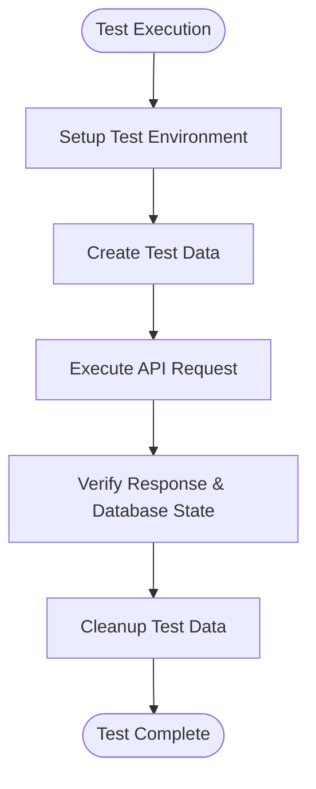
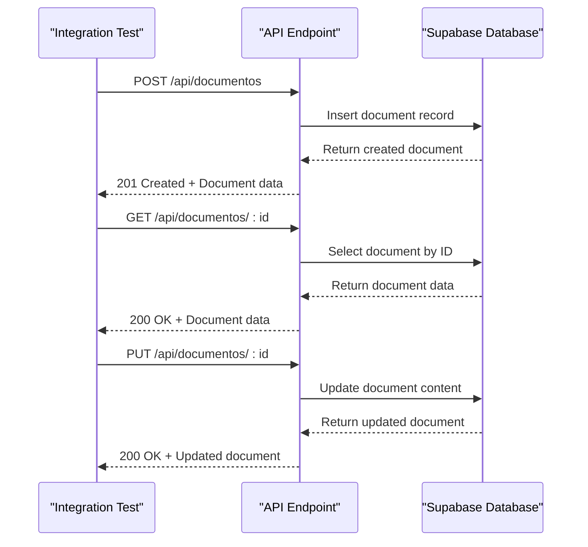
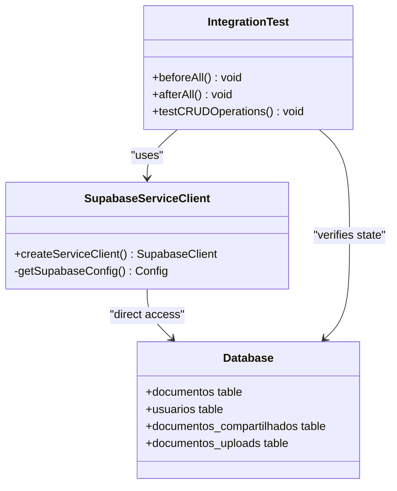
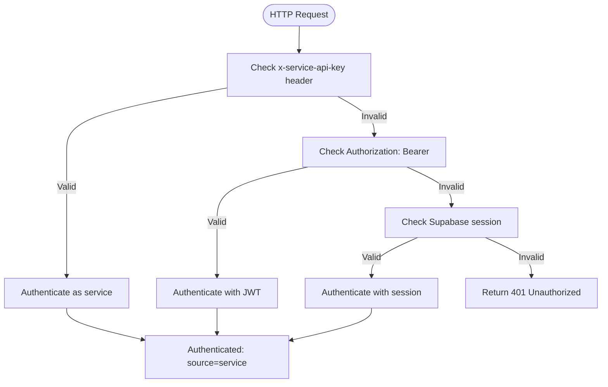
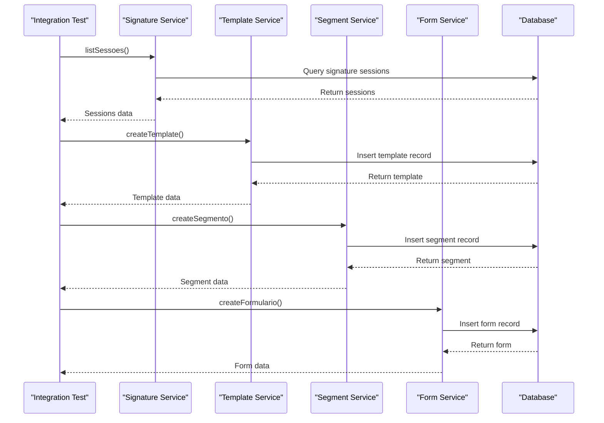
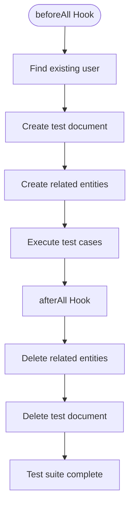
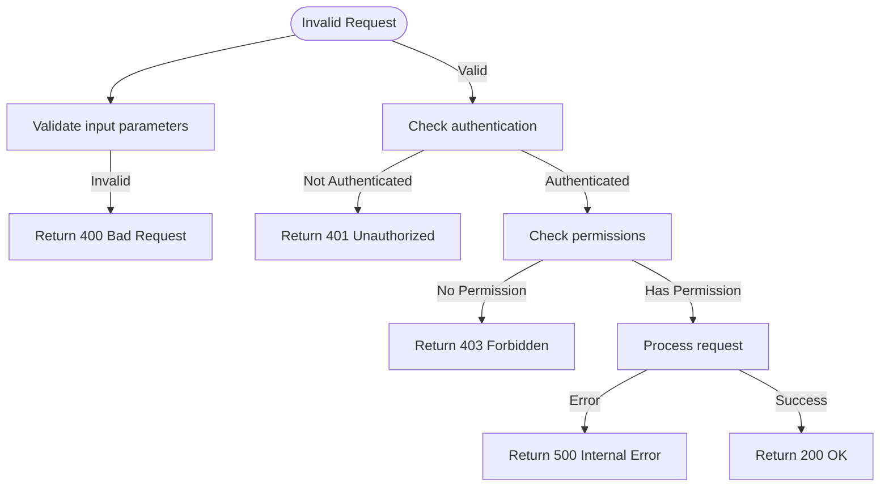

# Integration Tests

<cite>
**Referenced Files in This Document**   
- [documentos-api.integration.test.ts](file://tests/integration/documentos/documentos-api.integration.test.ts)
- [signature.integration.test.ts](file://tests/integration/assinatura-digital/signature.integration.test.ts)
- [compartilhamento-api.integration.test.ts](file://tests/integration/documentos/compartilhamento-api.integration.test.ts)
- [uploads-api.integration.test.ts](file://tests/integration/documentos/uploads-api.integration.test.ts)
- [setup.ts](file://tests/setup.ts)
- [service-client.ts](file://backend/utils/supabase/service-client.ts)
- [api-auth.ts](file://backend/auth/api-auth.ts)
- [authorization.ts](file://backend/auth/authorization.ts)
- [require-permission.ts](file://backend/auth/require-permission.ts)
</cite>

## Table of Contents
1. [Introduction](#introduction)
2. [Integration Testing Strategy](#integration-testing-strategy)
3. [API Endpoint Testing](#api-endpoint-testing)
4. [Supabase Integration Testing](#supabase-integration-testing)
5. [Authentication Flow Testing](#authentication-flow-testing)
6. [Service Interaction Testing](#service-interaction-testing)
7. [Test Data Management](#test-data-management)
8. [Error Scenario Testing](#error-scenario-testing)
9. [Best Practices for Integration Tests](#best-practices-for-integration-tests)
10. [Conclusion](#conclusion)

## Introduction

The integration testing strategy for Sinesys focuses on verifying the correct interaction between API endpoints and various services across the application. These tests ensure that components work together as expected, particularly in scenarios involving Supabase integration, authentication flows, database operations, and external service interactions. The strategy emphasizes testing real API routes with actual database interactions while maintaining isolation through proper test data management.

**Section sources**
- [documentos-api.integration.test.ts](file://tests/integration/documentos/documentos-api.integration.test.ts#L1-L215)
- [signature.integration.test.ts](file://tests/integration/assinatura-digital/signature.integration.test.ts#L1-L226)

## Integration Testing Strategy

Sinesys employs a comprehensive integration testing approach that verifies the interaction between multiple components through API endpoints. The tests are designed to validate the complete request-response cycle, including database operations, authentication checks, and business logic execution. The strategy uses Jest as the test runner with a node environment, configured to handle TypeScript files and collect coverage from backend and API routes.

The integration tests are organized by feature area, with dedicated test suites for different API endpoints such as document management, digital signature services, and file uploads. Each test suite follows a consistent pattern of setting up test data, executing API operations, and verifying the expected outcomes. The tests use Supabase's service client to interact directly with the database, bypassing Row Level Security (RLS) policies to ensure reliable test execution.

**Diagram sources **
- [setup.ts](file://tests/setup.ts#L1-L33)
- [documentos-api.integration.test.ts](file://tests/integration/documentos/documentos-api.integration.test.ts#L1-L215)

**Section sources**
- [jest.config.js](file://jest.config.js#L1-L34)
- [setup.ts](file://tests/setup.ts#L1-L33)

## API Endpoint Testing

The API endpoint testing strategy focuses on validating CRUD operations for various resources in the system. For document management APIs, tests verify the complete lifecycle of document creation, retrieval, update, and soft deletion. Each test case validates both the API response and the resulting database state to ensure consistency.

The document management API tests include validation of required fields, proper error handling for invalid inputs, and verification of business rules such as version incrementing when content is updated. The tests also verify soft delete functionality by checking that documents are marked as deleted rather than permanently removed from the database.

**Diagram sources **
- [documentos-api.integration.test.ts](file://tests/integration/documentos/documentos-api.integration.test.ts#L1-L215)
- [uploads-api.integration.test.ts](file://tests/integration/documentos/uploads-api.integration.test.ts#L1-L251)

**Section sources**
- [documentos-api.integration.test.ts](file://tests/integration/documentos/documentos-api.integration.test.ts#L1-L215)
- [uploads-api.integration.test.ts](file://tests/integration/documentos/uploads-api.integration.test.ts#L1-L251)

## Supabase Integration Testing

The Supabase integration testing strategy leverages the service client to perform direct database operations while simulating real API interactions. The `createServiceClient` function provides administrative access to the database, bypassing RLS policies to ensure reliable test execution. This approach allows tests to set up specific database states and verify the outcomes of API operations directly.

The integration tests use the service client to create test data, verify database records after API operations, and clean up test data after each test suite. This direct database access enables comprehensive testing of complex scenarios that would be difficult to achieve through API calls alone, such as testing edge cases and error conditions.

**Diagram sources **
- [service-client.ts](file://backend/utils/supabase/service-client.ts#L1-L60)
- [documentos-api.integration.test.ts](file://tests/integration/documentos/documentos-api.integration.test.ts#L1-L215)

**Section sources**
- [service-client.ts](file://backend/utils/supabase/service-client.ts#L1-L60)
- [documentos-api.integration.test.ts](file://tests/integration/documentos/documentos-api.integration.test.ts#L1-L215)

## Authentication Flow Testing

The authentication flow testing strategy validates the multi-layered authentication system in Sinesys, which supports three authentication methods: Supabase session (cookies), Bearer tokens (JWT), and service API keys. The tests verify that each authentication method works correctly and that the appropriate authorization checks are performed based on the authentication source.

The integration tests for authentication flows use the `authenticateRequest` function to verify that requests with valid credentials are properly authenticated and that requests with invalid or missing credentials receive appropriate error responses. The tests also validate that user permissions are correctly checked for operations requiring specific privileges.

**Diagram sources **
- [api-auth.ts](file://backend/auth/api-auth.ts#L1-L139)
- [require-permission.ts](file://backend/auth/require-permission.ts#L1-L111)

**Section sources**
- [api-auth.ts](file://backend/auth/api-auth.ts#L1-L139)
- [authorization.ts](file://backend/auth/authorization.ts#L1-L201)
- [require-permission.ts](file://backend/auth/require-permission.ts#L1-L111)

## Service Interaction Testing

The service interaction testing strategy focuses on verifying the integration between different services within the Sinesys application. For the digital signature service, tests validate the interaction between the signature service, template management, segment management, and form management components. The tests ensure that these services work together correctly when processing signature requests.

The integration tests for service interactions include validation of data consistency across related entities, proper error handling when dependencies are missing, and verification of business rules that span multiple services. For example, the signature service tests verify that templates, segments, and forms are properly linked and that operations fail gracefully when required dependencies are not present.

**Diagram sources **
- [signature.integration.test.ts](file://tests/integration/assinatura-digital/signature.integration.test.ts#L1-L226)
- [api-auth.ts](file://backend/auth/api-auth.ts#L1-L139)

**Section sources**
- [signature.integration.test.ts](file://tests/integration/assinatura-digital/signature.integration.test.ts#L1-L226)
- [compartilhamento-api.integration.test.ts](file://tests/integration/documentos/compartilhamento-api.integration.test.ts#L1-L218)

## Test Data Management

The test data management strategy in Sinesys ensures that integration tests have access to consistent and isolated test data while maintaining database integrity. The approach uses a combination of test setup and teardown procedures to create necessary test data before test execution and clean up after tests complete.

For document-related tests, the strategy involves creating test documents, users, and related entities in the `beforeAll` hook and removing them in the `afterAll` hook. This ensures that each test suite has a clean starting state and prevents test data from persisting between test runs. The tests use existing users from the database when possible to minimize setup complexity.

The test data management also includes handling of foreign key relationships and ensuring that cleanup operations respect database constraints. For example, when testing document sharing, the tests create a sharing record and ensure it is properly cleaned up before removing the associated document.

**Diagram sources **
- [documentos-api.integration.test.ts](file://tests/integration/documentos/documentos-api.integration.test.ts#L1-L215)
- [compartilhamento-api.integration.test.ts](file://tests/integration/documentos/compartilhamento-api.integration.test.ts#L1-L218)

**Section sources**
- [documentos-api.integration.test.ts](file://tests/integration/documentos/documentos-api.integration.test.ts#L1-L215)
- [compartilhamento-api.integration.test.ts](file://tests/integration/documentos/compartilhamento-api.integration.test.ts#L1-L218)
- [uploads-api.integration.test.ts](file://tests/integration/documentos/uploads-api.integration.test.ts#L1-L251)

## Error Scenario Testing

The error scenario testing strategy focuses on validating the system's behavior when encountering invalid inputs, missing dependencies, and other error conditions. The tests verify that appropriate error responses are returned with correct status codes and error messages.

For document management APIs, error scenarios include creating documents with empty titles, updating non-existent documents, and sharing documents with invalid permissions. The tests verify that the API returns appropriate error responses and that the database state remains consistent.

The authentication flow tests include error scenarios such as invalid API keys, expired JWT tokens, and missing authentication headers. These tests ensure that the system properly rejects unauthorized requests and returns appropriate error responses.

**Diagram sources **
- [documentos-api.integration.test.ts](file://tests/integration/documentos/documentos-api.integration.test.ts#L1-L215)
- [api-auth.ts](file://backend/auth/api-auth.ts#L1-L139)

**Section sources**
- [documentos-api.integration.test.ts](file://tests/integration/documentos/documentos-api.integration.test.ts#L1-L215)
- [signature.integration.test.ts](file://tests/integration/assinatura-digital/signature.integration.test.ts#L1-L226)
- [api-auth.ts](file://backend/auth/api-auth.ts#L1-L139)

## Best Practices for Integration Tests

The integration testing approach in Sinesys follows several best practices to ensure reliable and maintainable tests. Tests are organized by feature area with clear separation between different API endpoints and service interactions. Each test suite follows a consistent structure with proper setup and teardown procedures to maintain test isolation.

The tests use descriptive names that clearly indicate the scenario being tested and the expected outcome. This improves readability and makes it easier to identify failing tests. The test data is kept minimal and focused on the specific scenario being tested to reduce complexity and improve execution speed.

The integration tests avoid testing implementation details and instead focus on the observable behavior of the system. This approach makes the tests more resilient to code changes while still providing comprehensive coverage of the system's functionality.

**Section sources**
- [documentos-api.integration.test.ts](file://tests/integration/documentos/documentos-api.integration.test.ts#L1-L215)
- [signature.integration.test.ts](file://tests/integration/assinatura-digital/signature.integration.test.ts#L1-L226)
- [setup.ts](file://tests/setup.ts#L1-L33)

## Conclusion

The integration testing strategy for Sinesys provides comprehensive coverage of API endpoints and service interactions across the application. By testing real API routes with actual database operations, the strategy ensures that components work together correctly in realistic scenarios. The approach emphasizes test isolation, proper data management, and thorough validation of both success and error scenarios.

The use of Supabase's service client enables direct database access for reliable test setup and verification, while the multi-layered authentication testing ensures that security controls work as expected. The test organization by feature area and consistent test structure make the integration tests maintainable and easy to extend as the application evolves.