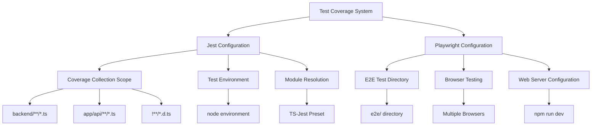
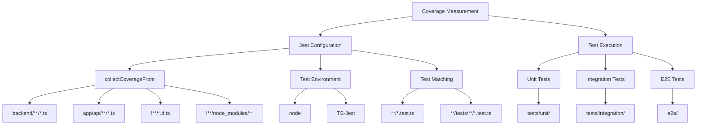
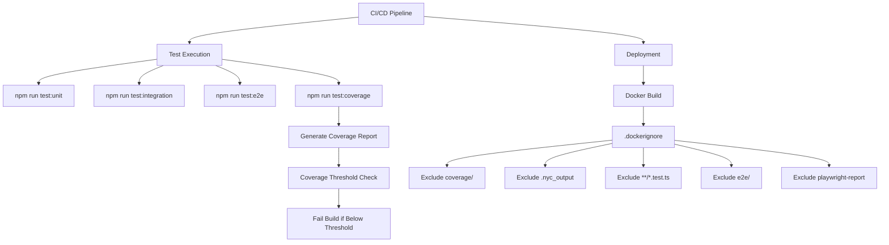
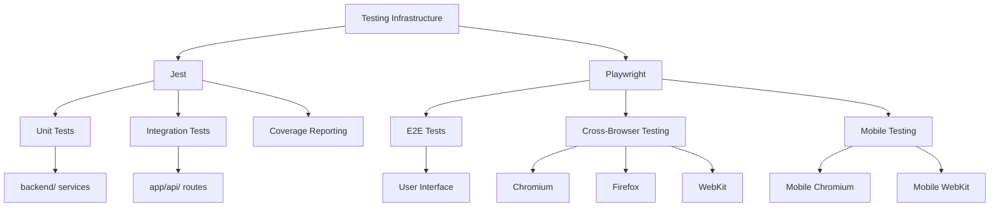

# Test Coverage and Reporting

<cite>
**Referenced Files in This Document**   
- [jest.config.js](file://jest.config.js)
- [playwright.config.ts](file://playwright.config.ts)
- [package.json](file://package.json)
- [tests/setup.ts](file://tests/setup.ts)
- [.dockerignore](file://.dockerignore)
</cite>

## Table of Contents
1. [Introduction](#introduction)
2. [Test Coverage Configuration](#test-coverage-configuration)
3. [Coverage Measurement Implementation](#coverage-measurement-implementation)
4. [Reporting and CI/CD Integration](#reporting-and-cicd-integration)
5. [Coverage Thresholds and Quality Control](#coverage-thresholds-and-quality-control)
6. [Testing Infrastructure Integration](#testing-infrastructure-integration)
7. [Common Coverage Challenges](#common-coverage-challenges)
8. [Coverage Report Interpretation](#coverage-report-interpretation)

## Introduction
The Sinesys application implements a comprehensive test coverage and reporting system using Jest for unit and integration testing, and Playwright for end-to-end testing. The coverage system is designed to ensure code quality, prevent regression, and maintain high standards across the codebase. This documentation details the implementation of code coverage measurement, reporting mechanisms, and integration with the development workflow.

## Test Coverage Configuration

The test coverage system in Sinesys is configured through Jest and Playwright, with specific settings to ensure comprehensive coverage measurement. The Jest configuration file defines the scope of coverage collection and test execution parameters.

The Jest configuration specifies that coverage should be collected from backend TypeScript files and API routes, while excluding type definition files and node_modules. This targeted approach ensures that coverage metrics focus on business logic and API implementations rather than third-party code or type definitions.

**Diagram sources**
- [jest.config.js](file://jest.config.js)
- [playwright.config.ts](file://playwright.config.ts)

**Section sources**
- [jest.config.js](file://jest.config.js)
- [playwright.config.ts](file://playwright.config.ts)

## Coverage Measurement Implementation

The coverage measurement system in Sinesys is implemented through Jest's built-in coverage capabilities, configured to collect coverage from specific directories containing business logic and API implementations. The configuration targets backend services and API routes, which contain the core functionality of the application.

The Jest configuration specifies the directories from which coverage should be collected using the `collectCoverageFrom` option. This includes all TypeScript files in the backend directory and API routes, ensuring that the most critical parts of the application are covered by tests. The configuration excludes type definition files and node_modules to focus coverage metrics on application code rather than dependencies.

The test setup file configures global test settings, including loading environment variables from .env.local and setting a default timeout for integration tests. It also includes a mock for console.error to prevent expected errors from polluting test output, improving the readability of test results.

**Diagram sources**
- [jest.config.js](file://jest.config.js)
- [tests/setup.ts](file://tests/setup.ts)

**Section sources**
- [jest.config.js](file://jest.config.js)
- [tests/setup.ts](file://tests/setup.ts)

## Reporting and CI/CD Integration

The test coverage reporting system is integrated into the development workflow through npm scripts and CI/CD pipeline configuration. The package.json file defines scripts for running different types of tests, including coverage reporting.

The test scripts include specific commands for running unit tests, integration tests, and end-to-end tests. The coverage script runs Jest with the --coverage flag, generating coverage reports in addition to running tests. This allows developers to easily generate coverage reports during development and in CI/CD pipelines.

The Docker configuration excludes test-related files and directories from the build context, optimizing deployment efficiency. This includes excluding coverage reports, test files, and e2e test directories, as these are not needed in production environments.

**Diagram sources**
- [package.json](file://package.json)
- [.dockerignore](file://.dockerignore)

**Section sources**
- [package.json](file://package.json)
- [.dockerignore](file://.dockerignore)

## Coverage Thresholds and Quality Control

The Sinesys application implements coverage thresholds to maintain code quality and prevent coverage regression. While the specific threshold values are not explicitly defined in the configuration files, the test infrastructure is designed to support threshold enforcement through Jest's coverage reporting capabilities.

The coverage system focuses on critical modules such as the document management system and financial calculations, which are located in the backend directory. By targeting these directories in the coverage configuration, the system ensures that the most important business logic is thoroughly tested.

The integration with CI/CD pipelines allows for automated enforcement of coverage thresholds. If coverage falls below a specified threshold, the build can be configured to fail, preventing low-coverage code from being deployed. This ensures that code quality is maintained across all changes to the codebase.

## Testing Infrastructure Integration

The test coverage system is tightly integrated with the overall testing infrastructure in Sinesys. Jest is used for unit and integration testing of backend services and API routes, while Playwright handles end-to-end testing of the frontend application.

The Playwright configuration sets up a web server for testing, starting the application with 'npm run dev' before running tests. This ensures that end-to-end tests are run against a running instance of the application, providing realistic testing conditions.

The test infrastructure supports testing across multiple browsers and devices, including desktop and mobile configurations. This ensures that the application works correctly across different environments and screen sizes.

**Diagram sources**
- [jest.config.js](file://jest.config.js)
- [playwright.config.ts](file://playwright.config.ts)

**Section sources**
- [jest.config.js](file://jest.config.js)
- [playwright.config.ts](file://playwright.config.ts)

## Common Coverage Challenges

The Sinesys application faces several common challenges in measuring test coverage, particularly for complex frontend components and third-party code integration. The coverage configuration addresses these challenges by focusing on application code rather than dependencies.

For complex frontend components, the application uses Playwright for end-to-end testing, which can provide more meaningful coverage metrics than unit tests alone. This is particularly important for components that involve complex user interactions or state management.

Third-party code is excluded from coverage measurement through the use of negation patterns in the collectCoverageFrom configuration. This prevents dependencies from skewing coverage metrics and allows the team to focus on testing their own code.

The system also addresses the challenge of ensuring meaningful coverage metrics by focusing on critical business logic in the backend and API routes. This targeted approach ensures that coverage metrics reflect the quality of the most important parts of the application.

## Coverage Report Interpretation

Interpreting coverage reports in Sinesys requires understanding the scope of coverage measurement and the limitations of coverage metrics. The reports generated by Jest provide detailed information about which lines, functions, branches, and statements are covered by tests.

Developers should focus on coverage of critical modules such as the document management system and financial calculations, which are located in the backend directory. High coverage in these areas indicates that the core business logic is well-tested.

When improving test quality, developers should consider not just the coverage percentage but also the quality of tests. Tests should cover edge cases, error conditions, and complex business rules, not just happy paths. The integration between unit, integration, and end-to-end tests provides a comprehensive testing strategy that ensures both individual components and the overall application work correctly.