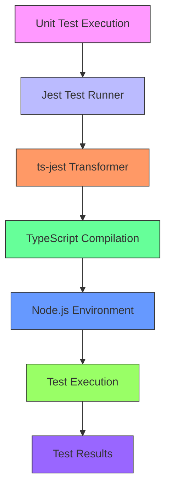
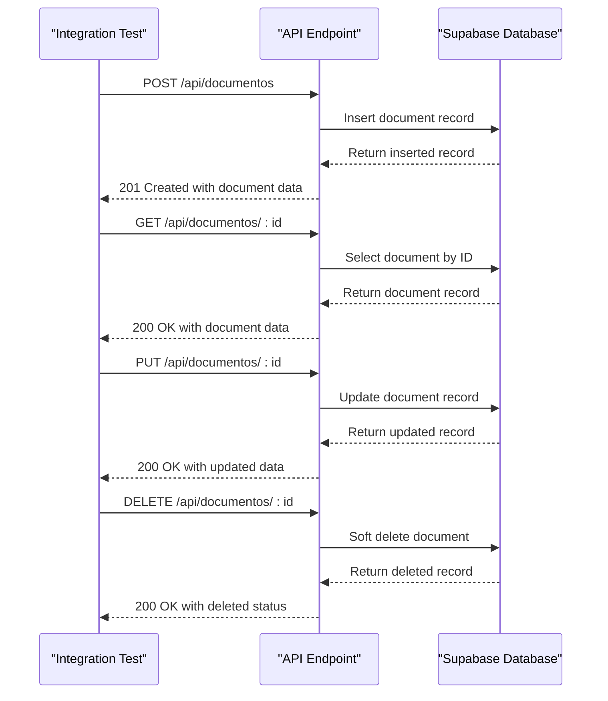
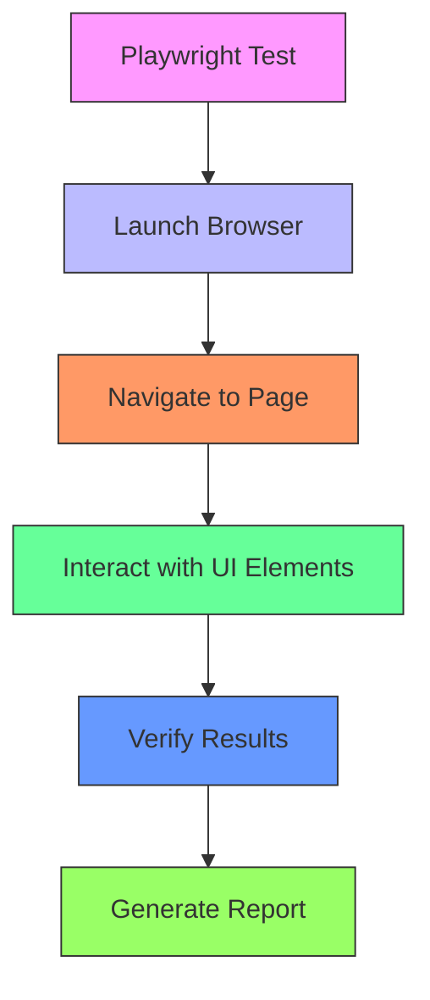
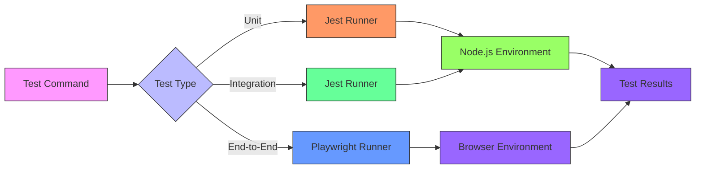

# Testing Strategy

<cite>
**Referenced Files in This Document**   
- [jest.config.js](file://jest.config.js)
- [playwright.config.ts](file://playwright.config.ts)
- [tests/setup.ts](file://tests/setup.ts)
- [tests/unit/captura/config-cache.test.ts](file://tests/unit/captura/config-cache.test.ts)
- [tests/unit/financeiro/obrigacoes-validacao.test.ts](file://tests/unit/financeiro/obrigacoes-validacao.test.ts)
- [tests/integration/documentos/documentos-api.integration.test.ts](file://tests/integration/documentos/documentos-api.integration.test.ts)
- [e2e/dashboard.spec.ts](file://e2e/dashboard.spec.ts)
- [e2e/documentos/documentos.spec.ts](file://e2e/documentos/documentos.spec.ts)
- [backend/utils/supabase/service-client.ts](file://backend/utils/supabase/service-client.ts)
- [package.json](file://package.json)
</cite>

## Table of Contents
1. [Introduction](#introduction)
2. [Multi-Layered Testing Approach](#multi-layered-testing-approach)
3. [Unit Testing with Jest](#unit-testing-with-jest)
4. [Integration Testing](#integration-testing)
5. [End-to-End Testing with Playwright](#end-to-end-testing-with-playwright)
6. [Testing Infrastructure](#testing-infrastructure)
7. [Common Testing Challenges and Solutions](#common-testing-challenges-and-solutions)
8. [Conclusion](#conclusion)

## Introduction
The Sinesys application implements a comprehensive multi-layered testing strategy to ensure code quality, reliability, and maintainability. The testing approach encompasses unit tests, integration tests, and end-to-end tests, each serving a specific purpose in the development lifecycle. This documentation provides an in-depth analysis of the testing strategy, covering the implementation details, infrastructure, and best practices used throughout the codebase.

**Section sources**
- [jest.config.js](file://jest.config.js)
- [playwright.config.ts](file://playwright.config.ts)
- [package.json](file://package.json)

## Multi-Layered Testing Approach
Sinesys employs a three-tiered testing strategy that follows industry best practices for modern web applications. The approach consists of unit tests for isolated components, integration tests for service interactions, and end-to-end tests for complete user workflows. This layered strategy ensures comprehensive test coverage while maintaining efficient test execution times.

The unit tests focus on individual functions and services, verifying their correctness in isolation. Integration tests validate the interactions between components, particularly API endpoints and database operations. End-to-end tests simulate real user scenarios across the entire application stack, ensuring that all components work together as expected.

This multi-layered approach provides several benefits:
- Early detection of bugs at the component level
- Verification of service interactions and API contracts
- Confidence in user-facing functionality
- Fast feedback during development
- Regression protection during refactoring

**Section sources**
- [jest.config.js](file://jest.config.js)
- [playwright.config.ts](file://playwright.config.ts)

## Unit Testing with Jest
The Sinesys application uses Jest as its primary testing framework for unit tests. The configuration is defined in `jest.config.js`, which specifies the test environment, module mappings, and file patterns for test discovery.

**Diagram sources**
- [jest.config.js](file://jest.config.js)

The unit tests are organized in the `tests/unit/` directory, with subdirectories for different modules such as `acervo/`, `captura/`, and `financeiro/`. Each test file follows the naming convention `*.test.ts` and is colocated with the code it tests or in a dedicated test directory.

The unit testing strategy includes several key patterns:
- Mocking of external dependencies using Jest's mocking capabilities
- Testing of business logic in isolation from the database and network
- Verification of edge cases and error conditions
- Code coverage measurement with collection from backend and API code

For example, the `config-cache.test.ts` file in the `captura` module tests the configuration cache service, including cache behavior, TTL handling, and invalidation logic. The tests use Jest's mocking features to isolate the service from its dependencies, ensuring that each test focuses on a specific aspect of the functionality.

**Section sources**
- [jest.config.js](file://jest.config.js)
- [tests/unit/captura/config-cache.test.ts](file://tests/unit/captura/config-cache.test.ts)
- [tests/unit/financeiro/obrigacoes-validacao.test.ts](file://tests/unit/financeiro/obrigacoes-validacao.test.ts)

## Integration Testing
Integration tests in Sinesys verify the interactions between components, particularly API endpoints and database operations. These tests are located in the `tests/integration/` directory and are designed to test the system as a whole, rather than isolated units.

The integration testing strategy includes:
- Testing API endpoints and their responses
- Verifying database operations and data consistency
- Mocking external services like PJE-TRT
- Using Supabase for database testing

The integration tests use the Supabase service client to interact with the database directly, allowing for setup and teardown of test data. This approach enables comprehensive testing of database operations while maintaining test isolation.

For example, the `documentos-api.integration.test.ts` file tests the CRUD operations for documents via the API. The test suite includes tests for creating, reading, updating, and deleting documents, as well as error conditions like creating a document without a title.

**Diagram sources**
- [tests/integration/documentos/documentos-api.integration.test.ts](file://tests/integration/documentos/documentos-api.integration.test.ts)
- [backend/utils/supabase/service-client.ts](file://backend/utils/supabase/service-client.ts)

The integration tests also include mocking of external services to ensure test reliability and speed. For example, when testing functionality that interacts with the PJE-TRT system, the external API calls are mocked to return predefined responses. This allows the tests to focus on the application logic without depending on external systems.

**Section sources**
- [tests/integration/documentos/documentos-api.integration.test.ts](file://tests/integration/documentos/documentos-api.integration.test.ts)
- [backend/utils/supabase/service-client.ts](file://backend/utils/supabase/service-client.ts)

## End-to-End Testing with Playwright
End-to-end tests in Sinesys use Playwright to simulate user workflows across the entire application. These tests are located in the `e2e/` directory and are designed to test complete user scenarios from the user interface through to the backend.

The Playwright configuration is defined in `playwright.config.ts`, which specifies the test directory, timeout settings, and browser configurations. The configuration includes support for multiple browsers (Chromium, Firefox, and WebKit) and device types (desktop and mobile).

**Diagram sources**
- [playwright.config.ts](file://playwright.config.ts)

The end-to-end tests cover key user workflows such as:
- Document management in the `documentos/` module
- Dashboard functionality in `dashboard.spec.ts`
- Form signing workflows in `formsign.spec.ts`
- Responsive design across different screen sizes

For example, the `documentos.spec.ts` file tests the document management functionality, including creating new documents, navigating between pages, and using the command menu. The tests verify that the UI elements are present and functional, and that user interactions produce the expected results.

The `dashboard.spec.ts` file includes tests for responsiveness, performance, and accessibility. These tests verify that the dashboard layout adapts correctly to different screen sizes, loads within acceptable time limits, and meets accessibility standards.

**Section sources**
- [playwright.config.ts](file://playwright.config.ts)
- [e2e/dashboard.spec.ts](file://e2e/dashboard.spec.ts)
- [e2e/documentos/documentos.spec.ts](file://e2e/documentos/documentos.spec.ts)

## Testing Infrastructure
The testing infrastructure in Sinesys is designed to support efficient and reliable test execution. The infrastructure includes test runners, configuration files, and supporting utilities that enable comprehensive testing across all layers of the application.

The `package.json` file defines several npm scripts for running tests:
- `test`: Runs all Jest tests
- `test:watch`: Runs Jest tests in watch mode
- `test:coverage`: Runs Jest tests with coverage reporting
- `test:integration`: Runs only integration tests
- `test:unit`: Runs only unit tests
- `test:e2e`: Runs Playwright end-to-end tests

**Diagram sources**
- [package.json](file://package.json)
- [jest.config.js](file://jest.config.js)
- [playwright.config.ts](file://playwright.config.ts)

The test setup is configured in `tests/setup.ts`, which loads environment variables, sets test timeouts, and configures console error handling. This file ensures that all tests run in a consistent environment with the necessary configuration.

The testing infrastructure also includes support for test data management, mocking strategies, and test reliability. For example, the integration tests use the Supabase service client to manage test data, while the unit tests use Jest's mocking capabilities to isolate components.

**Section sources**
- [package.json](file://package.json)
- [tests/setup.ts](file://tests/setup.ts)
- [jest.config.js](file://jest.config.js)
- [playwright.config.ts](file://playwright.config.ts)

## Common Testing Challenges and Solutions
The Sinesys testing strategy addresses several common challenges in software testing, providing solutions that ensure test reliability, maintainability, and effectiveness.

### Testing Asynchronous Operations
Asynchronous operations are common in modern web applications, and testing them requires special consideration. Sinesys addresses this challenge by using Jest's async/await support and Playwright's built-in waiting mechanisms.

In unit tests, asynchronous functions are tested using async/await syntax, ensuring that the test waits for the operation to complete before making assertions. In end-to-end tests, Playwright automatically waits for elements to be available before interacting with them, reducing the need for explicit timeouts.

### Handling Authentication in Tests
Authentication can complicate testing by requiring users to be logged in before accessing protected functionality. Sinesys handles this challenge by using mocked authentication in tests, allowing the tests to focus on the application logic rather than the authentication flow.

For example, the end-to-end tests use a beforeEach hook to navigate to the application root, but do not include login steps. This suggests that the test environment may have authentication bypassed or mocked, allowing the tests to focus on the functionality being tested.

### Ensuring Test Reliability
Test reliability is critical for maintaining confidence in the test suite. Sinesys addresses this challenge through several strategies:
- Using deterministic test data
- Isolating tests from external dependencies
- Using appropriate timeouts and waiting mechanisms
- Cleaning up test data after each test

For example, the integration tests use the Supabase service client to create and clean up test data, ensuring that each test runs in a clean environment. The end-to-end tests use Playwright's built-in waiting mechanisms to avoid flakiness caused by timing issues.

### Mocking External Services
External services like PJE-TRT can introduce instability and slowness to tests. Sinesys addresses this challenge by mocking external services, allowing the tests to focus on the application logic without depending on external systems.

The unit tests use Jest's mocking capabilities to mock external dependencies, while the integration tests may use service mocks or test doubles. This approach ensures that the tests are fast, reliable, and focused on the functionality being tested.

**Section sources**
- [tests/unit/captura/config-cache.test.ts](file://tests/unit/captura/config-cache.test.ts)
- [tests/integration/documentos/documentos-api.integration.test.ts](file://tests/integration/documentos/documentos-api.integration.test.ts)
- [e2e/dashboard.spec.ts](file://e2e/dashboard.spec.ts)
- [e2e/documentos/documentos.spec.ts](file://e2e/documentos/documentos.spec.ts)

## Conclusion
The Sinesys application implements a comprehensive and well-structured testing strategy that covers all aspects of the application. The multi-layered approach, combining unit tests, integration tests, and end-to-end tests, provides comprehensive coverage while maintaining efficient test execution times.

The use of Jest for unit and integration testing, combined with Playwright for end-to-end testing, provides a robust testing infrastructure that supports the development of high-quality software. The testing strategy addresses common challenges such as asynchronous operations, authentication, and external service dependencies, ensuring that the tests are reliable and maintainable.

By following this testing strategy, the Sinesys development team can maintain confidence in the application's functionality, catch bugs early in the development process, and ensure that changes do not introduce regressions. The comprehensive test coverage provides a solid foundation for ongoing development and maintenance of the application.