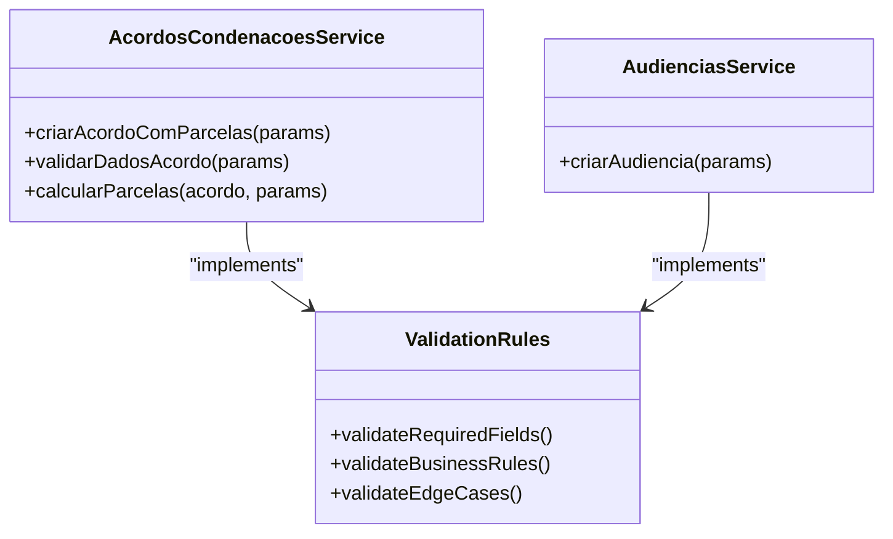
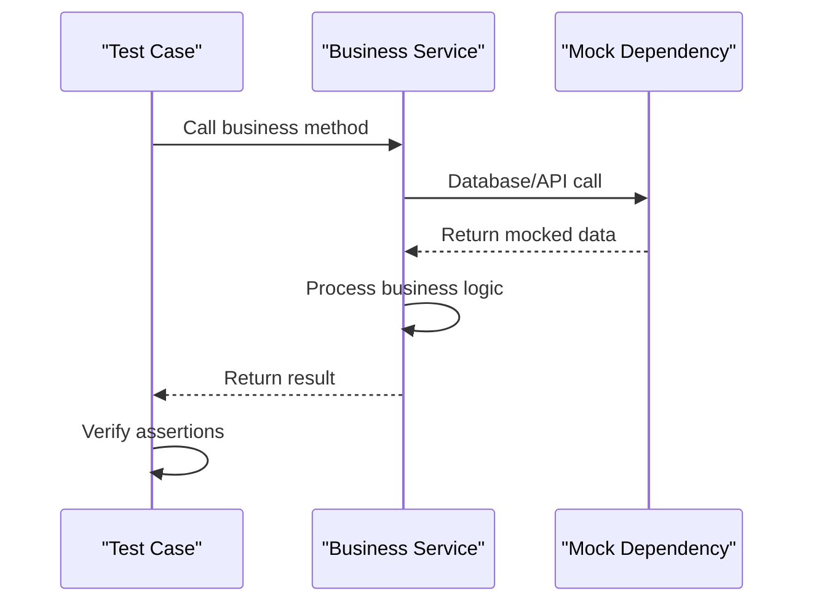
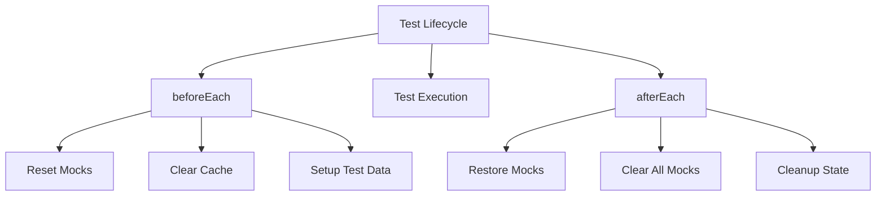

# Unit Tests

<cite>
**Referenced Files in This Document**   
- [jest.config.js](file://jest.config.js)
- [tests/setup.ts](file://tests/setup.ts)
- [tests/unit/acervo/timeline-unificada.test.ts](file://tests/unit/acervo/timeline-unificada.test.ts)
- [tests/unit/captura/config-cache.test.ts](file://tests/unit/captura/config-cache.test.ts)
- [tests/unit/financeiro/obrigacoes-validacao.test.ts](file://tests/unit/financeiro/obrigacoes-validacao.test.ts)
- [backend/acordos-condenacoes/services/acordos-condenacoes/criar-acordo-condenacao.service.ts](file://backend/acordos-condenacoes/services/acordos-condenacoes/criar-acordo-condenacao.service.ts)
- [backend/audiencias/services/criar-audiencia.service.ts](file://backend/audiencias/services/criar-audiencia.service.ts)
- [backend/acordos-condenacoes/services/persistence/acordo-condenacao-persistence.service.ts](file://backend/acordos-condenacoes/services/persistence/acordo-condenacao-persistence.service.ts)
- [backend/acordos-condenacoes/services/persistence/parcela-persistence.service.ts](file://backend/acordos-condenacoes/services/persistence/parcela-persistence.service.ts)
- [backend/audiencias/services/persistence/listar-audiencias.service.ts](file://backend/audiencias/services/persistence/listar-audiencias.service.ts)
</cite>

## Table of Contents
1. [Introduction](#introduction)
2. [Testing Framework and Configuration](#testing-framework-and-configuration)
3. [Test Organization and Structure](#test-organization-and-structure)
4. [Service Testing Patterns](#service-testing-patterns)
5. [Testing Dependencies and External Services](#testing-dependencies-and-external-services)
6. [Test Setup and Lifecycle Management](#test-setup-and-lifecycle-management)
7. [Assertion Strategies and Validation](#assertion-strategies-and-validation)
8. [Testing Asynchronous Operations](#testing-asynchronous-operations)
9. [Common Testing Challenges](#common-testing-challenges)
10. [Best Practices and Guidelines](#best-practices-and-guidelines)

## Introduction

The Sinesys application implements a comprehensive unit testing strategy using Jest as the primary testing framework for backend services and business logic components. The testing approach focuses on validating service classes such as AcordosCondenacoesService and AudienciasService, with particular attention to business rules, data validation, and integration points. The unit tests are designed to verify the correctness of business logic while isolating dependencies through mocking and test doubles. This documentation provides a detailed analysis of the unit testing implementation, covering testing patterns, dependency management, setup procedures, and best practices followed throughout the codebase.

**Section sources**
- [jest.config.js](file://jest.config.js)
- [tests/setup.ts](file://tests/setup.ts)

## Testing Framework and Configuration

The Sinesys application uses Jest as its primary testing framework with a configuration optimized for TypeScript and Node.js environments. The Jest configuration is defined in jest.config.js, which sets up the test environment with the ts-jest preset for TypeScript compilation and specifies the test environment as 'node' since the tests focus on backend services. The configuration includes module name mapping to support absolute imports using the @/ alias, which maps to the root directory. Test files are discovered through a pattern that includes files in the __tests__ directory, tests directory, and any file with the .test.ts extension. The configuration also sets up code coverage collection from backend and API directories while excluding type definition files and node_modules. A setup file (tests/setup.ts) is configured to run before all tests, which loads environment variables from .env.local and sets a default timeout of 30 seconds for integration tests. The setup also includes a mock for console.error to suppress expected warnings and errors during test execution, preventing test output from being cluttered with non-critical messages.

```mermaid
flowchart TD
A["Jest Configuration"] --> B["Framework: Jest"]
A --> C["Preset: ts-jest"]
A --> D["Environment: node"]
A --> E["Module Mapping: @/ → rootDir"]
A --> F["Test Match Patterns"]
A --> G["Coverage Collection"]
A --> H["Setup Files: setup.ts"]
H --> I["Load .env.local"]
H --> J["Set 30s Timeout"]
H --> K["Mock console.error"]
```

**Diagram sources **
- [jest.config.js](file://jest.config.js#L1-L34)
- [tests/setup.ts](file://tests/setup.ts#L1-L33)

**Section sources**
- [jest.config.js](file://jest.config.js#L1-L34)
- [tests/setup.ts](file://tests/setup.ts#L1-L33)

## Test Organization and Structure

The unit tests in Sinesys are organized in a dedicated tests/unit directory, with subdirectories corresponding to different functional areas of the application such as acervo, captura, and financeiro. This structure mirrors the organization of the backend services, making it easy to locate tests for specific components. Each test file follows the naming convention of [feature].test.ts, clearly indicating its purpose and the component it tests. The tests are written using Jest's describe-it-expect pattern, with describe blocks used to group related test cases by functionality or validation type. Within each describe block, individual test cases use the it function to describe the specific behavior being tested, followed by assertions using expect to verify the expected outcomes. The test files often include fixture functions to create consistent test data, reducing duplication and improving test readability. For example, the timeline-unificada.test.ts file includes criarItemBase and criarItemUnificado functions to generate consistent timeline items for testing deduplication logic. This organizational approach ensures that tests are discoverable, maintainable, and focused on specific aspects of the system's behavior.

**Section sources**
- [tests/unit/acervo/timeline-unificada.test.ts](file://tests/unit/acervo/timeline-unificada.test.ts#L1-L390)
- [tests/unit/captura/config-cache.test.ts](file://tests/unit/captura/config-cache.test.ts#L1-L436)
- [tests/unit/financeiro/obrigacoes-validacao.test.ts](file://tests/unit/financeiro/obrigacoes-validacao.test.ts#L1-L587)

## Service Testing Patterns

The unit tests for service classes in Sinesys follow consistent patterns for testing business logic and validation rules. For the AcordosCondenacoesService, tests focus on validating the creation of agreements with installments, including business rules for different agreement types and directions. The criar-acordo-condenacao.service.ts implementation includes comprehensive validation logic that is thoroughly tested, such as ensuring that court costs must be a single installment and that receivables must have a distribution method defined. Similarly, the AudienciasService tests validate the creation of hearings, including the proper population of process data and validation of hearing types. The tests verify that required fields are present, business rules are enforced, and appropriate errors are thrown when validation fails. Test cases are organized by validation category, with separate describe blocks for different types of validation such as field validation, business rule validation, and edge cases. This approach ensures comprehensive coverage of the service's behavior while maintaining clear and focused test cases that are easy to understand and maintain.

**Diagram sources **
- [backend/acordos-condenacoes/services/acordos-condenacoes/criar-acordo-condenacao.service.ts](file://backend/acordos-condenacoes/services/acordos-condenacoes/criar-acordo-condenacao.service.ts#L43-L106)
- [backend/audiencias/services/criar-audiencia.service.ts](file://backend/audiencias/services/criar-audiencia.service.ts#L9-L109)

**Section sources**
- [backend/acordos-condenacoes/services/acordos-condenacoes/criar-acordo-condenacao.service.ts](file://backend/acordos-condenacoes/services/acordos-condenacoes/criar-acordo-condenacao.service.ts#L43-L106)
- [backend/audiencias/services/criar-audiencia.service.ts](file://backend/audiencias/services/criar-audiencia.service.ts#L9-L109)
- [tests/unit/financeiro/obrigacoes-validacao.test.ts](file://tests/unit/financeiro/obrigacoes-validacao.test.ts#L139-L411)

## Testing Dependencies and External Services

Sinesys employs extensive mocking to isolate unit tests from external dependencies and services. The tests use Jest's mocking capabilities to replace database access, external APIs, and authentication services with test doubles that simulate the behavior of the real components. For example, in the config-cache.test.ts file, the tribunal-config-persistence.service is mocked to test the caching behavior of the configuration service without requiring a real database connection. The mock functions (mockGetConfigByTRTAndGrau and mockListAllConfigs) are used to simulate database responses, allowing tests to verify cache hits, misses, and invalidation logic. Similarly, the obrigacoes-validacao.test.ts file mocks the Supabase client to test validation logic without accessing the actual database. The mock implementation simulates the query chain (from-select-eq-single) and returns predefined responses, enabling tests to verify how the service handles different data scenarios. This approach ensures that unit tests are fast, reliable, and focused on the business logic rather than the integration with external systems.

**Diagram sources **
- [tests/unit/captura/config-cache.test.ts](file://tests/unit/captura/config-cache.test.ts#L19-L28)
- [tests/unit/financeiro/obrigacoes-validacao.test.ts](file://tests/unit/financeiro/obrigacoes-validacao.test.ts#L15-L29)

**Section sources**
- [tests/unit/captura/config-cache.test.ts](file://tests/unit/captura/config-cache.test.ts#L19-L28)
- [tests/unit/financeiro/obrigacoes-validacao.test.ts](file://tests/unit/financeiro/obrigacoes-validacao.test.ts#L15-L29)
- [backend/acordos-condenacoes/services/persistence/acordo-condenacao-persistence.service.ts](file://backend/acordos-condenacoes/services/persistence/acordo-condenacao-persistence.service.ts)
- [backend/acordos-condenacoes/services/persistence/parcela-persistence.service.ts](file://backend/acordos-condenacoes/services/persistence/parcela-persistence.service.ts)

## Test Setup and Lifecycle Management

The Sinesys unit tests implement comprehensive setup and lifecycle management to ensure test isolation and consistency. Each test file includes beforeEach and afterEach hooks to reset mocks and clear caches between test cases, preventing state leakage between tests. The config-cache.test.ts file demonstrates this pattern with a resetMocks function that clears mock call histories and resets the configuration cache before each test. This ensures that each test starts with a clean state and can reliably verify the behavior of the caching mechanism. The tests also use Jest's mockReset and clearAllMocks functions to completely reset mock implementations between test suites. For database-related tests, the setup includes creating mock data structures that simulate the shape of real database records, allowing tests to verify data transformations and business logic without requiring a real database connection. The lifecycle management approach ensures that tests are independent, repeatable, and free from side effects that could cause intermittent failures.

**Diagram sources **
- [tests/unit/captura/config-cache.test.ts](file://tests/unit/captura/config-cache.test.ts#L69-L73)
- [tests/unit/financeiro/obrigacoes-validacao.test.ts](file://tests/unit/financeiro/obrigacoes-validacao.test.ts#L100-L127)

**Section sources**
- [tests/unit/captura/config-cache.test.ts](file://tests/unit/captura/config-cache.test.ts#L69-L73)
- [tests/unit/financeiro/obrigacoes-validacao.test.ts](file://tests/unit/financeiro/obrigacoes-validacao.test.ts#L100-L127)

## Assertion Strategies and Validation

The unit tests in Sinesys employ a comprehensive approach to assertions and validation, focusing on both positive and negative test cases to ensure robustness. The tests use Jest's expect function with a variety of matchers to verify the behavior of service methods, including toBe, toEqual, toContain, and toThrow. For complex validation scenarios, the tests verify multiple aspects of the result, such as the validity flag, error messages, and detailed validation information. The obrigacoes-validacao.test.ts file demonstrates this approach by testing various validation rules for financial obligations, including existence checks, status validation, value validation, and account validation. The tests verify not only whether the validation passes or fails but also the specific reasons for failure, ensuring that error messages are accurate and helpful. The tests also validate performance characteristics by checking the execution time of validation operations, ensuring that they meet performance requirements. This comprehensive assertion strategy provides confidence that the business logic is correct and handles edge cases appropriately.

**Section sources**
- [tests/unit/financeiro/obrigacoes-validacao.test.ts](file://tests/unit/financeiro/obrigacoes-validacao.test.ts#L151-L411)
- [tests/unit/acervo/timeline-unificada.test.ts](file://tests/unit/acervo/timeline-unificada.test.ts#L54-L389)

## Testing Asynchronous Operations

The Sinesys application extensively tests asynchronous operations, which are common in backend services that interact with databases and external APIs. The tests use async/await syntax to handle promises and ensure that asynchronous operations complete before assertions are made. The test setup includes proper handling of rejected promises, with tests using expect().rejects.toThrow to verify that appropriate errors are thrown when operations fail. The tests also verify the proper handling of edge cases such as network timeouts and database connection errors, ensuring that the application fails gracefully and provides meaningful error messages. For operations that involve multiple asynchronous steps, the tests verify the correct sequence of operations and proper error handling at each step. The use of async/await makes the test code more readable and easier to understand, while still ensuring that asynchronous operations are properly awaited and their results validated.

**Section sources**
- [backend/audiencias/services/criar-audiencia.service.ts](file://backend/audiencias/services/criar-audiencia.service.ts#L9-L109)
- [tests/unit/financeiro/obrigacoes-validacao.test.ts](file://tests/unit/financeiro/obrigacoes-validacao.test.ts#L153-L162)

## Common Testing Challenges

The Sinesys unit tests address several common challenges in testing backend services, particularly around database transactions, test isolation, and complex business rules. One challenge is testing services that depend on database state without creating coupling between tests. The solution implemented in Sinesys is to use comprehensive mocking of database access, allowing tests to simulate different database states without requiring actual database transactions. Another challenge is testing services with complex validation rules and business logic, such as the agreement creation service that must validate multiple interdependent fields. The tests address this by breaking down the validation into discrete test cases, each focusing on a specific rule or edge case. The tests also address the challenge of testing caching behavior by mocking the underlying data source and verifying cache hits and misses. These approaches ensure that the tests are reliable, fast, and focused on the specific behavior being tested, rather than the integration with external systems.

**Section sources**
- [tests/unit/captura/config-cache.test.ts](file://tests/unit/captura/config-cache.test.ts#L155-L166)
- [tests/unit/financeiro/obrigacoes-validacao.test.ts](file://tests/unit/financeiro/obrigacoes-validacao.test.ts#L151-L411)

## Best Practices and Guidelines

The unit testing strategy in Sinesys follows several best practices that contribute to maintainable and effective tests. First, tests are focused on business logic rather than implementation details, allowing the underlying code to evolve without breaking tests unnecessarily. Second, the tests use descriptive names for test cases that clearly communicate the behavior being tested, making it easy to understand what each test does. Third, the tests are isolated from external dependencies through comprehensive mocking, ensuring that they are fast and reliable. Fourth, the tests include comprehensive coverage of edge cases and error conditions, not just happy path scenarios. Finally, the tests are organized in a logical structure that mirrors the application's architecture, making it easy to locate tests for specific components. These practices ensure that the test suite remains valuable as the application evolves, providing confidence in the correctness of the codebase while minimizing maintenance overhead.

**Section sources**
- [tests/unit/acervo/timeline-unificada.test.ts](file://tests/unit/acervo/timeline-unificada.test.ts#L54-L389)
- [tests/unit/captura/config-cache.test.ts](file://tests/unit/captura/config-cache.test.ts#L79-L435)
- [tests/unit/financeiro/obrigacoes-validacao.test.ts](file://tests/unit/financeiro/obrigacoes-validacao.test.ts#L142-L586)