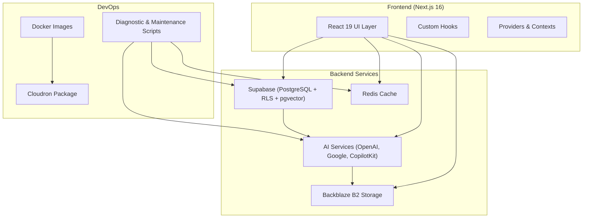
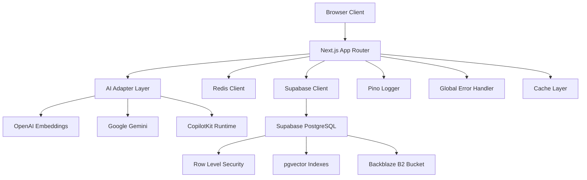
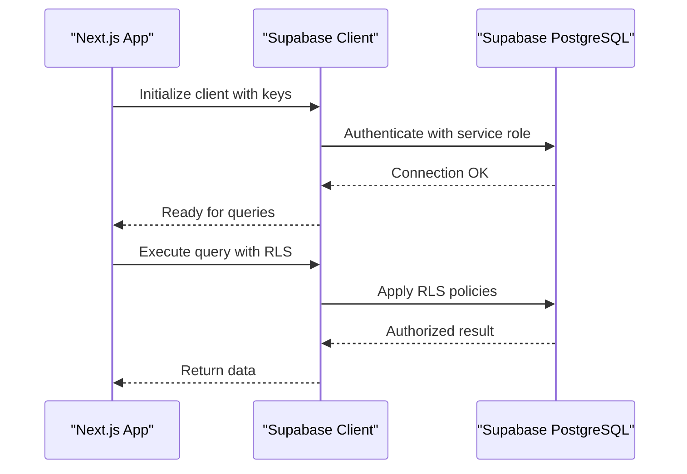
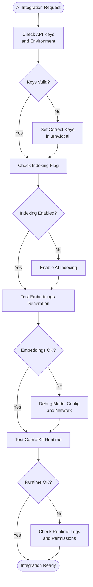
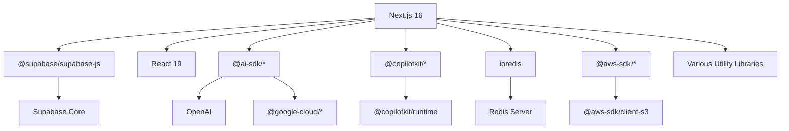

# Troubleshooting and FAQ

<cite>
**Referenced Files in This Document**
- [README.md](file://README.md)
- [package.json](file://package.json)
- [supabase/README.md](file://supabase/README.md)
- [supabase/MIGRATION_CHECKLIST.md](file://supabase/MIGRATION_CHECKLIST.md)
- [cloudron/CLI-REFERENCE.md](file://cloudron/CLI-REFERENCE.md)
- [.env.example](file://.env.example)
- [src/app/(ajuda)/ajuda/desenvolvimento/troubleshooting/page.tsx](file://src/app/(ajuda)/ajuda/desenvolvimento/troubleshooting/page.tsx)
- [src/app/(authenticated)/captura/services/partes/errors.ts](file://src/app/(authenticated)/captura/services/partes/errors.ts)
- [scripts/database/diagnostico-disk-io.ts](file://scripts/database/diagnostico-disk-io.ts)
- [scripts/db/check-bloat.ts](file://scripts/db/check-bloat.ts)
- [scripts/docker/check-docker-resources.sh](file://scripts/docker/check-docker-resources.sh)
- [scripts/docker/check-memory-requirements.sh](file://scripts/docker/check-memory-requirements.sh)
- [scripts/docker/cleanup-docker.sh](file://scripts/docker/cleanup-docker.sh)
- [scripts/security/check-secrets.js](file://scripts/security/check-secrets.js)
- [scripts/security/check-plaintext-storage.js](file://scripts/security/check-plaintext-storage.js)
- [scripts/mcp/check-registry.ts](file://scripts/mcp/check-registry.ts)
- [scripts/ai/index-existing-documents.ts](file://scripts/ai/index-existing-documents.ts)
- [scripts/ai/reindex-all.ts](file://scripts/ai/reindex-all.ts)
- [scripts/database/apply-migrations-via-supabase-sdk.ts](file://scripts/database/apply-migrations-via-supabase-sdk.ts)
- [scripts/database/check-applied-migrations.ts](file://scripts/database/check-applied-migrations.ts)
- [scripts/storage/test-backblaze-connection.ts](file://scripts/storage/test-backblaze-connection.ts)
- [scripts/storage/configure-backblaze-bucket.ts](file://scripts/storage/test-backblaze-connection.ts)
- [scripts/captura/audiencias/test-api-audiencias.ts](file://scripts/captura/audiencias/test-api-audiencias.ts)
- [scripts/captura/partes/test-captura-partes.ts](file://scripts/captura/partes/test-captura-partes.ts)
- [scripts/captura/pendentes/test-api-pendentes-manifestacao.ts](file://scripts/captura/pendentes/test-api-pendentes-manifestacao.ts)
- [scripts/captura/timeline/test-timeline-exploratorio.ts](file://scripts/captura/timeline/test-timeline-exploratorio.ts)
- [scripts/sincronizacao/sincronizar-partes-processos.ts](file://scripts/sincronizacao/sincronizar-partes-processos.ts)
- [scripts/sincronizacao/resolver-cadastros-pje-unknown.ts](file://scripts/sincronizacao/resolver-cadastros-pje-unknown.ts)
- [scripts/sincronizacao/corrigir-entidades-polo.ts](file://scripts/sincronizacao/corrigir-entidades-polo.ts)
- [scripts/usuarios/sincronizar-usuarios.ts](file://scripts/usuarios/sincronizar-usuarios.ts)
- [scripts/load-test/scenarios/smoke.js](file://scripts/load-test/scenarios/smoke.js)
- [src/lib/logger/index.ts](file://src/lib/logger/index.ts)
- [src/lib/supabase/index.ts](file://src/lib/supabase/index.ts)
- [src/lib/redis/index.ts](file://src/lib/redis/index.ts)
- [src/lib/ai/index.ts](file://src/lib/ai/index.ts)
- [src/lib/mcp/index.ts](file://src/lib/mcp/index.ts)
- [src/lib/storage/backblaze.ts](file://src/lib/storage/backblaze.ts)
- [src/lib/domain/processos/service.ts](file://src/lib/domain/processos/service.ts)
- [src/lib/domain/partes/service.ts](file://src/lib/domain/partes/service.ts)
- [src/lib/domain/audiencias/service.ts](file://src/lib/domain/audiencias/service.ts)
- [src/lib/domain/pendentes-manifestacao/service.ts](file://src/lib/domain/pendentes-manifestacao/service.ts)
- [src/lib/domain/timeline/service.ts](file://src/lib/domain/timeline/service.ts)
- [src/lib/integracoes/index.ts](file://src/lib/integracoes/index.ts)
- [src/lib/utils/error-handler.ts](file://src/lib/utils/error-handler.ts)
- [src/lib/utils/performance.ts](file://src/lib/utils/performance.ts)
- [src/lib/utils/memory.ts](file://src/lib/utils/memory.ts)
- [src/lib/utils/deployment.ts](file://src/lib/utils/deployment.ts)
- [src/lib/utils/validation.ts](file://src/lib/utils/validation.ts)
- [src/lib/utils/cache.ts](file://src/lib/utils/cache.ts)
- [src/lib/utils/security.ts](file://src/lib/utils/security.ts)
- [src/lib/utils/network.ts](file://src/lib/utils/network.ts)
- [src/lib/utils/system.ts](file://src/lib/utils/system.ts)
- [src/lib/utils/testing.ts](file://src/lib/utils/testing.ts)
- [src/lib/utils/logging.ts](file://src/lib/utils/logging.ts)
- [src/lib/utils/monitoring.ts](file://src/lib/utils/monitoring.ts)
- [src/lib/utils/performance.ts](file://src/lib/utils/performance.ts)
- [src/lib/utils/memory.ts](file://src/lib/utils/memory.ts)
- [src/lib/utils/deployment.ts](file://src/lib/utils/deployment.ts)
- [src/lib/utils/validation.ts](file://src/lib/utils/validation.ts)
- [src/lib/utils/cache.ts](file://src/lib/utils/cache.ts)
- [src/lib/utils/security.ts](file://src/lib/utils/security.ts)
- [src/lib/utils/network.ts](file://src/lib/utils/network.ts)
- [src/lib/utils/system.ts](file://src/lib/utils/system.ts)
- [src/lib/utils/testing.ts](file://src/lib/utils/testing.ts)
- [src/lib/utils/logging.ts](file://src/lib/utils/logging.ts)
- [src/lib/utils/monitoring.ts](file://src/lib/utils/monitoring.ts)
</cite>

## Table of Contents
1. [Introduction](#introduction)
2. [Project Structure](#project-structure)
3. [Core Components](#core-components)
4. [Architecture Overview](#architecture-overview)
5. [Detailed Component Analysis](#detailed-component-analysis)
6. [Dependency Analysis](#dependency-analysis)
7. [Performance Considerations](#performance-considerations)
8. [Troubleshooting Guide](#troubleshooting-guide)
9. [Conclusion](#conclusion)
10. [Appendices](#appendices)

## Introduction
This document provides comprehensive troubleshooting and FAQ guidance for the ZattarOS legal management system. It covers common setup issues, database connectivity problems, AI integration failures, and deployment challenges. It also explains debugging techniques for Next.js applications, Supabase connectivity, and AI service integration, along with performance troubleshooting, memory leak detection, optimization strategies, migration issues, breaking changes, and upgrade procedures. Step-by-step resolution guides, diagnostic commands, and escalation procedures are included for complex issues.

## Project Structure
The project follows a Feature-Sliced Design (FSD) colocated architecture within Next.js 16 App Router. The application integrates Supabase for PostgreSQL, RLS, and pgvector, Redis for caching, and AI services for semantic search and document editing. Deployment targets include Cloudron and Docker environments.

**Diagram sources**
- [README.md:43-68](file://README.md#L43-L68)
- [package.json:135-324](file://package.json#L135-L324)
- [cloudron/CLI-REFERENCE.md:1-180](file://cloudron/CLI-REFERENCE.md#L1-L180)

**Section sources**
- [README.md:10-68](file://README.md#L10-L68)
- [package.json:1-409](file://package.json#L1-L409)

## Core Components
Key components and their roles:
- Next.js 16 App Router with React 19 and TypeScript 5
- Supabase for database, authentication, and real-time subscriptions
- Redis for distributed caching and rate limiting
- AI services for embeddings and document editing (OpenAI, Google, CopilotKit)
- Backblaze B2 for document storage
- Cloudron packaging and deployment
- Feature-Sliced Design (FSD) colocated modules

Common environment variables include Supabase keys, AI gateway keys, Redis configuration, cron secret, and storage provider settings.

**Section sources**
- [README.md:5-42](file://README.md#L5-L42)
- [.env.example:10-303](file://.env.example#L10-L303)

## Architecture Overview
The system architecture emphasizes separation of concerns with colocated feature modules, centralized infrastructure services, and robust observability.

**Diagram sources**
- [README.md:5-42](file://README.md#L5-L42)
- [package.json:135-324](file://package.json#L135-L324)
- [src/lib/supabase/index.ts](file://src/lib/supabase/index.ts)
- [src/lib/redis/index.ts](file://src/lib/redis/index.ts)
- [src/lib/ai/index.ts](file://src/lib/ai/index.ts)
- [src/lib/logger/index.ts](file://src/lib/logger/index.ts)
- [src/lib/utils/error-handler.ts](file://src/lib/utils/error-handler.ts)

## Detailed Component Analysis

### Supabase Connectivity Troubleshooting
Common issues:
- Incorrect Supabase URL or keys
- Network connectivity or firewall restrictions
- RLS policy conflicts blocking queries
- Missing or misconfigured environment variables

Resolution steps:
1. Verify environment variables in .env.local match the Supabase project
2. Test connectivity using Supabase CLI commands
3. Check RLS policies and service role permissions
4. Validate network access and DNS resolution

**Diagram sources**
- [.env.example:12-26](file://.env.example#L12-L26)
- [src/lib/supabase/index.ts](file://src/lib/supabase/index.ts)

**Section sources**
- [supabase/README.md:178-216](file://supabase/README.md#L178-L216)
- [supabase/MIGRATION_CHECKLIST.md:233-240](file://supabase/MIGRATION_CHECKLIST.md#L233-L240)
- [.env.example:12-26](file://.env.example#L12-L26)

### AI Integration Failures
Common issues:
- Missing or invalid AI gateway API key
- OpenAI embedding model configuration errors
- Indexing disabled due to disk I/O budget concerns
- CopilotKit runtime initialization failures

Resolution steps:
1. Confirm AI gateway API key and model settings
2. Verify ENABLE_AI_INDEXING flag
3. Test embeddings generation and document indexing
4. Check CopilotKit runtime logs

**Diagram sources**
- [.env.example:47-95](file://.env.example#L47-L95)
- [scripts/ai/index-existing-documents.ts](file://scripts/ai/index-existing-documents.ts)
- [scripts/ai/reindex-all.ts](file://scripts/ai/reindex-all.ts)

**Section sources**
- [.env.example:47-95](file://.env.example#L47-L95)
- [scripts/ai/index-existing-documents.ts](file://scripts/ai/index-existing-documents.ts)
- [scripts/ai/reindex-all.ts](file://scripts/ai/reindex-all.ts)

### Redis Cache Issues
Common issues:
- Redis URL or password misconfiguration
- Memory pressure causing eviction
- TTL and max memory settings too low
- Redis streaming logs disabled

Resolution steps:
1. Verify REDIS_URL and REDIS_PASSWORD
2. Check Redis memory usage and eviction policy
3. Adjust TTL and max memory settings
4. Enable Redis logging for diagnostics

**Section sources**
- [.env.example:139-147](file://.env.example#L139-L147)
- [src/lib/redis/index.ts](file://src/lib/redis/index.ts)

### Storage Provider Problems (Backblaze B2)
Common issues:
- Incorrect endpoint or region configuration
- Missing application key or bucket name
- Permission denied errors
- Upload timeouts

Resolution steps:
1. Validate B2_ENDPOINT, B2_REGION, B2_BUCKET, B2_KEY_ID, B2_APPLICATION_KEY
2. Test connection using provided scripts
3. Verify bucket policies and CORS settings
4. Check network connectivity to Backblaze endpoints

**Section sources**
- [.env.example:29-38](file://.env.example#L29-L38)
- [scripts/storage/test-backblaze-connection.ts](file://scripts/storage/test-backblaze-connection.ts)
- [scripts/storage/configure-backblaze-bucket.ts](file://scripts/storage/test-backblaze-connection.ts)

### MCP Server Integration
Common issues:
- MCP server URL or API key misconfiguration
- Tool registration failures
- Authentication errors between services

Resolution steps:
1. Verify MCP_SYNTHROPIC_API_URL and MCP_SYNTHROPIC_API_KEY
2. Run MCP registry checks
3. Test individual tool endpoints
4. Validate service-to-service authentication

**Section sources**
- [.env.example:167-179](file://.env.example#L167-L179)
- [scripts/mcp/check-registry.ts](file://scripts/mcp/check-registry.ts)
- [src/lib/mcp/index.ts](file://src/lib/mcp/index.ts)

### Database Migration and Schema Issues
Common issues:
- Unapplied migrations
- RLS policy conflicts
- Performance degradation from missing indexes
- Data integrity violations

Resolution steps:
1. Use migration checklist to verify all objects
2. Apply unapplied migrations via Supabase CLI
3. Check RLS policies and constraints
4. Run performance diagnostics and index optimization

**Section sources**
- [supabase/MIGRATION_CHECKLIST.md:1-354](file://supabase/MIGRATION_CHECKLIST.md#L1-L354)
- [supabase/README.md:262-277](file://supabase/README.md#L262-L277)
- [scripts/database/apply-migrations-via-supabase-sdk.ts](file://scripts/database/apply-migrations-via-supabase-sdk.ts)
- [scripts/database/check-applied-migrations.ts](file://scripts/database/check-applied-migrations.ts)

### Deployment Challenges (Cloudron)
Common issues:
- Authentication failures with Cloudron CLI
- Build service configuration problems
- Environment variable propagation
- Container resource constraints

Resolution steps:
1. Authenticate with cloudron login and verify ~/.cloudron.json
2. Configure build service and repository
3. Set environment variables via cloudron env set
4. Monitor container logs and resource usage

**Section sources**
- [cloudron/CLI-REFERENCE.md:1-180](file://cloudron/CLI-REFERENCE.md#L1-L180)
- [README.md:16-33](file://README.md#L16-L33)

## Dependency Analysis
The system relies on several external dependencies and services. Understanding their relationships helps diagnose integration issues.

**Diagram sources**
- [package.json:135-324](file://package.json#L135-L324)

**Section sources**
- [package.json:135-324](file://package.json#L135-L324)

## Performance Considerations
Performance troubleshooting focuses on memory usage, cache effectiveness, database query optimization, and AI indexing overhead.

Memory optimization strategies:
- Increase Node.js heap size via environment variables
- Monitor memory usage during builds and runtime
- Detect and prevent memory leaks in long-running processes

Cache optimization:
- Tune Redis TTL and max memory settings
- Monitor cache hit rates and evictions
- Implement cache warming strategies

Database performance:
- Run ANALYZE and VACUUM ANALYZE on tables
- Verify index usage with EXPLAIN
- Monitor slow query logs

AI indexing performance:
- Disable AI indexing during disk I/O budget constrained periods
- Monitor embedding generation latency
- Optimize batch processing for large document sets

**Section sources**
- [package.json:12-24](file://package.json#L12-L24)
- [scripts/db/check-bloat.ts](file://scripts/db/check-bloat.ts)
- [scripts/database/diagnostico-disk-io.ts](file://scripts/database/diagnostico-disk-io.ts)
- [.env.example:90-96](file://.env.example#L90-L96)

## Troubleshooting Guide

### Setup and Environment Issues
Step-by-step resolution:
1. Copy .env.example to .env.local and fill required values
2. Verify Node.js and npm versions meet minimum requirements
3. Install dependencies using npm install
4. Start development server with npm run dev
5. Access application at http://localhost:3000

Diagnostic commands:
- npm run type-check (TypeScript type validation)
- npm run security:scan (Secrets and plaintext storage checks)
- npm run lint (ESLint code quality checks)

Escalation procedure:
- If environment variables are missing, consult .env.example
- For Node.js version conflicts, upgrade to >= 22.0.0
- For dependency installation issues, clear node_modules and reinstall

**Section sources**
- [README.md:16-33](file://README.md#L16-L33)
- [package.json:47-50](file://package.json#L47-L50)
- [package.json:51-52](file://package.json#L51-L52)

### Database Connection Problems
Step-by-step resolution:
1. Verify NEXT_PUBLIC_SUPABASE_URL and keys in .env.local
2. Test Supabase CLI connectivity
3. Check RLS policies and service role permissions
4. Validate network access to Supabase endpoints

Diagnostic commands:
- supabase link --project-ref <your-project-ref>
- supabase db pull (to verify schema)
- supabase db push (to deploy schema)

Escalation procedure:
- If RLS policies block access, review user permissions
- For network issues, check firewall and DNS configuration
- For schema mismatches, use migration checklist to verify objects

**Section sources**
- [supabase/README.md:26-47](file://supabase/README.md#L26-L47)
- [supabase/MIGRATION_CHECKLIST.md:259-285](file://supabase/MIGRATION_CHECKLIST.md#L259-L285)

### AI Integration Failures
Step-by-step resolution:
1. Verify AI gateway API key and model settings
2. Check ENABLE_AI_INDEXING flag
3. Test embeddings generation
4. Validate CopilotKit runtime configuration

Diagnostic commands:
- npm run ai:index-existing (index existing documents)
- npm run ai:reindex (reindex all documents)
- npm run mcp:check (MCP registry validation)

Escalation procedure:
- If embeddings fail, adjust model configuration
- If indexing is disabled, enable AI indexing temporarily
- For MCP failures, check tool registration and authentication

**Section sources**
- [.env.example:47-95](file://.env.example#L47-L95)
- [scripts/ai/index-existing-documents.ts](file://scripts/ai/index-existing-documents.ts)
- [scripts/ai/reindex-all.ts](file://scripts/ai/reindex-all.ts)
- [scripts/mcp/check-registry.ts](file://scripts/mcp/check-registry.ts)

### Storage Provider Issues (Backblaze B2)
Step-by-step resolution:
1. Verify B2_ENDPOINT, B2_REGION, B2_BUCKET, B2_KEY_ID, B2_APPLICATION_KEY
2. Test connection using provided scripts
3. Check bucket policies and CORS settings
4. Validate network connectivity

Diagnostic commands:
- scripts/storage/test-backblaze-connection.ts (test connection)
- scripts/storage/configure-backblaze-bucket.ts (configure bucket)

Escalation procedure:
- If permission denied, update bucket policies
- For upload timeouts, check network latency
- For CORS errors, configure allowed origins

**Section sources**
- [.env.example:29-38](file://.env.example#L29-L38)
- [scripts/storage/test-backblaze-connection.ts](file://scripts/storage/test-backblaze-connection.ts)
- [scripts/storage/configure-backblaze-bucket.ts](file://scripts/storage/test-backblaze-connection.ts)

### Deployment Challenges (Cloudron)
Step-by-step resolution:
1. Authenticate with cloudron login
2. Configure build service and repository
3. Set environment variables via cloudron env set
4. Build and update application

Diagnostic commands:
- cloudron login <domain>
- cloudron build --repository <repo>
- cloudron update --app <app-domain>

Escalation procedure:
- If authentication fails, verify ~/.cloudron.json
- For build failures, check Docker resources and network
- For update issues, review container logs

**Section sources**
- [cloudron/CLI-REFERENCE.md:1-180](file://cloudron/CLI-REFERENCE.md#L1-L180)

### Debugging Techniques
Development and runtime debugging:
- Use npm run dev:trace for verbose debugging
- Run npm run type-check for type validation
- Access GET /api/cache/stats for cache statistics
- Access GET /api/health for system health

Error handling and logging:
- Centralized error extraction and reporting
- Global error handler for uncaught exceptions
- Pino logger for structured logging

**Section sources**
- [src/app/(ajuda)/ajuda/desenvolvimento/troubleshooting/page.tsx:127-152](file://src/app/(ajuda)/ajuda/desenvolvimento/troubleshooting/page.tsx#L127-L152)
- [src/app/(authenticated)/captura/services/partes/errors.ts:111-139](file://src/app/(authenticated)/captura/services/partes/errors.ts#L111-L139)
- [src/lib/logger/index.ts](file://src/lib/logger/index.ts)
- [src/lib/utils/error-handler.ts](file://src/lib/utils/error-handler.ts)

### Performance Troubleshooting
Memory leak detection and optimization:
- Monitor memory usage during builds and runtime
- Use Node.js flags to increase heap size
- Implement memory profiling for long-running processes

Database performance:
- Run ANALYZE and VACUUM ANALYZE
- Verify index usage with EXPLAIN
- Monitor slow query logs

AI indexing optimization:
- Disable AI indexing during disk I/O constrained periods
- Monitor embedding generation latency
- Optimize batch processing

**Section sources**
- [package.json:12-24](file://package.json#L12-L24)
- [scripts/db/check-bloat.ts](file://scripts/db/check-bloat.ts)
- [scripts/database/diagnostico-disk-io.ts](file://scripts/database/diagnostico-disk-io.ts)

### Migration Issues and Upgrade Procedures
Migration checklist:
- Backup current database before migration
- Create new Supabase project
- Install Supabase CLI and prepare credentials
- Follow phase-by-phase migration steps

Upgrade procedures:
- Review breaking changes in Supabase and Next.js versions
- Update environment variables as needed
- Test in staging environment first
- Monitor logs for 24 hours after migration

**Section sources**
- [supabase/MIGRATION_CHECKLIST.md:1-354](file://supabase/MIGRATION_CHECKLIST.md#L1-L354)
- [supabase/README.md:262-277](file://supabase/README.md#L262-L277)

### Security and Compliance Checks
Security measures:
- Run npm run security:check-secrets to detect hardcoded secrets
- Run npm run security:check-storage to detect plaintext storage
- Review CSP configuration and report-only mode

Compliance:
- Ensure proper encryption at rest and in transit
- Regularly audit access logs and RLS policies
- Maintain secure credential rotation procedures

**Section sources**
- [package.json:47-50](file://package.json#L47-L50)
- [scripts/security/check-secrets.js](file://scripts/security/check-secrets.js)
- [scripts/security/check-plaintext-storage.js](file://scripts/security/check-plaintext-storage.js)

## Conclusion
This troubleshooting and FAQ guide provides a comprehensive framework for diagnosing and resolving common issues in the ZattarOS legal management system. By following the step-by-step resolution guides, utilizing the diagnostic commands, and understanding the system architecture, teams can efficiently address setup problems, database connectivity issues, AI integration failures, and deployment challenges. Regular performance monitoring, adherence to migration procedures, and robust security practices ensure system reliability and maintainability.

## Appendices

### Quick Reference Commands
- Development: npm run dev
- Type checking: npm run type-check
- Security scan: npm run security:scan
- AI indexing: npm run ai:index-existing
- MCP check: npm run mcp:check
- Database diagnostics: npm run diagnostico:disk-io
- Docker resource check: npm run docker:check-resources

### Common Error Codes and Resolutions
- Supabase authentication failed: Verify keys in .env.local
- Redis connection refused: Check REDIS_URL and network
- AI gateway unauthorized: Validate API key and model settings
- MCP tool not found: Run MCP registry check
- Cloudron authentication error: Re-authenticate with cloudron login

### Escalation Matrix
- Tier 1: Self-service (environment variables, basic commands)
- Tier 2: Team lead (migration checklist, security scans)
- Tier 3: Platform team (Cloudron support, infrastructure issues)
- Tier 4: Vendor support (Supabase, AI service providers)