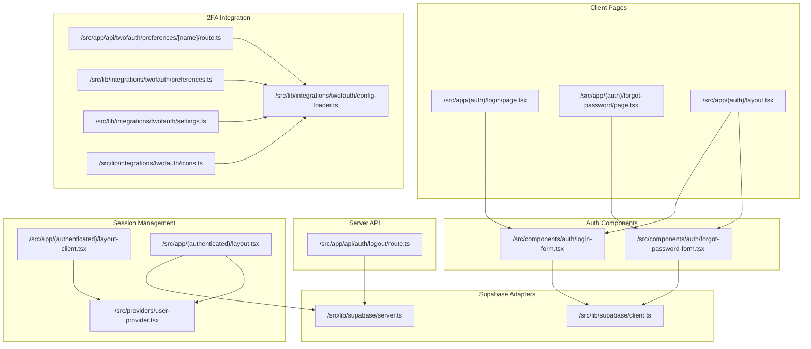
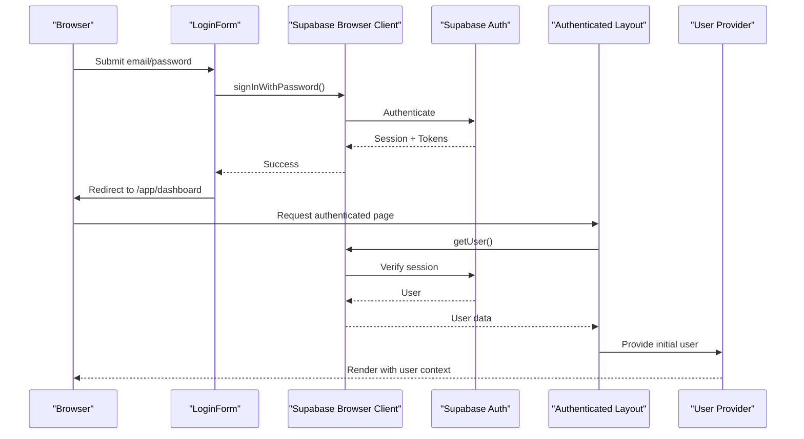
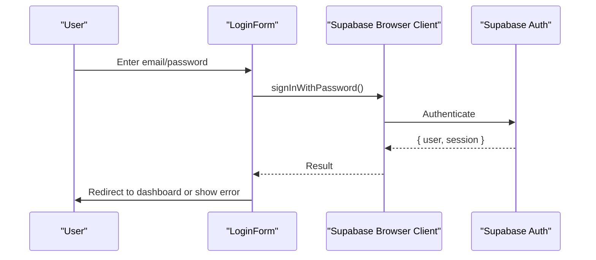
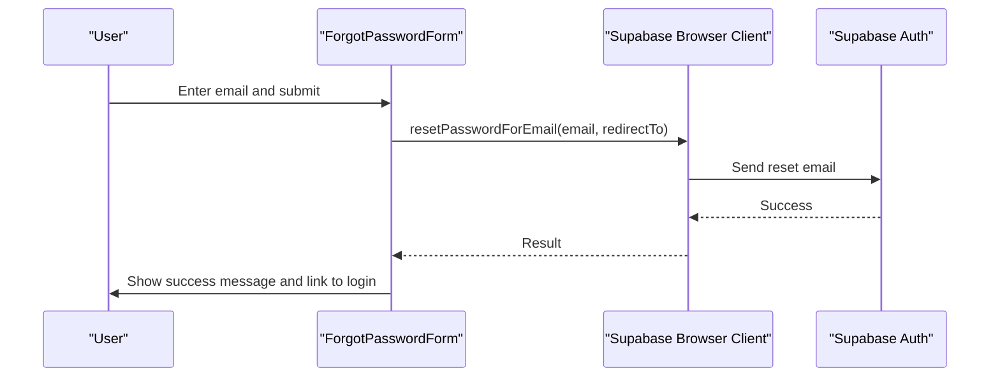
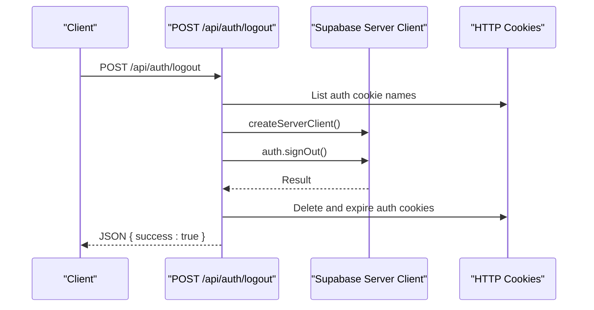
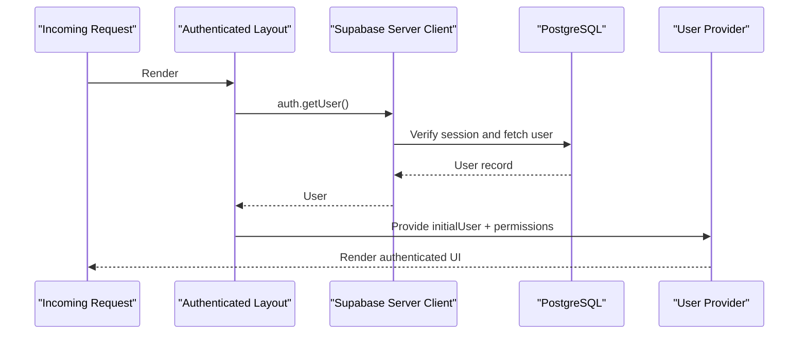
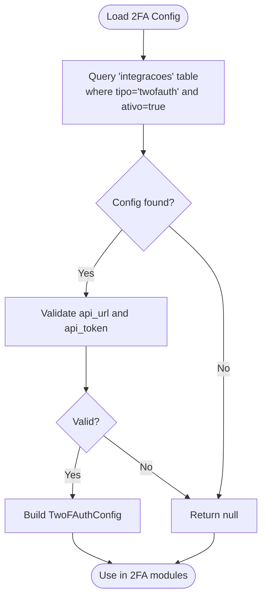
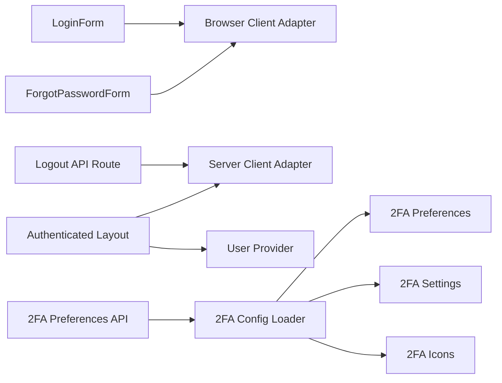

# Authentication System

<cite>
**Referenced Files in This Document**
- [src/app/(auth)/layout.tsx](file://src/app/(auth)/layout.tsx)
- [src/app/(auth)/login/page.tsx](file://src/app/(auth)/login/page.tsx)
- [src/components/auth/login-form.tsx](file://src/components/auth/login-form.tsx)
- [src/app/(auth)/forgot-password/page.tsx](file://src/app/(auth)/forgot-password/page.tsx)
- [src/components/auth/forgot-password-form.tsx](file://src/components/auth/forgot-password-form.tsx)
- [src/app/api/auth/logout/route.ts](file://src/app/api/auth/logout/route.ts)
- [src/lib/supabase/client.ts](file://src/lib/supabase/client.ts)
- [src/lib/supabase/server.ts](file://src/lib/supabase/server.ts)
- [src/app/(authenticated)/layout.tsx](file://src/app/(authenticated)/layout.tsx)
- [src/app/(authenticated)/layout-client.tsx](file://src/app/(authenticated)/layout-client.tsx)
- [src/providers/user-provider.tsx](file://src/providers/user-provider.tsx)
- [src/lib/auth/api-auth.ts](file://src/lib/auth/api-auth.ts)
- [src/app/api/twofauth/preferences/[name]/route.ts](file://src/app/api/twofauth/preferences/[name]/route.ts)
- [src/lib/integrations/twofauth/config-loader.ts](file://src/lib/integrations/twofauth/config-loader.ts)
- [src/lib/integrations/twofauth/preferences.ts](file://src/lib/integrations/twofauth/preferences.ts)
- [src/lib/integrations/twofauth/settings.ts](file://src/lib/integrations/twofauth/settings.ts)
- [src/lib/integrations/twofauth/icons.ts](file://src/lib/integrations/twofauth/icons.ts)
- [src/app/(ajuda)/ajuda/integracao/page.tsx](file://src/app/(ajuda)/ajuda/integracao/page.tsx)
- [src/app/(ajuda)/ajuda/desenvolvimento/variaveis-ambiente/page.tsx](file://src/app/(ajuda)/ajuda/desenvolvimento/variaveis-ambiente/page.tsx)
</cite>

## Table of Contents
1. [Introduction](#introduction)
2. [Project Structure](#project-structure)
3. [Core Components](#core-components)
4. [Architecture Overview](#architecture-overview)
5. [Detailed Component Analysis](#detailed-component-analysis)
6. [Dependency Analysis](#dependency-analysis)
7. [Performance Considerations](#performance-considerations)
8. [Troubleshooting Guide](#troubleshooting-guide)
9. [Conclusion](#conclusion)

## Introduction
This document describes the Authentication System built on Supabase Auth within a Next.js application. It covers client-side and server-side authentication patterns, session management, token handling, and security headers. It also documents supported flows including email/password authentication, password reset, logout, and outlines the current state of OAuth providers and two-factor authentication (2FA) integration points. Practical guidance is provided for implementing authentication guards, protected routes, and user session persistence.

## Project Structure
The authentication system spans client pages, reusable UI components, server-side API routes, and Supabase client adapters. Key areas:
- Authentication pages: login, forgot-password, and confirmation flows
- Reusable auth forms: login and password reset
- Server-side logout API route
- Supabase client adapters for browser and server environments
- Authenticated layout and user provider for session hydration
- 2FA integration modules for preferences, settings, and configuration

**Diagram sources**
- [src/app/(auth)/login/page.tsx](file://src/app/(auth)/login/page.tsx#L1-L6)
- [src/app/(auth)/forgot-password/page.tsx](file://src/app/(auth)/forgot-password/page.tsx#L1-L6)
- [src/app/(auth)/layout.tsx](file://src/app/(auth)/layout.tsx#L1-L39)
- [src/components/auth/login-form.tsx:1-196](file://src/components/auth/login-form.tsx#L1-L196)
- [src/components/auth/forgot-password-form.tsx:1-165](file://src/components/auth/forgot-password-form.tsx#L1-L165)
- [src/app/api/auth/logout/route.ts:1-108](file://src/app/api/auth/logout/route.ts#L1-L108)
- [src/lib/supabase/client.ts:1-240](file://src/lib/supabase/client.ts#L1-L240)
- [src/lib/supabase/server.ts:1-38](file://src/lib/supabase/server.ts#L1-L38)
- [src/app/(authenticated)/layout.tsx](file://src/app/(authenticated)/layout.tsx#L1-L58)
- [src/providers/user-provider.tsx](file://src/providers/user-provider.tsx)
- [src/lib/integrations/twofauth/config-loader.ts:1-48](file://src/lib/integrations/twofauth/config-loader.ts#L1-L48)
- [src/lib/integrations/twofauth/preferences.ts:1-57](file://src/lib/integrations/twofauth/preferences.ts#L1-L57)
- [src/lib/integrations/twofauth/settings.ts:102-138](file://src/lib/integrations/twofauth/settings.ts#L102-L138)
- [src/lib/integrations/twofauth/icons.ts:49-69](file://src/lib/integrations/twofauth/icons.ts#L49-L69)
- [src/app/api/twofauth/preferences/[name]/route.ts](file://src/app/api/twofauth/preferences/[name]/route.ts#L1-L53)

**Section sources**
- [src/app/(auth)/layout.tsx:1-39](file://src/app/(auth)/layout.tsx#L1-L39)
- [src/app/(auth)/login/page.tsx:1-6](file://src/app/(auth)/login/page.tsx#L1-L6)
- [src/app/(auth)/forgot-password/page.tsx:1-6](file://src/app/(auth)/forgot-password/page.tsx#L1-L6)
- [src/components/auth/login-form.tsx:1-196](file://src/components/auth/login-form.tsx#L1-L196)
- [src/components/auth/forgot-password-form.tsx:1-165](file://src/components/auth/forgot-password-form.tsx#L1-L165)
- [src/app/api/auth/logout/route.ts:1-108](file://src/app/api/auth/logout/route.ts#L1-L108)
- [src/lib/supabase/client.ts:1-240](file://src/lib/supabase/client.ts#L1-L240)
- [src/lib/supabase/server.ts:1-38](file://src/lib/supabase/server.ts#L1-L38)
- [src/app/(authenticated)/layout.tsx:1-58](file://src/app/(authenticated)/layout.tsx#L1-L58)

## Core Components
- Supabase Browser Client Adapter: Provides a singleton browser client with SSR-safe cookie and storage handling, lock noise filtering, and tokens-only cookie encoding.
- Supabase Server Client Adapter: Creates a server client with cookie store integration and tokens-only encoding for server-side operations.
- Authenticated Layout: Hydrates user data server-side and passes it to the client for rendering.
- User Provider: Shares hydrated user data across the authenticated app.
- Login Form: Handles email/password authentication and redirects upon success.
- Password Reset Form: Sends password reset emails via Supabase Auth.
- Logout API Route: Clears Supabase auth cookies and attempts server-side sign-out.
- 2FA Integration Modules: Load configuration, manage preferences/settings, and fetch official icons.

**Section sources**
- [src/lib/supabase/client.ts:204-240](file://src/lib/supabase/client.ts#L204-L240)
- [src/lib/supabase/server.ts:4-36](file://src/lib/supabase/server.ts#L4-L36)
- [src/app/(authenticated)/layout.tsx:14-57](file://src/app/(authenticated)/layout.tsx#L14-L57)
- [src/providers/user-provider.tsx](file://src/providers/user-provider.tsx)
- [src/components/auth/login-form.tsx:31-76](file://src/components/auth/login-form.tsx#L31-L76)
- [src/components/auth/forgot-password-form.tsx:19-36](file://src/components/auth/forgot-password-form.tsx#L19-L36)
- [src/app/api/auth/logout/route.ts:54-107](file://src/app/api/auth/logout/route.ts#L54-L107)
- [src/lib/integrations/twofauth/config-loader.ts:16-48](file://src/lib/integrations/twofauth/config-loader.ts#L16-L48)

## Architecture Overview
The system follows a layered pattern:
- Client Components use the browser client adapter to interact with Supabase Auth.
- Server Components use the server client adapter to securely refresh sessions and fetch user data.
- API routes encapsulate server-side operations (e.g., logout) and manage cookies.
- The authenticated layout hydrates user data server-side and passes it to the client via a provider.

**Diagram sources**
- [src/components/auth/login-form.tsx:31-76](file://src/components/auth/login-form.tsx#L31-L76)
- [src/lib/supabase/client.ts:204-240](file://src/lib/supabase/client.ts#L204-L240)
- [src/app/(authenticated)/layout.tsx:18-50](file://src/app/(authenticated)/layout.tsx#L18-L50)
- [src/providers/user-provider.tsx](file://src/providers/user-provider.tsx)

## Detailed Component Analysis

### Email/Password Authentication Flow
- Client-side login form collects email and password, creates a browser client, and calls Supabase Auth sign-in.
- On success, the user is redirected to the dashboard; on error, user-friendly messages are displayed.
- The browser client adapter ensures proper cookie encoding and storage handling.

**Diagram sources**
- [src/components/auth/login-form.tsx:31-76](file://src/components/auth/login-form.tsx#L31-L76)
- [src/lib/supabase/client.ts:204-240](file://src/lib/supabase/client.ts#L204-L240)

**Section sources**
- [src/components/auth/login-form.tsx:31-76](file://src/components/auth/login-form.tsx#L31-L76)
- [src/lib/supabase/client.ts:204-240](file://src/lib/supabase/client.ts#L204-L240)

### Password Reset Procedure
- The password reset form sends a reset email via Supabase Auth with a redirect to the update-password page.
- The server adapter is used to ensure cookies are handled correctly during the request lifecycle.

**Diagram sources**
- [src/components/auth/forgot-password-form.tsx:19-36](file://src/components/auth/forgot-password-form.tsx#L19-L36)
- [src/lib/supabase/client.ts:204-240](file://src/lib/supabase/client.ts#L204-L240)

**Section sources**
- [src/components/auth/forgot-password-form.tsx:19-36](file://src/components/auth/forgot-password-form.tsx#L19-L36)
- [src/lib/supabase/client.ts:204-240](file://src/lib/supabase/client.ts#L204-L240)

### Logout Flow
- The logout API route identifies all Supabase auth cookies (including chunked ones), attempts server-side sign-out, and clears cookies regardless of session state.

**Diagram sources**
- [src/app/api/auth/logout/route.ts:54-107](file://src/app/api/auth/logout/route.ts#L54-L107)

**Section sources**
- [src/app/api/auth/logout/route.ts:54-107](file://src/app/api/auth/logout/route.ts#L54-L107)

### Session Management and Protected Routes
- The authenticated layout fetches the current user server-side, selects relevant profile fields, and passes them to the client via a provider.
- The client-side layout receives initial user data and renders the authenticated shell.

**Diagram sources**
- [src/app/(authenticated)/layout.tsx:18-50](file://src/app/(authenticated)/layout.tsx#L18-L50)
- [src/lib/supabase/server.ts:4-36](file://src/lib/supabase/server.ts#L4-L36)
- [src/providers/user-provider.tsx](file://src/providers/user-provider.tsx)

**Section sources**
- [src/app/(authenticated)/layout.tsx:18-50](file://src/app/(authenticated)/layout.tsx#L18-L50)
- [src/lib/supabase/server.ts:4-36](file://src/lib/supabase/server.ts#L4-L36)
- [src/providers/user-provider.tsx](file://src/providers/user-provider.tsx)

### OAuth Providers
- The codebase includes UI references to Google and GitHub OAuth buttons in mock templates, indicating planned integration points.
- Current implementation focuses on email/password and password reset flows. OAuth provider configuration would typically be managed in Supabase Auth settings and invoked via Supabase client methods.

[No sources needed since this section provides general guidance]

### Two-Factor Authentication (2FA) Setup and Integration
- Configuration loader retrieves active 2FA integration settings from the database, validating required fields.
- Preferences and settings modules expose APIs to query and update 2FA preferences and global settings.
- Icons module can fetch official service icons for known providers.
- API routes protect 2FA endpoints with server-side authentication.

**Diagram sources**
- [src/lib/integrations/twofauth/config-loader.ts:16-48](file://src/lib/integrations/twofauth/config-loader.ts#L16-L48)

**Section sources**
- [src/lib/integrations/twofauth/config-loader.ts:16-48](file://src/lib/integrations/twofauth/config-loader.ts#L16-L48)
- [src/lib/integrations/twofauth/preferences.ts:25-57](file://src/lib/integrations/twofauth/preferences.ts#L25-L57)
- [src/lib/integrations/twofauth/settings.ts:102-138](file://src/lib/integrations/twofauth/settings.ts#L102-L138)
- [src/lib/integrations/twofauth/icons.ts:56-69](file://src/lib/integrations/twofauth/icons.ts#L56-L69)
- [src/app/api/twofauth/preferences/[name]/route.ts:27-L53](file://src/app/api/twofauth/preferences/[name]/route.ts#L27-L53)

### Token Handling and Security Headers
- Browser client adapter sets cookies with tokens-only encoding and forwards user data to local storage.
- Server client adapter uses tokens-only encoding and integrates with Next.js cookie store.
- Logout route explicitly handles chunked auth cookies and clears them with appropriate attributes.

**Section sources**
- [src/lib/supabase/client.ts:118-202](file://src/lib/supabase/client.ts#L118-L202)
- [src/lib/supabase/server.ts:10-35](file://src/lib/supabase/server.ts#L10-L35)
- [src/app/api/auth/logout/route.ts:16-52](file://src/app/api/auth/logout/route.ts#L16-L52)

### Practical Examples: Guards, Protected Routes, and Session Persistence
- Protected routes: Wrap server components that require authentication with server client usage to fetch the current user and guard access.
- Authentication guards: Use server client getUser() in server components to enforce authentication.
- Session persistence: The browser client adapter stores tokens in cookies and user data in local storage, while server client uses tokens-only cookies for SSR-safe operations.

**Section sources**
- [src/app/(authenticated)/layout.tsx:18-50](file://src/app/(authenticated)/layout.tsx#L18-L50)
- [src/lib/supabase/server.ts:4-36](file://src/lib/supabase/server.ts#L4-L36)
- [src/lib/supabase/client.ts:118-202](file://src/lib/supabase/client.ts#L118-L202)

## Dependency Analysis
The authentication system exhibits clear separation of concerns:
- Client components depend on the browser client adapter for Auth operations.
- Server components depend on the server client adapter for secure operations.
- API routes depend on the server client adapter and manage cookies.
- The authenticated layout depends on both server client and user provider.

**Diagram sources**
- [src/components/auth/login-form.tsx:1-196](file://src/components/auth/login-form.tsx#L1-L196)
- [src/components/auth/forgot-password-form.tsx:1-165](file://src/components/auth/forgot-password-form.tsx#L1-L165)
- [src/app/api/auth/logout/route.ts:1-108](file://src/app/api/auth/logout/route.ts#L1-L108)
- [src/lib/supabase/client.ts:1-240](file://src/lib/supabase/client.ts#L1-L240)
- [src/lib/supabase/server.ts:1-38](file://src/lib/supabase/server.ts#L1-L38)
- [src/app/(authenticated)/layout.tsx](file://src/app/(authenticated)/layout.tsx#L1-L58)
- [src/providers/user-provider.tsx](file://src/providers/user-provider.tsx)
- [src/app/api/twofauth/preferences/[name]/route.ts](file://src/app/api/twofauth/preferences/[name]/route.ts#L1-L53)
- [src/lib/integrations/twofauth/config-loader.ts:1-48](file://src/lib/integrations/twofauth/config-loader.ts#L1-L48)
- [src/lib/integrations/twofauth/preferences.ts:1-57](file://src/lib/integrations/twofauth/preferences.ts#L1-L57)
- [src/lib/integrations/twofauth/settings.ts:102-138](file://src/lib/integrations/twofauth/settings.ts#L102-L138)
- [src/lib/integrations/twofauth/icons.ts:49-69](file://src/lib/integrations/twofauth/icons.ts#L49-L69)

**Section sources**
- [src/lib/supabase/client.ts:204-240](file://src/lib/supabase/client.ts#L204-L240)
- [src/lib/supabase/server.ts:4-36](file://src/lib/supabase/server.ts#L4-L36)
- [src/app/(authenticated)/layout.tsx:18-50](file://src/app/(authenticated)/layout.tsx#L18-L50)

## Performance Considerations
- Browser client adapter installs lock noise filters to avoid unnecessary error logs during concurrent token refreshes.
- Using tokens-only cookie encoding reduces payload sizes and avoids serializing user objects in cookies.
- Server client adapter defers user object serialization to memory/local storage equivalents, minimizing SSR overhead.

**Section sources**
- [src/lib/supabase/client.ts:50-102](file://src/lib/supabase/client.ts#L50-L102)
- [src/lib/supabase/client.ts:220-239](file://src/lib/supabase/client.ts#L220-L239)
- [src/lib/supabase/server.ts:10-35](file://src/lib/supabase/server.ts#L10-L35)

## Troubleshooting Guide
- Login errors: The login form surfaces specific messages for invalid credentials, unconfirmed email, and server errors. Review Supabase Auth logs for database-related warnings.
- Logout failures: The logout route attempts server-side sign-out and falls back to manual cookie clearing. Ensure environment variables for Supabase URLs are configured.
- 2FA configuration: If 2FA integration appears inactive, verify the active configuration exists and contains required fields. Check environment variables for 2FA endpoint and token.

**Section sources**
- [src/components/auth/login-form.tsx:43-75](file://src/components/auth/login-form.tsx#L43-L75)
- [src/app/api/auth/logout/route.ts:54-107](file://src/app/api/auth/logout/route.ts#L54-L107)
- [src/lib/integrations/twofauth/config-loader.ts:16-48](file://src/lib/integrations/twofauth/config-loader.ts#L16-L48)

## Conclusion
The authentication system leverages Supabase Auth with robust client and server adapters, secure cookie handling, and server-side session hydration. Email/password and password reset flows are implemented, with logout handling designed for resilience against expired sessions. OAuth providers and magic link flows are indicated by UI references and can be integrated via Supabase client methods. The 2FA integration modules provide a foundation for preferences, settings, and icon fetching, with API routes enforcing server-side authentication.