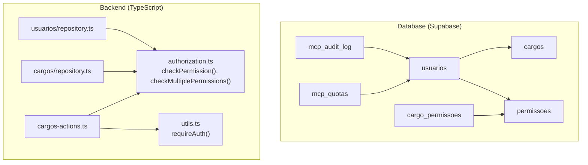
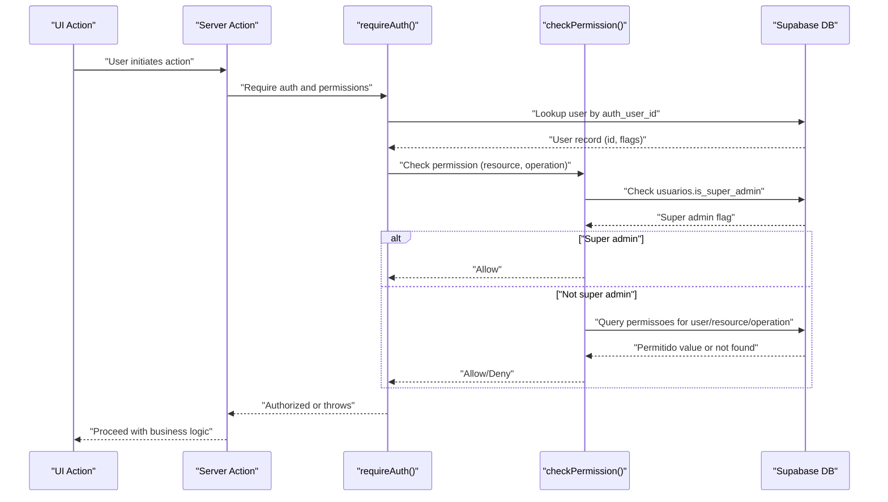
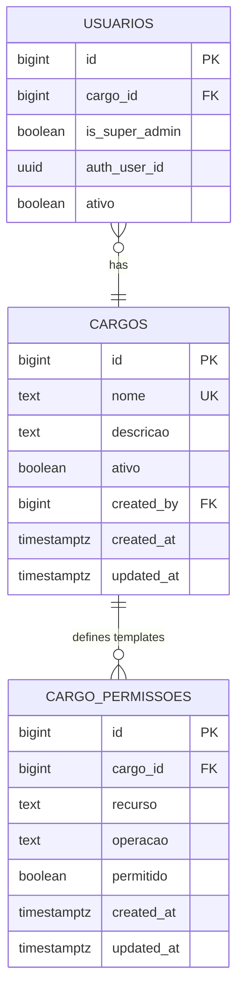
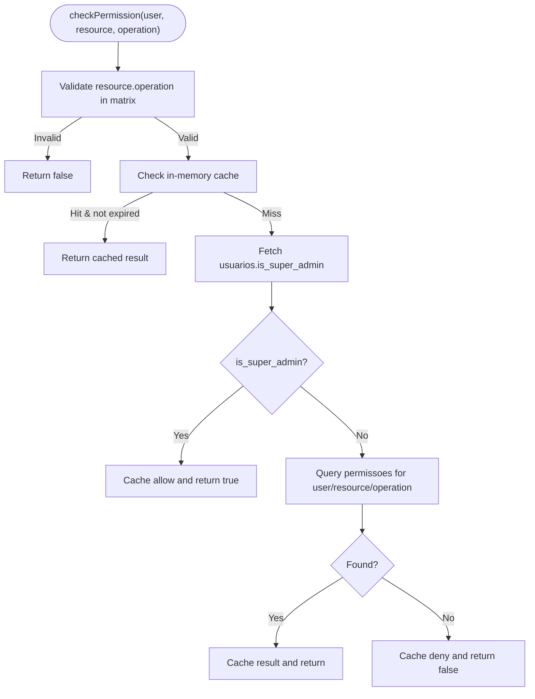
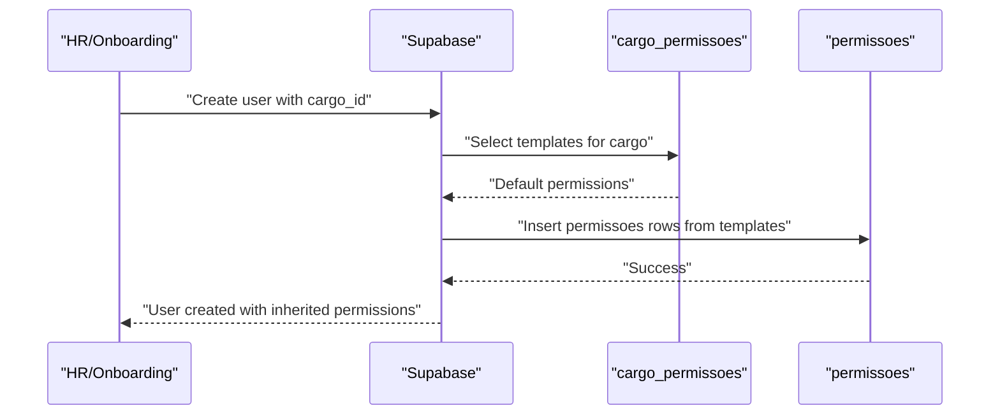
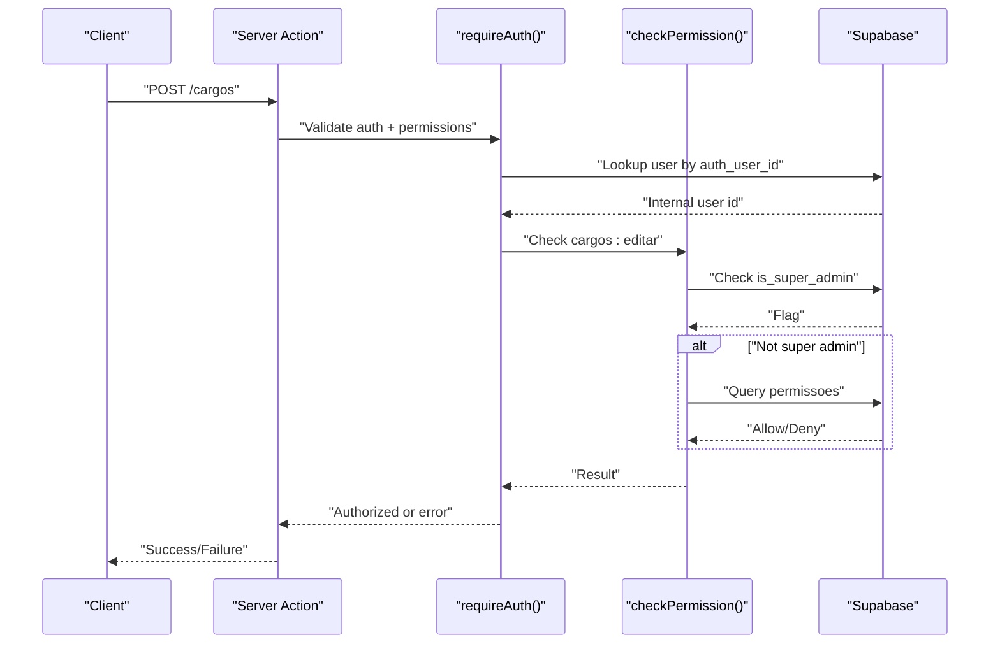
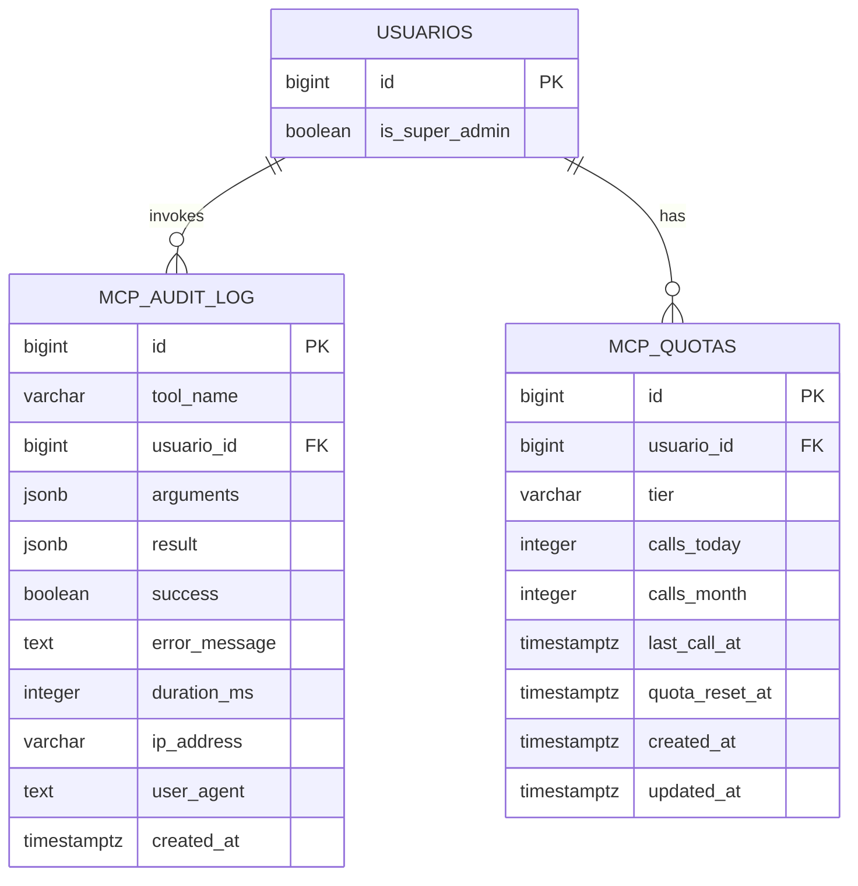
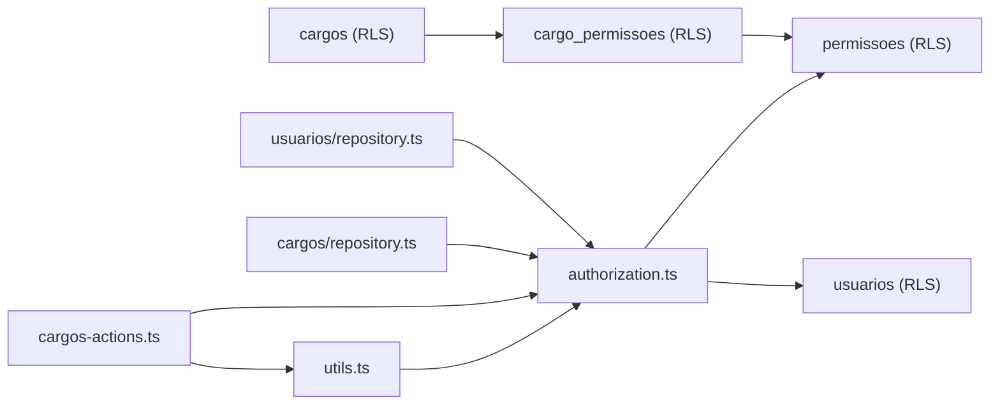

# Authorization and Roles

<cite>
**Referenced Files in This Document**
- [create_cargos.sql](file://supabase/migrations/20250118120003_create_cargos.sql)
- [create_permissoes.sql](file://supabase/migrations/20250118120100_create_permissoes.sql)
- [alter_usuarios_add_permissions_fields.sql](file://supabase/migrations/20250118120200_alter_usuarios_add_permissions_fields.sql)
- [fix_rls_policies_granular_permissions.sql](file://supabase/migrations/20250120000001_fix_rls_policies_granular_permissions.sql)
- [22_cargos_permissoes.sql](file://supabase/schemas/22_cargos_permissoes.sql)
- [authorization.ts](file://src/lib/auth/authorization.ts)
- [utils.ts](file://src/app/(authenticated)/usuarios/actions/utils.ts)
- [cargos-actions.ts](file://src/app/(authenticated)/cargos/actions/cargos-actions.ts)
- [repository.ts](file://src/app/(authenticated)/cargos/repository.ts)
- [repository.ts](file://src/app/(authenticated)/usuarios/repository.ts)
- [create_mcp_audit_log.sql](file://supabase/migrations/20251226120000_create_mcp_audit_log.sql)
- [40_mcp_audit.sql](file://supabase/schemas/40_mcp_audit.sql)
</cite>

## Table of Contents
1. [Introduction](#introduction)
2. [Project Structure](#project-structure)
3. [Core Components](#core-components)
4. [Architecture Overview](#architecture-overview)
5. [Detailed Component Analysis](#detailed-component-analysis)
6. [Dependency Analysis](#dependency-analysis)
7. [Performance Considerations](#performance-considerations)
8. [Troubleshooting Guide](#troubleshooting-guide)
9. [Conclusion](#conclusion)

## Introduction
This document explains the Authorization and Role-Based Access Control (RBAC) system implemented in the project. It covers the cargo (position) system, granular permission model, permission inheritance via cargo templates, and Row Level Security (RLS) enforcement. It also documents how users are assigned roles, how permissions are inherited, and how access is enforced across resources. Practical examples demonstrate role assignment, permission checking, and access control enforcement. Finally, it addresses legal compliance requirements for user activity monitoring and audit trails.

## Project Structure
The authorization system spans three layers:
- Database layer: Supabase tables for cargos, cargo_permissoes, permissoes, and RLS policies.
- Backend layer: TypeScript authorization utilities and server actions that enforce checks.
- Frontend layer: UI actions and repositories that delegate to backend services.

**Diagram sources**
- [authorization.ts:56-145](file://src/lib/auth/authorization.ts#L56-L145)
- [utils.ts](file://src/app/(authenticated)/usuarios/actions/utils.ts#L8-L50)
- [cargos-actions.ts](file://src/app/(authenticated)/cargos/actions/cargos-actions.ts#L47-L87)
- [repository.ts](file://src/app/(authenticated)/cargos/repository.ts#L36-L186)
- [repository.ts](file://src/app/(authenticated)/usuarios/repository.ts#L533-L553)
- [create_cargos.sql:4-65](file://supabase/migrations/20250118120003_create_cargos.sql#L4-L65)
- [create_permissoes.sql:4-60](file://supabase/migrations/20250118120100_create_permissoes.sql#L4-L60)
- [22_cargos_permissoes.sql:6-138](file://supabase/schemas/22_cargos_permissoes.sql#L6-L138)
- [create_mcp_audit_log.sql:9-161](file://supabase/migrations/20251226120000_create_mcp_audit_log.sql#L9-L161)

**Section sources**
- [authorization.ts:56-145](file://src/lib/auth/authorization.ts#L56-L145)
- [utils.ts](file://src/app/(authenticated)/usuarios/actions/utils.ts#L8-L50)
- [cargos-actions.ts](file://src/app/(authenticated)/cargos/actions/cargos-actions.ts#L47-L87)
- [repository.ts](file://src/app/(authenticated)/cargos/repository.ts#L36-L186)
- [repository.ts](file://src/app/(authenticated)/usuarios/repository.ts#L533-L553)
- [create_cargos.sql:4-65](file://supabase/migrations/20250118120003_create_cargos.sql#L4-L65)
- [create_permissoes.sql:4-60](file://supabase/migrations/20250118120100_create_permissoes.sql#L4-L60)
- [22_cargos_permissoes.sql:6-138](file://supabase/schemas/22_cargos_permissoes.sql#L6-L138)
- [create_mcp_audit_log.sql:9-161](file://supabase/migrations/20251226120000_create_mcp_audit_log.sql#L9-L161)

## Core Components
- Cargo system: Internal organizational positions stored in the cargos table. Users can be associated with a cargo via the usuarios.cargo_id field. RLS policies restrict access to cargos.
- Granular permissions: The permissoes table stores explicit allow/deny rules per user-resource-operation. RLS ensures users can only see their own permissions.
- Permission inheritance: The cargo_permissoes table defines default permission templates per cargo. These are applied as initial grants when users are created.
- Authorization engine: The checkPermission function validates a user’s ability to perform an operation on a resource, with caching and super admin bypass.
- Enforcement utilities: requireAuth validates authentication and checks required permissions; server actions wrap business logic with authorization checks.

**Section sources**
- [create_cargos.sql:4-65](file://supabase/migrations/20250118120003_create_cargos.sql#L4-L65)
- [create_permissoes.sql:4-60](file://supabase/migrations/20250118120100_create_permissoes.sql#L4-L60)
- [alter_usuarios_add_permissions_fields.sql:4-19](file://supabase/migrations/20250118120200_alter_usuarios_add_permissions_fields.sql#L4-L19)
- [22_cargos_permissoes.sql:101-196](file://supabase/schemas/22_cargos_permissoes.sql#L101-L196)
- [authorization.ts:56-145](file://src/lib/auth/authorization.ts#L56-L145)
- [utils.ts](file://src/app/(authenticated)/usuarios/actions/utils.ts#L8-L50)

## Architecture Overview
The authorization pipeline enforces access control at multiple levels:

**Diagram sources**
- [authorization.ts:56-145](file://src/lib/auth/authorization.ts#L56-L145)
- [utils.ts](file://src/app/(authenticated)/usuarios/actions/utils.ts#L8-L50)
- [create_permissoes.sql:46-60](file://supabase/migrations/20250118120100_create_permissoes.sql#L46-L60)

## Detailed Component Analysis

### Cargo System
- Purpose: Organize users internally by position (e.g., Administrador, Gerente, Funcionário). Does not directly grant permissions; serves as a human-readable grouping.
- Schema: cargos table with RLS allowing authenticated users to read; service_role has full access.
- Inheritance: cargo_permissoes seeds define default permission templates per cargo. These are applied during user creation to populate permissoes.

**Diagram sources**
- [create_cargos.sql:4-65](file://supabase/migrations/20250118120003_create_cargos.sql#L4-L65)
- [22_cargos_permissoes.sql:101-196](file://supabase/schemas/22_cargos_permissoes.sql#L101-L196)
- [alter_usuarios_add_permissions_fields.sql:4-19](file://supabase/migrations/20250118120200_alter_usuarios_add_permissions_fields.sql#L4-L19)

**Section sources**
- [create_cargos.sql:4-65](file://supabase/migrations/20250118120003_create_cargos.sql#L4-L65)
- [22_cargos_permissoes.sql:90-196](file://supabase/schemas/22_cargos_permissoes.sql#L90-L196)
- [alter_usuarios_add_permissions_fields.sql:4-19](file://supabase/migrations/20250118120200_alter_usuarios_add_permissions_fields.sql#L4-L19)

### Granular Permissions Model
- Purpose: Define fine-grained allow/deny rules for each user-resource-operation tuple.
- Storage: permissoes table with unique constraint on (usuario_id, recurso, operacao).
- Enforcement: RLS allows authenticated users to read only their own permissions; service_role has full access.
- Validation: checkPermission validates against a predefined matrix and caches results.

**Diagram sources**
- [authorization.ts:56-145](file://src/lib/auth/authorization.ts#L56-L145)
- [create_permissoes.sql:46-60](file://supabase/migrations/20250118120100_create_permissoes.sql#L46-L60)

**Section sources**
- [create_permissoes.sql:4-60](file://supabase/migrations/20250118120100_create_permissoes.sql#L4-L60)
- [authorization.ts:56-145](file://src/lib/auth/authorization.ts#L56-L145)

### Permission Inheritance via Cargo Templates
- Purpose: Apply standardized permission sets to users based on their cargo.
- Mechanism: cargo_permissoes seeds define default grants per cargo. During user creation, these templates are applied to populate permissoes.
- Flexibility: Individual user permissions can override or extend cargo-defined defaults.

**Diagram sources**
- [22_cargos_permissoes.sql:144-196](file://supabase/schemas/22_cargos_permissoes.sql#L144-L196)

**Section sources**
- [22_cargos_permissoes.sql:101-196](file://supabase/schemas/22_cargos_permissoes.sql#L101-L196)

### Access Control Enforcement in Server Actions
- requireAuth: Authenticates the request, resolves the internal user ID, and enforces required permissions using checkPermission.
- Example usage: Cargo actions check either cargos:visualizar or cargos:editar (or usuarios:editar) depending on context.

**Diagram sources**
- [utils.ts](file://src/app/(authenticated)/usuarios/actions/utils.ts#L8-L50)
- [authorization.ts:56-145](file://src/lib/auth/authorization.ts#L56-L145)
- [cargos-actions.ts](file://src/app/(authenticated)/cargos/actions/cargos-actions.ts#L63-L87)

**Section sources**
- [utils.ts](file://src/app/(authenticated)/usuarios/actions/utils.ts#L8-L50)
- [authorization.ts:56-145](file://src/lib/auth/authorization.ts#L56-L145)
- [cargos-actions.ts](file://src/app/(authenticated)/cargos/actions/cargos-actions.ts#L47-L87)

### Practical Examples

- Role assignment:
  - Assign a user to a cargo by setting usuarios.cargo_id. This does not automatically grant permissions; it provides organizational context.
  - Apply cargo templates during user creation to populate permissoes with default grants.

- Permission checking:
  - Use checkPermission(userId, 'processos', 'criar') to verify a user can create processes.
  - Use checkMultiplePermissions(userId, [['processos','criar'], ['processos','editar']], true) to require all permissions.

- Access control enforcement:
  - Wrap UI actions with requireAuth(['cargos:editar']) to enforce both authentication and authorization.
  - Server actions can combine requireAuth with explicit resource checks (e.g., cargos:visualizar or usuarios:editar).

**Section sources**
- [authorization.ts:156-172](file://src/lib/auth/authorization.ts#L156-L172)
- [utils.ts](file://src/app/(authenticated)/usuarios/actions/utils.ts#L8-L50)
- [cargos-actions.ts](file://src/app/(authenticated)/cargos/actions/cargos-actions.ts#L63-L87)
- [repository.ts](file://src/app/(authenticated)/cargos/repository.ts#L36-L186)

### Legal Compliance and Audit Trails
- MCP Audit Logging:
  - mcp_audit_log captures MCP tool invocations with tool_name, arguments, result, success, duration_ms, IP address, and user agent.
  - mcp_quotas tracks per-user call counts and tiers for rate limiting.
  - RLS restricts visibility: authenticated users can only see their own quotas; only super admins can view audit logs.

**Diagram sources**
- [create_mcp_audit_log.sql:9-161](file://supabase/migrations/20251226120000_create_mcp_audit_log.sql#L9-L161)
- [40_mcp_audit.sql:6-151](file://supabase/schemas/40_mcp_audit.sql#L6-L151)

**Section sources**
- [create_mcp_audit_log.sql:104-151](file://supabase/migrations/20251226120000_create_mcp_audit_log.sql#L104-L151)
- [40_mcp_audit.sql:110-151](file://supabase/schemas/40_mcp_audit.sql#L110-L151)

## Dependency Analysis
- Authorization depends on:
  - Supabase RLS policies for cargos, permissoes, cargo_permissoes, and audit tables.
  - Backend cache in memory for checkPermission results.
  - Service clients to query usuarios and permissoes.
- Server actions depend on requireAuth to gate access before invoking business logic.
- Repositories depend on service clients to fetch data and on authorization utilities to enforce checks.

**Diagram sources**
- [authorization.ts:56-145](file://src/lib/auth/authorization.ts#L56-L145)
- [utils.ts](file://src/app/(authenticated)/usuarios/actions/utils.ts#L8-L50)
- [cargos-actions.ts](file://src/app/(authenticated)/cargos/actions/cargos-actions.ts#L47-L87)
- [repository.ts](file://src/app/(authenticated)/cargos/repository.ts#L36-L186)
- [repository.ts](file://src/app/(authenticated)/usuarios/repository.ts#L533-L553)
- [create_cargos.sql:39-65](file://supabase/migrations/20250118120003_create_cargos.sql#L39-L65)
- [create_permissoes.sql:43-60](file://supabase/migrations/20250118120100_create_permissoes.sql#L43-L60)
- [22_cargos_permissoes.sql:127-138](file://supabase/schemas/22_cargos_permissoes.sql#L127-L138)

**Section sources**
- [authorization.ts:56-145](file://src/lib/auth/authorization.ts#L56-L145)
- [utils.ts](file://src/app/(authenticated)/usuarios/actions/utils.ts#L8-L50)
- [cargos-actions.ts](file://src/app/(authenticated)/cargos/actions/cargos-actions.ts#L47-L87)
- [repository.ts](file://src/app/(authenticated)/cargos/repository.ts#L36-L186)
- [repository.ts](file://src/app/(authenticated)/usuarios/repository.ts#L533-L553)
- [create_cargos.sql:39-65](file://supabase/migrations/20250118120003_create_cargos.sql#L39-L65)
- [create_permissoes.sql:43-60](file://supabase/migrations/20250118120100_create_permissoes.sql#L43-L60)
- [22_cargos_permissoes.sql:127-138](file://supabase/schemas/22_cargos_permissoes.sql#L127-L138)

## Performance Considerations
- Caching: checkPermission caches results for 5 minutes per user-resource-operation key to reduce database queries.
- Indexing: permissoes has composite indices on (usuario_id, recurso, operacao) and individual columns for efficient lookups.
- RLS overhead: Policies are minimal and rely on indexed columns; keep filters selective to maintain performance.
- Audit log retention: Cleanup function deletes records older than 90 days to control growth.

[No sources needed since this section provides general guidance]

## Troubleshooting Guide
- Permission denied:
  - Verify the user exists and is_active in usuarios.
  - Confirm is_super_admin is not set unintentionally.
  - Check permissoes entries for the specific user/resource/operation.
  - Use checkMultiplePermissions to debug whether one or more required permissions are missing.

- Authentication failures:
  - requireAuth throws errors if the user is not logged in or not found in usuarios.
  - Ensure auth_user_id matches the authenticated user and the user is active.

- RLS policy issues:
  - For permissoes, authenticated users can only read their own permissions.
  - For cargos and cargo_permissoes, service_role has full access; authenticated users can read.

- Audit log visibility:
  - Only super admins can view mcp_audit_log.
  - Users can only view their own mcp_quotas.

**Section sources**
- [authorization.ts:86-135](file://src/lib/auth/authorization.ts#L86-L135)
- [utils.ts](file://src/app/(authenticated)/usuarios/actions/utils.ts#L8-L50)
- [create_permissoes.sql:46-60](file://supabase/migrations/20250118120100_create_permissoes.sql#L46-L60)
- [create_cargos.sql:39-65](file://supabase/migrations/20250118120003_create_cargos.sql#L39-L65)
- [22_cargos_permissoes.sql:127-138](file://supabase/schemas/22_cargos_permissoes.sql#L127-L138)
- [create_mcp_audit_log.sql:104-151](file://supabase/migrations/20251226120000_create_mcp_audit_log.sql#L104-L151)

## Conclusion
The system combines an internal cargo organization with a robust granular permission model and strict RLS enforcement. Super admin bypass, caching, and template-based inheritance simplify administration while maintaining strong security. MCP audit logging supports compliance needs with controlled visibility and automated retention.