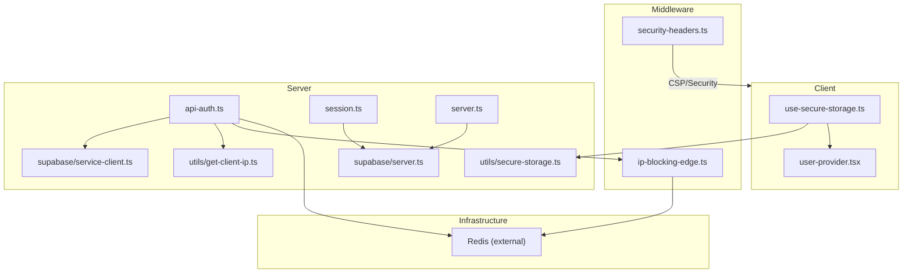
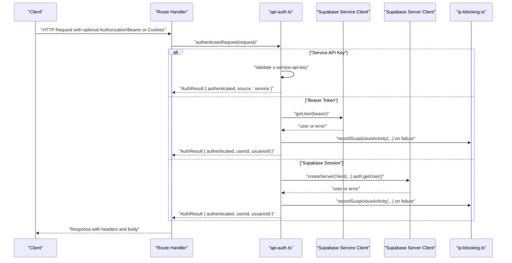
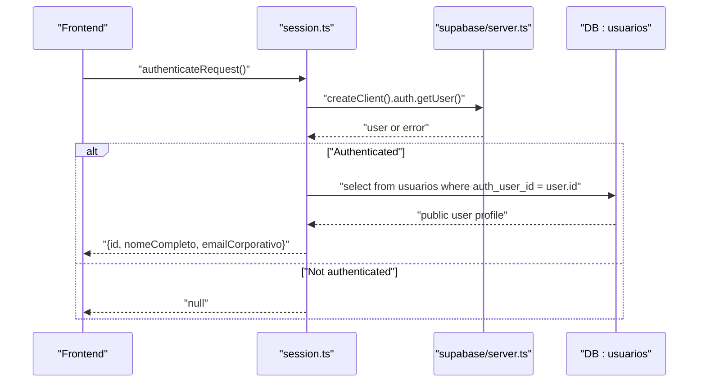
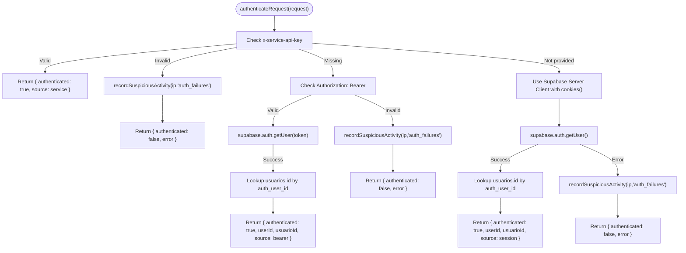
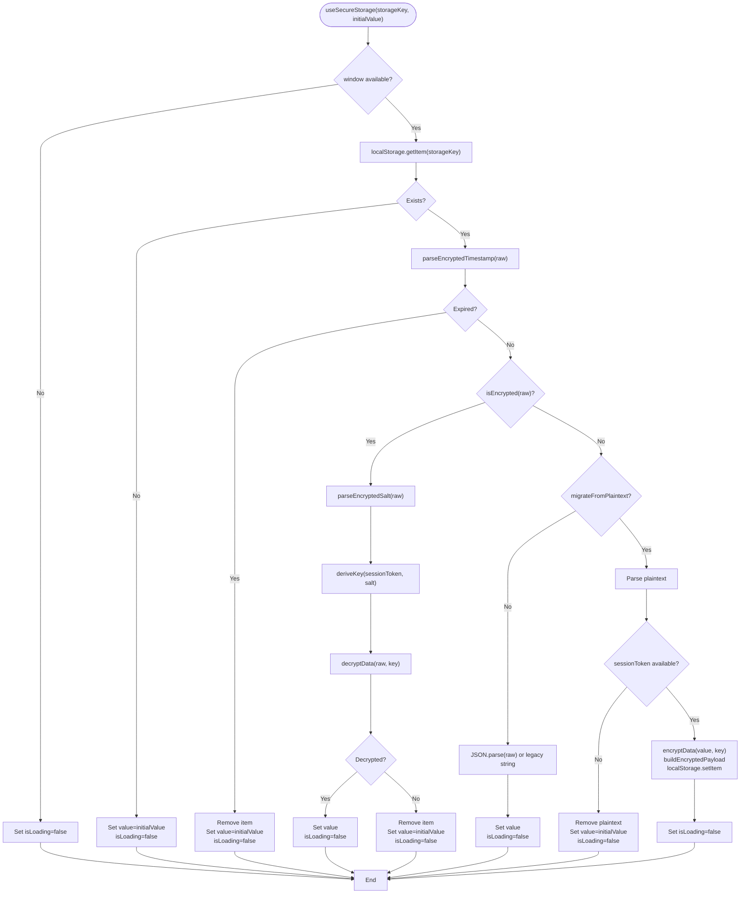
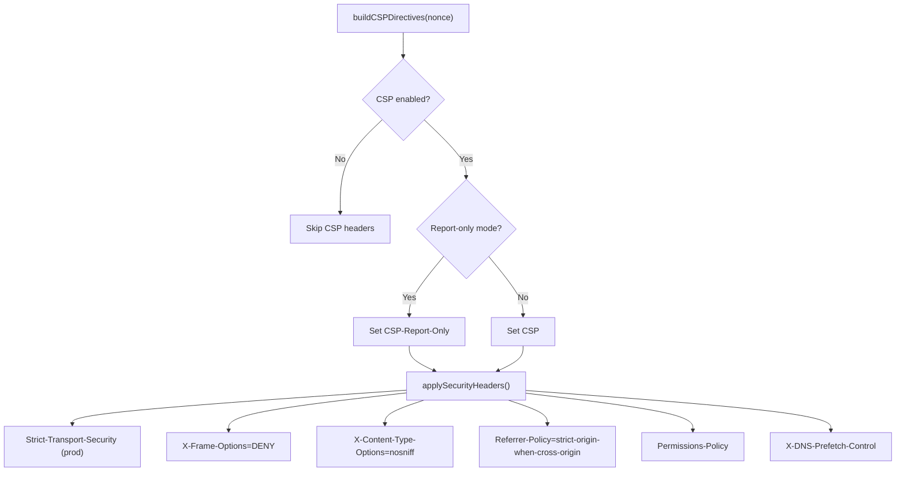
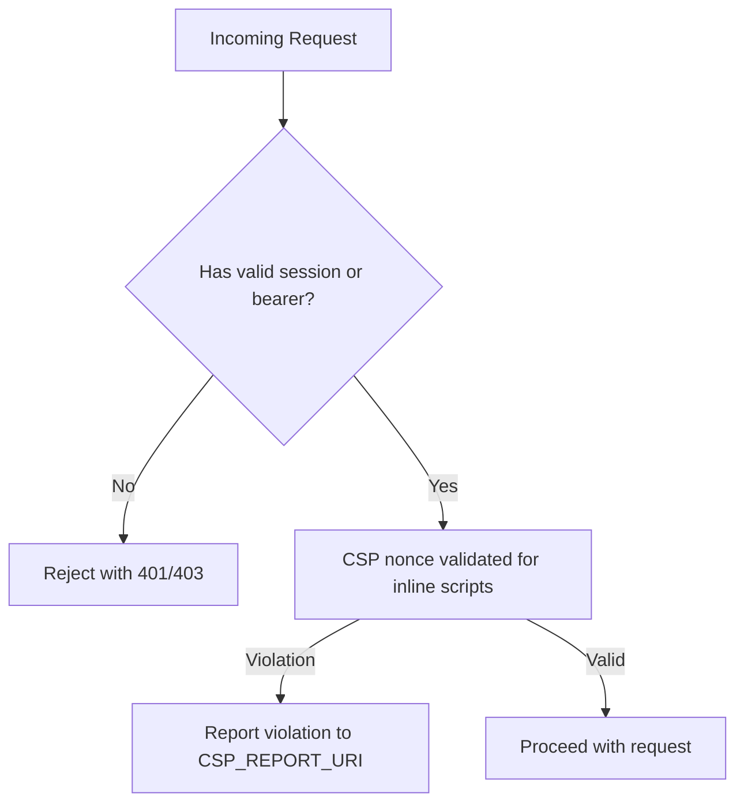
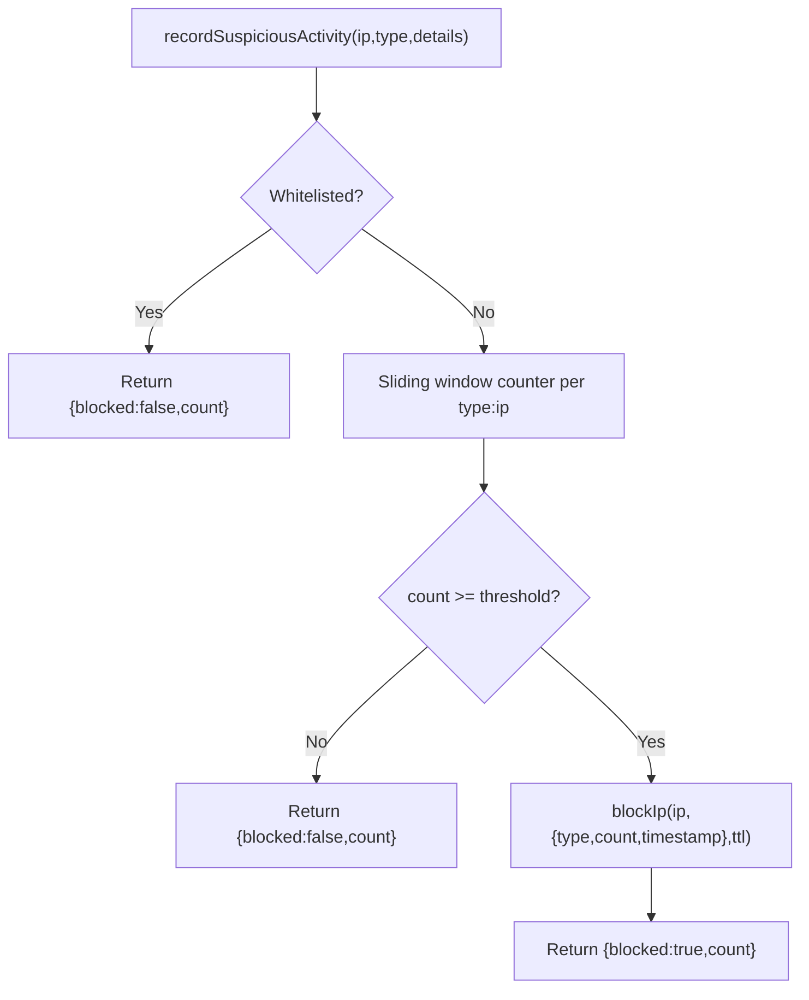
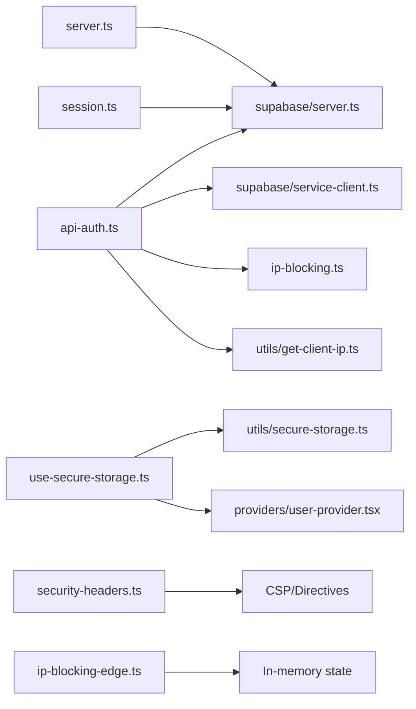

# Session Management and Security

<cite>
**Referenced Files in This Document**
- [src/lib/auth/session.ts](file://src/lib/auth/session.ts)
- [src/lib/auth/server.ts](file://src/lib/auth/server.ts)
- [src/lib/auth/api-auth.ts](file://src/lib/auth/api-auth.ts)
- [src/middleware/security-headers.ts](file://src/middleware/security-headers.ts)
- [src/hooks/use-secure-storage.ts](file://src/hooks/use-secure-storage.ts)
- [src/lib/security/ip-blocking.ts](file://src/lib/security/ip-blocking.ts)
- [src/lib/security/ip-blocking-edge.ts](file://src/lib/security/ip-blocking-edge.ts)
- [src/lib/utils/secure-storage.ts](file://src/lib/utils/secure-storage.ts)
- [src/lib/supabase/server.ts](file://src/lib/supabase/server.ts)
- [src/lib/supabase/service-client.ts](file://src/lib/supabase/service-client.ts)
- [src/lib/utils/get-client-ip.ts](file://src/lib/utils/get-client-ip.ts)
- [src/providers/user-provider.tsx](file://src/providers/user-provider.tsx)
</cite>

## Table of Contents
1. [Introduction](#introduction)
2. [Project Structure](#project-structure)
3. [Core Components](#core-components)
4. [Architecture Overview](#architecture-overview)
5. [Detailed Component Analysis](#detailed-component-analysis)
6. [Dependency Analysis](#dependency-analysis)
7. [Performance Considerations](#performance-considerations)
8. [Troubleshooting Guide](#troubleshooting-guide)
9. [Conclusion](#conclusion)
10. [Appendices](#appendices)

## Introduction
This document provides comprehensive guidance for Session Management and Security Measures across the application. It covers session lifecycle management, token handling, secure storage practices, security headers implementation, CSRF/XSS protections, IP blocking, failed login attempts tracking, suspicious activity detection, and compliance considerations for user session monitoring and data protection regulations. The goal is to help developers implement robust, production-ready session and security controls while remaining accessible to readers with varying technical backgrounds.

## Project Structure
The session and security features are implemented across several layers:
- Authentication utilities for server and API routes
- Middleware for security headers and edge-compatible IP blocking
- Client-side secure storage hook leveraging encryption
- Supabase client abstractions for server and service usage
- Utilities for client IP extraction and secure storage primitives

**Diagram sources**
- [src/hooks/use-secure-storage.ts:1-266](file://src/hooks/use-secure-storage.ts#L1-L266)
- [src/middleware/security-headers.ts:1-329](file://src/middleware/security-headers.ts#L1-L329)
- [src/lib/security/ip-blocking-edge.ts:1-271](file://src/lib/security/ip-blocking-edge.ts#L1-L271)
- [src/lib/auth/api-auth.ts:1-275](file://src/lib/auth/api-auth.ts#L1-L275)
- [src/lib/auth/session.ts:1-46](file://src/lib/auth/session.ts#L1-L46)
- [src/lib/auth/server.ts:1-57](file://src/lib/auth/server.ts#L1-L57)
- [src/lib/supabase/server.ts](file://src/lib/supabase/server.ts)
- [src/lib/supabase/service-client.ts](file://src/lib/supabase/service-client.ts)
- [src/lib/utils/secure-storage.ts](file://src/lib/utils/secure-storage.ts)
- [src/lib/utils/get-client-ip.ts](file://src/lib/utils/get-client-ip.ts)

**Section sources**
- [src/lib/auth/session.ts:1-46](file://src/lib/auth/session.ts#L1-L46)
- [src/lib/auth/server.ts:1-57](file://src/lib/auth/server.ts#L1-L57)
- [src/lib/auth/api-auth.ts:1-275](file://src/lib/auth/api-auth.ts#L1-L275)
- [src/middleware/security-headers.ts:1-329](file://src/middleware/security-headers.ts#L1-L329)
- [src/hooks/use-secure-storage.ts:1-266](file://src/hooks/use-secure-storage.ts#L1-L266)
- [src/lib/security/ip-blocking.ts:1-599](file://src/lib/security/ip-blocking.ts#L1-L599)
- [src/lib/security/ip-blocking-edge.ts:1-271](file://src/lib/security/ip-blocking-edge.ts#L1-L271)

## Core Components
- Dual authentication for APIs: Service API Key, Bearer JWT, and Supabase session
- Secure client-side storage with encryption keyed by session token
- Comprehensive security headers with CSP (report-only by default)
- Edge-compatible IP blocking with sliding-window counters
- Distributed IP blocking with Redis fallback and in-memory mode

Key implementation references:
- [Authentication utilities:95-274](file://src/lib/auth/api-auth.ts#L95-L274)
- [Session retrieval:4-45](file://src/lib/auth/session.ts#L4-L45)
- [User context and roles:6-41](file://src/lib/auth/server.ts#L6-L41)
- [Secure storage hook:43-265](file://src/hooks/use-secure-storage.ts#L43-L265)
- [Security headers builder:232-280](file://src/middleware/security-headers.ts#L232-L280)
- [Edge IP blocking:138-161](file://src/lib/security/ip-blocking-edge.ts#L138-L161)
- [Distributed IP blocking:150-182](file://src/lib/security/ip-blocking.ts#L150-L182)

**Section sources**
- [src/lib/auth/api-auth.ts:95-274](file://src/lib/auth/api-auth.ts#L95-L274)
- [src/lib/auth/session.ts:4-45](file://src/lib/auth/session.ts#L4-L45)
- [src/lib/auth/server.ts:6-41](file://src/lib/auth/server.ts#L6-L41)
- [src/hooks/use-secure-storage.ts:43-265](file://src/hooks/use-secure-storage.ts#L43-L265)
- [src/middleware/security-headers.ts:232-280](file://src/middleware/security-headers.ts#L232-L280)
- [src/lib/security/ip-blocking-edge.ts:138-161](file://src/lib/security/ip-blocking-edge.ts#L138-L161)
- [src/lib/security/ip-blocking.ts:150-182](file://src/lib/security/ip-blocking.ts#L150-L182)

## Architecture Overview
The system supports three authentication paths for API requests, with centralized session validation and refresh via Supabase. Security headers are applied consistently, and suspicious activity is tracked with automatic IP blocking. Client-side secrets are stored securely using encryption keyed by the session token.

**Diagram sources**
- [src/lib/auth/api-auth.ts:95-274](file://src/lib/auth/api-auth.ts#L95-L274)
- [src/lib/supabase/service-client.ts](file://src/lib/supabase/service-client.ts)
- [src/lib/supabase/server.ts](file://src/lib/supabase/server.ts)
- [src/lib/security/ip-blocking.ts:352-423](file://src/lib/security/ip-blocking.ts#L352-L423)

## Detailed Component Analysis

### Session Lifecycle Management
- Frontend session validation uses Supabase’s server client with cookie synchronization and token refresh capabilities.
- Server utilities retrieve current user, roles, and enforce authentication for protected routes.
- E2E testing support injects a mock user to simplify automated tests.

**Diagram sources**
- [src/lib/auth/session.ts:4-45](file://src/lib/auth/session.ts#L4-L45)
- [src/lib/supabase/server.ts](file://src/lib/supabase/server.ts)

**Section sources**
- [src/lib/auth/session.ts:4-45](file://src/lib/auth/session.ts#L4-L45)
- [src/lib/auth/server.ts:6-41](file://src/lib/auth/server.ts#L6-L41)

### Token Handling and Refresh Mechanisms
- API authentication supports three modes:
  - Service API Key for internal jobs
  - Bearer JWT for external clients
  - Supabase session via cookies with automatic refresh
- The server client integrates with Next.js cookie store to read/write tokens and refresh sessions seamlessly.

**Diagram sources**
- [src/lib/auth/api-auth.ts:95-274](file://src/lib/auth/api-auth.ts#L95-L274)
- [src/lib/security/ip-blocking.ts:352-423](file://src/lib/security/ip-blocking.ts#L352-L423)

**Section sources**
- [src/lib/auth/api-auth.ts:95-274](file://src/lib/auth/api-auth.ts#L95-L274)

### Secure Storage Practices
- Client-side secrets and sensitive data are encrypted using a session-token-derived key and stored in localStorage.
- The hook supports TTL-based rotation, migration from plaintext, and robust error handling.
- Encryption primitives are encapsulated in a dedicated utility module.

**Diagram sources**
- [src/hooks/use-secure-storage.ts:78-226](file://src/hooks/use-secure-storage.ts#L78-L226)
- [src/lib/utils/secure-storage.ts](file://src/lib/utils/secure-storage.ts)

**Section sources**
- [src/hooks/use-secure-storage.ts:43-265](file://src/hooks/use-secure-storage.ts#L43-L265)
- [src/lib/utils/secure-storage.ts](file://src/lib/utils/secure-storage.ts)

### Security Headers Implementation
- CSP is built dynamically with a nonce for inline scripts and strict domains for third-party resources.
- Additional headers include HSTS (production), X-Frame-Options, X-Content-Type-Options, Referrer-Policy, and Permissions-Policy.
- Headers are applied conditionally and can be configured for report-only mode.

**Diagram sources**
- [src/middleware/security-headers.ts:102-179](file://src/middleware/security-headers.ts#L102-L179)
- [src/middleware/security-headers.ts:232-280](file://src/middleware/security-headers.ts#L232-L280)

**Section sources**
- [src/middleware/security-headers.ts:102-179](file://src/middleware/security-headers.ts#L102-L179)
- [src/middleware/security-headers.ts:232-280](file://src/middleware/security-headers.ts#L232-L280)

### CSRF Protection and XSS Prevention
- CSRF protection is primarily enforced by requiring a valid session or bearer token for authenticated requests. The presence of a session or token ensures that cross-site requests cannot reuse credentials without consent.
- XSS prevention is achieved through Content Security Policy with a nonce for inline scripts, strict directive defaults, and report-only mode during validation. Third-party widgets are explicitly allowed only from trusted origins.

**Diagram sources**
- [src/lib/auth/api-auth.ts:95-274](file://src/lib/auth/api-auth.ts#L95-L274)
- [src/middleware/security-headers.ts:232-280](file://src/middleware/security-headers.ts#L232-L280)

**Section sources**
- [src/lib/auth/api-auth.ts:95-274](file://src/lib/auth/api-auth.ts#L95-L274)
- [src/middleware/security-headers.ts:232-280](file://src/middleware/security-headers.ts#L232-L280)

### IP Blocking, Failed Login Attempts Tracking, and Suspicious Activity Detection
- Suspicious activity is recorded with a sliding window per IP and type (authentication failures, rate limit abuse, invalid endpoints).
- Automatic blocking occurs when thresholds are exceeded; blocks can be temporary or permanent.
- Distributed state uses Redis with graceful degradation to in-memory storage when unavailable.
- Edge middleware provides a simplified in-memory-only IP blocking for middleware environments.

**Diagram sources**
- [src/lib/security/ip-blocking.ts:352-423](file://src/lib/security/ip-blocking.ts#L352-L423)
- [src/lib/security/ip-blocking-edge.ts:212-259](file://src/lib/security/ip-blocking-edge.ts#L212-L259)

**Section sources**
- [src/lib/security/ip-blocking.ts:352-423](file://src/lib/security/ip-blocking.ts#L352-L423)
- [src/lib/security/ip-blocking-edge.ts:138-161](file://src/lib/security/ip-blocking-edge.ts#L138-L161)

### Examples of Secure Session Handling and Credential Storage
- Secure session handling:
  - Use the server authentication utility to enforce authentication and fetch user roles before rendering protected pages or processing requests.
  - Reference: [getCurrentUser:6-41](file://src/lib/auth/server.ts#L6-L41), [requireAuth:47-55](file://src/lib/auth/server.ts#L47-L55)
- Credential storage:
  - Store sensitive data client-side using the secure storage hook with TTL and migration from plaintext.
  - Reference: [useSecureStorage:43-265](file://src/hooks/use-secure-storage.ts#L43-L265)
- Security policy enforcement:
  - Apply security headers in middleware and ensure CSP is enforced in production after validation.
  - Reference: [buildSecurityHeaders:232-280](file://src/middleware/security-headers.ts#L232-L280)

**Section sources**
- [src/lib/auth/server.ts:6-55](file://src/lib/auth/server.ts#L6-L55)
- [src/hooks/use-secure-storage.ts:43-265](file://src/hooks/use-secure-storage.ts#L43-L265)
- [src/middleware/security-headers.ts:232-280](file://src/middleware/security-headers.ts#L232-L280)

### Compliance Requirements for User Session Monitoring and Data Protection
- Session monitoring:
  - Maintain logs of authentication failures and suspicious activities for auditing and incident response.
  - Use the IP blocking system to track repeated failures and automatically mitigate abuse.
- Data protection:
  - Encrypt sensitive client-side data with a session-token-derived key to minimize exposure.
  - Enforce CSP and secure headers to reduce XSS and data leakage risks.
- Operational controls:
  - Configure environment variables for thresholds and whitelists to tune behavior per deployment.
  - Ensure Redis availability for distributed IP blocking; fall back to in-memory mode when unavailable.

[No sources needed since this section provides general guidance]

## Dependency Analysis
The following diagram highlights key dependencies among session, security, and storage components.

**Diagram sources**
- [src/lib/auth/api-auth.ts:1-275](file://src/lib/auth/api-auth.ts#L1-L275)
- [src/lib/auth/session.ts:1-46](file://src/lib/auth/session.ts#L1-L46)
- [src/lib/auth/server.ts:1-57](file://src/lib/auth/server.ts#L1-L57)
- [src/hooks/use-secure-storage.ts:1-266](file://src/hooks/use-secure-storage.ts#L1-L266)
- [src/middleware/security-headers.ts:1-329](file://src/middleware/security-headers.ts#L1-L329)
- [src/lib/security/ip-blocking-edge.ts:1-271](file://src/lib/security/ip-blocking-edge.ts#L1-L271)
- [src/lib/security/ip-blocking.ts:1-599](file://src/lib/security/ip-blocking.ts#L1-L599)
- [src/lib/utils/secure-storage.ts](file://src/lib/utils/secure-storage.ts)
- [src/lib/utils/get-client-ip.ts](file://src/lib/utils/get-client-ip.ts)
- [src/lib/supabase/server.ts](file://src/lib/supabase/server.ts)
- [src/lib/supabase/service-client.ts](file://src/lib/supabase/service-client.ts)
- [src/providers/user-provider.tsx](file://src/providers/user-provider.tsx)

**Section sources**
- [src/lib/auth/api-auth.ts:1-275](file://src/lib/auth/api-auth.ts#L1-L275)
- [src/lib/auth/session.ts:1-46](file://src/lib/auth/session.ts#L1-L46)
- [src/lib/auth/server.ts:1-57](file://src/lib/auth/server.ts#L1-L57)
- [src/hooks/use-secure-storage.ts:1-266](file://src/hooks/use-secure-storage.ts#L1-L266)
- [src/middleware/security-headers.ts:1-329](file://src/middleware/security-headers.ts#L1-L329)
- [src/lib/security/ip-blocking-edge.ts:1-271](file://src/lib/security/ip-blocking-edge.ts#L1-L271)
- [src/lib/security/ip-blocking.ts:1-599](file://src/lib/security/ip-blocking.ts#L1-L599)

## Performance Considerations
- Authentication caching:
  - API authentication caches user IDs for a short TTL to reduce database hits.
  - Reference: [userIdCache:22-84](file://src/lib/auth/api-auth.ts#L22-L84)
- Secure storage:
  - Encryption/decryption operations occur on demand; leverage TTL to avoid stale data.
  - Reference: [TTL handling:99-107](file://src/hooks/use-secure-storage.ts#L99-L107)
- IP blocking:
  - Redis-backed sliding windows provide efficient counting; in-memory fallback avoids downtime.
  - Reference: [Sliding window and cleanup:370-423](file://src/lib/security/ip-blocking.ts#L370-L423)

[No sources needed since this section provides general guidance]

## Troubleshooting Guide
- Authentication failures:
  - Verify SERVICE_API_KEY configuration and compare using a timing-safe method.
  - Inspect logs for invalid bearer token or missing Supabase session errors.
  - References: [Service API Key validation:102-129](file://src/lib/auth/api-auth.ts#L102-L129), [Bearer token validation:145-199](file://src/lib/auth/api-auth.ts#L145-L199), [Session validation:205-273](file://src/lib/auth/api-auth.ts#L205-L273)
- IP blocking:
  - Confirm thresholds and whitelists; check Redis connectivity or fallback behavior.
  - References: [Distributed blocking:150-182](file://src/lib/security/ip-blocking.ts#L150-L182), [Edge blocking:138-161](file://src/lib/security/ip-blocking-edge.ts#L138-L161)
- Secure storage:
  - Ensure session token is available; otherwise, plaintext data is removed to prevent exposure.
  - References: [Migration and removal:168-198](file://src/hooks/use-secure-storage.ts#L168-L198)

**Section sources**
- [src/lib/auth/api-auth.ts:102-129](file://src/lib/auth/api-auth.ts#L102-L129)
- [src/lib/auth/api-auth.ts:145-199](file://src/lib/auth/api-auth.ts#L145-L199)
- [src/lib/auth/api-auth.ts:205-273](file://src/lib/auth/api-auth.ts#L205-L273)
- [src/lib/security/ip-blocking.ts:150-182](file://src/lib/security/ip-blocking.ts#L150-L182)
- [src/lib/security/ip-blocking-edge.ts:138-161](file://src/lib/security/ip-blocking-edge.ts#L138-L161)
- [src/hooks/use-secure-storage.ts:168-198](file://src/hooks/use-secure-storage.ts#L168-L198)

## Conclusion
The system implements a layered approach to session management and security:
- Robust authentication supporting multiple channels with centralized validation and refresh
- Client-side encryption for sensitive data keyed by session token
- Comprehensive security headers with CSP and additional protective headers
- Distributed IP blocking with Redis and in-memory fallback, plus an edge-compatible variant
These controls collectively strengthen confidentiality, integrity, and availability of user sessions and data, while enabling compliance with monitoring and data protection requirements.

[No sources needed since this section summarizes without analyzing specific files]

## Appendices
- Environment variables for tuning IP blocking:
  - IP_BLOCKING_ENABLED, IP_BLOCK_AUTH_FAILURES, IP_BLOCK_RATE_LIMIT_ABUSE, IP_BLOCK_INVALID_ENDPOINTS, IP_WHITELIST
- CSP configuration:
  - CSP_REPORT_ONLY, CSP_REPORT_URI, ENABLE_CSP_IN_DEV

[No sources needed since this section provides general guidance]