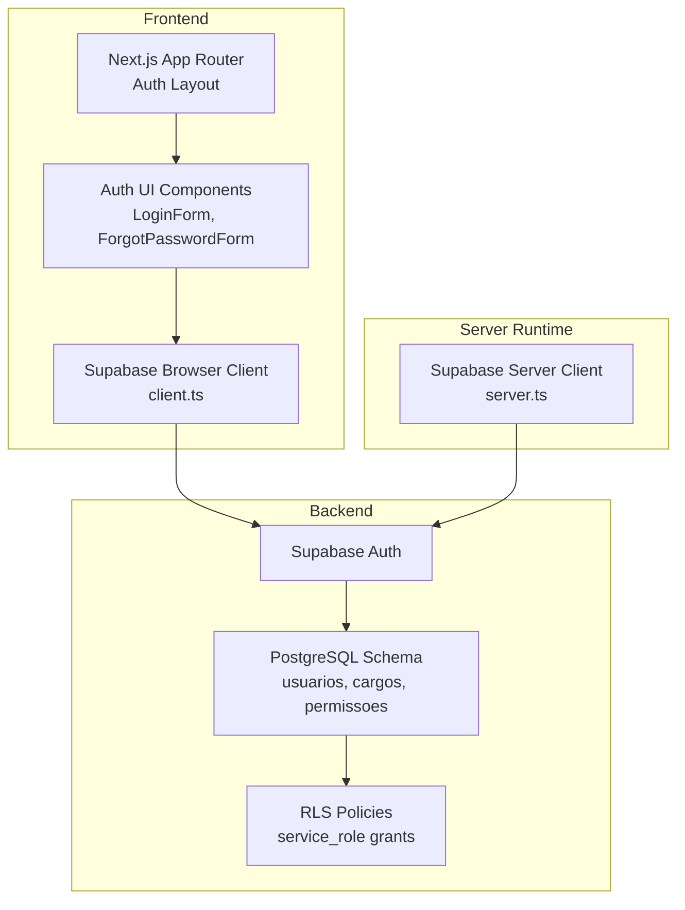
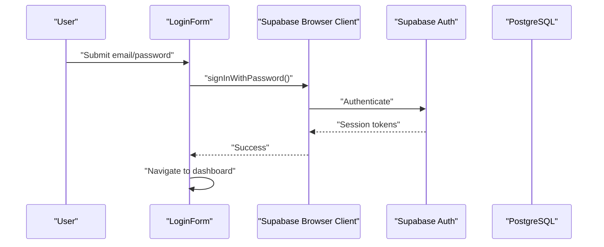
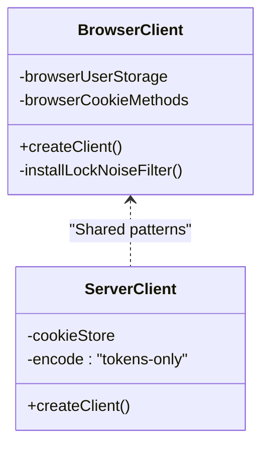
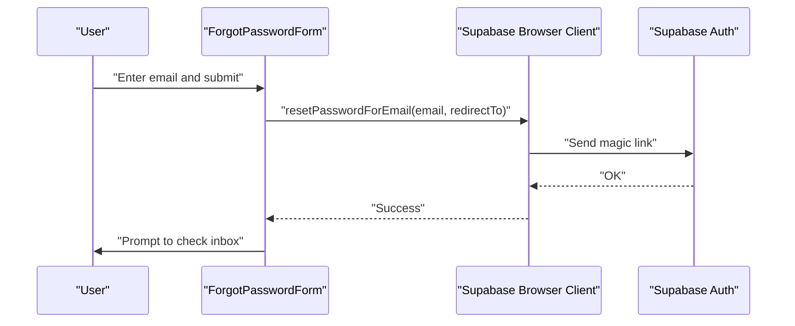
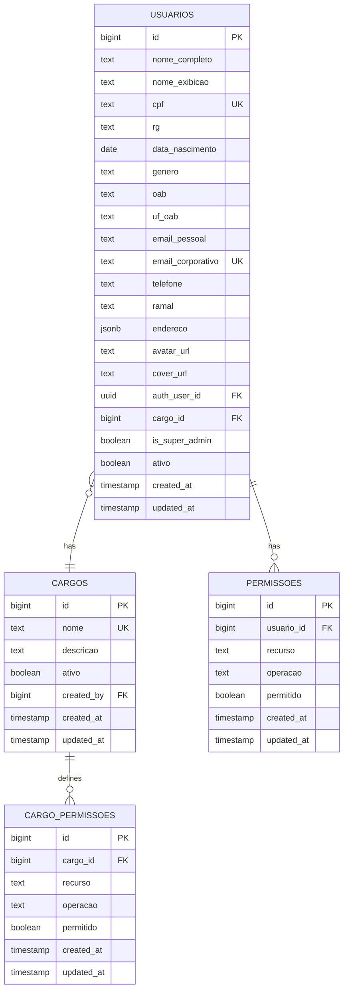
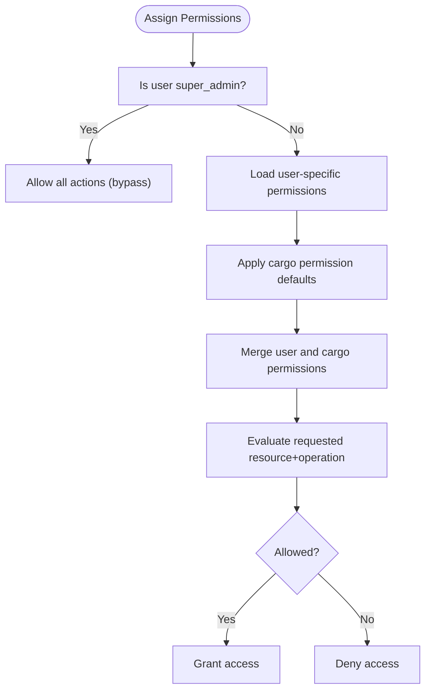
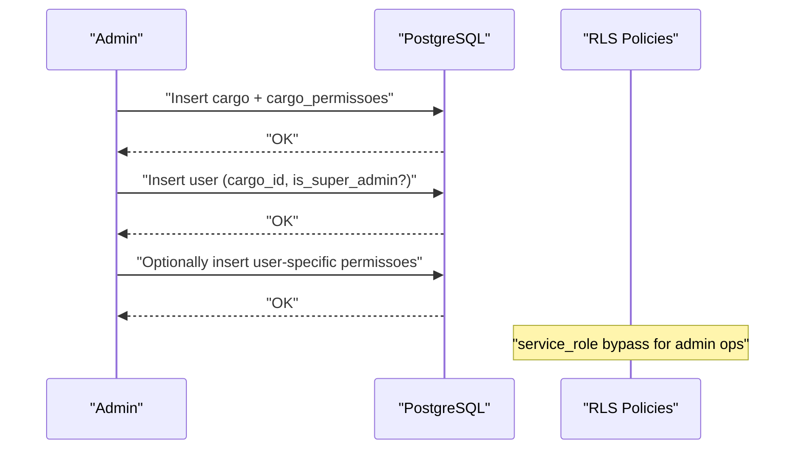
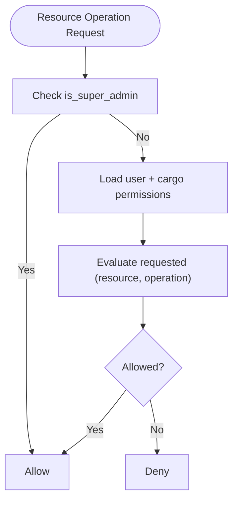
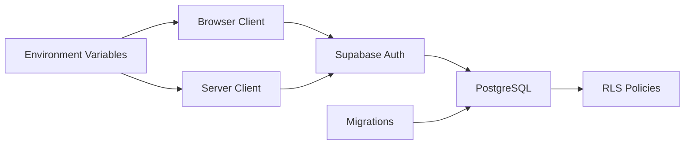

# User Management and Authentication

<cite>
**Referenced Files in This Document**
- [client.ts](file://src/lib/supabase/client.ts)
- [server.ts](file://src/lib/supabase/server.ts)
- [login-form.tsx](file://src/components/auth/login-form.tsx)
- [forgot-password-form.tsx](file://src/components/auth/forgot-password-form.tsx)
- [layout.tsx](file://src/app/(auth)/layout.tsx)
- [08_usuarios.sql](file://supabase/schemas/08_usuarios.sql)
- [22_cargos_permissoes.sql](file://supabase/schemas/22_cargos_permissoes.sql)
- [00_permissions.sql](file://supabase/schemas/00_permissions.sql)
- [20250118120200_alter_usuarios_add_permissions_fields.sql](file://supabase/migrations/20250118120200_alter_usuarios_add_permissions_fields.sql)
- [20250118120201_alter_usuarios_add_permissions_fields_safe.sql](file://supabase/migrations/20250118120201_alter_usuarios_add_permissions_fields_safe.sql)
- [20250118120202_alter_usuarios_add_permissions_fields_simple.sql](file://supabase/migrations/20250118120202_alter_usuarios_add_permissions_fields_simple.sql)
</cite>

## Table of Contents
1. [Introduction](#introduction)
2. [Project Structure](#project-structure)
3. [Core Components](#core-components)
4. [Architecture Overview](#architecture-overview)
5. [Detailed Component Analysis](#detailed-component-analysis)
6. [Dependency Analysis](#dependency-analysis)
7. [Performance Considerations](#performance-considerations)
8. [Troubleshooting Guide](#troubleshooting-guide)
9. [Conclusion](#conclusion)
10. [Appendices](#appendices)

## Introduction
This document explains the User Management and Authentication systems built on Supabase Auth and Realtime. It covers:
- Email/password sign-in and password reset
- Session handling and security policies
- Role-based access control (RBAC) and granular permissions
- Cargo (position) system for organizational roles
- User profile management and storage integration
- Practical workflows for user creation, permission assignment, and access control
- Audit and compliance considerations for user activity monitoring

## Project Structure
The authentication and user management stack spans client, server, UI components, and database schemas:
- Supabase client and server adapters for SSR-safe session handling
- Next.js app router protected routes and auth UI
- PostgreSQL schemas for users, positions (cargos), and permissions
- Migrations adding RBAC-related fields to users

**Diagram sources**
- [client.ts:1-240](file://src/lib/supabase/client.ts#L1-240)
- [server.ts:1-38](file://src/lib/supabase/server.ts#L1-38)
- [login-form.tsx:1-196](file://src/components/auth/login-form.tsx#L1-196)
- [forgot-password-form.tsx:1-165](file://src/components/auth/forgot-password-form.tsx#L1-165)
- [layout.tsx](file://src/app/(auth)/layout.tsx#L1-39)
- [08_usuarios.sql:1-100](file://supabase/schemas/08_usuarios.sql#L1-100)
- [22_cargos_permissoes.sql:1-262](file://supabase/schemas/22_cargos_permissoes.sql#L1-262)
- [00_permissions.sql:1-21](file://supabase/schemas/00_permissions.sql#L1-21)

**Section sources**
- [client.ts:1-240](file://src/lib/supabase/client.ts#L1-240)
- [server.ts:1-38](file://src/lib/supabase/server.ts#L1-38)
- [login-form.tsx:1-196](file://src/components/auth/login-form.tsx#L1-196)
- [forgot-password-form.tsx:1-165](file://src/components/auth/forgot-password-form.tsx#L1-165)
- [layout.tsx](file://src/app/(auth)/layout.tsx#L1-39)
- [08_usuarios.sql:1-100](file://supabase/schemas/08_usuarios.sql#L1-100)
- [22_cargos_permissoes.sql:1-262](file://supabase/schemas/22_cargos_permissoes.sql#L1-262)
- [00_permissions.sql:1-21](file://supabase/schemas/00_permissions.sql#L1-21)

## Core Components
- Supabase Browser Client: SSR-safe, lock noise filtering, cookie encoding, and user storage adapter for client components.
- Supabase Server Client: SSR-compatible client using Next.js cookies for server-side session handling.
- Auth UI: Login form with email/password and password reset flow.
- Database Schema: Users table with RBAC fields, Positions (cargos) table, Permissions tables, and RLS policies.
- Migrations: Add position and super admin fields to users with indices and comments.

**Section sources**
- [client.ts:1-240](file://src/lib/supabase/client.ts#L1-240)
- [server.ts:1-38](file://src/lib/supabase/server.ts#L1-38)
- [login-form.tsx:1-196](file://src/components/auth/login-form.tsx#L1-196)
- [forgot-password-form.tsx:1-165](file://src/components/auth/forgot-password-form.tsx#L1-165)
- [08_usuarios.sql:1-100](file://supabase/schemas/08_usuarios.sql#L1-100)
- [22_cargos_permissoes.sql:1-262](file://supabase/schemas/22_cargos_permissoes.sql#L1-262)
- [20250118120200_alter_usuarios_add_permissions_fields.sql:1-19](file://supabase/migrations/20250118120200_alter_usuarios_add_permissions_fields.sql#L1-19)
- [20250118120201_alter_usuarios_add_permissions_fields_safe.sql:1-56](file://supabase/migrations/20250118120201_alter_usuarios_add_permissions_fields_safe.sql#L1-56)
- [20250118120202_alter_usuarios_add_permissions_fields_simple.sql:1-19](file://supabase/migrations/20250118120202_alter_usuarios_add_permissions_fields_simple.sql#L1-19)

## Architecture Overview
The system integrates Next.js app router with Supabase Auth and Postgres:
- Client components use the browser client to sign in and manage sessions.
- Server components use the server client to access session data and enforce policies.
- Database enforces Row Level Security (RLS) with service_role bypass for backend operations.
- UI renders auth layouts and forms for user interactions.

**Diagram sources**
- [login-form.tsx:31-76](file://src/components/auth/login-form.tsx#L31-76)
- [client.ts:204-239](file://src/lib/supabase/client.ts#L204-239)

**Section sources**
- [login-form.tsx:1-196](file://src/components/auth/login-form.tsx#L1-196)
- [client.ts:1-240](file://src/lib/supabase/client.ts#L1-240)
- [server.ts:1-38](file://src/lib/supabase/server.ts#L1-38)

## Detailed Component Analysis

### Supabase Client Adapters
- Browser client:
  - SSR-safe user storage adapter using localStorage
  - Cookie methods for tokens-only encoding
  - Lock acquisition timeout tuning and noise filtering for auth locks
- Server client:
  - Uses Next.js cookies store
  - Tokens-only cookie encoding to avoid server-side user object proxy warnings

**Diagram sources**
- [client.ts:104-239](file://src/lib/supabase/client.ts#L104-239)
- [server.ts:4-36](file://src/lib/supabase/server.ts#L4-36)

**Section sources**
- [client.ts:1-240](file://src/lib/supabase/client.ts#L1-240)
- [server.ts:1-38](file://src/lib/supabase/server.ts#L1-38)

### Authentication UI and Workflows
- Login form:
  - Handles email/password submission
  - Displays contextual errors and success states
  - Redirects after successful sign-in
- Password reset:
  - Sends password reset email with redirect to update-password route
  - Provides success messaging and navigation

**Diagram sources**
- [forgot-password-form.tsx:19-36](file://src/components/auth/forgot-password-form.tsx#L19-36)
- [client.ts:204-239](file://src/lib/supabase/client.ts#L204-239)

**Section sources**
- [login-form.tsx:1-196](file://src/components/auth/login-form.tsx#L1-196)
- [forgot-password-form.tsx:1-165](file://src/components/auth/forgot-password-form.tsx#L1-165)
- [layout.tsx](file://src/app/(auth)/layout.tsx#L1-39)

### Database Schema: Users, Positions, and Permissions
- Users table:
  - Stores personal/professional info, contact details, media URLs, and auth linkage
  - RLS policies allow authenticated reads and self-update by auth_user_id
- Positions (cargos):
  - Organizational roles with unique names and audit timestamps
  - RLS allows service_role full access and authenticated reads
- Permissions:
  - Granular resource-operation permissions per user
  - RLS allows service_role full access and authenticated users to read their own permissions
- Cargo permissions:
  - Default permission templates per position applied to users

**Diagram sources**
- [08_usuarios.sql:6-100](file://supabase/schemas/08_usuarios.sql#L6-L100)
- [22_cargos_permissoes.sql:6-262](file://supabase/schemas/22_cargos_permissoes.sql#L6-L262)

**Section sources**
- [08_usuarios.sql:1-100](file://supabase/schemas/08_usuarios.sql#L1-100)
- [22_cargos_permissoes.sql:1-262](file://supabase/schemas/22_cargos_permissoes.sql#L1-262)

### RBAC and Permission Assignment Workflow
- Position-based defaults:
  - Cargo permissions define default templates applied to users
- User-level overrides:
  - Direct user permissions can override or extend position defaults
- Super admin bypass:
  - Users marked super admin bypass permission checks
- Enforcement:
  - service_role bypasses RLS for backend operations
  - Frontend enforces policies via RLS and user context

**Diagram sources**
- [22_cargos_permissoes.sql:48-87](file://supabase/schemas/22_cargos_permissoes.sql#L48-L87)
- [08_usuarios.sql:37-38](file://supabase/schemas/08_usuarios.sql#L37-L38)
- [00_permissions.sql:1-21](file://supabase/schemas/00_permissions.sql#L1-21)

**Section sources**
- [22_cargos_permissoes.sql:1-262](file://supabase/schemas/22_cargos_permissoes.sql#L1-262)
- [08_usuarios.sql:1-100](file://supabase/schemas/08_usuarios.sql#L1-100)
- [00_permissions.sql:1-21](file://supabase/schemas/00_permissions.sql#L1-21)

### User Profile Management and Media
- Profile fields:
  - Personal info, professional info (OAB), contacts, address JSONB
  - Avatar and cover image URLs stored in Supabase Storage buckets
- Self-service updates:
  - Authenticated users can update their own profiles via RLS policy
- Organization:
  - Optional cargo association for internal hierarchy

**Section sources**
- [08_usuarios.sql:10-63](file://supabase/schemas/08_usuarios.sql#L10-L63)

### Session Handling and Security Policies
- Client-side:
  - Tokens-only cookies, user object in localStorage adapter
  - Lock noise filtering to prevent false positives during concurrent auth operations
- Server-side:
  - Cookies store only tokens; user object managed server-side
- RLS:
  - service_role bypass for backend
  - Authenticated users can read profiles; self-update restricted by auth_user_id

**Section sources**
- [client.ts:141-239](file://src/lib/supabase/client.ts#L141-239)
- [server.ts:10-36](file://src/lib/supabase/server.ts#L10-36)
- [08_usuarios.sql:84-99](file://supabase/schemas/08_usuarios.sql#L84-L99)
- [00_permissions.sql:1-21](file://supabase/schemas/00_permissions.sql#L1-21)

### Practical Examples

#### Example: User Creation and Permission Assignment
- Create a position (cargo) with default permissions
- Create a user with cargo_id and optional is_super_admin flag
- Optionally grant user-specific permissions overriding cargo defaults

**Diagram sources**
- [22_cargos_permissoes.sql:105-138](file://supabase/schemas/22_cargos_permissoes.sql#L105-L138)
- [22_cargos_permissoes.sql:48-87](file://supabase/schemas/22_cargos_permissoes.sql#L48-L87)
- [08_usuarios.sql:36-38](file://supabase/schemas/08_usuarios.sql#L36-L38)
- [00_permissions.sql:1-21](file://supabase/schemas/00_permissions.sql#L1-21)

#### Example: Access Control Workflow
- Request resource operation
- Check super admin flag
- Load user and cargo permissions
- Merge and evaluate policy
- Grant or deny access

**Diagram sources**
- [22_cargos_permissoes.sql:48-87](file://supabase/schemas/22_cargos_permissoes.sql#L48-L87)
- [08_usuarios.sql:37-38](file://supabase/schemas/08_usuarios.sql#L37-L38)

## Dependency Analysis
- Supabase client adapters depend on environment variables for URL and keys
- Auth UI depends on browser client for authentication operations
- Database schema depends on RLS policies and service_role grants
- Migrations add RBAC fields to users and create supporting indices

**Diagram sources**
- [client.ts:206-214](file://src/lib/supabase/client.ts#L206-L214)
- [server.ts:7-10](file://src/lib/supabase/server.ts#L7-L10)
- [00_permissions.sql:1-21](file://supabase/schemas/00_permissions.sql#L1-21)
- [20250118120200_alter_usuarios_add_permissions_fields.sql:4-10](file://supabase/migrations/20250118120200_alter_usuarios_add_permissions_fields.sql#L4-L10)

**Section sources**
- [client.ts:206-214](file://src/lib/supabase/client.ts#L206-214)
- [server.ts:7-10](file://src/lib/supabase/server.ts#L7-10)
- [00_permissions.sql:1-21](file://supabase/schemas/00_permissions.sql#L1-21)
- [20250118120200_alter_usuarios_add_permissions_fields.sql:1-19](file://supabase/migrations/20250118120200_alter_usuarios_add_permissions_fields.sql#L1-19)

## Performance Considerations
- Indexes on frequently queried columns (e.g., CPF, corporate email, cargo_id, is_super_admin) improve lookup performance.
- RLS policies should leverage covered indexes and avoid expensive joins when possible.
- Token-only cookies reduce payload size and improve network efficiency.
- Lock noise filtering reduces unnecessary error logs and improves developer experience.

[No sources needed since this section provides general guidance]

## Troubleshooting Guide
- Authentication lock warnings:
  - Filter benign lock messages to avoid noisy logs during development and concurrent tabs.
- Environment variables:
  - Ensure NEXT_PUBLIC_SUPABASE_URL and NEXT_PUBLIC_SUPABASE_PUBLISHABLE_OR_ANON_KEY are configured.
- Session issues:
  - Verify cookie encoding and user storage adapter behavior in client and server adapters.
- RLS errors:
  - Confirm service_role grants and policy conditions align with intended access patterns.

**Section sources**
- [client.ts:50-102](file://src/lib/supabase/client.ts#L50-102)
- [client.ts:209-214](file://src/lib/supabase/client.ts#L209-214)
- [00_permissions.sql:1-21](file://supabase/schemas/00_permissions.sql#L1-21)

## Conclusion
The system provides a robust foundation for user management and authentication:
- Secure client/server Supabase adapters with SSR support
- Clear RBAC via positions and granular permissions
- Strong RLS policies and service_role bypass for backend operations
- Practical UI flows for login and password reset
- Extensible schema for future compliance and audit needs

[No sources needed since this section summarizes without analyzing specific files]

## Appendices

### Appendix A: Migration Notes for RBAC Fields
- Safe migration pattern checks for existing columns before altering
- Simple migration uses IF NOT EXISTS clauses for idempotent application
- Standard migration adds columns, comments, and indices

**Section sources**
- [20250118120201_alter_usuarios_add_permissions_fields_safe.sql:5-43](file://supabase/migrations/20250118120201_alter_usuarios_add_permissions_fields_safe.sql#L5-43)
- [20250118120202_alter_usuarios_add_permissions_fields_simple.sql:4-18](file://supabase/migrations/20250118120202_alter_usuarios_add_permissions_fields_simple.sql#L4-18)
- [20250118120200_alter_usuarios_add_permissions_fields.sql:4-18](file://supabase/migrations/20250118120200_alter_usuarios_add_permissions_fields.sql#L4-18)