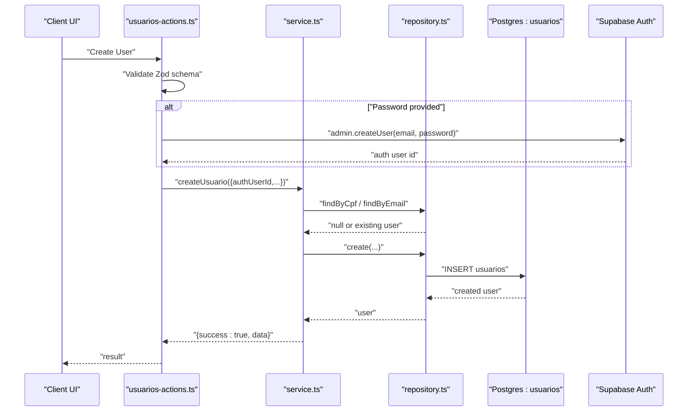
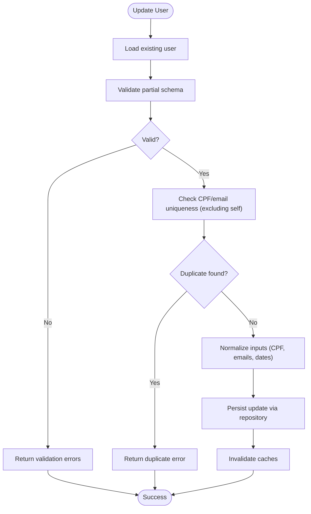
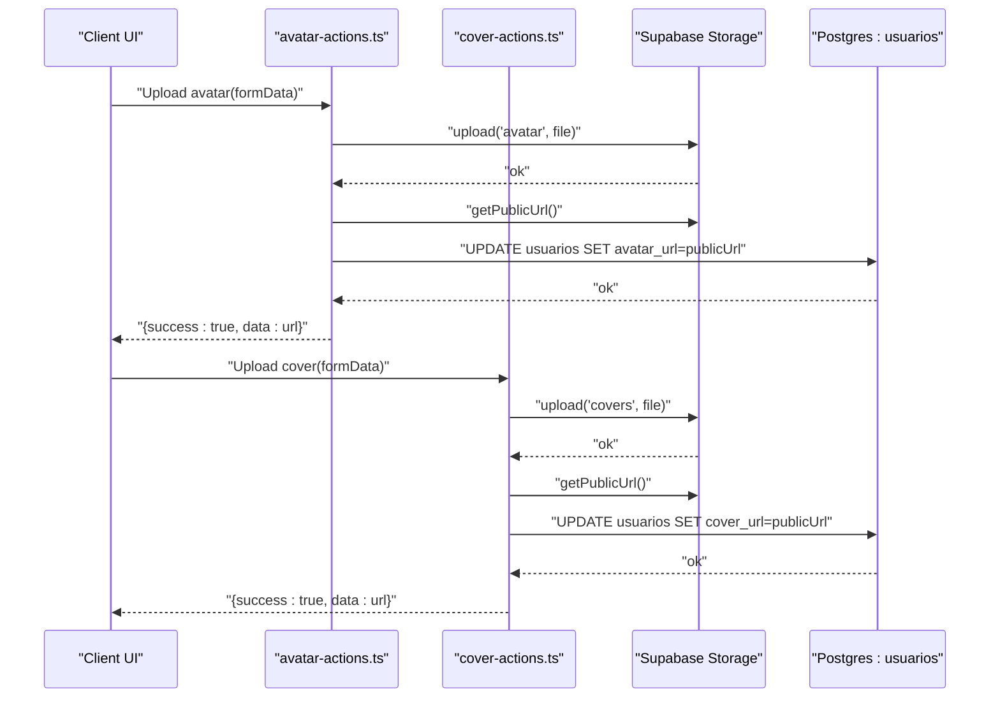
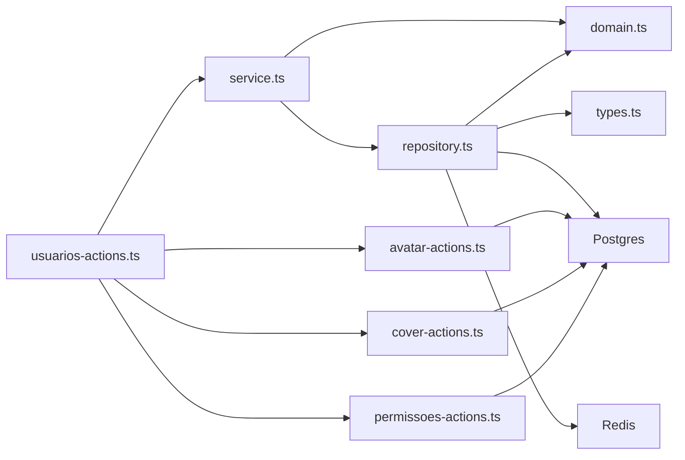

# User Profile Management

<cite>
**Referenced Files in This Document**
- [supabase/schemas/08_usuarios.sql](file://supabase/schemas/08_usuarios.sql)
- [src/app/(authenticated)/usuarios/actions/usuarios-actions.ts](file://src/app/(authenticated)/usuarios/actions/usuarios-actions.ts)
- [src/app/(authenticated)/usuarios/actions/avatar-actions.ts](file://src/app/(authenticated)/usuarios/actions/avatar-actions.ts)
- [src/app/(authenticated)/usuarios/actions/cover-actions.ts](file://src/app/(authenticated)/usuarios/actions/cover-actions.ts)
- [src/app/(authenticated)/usuarios/actions/permissoes-actions.ts](file://src/app/(authenticated)/usuarios/actions/permissoes-actions.ts)
- [src/app/(authenticated)/usuarios/service.ts](file://src/app/(authenticated)/usuarios/service.ts)
- [src/app/(authenticated)/usuarios/repository.ts](file://src/app/(authenticated)/usuarios/repository.ts)
- [src/app/(authenticated)/usuarios/domain.ts](file://src/app/(authenticated)/usuarios/domain.ts)
- [src/app/(authenticated)/usuarios/types/types.ts](file://src/app/(authenticated)/usuarios/types/types.ts)
- [src/app/(authenticated)/usuarios/[id]/page.tsx](file://src/app/(authenticated)/usuarios/[id]/page.tsx)
- [src/app/(authenticated)/usuarios/index.ts](file://src/app/(authenticated)/usuarios/index.ts)
</cite>

## Table of Contents
1. [Introduction](#introduction)
2. [Project Structure](#project-structure)
3. [Core Components](#core-components)
4. [Architecture Overview](#architecture-overview)
5. [Detailed Component Analysis](#detailed-component-analysis)
6. [Dependency Analysis](#dependency-analysis)
7. [Performance Considerations](#performance-considerations)
8. [Troubleshooting Guide](#troubleshooting-guide)
9. [Conclusion](#conclusion)

## Introduction
This document describes the User Profile Management system, covering user registration, profile updates, avatar and cover image management, and personal information handling. It explains the user data model, validation rules, data integrity constraints, profile visibility and privacy controls, and data protection measures. It also documents user CRUD operations, profile synchronization across systems, integration with external identity providers, onboarding flows, profile completion requirements, and data migration scenarios.

## Project Structure
The User Profile Management module is organized around a layered architecture:
- Domain defines typed models, validation schemas, and constants.
- Service encapsulates business logic and orchestrates repository operations.
- Repository handles database interactions and caching.
- Actions expose server functions for UI components and APIs.
- Frontend pages and components render and collect user data.

```mermaid
graph TB
subgraph "Frontend"
UI["UI Components<br/>Forms, Dialogs, Lists"]
Page["Page: /usuarios/[id]"]
end
subgraph "Server Actions"
Actions["Server Actions<br/>usuarios-actions.ts<br/>avatar-actions.ts<br/>cover-actions.ts<br/>permissoes-actions.ts"]
end
subgraph "Service Layer"
Service["Service<br/>service.ts"]
Repo["Repository<br/>repository.ts"]
end
subgraph "Domain"
Domain["Domain Types & Schemas<br/>domain.ts<br/>types/types.ts"]
end
subgraph "Database"
DB["Supabase Postgres<br/>public.usuarios"]
Storage["Supabase Storage<br/>buckets: avatars, covers"]
end
UI --> Page
Page --> Actions
Actions --> Service
Service --> Repo
Repo --> DB
Actions --> Storage
Repo --> Domain
Service --> Domain
Actions --> Domain
```

**Diagram sources**
- [src/app/(authenticated)/usuarios/actions/usuarios-actions.ts](file://src/app/(authenticated)/usuarios/actions/usuarios-actions.ts#L1-L214)
- [src/app/(authenticated)/usuarios/actions/avatar-actions.ts](file://src/app/(authenticated)/usuarios/actions/avatar-actions.ts#L1-L82)
- [src/app/(authenticated)/usuarios/actions/cover-actions.ts](file://src/app/(authenticated)/usuarios/actions/cover-actions.ts#L1-L104)
- [src/app/(authenticated)/usuarios/actions/permissoes-actions.ts](file://src/app/(authenticated)/usuarios/actions/permissoes-actions.ts#L1-L102)
- [src/app/(authenticated)/usuarios/service.ts](file://src/app/(authenticated)/usuarios/service.ts#L1-L211)
- [src/app/(authenticated)/usuarios/repository.ts](file://src/app/(authenticated)/usuarios/repository.ts#L1-L625)
- [src/app/(authenticated)/usuarios/domain.ts](file://src/app/(authenticated)/usuarios/domain.ts#L1-L299)
- [src/app/(authenticated)/usuarios/types/types.ts](file://src/app/(authenticated)/usuarios/types/types.ts#L1-L628)
- [supabase/schemas/08_usuarios.sql:1-100](file://supabase/schemas/08_usuarios.sql#L1-L100)

**Section sources**
- [src/app/(authenticated)/usuarios/index.ts](file://src/app/(authenticated)/usuarios/index.ts#L1-L173)

## Core Components
- Data Model: The user entity is defined in the domain and persisted in the database schema. It includes personal info, professional info (OAB), contact info, address (JSONB), media URLs (avatar and cover), and administrative fields (auth_user_id, cargo_id, is_super_admin, ativo).
- Validation: Zod schemas enforce field constraints for creation and updates, including CPF normalization, email validation, optional phone normalization, and address shape validation.
- Permissions: A granular permission matrix defines resource-operation pairs with validation helpers and UI-friendly matrices.
- Operations: Server actions coordinate validation, optional Auth admin user creation, repository persistence, and cache invalidation.

**Section sources**
- [supabase/schemas/08_usuarios.sql:6-41](file://supabase/schemas/08_usuarios.sql#L6-L41)
- [src/app/(authenticated)/usuarios/domain.ts](file://src/app/(authenticated)/usuarios/domain.ts#L22-L42)
- [src/app/(authenticated)/usuarios/domain.ts](file://src/app/(authenticated)/usuarios/domain.ts#L173-L200)
- [src/app/(authenticated)/usuarios/types/types.ts](file://src/app/(authenticated)/usuarios/types/types.ts#L126-L456)

## Architecture Overview
The system follows a clear separation of concerns:
- UI collects and validates data via forms and dialogs.
- Server actions validate inputs, optionally create Auth users, and delegate to the service.
- The service enforces business rules (duplicates, cargo existence) and coordinates repository operations.
- The repository performs normalized writes, manages cache keys, and invokes stored procedures for complex operations.
- Supabase Storage handles avatar and cover uploads; the database stores public URLs.



**Diagram sources**
- [src/app/(authenticated)/usuarios/actions/usuarios-actions.ts](file://src/app/(authenticated)/usuarios/actions/usuarios-actions.ts#L73-L132)
- [src/app/(authenticated)/usuarios/service.ts](file://src/app/(authenticated)/usuarios/service.ts#L49-L86)
- [src/app/(authenticated)/usuarios/repository.ts](file://src/app/(authenticated)/usuarios/repository.ts#L295-L340)

## Detailed Component Analysis

### User Data Model and Constraints
- Fields: Full name, display name, CPF (unique), RG, birth date, gender, OAB number and state, personal and corporate emails (unique), phone, extension, address as JSONB, avatar and cover URLs, foreign keys to auth.users and cargos, flags for super admin and active status, timestamps.
- Indexes: Unique CPF and email_corporativo, plus additional indexes for performance.
- Row Level Security: Policies allow service_role full access, authenticated users to SELECT, and users to UPDATE their own records via auth_user_id.

**Section sources**
- [supabase/schemas/08_usuarios.sql:6-100](file://supabase/schemas/08_usuarios.sql#L6-L100)

### Validation Rules and Data Integrity
- Creation schema enforces minimum lengths for names, CPF normalization to 11 digits, optional OAB state length, email validation, optional phone normalization, address shape validation, and optional cargo association.
- Update schema is a partial of the creation schema with id inclusion.
- Repository normalizes inputs (CPF, emails, dates) and validates uniqueness during create/update.
- Database constraints ensure unique CPF and email_corporativo.

**Section sources**
- [src/app/(authenticated)/usuarios/domain.ts](file://src/app/(authenticated)/usuarios/domain.ts#L173-L200)
- [src/app/(authenticated)/usuarios/service.ts](file://src/app/(authenticated)/usuarios/service.ts#L52-L77)
- [src/app/(authenticated)/usuarios/repository.ts](file://src/app/(authenticated)/usuarios/repository.ts#L295-L340)

### User CRUD Operations
- List: Supports pagination, search across name, display name, CPF, and email, filters by active, OAB, UF, cargo, and super admin flag. Results cached by list key.
- Retrieve: By id, CPF, or email with individual cache keys.
- Create: Validates schema, checks duplicates, optionally creates Auth user, persists user, invalidates caches.
- Update: Validates partial schema, checks duplicates, updates normalized fields, invalidates caches.
- Deactivate: Performs deattribute operations across related entities via RPCs, then marks user inactive.



**Diagram sources**
- [src/app/(authenticated)/usuarios/service.ts](file://src/app/(authenticated)/usuarios/service.ts#L88-L142)
- [src/app/(authenticated)/usuarios/repository.ts](file://src/app/(authenticated)/usuarios/repository.ts#L342-L408)

**Section sources**
- [src/app/(authenticated)/usuarios/actions/usuarios-actions.ts](file://src/app/(authenticated)/usuarios/actions/usuarios-actions.ts#L10-L26)
- [src/app/(authenticated)/usuarios/actions/usuarios-actions.ts](file://src/app/(authenticated)/usuarios/actions/usuarios-actions.ts#L134-L178)
- [src/app/(authenticated)/usuarios/actions/usuarios-actions.ts](file://src/app/(authenticated)/usuarios/actions/usuarios-actions.ts#L180-L198)
- [src/app/(authenticated)/usuarios/service.ts](file://src/app/(authenticated)/usuarios/service.ts#L25-L47)
- [src/app/(authenticated)/usuarios/service.ts](file://src/app/(authenticated)/usuarios/service.ts#L144-L161)
- [src/app/(authenticated)/usuarios/repository.ts](file://src/app/(authenticated)/usuarios/repository.ts#L221-L293)

### Avatar and Cover Management
- Upload avatar: Validates file presence and size (≤5MB), uploads to "avatars" bucket, stores public URL in avatar_url, invalidates caches, revalidates paths.
- Remove avatar: Clears avatar_url and invalidates caches.
- Upload cover: Validates file type (JPEG, PNG, WebP), size (≤10MB), uploads to "covers" bucket, stores public URL in cover_url, invalidates caches, revalidates paths.
- Remove cover: Clears cover_url and invalidates caches.



**Diagram sources**
- [src/app/(authenticated)/usuarios/actions/avatar-actions.ts](file://src/app/(authenticated)/usuarios/actions/avatar-actions.ts#L9-L59)
- [src/app/(authenticated)/usuarios/actions/cover-actions.ts](file://src/app/(authenticated)/usuarios/actions/cover-actions.ts#L11-L68)

**Section sources**
- [src/app/(authenticated)/usuarios/actions/avatar-actions.ts](file://src/app/(authenticated)/usuarios/actions/avatar-actions.ts#L1-L82)
- [src/app/(authenticated)/usuarios/actions/cover-actions.ts](file://src/app/(authenticated)/usuarios/actions/cover-actions.ts#L1-L104)

### Personal Information Handling
- Address is stored as JSONB with optional fields for street, number, complement, neighborhood, city, state (2-letter), country, and postal code (digits only).
- Phone numbers are normalized to digits; empty strings are treated as null.
- Birth date supports multiple input formats and is normalized to ISO date string.

**Section sources**
- [supabase/schemas/08_usuarios.sql:27-28](file://supabase/schemas/08_usuarios.sql#L27-L28)
- [src/app/(authenticated)/usuarios/domain.ts](file://src/app/(authenticated)/usuarios/domain.ts#L161-L171)
- [src/app/(authenticated)/usuarios/domain.ts](file://src/app/(authenticated)/usuarios/domain.ts#L158-L159)
- [src/app/(authenticated)/usuarios/repository.ts](file://src/app/(authenticated)/usuarios/repository.ts#L48-L89)

### Profile Visibility Settings and Privacy Controls
- Row Level Security policies:
  - service_role: full access.
  - authenticated: SELECT access.
  - authenticated users can UPDATE their own profile via auth_user_id match.
- Super admin flag bypasses permission checks in higher-level modules.
- Email uniqueness ensures single corporate email per user; CPF uniqueness prevents duplicate identities.

**Section sources**
- [supabase/schemas/08_usuarios.sql:81-100](file://supabase/schemas/08_usuarios.sql#L81-L100)

### Data Protection Measures
- Supabase Auth integration allows secure password-based authentication and optional email confirmation.
- Stored procedure-based deattribute operations ensure referential integrity when deactivating users.
- Cache invalidation and revalidation keep views consistent after updates.
- File uploads to dedicated buckets with controlled access; URLs stored as public links.

**Section sources**
- [src/app/(authenticated)/usuarios/actions/usuarios-actions.ts](file://src/app/(authenticated)/usuarios/actions/usuarios-actions.ts#L94-L107)
- [src/app/(authenticated)/usuarios/repository.ts](file://src/app/(authenticated)/usuarios/repository.ts#L431-L498)

### User Onboarding Flows and Profile Completion
- Profile completeness utilities and UI components indicate completion metrics and guide users to fill required fields.
- The system supports creating users with or without passwords; when a password is provided, an Auth user is provisioned automatically.

**Section sources**
- [src/app/(authenticated)/usuarios/index.ts](file://src/app/(authenticated)/usuarios/index.ts#L160-L167)
- [src/app/(authenticated)/usuarios/actions/usuarios-actions.ts](file://src/app/(authenticated)/usuarios/actions/usuarios-actions.ts#L94-L107)

### Profile Synchronization Across Systems
- Synchronize Auth users to internal users: scans for Auth users without corresponding internal profiles, derives display names from metadata or email, generates temporary CPF from Auth user id, and creates internal user records.

**Section sources**
- [src/app/(authenticated)/usuarios/service.ts](file://src/app/(authenticated)/usuarios/service.ts#L163-L209)
- [src/app/(authenticated)/usuarios/actions/usuarios-actions.ts](file://src/app/(authenticated)/usuarios/actions/usuarios-actions.ts#L200-L213)

### Integration with External Identity Providers
- Supabase Auth admin APIs are used to create users programmatically when registering new users with passwords.
- Existing Auth users can be synchronized into the internal user table for unified permissions and profile management.

**Section sources**
- [src/app/(authenticated)/usuarios/actions/usuarios-actions.ts](file://src/app/(authenticated)/usuarios/actions/usuarios-actions.ts#L94-L107)
- [src/app/(authenticated)/usuarios/service.ts](file://src/app/(authenticated)/usuarios/service.ts#L163-L209)

### Data Migration Scenarios
- Historical avatar URL normalization and bucket migration are handled by database migrations.
- Address normalization and geolocation adjustments are performed via migrations to maintain data quality.

**Section sources**
- [supabase/migrations/20260423120000_normalize_legacy_avatar_urls.sql](file://supabase/migrations/20260423120000_normalize_legacy_avatar_urls.sql)
- [supabase/migrations/20260422130000_uniformizar_geolocation_documento_assinantes.sql](file://supabase/migrations/20260422130000_uniformizar_geolocation_documento_assinantes.sql)

## Dependency Analysis
The module exhibits low coupling and high cohesion:
- Actions depend on service and repository abstractions.
- Service depends on repository and Zod schemas.
- Repository depends on Supabase clients, Redis cache helpers, and database schemas.
- Domain types are shared across layers.



**Diagram sources**
- [src/app/(authenticated)/usuarios/actions/usuarios-actions.ts](file://src/app/(authenticated)/usuarios/actions/usuarios-actions.ts#L1-L214)
- [src/app/(authenticated)/usuarios/actions/avatar-actions.ts](file://src/app/(authenticated)/usuarios/actions/avatar-actions.ts#L1-L82)
- [src/app/(authenticated)/usuarios/actions/cover-actions.ts](file://src/app/(authenticated)/usuarios/actions/cover-actions.ts#L1-L104)
- [src/app/(authenticated)/usuarios/actions/permissoes-actions.ts](file://src/app/(authenticated)/usuarios/actions/permissoes-actions.ts#L1-L102)
- [src/app/(authenticated)/usuarios/service.ts](file://src/app/(authenticated)/usuarios/service.ts#L1-L211)
- [src/app/(authenticated)/usuarios/repository.ts](file://src/app/(authenticated)/usuarios/repository.ts#L1-L625)
- [src/app/(authenticated)/usuarios/domain.ts](file://src/app/(authenticated)/usuarios/domain.ts#L1-L299)
- [src/app/(authenticated)/usuarios/types/types.ts](file://src/app/(authenticated)/usuarios/types/types.ts#L1-L628)

**Section sources**
- [src/app/(authenticated)/usuarios/index.ts](file://src/app/(authenticated)/usuarios/index.ts#L86-L103)

## Performance Considerations
- Caching: Repository caches user lists and individual users with TTL; cache keys are invalidated on updates and deactivation.
- Column selection: Dedicated column selectors minimize I/O for basic vs. full user loads.
- Indexes: Unique and selective indexes support fast lookups by CPF, email, and filters.
- Batch operations: Permission replacement uses upsert/delete-insert to reduce round trips.
- File uploads: Size and type validations prevent oversized or unsupported assets.

[No sources needed since this section provides general guidance]

## Troubleshooting Guide
Common issues and resolutions:
- Duplicate CPF or email: Creation/update returns duplicate error; ensure unique values.
- Invalid CPF format: Must normalize to 11 digits; validation rejects otherwise.
- Missing or invalid file: Avatar/Cover actions validate presence, size, and type; adjust accordingly.
- Permission denied: Ensure authenticated user matches auth_user_id for profile updates; verify required permissions for administrative actions.
- Cache staleness: Updates invalidate caches; if stale data appears, trigger revalidation or wait for TTL.

**Section sources**
- [src/app/(authenticated)/usuarios/service.ts](file://src/app/(authenticated)/usuarios/service.ts#L61-L69)
- [src/app/(authenticated)/usuarios/service.ts](file://src/app/(authenticated)/usuarios/service.ts#L107-L125)
- [src/app/(authenticated)/usuarios/actions/avatar-actions.ts](file://src/app/(authenticated)/usuarios/actions/avatar-actions.ts#L18-L20)
- [src/app/(authenticated)/usuarios/actions/cover-actions.ts](file://src/app/(authenticated)/usuarios/actions/cover-actions.ts#L20-L31)
- [supabase/schemas/08_usuarios.sql:95-98](file://supabase/schemas/08_usuarios.sql#L95-L98)

## Conclusion
The User Profile Management system provides a robust, secure, and scalable foundation for user lifecycle management. It enforces strong validation and integrity constraints, integrates seamlessly with Supabase Auth and Storage, and offers granular permissions and efficient caching. The modular design supports future enhancements such as advanced onboarding flows, richer profile completion metrics, and expanded identity provider integrations.