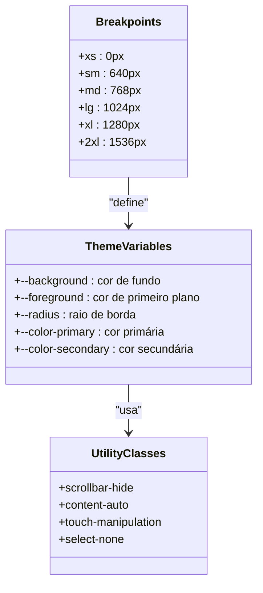
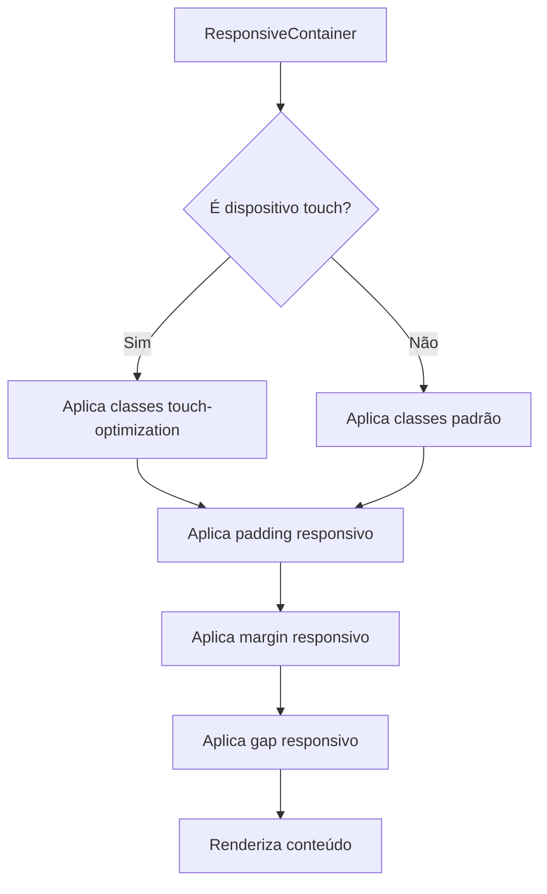
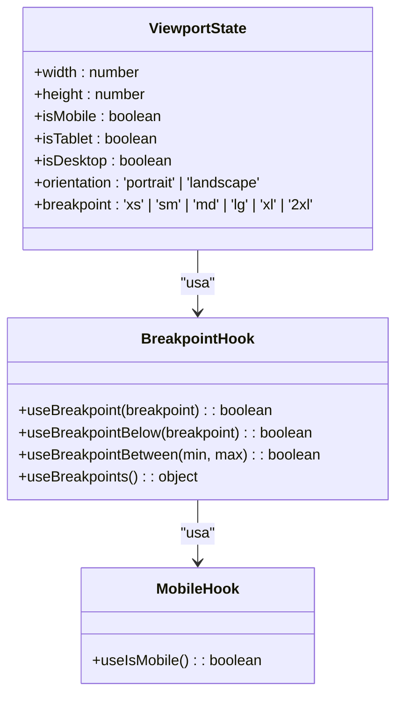
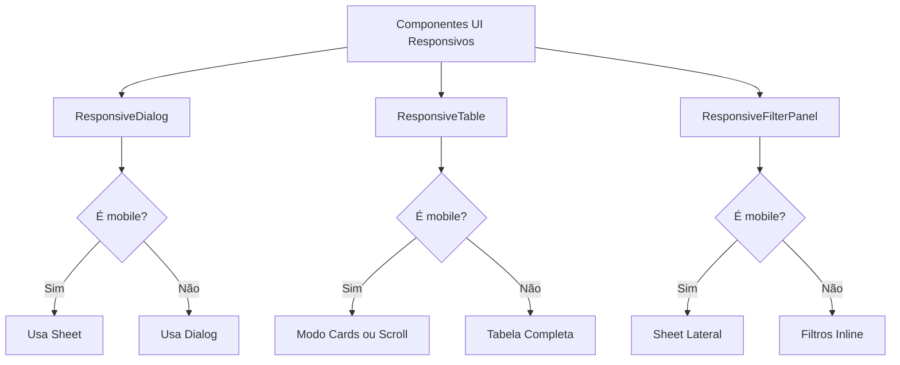
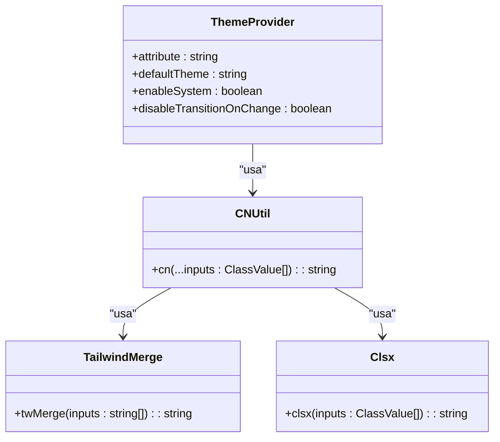

# Design Responsivo

<cite>
**Arquivos Referenciados neste Documento**   
- [app\globals.css](file://app/globals.css)
- [app\layout.tsx](file://app/layout.tsx)
- [components\ui\responsive-container.tsx](file://components/ui/responsive-container.tsx)
- [components\ui\responsive-dialog.tsx](file://components/ui/responsive-dialog.tsx)
- [components\ui\responsive-table.tsx](file://components/ui/responsive-table.tsx)
- [components\ui\responsive-filter-panel.tsx](file://components/ui/responsive-filter-panel.tsx)
- [hooks\use-viewport.ts](file://hooks/use-viewport.ts)
- [hooks\use-breakpoint.ts](file://hooks/use-breakpoint.ts)
- [app\_lib\hooks\use-mobile.ts](file://app/_lib/hooks/use-mobile.ts)
- [lib\utils.ts](file://lib/utils.ts)
</cite>

## Sumário
1. [Introdução](#introdução)
2. [Estrutura de Estilos Globais](#estrutura-de-estilos-globais)
3. [Componentes de Layout Responsivo](#componentes-de-layout-responsivo)
4. [Sistema de Detecção de Viewport](#sistema-de-deteção-de-viewport)
5. [Componentes UI Responsivos](#componentes-ui-responsivos)
6. [Gerenciamento de Tema e Estilos](#gerenciamento-de-tema-e-estilos)

## Introdução

O sistema de design responsivo do Sinesys é uma implementação abrangente que garante uma experiência de usuário consistente e otimizada em dispositivos de diferentes tamanhos e orientações. A arquitetura combina CSS moderno com componentes React inteligentes e hooks personalizados para criar interfaces que se adaptam dinamicamente ao ambiente do usuário.

O sistema utiliza Tailwind CSS como framework base, complementado por uma camada de componentes responsivos personalizados que encapsulam lógica complexa de detecção de viewport e adaptação de layout. A abordagem prioriza a acessibilidade, desempenho e usabilidade em dispositivos móveis, desktops e tablets.

**Fontes da seção**
- [app\globals.css](file://app/globals.css)
- [app\layout.tsx](file://app/layout.tsx)

## Estrutura de Estilos Globais

A base do sistema de design responsivo está definida no arquivo `globals.css`, que configura variáveis CSS, breakpoints e classes utilitárias essenciais para a responsividade.

O arquivo define uma série de variáveis CSS que controlam aspectos visuais como cores, espaçamentos e raios de borda, com suporte a temas claro e escuro. Os breakpoints são configurados de acordo com o padrão Tailwind CSS, permitindo uma transição suave entre diferentes tamanhos de tela.

**Fontes do diagrama**
- [app\globals.css](file://app/globals.css)

**Fontes da seção**
- [app\globals.css](file://app/globals.css)

## Componentes de Layout Responsivo

O sistema inclui um componente `ResponsiveContainer` que serve como base para layouts responsivos, aplicando classes automaticamente com base no viewport atual e detectando dispositivos touch para otimizações específicas.

O componente aceita configurações de padding, margin e gap responsivos, além de opções para centralização e aplicação de classes específicas para dispositivos touch. Ele utiliza o hook `useViewport` para obter informações sobre o tamanho da tela e orientação do dispositivo.

**Fontes do diagrama**
- [components\ui\responsive-container.tsx](file://components/ui/responsive-container.tsx)
- [hooks\use-viewport.ts](file://hooks/use-viewport.ts)

**Fontes da seção**
- [components\ui\responsive-container.tsx](file://components/ui/responsive-container.tsx)

## Sistema de Detecção de Viewport

O sistema de detecção de viewport é implementado através de hooks personalizados que fornecem informações detalhadas sobre o ambiente do usuário. O hook principal `useViewport` retorna um objeto com informações sobre largura, altura, breakpoint atual, orientação e tipos de dispositivo.

Os hooks `useBreakpoint` e `useBreakpointBelow` permitem verificações específicas de breakpoints, enquanto `useIsMobile` fornece uma verificação simplificada para dispositivos móveis. Esses hooks são essenciais para a lógica de renderização condicional em componentes responsivos.

**Fontes do diagrama**
- [hooks\use-viewport.ts](file://hooks/use-viewport.ts)
- [hooks\use-breakpoint.ts](file://hooks/use-breakpoint.ts)
- [app\_lib\hooks\use-mobile.ts](file://app/_lib/hooks/use-mobile.ts)

**Fontes da seção**
- [hooks\use-viewport.ts](file://hooks/use-viewport.ts)
- [hooks\use-breakpoint.ts](file://hooks/use-breakpoint.ts)
- [app\_lib\hooks\use-mobile.ts](file://app/_lib/hooks/use-mobile.ts)

## Componentes UI Responsivos

O sistema inclui uma série de componentes UI responsivos que se adaptam automaticamente ao tamanho da tela. O componente `ResponsiveDialog` é um exemplo notável, que usa `Dialog` em desktop e `Sheet` em mobile para garantir uma experiência de usuário apropriada para cada plataforma.

O componente `ResponsiveTable` oferece dois modos de exibição em mobile: scroll horizontal com indicadores ou layout de cards. Em desktop, exibe a tabela completa com todas as colunas. O componente `ResponsiveFilterPanel` exibe filtros inline em desktop e como um Sheet lateral em mobile.

**Fontes do diagrama**
- [components\ui\responsive-dialog.tsx](file://components/ui/responsive-dialog.tsx)
- [components\ui\responsive-table.tsx](file://components/ui/responsive-table.tsx)
- [components\ui\responsive-filter-panel.tsx](file://components/ui/responsive-filter-panel.tsx)

**Fontes da seção**
- [components\ui\responsive-dialog.tsx](file://components/ui/responsive-dialog.tsx)
- [components\ui\responsive-table.tsx](file://components/ui/responsive-table.tsx)
- [components\ui\responsive-filter-panel.tsx](file://components/ui/responsive-filter-panel.tsx)

## Gerenciamento de Tema e Estilos

O sistema de gerenciamento de tema é implementado através do componente `ThemeProvider`, que envolve a aplicação e fornece suporte a temas claro, escuro e automático baseado nas preferências do sistema.

O utilitário `cn` combina classes CSS usando `clsx` e `tailwind-merge`, garantindo que classes conflitantes do Tailwind sejam corretamente mescladas. Este utilitário é essencial para a composição de classes em componentes responsivos, onde diferentes classes podem ser aplicadas com base no breakpoint.

**Fontes do diagrama**
- [components\ui\theme-provider.tsx](file://components/ui/theme-provider.tsx)
- [lib\utils.ts](file://lib/utils.ts)

**Fontes da seção**
- [components\ui\theme-provider.tsx](file://components/ui/theme-provider.tsx)
- [lib\utils.ts](file://lib/utils.ts)