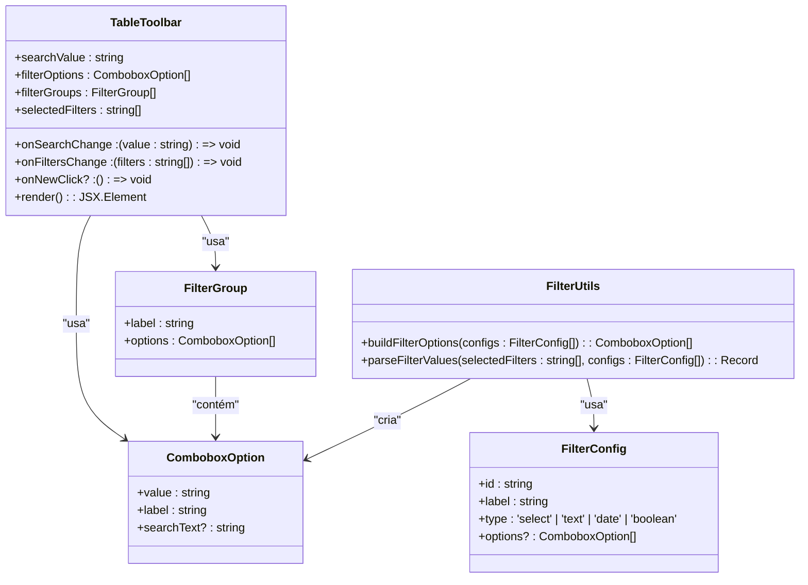
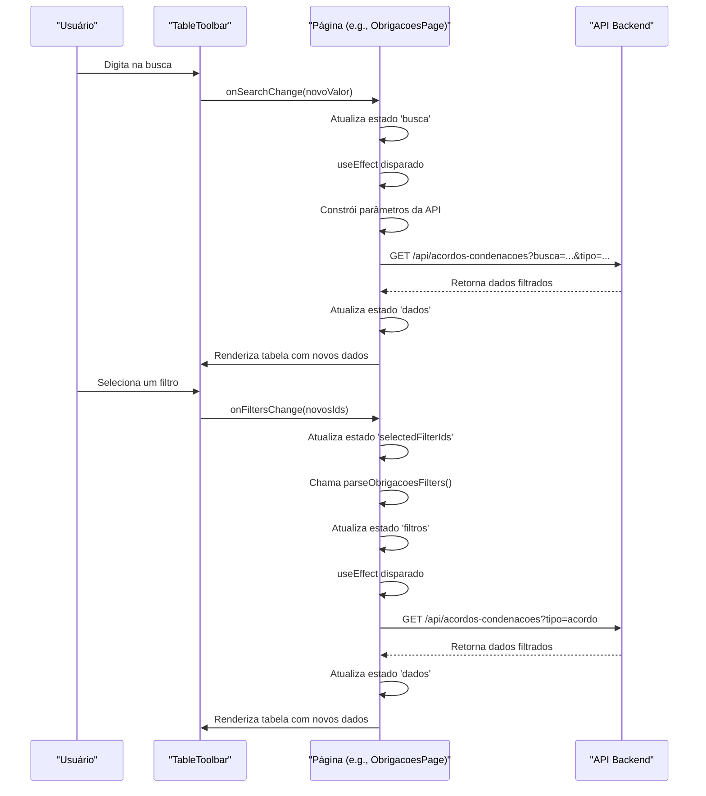
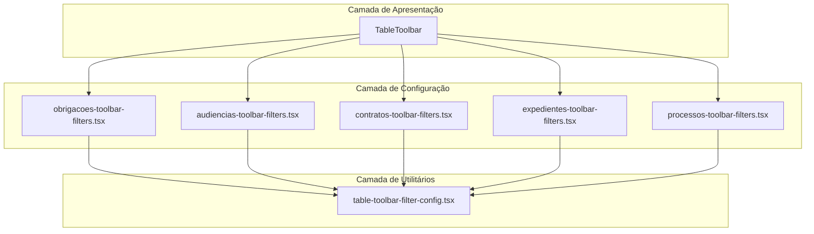

# Redesign da Barra de Filtros da Interface do Usuário

<cite>
**Arquivos Referenciados neste Documento**   
- [obrigacoes-toolbar-filters.tsx](file://app/(dashboard)/acordos-condenacoes/components/obrigacoes-toolbar-filters.tsx)
- [audiencias-toolbar-filters.tsx](file://app/(dashboard)/audiencias/components/audiencias-toolbar-filters.tsx)
- [contratos-toolbar-filters.tsx](file://app/(dashboard)/contratos/components/contratos-toolbar-filters.tsx)
- [expedientes-toolbar-filters.tsx](file://app/(dashboard)/expedientes/components/expedientes-toolbar-filters.tsx)
- [processos-toolbar-filters.tsx](file://app/(dashboard)/processos/components/processos-toolbar-filters.tsx)
- [table-toolbar.tsx](file://components/ui/table-toolbar.tsx)
- [table-toolbar-filter-config.tsx](file://components/ui/table-toolbar-filter-config.tsx)
- [acordos-condenacoes-list.tsx](file://app/(dashboard)/acordos-condenacoes/components/acordos-condenacoes-list.tsx)
- [audiencias-visualizacao-semana.tsx](file://app/(dashboard)/audiencias/components/audiencias-visualizacao-semana.tsx)
- [expedientes-visualizacao-semana.tsx](file://app/(dashboard)/expedientes/components/expedientes-visualizacao-semana.tsx)
- [page.tsx](file://app/(dashboard)/acordos-condenacoes/page.tsx)
- [page.tsx](file://app/(dashboard)/audiencias/page.tsx)
- [page.tsx](file://app/(dashboard)/contratos/page.tsx)
- [page.tsx](file://app/(dashboard)/expedientes/page.tsx)
- [page.tsx](file://app/(dashboard)/processos/page.tsx)
</cite>

## Sumário
1. [Introdução](#introdução)
2. [Análise da Arquitetura da Barra de Filtros](#análise-da-arquitetura-da-barra-de-filtros)
3. [Componentes Principais](#componentes-principais)
4. [Fluxo de Dados e Estado](#fluxo-de-dados-e-estado)
5. [Padrões de Projeto e Reutilização](#padrões-de-projeto-e-reutilização)
6. [Diagrama de Arquitetura](#diagrama-de-arquitetura)
7. [Guia de Implementação](#guia-de-implementação)
8. [Considerações de Desempenho](#considerações-de-desempenho)
9. [Conclusão](#conclusão)

## Introdução
Este documento detalha a análise e o redesign da barra de filtros da interface do usuário, um componente central para a interação do usuário com listagens de dados no sistema. A barra de filtros é um elemento de UI presente em múltiplas páginas do dashboard, como Acordos/Condenações, Audiências, Contratos, Expedientes e Processos. O objetivo deste redesign é padronizar, modularizar e melhorar a experiência de filtragem, tornando-a mais intuitiva e eficiente. A análise abrange a arquitetura atual, os padrões de código, o fluxo de dados e as interações entre os componentes, fornecendo uma base sólida para a implementação de melhorias.

**Seção fontes**
- [page.tsx](file://app/(dashboard)/acordos-condenacoes/page.tsx#L1-L283)
- [page.tsx](file://app/(dashboard)/audiencias/page.tsx#L1-L800)
- [page.tsx](file://app/(dashboard)/contratos/page.tsx#L1-L315)
- [page.tsx](file://app/(dashboard)/expedientes/page.tsx#L1-L800)
- [page.tsx](file://app/(dashboard)/processos/page.tsx#L1-L724)

## Análise da Arquitetura da Barra de Filtros
A arquitetura da barra de filtros é baseada em um padrão de design modular e reutilizável. Ele é composto por três camadas principais: a camada de apresentação (`TableToolbar`), a camada de configuração (`*toolbar-filters.tsx`) e a camada de utilitários (`table-toolbar-filter-config.tsx`). A camada de apresentação é responsável pela renderização da UI, incluindo a barra de busca, o botão de filtros e o botão de ação "Novo". A camada de configuração define os filtros específicos para cada entidade (por exemplo, `OBRIGACOES_FILTER_CONFIGS` para acordos), mapeando-os para opções de UI. A camada de utilitários fornece funções genéricas para construir opções de filtro e analisar valores selecionados. Essa separação de preocupações permite que a lógica de filtragem seja definida de forma declarativa em cada página, enquanto a lógica de renderização e interação é centralizada e consistente.

**Seção fontes**
- [table-toolbar.tsx](file://components/ui/table-toolbar.tsx#L1-L293)
- [table-toolbar-filter-config.tsx](file://components/ui/table-toolbar-filter-config.tsx#L1-L73)
- [obrigacoes-toolbar-filters.tsx](file://app/(dashboard)/acordos-condenacoes/components/obrigacoes-toolbar-filters.tsx#L1-L145)
- [audiencias-toolbar-filters.tsx](file://app/(dashboard)/audiencias/components/audiencias-toolbar-filters.tsx#L1-L213)
- [contratos-toolbar-filters.tsx](file://app/(dashboard)/contratos/components/contratos-toolbar-filters.tsx#L1-L70)
- [expedientes-toolbar-filters.tsx](file://app/(dashboard)/expedientes/components/expedientes-toolbar-filters.tsx#L1-L286)
- [processos-toolbar-filters.tsx](file://app/(dashboard)/processos/components/processos-toolbar-filters.tsx#L1-L219)

## Componentes Principais
Os componentes principais do sistema de filtros são o `TableToolbar`, os arquivos de configuração de filtros específicos da página e as funções de utilitário. O `TableToolbar` é o componente de UI principal que renderiza a barra completa, utilizando o `Popover` para o menu de filtros e o `Command` para a lista de opções. Os arquivos de configuração de filtros, como `obrigacoes-toolbar-filters.tsx`, exportam uma constante `FILTER_CONFIGS` que define os filtros disponíveis (ID, rótulo, tipo e opções) e funções para construir opções e analisar filtros. As funções de utilitário `buildFilterOptions` e `parseFilterValues` no `table-toolbar-filter-config.tsx` fornecem a lógica genérica para transformar as configurações em opções de UI e para converter opções selecionadas de volta em um objeto de filtros.

**Fontes do diagrama**
- [table-toolbar.tsx](file://components/ui/table-toolbar.tsx#L35-L58)
- [table-toolbar-filter-config.tsx](file://components/ui/table-toolbar-filter-config.tsx#L7-L14)
- [table-toolbar-filter-config.tsx](file://components/ui/table-toolbar-filter-config.tsx#L16-L73)

**Seção fontes**
- [table-toolbar.tsx](file://components/ui/table-toolbar.tsx#L1-L293)
- [table-toolbar-filter-config.tsx](file://components/ui/table-toolbar-filter-config.tsx#L1-L73)
- [obrigacoes-toolbar-filters.tsx](file://app/(dashboard)/acordos-condenacoes/components/obrigacoes-toolbar-filters.tsx#L1-L145)

## Fluxo de Dados e Estado
O fluxo de dados e estado na barra de filtros é unidirecional e controlado pelo React. O estado de busca e os filtros selecionados são mantidos no componente da página (por exemplo, `ObrigacoesPage`). Quando o usuário interage com a barra de busca ou seleciona um filtro, os callbacks `onSearchChange` e `onFiltersChange` são chamados, atualizando o estado da página. Essas mudanças de estado disparam um `useEffect` que, por sua vez, chama a função `loadData` para buscar dados atualizados da API com os novos parâmetros de busca e filtro. O estado `selectedFilterIds` é um array de strings que representa os IDs dos filtros ativos, e a função `parseObrigacoesFilters` converte esse array em um objeto de filtros tipado (`ObrigacoesFilters`) que é usado para construir a URL da API.

**Fontes do diagrama**
- [page.tsx](file://app/(dashboard)/acordos-condenacoes/page.tsx#L19-L21)
- [page.tsx](file://app/(dashboard)/acordos-condenacoes/page.tsx#L149-L158)
- [page.tsx](file://app/(dashboard)/acordos-condenacoes/page.tsx#L300-L335)
- [obrigacoes-toolbar-filters.tsx](file://app/(dashboard)/acordos-condenacoes/components/obrigacoes-toolbar-filters.tsx#L118-L144)

**Seção fontes**
- [page.tsx](file://app/(dashboard)/acordos-condenacoes/page.tsx#L1-L283)
- [obrigacoes-toolbar-filters.tsx](file://app/(dashboard)/acordos-condenacoes/components/obrigacoes-toolbar-filters.tsx#L1-L145)

## Padrões de Projeto e Reutilização
O sistema de filtros demonstra um forte uso de padrões de projeto de software, especialmente o padrão de fábrica e a composição de funções. O padrão de fábrica é evidente nas funções `buildObrigacoesFilterOptions` e `buildObrigacoesFilterGroups`, que atuam como fábricas para criar opções e grupos de filtros a partir de uma configuração base. A reutilização é alcançada através da função genérica `parseFilterValues`, que pode analisar filtros de qualquer entidade, desde que seja fornecida a configuração correta. A estrutura de diretórios, com um arquivo `*toolbar-filters.tsx` dedicado em cada pasta de entidade, promove a organização e a manutenção, permitindo que cada equipe de desenvolvimento gerencie seus próprios filtros de forma independente.

**Seção fontes**
- [obrigacoes-toolbar-filters.tsx](file://app/(dashboard)/acordos-condenacoes/components/obrigacoes-toolbar-filters.tsx#L44-L63)
- [obrigacoes-toolbar-filters.tsx](file://app/(dashboard)/acordos-condenacoes/components/obrigacoes-toolbar-filters.tsx#L68-L116)
- [table-toolbar-filter-config.tsx](file://components/ui/table-toolbar-filter-config.tsx#L45-L73)

## Diagrama de Arquitetura
O diagrama de arquitetura ilustra a relação entre os componentes principais do sistema de filtros. A camada de apresentação (`TableToolbar`) consome dados da camada de configuração (arquivos específicos da página) e utiliza funções da camada de utilitários. A camada de configuração define os filtros e exporta funções para construir opções e analisar filtros. A camada de utilitários fornece funções genéricas que são usadas por todas as configurações. Esta arquitetura em camadas garante que a lógica de negócios (quais filtros estão disponíveis) esteja separada da lógica de apresentação (como os filtros são exibidos).

**Fontes do diagrama**
- [table-toolbar.tsx](file://components/ui/table-toolbar.tsx#L1-L293)
- [obrigacoes-toolbar-filters.tsx](file://app/(dashboard)/acordos-condenacoes/components/obrigacoes-toolbar-filters.tsx#L1-L145)
- [audiencias-toolbar-filters.tsx](file://app/(dashboard)/audiencias/components/audiencias-toolbar-filters.tsx#L1-L213)
- [contratos-toolbar-filters.tsx](file://app/(dashboard)/contratos/components/contratos-toolbar-filters.tsx#L1-L70)
- [expedientes-toolbar-filters.tsx](file://app/(dashboard)/expedientes/components/expedientes-toolbar-filters.tsx#L1-L286)
- [processos-toolbar-filters.tsx](file://app/(dashboard)/processos/components/processos-toolbar-filters.tsx#L1-L219)
- [table-toolbar-filter-config.tsx](file://components/ui/table-toolbar-filter-config.tsx#L1-L73)

**Seção fontes**
- [table-toolbar.tsx](file://components/ui/table-toolbar.tsx#L1-L293)
- [obrigacoes-toolbar-filters.tsx](file://app/(dashboard)/acordos-condenacoes/components/obrigacoes-toolbar-filters.tsx#L1-L145)
- [audiencias-toolbar-filters.tsx](file://app/(dashboard)/audiencias/components/audiencias-toolbar-filters.tsx#L1-L213)
- [contratos-toolbar-filters.tsx](file://app/(dashboard)/contratos/components/contratos-toolbar-filters.tsx#L1-L70)
- [expedientes-toolbar-filters.tsx](file://app/(dashboard)/expedientes/components/expedientes-toolbar-filters.tsx#L1-L286)
- [processos-toolbar-filters.tsx](file://app/(dashboard)/processos/components/processos-toolbar-filters.tsx#L1-L219)
- [table-toolbar-filter-config.tsx](file://components/ui/table-toolbar-filter-config.tsx#L1-L73)

## Guia de Implementação
Para implementar um novo conjunto de filtros para uma entidade, siga estas etapas: 1) Crie um novo arquivo `nome-da-entidade-toolbar-filters.tsx` na pasta `components` da página. 2) Defina uma constante `FILTER_CONFIGS` exportada com os filtros desejados. 3) Implemente as funções `buildFilterOptions` e `parseFilters` usando as funções de utilitário. 4) Na página principal (`page.tsx`), importe as funções de construção e análise. 5) Use `useMemo` para gerar `filterOptions` e `filterGroups`. 6) Passe esses valores para o componente `TableToolbar`. 7) Use o callback `onFiltersChange` para atualizar o estado de filtros da página. Este guia garante que a implementação siga o padrão estabelecido e seja consistente com o restante do sistema.

**Seção fontes**
- [obrigacoes-toolbar-filters.tsx](file://app/(dashboard)/acordos-condenacoes/components/obrigacoes-toolbar-filters.tsx#L1-L145)
- [page.tsx](file://app/(dashboard)/acordos-condenacoes/page.tsx#L13-L16)
- [page.tsx](file://app/(dashboard)/acordos-condenacoes/page.tsx#L44-L45)
- [page.tsx](file://app/(dashboard)/acordos-condenacoes/page.tsx#L156-L158)
- [page.tsx](file://app/(dashboard)/acordos-condenacoes/page.tsx#L48-L52)

## Considerações de Desempenho
As principais considerações de desempenho envolvem o uso de `useMemo` e `useCallback` para evitar renderizações desnecessárias. Funções como `buildObrigacoesFilterOptions` e `criarColunas` são envolvidas em `useMemo` para garantir que sejam recalculadas apenas quando suas dependências mudam. Callbacks como `handleFilterIdsChange` são envolvidos em `useCallback` para manter a mesma referência entre renderizações, evitando que componentes filhos sejam re-renderizados desnecessariamente. O uso de `useDebounce` na busca evita chamadas excessivas à API enquanto o usuário digita. Essas otimizações são cruciais para manter a responsividade da UI, especialmente com grandes conjuntos de dados.

**Seção fontes**
- [page.tsx](file://app/(dashboard)/acordos-condenacoes/page.tsx#L44-L45)
- [page.tsx](file://app/(dashboard)/acordos-condenacoes/page.tsx#L337-L338)
- [page.tsx](file://app/(dashboard)/acordos-condenacoes/page.tsx#L339-L350)
- [page.tsx](file://app/(dashboard)/acordos-condenacoes/page.tsx#L40-L41)

## Conclusão
A análise revelou uma arquitetura de barra de filtros bem projetada, modular e reutilizável. A separação clara entre configuração, utilitários e apresentação permite uma manutenção e expansão eficientes. O redesign proposto deve focar em aprimorar a consistência visual e a usabilidade, potencialmente introduzindo a visualização hierárquica de filtros em todas as páginas, como já implementado em `audiencias-toolbar-filters`. A padronização das funções de análise de filtros também é recomendada para reduzir a duplicação de código. Em geral, o sistema atual fornece uma base sólida para um redesign bem-sucedido.