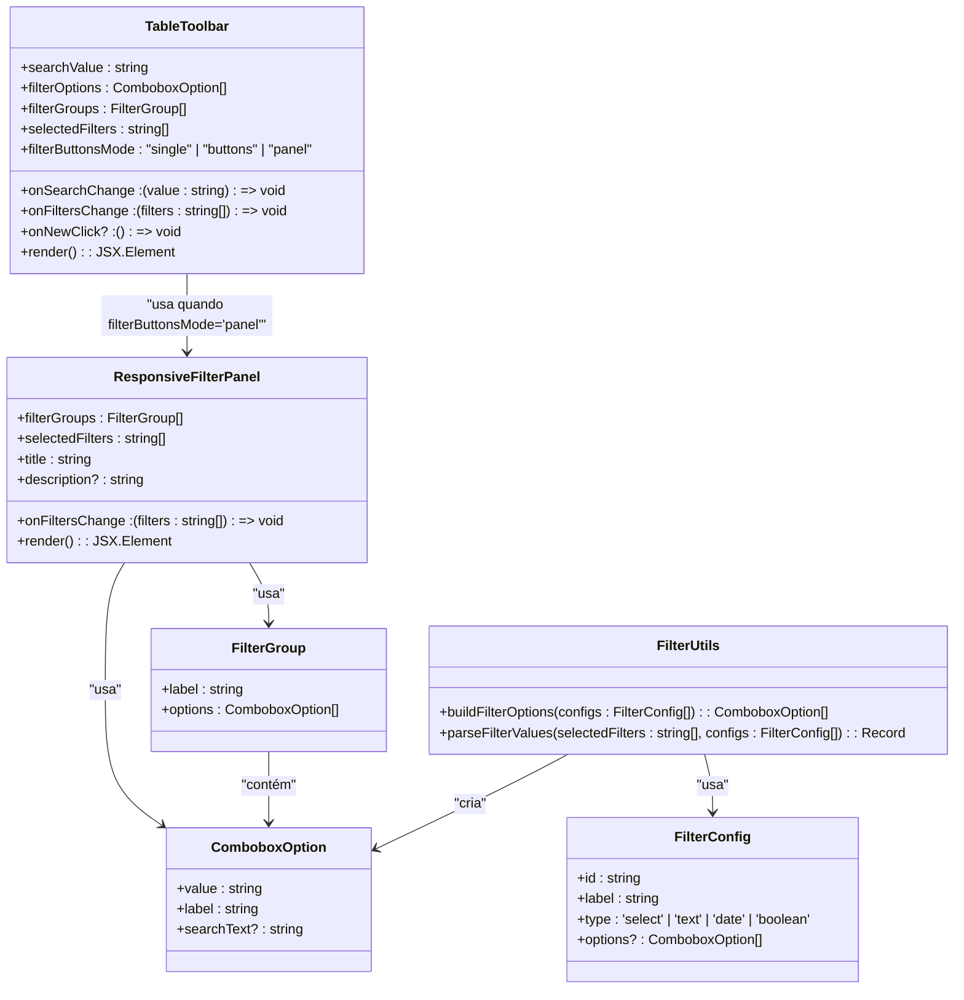
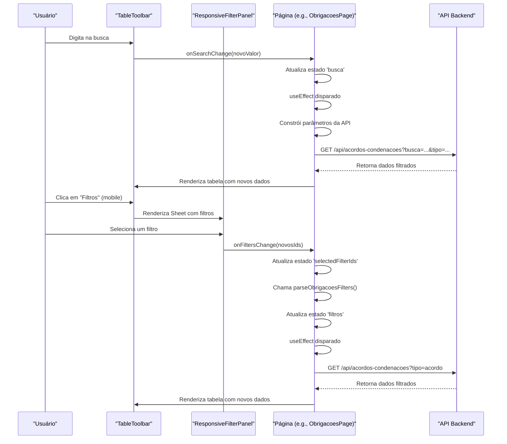
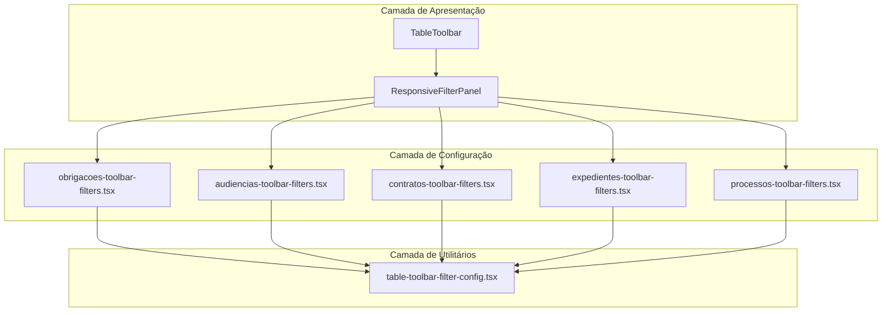

# Redesign da Barra de Filtros da Interface do Usuário

<cite>
**Arquivos Referenciados neste Documento**   
- [obrigacoes-toolbar-filters.tsx](file://app/(dashboard)/acordos-condenacoes/components/obrigacoes-toolbar-filters.tsx)
- [audiencias-toolbar-filters.tsx](file://app/(dashboard)/audiencias/components/audiencias-toolbar-filters.tsx)
- [contratos-toolbar-filters.tsx](file://app/(dashboard)/contratos/components/contratos-toolbar-filters.tsx)
- [expedientes-toolbar-filters.tsx](file://app/(dashboard)/expedientes/components/expedientes-toolbar-filters.tsx)
- [processos-toolbar-filters.tsx](file://app/(dashboard)/processos/components/processos-toolbar-filters.tsx)
- [table-toolbar.tsx](file://components/ui/table-toolbar.tsx)
- [table-toolbar-filter-config.tsx](file://components/ui/table-toolbar-filter-config.tsx)
- [acordos-condenacoes-list.tsx](file://app/(dashboard)/acordos-condenacoes/components/acordos-condenacoes-list.tsx)
- [audiencias-visualizacao-semana.tsx](file://app/(dashboard)/audiencias/components/audiencias-visualizacao-semana.tsx)
- [expedientes-visualizacao-semana.tsx](file://app/(dashboard)/expedientes/components/expedientes-visualizacao-semana.tsx)
- [page.tsx](file://app/(dashboard)/acordos-condenacoes/page.tsx)
- [page.tsx](file://app/(dashboard)/audiencias/page.tsx)
- [page.tsx](file://app/(dashboard)/contratos/page.tsx)
- [page.tsx](file://app/(dashboard)/expedientes/page.tsx)
- [page.tsx](file://app/(dashboard)/processos/page.tsx)
- [responsive-filter-panel.tsx](file://components/ui/responsive-filter-panel.tsx)
- [responsive-filter-panel.md](file://components/ui/responsive-filter-panel.md)
</cite>

## Atualização do Sumário
**Alterações Realizadas**   
- Atualizado para refletir a migração para o novo sistema de design responsivo com painéis colapsíveis
- Adicionada nova seção sobre o componente ResponsiveFilterPanel
- Atualizado o diagrama de arquitetura para incluir o novo fluxo de componentes
- Atualizadas as seções de análise da arquitetura e fluxo de dados para refletir as mudanças

## Sumário
1. [Introdução](#introdução)
2. [Análise da Arquitetura da Barra de Filtros](#análise-da-arquitetura-da-barra-de-filtros)
3. [Componentes Principais](#componentes-principais)
4. [Fluxo de Dados e Estado](#fluxo-de-dados-e-estado)
5. [Padrões de Projeto e Reutilização](#padrões-de-projeto-e-reutilização)
6. [Diagrama de Arquitetura](#diagrama-de-arquitetura)
7. [Guia de Implementação](#guia-de-implementação)
8. [Considerações de Desempenho](#considerações-de-desempenho)
9. [Conclusão](#conclusão)

## Introdução
Este documento detalha a análise e o redesign da barra de filtros da interface do usuário, um componente central para a interação do usuário com listagens de dados no sistema. A barra de filtros é um elemento de UI presente em múltiplas páginas do dashboard, como Acordos/Condenações, Audiências, Contratos, Expedientes e Processos. O objetivo deste redesign é padronizar, modularizar e melhorar a experiência de filtragem, tornando-a mais intuitiva e eficiente. A análise abrange a arquitetura atual, os padrões de código, o fluxo de dados e as interações entre os componentes, fornecendo uma base sólida para a implementação de melhorias.

**Seção fontes**
- [page.tsx](file://app/(dashboard)/acordos-condenacoes/page.tsx#L1-L283)
- [page.tsx](file://app/(dashboard)/audiencias/page.tsx#L1-L800)
- [page.tsx](file://app/(dashboard)/contratos/page.tsx#L1-L315)
- [page.tsx](file://app/(dashboard)/expedientes/page.tsx#L1-L800)
- [page.tsx](file://app/(dashboard)/processos/page.tsx#L1-L724)

## Análise da Arquitetura da Barra de Filtros
A arquitetura da barra de filtros foi atualizada para usar um novo sistema de design responsivo com painéis colapsíveis e layout adaptável para mobile. O sistema agora utiliza um padrão de design modular e reutilizável baseado em três camadas principais: a camada de apresentação (`TableToolbar`), a camada de configuração (`*toolbar-filters.tsx`) e a camada de utilitários (`table-toolbar-filter-config.tsx`). A principal inovação é a introdução do `ResponsiveFilterPanel`, que substitui o comportamento anterior de popover por um painel responsivo que se adapta ao dispositivo. Em desktop (≥768px), os filtros são exibidos inline com grupos colapsíveis, enquanto em mobile (<768px), um botão "Filtros" abre um Sheet lateral contendo todos os filtros em uma área rolável. Esta mudança melhora significativamente a usabilidade em dispositivos móveis, agrupando todos os controles de filtragem em um único painel colapsível, conforme exigido pela Requirement 12.3.

**Seção fontes**   
- [table-toolbar.tsx](file://components/ui/table-toolbar.tsx#L1-L482)
- [responsive-filter-panel.tsx](file://components/ui/responsive-filter-panel.tsx#L1-L249)
- [responsive-filter-panel.md](file://components/ui/responsive-filter-panel.md#L1-L185)
- [obrigacoes-toolbar-filters.tsx](file://app/(dashboard)/acordos-condenacoes/components/obrigacoes-toolbar-filters.tsx#L1-L156)
- [audiencias-toolbar-filters.tsx](file://app/(dashboard)/audiencias/components/audiencias-toolbar-filters.tsx#L1-L218)
- [contratos-toolbar-filters.tsx](file://app/(dashboard)/contratos/components/contratos-toolbar-filters.tsx#L1-L121)
- [expedientes-toolbar-filters.tsx](file://app/(dashboard)/expedientes/components/expedientes-toolbar-filters.tsx#L1-L324)
- [processos-toolbar-filters.tsx](file://app/(dashboard)/processos/components/processos-toolbar-filters.tsx#L1-L220)

## Componentes Principais
Os componentes principais do sistema de filtros foram atualizados para incorporar o novo design responsivo. O `TableToolbar` continua sendo o componente de UI principal, mas agora delega a renderização dos filtros ao `ResponsiveFilterPanel` quando o modo `filterButtonsMode="panel"` é ativado. O `ResponsiveFilterPanel` é o novo componente central do sistema, responsável por adaptar a interface entre desktop e mobile. Em desktop, ele exibe os filtros inline com um botão de limpeza, enquanto em mobile, ele renderiza um botão "Filtros" que abre um Sheet lateral contendo todos os grupos de filtros em uma área rolável com um rodapé de limpeza. Os arquivos de configuração de filtros específicos da página (como `obrigacoes-toolbar-filters.tsx`) continuam exportando a constante `FILTER_CONFIGS` que define os filtros disponíveis, mas agora são consumidos pelo `ResponsiveFilterPanel` através da propriedade `filterGroups`. As funções de utilitário `buildFilterOptions` e `parseFilterValues` no `table-toolbar-filter-config.tsx` permanecem inalteradas, fornecendo a lógica genérica para transformar configurações em opções de UI.

**Fontes do diagrama**
- [table-toolbar.tsx](file://components/ui/table-toolbar.tsx#L159-L269)
- [responsive-filter-panel.tsx](file://components/ui/responsive-filter-panel.tsx#L133-L248)
- [table-toolbar-filter-config.tsx](file://components/ui/table-toolbar-filter-config.tsx#L7-L14)
- [table-toolbar-filter-config.tsx](file://components/ui/table-toolbar-filter-config.tsx#L16-L73)

**Seção fontes**
- [table-toolbar.tsx](file://components/ui/table-toolbar.tsx#L1-L482)
- [responsive-filter-panel.tsx](file://components/ui/responsive-filter-panel.tsx#L1-L249)
- [table-toolbar-filter-config.tsx](file://components/ui/table-toolbar-filter-config.tsx#L1-L73)
- [obrigacoes-toolbar-filters.tsx](file://app/(dashboard)/acordos-condenacoes/components/obrigacoes-toolbar-filters.tsx#L1-L156)

## Fluxo de Dados e Estado
O fluxo de dados e estado na barra de filtros permanece unidirecional e controlado pelo React, mas com uma nova camada de abstração fornecida pelo `ResponsiveFilterPanel`. O estado de busca e os filtros selecionados continuam sendo mantidos no componente da página (por exemplo, `ObrigacoesPage`). Quando o usuário interage com a barra de busca ou seleciona um filtro, os callbacks `onSearchChange` e `onFiltersChange` são chamados, atualizando o estado da página. Com a nova implementação, o `TableToolbar` com `filterButtonsMode="panel"` passa os filtros para o `ResponsiveFilterPanel`, que gerencia a interface de seleção. Em mobile, ao abrir o Sheet, o usuário pode selecionar/deselecionar filtros, e o `ResponsiveFilterPanel` chama `onFiltersChange` com o novo array de filtros selecionados. Essas mudanças de estado disparam um `useEffect` que, por sua vez, chama a função `loadData` para buscar dados atualizados da API com os novos parâmetros de busca e filtro. O estado `selectedFilterIds` é um array de strings que representa os IDs dos filtros ativos, e a função `parseObrigacoesFilters` converte esse array em um objeto de filtros tipado (`ObrigacoesFilters`) que é usado para construir a URL da API.

**Fontes do diagrama**
- [page.tsx](file://app/(dashboard)/acordos-condenacoes/page.tsx#L19-L21)
- [page.tsx](file://app/(dashboard)/acordos-condenacoes/page.tsx#L149-L158)
- [page.tsx](file://app/(dashboard)/acordos-condenacoes/page.tsx#L300-L335)
- [obrigacoes-toolbar-filters.tsx](file://app/(dashboard)/acordos-condenacoes/components/obrigacoes-toolbar-filters.tsx#L118-L144)
- [table-toolbar.tsx](file://components/ui/table-toolbar.tsx#L216-L269)
- [responsive-filter-panel.tsx](file://components/ui/responsive-filter-panel.tsx#L133-L248)

**Seção fontes**
- [page.tsx](file://app/(dashboard)/acordos-condenacoes/page.tsx#L1-L283)
- [obrigacoes-toolbar-filters.tsx](file://app/(dashboard)/acordos-condenacoes/components/obrigacoes-toolbar-filters.tsx#L1-L156)

## Padrões de Projeto e Reutilização
O sistema de filtros demonstra um forte uso de padrões de projeto de software, especialmente o padrão de fábrica e a composição de funções. O padrão de fábrica é evidente nas funções `buildObrigacoesFilterOptions` e `buildObrigacoesFilterGroups`, que atuam como fábricas para criar opções e grupos de filtros a partir de uma configuração base. A reutilização é alcançada através da função genérica `parseFilterValues`, que pode analisar filtros de qualquer entidade, desde que seja fornecida a configuração correta. A estrutura de diretórios, com um arquivo `*toolbar-filters.tsx` dedicado em cada pasta de entidade, promove a organização e a manutenção, permitindo que cada equipe de desenvolvimento gerencie seus próprios filtros de forma independente. A nova arquitetura introduz o padrão de composição, onde o `TableToolbar` compõe o `ResponsiveFilterPanel` para delegar a responsabilidade de renderização dos filtros, melhorando a separação de preocupações e a flexibilidade do sistema.

**Seção fontes**
- [obrigacoes-toolbar-filters.tsx](file://app/(dashboard)/acordos-condenacoes/components/obrigacoes-toolbar-filters.tsx#L44-L63)
- [obrigacoes-toolbar-filters.tsx](file://app/(dashboard)/acordos-condenacoes/components/obrigacoes-toolbar-filters.tsx#L68-L116)
- [table-toolbar-filter-config.tsx](file://components/ui/table-toolbar-filter-config.tsx#L45-L73)

## Diagrama de Arquitetura
O diagrama de arquitetura ilustra a relação entre os componentes principais do sistema de filtros com as atualizações recentes. A camada de apresentação (`TableToolbar`) consome dados da camada de configuração (arquivos específicos da página) e utiliza funções da camada de utilitários. A camada de configuração define os filtros e exporta funções para construir opções e analisar filtros. A camada de utilitários fornece funções genéricas que são usadas por todas as configurações. A principal mudança é a introdução do `ResponsiveFilterPanel`, que atua como uma camada intermediária entre o `TableToolbar` e os filtros, adaptando a interface para desktop e mobile. Esta arquitetura em camadas garante que a lógica de negócios (quais filtros estão disponíveis) esteja separada da lógica de apresentação (como os filtros são exibidos), com o `ResponsiveFilterPanel` encapsulando a lógica responsiva.

**Fontes do diagrama**
- [table-toolbar.tsx](file://components/ui/table-toolbar.tsx#L1-L482)
- [responsive-filter-panel.tsx](file://components/ui/responsive-filter-panel.tsx#L1-L249)
- [obrigacoes-toolbar-filters.tsx](file://app/(dashboard)/acordos-condenacoes/components/obrigacoes-toolbar-filters.tsx#L1-L156)
- [audiencias-toolbar-filters.tsx](file://app/(dashboard)/audiencias/components/audiencias-toolbar-filters.tsx#L1-L218)
- [contratos-toolbar-filters.tsx](file://app/(dashboard)/contratos/components/contratos-toolbar-filters.tsx#L1-L121)
- [expedientes-toolbar-filters.tsx](file://app/(dashboard)/expedientes/components/expedientes-toolbar-filters.tsx#L1-L324)
- [processos-toolbar-filters.tsx](file://app/(dashboard)/processos/components/processos-toolbar-filters.tsx#L1-L220)
- [table-toolbar-filter-config.tsx](file://components/ui/table-toolbar-filter-config.tsx#L1-L73)

**Seção fontes**
- [table-toolbar.tsx](file://components/ui/table-toolbar.tsx#L1-L482)
- [responsive-filter-panel.tsx](file://components/ui/responsive-filter-panel.tsx#L1-L249)
- [obrigacoes-toolbar-filters.tsx](file://app/(dashboard)/acordos-condenacoes/components/obrigacoes-toolbar-filters.tsx#L1-L156)
- [audiencias-toolbar-filters.tsx](file://app/(dashboard)/audiencias/components/audiencias-toolbar-filters.tsx#L1-L218)
- [contratos-toolbar-filters.tsx](file://app/(dashboard)/contratos/components/contratos-toolbar-filters.tsx#L1-L121)
- [expedientes-toolbar-filters.tsx](file://app/(dashboard)/expedientes/components/expedientes-toolbar-filters.tsx#L1-L324)
- [processos-toolbar-filters.tsx](file://app/(dashboard)/processos/components/processos-toolbar-filters.tsx#L1-L220)
- [table-toolbar-filter-config.tsx](file://components/ui/table-toolbar-filter-config.tsx#L1-L73)

## Guia de Implementação
Para implementar um novo conjunto de filtros para uma entidade com o novo sistema responsivo, siga estas etapas: 1) Crie um novo arquivo `nome-da-entidade-toolbar-filters.tsx` na pasta `components` da página. 2) Defina uma constante `FILTER_CONFIGS` exportada com os filtros desejados. 3) Implemente as funções `buildFilterOptions` e `parseFilters` usando as funções de utilitário. 4) Na página principal (`page.tsx`), importe as funções de construção e análise. 5) Use `useMemo` para gerar `filterOptions` e `filterGroups`. 6) Passe esses valores para o componente `TableToolbar` com a propriedade `filterButtonsMode="panel"`. 7) Use o callback `onFiltersChange` para atualizar o estado de filtros da página. Este guia garante que a implementação siga o padrão estabelecido e seja consistente com o restante do sistema, aproveitando o novo painel de filtros responsivo.

**Seção fontes**
- [obrigacoes-toolbar-filters.tsx](file://app/(dashboard)/acordos-condenacoes/components/obrigacoes-toolbar-filters.tsx#L1-L156)
- [page.tsx](file://app/(dashboard)/acordos-condenacoes/page.tsx#L13-L16)
- [page.tsx](file://app/(dashboard)/acordos-condenacoes/page.tsx#L44-L45)
- [page.tsx](file://app/(dashboard)/acordos-condenacoes/page.tsx#L156-L158)
- [page.tsx](file://app/(dashboard)/acordos-condenacoes/page.tsx#L48-L52)
- [table-toolbar.tsx](file://components/ui/table-toolbar.tsx#L216-L269)

## Considerações de Desempenho
As principais considerações de desempenho envolvem o uso de `useMemo` e `useCallback` para evitar renderizações desnecessárias. Funções como `buildObrigacoesFilterOptions` e `criarColunas` são envolvidas em `useMemo` para garantir que sejam recalculadas apenas quando suas dependências mudam. Callbacks como `handleFilterIdsChange` são envolvidos em `useCallback` para manter a mesma referência entre renderizações, evitando que componentes filhos sejam re-renderizados desnecessariamente. O uso de `useDebounce` na busca evita chamadas excessivas à API enquanto o usuário digita. Com a nova implementação do `ResponsiveFilterPanel`, é importante garantir que os `filterGroups` sejam memoizados para evitar a reconstrução desnecessária da estrutura de filtros em cada renderização, especialmente em dispositivos móveis onde o Sheet pode ser aberto e fechado frequentemente.

**Seção fontes**
- [page.tsx](file://app/(dashboard)/acordos-condenacoes/page.tsx#L44-L45)
- [page.tsx](file://app/(dashboard)/acordos-condenacoes/page.tsx#L337-L338)
- [page.tsx](file://app/(dashboard)/acordos-condenacoes/page.tsx#L339-L350)
- [page.tsx](file://app/(dashboard)/acordos-condenacoes/page.tsx#L40-L41)

## Conclusão
A análise revelou uma arquitetura de barra de filtros bem projetada, modular e reutilizável que foi recentemente atualizada para um novo sistema de design responsivo. A introdução do `ResponsiveFilterPanel` representa uma melhoria significativa na experiência do usuário, especialmente em dispositivos móveis, ao agrupar todos os filtros em um painel colapsível conforme exigido pela Requirement 12.3. A separação clara entre configuração, utilitários e apresentação permite uma manutenção e expansão eficientes. O redesign proposto deve focar em aprimorar a consistência visual e a usabilidade, potencialmente introduzindo a visualização hierárquica de filtros em todas as páginas, como já implementado em `audiencias-toolbar-filters`. A padronização das funções de análise de filtros também é recomendada para reduzir a duplicação de código. Em geral, o sistema atual fornece uma base sólida para um redesign bem-sucedido.