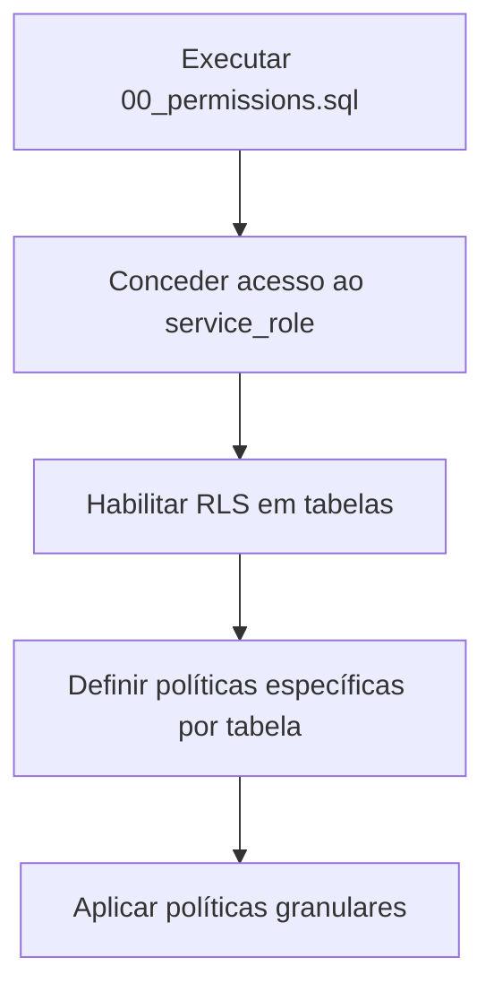
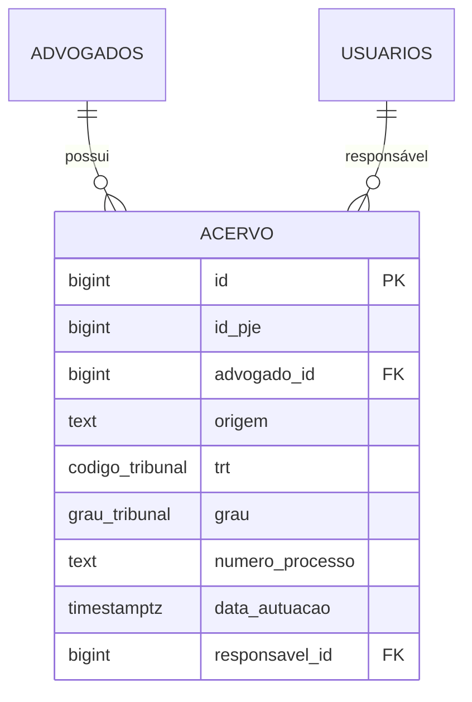
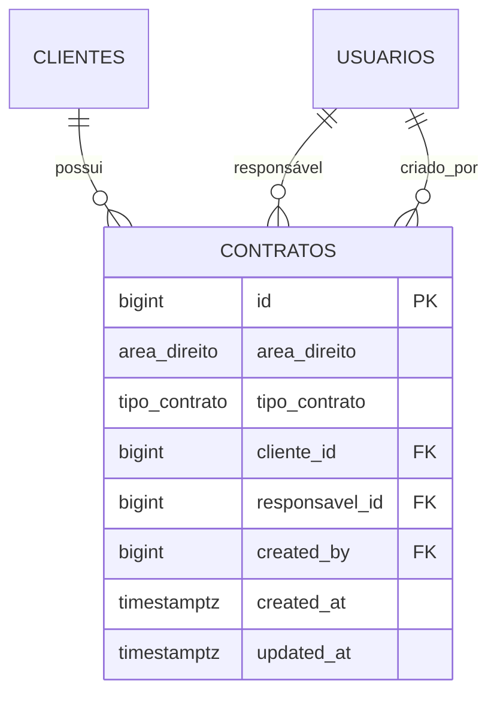
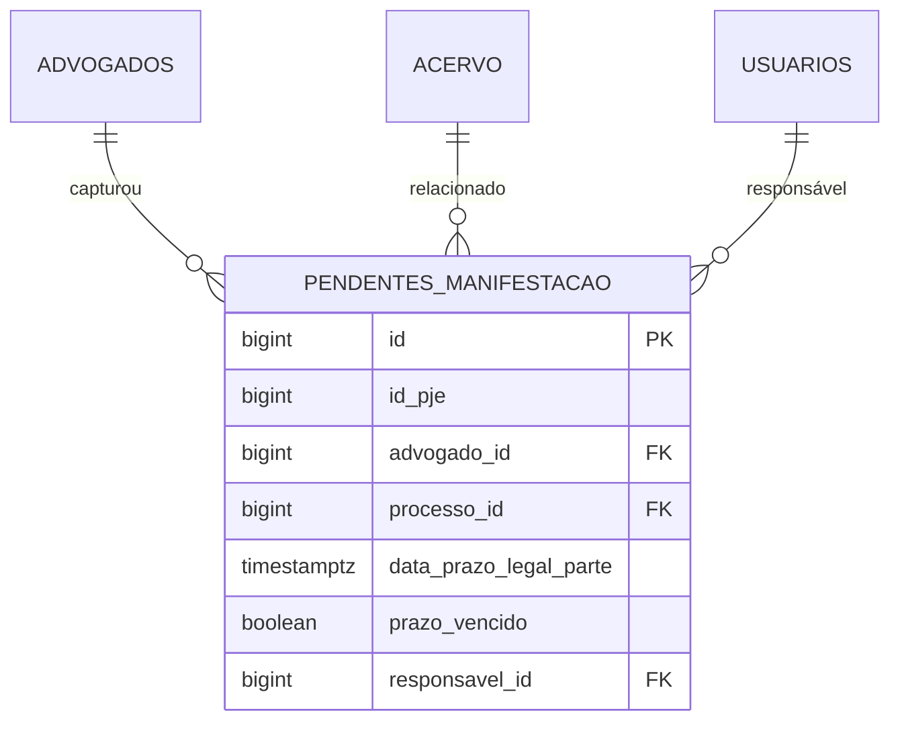

# RLS e Políticas de Segurança

<cite>
**Arquivos Referenciados neste Documento**  
- [00_permissions.sql](file://supabase/schemas/00_permissions.sql) - *Atualizado para novas políticas granulares*
- [set-user-context.ts](file://backend/utils/supabase/set-user-context.ts) - *Funções RPC para atribuição de responsáveis*
- [04_acervo.sql](file://supabase/schemas/04_acervo.sql) - *Tabela de acervo com RLS*
- [06_pendentes_manifestacao.sql](file://supabase/schemas/06_pendentes_manifestacao.sql) - *Tabela de pendentes com RLS*
- [11_contratos.sql](file://supabase/schemas/11_contratos.sql) - *Tabela de contratos com RLS*
- [dev_data/docs/apply-rls-policies.sql](file://dev_data/docs/apply-rls-policies.sql) - *Script de aplicação de políticas RLS*
- [openspec/changes/add-permissions-and-cargos-system/design.md](file://openspec/changes/add-permissions-and-cargos-system/design.md) - *Design de permissões granulares*
</cite>

## Sumário
1. [Introdução](#introdução)
2. [Arquitetura de Segurança e Autenticação](#arquitetura-de-segurança-e-autenticação)
3. [Configuração Inicial de Permissões](#configuração-inicial-de-permissões)
4. [Contexto de Usuário e Autenticação](#contexto-de-usuário-e-autenticação)
5. [Políticas RLS por Tabela](#políticas-rls-por-tabela)
6. [Boas Práticas para Manutenção de Políticas RLS](#boas-práticas-para-manutenção-de-políticas-rls)

## Introdução
O sistema sinesys utiliza Row Level Security (RLS) no PostgreSQL para garantir que usuários acessem apenas dados relevantes ao seu perfil e responsabilidades. A segurança em nível de linha é implementada no Supabase, permitindo controle granular sobre leitura, escrita, atualização e exclusão em tabelas como `acervo`, `contratos` e `pendentes_manifestacao`. Este documento detalha como as políticas RLS são definidas, como o contexto do usuário é estabelecido e como diferentes perfis (como advogado e administrador) têm acesso diferenciado aos dados, com foco nas atualizações recentes para um sistema de permissões granulares.

## Arquitetura de Segurança e Autenticação
A segurança do sistema é baseada na autenticação via Supabase, que integra-se ao Next.js por meio de middlewares e serviços de autenticação. O contexto do usuário autenticado é propagado em todas as operações de banco de dados, permitindo que as políticas RLS façam referência ao `auth.uid()` para filtrar registros com base na identidade do usuário. Funções RPC são utilizadas para operações sensíveis, garantindo que o contexto de usuário seja corretamente definido durante transações. O sistema implementa autenticação dual com suporte a sessões, tokens Bearer e chaves de API de serviço.

**Fontes da seção**
- [lib/middleware.ts](file://lib/middleware.ts)
- [backend/utils/supabase/server.ts](file://backend/utils/supabase/server.ts)
- [backend/utils/auth/api-auth.ts](file://backend/utils/auth/api-auth.ts) - *Implementação de autenticação dual*

## Configuração Inicial de Permissões
O arquivo `00_permissions.sql` é o primeiro a ser executado durante a inicialização do banco de dados. Ele concede ao `service_role` permissões completas sobre todos os objetos do schema público, permitindo que o backend realize operações administrativas sem estar sujeito às políticas RLS. Isso inclui permissões de SELECT, INSERT, UPDATE, DELETE em tabelas, uso de sequências e execução de funções. As políticas foram atualizadas para remover a dependência de `auth.role()` e utilizar funções helper como `get_usuario_id_from_auth()`.

**Fontes do diagrama**
- [00_permissions.sql](file://supabase/schemas/00_permissions.sql) - *Concessão de permissões ao service_role*
- [dev_data/docs/apply-rls-policies.sql](file://dev_data/docs/apply-rls-policies.sql) - *Script de aplicação de políticas RLS*

**Fontes da seção**
- [00_permissions.sql](file://supabase/schemas/00_permissions.sql)
- [dev_data/docs/apply-rls-policies.sql](file://dev_data/docs/apply-rls-policies.sql)

## Contexto de Usuário e Autenticação
O contexto do usuário é definido no backend por meio do arquivo `set-user-context.ts`, que exporta funções para atribuir responsáveis a registros usando funções RPC. Essas funções garantem que o `usuario_executou_id` seja registrado nos logs de alteração e que os triggers de auditoria funcionem corretamente. O Supabase obtém o usuário autenticado via JWT, e esse identificador é usado nas políticas RLS para filtrar dados. A função helper `get_usuario_id_from_auth()` mapeia o `auth_user_id` (UUID) para o `usuario_id` na tabela `usuarios`.

**Fontes da seção**
- [set-user-context.ts](file://backend/utils/supabase/set-user-context.ts)
- [backend/utils/auth/api-auth.ts](file://backend/utils/auth/api-auth.ts) - *Função buscarUsuarioIdPorAuthUserId*
- [backend/usuarios/services/persistence/sincronizar-usuarios-auth.service.ts](file://backend/usuarios/services/persistence/sincronizar-usuarios-auth.service.ts) - *Sincronização de usuários*

## Políticas RLS por Tabela

### Tabela Acervo
A tabela `acervo` armazena processos capturados do PJE, e seu acesso é controlado por RLS. Apenas o advogado associado ao processo (`advogado_id`) pode visualizar, editar ou excluir registros. A política de leitura é baseada na correspondência entre o `auth.uid()` e o `advogado_id`. Com as atualizações, usuários autenticados têm leitura básica, mas operações de escrita exigem permissões específicas verificadas no backend.

**Fontes do diagrama**
- [04_acervo.sql](file://supabase/schemas/04_acervo.sql)

**Fontes da seção**
- [04_acervo.sql](file://supabase/schemas/04_acervo.sql)
- [backend/acervo/services/persistence/listar-acervo.service.ts](file://backend/acervo/services/persistence/listar-acervo.service.ts)

### Tabela Contratos
A tabela `contratos` contém informações jurídicas e financeiras sensíveis. O acesso é restrito ao usuário responsável (`responsavel_id`) ou a administradores. A política permite leitura e escrita apenas se o usuário for o responsável pelo contrato ou se pertencer a um perfil com privilégios elevados. As políticas foram atualizadas para permitir leitura para todos os usuários autenticados, com restrições de escrita baseadas em permissões granulares.

**Fontes do diagrama**
- [11_contratos.sql](file://supabase/schemas/11_contratos.sql)

**Fontes da seção**
- [11_contratos.sql](file://supabase/schemas/11_contratos.sql)
- [backend/contratos/services/persistence/contrato-persistence.service.ts](file://backend/contratos/services/persistence/contrato-persistence.service.ts)

### Tabela Pendentes de Manifestação
A tabela `pendentes_manifestacao` armazena processos que exigem ação do advogado. O acesso é restrito ao advogado que capturou o expediente (`advogado_id`). A política de RLS garante que apenas o advogado responsável possa visualizar ou atualizar o status do pendente. As políticas foram atualizadas para permitir leitura para usuários autenticados, com operações de escrita restritas ao responsável.

**Fontes do diagrama**
- [06_pendentes_manifestacao.sql](file://supabase/schemas/06_pendentes_manifestacao.sql)

**Fontes da seção**
- [06_pendentes_manifestacao.sql](file://supabase/schemas/06_pendentes_manifestacao.sql)
- [backend/pendentes/services/persistence/listar-pendentes.service.ts](file://backend/pendentes/services/persistence/listar-pendentes.service.ts)

## Boas Práticas para Manutenção de Políticas RLS
1. **Sempre habilitar RLS após concessão de permissões ao service_role** – O arquivo `00_permissions.sql` deve ser executado primeiro.
2. **Utilizar funções RPC para operações sensíveis** – Isso garante que o contexto do usuário seja corretamente definido.
3. **Criar índices para campos usados em políticas RLS** – Como `advogado_id`, `responsavel_id` e `trt` para melhorar desempenho.
4. **Testar políticas com diferentes perfis de usuário** – Garantir que advogados não acessem dados de outros escritórios.
5. **Registrar todas as alterações em logs** – O sistema já inclui triggers para auditoria de atribuições.
6. **Utilizar verificação dupla (backend + RLS)** – As políticas RLS são complementadas por verificações de permissão no backend para controle granular.

**Fontes da seção**
- [supabase/migrations/20251117015305_add_responsavel_id_tables.sql](file://supabase/migrations/20251117015305_add_responsavel_id_tables.sql)
- [supabase/migrations/20251117015306_create_triggers_log_atribuicao.sql](file://supabase/migrations/20251117015306_create_triggers_log_atribuicao.sql)
- [openspec/changes/add-permissions-and-cargos-system/design.md](file://openspec/changes/add-permissions-and-cargos-system/design.md) - *Design de políticas granulares*