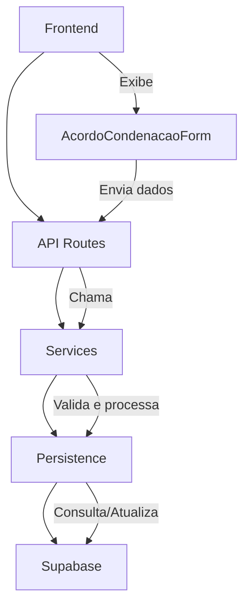
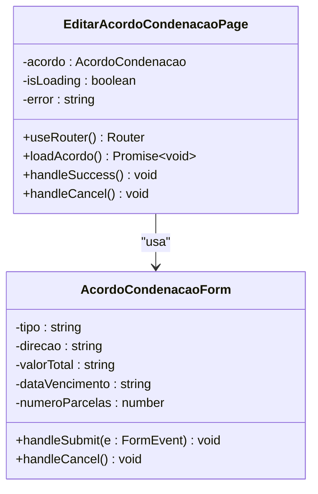
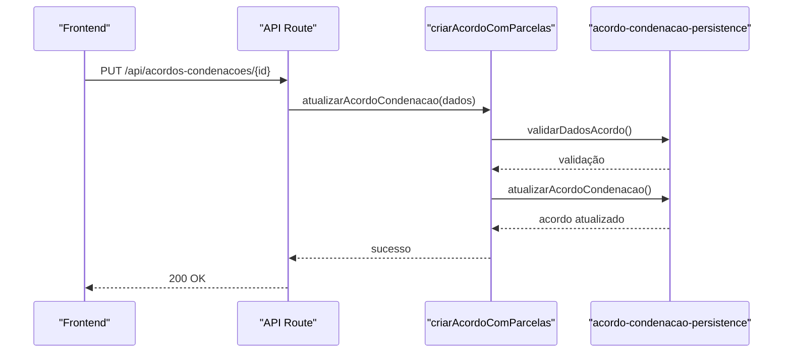
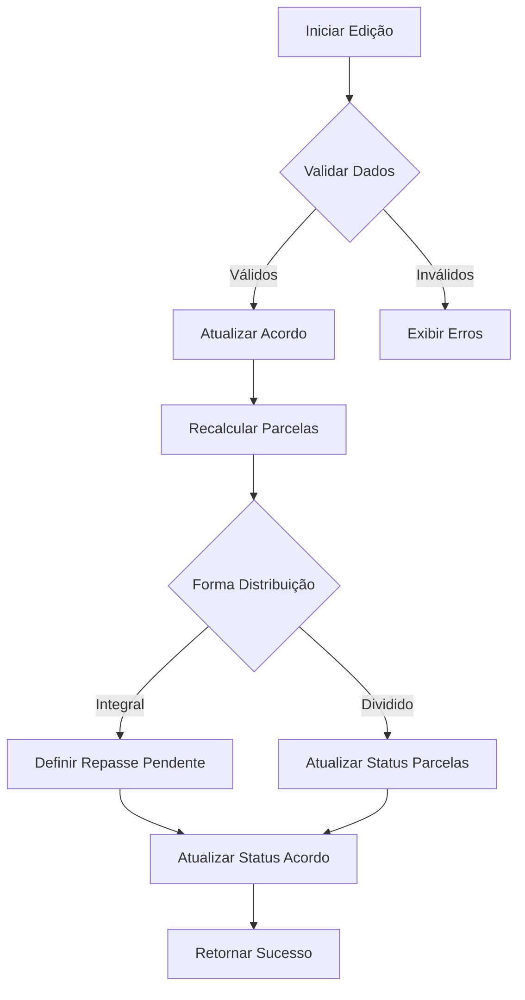
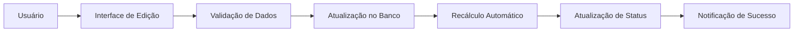
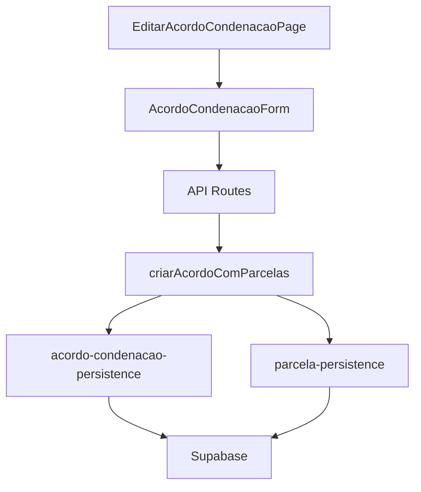

# Acordos Condenacoes Edicao

<cite>
**Arquivos Referenciados neste Documento**   
- [app/(dashboard)/acordos-condenacoes/[id]/editar/page.tsx](file://app/(dashboard)/acordos-condenacoes/[id]/editar/page.tsx)
- [app/(dashboard)/acordos-condenacoes/[id]/page.tsx](file://app/(dashboard)/acordos-condenacoes/[id]/page.tsx)
- [app/(dashboard)/acordos-condenacoes/novo/page.tsx](file://app/(dashboard)/acordos-condenacoes/novo/page.tsx)
- [app/(dashboard)/acordos-condenacoes/page.tsx](file://app/(dashboard)/acordos-condenacoes/page.tsx)
- [components/acordos-condenacoes/acordo-condenacao-form.tsx](file://components/acordos-condenacoes/acordo-condenacao-form.tsx)
- [components/acordos-condenacoes/parcelas-table.tsx](file://components/acordos-condenacoes/parcelas-table.tsx)
- [components/acordos-condenacoes/edit-parcela-dialog.tsx](file://components/acordos-condenacoes/edit-parcela-dialog.tsx)
- [backend/acordos-condenacoes/services/acordos-condenacoes/criar-acordo-condenacao.service.ts](file://backend/acordos-condenacoes/services/acordos-condenacoes/criar-acordo-condenacao.service.ts)
- [backend/acordos-condenacoes/services/persistence/acordo-condenacao-persistence.service.ts](file://backend/acordos-condenacoes/services/persistence/acordo-condenacao-persistence.service.ts)
- [backend/acordos-condenacoes/services/persistence/parcela-persistence.service.ts](file://backend/acordos-condenacoes/services/persistence/parcela-persistence.service.ts)
- [backend/acordos-condenacoes/services/parcelas/marcar-como-recebida.service.ts](file://backend/acordos-condenacoes/services/parcelas/marcar-como-recebida.service.ts)
- [backend/acordos-condenacoes/services/parcelas/recalcular-distribuicao.service.ts](file://backend/acordos-condenacoes/services/parcelas/recalcular-distribuicao.service.ts)
</cite>

## Sumário
1. [Introdução](#introdução)
2. [Estrutura do Projeto](#estrutura-do-projeto)
3. [Componentes Principais](#componentes-principais)
4. [Visão Geral da Arquitetura](#visão-geral-da-arquitetura)
5. [Análise Detalhada dos Componentes](#análise-detalhada-dos-componentes)
6. [Análise de Dependências](#análise-de-dependências)
7. [Considerações de Desempenho](#considerações-de-desempenho)
8. [Guia de Solução de Problemas](#guia-de-solução-de-problemas)
9. [Conclusão](#conclusão)

## Introdução
Este documento fornece uma análise detalhada do módulo de edição de acordos e condenações no sistema Sinesys, utilizado pelo escritório Zattar Advogados. O sistema permite o gerenciamento completo de acordos, condenações e custas processuais, com foco em controle de parcelas, distribuição de valores e repasses. A documentação abrange desde a estrutura de diretórios até os serviços de backend que implementam a lógica de negócio, com ênfase no fluxo de edição de acordos existentes.

## Estrutura do Projeto
O módulo de acordos e condenações está organizado dentro da estrutura de diretórios do Next.js, com separação clara entre componentes frontend, páginas de rota e serviços de backend. A estrutura reflete um padrão de organização por recursos (feature-based), facilitando a manutenção e escalabilidade do código.

```mermaid
graph TB
subgraph "Frontend"
A[app/(dashboard)/acordos-condenacoes]
A --> B[[page.tsx]]
A --> C[[novo/page.tsx]]
A --> D[[[id]/page.tsx]]
A --> E[[[id]/editar/page.tsx]]
end
subgraph "Componentes"
F[components/acordos-condenacoes]
F --> G[acordo-condenacao-form.tsx]
F --> H[parcelas-table.tsx]
F --> I[edit-parcela-dialog.tsx]
end
subgraph "Backend"
J[backend/acordos-condenacoes/services]
J --> K[acordos-condenacoes]
J --> L[persistence]
J --> M[parcelas]
end
A --> F
D --> G
K --> L
M --> L
```

**Fontes do Diagrama**
- [app/(dashboard)/acordos-condenacoes](file://app/(dashboard)/acordos-condenacoes)
- [components/acordos-condenacoes](file://components/acordos-condenacoes)
- [backend/acordos-condenacoes/services](file://backend/acordos-condenacoes/services)

**Fontes da Seção**
- [app/(dashboard)/acordos-condenacoes](file://app/(dashboard)/acordos-condenacoes)

## Componentes Principais
Os componentes principais do módulo de acordos e condenações são responsáveis pela interface de usuário e pela lógica de interação com o backend. O componente principal é o formulário de acordo/condenação, que é reutilizado tanto para criação quanto para edição, recebendo dados iniciais quando em modo de edição.

**Fontes da Seção**
- [components/acordos-condenacoes/acordo-condenacao-form.tsx](file://components/acordos-condenacoes/acordo-condenacao-form.tsx)
- [components/acordos-condenacoes/parcelas-table.tsx](file://components/acordos-condenacoes/parcelas-table.tsx)
- [components/acordos-condenacoes/edit-parcela-dialog.tsx](file://components/acordos-condenacoes/edit-parcela-dialog.tsx)

## Visão Geral da Arquitetura
A arquitetura do módulo segue um padrão de camadas bem definido, com separação entre apresentação, lógica de negócio e persistência. O frontend utiliza React com Next.js, enquanto o backend implementa serviços em TypeScript que se comunicam com um banco de dados Supabase.



**Fontes do Diagrama**
- [app/(dashboard)/acordos-condenacoes/[id]/editar/page.tsx](file://app/(dashboard)/acordos-condenacoes/[id]/editar/page.tsx)
- [backend/acordos-condenacoes/services/acordos-condenacoes/criar-acordo-condenacao.service.ts](file://backend/acordos-condenacoes/services/acordos-condenacoes/criar-acordo-condenacao.service.ts)
- [backend/acordos-condenacoes/services/persistence/acordo-condenacao-persistence.service.ts](file://backend/acordos-condenacoes/services/persistence/acordo-condenacao-persistence.service.ts)

## Análise Detalhada dos Componentes

### Análise do Componente de Edição
O componente de edição de acordos/condenações permite a atualização de informações existentes, mantendo a integridade dos dados e a consistência com as regras de negócio definidas.

#### Para Componentes Baseados em Objetos:


**Fontes do Diagrama**
- [app/(dashboard)/acordos-condenacoes/[id]/editar/page.tsx](file://app/(dashboard)/acordos-condenacoes/[id]/editar/page.tsx)
- [components/acordos-condenacoes/acordo-condenacao-form.tsx](file://components/acordos-condenacoes/acordo-condenacao-form.tsx)

#### Para Componentes de API/Serviço:


**Fontes do Diagrama**
- [backend/acordos-condenacoes/services/acordos-condenacoes/criar-acordo-condenacao.service.ts](file://backend/acordos-condenacoes/services/acordos-condenacoes/criar-acordo-condenacao.service.ts)
- [backend/acordos-condenacoes/services/persistence/acordo-condenacao-persistence.service.ts](file://backend/acordos-condenacoes/services/persistence/acordo-condenacao-persistence.service.ts)

#### Para Componentes de Lógica Complexa:


**Fontes do Diagrama**
- [backend/acordos-condenacoes/services/acordos-condenacoes/criar-acordo-condenacao.service.ts](file://backend/acordos-condenacoes/services/acordos-condenacoes/criar-acordo-condenacao.service.ts)
- [backend/acordos-condenacoes/services/parcelas/recalcular-distribuicao.service.ts](file://backend/acordos-condenacoes/services/parcelas/recalcular-distribuicao.service.ts)

**Fontes da Seção**
- [app/(dashboard)/acordos-condenacoes/[id]/editar/page.tsx](file://app/(dashboard)/acordos-condenacoes/[id]/editar/page.tsx)
- [backend/acordos-condenacoes/services/acordos-condenacoes/criar-acordo-condenacao.service.ts](file://backend/acordos-condenacoes/services/acordos-condenacoes/criar-acordo-condenacao.service.ts)

### Visão Conceitual
A funcionalidade de edição de acordos/condenações é parte integrante do sistema de gestão financeira do escritório, permitindo ajustes precisos em acordos já estabelecidos. O sistema garante que todas as alterações mantenham a consistência dos dados financeiros e respeitem as regras de negócio definidas.



## Análise de Dependências
O módulo de acordos e condenações possui dependências bem definidas entre seus componentes, garantindo baixo acoplamento e alta coesão. As dependências principais são entre os componentes de interface, os serviços de backend e o sistema de persistência.



**Fontes do Diagrama**
- [app/(dashboard)/acordos-condenacoes/[id]/editar/page.tsx](file://app/(dashboard)/acordos-condenacoes/[id]/editar/page.tsx)
- [backend/acordos-condenacoes/services/acordos-condenacoes/criar-acordo-condenacao.service.ts](file://backend/acordos-condenacoes/services/acordos-condenacoes/criar-acordo-condenacao.service.ts)
- [backend/acordos-condenacoes/services/persistence/acordo-condenacao-persistence.service.ts](file://backend/acordos-condenacoes/services/persistence/acordo-condenacao-persistence.service.ts)
- [backend/acordos-condenacoes/services/persistence/parcela-persistence.service.ts](file://backend/acordos-condenacoes/services/persistence/parcela-persistence.service.ts)

**Fontes da Seção**
- [backend/acordos-condenacoes/services/acordos-condenacoes/criar-acordo-condenacao.service.ts](file://backend/acordos-condenacoes/services/acordos-condenacoes/criar-acordo-condenacao.service.ts)
- [backend/acordos-condenacoes/services/persistence/acordo-condenacao-persistence.service.ts](file://backend/acordos-condenacoes/services/persistence/acordo-condenacao-persistence.service.ts)

## Considerações de Desempenho
O sistema implementa várias otimizações para garantir bom desempenho, especialmente na manipulação de grandes volumes de dados financeiros. O uso de paginação na listagem de acordos e o carregamento sob demanda de dados específicos minimizam o tráfego de rede e o consumo de memória.

## Guia de Solução de Problemas
O sistema inclui mecanismos robustos de tratamento de erros, com mensagens claras para o usuário e logs detalhados no backend. Problemas comuns incluem validações de dados, conflitos de concorrência e erros de conexão com o banco de dados.

**Fontes da Seção**
- [app/(dashboard)/acordos-condenacoes/[id]/editar/page.tsx](file://app/(dashboard)/acordos-condenacoes/[id]/editar/page.tsx)
- [backend/acordos-condenacoes/services/acordos-condenacoes/criar-acordo-condenacao.service.ts](file://backend/acordos-condenacoes/services/acordos-condenacoes/criar-acordo-condenacao.service.ts)

## Conclusão
O módulo de edição de acordos e condenações no sistema Sinesys é uma implementação robusta e bem estruturada que atende às necessidades complexas de gestão financeira de um escritório de advocacia. A arquitetura em camadas, a separação clara de responsabilidades e a implementação cuidadosa das regras de negócio garantem a integridade dos dados e a usabilidade do sistema. A documentação detalhada dos componentes e fluxos permite fácil manutenção e futuras extensões.