# Acordos Condenacoes Edicao

<cite>
**Arquivos Referenciados neste Documento**   
- [supabase/schemas/20_acordos_condenacoes.sql](file://supabase/schemas/20_acordos_condenacoes.sql)
- [openspec/changes/archive/2025-11-22-add-acordos-condenacoes-pagamentos/specs/acordos-condenacoes/spec.md](file://openspec/changes/archive/2025-11-22-add-acordos-condenacoes-pagamentos/specs/acordos-condenacoes/spec.md)
</cite>

## Sumário
1. [Introdução](#introdução)
2. [Status da Funcionalidade](#status-da-funcionalidade)
3. [Histórico do Módulo](#histórico-do-módulo)
4. [Estrutura de Dados Original](#estrutura-de-dados-original)
5. [Especificações Técnicas](#especificações-técnicas)

## Introdução
Este documento fornece informações sobre o módulo de acordos e condenações no sistema Sinesys, que foi removido do sistema. O módulo anteriormente permitia o gerenciamento completo de acordos, condenações e custas processuais, com foco em controle de parcelas, distribuição de valores e repasses. Esta documentação agora serve como registro histórico da funcionalidade que não está mais disponível no sistema.

## Status da Funcionalidade
A funcionalidade de acordos e condenações **foi removida do sistema** e não está mais disponível para uso. Todos os arquivos de frontend e backend relacionados a este módulo foram excluídos do código base. Qualquer referência a esta funcionalidade em documentos ou processos deve ser atualizada para refletir que esta funcionalidade não existe mais no sistema.

## Histórico do Módulo
O módulo de acordos e condenações foi implementado como parte da funcionalidade de gestão financeira do sistema, conforme documentado no arquivo de especificações `add-acordos-condenacoes-pagamentos`. A funcionalidade foi projetada para permitir o gerenciamento completo de acordos, condenações e custas processuais vinculados a processos jurídicos.

**Fontes da Seção**
- [openspec/changes/archive/2025-11-22-add-acordos-condenacoes-pagamentos/specs/acordos-condenacoes/spec.md](file://openspec/changes/archive/2025-11-22-add-acordos-condenacoes-pagamentos/specs/acordos-condenacoes/spec.md)

## Estrutura de Dados Original
A estrutura de dados do módulo era composta por duas tabelas principais no banco de dados Supabase: `acordos_condenacoes` e `parcelas`. Essas tabelas armazenavam informações sobre acordos, condenações e custas processuais, bem como suas parcelas individuais.

```mermaid
graph TD
A[acordos_condenacoes] --> B[parcelas]
A --> C[acervo]
B --> D[usuarios]
subgraph "Tabela: acordos_condenacoes"
A
A1[id]
A2[processo_id]
A3[tipo]
A4[direcao]
A5[valor_total]
A6[data_vencimento_primeira_parcela]
A7[status]
A8[numero_parcelas]
A9[forma_distribuicao]
A10[percentual_escritorio]
A11[percentual_cliente]
A12[honorarios_sucumbenciais_total]
end
subgraph "Tabela: parcelas"
B
B1[id]
B2[acordo_condenacao_id]
B3[numero_parcela]
B4[valor_bruto_credito_principal]
B5[honorarios_sucumbenciais]
B6[honorarios_contratuais]
B7[data_vencimento]
B8[status]
B9[data_efetivacao]
B10[forma_pagamento]
B11[dados_pagamento]
B12[editado_manualmente]
B13[valor_repasse_cliente]
B14[status_repasse]
B15[arquivo_declaracao_prestacao_contas]
B16[arquivo_comprovante_repasse]
B17[data_repasse]
B18[usuario_repasse_id]
end
```

**Diagram sources**
- [supabase/schemas/20_acordos_condenacoes.sql](file://supabase/schemas/20_acordos_condenacoes.sql)

## Especificações Técnicas
As especificações técnicas originais do módulo definiam os requisitos funcionais e não funcionais para o gerenciamento de acordos e condenações. A funcionalidade incluía operações completas de CRUD, suporte a diferentes tipos de registros financeiros e cálculos automáticos de honorários.

### Tipos de Registro
O sistema suportava três tipos distintos de registros financeiros:
- **Acordo**: Registro de acordos entre partes
- **Condenação**: Registro de condenações judiciais
- **Custas Processuais**: Custas e despesas processuais

### Formas de Distribuição
O sistema permitia duas formas de distribuição de valores recebidos:
- **Distribuição Integral**: O escritório recebe o valor total e realiza o repasse ao cliente
- **Distribuição Dividida**: Cada parte recebe diretamente seu valor

### Cálculo de Honorários
O sistema calculava automaticamente:
- **Honorários Contratuais**: Calculados com base no percentual definido (padrão 30%)
- **Honorários Sucumbenciais**: Valor total distribuído entre as parcelas

**Section sources**
- [openspec/changes/archive/2025-11-22-add-acordos-condenacoes-pagamentos/specs/acordos-condenacoes/spec.md](file://openspec/changes/archive/2025-11-22-add-acordos-condenacoes-pagamentos/specs/acordos-condenacoes/spec.md)