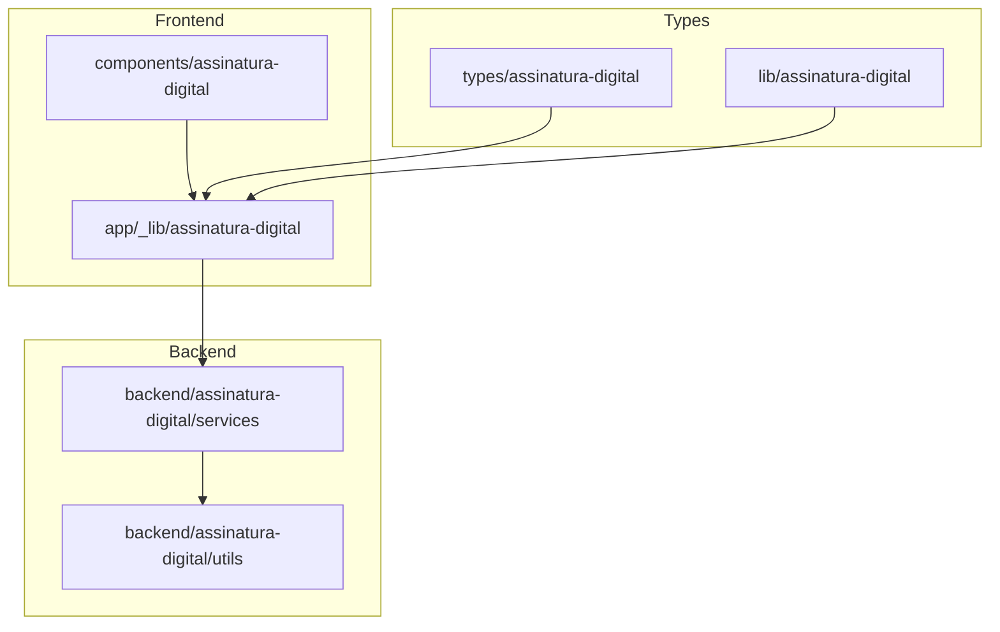
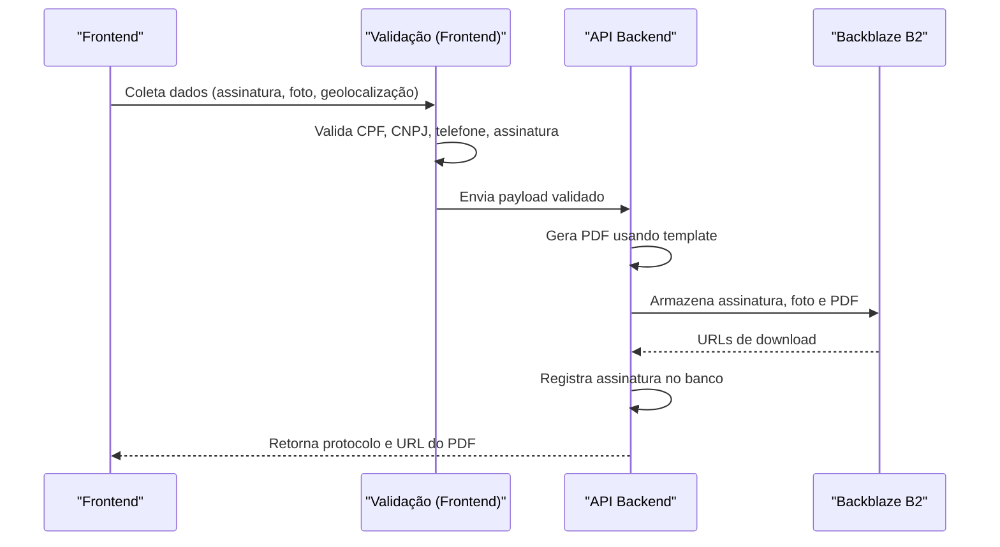
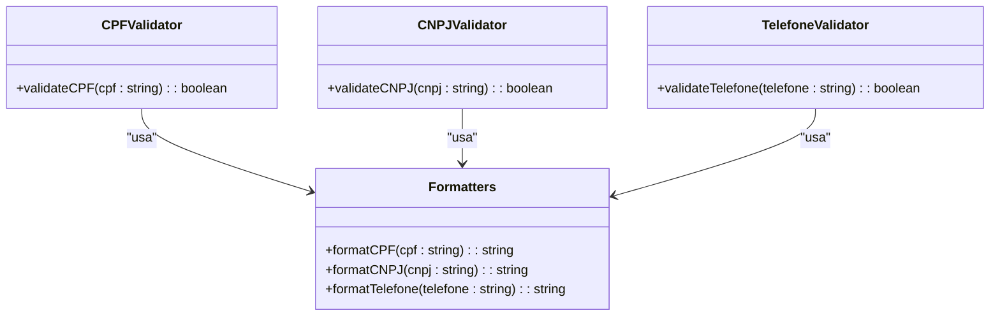
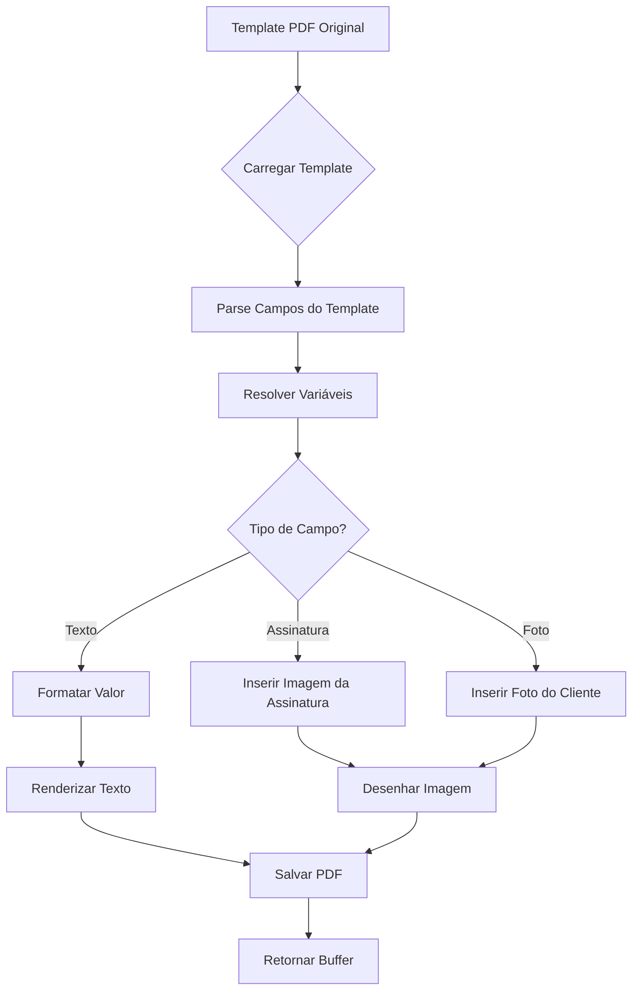
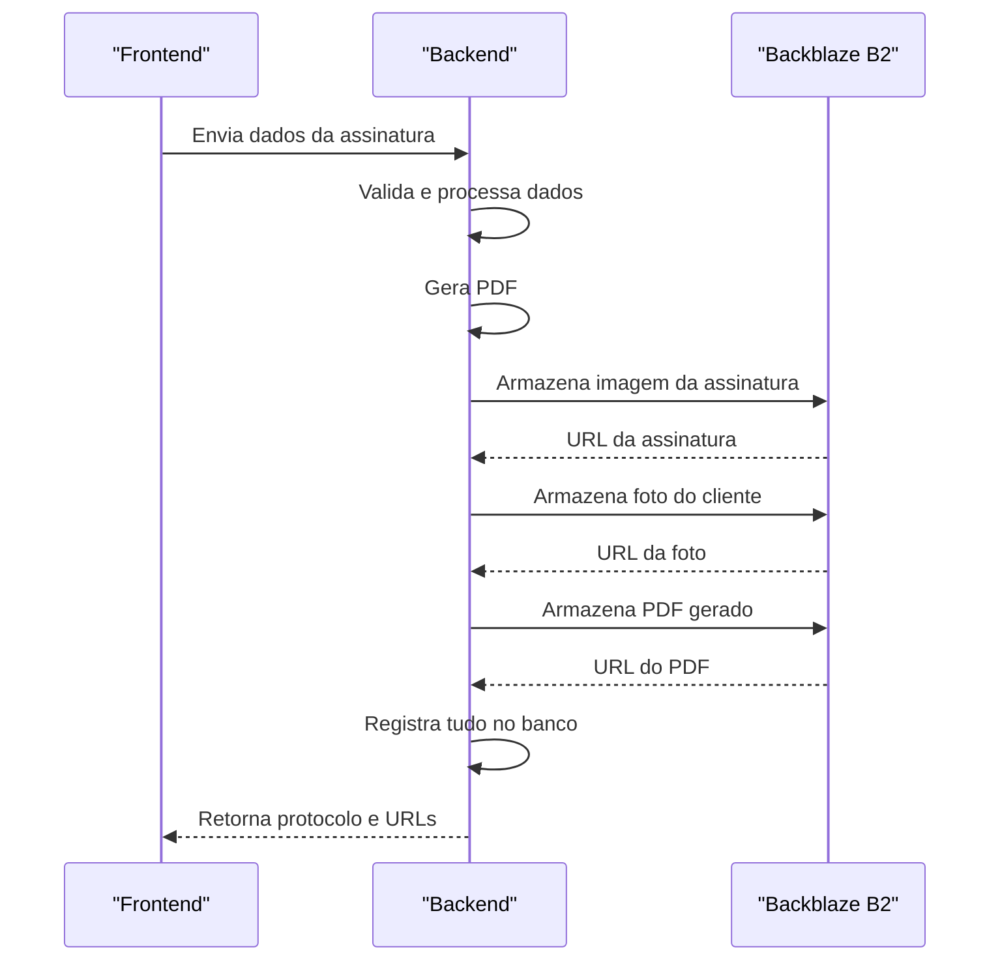
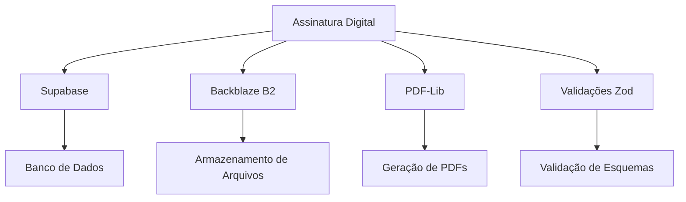

# Assinatura Digital

<cite>
**Arquivos Referenciados neste Documento**  
- [app\_lib\assinatura-digital\formatters\index.ts](file://app/_lib/assinatura-digital/formatters/index.ts)
- [app\_lib\assinatura-digital\formatters\cpf.ts](file://app/_lib/assinatura-digital/formatters/cpf.ts)
- [app\_lib\assinatura-digital\formatters\cnpj.ts](file://app/_lib/assinatura-digital/formatters/cnpj.ts)
- [app\_lib\assinatura-digital\formatters\telefone.ts](file://app/_lib/assinatura-digital/formatters/telefone.ts)
- [app\_lib\assinatura-digital\validators\cpf.validator.ts](file://app/_lib/assinatura-digital/validators/cpf.validator.ts)
- [app\_lib\assinatura-digital\validators\cnpj.validator.ts](file://app/_lib/assinatura-digital/validators/cnpj.validator.ts)
- [app\_lib\assinatura-digital\validators\telefone.validator.ts](file://app/_lib/assinatura-digital/validators/telefone.validator.ts)
- [app\_lib\assinatura-digital\validations\business.validations.ts](file://app/_lib/assinatura-digital/validations/business.validations.ts)
- [backend\assinatura-digital\services\signature.service.ts](file://backend/assinatura-digital/services/signature.service.ts)
- [backend\assinatura-digital\services\template-pdf.service.ts](file://backend/assinatura-digital/services/template-pdf.service.ts)
- [backend\assinatura-digital\services\templates.service.ts](file://backend/assinatura-digital/services/templates.service.ts)
- [backend\assinatura-digital\services\storage.service.ts](file://backend/assinatura-digital/services/storage.service.ts)
- [backend\assinatura-digital\services\data.service.ts](file://backend/assinatura-digital/services/data.service.ts)
- [backend\assinatura-digital\services\dashboard.service.ts](file://backend/assinatura-digital/services/dashboard.service.ts)
- [types\assinatura-digital\index.ts](file://types/assinatura-digital/index.ts)
- [lib\assinatura-digital\index.ts](file://lib/assinatura-digital/index.ts)
</cite>

## Sumário
1. [Introdução](#introdução)
2. [Estrutura do Projeto](#estrutura-do-projeto)
3. [Componentes Principais](#componentes-principais)
4. [Visão Geral da Arquitetura](#visão-geral-da-arquitetura)
5. [Análise Detalhada dos Componentes](#análise-detallada-dos-componentes)
6. [Análise de Dependências](#análise-de-dependências)
7. [Considerações de Desempenho](#considerações-de-desempenho)
8. [Guia de Solução de Problemas](#guia-de-solução-de-problemas)
9. [Conclusão](#conclusão)

## Introdução
Este documento fornece uma análise detalhada do sistema de assinatura digital implementado no projeto Sinesys. O sistema permite a criação, validação e armazenamento de assinaturas digitais com suporte a metadados como geolocalização, fotos e dados do cliente. A arquitetura é dividida entre camadas frontend e backend, com validações robustas e geração de documentos PDF personalizados.

## Estrutura do Projeto
A funcionalidade de assinatura digital está distribuída entre várias pastas no projeto, com separação clara entre frontend, backend e tipos compartilhados.

**Fontes do Diagrama**
- [app/_lib/assinatura-digital](file://app/_lib/assinatura-digital)
- [backend/assinatura-digital/services](file://backend/assinatura-digital/services)
- [types/assinatura-digital](file://types/assinatura-digital)
- [lib/assinatura-digital](file://lib/assinatura-digital)

**Fontes da Seção**
- [app/_lib/assinatura-digital](file://app/_lib/assinatura-digital)
- [backend/assinatura-digital/services](file://backend/assinatura-digital/services)

## Componentes Principais
O sistema de assinatura digital é composto por vários componentes interconectados que tratam da validação de dados, geração de documentos e armazenamento seguro. Os principais serviços incluem validação de CPF/CNPJ, formatação de dados, geração de PDFs e armazenamento em Backblaze B2.

**Fontes da Seção**
- [app/_lib/assinatura-digital](file://app/_lib/assinatura-digital)
- [backend/assinatura-digital/services](file://backend/assinatura-digital/services)

## Visão Geral da Arquitetura
A arquitetura do sistema de assinatura digital segue um padrão de camadas bem definido, onde o frontend coleta e valida os dados, enquanto o backend processa e armazena as informações de forma segura.

**Fontes do Diagrama**
- [app/_lib/assinatura-digital/validators](file://app/_lib/assinatura-digital/validators)
- [backend/assinatura-digital/services/signature.service.ts](file://backend/assinatura-digital/services/signature.service.ts)
- [backend/assinatura-digital/services/template-pdf.service.ts](file://backend/assinatura-digital/services/template-pdf.service.ts)
- [backend/assinatura-digital/services/storage.service.ts](file://backend/assinatura-digital/services/storage.service.ts)

## Análise Detalhada dos Componentes

### Validação de Dados
O sistema implementa validações rigorosas para garantir a integridade dos dados coletados durante o processo de assinatura digital.

#### Validação de CPF/CNPJ

**Fontes do Diagrama**
- [app/_lib/assinatura-digital/validators/cpf.validator.ts](file://app/_lib/assinatura-digital/validators/cpf.validator.ts)
- [app/_lib/assinatura-digital/validators/cnpj.validator.ts](file://app/_lib/assinatura-digital/validators/cnpj.validator.ts)
- [app/_lib/assinatura-digital/validators/telefone.validator.ts](file://app/_lib/assinatura-digital/validators/telefone.validator.ts)
- [app/_lib/assinatura-digital/formatters](file://app/_lib/assinatura-digital/formatters)

**Fontes da Seção**
- [app/_lib/assinatura-digital/validators](file://app/_lib/assinatura-digital/validators)
- [app/_lib/assinatura-digital/formatters](file://app/_lib/assinatura-digital/formatters)

### Geração de Documentos PDF
O sistema de geração de PDFs permite a criação de documentos personalizados com base em templates, preenchendo campos com dados do cliente, segmento e formulário.

#### Processo de Geração de PDF

**Fontes do Diagrama**
- [backend/assinatura-digital/services/template-pdf.service.ts](file://backend/assinatura-digital/services/template-pdf.service.ts)
- [backend/assinatura-digital/services/data.service.ts](file://backend/assinatura-digital/services/data.service.ts)

**Fontes da Seção**
- [backend/assinatura-digital/services/template-pdf.service.ts](file://backend/assinatura-digital/services/template-pdf.service.ts)

### Armazenamento de Arquivos
O sistema utiliza o Backblaze B2 para armazenar de forma segura os arquivos gerados durante o processo de assinatura digital.

#### Fluxo de Armazenamento

**Fontes do Diagrama**
- [backend/assinatura-digital/services/storage.service.ts](file://backend/assinatura-digital/services/storage.service.ts)
- [backend/assinatura-digital/services/signature.service.ts](file://backend/assinatura-digital/services/signature.service.ts)

**Fontes da Seção**
- [backend/assinatura-digital/services/storage.service.ts](file://backend/assinatura-digital/services/storage.service.ts)

## Análise de Dependências
O sistema de assinatura digital depende de vários serviços externos e internos para funcionar corretamente.

**Fontes do Diagrama**
- [backend/assinatura-digital/services/data.service.ts](file://backend/assinatura-digital/services/data.service.ts)
- [backend/assinatura-digital/services/storage.service.ts](file://backend/assinatura-digital/services/storage.service.ts)
- [backend/assinatura-digital/services/template-pdf.service.ts](file://backend/assinatura-digital/services/template-pdf.service.ts)

**Fontes da Seção**
- [backend/assinatura-digital/services](file://backend/assinatura-digital/services)

## Considerações de Desempenho
O sistema foi projetado para lidar com a geração e armazenamento de documentos de forma eficiente, com otimizações específicas para operações críticas.

- **Geração de PDF**: Utiliza pdf-lib para manipulação eficiente de documentos PDF
- **Armazenamento**: Upload direto para Backblaze B2 com nomes de arquivo gerados unicamente
- **Validação**: Validações síncronas no frontend para feedback imediato ao usuário
- **Protocolo**: Geração de protocolo único com timestamp e número aleatório

**Fontes da Seção**
- [backend/assinatura-digital/services/template-pdf.service.ts](file://backend/assinatura-digital/services/template-pdf.service.ts)
- [backend/assinatura-digital/services/storage.service.ts](file://backend/assinatura-digital/services/storage.service.ts)
- [backend/assinatura-digital/services/signature.service.ts](file://backend/assinatura-digital/services/signature.service.ts)

## Guia de Solução de Problemas
Este guia cobre os problemas comuns encontrados no sistema de assinatura digital e suas soluções.

### Problemas Comuns
- **Falha na validação de CPF/CNPJ**: Verificar formatação e dígitos verificadores
- **Erro no upload de arquivos**: Verificar conexão com Backblaze B2 e permissões
- **Problemas na geração de PDF**: Verificar template original e campos mapeados
- **Geolocalização inválida**: Validar coordenadas e precisão

**Fontes da Seção**
- [app/_lib/assinatura-digital/validators](file://app/_lib/assinatura-digital/validators)
- [backend/assinatura-digital/services](file://backend/assinatura-digital/services)

## Conclusão
O sistema de assinatura digital implementado no projeto Sinesys é robusto e bem estruturado, com separação clara de responsabilidades entre frontend e backend. A arquitetura permite a validação rigorosa de dados, geração de documentos personalizados e armazenamento seguro em nuvem. Os componentes são altamente reutilizáveis e seguem boas práticas de desenvolvimento, garantindo confiabilidade e escalabilidade.