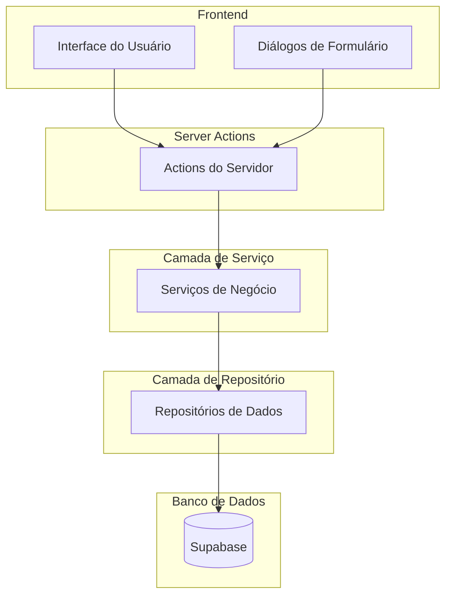
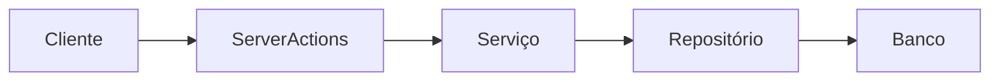
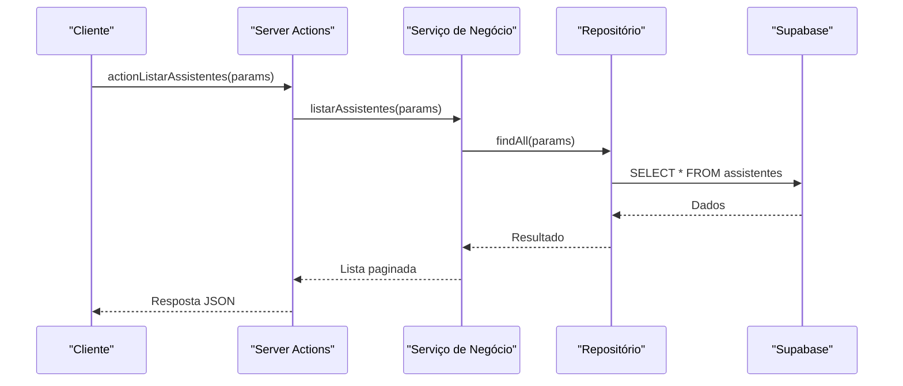
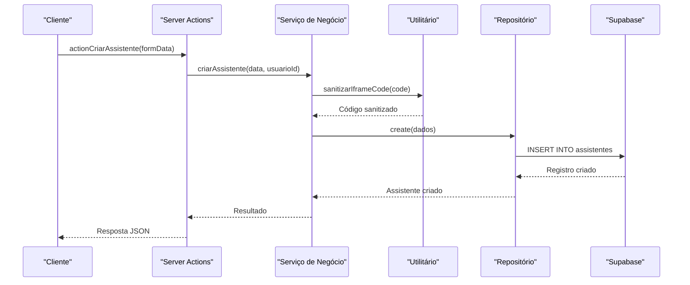
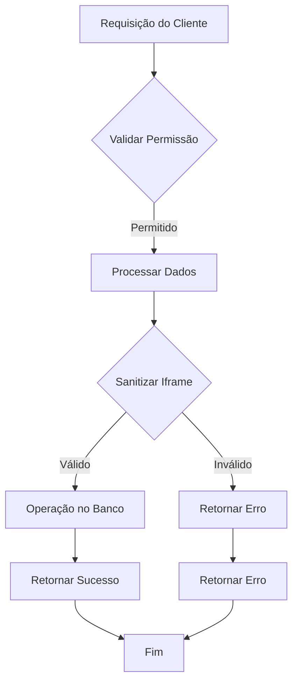
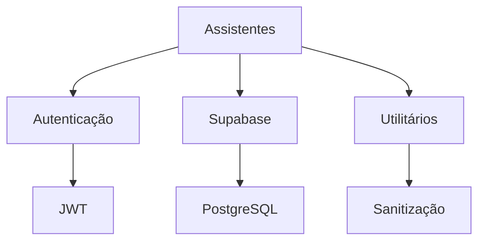

# Assistentes

<cite>
**Arquivos Referenciados neste Documento**   
- [service.ts](file://src/features/assistentes/service.ts)
- [repository.ts](file://src/features/assistentes/repository.ts)
- [assistentes-actions.ts](file://src/features/assistentes/actions/assistentes-actions.ts)
- [create-dialog.tsx](file://src/features/assistentes/components/dialogs/create-dialog.tsx)
- [assistente-form.tsx](file://src/features/assistentes/components/forms/assistente-form.tsx)
- [index.ts](file://src/features/assistentes/index.ts)
</cite>

## Sumário
1. [Introdução](#introdução)
2. [Estrutura do Projeto](#estrutura-do-projeto)
3. [Componentes Principais](#componentes-principais)
4. [Visão Geral da Arquitetura](#visão-geral-da-arquitetura)
5. [Análise Detalhada dos Componentes](#análise-detalhada-dos-componentes)
6. [Análise de Dependências](#análise-de-dependências)
7. [Considerações de Desempenho](#considerações-de-desempenho)
8. [Guia de Solução de Problemas](#guia-de-solução-de-problemas)
9. [Conclusão](#conclusão)

## Introdução
O sistema **Sinesys** é uma plataforma de gestão jurídica que permite a integração com sistemas PJE/TRT para captura automatizada de dados processuais, além de oferecer funcionalidades para gestão de contratos, audiências, clientes, partes contrárias e pendências de manifestação. Este documento foca especificamente no módulo de **Assistentes**, que permite a criação, listagem, atualização e exclusão de assistentes virtuais no sistema. Os assistentes são representados por códigos HTML em iframe, permitindo integração com ferramentas externas diretamente na interface do sistema. O módulo foi recentemente atualizado com uma nova arquitetura baseada em server actions, padrão repository e camada de serviço, substituindo os serviços legados anteriormente localizados em `backend/assistentes/services`.

## Estrutura do Projeto
A estrutura do projeto segue uma arquitetura baseada em camadas, com separação clara entre a camada de server actions, serviços de negócio, repositórios de persistência e componentes da interface. O módulo de assistentes está organizado dentro da pasta `src/features/assistentes`, contendo subpastas para `actions`, `service`, `repository`, `components`, `hooks`, `domain`, `types` e `utils`. Esta nova estrutura substitui completamente os serviços legados em `backend/assistentes/services`.

**Fontes do Diagrama**
- [assistentes-actions.ts](file://src/features/assistentes/actions/assistentes-actions.ts)
- [service.ts](file://src/features/assistentes/service.ts)
- [repository.ts](file://src/features/assistentes/repository.ts)

**Fontes da Seção**
- [assistentes-actions.ts](file://src/features/assistentes/actions/assistentes-actions.ts)
- [service.ts](file://src/features/assistentes/service.ts)
- [repository.ts](file://src/features/assistentes/repository.ts)

## Componentes Principais
Os componentes principais do módulo de assistentes incluem as server actions para operações assíncronas no servidor, os serviços de negócio que implementam a lógica de validação e orquestração, os repositórios que realizam operações no banco de dados, e os componentes da interface com novos diálogos e formulários. A nova arquitetura elimina completamente os serviços legados em `backend/assistentes/services`, substituindo-os pela estrutura feature-sliced em `src/features/assistentes`.

**Fontes da Seção**
- [assistentes-actions.ts](file://src/features/assistentes/actions/assistentes-actions.ts)
- [service.ts](file://src/features/assistentes/service.ts)
- [repository.ts](file://src/features/assistentes/repository.ts)
- [create-dialog.tsx](file://src/features/assistentes/components/dialogs/create-dialog.tsx)

## Visão Geral da Arquitetura
A arquitetura do módulo de assistentes segue o padrão de camadas definido no projeto, com a camada de server actions recebendo requisições do cliente, validando permissões e orquestrando chamadas aos serviços, a camada de serviço implementando a lógica de negócio e validações, e a camada de repositório realizando operações no banco de dados Supabase. O fluxo de dados é unidirecional, garantindo baixo acoplamento e facilitando testes e manutenção. Esta nova arquitetura substitui completamente a estrutura anterior baseada em rotas API e serviços legados.

**Fontes do Diagrama**
- [assistentes-actions.ts](file://src/features/assistentes/actions/assistentes-actions.ts)
- [service.ts](file://src/features/assistentes/service.ts)
- [repository.ts](file://src/features/assistentes/repository.ts)

## Análise Detalhada dos Componentes
### Análise do Componente de Assistentes
O componente de assistentes é responsável por gerenciar o ciclo de vida dos assistentes virtuais no sistema. Ele inclui operações de listagem com paginação e filtros, criação com validação de dados, atualização parcial e exclusão permanente. A segurança é garantida através de verificações de permissão em todas as operações. A nova arquitetura baseia-se em server actions, camada de serviço e padrão repository, substituindo completamente os serviços legados.

#### Para Componentes Baseados em Server Actions:

**Fontes do Diagrama**
- [assistentes-actions.ts](file://src/features/assistentes/actions/assistentes-actions.ts)
- [service.ts](file://src/features/assistentes/service.ts)
- [repository.ts](file://src/features/assistentes/repository.ts)

#### Para Componentes de Criação:

**Fontes do Diagrama**
- [assistentes-actions.ts](file://src/features/assistentes/actions/assistentes-actions.ts)
- [service.ts](file://src/features/assistentes/service.ts)
- [repository.ts](file://src/features/assistentes/repository.ts)
- [assistente-form.tsx](file://src/features/assistentes/components/forms/assistente-form.tsx)

**Fontes da Seção**
- [assistentes-actions.ts](file://src/features/assistentes/actions/assistentes-actions.ts)
- [service.ts](file://src/features/assistentes/service.ts)
- [repository.ts](file://src/features/assistentes/repository.ts)

### Visão Conceitual
A funcionalidade de assistentes permite a integração de ferramentas externas através de iframes, ampliando as capacidades do sistema sem necessidade de desenvolvimento interno. A sanitização do código do iframe garante que apenas conteúdo seguro seja exibido, prevenindo vulnerabilidades como XSS. A nova arquitetura com server actions, camada de serviço e repositório proporciona melhor organização, testabilidade e manutenibilidade em comparação com os serviços legados.

## Análise de Dependências
O módulo de assistentes depende de vários componentes do sistema, incluindo o serviço de autenticação para verificação de permissões, o cliente Supabase para operações no banco de dados, e utilitários de formatação para processamento de dados. As dependências são injetadas nos serviços, garantindo baixo acoplamento e facilitando testes unitários. A nova estrutura elimina dependências dos serviços legados em `backend/assistentes/services`.

**Fontes do Diagrama**
- [assistentes-actions.ts](file://src/features/assistentes/actions/assistentes-actions.ts)
- [service.ts](file://src/features/assistentes/service.ts)
- [repository.ts](file://src/features/assistentes/repository.ts)

**Fontes da Seção**
- [assistentes-actions.ts](file://src/features/assistentes/actions/assistentes-actions.ts)
- [service.ts](file://src/features/assistentes/service.ts)
- [repository.ts](file://src/features/assistentes/repository.ts)

## Considerações de Desempenho
As operações de listagem utilizam paginação e filtros para limitar a quantidade de dados retornados, melhorando o desempenho e a experiência do usuário. O uso de índices no banco de dados para campos frequentemente consultados, como nome e status, otimiza as consultas. A sanitização do código do iframe é realizada de forma eficiente, garantindo segurança sem impacto significativo no desempenho. A nova arquitetura com server actions permite melhor controle sobre a revalidação de cache e otimização de renderização.

## Guia de Solução de Problemas
Problemas comuns incluem falhas na criação de assistentes devido a código de iframe inválido ou ausência de scripts maliciosos. A validação de entrada e a sanitização de dados devem ser verificadas em caso de erros. Problemas de permissão podem ocorrer se o usuário não tiver as permissões necessárias, que devem ser configuradas no sistema de gerenciamento de usuários. A migração dos serviços legados para a nova arquitetura deve ser verificada para garantir que todas as funcionalidades foram corretamente substituídas.

**Fontes da Seção**
- [assistentes-actions.ts](file://src/features/assistentes/actions/assistentes-actions.ts)
- [service.ts](file://src/features/assistentes/service.ts)

## Conclusão
O módulo de assistentes do sistema Sinesys foi completamente atualizado com uma nova arquitetura baseada em server actions, padrão repository e camada de serviço, substituindo os serviços legados em `backend/assistentes/services`. Esta nova estrutura oferece uma solução mais robusta, segura e mantível para integração de ferramentas externas através de iframes. A arquitetura em camadas, a validação rigorosa de dados e a sanitização de conteúdo garantem a integridade e segurança do sistema. A refatoração completa da UI com novos componentes de diálogo e formulário melhora significativamente a experiência do usuário. A documentação detalhada e a organização em feature-sliced facilitam a manutenção e evolução do módulo.