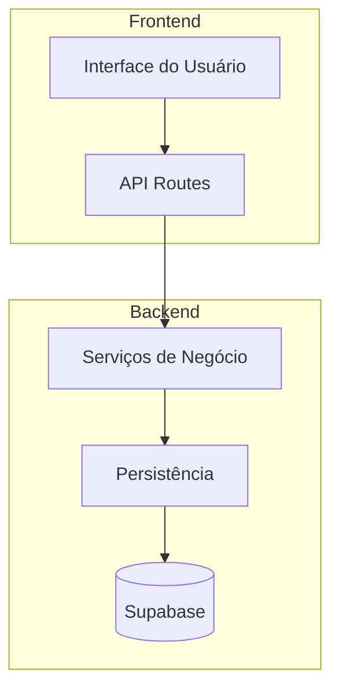
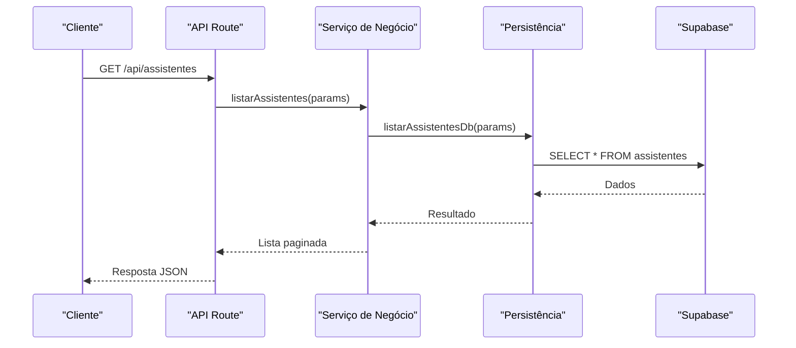
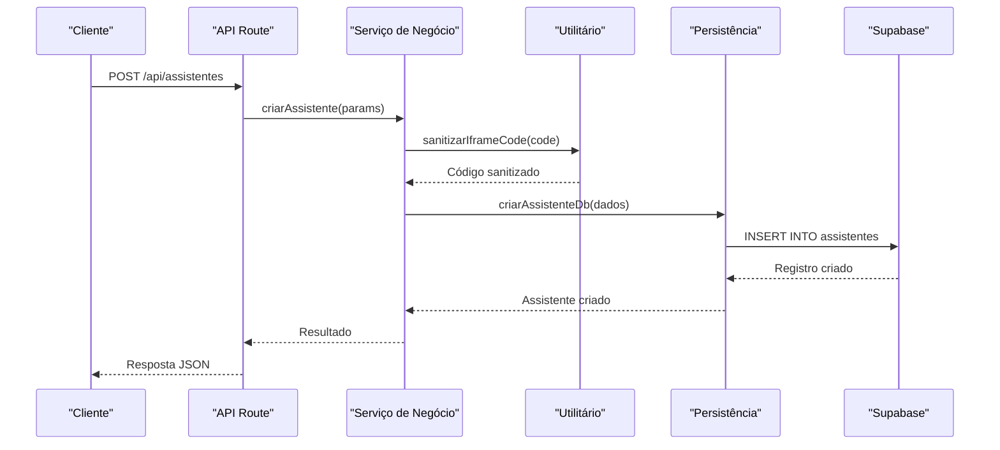
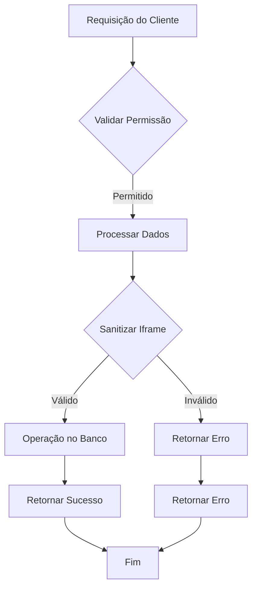
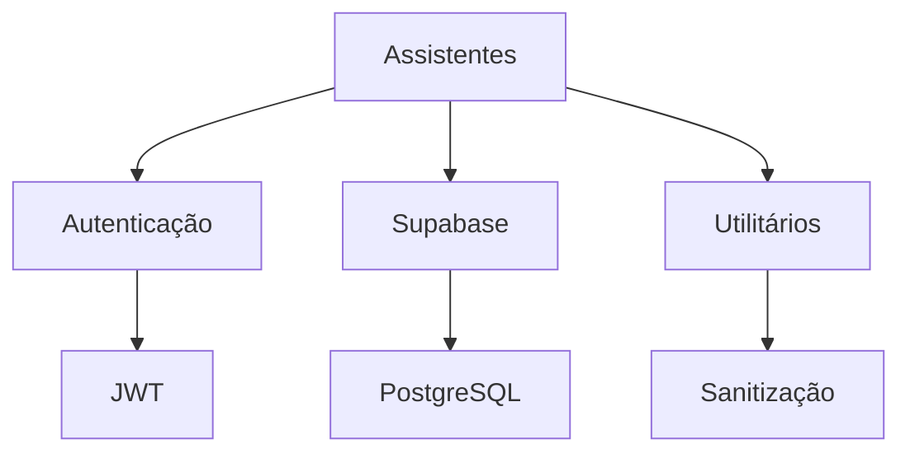

# Assistentes

<cite>
**Arquivos Referenciados neste Documento**   
- [route.ts](file://app/api/assistentes/route.ts)
- [route.ts](file://app/api/assistentes/[id]/route.ts)
- [assistente-persistence.service.ts](file://backend/assistentes/services/assistente-persistence.service.ts)
- [listar-assistentes.service.ts](file://backend/assistentes/services/listar-assistentes.service.ts)
- [criar-assistente.service.ts](file://backend/assistentes/services/criar-assistente.service.ts)
- [format-assistentes.ts](file://app/_lib/utils/format-assistentes.ts)
- [08_usuarios.sql](file://supabase/schemas/08_usuarios.sql)
</cite>

## Sumário
1. [Introdução](#introdução)
2. [Estrutura do Projeto](#estrutura-do-projeto)
3. [Componentes Principais](#componentes-principais)
4. [Visão Geral da Arquitetura](#visão-geral-da-arquitetura)
5. [Análise Detalhada dos Componentes](#análise-detalhada-dos-componentes)
6. [Análise de Dependências](#análise-de-dependências)
7. [Considerações de Desempenho](#considerações-de-desempenho)
8. [Guia de Solução de Problemas](#guia-de-solução-de-problemas)
9. [Conclusão](#conclusão)

## Introdução
O sistema **Sinesys** é uma plataforma de gestão jurídica que permite a integração com sistemas PJE/TRT para captura automatizada de dados processuais, além de oferecer funcionalidades para gestão de contratos, audiências, clientes, partes contrárias e pendências de manifestação. Este documento foca especificamente no módulo de **Assistentes**, que permite a criação, listagem, atualização e exclusão de assistentes virtuais no sistema. Os assistentes são representados por códigos HTML em iframe, permitindo integração com ferramentas externas diretamente na interface do sistema.

## Estrutura do Projeto
A estrutura do projeto segue uma arquitetura baseada em camadas, com separação clara entre a camada de API, serviços de negócio e persistência. O módulo de assistentes está organizado dentro das pastas `app/api/assistentes` para as rotas da API, `backend/assistentes/services` para os serviços de negócio e persistência, e `app/_lib/utils` para utilitários de formatação.

**Fontes do Diagrama**
- [route.ts](file://app/api/assistentes/route.ts)
- [assistente-persistence.service.ts](file://backend/assistentes/services/assistente-persistence.service.ts)

**Fontes da Seção**
- [route.ts](file://app/api/assistentes/route.ts)
- [assistente-persistence.service.ts](file://backend/assistentes/services/assistente-persistence.service.ts)

## Componentes Principais
Os componentes principais do módulo de assistentes incluem as rotas da API para listagem, criação, atualização e exclusão de assistentes, os serviços de negócio que implementam a lógica de validação e orquestração, e os serviços de persistência que realizam as operações no banco de dados. Além disso, existem utilitários para formatação e sanitização de dados, garantindo a segurança e integridade das informações.

**Fontes da Seção**
- [route.ts](file://app/api/assistentes/route.ts)
- [criar-assistente.service.ts](file://backend/assistentes/services/criar-assistente.service.ts)
- [format-assistentes.ts](file://app/_lib/utils/format-assistentes.ts)

## Visão Geral da Arquitetura
A arquitetura do módulo de assistentes segue o padrão de camadas definido no projeto, com a camada de API recebendo requisições HTTP, validando parâmetros e autenticando usuários, a camada de serviço implementando a lógica de negócio e validações, e a camada de persistência realizando operações no banco de dados Supabase. O fluxo de dados é unidirecional, garantindo baixo acoplamento e facilitando testes e manutenção.

**Fontes do Diagrama**
- [route.ts](file://app/api/assistentes/route.ts)
- [listar-assistentes.service.ts](file://backend/assistentes/services/listar-assistentes.service.ts)
- [assistente-persistence.service.ts](file://backend/assistentes/services/assistente-persistence.service.ts)

## Análise Detalhada dos Componentes
### Análise do Componente de Assistentes
O componente de assistentes é responsável por gerenciar o ciclo de vida dos assistentes virtuais no sistema. Ele inclui operações de listagem com paginação e filtros, criação com validação de dados, atualização parcial e exclusão permanente. A segurança é garantida através de verificações de permissão em todas as operações.

#### Para Componentes Baseados em Serviço:

**Fontes do Diagrama**
- [route.ts](file://app/api/assistentes/route.ts)
- [listar-assistentes.service.ts](file://backend/assistentes/services/listar-assistentes.service.ts)
- [assistente-persistence.service.ts](file://backend/assistentes/services/assistente-persistence.service.ts)

#### Para Componentes de Criação:

**Fontes do Diagrama**
- [route.ts](file://app/api/assistentes/route.ts)
- [criar-assistente.service.ts](file://backend/assistentes/services/criar-assistente.service.ts)
- [format-assistentes.ts](file://app/_lib/utils/format-assistentes.ts)

**Fontes da Seção**
- [route.ts](file://app/api/assistentes/route.ts)
- [criar-assistente.service.ts](file://backend/assistentes/services/criar-assistente.service.ts)
- [format-assistentes.ts](file://app/_lib/utils/format-assistentes.ts)

### Visão Conceitual
A funcionalidade de assistentes permite a integração de ferramentas externas através de iframes, ampliando as capacidades do sistema sem necessidade de desenvolvimento interno. A sanitização do código do iframe garante que apenas conteúdo seguro seja exibido, prevenindo vulnerabilidades como XSS.

## Análise de Dependências
O módulo de assistentes depende de vários componentes do sistema, incluindo o serviço de autenticação para verificação de permissões, o cliente Supabase para operações no banco de dados, e utilitários de formatação para processamento de dados. As dependências são injetadas nos serviços, garantindo baixo acoplamento e facilitando testes unitários.

**Fontes do Diagrama**
- [route.ts](file://app/api/assistentes/route.ts)
- [assistente-persistence.service.ts](file://backend/assistentes/services/assistente-persistence.service.ts)
- [format-assistentes.ts](file://app/_lib/utils/format-assistentes.ts)

**Fontes da Seção**
- [route.ts](file://app/api/assistentes/route.ts)
- [assistente-persistence.service.ts](file://backend/assistentes/services/assistente-persistence.service.ts)

## Considerações de Desempenho
As operações de listagem utilizam paginação e filtros para limitar a quantidade de dados retornados, melhorando o desempenho e a experiência do usuário. O uso de índices no banco de dados para campos frequentemente consultados, como nome e status, otimiza as consultas. A sanitização do código do iframe é realizada de forma eficiente, garantindo segurança sem impacto significativo no desempenho.

## Guia de Solução de Problemas
Problemas comuns incluem falhas na criação de assistentes devido a código de iframe inválido ou ausência de scripts maliciosos. A validação de entrada e a sanitização de dados devem ser verificadas em caso de erros. Problemas de permissão podem ocorrer se o usuário não tiver as permissões necessárias, que devem ser configuradas no sistema de gerenciamento de usuários.

**Fontes da Seção**
- [route.ts](file://app/api/assistentes/route.ts)
- [criar-assistente.service.ts](file://backend/assistentes/services/criar-assistente.service.ts)

## Conclusão
O módulo de assistentes do sistema Sinesys oferece uma solução robusta e segura para integração de ferramentas externas através de iframes. A arquitetura em camadas, a validação rigorosa de dados e a sanitização de conteúdo garantem a integridade e segurança do sistema. A documentação detalhada e os utilitários de formatação facilitam a manutenção e evolução do módulo.