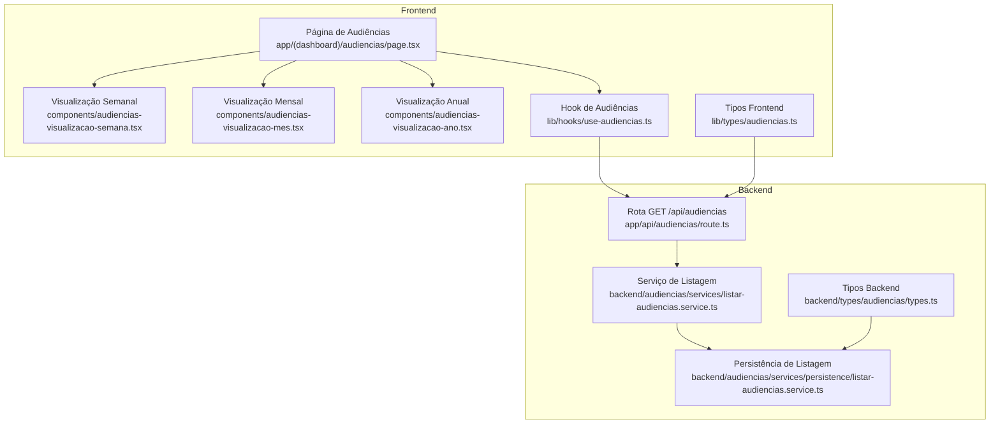
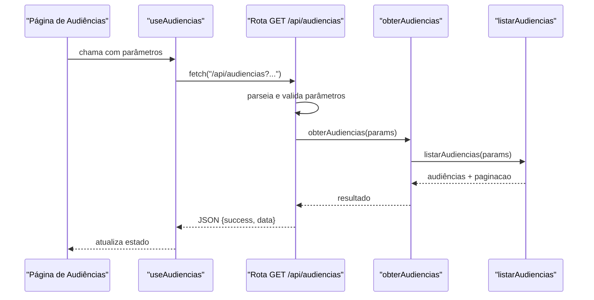
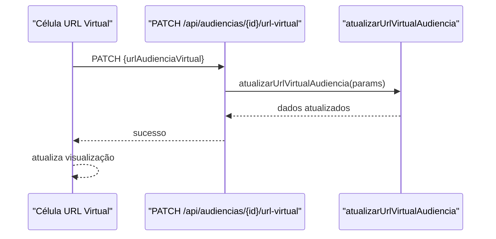
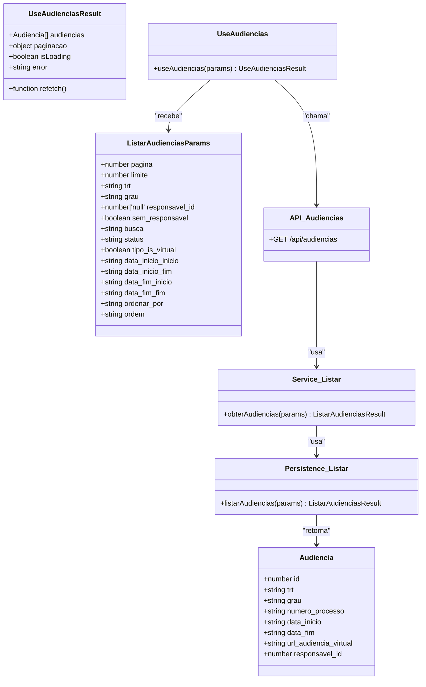

# Audiências Visualização

<cite>
**Arquivos Referenciados neste Documento**
- [app/(dashboard)/audiencias/components/audiencias-content.tsx](file://app/(dashboard)/audiencias/components/audiencias-content.tsx)
- [app/(dashboard)/audiencias/mes/page.tsx](file://app/(dashboard)/audiencias/mes/page.tsx)
- [app/(dashboard)/audiencias/ano/page.tsx](file://app/(dashboard)/audiencias/ano/page.tsx)
- [components/audiencias-visualizacao-mes.tsx](file://components/audiencias-visualizacao-mes.tsx)
- [components/audiencias-visualizacao-ano.tsx](file://components/audiencias-visualizacao-ano.tsx)
- [components/date-navigator.tsx](file://components/date-navigator.tsx)
- [components/calendar-month-view.tsx](file://components/calendar-month-view.tsx)
- [components/calendar-year-view.tsx](file://components/calendar-year-view.tsx)
- [components/day-cell.tsx](file://components/day-cell.tsx)
</cite>

## Atualização do Documento
**Alterações Realizadas**
- Atualização da documentação para refletir as melhorias na visualização mensal de audiências, incluindo a implementação de uma grade CSS personalizada com 7 colunas para representar os dias da semana, exibição de até 3 audiências diretamente na célula do dia com um indicador '+X mais' quando houver audiências adicionais, e suporte apropriadamente ao mês selecionado através de props opcionais. Também inclui melhorias na formatação de datas com locale pt-BR.
- Atualização da documentação para refletir as melhorias na visualização anual de audiências, incluindo a adição do locale ptBR do date-fns, configuração do componente de calendário para usar português brasileiro, formatação de legendas com 'de' minúsculo entre mês e ano (ex: 'janeiro de 2025'), e layout de grade responsivo que se adapta de uma coluna em mobile a quatro colunas em telas maiores.
- Atualização da documentação para refletir as melhorias nos controles de navegação da visualização de audiências, incluindo centralização dos elementos de navegação, espaçamento ajustado (pt-2), botões com tamanho mínimo expandido (min-w-36) e tamanho de texto aumentado (text-sm) para melhorar os alvos de toque em dispositivos móveis, além da formatação correta do mês e ano com 'de' minúsculo.

## Sumário
- Este documento apresenta a funcionalidade de visualização de audiências com múltiplas perspectivas (tabela, semana, mês e ano), além de recursos de edição direta de URLs virtuais, observações e atribuição de responsável. Ele explica a arquitetura front-end e back-end envolvidas, fluxos de dados, tratamento de erros e boas práticas de uso.

## Introdução
A página de audiências oferece uma visão abrangente das audiências agendadas, permitindo navegar pelas semanas, meses e anos, além de uma tabela tradicional com colunas editáveis. A funcionalidade foi desenvolvida com um design modular, separando componentes de visualização, lógica de busca e serviços de persistência.

## Estrutura do Projeto
A visualização de audiências é composta pelos seguintes elementos principais:
- Página principal: carrega filtros, busca, paginação e exibe as visualizações.
- Componentes de visualização: semana, mês e ano.
- Hooks e tipos: definição de parâmetros e resposta da API.
- Rotas e serviços: listagem, atualização de URL virtual, observações e atribuição de responsável.

**Fontes do Diagrama**
- [app/(dashboard)/audiencias/page.tsx](file://app/(dashboard)/audiencias/page.tsx#L738-L800)
- [components/audiencias-visualizacao-semana.tsx](file://components/audiencias-visualizacao-semana.tsx#L626-L784)
- [components/audiencias-visualizacao-mes.tsx](file://components/audiencias-visualizacao-mes.tsx#L1-L195)
- [components/audiencias-visualizacao-ano.tsx](file://components/audiencias-visualizacao-ano.tsx#L1-L184)
- [lib/hooks/use-audiencias.ts](file://lib/hooks/use-audiencias.ts#L1-L112)
- [lib/types/audiencias.ts](file://lib/types/audiencias.ts#L1-L54)
- [app/api/audiencias/route.ts](file://app/api/audiencias/route.ts#L1-L307)
- [backend/audiencias/services/listar-audiencias.service.ts](file://backend/audiencias/services/listar-audiencias.service.ts#L1-L26)
- [backend/audiencias/services/persistence/listar-audiencias.service.ts](file://backend/audiencias/services/persistence/listar-audiencias.service.ts#L1-L190)
- [backend/types/audiencias/types.ts](file://backend/types/audiencias/types.ts#L1-L121)

**Fontes da Seção**
- [app/(dashboard)/audiencias/page.tsx](file://app/(dashboard)/audiencias/page.tsx#L738-L800)
- [lib/hooks/use-audiencias.ts](file://lib/hooks/use-audiencias.ts#L1-L112)
- [app/api/audiencias/route.ts](file://app/api/audiencias/route.ts#L1-L307)
- [backend/audiencias/services/listar-audiencias.service.ts](file://backend/audiencias/services/listar-audiencias.service.ts#L1-L26)
- [backend/audiencias/services/persistence/listar-audiencias.service.ts](file://backend/audiencias/services/persistence/listar-audiencias.service.ts#L1-L190)
- [lib/types/audiencias.ts](file://lib/types/audiencias.ts#L1-L54)
- [backend/types/audiencias/types.ts](file://backend/types/audiencias/types.ts#L1-L121)

## Componentes Principais

### Página de Audiências
- Carrega filtros avançados, busca com debounce, paginação e ordenação.
- Fornece três visualizações: tabela, semana, mês e ano.
- Permite edição rápida de URL virtual, observações e responsável diretamente nas colunas.

Principais responsabilidades:
- Definição de colunas da tabela com formatação de dados e células editáveis.
- Controle de visualização e navegação entre semana/mês/ano.
- Busca de usuários ativos para o campo de responsável.

**Fontes da Seção**
- [app/(dashboard)/audiencias/page.tsx](file://app/(dashboard)/audiencias/page.tsx#L1-L800)

### Visualização Semanal
- Exibe audiências em uma grade de dias da semana (segunda a sexta).
- Células editáveis de URL virtual, observações e responsável.
- Tabela por dia com ordenação por horário.
- Atualizado com textarea redimensionável e foco automático para edição de observações.

**Fontes da Seção**
- [components/audiencias-visualizacao-semana.tsx](file://components/audiencias-visualizacao-semana.tsx#L1-L784)

### Visualização Mensal
- Calendário com marcação de dias com audiências.
- Ao clicar em um dia com audiências, abre um diálogo com todas as audiências daquele dia.
- Exibe até 3 audiências por dia com “mais”.
- Implementação de uma grade CSS personalizada com 7 colunas para representar os dias da semana.
- Suporte apropriado ao mês selecionado através de props opcionais.
- Melhorias na formatação de datas com locale pt-BR.

**Fontes da Seção**
- [components/audiencias-visualizacao-mes.tsx](file://components/audiencias-visualizacao-mes.tsx#L1-L195)
- [components/audiencia-detalhes-dialog.tsx](file://components/audiencia-detalhes-dialog.tsx#L1-L51)
- [components/calendar-month-view.tsx](file://components/calendar-month-view.tsx#L1-L70)
- [components/day-cell.tsx](file://components/day-cell.tsx#L1-L209)

### Visualização Anual
- Grade de 12 meses com marcação de dias com audiências.
- Clicar em um dia com audiências abre o diálogo com as audiências daquele dia.
- Adição do locale ptBR do date-fns.
- Configuração do componente de calendário para usar português brasileiro.
- Formatação de legendas com 'de' minúsculo entre mês e ano (ex: 'janeiro de 2025').
- Layout de grade responsivo que se adapta de uma coluna em mobile a quatro colunas em telas maiores.

**Fontes da Seção**
- [components/audiencias-visualizacao-ano.tsx](file://components/audiencias-visualizacao-ano.tsx#L1-L184)
- [components/audiencia-detalhes-dialog.tsx](file://components/audiencia-detalhes-dialog.tsx#L1-L51)
- [components/calendar-year-view.tsx](file://components/calendar-year-view.tsx#L1-L169)

### Filtros Avançados
- Abre um painel lateral com múltiplos filtros (TRT, grau, responsável, datas, status, etc.).
- Aplica os filtros e atualiza a URL de busca.

**Fontes da Seção**
- [components/audiencias-filtros-avancados.tsx](file://components/audiencias-filtros-avancados.tsx#L1-L48)

## Arquitetura de Dados e Tipos

### Tipos Frontend
- Definem a estrutura da resposta da API e os parâmetros de busca.
- Inclui campos de paginação e os filtros disponíveis.

**Fontes da Seção**
- [lib/types/audiencias.ts](file://lib/types/audiencias.ts#L1-L54)

### Tipos Backend
- Definem o registro de audiência completo, incluindo dados provenientes de JOINs (órgão julgador e classe judicial).
- Parâmetros de listagem com suporte a busca textual, filtros e ordenação.

**Fontes da Seção**
- [backend/types/audiencias/types.ts](file://backend/types/audiencias/types.ts#L1-L121)

## Fluxos de Dados

### Listagem de Audiências (GET /api/audiencias)
- Autenticação do request.
- Parse de parâmetros de query (paginação, filtros, busca e ordenação).
- Validação de parâmetros.
- Chamada ao serviço de listagem, que delega para a persistência.
- Persistência aplica JOINs e retorna audiências com paginação.

**Fontes do Diagrama**
- [lib/hooks/use-audiencias.ts](file://lib/hooks/use-audiencias.ts#L1-L112)
- [app/api/audiencias/route.ts](file://app/api/audiencias/route.ts#L1-L307)
- [backend/audiencias/services/listar-audiencias.service.ts](file://backend/audiencias/services/listar-audiencias.service.ts#L1-L26)
- [backend/audiencias/services/persistence/listar-audiencias.service.ts](file://backend/audiencias/services/persistence/listar-audiencias.service.ts#L1-L190)

**Fontes da Seção**
- [lib/hooks/use-audiencias.ts](file://lib/hooks/use-audiencias.ts#L1-L112)
- [app/api/audiencias/route.ts](file://app/api/audiencias/route.ts#L1-L307)
- [backend/audiencias/services/listar-audiencias.service.ts](file://backend/audiencias/services/listar-audiencias.service.ts#L1-L26)
- [backend/audiencias/services/persistence/listar-audiencias.service.ts](file://backend/audiencias/services/persistence/listar-audiencias.service.ts#L1-L190)

### Edição de URL Virtual
- Célula editável exibe um campo de texto e botões de salvar/cancelar.
- Ao salvar, faz PATCH para /api/audiencias/{id}/url-virtual com o novo valor.

**Fontes do Diagrama**
- [components/audiencias-visualizacao-semana.tsx](file://components/audiencias-visualizacao-semana.tsx#L112-L190)
- [components/audiencias-visualizacao-mes.tsx](file://components/audiencias-visualizacao-mes.tsx#L1-L195)
- [components/audiencias-visualizacao-ano.tsx](file://components/audiencias-visualizacao-ano.tsx#L1-L184)
- [app/api/audiencias/[id]/url-virtual/route.ts](file://app/api/audiencias/[id]/url-virtual/route.ts#L1-L52)
- [backend/audiencias/services/atualizar-url-virtual.service.ts](file://backend/audiencias/services/atualizar-url-virtual.service.ts#L1-L61)

**Fontes da Seção**
- [components/audiencias-visualizacao-semana.tsx](file://components/audiencias-visualizacao-semana.tsx#L112-L190)
- [components/audiencias-visualizacao-mes.tsx](file://components/audiencias-visualizacao-mes.tsx#L1-L195)
- [components/audiencias-visualizacao-ano.tsx](file://components/audiencias-visualizacao-ano.tsx#L1-L184)
- [app/api/audiencias/[id]/url-virtual/route.ts](file://app/api/audiencias/[id]/url-virtual/route.ts#L1-L52)
- [backend/audiencias/services/atualizar-url-virtual.service.ts](file://backend/audiencias/services/atualizar-url-virtual.service.ts#L1-L61)

### Edição de Observações
- Célula editável com textarea redimensionável e foco automático.
- Botões de ação aprimorados com ícones visuais (✓ para salvar, ✕ para cancelar).
- PATCH para /api/audiencias/{id}/observacoes com o novo valor.

**Fontes da Seção**
- [components/audiencias-visualizacao-semana.tsx](file://components/audiencias-visualizacao-semana.tsx#L271-L379)
- [app/(dashboard)/audiencias/page.tsx](file://app/(dashboard)/audiencias/page.tsx#L366-L474)
- [app/api/audiencias/[id]/observacoes/route.ts](file://app/api/audiencias/[id]/observacoes/route.ts#L1-L149)

### Atribuição de Responsável
- Popover com lista de usuários ativos.
- PATCH para /api/audiencias/{id}/responsavel com o novo responsável.

**Fontes da Seção**
- [components/audiencias-visualizacao-semana.tsx](file://components/audiencias-visualizacao-semana.tsx#L380-L469)
- [components/audiencias-visualizacao-mes.tsx](file://components/audiencias-visualizacao-mes.tsx#L1-L195)
- [components/audiencias-visualizacao-ano.tsx](file://components/audiencias-visualizacao-ano.tsx#L1-L184)
- [app/api/audiencias/[id]/responsavel/route.ts](file://app/api/audiencias/[id]/responsavel/route.ts#L1-L150)
- [backend/audiencias/services/atribuir-responsavel.service.ts](file://backend/audiencias/services/atribuir-responsavel.service.ts#L1-L154)

## Detalhamento de Componentes

### Página de Audiências (colunas e funcionalidades)
- Formatação de data/hora, data, hora e status.
- Cores diferenciadas para TRT, grau, partes e badges.
- Células editáveis:
  - URL virtual: detecção de plataforma e ícones.
  - Observações: textarea redimensionável com foco automático ao iniciar edição e botões de ação aprimorados.
  - Responsável: popover com lista de usuários ativos.

**Fontes da Seção**
- [app/(dashboard)/audiencias/page.tsx](file://app/(dashboard)/audiencias/page.tsx#L1-L800)

### Visualização Semanal (tabela diária)
- Cálculo de início/fim da semana com base em uma data passada.
- Filtragem de audiências apenas para a semana atual (segunda a sexta).
- Ordenação por horário em cada dia.
- Atualizado com textarea redimensionável e foco automático para edição de observações.

**Fontes da Seção**
- [components/audiencias-visualizacao-semana.tsx](file://components/audiencias-visualizacao-semana.tsx#L626-L784)

### Visualização Mensal (calendário)
- Geração de grade com dias do mês anterior, do mês atual e dias vazios.
- Agrupamento de audiências por dia e exibição de até 3 com “mais”.
- Implementação de uma grade CSS personalizada com 7 colunas para representar os dias da semana.
- Suporte apropriado ao mês selecionado através de props opcionais.
- Melhorias na formatação de datas com locale pt-BR.

**Fontes da Seção**
- [components/audiencias-visualizacao-mes.tsx](file://components/audiencias-visualizacao-mes.tsx#L1-L195)
- [components/calendar-month-view.tsx](file://components/calendar-month-view.tsx#L1-L70)
- [components/day-cell.tsx](file://components/day-cell.tsx#L1-L209)

### Visualização Anual (grade de meses)
- Iteração sobre os 12 meses com marcação de dias com audiências.
- Diálogo com todas as audiências de um dia ao clicar.
- Adição do locale ptBR do date-fns.
- Configuração do componente de calendário para usar português brasileiro.
- Formatação de legendas com 'de' minúsculo entre mês e ano (ex: 'janeiro de 2025').
- Layout de grade responsivo que se adapta de uma coluna em mobile a quatro colunas em telas maiores.

**Fontes da Seção**
- [components/audiencias-visualizacao-ano.tsx](file://components/audiencias-visualizacao-ano.tsx#L1-L184)
- [components/calendar-year-view.tsx](file://components/calendar-year-view.tsx#L1-L169)

### Filtros Avançados
- Filtros de TRT, grau, responsável (com opção “sem responsável”), status, tipo, datas e busca textual.
- Aplicação dos filtros e atualização da URL de busca.

**Fontes da Seção**
- [components/audiencias-filtros-avancados.tsx](file://components/audiencias-filtros-avancados.tsx#L1-L48)

## Dependências e Relacionamentos

**Fontes do Diagrama**
- [lib/types/audiencias.ts](file://lib/types/audiencias.ts#L1-L54)
- [backend/types/audiencias/types.ts](file://backend/types/audiencias/types.ts#L1-L121)
- [lib/hooks/use-audiencias.ts](file://lib/hooks/use-audiencias.ts#L1-L112)
- [app/api/audiencias/route.ts](file://app/api/audiencias/route.ts#L1-L307)
- [backend/audiencias/services/listar-audiencias.service.ts](file://backend/audiencias/services/listar-audiencias.service.ts#L1-L26)
- [backend/audiencias/services/persistence/listar-audiencias.service.ts](file://backend/audiencias/services/persistence/listar-audiencias.service.ts#L1-L190)

**Fontes da Seção**
- [lib/types/audiencias.ts](file://lib/types/audiencias.ts#L1-L54)
- [backend/types/audiencias/types.ts](file://backend/types/audiencias/types.ts#L1-L121)
- [lib/hooks/use-audiencias.ts](file://lib/hooks/use-audiencias.ts#L1-L112)
- [app/api/audiencias/route.ts](file://app/api/audiencias/route.ts#L1-L307)
- [backend/audiencias/services/listar-audiencias.service.ts](file://backend/audiencias/services/listar-audiencias.service.ts#L1-L26)
- [backend/audiencias/services/persistence/listar-audiencias.service.ts](file://backend/audiencias/services/persistence/listar-audiencias.service.ts#L1-L190)

## Considerações de Desempenho
- Paginação com limite máximo de 100 registros por página.
- Busca com debounce evita requisições excessivas durante digitação.
- Visualizações semanais/mensais/ano agrupam audiências em memória e usam memo para evitar cálculos desnecessários.
- Ordenação personalizada para data_inicio ignora hora, otimizando comparações.

[Sem seção fonte pois esta seção fornece orientações gerais]

## Guia de Uso

### Como visualizar audiências
- Na página de audiências, escolha a visualização desejada (tabela, semana, mês, ano).
- Utilize os filtros avançados para restringir o conjunto de dados.
- Use a busca para encontrar processos, partes ou números de processo.

### Como editar informações de audiência
- URL Virtual: clique no ícone de lápis e insira uma URL válida; utilize o ícone de cópia para copiar rapidamente.
- Observações: edite diretamente no campo de observações com textarea redimensionável; o foco é automaticamente definido ao iniciar a edição; confirme com o botão de salvar (✓) ou cancele com (✕).
- Responsável: abra o popover e selecione um usuário ativo; utilize “Sem responsável” para remover.

### Como navegar entre visualizações
- Semana: utilize os tabs para navegar entre os dias úteis.
- Mês: clique nos dias com marcadores para ver as audiências do dia.
- Ano: clique nos dias com marcadores em qualquer mês.

**Fontes da Seção**
- [app/(dashboard)/audiencias/page.tsx](file://app/(dashboard)/audiencias/page.tsx#L738-L800)
- [components/audiencias-visualizacao-semana.tsx](file://components/audiencias-visualizacao-semana.tsx#L626-L784)
- [components/audiencias-visualizacao-mes.tsx](file://components/audiencias-visualizacao-mes.tsx#L1-L195)
- [components/audiencias-visualizacao-ano.tsx](file://components/audiencias-visualizacao-ano.tsx#L1-L184)
- [components/audiencias-filtros-avancados.tsx](file://components/audiencias-filtros-avancados.tsx#L1-L48)

## Solução de Problemas
- Erros de autenticação: rotas exigem autenticação; verifique credenciais.
- Erros de permissão: algumas rotas exigem permissões específicas (ex: atribuir responsável).
- Audiência não encontrada: ao atualizar URL, observações ou responsável, certifique-se de que o ID seja válido.
- Validação de URL: somente URLs válidas são aceitas ao atualizar URL virtual.
- Problemas com edição de observações: verifique se o textarea está recebendo foco automaticamente e se os botões de ação estão funcionando corretamente.

**Fontes da Seção**
- [app/api/audiencias/[id]/url-virtual/route.ts](file://app/api/audiencias/[id]/url-virtual/route.ts#L1-L52)
- [app/api/audiencias/[id]/observacoes/route.ts](file://app/api/audiencias/[id]/observacoes/route.ts#L1-L149)
- [app/api/audiencias/[id]/responsavel/route.ts](file://app/api/audiencias/[id]/responsavel/route.ts#L1-L150)
- [backend/audiencias/services/atualizar-url-virtual.service.ts](file://backend/audiencias/services/atualizar-url-virtual.service.ts#L1-L61)
- [backend/audiencias/services/atribuir-responsavel.service.ts](file://backend/audiencias/services/atribuir-responsavel.service.ts#L1-L154)

## Conclusão
A funcionalidade de visualização de audiências foi implementada com modularidade e escalabilidade. As visualizações semanal, mensal e anual complementam a tabela tradicional, oferecendo diferentes perspectivas de dados. Os recursos de edição direta de URL virtual, observações e responsável tornam a gestão de audiências mais eficiente, com validações e tratamento de erros robustos. As atualizações recentes na interface de edição de observações, incluindo textarea redimensionável, foco automático e botões de ação aprimorados, melhoram significativamente a experiência do usuário.

[Sem seção fonte pois esta seção resume sem analisar arquivos específicos]