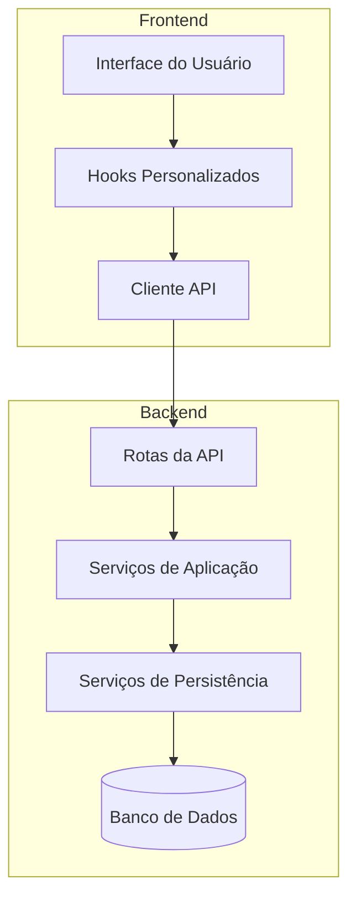
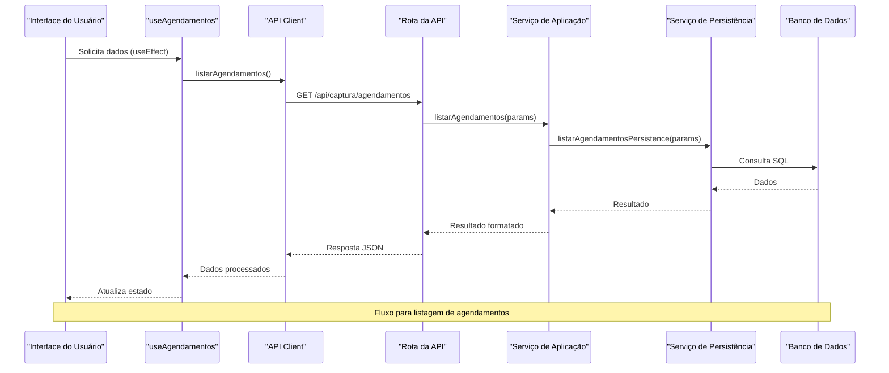
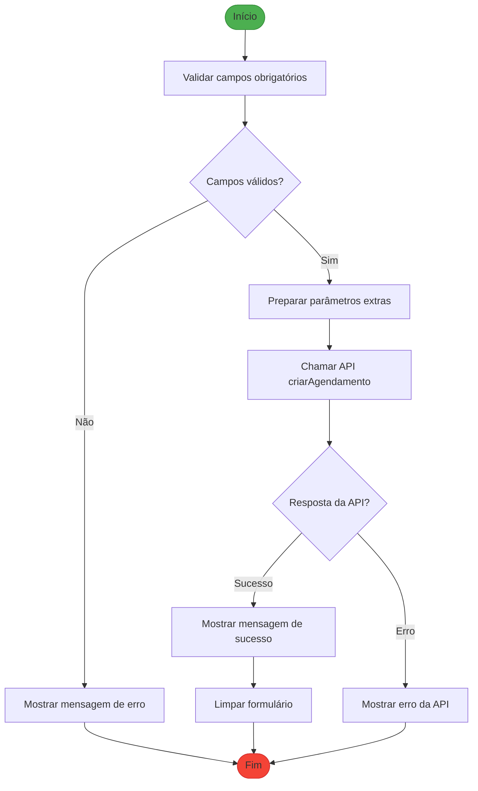
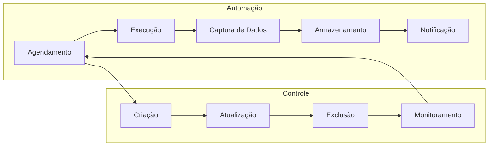

# Captura Dados Agendamentos

<cite>
**Arquivos Referenciados neste Documento**   
- [app/api/captura/agendamentos/route.ts](file://app/api/captura/agendamentos/route.ts)
- [app/api/captura/agendamentos/[id]/route.ts](file://app/api/captura/agendamentos/[id]/route.ts)
- [app/api/captura/agendamentos/[id]/executar/route.ts](file://app/api/captura/agendamentos/[id]/executar/route.ts)
- [backend/captura/services/agendamentos/criar-agendamento.service.ts](file://backend/captura/services/agendamentos/criar-agendamento.service.ts)
- [backend/captura/services/agendamentos/atualizar-agendamento.service.ts](file://backend/captura/services/agendamentos/atualizar-agendamento.service.ts)
- [backend/captura/services/agendamentos/deletar-agendamento.service.ts](file://backend/captura/services/agendamentos/deletar-agendamento.service.ts)
- [backend/captura/services/agendamentos/listar-agendamentos.service.ts](file://backend/captura/services/agendamentos/listar-agendamentos.service.ts)
- [backend/captura/services/agendamentos/buscar-agendamento.service.ts](file://backend/captura/services/agendamentos/buscar-agendamento.service.ts)
- [backend/captura/services/agendamentos/calcular-proxima-execucao.service.ts](file://backend/captura/services/agendamentos/calcular-proxima-execucao.service.ts)
- [backend/captura/services/persistence/agendamento-persistence.service.ts](file://backend/captura/services/persistence/agendamento-persistence.service.ts)
- [backend/types/captura/agendamentos-types.ts](file://backend/types/captura/agendamentos-types.ts)
- [components/captura/agendamentos/agendamento-form.tsx](file://components/captura/agendamentos/agendamento-form.tsx)
- [components/captura/agendamentos/agendamentos-list.tsx](file://components/captura/agendamentos/agendamentos-list.tsx)
- [lib/hooks/use-agendamentos.ts](file://lib/hooks/use-agendamentos.ts)
- [lib/api/agendamentos.ts](file://lib/api/agendamentos.ts)
</cite>

## Sumário
1. [Introdução](#introdução)
2. [Estrutura do Projeto](#estrutura-do-projeto)
3. [Componentes Principais](#componentes-principais)
4. [Visão Geral da Arquitetura](#visão-geral-da-arquitetura)
5. [Análise Detalhada dos Componentes](#análise-detalhada-dos-componentes)
6. [Análise de Dependências](#análise-de-dependências)
7. [Considerações de Desempenho](#considerações-de-desempenho)
8. [Guia de Solução de Problemas](#guia-de-solução-de-problemas)
9. [Conclusão](#conclusão)

## Introdução

Este documento fornece uma análise detalhada do sistema de agendamentos para captura de dados no sistema Sinesys, utilizado pelo escritório Zattar Advogados. O sistema permite o agendamento automatizado de tarefas de captura de dados de diferentes fontes do PJe (Processo Judicial Eletrônico), como acervo geral, arquivados, audiências e pendentes de manifestação. A documentação abrange a arquitetura, componentes principais, fluxos de trabalho e integrações entre os diferentes módulos do sistema.

## Estrutura do Projeto

A funcionalidade de agendamento de captura está organizada em uma estrutura modular que separa claramente as camadas de API, serviços de aplicação, persistência e interface do usuário. Os principais diretórios envolvidos são:

- `app/api/captura/agendamentos/`: Contém as rotas da API para operações CRUD de agendamentos
- `backend/captura/services/agendamentos/`: Implementa a lógica de negócio dos agendamentos
- `backend/captura/services/persistence/`: Gerencia a persistência dos dados no banco de dados
- `components/captura/agendamentos/`: Contém os componentes da interface do usuário
- `lib/hooks/`: Fornece hooks personalizados para interação com a API
- `lib/api/`: Implementa o cliente da API para operações de agendamento



**Fontes do Diagrama**
- [app/api/captura/agendamentos/route.ts](file://app/api/captura/agendamentos/route.ts)
- [backend/captura/services/agendamentos/criar-agendamento.service.ts](file://backend/captura/services/agendamentos/criar-agendamento.service.ts)
- [backend/captura/services/persistence/agendamento-persistence.service.ts](file://backend/captura/services/persistence/agendamento-persistence.service.ts)
- [lib/hooks/use-agendamentos.ts](file://lib/hooks/use-agendamentos.ts)
- [lib/api/agendamentos.ts](file://lib/api/agendamentos.ts)

**Fontes da Seção**
- [app/api/captura/agendamentos/route.ts](file://app/api/captura/agendamentos/route.ts)
- [backend/captura/services/agendamentos/](file://backend/captura/services/agendamentos/)
- [components/captura/agendamentos/](file://components/captura/agendamentos/)

## Componentes Principais

Os componentes principais do sistema de agendamento de captura são organizados em uma arquitetura em camadas que separa as responsabilidades de forma clara. A camada de API expõe endpoints REST para operações CRUD, enquanto os serviços de aplicação implementam a lógica de negócio e validação. Os serviços de persistência se comunicam diretamente com o banco de dados, e os componentes da interface do usuário fornecem uma experiência de usuário intuitiva para gerenciar os agendamentos.

A funcionalidade é centrada na entidade Agendamento, que define quando e como uma captura de dados deve ser executada. Cada agendamento possui um tipo de captura, um advogado associado, credenciais de acesso, periodicidade, horário de execução e parâmetros extras específicos para o tipo de captura.

**Fontes da Seção**
- [backend/types/captura/agendamentos-types.ts](file://backend/types/captura/agendamentos-types.ts)
- [components/captura/agendamentos/agendamento-form.tsx](file://components/captura/agendamentos/agendamento-form.tsx)
- [components/captura/agendamentos/agendamentos-list.tsx](file://components/captura/agendamentos/agendamentos-list.tsx)

## Visão Geral da Arquitetura

A arquitetura do sistema de agendamento de captura segue um padrão de camadas bem definido, com separação clara de responsabilidades entre os diferentes componentes. O fluxo de dados começa na interface do usuário, passa pelos hooks do React, pelo cliente da API, pelas rotas da API, pelos serviços de aplicação e finalmente pelos serviços de persistência até o banco de dados.



**Fontes do Diagrama**
- [lib/hooks/use-agendamentos.ts](file://lib/hooks/use-agendamentos.ts)
- [lib/api/agendamentos.ts](file://lib/api/agendamentos.ts)
- [app/api/captura/agendamentos/route.ts](file://app/api/captura/agendamentos/route.ts)
- [backend/captura/services/agendamentos/listar-agendamentos.service.ts](file://backend/captura/services/agendamentos/listar-agendamentos.service.ts)
- [backend/captura/services/persistence/agendamento-persistence.service.ts](file://backend/captura/services/persistence/agendamento-persistence.service.ts)

## Análise Detalhada dos Componentes

### Análise do Componente de Agendamento

O sistema de agendamento de captura é composto por vários componentes interconectados que trabalham juntos para fornecer uma solução completa de automação de captura de dados. A análise detalhada revela uma arquitetura bem projetada com separação clara de responsabilidades e boas práticas de desenvolvimento.

#### Componentes de Interface do Usuário
```mermaid
classDiagram
class AgendamentoForm {
+advogadoId : number | null
+credenciaisSelecionadas : number[]
+tipoCaptura : TipoCaptura | ''
+periodicidade : 'diario' | 'a_cada_N_dias' | ''
+diasIntervalo : number
+horario : string
+dataInicio : string
+dataFim : string
+filtroPrazo : 'no_prazo' | 'sem_prazo' | ''
+isLoading : boolean
+result : {success : boolean | null, error? : string}
+handleSubmit() : Promise~void~
}
class AgendamentosList {
+pagina : number
+limite : number
+agendamentos : Agendamento[]
+paginacao : Paginacao | null
+isLoading : boolean
+error : string | null
+handleToggleAtivo(agendamento : Agendamento) : Promise~void~
+handleExecutar(agendamento : Agendamento) : Promise~void~
+handleDeletar(agendamento : Agendamento) : Promise~void~
+colunas : ColumnDef~Agendamento~[]
}
AgendamentoForm --> CapturaFormBase : "usa"
AgendamentosList --> DataTable : "usa"
AgendamentosList --> useAgendamentos : "usa"
AgendamentosList --> agendamentos-api : "usa"
```

**Fontes do Diagrama**
- [components/captura/agendamentos/agendamento-form.tsx](file://components/captura/agendamentos/agendamento-form.tsx)
- [components/captura/agendamentos/agendamentos-list.tsx](file://components/captura/agendamentos/agendamentos-list.tsx)
- [lib/hooks/use-agendamentos.ts](file://lib/hooks/use-agendamentos.ts)
- [lib/api/agendamentos.ts](file://lib/api/agendamentos.ts)

#### Fluxo de Criação de Agendamento


**Fontes do Diagrama**
- [components/captura/agendamentos/agendamento-form.tsx](file://components/captura/agendamentos/agendamento-form.tsx)
- [lib/api/agendamentos.ts](file://lib/api/agendamentos.ts)
- [app/api/captura/agendamentos/route.ts](file://app/api/captura/agendamentos/route.ts)

**Fontes da Seção**
- [components/captura/agendamentos/agendamento-form.tsx](file://components/captura/agendamentos/agendamento-form.tsx)
- [components/captura/agendamentos/agendamentos-list.tsx](file://components/captura/agendamentos/agendamentos-list.tsx)
- [lib/hooks/use-agendamentos.ts](file://lib/hooks/use-agendamentos.ts)
- [lib/api/agendamentos.ts](file://lib/api/agendamentos.ts)

### Visão Conceitual
O sistema de agendamento de captura foi projetado para automatizar a coleta de dados de diferentes fontes do PJe, reduzindo o trabalho manual e garantindo que as informações estejam sempre atualizadas. A arquitetura modular permite fácil manutenção e expansão futura, com possibilidade de adicionar novos tipos de captura sem afetar os componentes existentes.



## Análise de Dependências

A análise de dependências revela uma arquitetura bem estruturada com baixo acoplamento entre os componentes. Os serviços de aplicação dependem dos serviços de persistência, mas não o contrário, seguindo o princípio de inversão de dependência. A interface do usuário depende dos hooks, que por sua vez dependem do cliente da API, criando uma cadeia de dependências clara e previsível.

```mermaid
graph TD
AgendamentoTypes --> AgendamentoPersistence
AgendamentoPersistence --> SupabaseClient
AgendamentoService --> AgendamentoPersistence
AgendamentoService --> CalcularProximaExecucao
APIRoute --> AgendamentoService
APIRoute --> Auth
APIRoute --> AgendamentoTypes
APIRoute --> AgendamentoPersistence
APIRoute --> ExecutarAgendamento
APIRoute --> BuscarAgendamento
APIRoute --> AtualizarAgendamento
APIRoute --> DeletarAgendamento
APIRoute --> ListarAgendamentos
APIRoute --> CriarAgendamento
APIRoute --> CalcularProximaExecucao
APIRoute --> AgendamentoTypes
APIRoute --> AgendamentoPersistence
APIRoute --> ExecutarAgendamento
APIRoute --> BuscarAgendamento
APIRoute --> AtualizarAgendamento
APIRoute --> DeletarAgendamento
APIRoute --> ListarAgendamentos
APIRoute --> CriarAgendamento
APIRoute --> CalcularProximaExecucao
APIRoute --> AgendamentoTypes
APIRoute --> AgendamentoPersistence
APIRoute --> ExecutarAgendamento
APIRoute --> BuscarAgendamento
APIRoute --> AtualizarAgendamento
APIRoute --> DeletarAgendamento
APIRoute --> ListarAgendamentos
APIRoute --> CriarAgendamento
APIRoute --> CalcularProximaExecucao
APIRoute --> AgendamentoTypes
APIRoute --> AgendamentoPersistence
APIRoute --> ExecutarAgendamento
APIRoute --> BuscarAgendamento
APIRoute --> AtualizarAgendamento
APIRoute --> DeletarAgendamento
APIRoute --> ListarAgendamentos
APIRoute --> CriarAgendamento
APIRoute --> CalcularProximaExecucao
APIRoute --> AgendamentoTypes
APIRoute --> AgendamentoPersistence
APIRoute --> ExecutarAgendamento
APIRoute --> BuscarAgendamento
APIRoute --> AtualizarAgendamento
APIRoute --> DeletarAgendamento
APIRoute --> ListarAgendamentos
APIRoute --> CriarAgendamento
APIRoute --> CalcularProximaExecucao
APIRoute --> AgendamentoTypes
APIRoute --> AgendamentoPersistence
APIRoute --> ExecutarAgendamento
APIRoute --> BuscarAgendamento
APIRoute --> AtualizarAgendamento
APIRoute --> DeletarAgendamento
APIRoute --> ListarAgendamentos
APIRoute --> CriarAgendamento
APIRoute --> CalcularProximaExecucao
APIRoute --> AgendamentoTypes
APIRoute --> AgendamentoPersistence
APIRoute --> ExecutarAgendamento
APIRoute --> ......
```



**Fontes do Diagrama**
- [app/api/captura/agendamentos/route.ts](file://app/api/captura/agendamentos/route.ts)
- [backend/captura/services/agendamentos/](file://backend/captura/services/agendamentos/)
- [backend/captura/services/persistence/agendamento-persistence.service.ts](file://backend/captura/services/persistence/agendamento-persistence.service.ts)
- [backend/types/captura/agendamentos-types.ts](file://backend/types/captura/agendamentos-types.ts)

**Fontes da Seção**
- [app/api/captura/agendamentos/route.ts](file://app/api/captura/agendamentos/route.ts)
- [backend/captura/services/agendamentos/](file://backend/captura/services/agendamentos/)
- [backend/captura/services/persistence/agendamento-persistence.service.ts](file://backend/captura/services/persistence/agendamento-persistence.service.ts)

## Considerações de Desempenho

O sistema de agendamento de captura foi projetado com considerações de desempenho em mente, especialmente em relação à paginação e filtragem de grandes volumes de dados. A implementação utiliza paginação no lado do servidor para evitar o carregamento de grandes conjuntos de dados na interface do usuário, melhorando significativamente a experiência do usuário.

Os endpoints da API são otimizados para retornar apenas os dados necessários, utilizando seleção específica de campos e contagem exata para paginação. A utilização de índices no banco de dados para campos frequentemente usados em filtros (como `advogado_id`, `tipo_captura` e `proxima_execucao`) garante tempos de resposta rápidos mesmo com grandes volumes de dados.

A arquitetura em camadas permite a implementação de cache em diferentes níveis, embora não seja explicitamente documentada nos arquivos analisados. A separação clara entre serviços de aplicação e persistência facilita a adição de camadas de cache no futuro, se necessário.

## Guia de Solução de Problemas

Este guia fornece orientações para solução de problemas comuns no sistema de agendamento de captura. Os erros mais frequentes estão relacionados à validação de dados, autenticação e problemas de conexão com o banco de dados.

**Problemas Comuns e Soluções:**

1. **Erro 400 - Dados inválidos**: Verifique se todos os campos obrigatórios foram preenchidos corretamente, especialmente o `dias_intervalo` quando a periodicidade é definida como "a_cada_N_dias".

2. **Erro 401 - Não autenticado**: Certifique-se de que o usuário está autenticado e que o token de acesso é válido. Verifique também as permissões do usuário para operações de agendamento.

3. **Erro 500 - Erro interno do servidor**: Consulte os logs do servidor para obter detalhes do erro. Problemas comuns incluem falhas de conexão com o banco de dados ou erros na execução de consultas SQL.

4. **Agendamento não executa automaticamente**: Verifique se o serviço de agendamento está em execução e se a configuração de cron está correta. Confirme também que o campo `ativo` do agendamento está definido como `true`.

**Fontes da Seção**
- [app/api/captura/agendamentos/route.ts](file://app/api/captura/agendamentos/route.ts)
- [app/api/captura/agendamentos/[id]/route.ts](file://app/api/captura/agendamentos/[id]/route.ts)
- [app/api/captura/agendamentos/[id]/executar/route.ts](file://app/api/captura/agendamentos/[id]/executar/route.ts)

## Conclusão

O sistema de agendamento de captura do Sinesys é uma solução bem projetada e implementada para automatizar a coleta de dados do PJe. A arquitetura em camadas com separação clara de responsabilidades facilita a manutenção e expansão do sistema. A implementação segue boas práticas de desenvolvimento, com validação adequada de dados, tratamento de erros robusto e segurança na autenticação.

A solução permite que os advogados configurem agendamentos personalizados para diferentes tipos de captura, com flexibilidade na periodicidade e horários de execução. A integração com a interface do usuário é fluida, proporcionando uma experiência de usuário intuitiva para gerenciar os agendamentos.

Recomenda-se a documentação contínua do sistema, especialmente à medida que novos tipos de captura forem adicionados, para garantir que a base de conhecimento permaneça atualizada e acessível para todos os desenvolvedores e usuários do sistema.