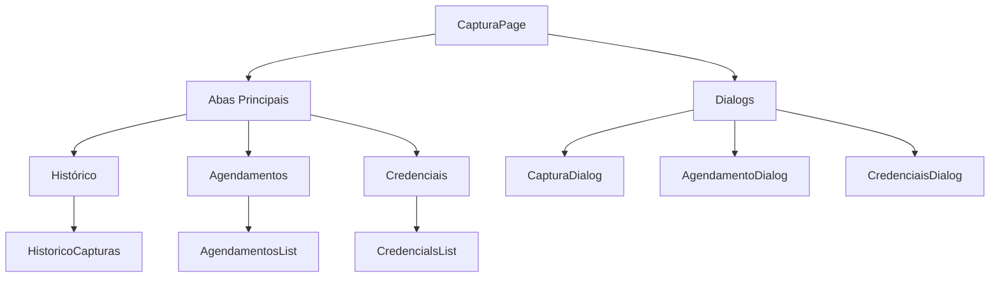
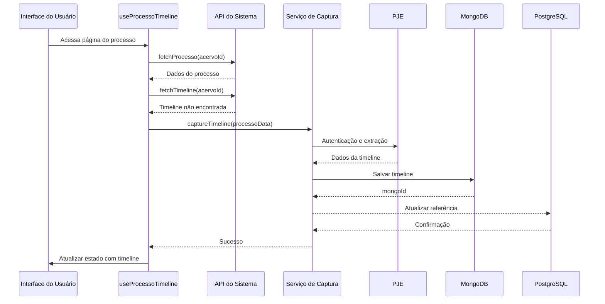
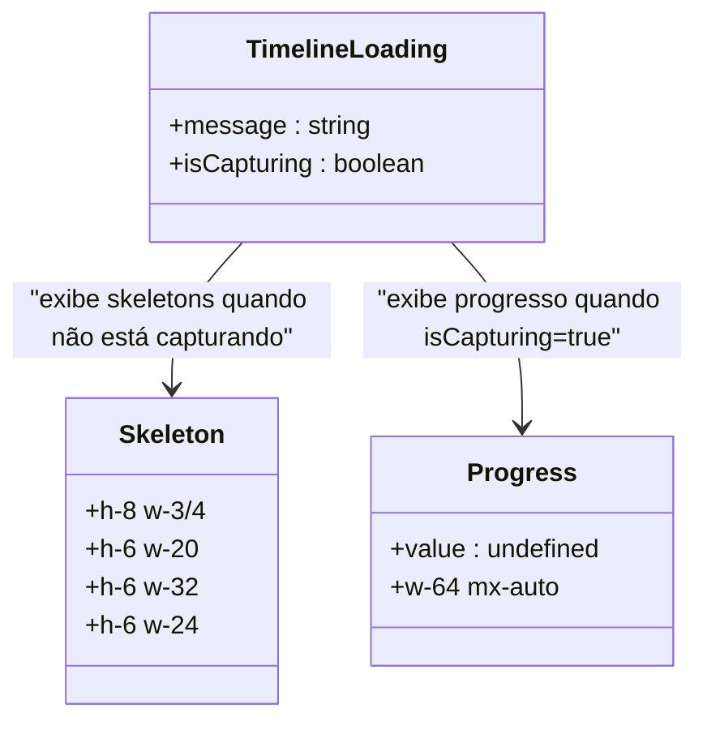
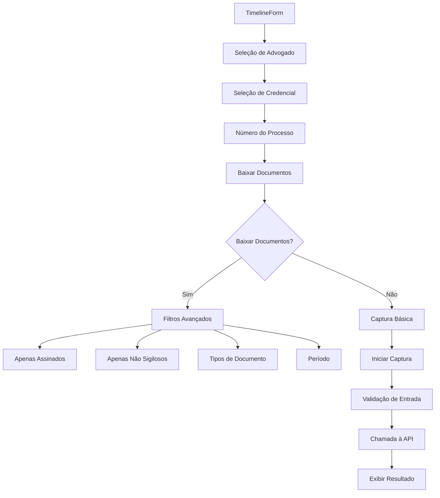
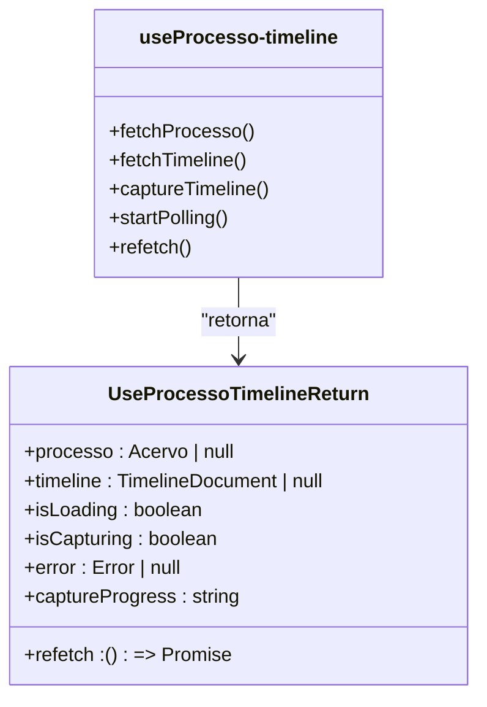
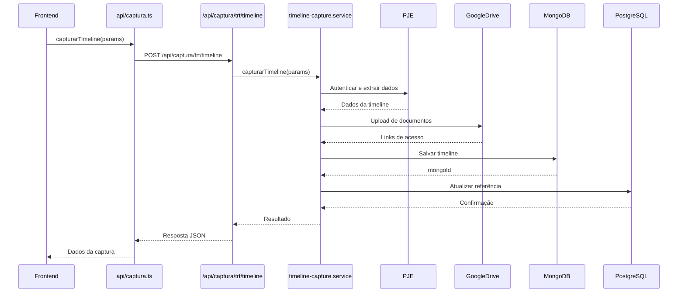

# Captura Timeline Ui

<cite>
**Arquivos Referenciados neste Documento**  
- [timeline-form.tsx](file://app/(dashboard)/captura/components/timeline-form.tsx)
- [use-processo-timeline.ts](file://app/_lib/hooks/use-processo-timeline.ts)
- [processo-visualizacao.tsx](file://app/(dashboard)/processos/[id]/processo-visualizacao.tsx)
- [timeline-loading.tsx](file://components/processos/timeline-loading.tsx)
- [captura.ts](file://app/_lib/api/captura.ts)
- [timeline-capture.service.ts](file://backend/captura/services/timeline/timeline-capture.service.ts)
- [timeline-persistence.service.ts](file://backend/captura/services/timeline/timeline-persistence.service.ts)
- [captura-dialog.tsx](file://app/(dashboard)/captura/components/captura-dialog.tsx)
- [responsive-dialog.tsx](file://components/ui/responsive-dialog.tsx)
</cite>

## Sumário
1. [Introdução](#introdução)
2. [Estrutura da Interface de Captura](#estrutura-da-interface-de-captura)
3. [Fluxo de Captura Automática](#fluxo-de-captura-automática)
4. [Componentes de Estado de Carregamento](#componentes-de-estado-de-carregamento)
5. [Formulário de Captura de Timeline](#formulário-de-captura-de-timeline)
6. [Gerenciamento de Estado com Hooks](#gerenciamento-de-estado-com-hooks)
7. [Integração entre Frontend e Backend](#integração-entre-frontend-e-backend)
8. [Fluxo Completo de Dados](#fluxo-completo-de-dados)
9. [Considerações de Usabilidade](#considerações-de-usabilidade)

## Introdução
Este documento detalha a implementação da interface de usuário para captura de timeline de processos judiciais no sistema Sinesys. A funcionalidade permite aos usuários extrair e visualizar a cronologia completa de processos do PJE-TRT, incluindo movimentos e documentos, com opções avançadas de filtragem e download. O sistema integra frontend React com backend Node.js, utilizando MongoDB para armazenamento de dados complexos e Google Drive para armazenamento de documentos.

## Estrutura da Interface de Captura
A interface de captura é organizada em abas principais que permitem ao usuário acessar diferentes funcionalidades relacionadas à captura de dados do PJE-TRT. A estrutura principal é implementada no componente `CapturaPage`, que coordena a exibição de histórico de capturas, agendamentos e credenciais.

**Fontes do Diagrama**
- [page.tsx](file://app/(dashboard)/captura/page.tsx#L15-L116)

**Fontes da Seção**
- [page.tsx](file://app/(dashboard)/captura/page.tsx#L1-L116)

## Fluxo de Captura Automática
O sistema implementa um fluxo de captura automática que é acionado quando um usuário acessa a visualização de um processo que ainda não possui timeline capturada. Este fluxo é gerenciado pelo hook `useProcessoTimeline`, que coordena a busca de dados do processo, verificação da existência da timeline e, se necessário, inicia automaticamente o processo de captura.

**Fontes do Diagrama**
- [use-processo-timeline.ts](file://app/_lib/hooks/use-processo-timeline.ts#L34-L314)
- [processo-visualizacao.tsx](file://app/(dashboard)/processos/[id]/processo-visualizacao.tsx#L27-L145)

**Fontes da Seção**
- [use-processo-timeline.ts](file://app/_lib/hooks/use-processo-timeline.ts#L34-L314)

## Componentes de Estado de Carregamento
O sistema utiliza componentes especializados para representar diferentes estados durante o carregamento e captura de timelines. O componente `TimelineLoading` exibe um feedback visual contextualizado com base no estado atual, fornecendo informações claras ao usuário sobre o progresso da operação.

**Fontes do Diagrama**
- [timeline-loading.tsx](file://components/processos/timeline-loading.tsx#L19-L91)

**Fontes da Seção**
- [timeline-loading.tsx](file://components/processos/timeline-loading.tsx#L1-L91)

## Formulário de Captura de Timeline
O formulário de captura de timeline permite aos usuários iniciar manualmente a captura de dados de um processo específico. O componente `TimelineForm` fornece opções avançadas de filtragem, incluindo seleção de documentos por tipo, data e status de assinatura, além de controle sobre o download de documentos PDF.

**Fontes do Diagrama**
- [timeline-form.tsx](file://app/(dashboard)/captura/components/timeline-form.tsx#L27-L324)

**Fontes da Seção**
- [timeline-form.tsx](file://app/(dashboard)/captura/components/timeline-form.tsx#L1-L325)

## Gerenciamento de Estado com Hooks
O sistema utiliza hooks personalizados para gerenciar o estado complexo associado à visualização e captura de timelines. O hook `useProcessoTimeline` encapsula toda a lógica de busca, captura e polling, fornecendo uma interface simples para os componentes da interface do usuário.

**Fontes do Diagrama**
- [use-processo-timeline.ts](file://app/_lib/hooks/use-processo-timeline.ts#L17-L25)

**Fontes da Seção**
- [use-processo-timeline.ts](file://app/_lib/hooks/use-processo-timeline.ts#L1-L316)

## Integração entre Frontend e Backend
A integração entre frontend e backend é realizada através de uma API REST bem definida. O cliente frontend utiliza funções do módulo `captura.ts` para comunicar-se com os endpoints do backend, que por sua vez coordenam a execução dos serviços de captura e persistência.

**Fontes do Diagrama**
- [captura.ts](file://app/_lib/api/captura.ts#L332-L360)
- [timeline-capture.service.ts](file://backend/captura/services/timeline/timeline-capture.service.ts#L120-L340)

**Fontes da Seção**
- [captura.ts](file://app/_lib/api/captura.ts#L1-L447)
- [timeline-capture.service.ts](file://backend/captura/services/timeline/timeline-capture.service.ts#L1-L341)

## Fluxo Completo de Dados
O fluxo completo de dados ilustra a jornada desde a interação do usuário até a persistência dos dados capturados. Este fluxo envolve múltiplos sistemas e armazenamentos, garantindo que os dados sejam processados de forma eficiente e segura.

```mermaid
flowchart LR
A[Usuário] --> B[Interface de Captura]
B --> C[Formulário de Timeline]
C --> D[API de Captura]
D --> E[Autenticação PJE]
E --> F[Extração de Dados]
F --> G[Filtragem de Documentos]
G --> H[Download de PDFs]
H --> I[Upload para Google Drive]
I --> J[Enriquecimento da Timeline]
J --> K[Persistência no MongoDB]
K --> L[Atualização no PostgreSQL]
L --> M[Armazenamento do mongoId]
M --> N[Consulta de Timeline]
N --> O[Interface do Usuário]
```

**Fontes da Seção**
- [timeline-form.tsx](file://app/(dashboard)/captura/components/timeline-form.tsx#L72-L172)
- [timeline-capture.service.ts](file://backend/captura/services/timeline/timeline-capture.service.ts#L120-L340)
- [timeline-persistence.service.ts](file://backend/captura/services/timeline/timeline-persistence.service.ts#L38-L113)

## Considerações de Usabilidade
O sistema implementa várias práticas para garantir uma experiência de usuário positiva:

- **Feedback contextualizado**: Mensagens de progresso são atualizadas dinamicamente com base no tempo decorrido, fornecendo informações relevantes sobre o estágio atual da captura.
- **Operação em segundo plano**: Os usuários podem navegar para outras páginas enquanto a captura continua em segundo plano, sem interrupção.
- **Validação de entrada**: O formulário valida os dados inseridos em tempo real, prevenindo erros comuns como números de processo inválidos.
- **Filtros avançados**: Os usuários podem restringir a captura a documentos específicos com base em critérios como tipo, data e status de assinatura.
- **Recuperação de erros**: Em caso de falha, o sistema fornece mensagens de erro claras e opções para tentar novamente.

Essas práticas garantem que a interface seja intuitiva, eficiente e capaz de lidar com diferentes cenários de uso de forma robusta.

**Fontes da Seção**
- [timeline-form.tsx](file://app/(dashboard)/captura/components/timeline-form.tsx#L64-L172)
- [use-processo-timeline.ts](file://app/_lib/hooks/use-processo-timeline.ts#L49-L63)
- [timeline-loading.tsx](file://components/processos/timeline-loading.tsx#L54-L61)