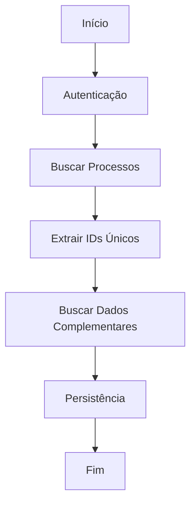
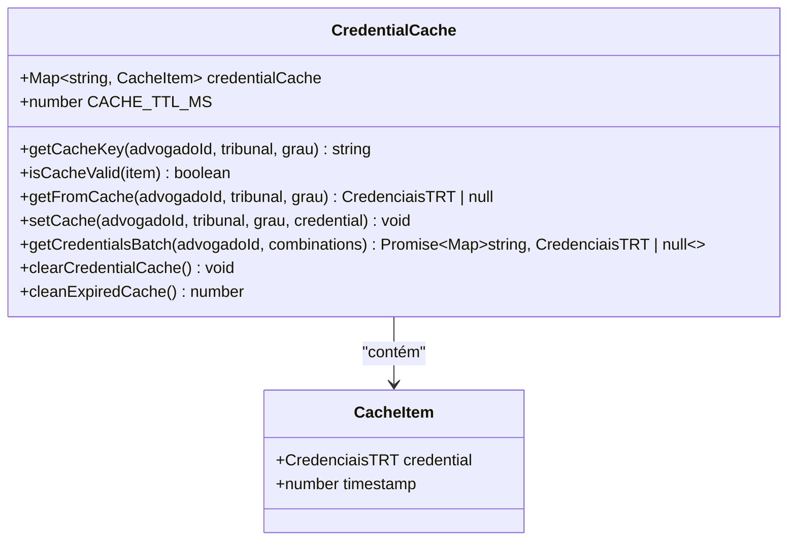
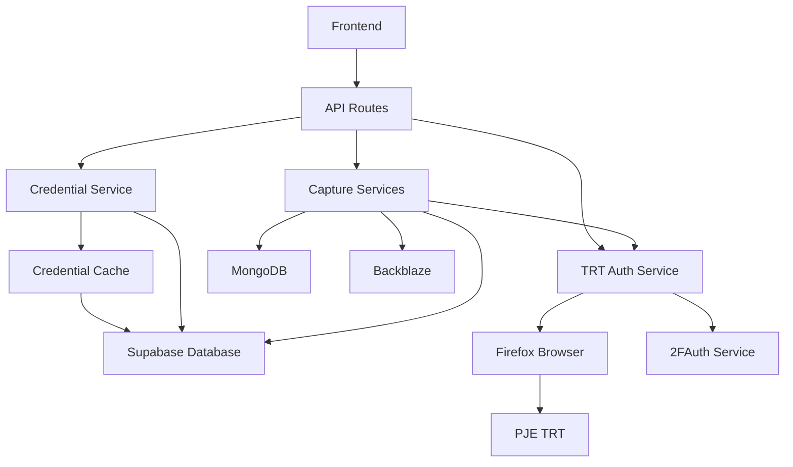

# Captura de Credenciais

<cite>
**Arquivos Referenciados neste Documento**   
- [credential.service.ts](file://backend/captura/credentials/credential.service.ts)
- [credential-cache.service.ts](file://backend/captura/credentials/credential-cache.service.ts)
- [trt-auth.service.ts](file://backend/captura/services/trt/trt-auth.service.ts)
- [acervo-geral.service.ts](file://backend/captura/services/trt/acervo-geral.service.ts)
- [audiencias.service.ts](file://backend/captura/services/trt/audiencias.service.ts)
- [pendentes-manifestacao.service.ts](file://backend/captura/services/trt/pendentes-manifestacao.service.ts)
</cite>

## Sumário
1. [Introdução](#introdução)
2. [Estrutura de Credenciais](#estrutura-de-credenciais)
3. [Fluxo de Autenticação](#fluxo-de-autenticação)
4. [Serviços de Captura](#serviços-de-captura)
5. [Cache de Credenciais](#cache-de-credenciais)
6. [Análise de Componentes](#análise-de-componentes)
7. [Diagrama de Arquitetura](#diagrama-de-arquitetura)
8. [Considerações de Segurança](#considerações-de-segurança)
9. [Conclusão](#conclusão)

## Introdução

O sistema Sinesys implementa um mecanismo robusto para captura automatizada de dados processuais dos tribunais TRT (Tribunal Regional do Trabalho) através da integração com o PJE (Processo Judicial Eletrônico). Este documento detalha a arquitetura e funcionamento do sistema de captura de credenciais, responsável por autenticar e extrair dados sensíveis dos tribunais, garantindo segurança, eficiência e escalabilidade.

A captura de credenciais é um componente crítico do sistema, pois permite o acesso automatizado a informações processuais, audiências e pendências de manifestação, essenciais para a gestão jurídica. O sistema foi projetado com princípios de Domain-Driven Design (DDD), separação de responsabilidades e otimização de desempenho.

## Estrutura de Credenciais

As credenciais de acesso aos tribunais são gerenciadas no sistema através da entidade `credenciais`, armazenada no banco de dados Supabase. Cada credencial contém:

- **ID da credencial**: Identificador único no sistema
- **ID do advogado**: Relacionamento com a tabela `advogados`
- **CPF**: CPF do advogado associado
- **Senha**: Senha de acesso ao PJE (armazenada de forma segura)
- **Tribunal**: Código do TRT (ex: TRT1, TRT2, ..., TRT24)
- **Grau**: Primeiro ou segundo grau processual
- **Status ativo**: Indica se a credencial está habilitada para uso

Essas credenciais são utilizadas pelos serviços de captura para autenticar no PJE e extrair dados processuais, sendo um componente fundamental para a funcionalidade de integração com os tribunais.

**Section sources**
- [credential.service.ts](file://backend/captura/credentials/credential.service.ts#L4-92)

## Fluxo de Autenticação

O processo de autenticação no PJE segue um fluxo rigoroso e seguro, implementado no serviço `trt-auth.service.ts`. O fluxo completo envolve:

1. **Inicialização do navegador**: Utiliza Playwright para controlar uma instância do Firefox, local ou remota
2. **Navegação para página de login**: Acesso à página de login do PJE com configurações anti-detecção
3. **Login SSO gov.br**: Submissão das credenciais (CPF e senha) do advogado
4. **Autenticação de dois fatores (2FA)**: Processamento do OTP (One-Time Password) via serviço 2FAuth
5. **Extração de tokens**: Captura do JWT (access_token) e cookies de sessão
6. **Validação da sessão**: Confirmação do redirecionamento para o domínio do tribunal

O sistema implementa técnicas anti-detecção para evitar bloqueios por parte do PJE, incluindo a remoção de flags de automação e simulação de comportamento humano.

**Section sources**
- [trt-auth.service.ts](file://backend/captura/services/trt/trt-auth.service.ts#L1-603)

## Serviços de Captura

O sistema implementa múltiplos serviços de captura especializados, cada um responsável por extrair um tipo específico de dado do PJE:

### Captura de Acervo Geral

O serviço `acervo-geral.service.ts` realiza a captura de todos os processos do acervo geral do advogado. O fluxo inclui:

- Autenticação no PJE
- Busca de todos os processos do acervo geral
- Extração de IDs únicos de processos
- Captura de dados complementares (timeline e partes)
- Persistência dos dados no banco de dados

**Diagram sources**
- [acervo-geral.service.ts](file://backend/captura/services/trt/acervo-geral.service.ts#L1-354)

### Captura de Audiências

O serviço `audiencias.service.ts` captura as audiências agendadas para o advogado. Além dos dados básicos da audiência, o serviço também pode:

- Baixar atas de audiências realizadas
- Extrair dados complementares dos processos relacionados
- Persistir informações de partes e timeline

### Captura de Pendentes de Manifestação

O serviço `pendentes-manifestacao.service.ts` foca na captura de processos com pendências de manifestação, permitindo filtragem por prazo (no prazo ou sem prazo). O serviço também pode opcionalmente baixar documentos PDF dos expedientes.

**Section sources**
- [acervo-geral.service.ts](file://backend/captura/services/trt/acervo-geral.service.ts#L1-354)
- [audiencias.service.ts](file://backend/captura/services/trt/audiencias.service.ts#L1-481)
- [pendentes-manifestacao.service.ts](file://backend/captura/services/trt/pendentes-manifestacao.service.ts#L1-456)

## Cache de Credenciais

Para otimizar o desempenho e reduzir o número de consultas ao banco de dados, o sistema implementa um cache de credenciais em memória. O serviço `credential-cache.service.ts` fornece as seguintes funcionalidades:

- **Armazenamento em memória**: Utiliza um Map para armazenar credenciais temporariamente
- **TTL (Time To Live)**: Credenciais expiram após 5 minutos
- **Chave composta**: A chave do cache combina ID do advogado, tribunal e grau
- **Batch processing**: Permite buscar múltiplas credenciais em uma única consulta ao banco

O cache é especialmente útil quando o sistema precisa processar múltiplos tribunais e graus para o mesmo advogado, evitando consultas repetidas ao banco de dados.

**Diagram sources**
- [credential-cache.service.ts](file://backend/captura/credentials/credential-cache.service.ts#L1-447)

## Análise de Componentes

### Serviço de Credenciais

O serviço `credential.service.ts` é responsável por buscar credenciais do banco de dados Supabase. Ele implementa múltiplos métodos para diferentes cenários de uso:

- `getCredential()`: Busca uma credencial específica por ID
- `getCredentialByTribunalAndGrau()`: Busca credencial por advogado, tribunal e grau (com cache)
- `getActiveCredentialsByTribunalAndGrau()`: Busca todas as credenciais ativas para um tribunal e grau específicos
- `getCredentialComplete()`: Retorna credencial com informações completas (incluindo tribunal e grau)

O serviço utiliza o cliente de serviço do Supabase para acessar o banco de dados, contornando as políticas de segurança (RLS) através da chave secreta.

**Section sources**
- [credential.service.ts](file://backend/captura/credentials/credential.service.ts#L1-401)

### Estratégia de Cache

A estratégia de cache implementada no sistema é crucial para o desempenho, especialmente em operações que envolvem múltiplos tribunais. Quando um serviço de captura precisa processar todos os 24 TRTs em ambos os graus (48 combinações), o cache evita 48 consultas ao banco de dados, reduzindo significativamente o tempo de processamento.

O método `getCredentialsBatch()` é especialmente otimizado, realizando uma única consulta ao banco para buscar todas as credenciais necessárias, em vez de múltiplas consultas individuais.

**Section sources**
- [credential-cache.service.ts](file://backend/captura/credentials/credential-cache.service.ts#L1-447)

## Diagrama de Arquitetura

**Diagram sources**
- [credential.service.ts](file://backend/captura/credentials/credential.service.ts#L1-401)
- [credential-cache.service.ts](file://backend/captura/credentials/credential-cache.service.ts#L1-447)
- [trt-auth.service.ts](file://backend/captura/services/trt/trt-auth.service.ts#L1-603)

## Considerações de Segurança

O sistema implementa múltiplas camadas de segurança para proteger as credenciais de acesso:

- **Armazenamento seguro**: Senhas são armazenadas no banco de dados com criptografia adequada
- **Isolamento de credenciais**: O sistema valida permissões para garantir que apenas usuários autorizados acessem credenciais específicas
- **Cache temporário**: Credenciais em cache expiram após 5 minutos
- **Autenticação de dois fatores**: Integração com 2FAuth para autenticação segura no PJE
- **Anti-detecção**: Técnicas para evitar detecção de automação pelo PJE

Essas medidas garantem que as credenciais sensíveis sejam protegidas contra acessos não autorizados e vazamentos.

**Section sources**
- [credential.service.ts](file://backend/captura/credentials/credential.service.ts#L1-401)
- [trt-auth.service.ts](file://backend/captura/services/trt/trt-auth.service.ts#L1-603)

## Conclusão

O sistema de captura de credenciais do Sinesys é uma implementação sofisticada e segura que permite a integração automatizada com os tribunais TRT. A arquitetura baseada em DDD, a separação clara de responsabilidades e a otimização de desempenho através do cache tornam o sistema robusto e escalável.

A implementação considera aspectos críticos como segurança, confiabilidade e manutenibilidade, garantindo que o acesso aos dados processuais seja realizado de forma segura e eficiente. O uso de tecnologias modernas como Playwright, Supabase e MongoDB permite uma integração fluida com os sistemas externos, enquanto a arquitetura modular facilita a manutenção e evolução do sistema.