# Captura de Tribunais

<cite>
**Arquivos Referenciados neste Documento**   
- [README.md](file://README.md)
- [app/api/captura/trt/acervo-geral/route.ts](file://app/api/captura/trt/acervo-geral/route.ts)
- [app/api/captura/trt/pendentes-manifestacao/route.ts](file://app/api/captura/trt/pendentes-manifestacao/route.ts)
- [app/api/captura/trt/arquivados/route.ts](file://app/api/captura/trt/arquivados/route.ts)
- [app/api/captura/trt/audiencias/route.ts](file://app/api/captura/trt/audiencias/route.ts)
- [backend/captura/services/trt/acervo-geral.service.ts](file://backend/captura/services/trt/acervo-geral.service.ts)
- [backend/captura/services/trt/pendentes-manifestacao.service.ts](file://backend/captura/services/trt/pendentes-manifestacao.service.ts)
- [backend/captura/services/trt/arquivados.service.ts](file://backend/captura/services/trt/arquivados.service.ts)
- [backend/captura/services/trt/audiencias.service.ts](file://backend/captura/services/trt/audiencias.service.ts)
- [backend/captura/services/trt/trt-auth.service.ts](file://backend/captura/services/trt/trt-auth.service.ts)
- [backend/types/captura/trt-types.ts](file://backend/types/captura/trt-types.ts)
- [backend/captura/services/trt/trt-capture.service.ts](file://backend/captura/services/trt/trt-capture.service.ts)
</cite>

## Sumário
1. [Introdução](#introdução)
2. [Estrutura de Diretórios](#estrutura-de-diretórios)
3. [Fluxo de Captura](#fluxo-de-captura)
4. [Rotas de API](#rotas-de-api)
5. [Serviços de Captura](#serviços-de-captura)
6. [Autenticação no PJE](#autenticação-no-pje)
7. [Tipos e Parâmetros](#tipos-e-parâmetros)
8. [Persistência de Dados](#persistência-de-dados)
9. [Logs e Monitoramento](#logs-e-monitoramento)
10. [Considerações de Segurança](#considerações-de-segurança)

## Introdução

O sistema **Captura de Tribunais** é um módulo do sistema jurídico Sinesys responsável pela automação da coleta de dados processuais dos Tribunais Regionais do Trabalho (TRTs) através da integração com o Processo Judicial Eletrônico (PJE). Este documento detalha a arquitetura, funcionamento e componentes principais do sistema de captura, com foco nas rotas de API, serviços de negócio, autenticação e persistência de dados.

A funcionalidade principal permite a captura de quatro tipos distintos de dados: acervo geral, processos arquivados, audiências e pendências de manifestação. Cada tipo segue um fluxo otimizado que aproveita a sessão autenticada no PJE para maximizar eficiência e minimizar tempo de execução.

**Section sources**
- [README.md](file://README.md#L28-L43)

## Estrutura de Diretórios

A estrutura de diretórios do módulo de captura está organizada de forma modular e seguindo princípios de Domain-Driven Design (DDD). Os principais diretórios são:

- `app/api/captura/trt/`: Rotas da API Next.js para os diferentes tipos de captura
- `backend/captura/services/trt/`: Serviços de negócio para cada tipo de captura
- `backend/captura/services/persistence/`: Camada de persistência para armazenamento de dados
- `backend/captura/services/trt/`: Serviços específicos para integração com TRT
- `backend/types/captura/`: Tipos TypeScript compartilhados para o módulo de captura
- `backend/api/pje-trt/`: Clientes de API para comunicação com o PJE/TRT

Esta organização promove separação de responsabilidades, facilitando manutenção e testes independentes de cada camada.

**Section sources**
- [README.md](file://README.md#L687-L776)

## Fluxo de Captura

O fluxo de captura segue um padrão consistente em todas as operações, dividido em seis fases principais:

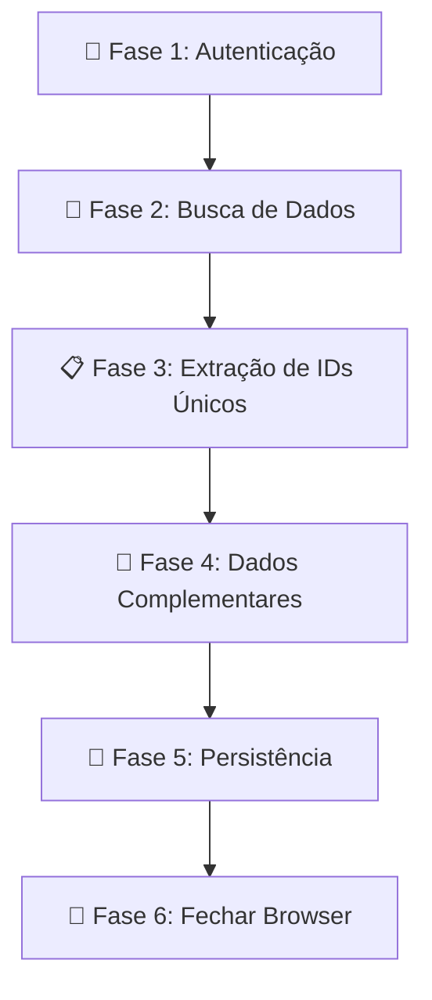

**Diagram sources**
- [backend/captura/services/trt/acervo-geral.service.ts](file://backend/captura/services/trt/acervo-geral.service.ts#L6-L45)
- [backend/captura/services/trt/pendentes-manifestacao.service.ts](file://backend/captura/services/trt/pendentes-manifestacao.service.ts#L6-L45)
- [backend/captura/services/trt/arquivados.service.ts](file://backend/captura/services/trt/arquivados.service.ts#L6-L45)
- [backend/captura/services/trt/audiencias.service.ts](file://backend/captura/services/trt/audiencias.service.ts#L6-L45)

### Fase 1: Autenticação
A autenticação é realizada através do serviço `autenticarPJE`, que executa o login SSO PDPJ, processa o OTP via 2FAuth e captura os tokens JWT e cookies necessários para acessar o PJE.

### Fase 2: Busca de Dados
Os dados principais são obtidos através de chamadas à API do PJE, como `/paineladvogado/{id}/processos` para acervo geral ou `/pauta-usuarios-externos` para audiências.

### Fase 3: Extração de IDs Únicos
Os IDs dos processos são extraídos e deduplicados para evitar processamento redundante de dados.

### Fase 4: Dados Complementares
Para cada processo único, são buscados dados complementares como timeline e partes, com verificação de recaptura para otimização.

### Fase 5: Persistência
Os dados são persistidos em ordem específica para garantir integridade referencial: primeiro processos no acervo, depois timeline no MongoDB, seguido por partes e finalmente os dados específicos da captura.

### Fase 6: Fechar Browser
O browser é fechado para liberar recursos após a conclusão da captura.

**Section sources**
- [backend/captura/services/trt/acervo-geral.service.ts](file://backend/captura/services/trt/acervo-geral.service.ts#L1-L45)
- [backend/captura/services/trt/pendentes-manifestacao.service.ts](file://backend/captura/services/trt/pendentes-manifestacao.service.ts#L1-L45)
- [backend/captura/services/trt/arquivados.service.ts](file://backend/captura/services/trt/arquivados.service.ts#L1-L45)
- [backend/captura/services/trt/audiencias.service.ts](file://backend/captura/services/trt/audiencias.service.ts#L1-L45)

## Rotas de API

As rotas de API para captura de tribunais estão localizadas em `app/api/captura/trt/` e seguem o padrão REST com autenticação obrigatória. Todas as rotas são assíncronas e retornam uma resposta imediata enquanto o processamento ocorre em background.

### Captura de Acervo Geral

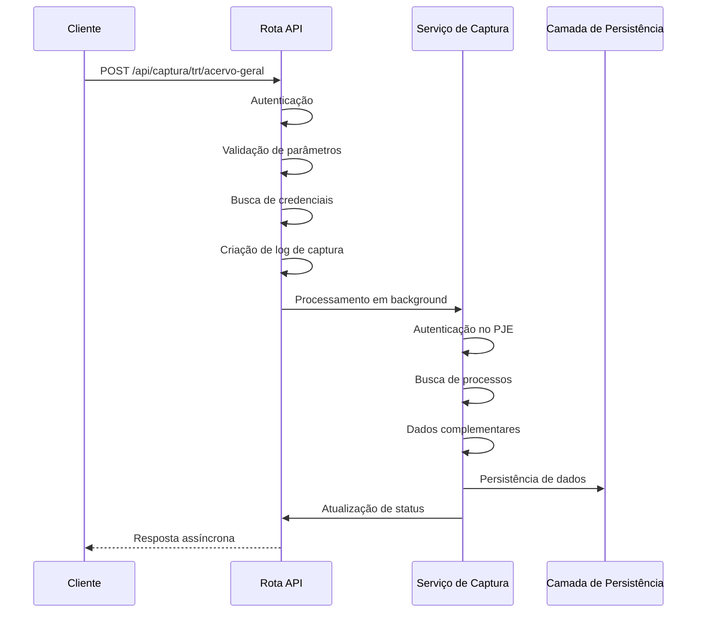

**Diagram sources**
- [app/api/captura/trt/acervo-geral/route.ts](file://app/api/captura/trt/acervo-geral/route.ts#L125-L366)

### Captura de Pendentes de Manifestação

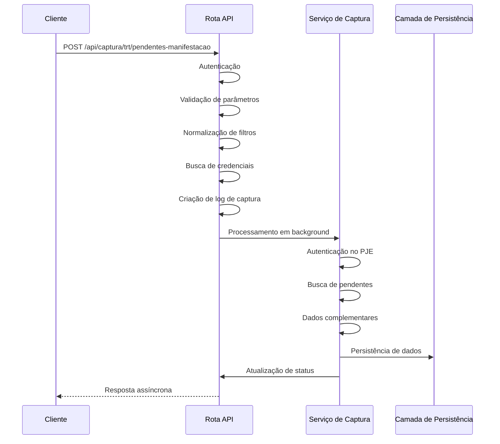

**Diagram sources**
- [app/api/captura/trt/pendentes-manifestacao/route.ts](file://app/api/captura/trt/pendentes-manifestacao/route.ts#L180-L467)

### Captura de Processos Arquivados

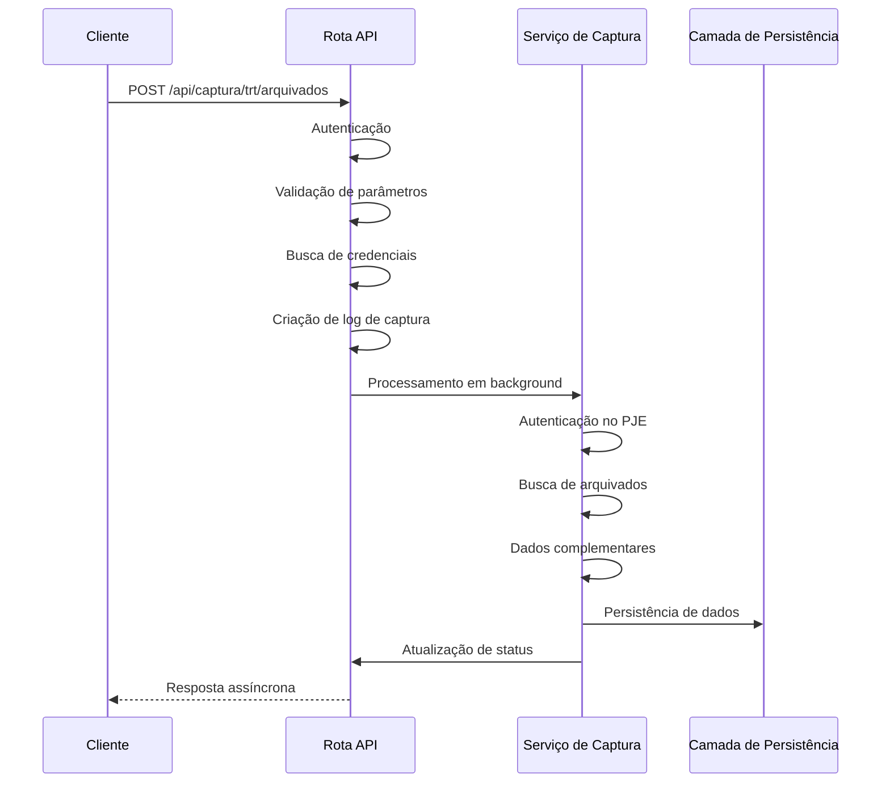

**Diagram sources**
- [app/api/captura/trt/arquivados/route.ts](file://app/api/captura/trt/arquivados/route.ts#L131-L368)

### Captura de Audiências

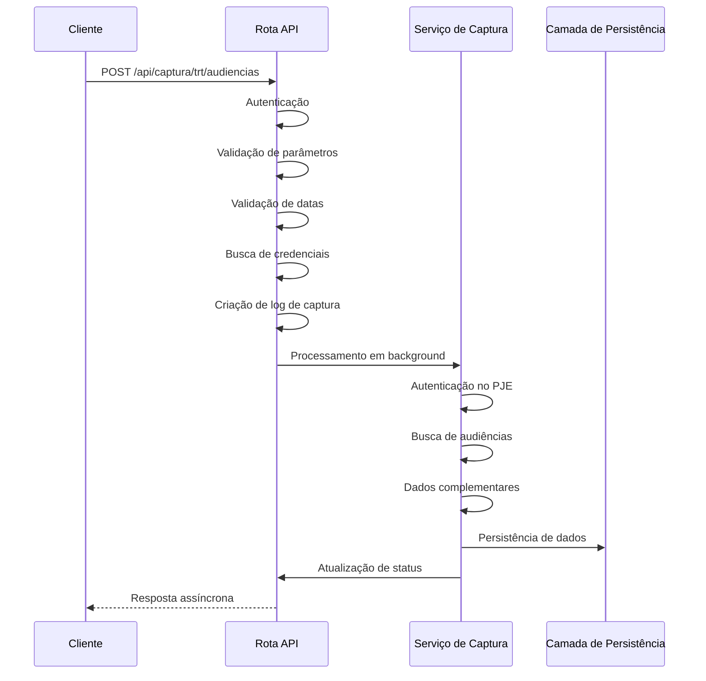

**Diagram sources**
- [app/api/captura/trt/audiencias/route.ts](file://app/api/captura/trt/audiencias/route.ts#L168-L425)

**Section sources**
- [app/api/captura/trt/acervo-geral/route.ts](file://app/api/captura/trt/acervo-geral/route.ts#L1-L366)
- [app/api/captura/trt/pendentes-manifestacao/route.ts](file://app/api/captura/trt/pendentes-manifestacao/route.ts#L1-L467)
- [app/api/captura/trt/arquivados/route.ts](file://app/api/captura/trt/arquivados/route.ts#L1-L368)
- [app/api/captura/trt/audiencias/route.ts](file://app/api/captura/trt/audiencias/route.ts#L1-L425)

## Serviços de Captura

Os serviços de captura implementam a lógica de negócio para cada tipo de operação. Todos seguem o mesmo padrão de fluxo em seis fases, mas com variações específicas para cada tipo de dado.

### Serviço de Acervo Geral

O serviço `acervoGeralCapture` é responsável por capturar todos os processos do acervo geral do advogado. Ele valida a quantidade de processos contra o totalizador do PJE para garantir integridade dos dados.

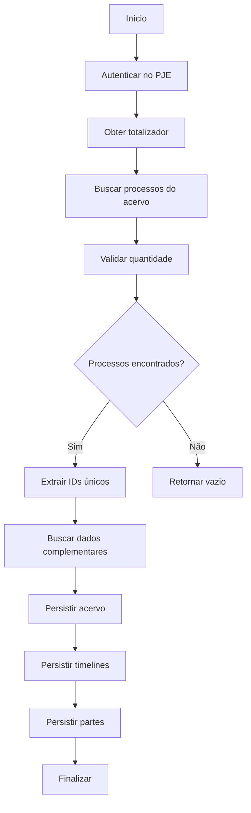

**Diagram sources**
- [backend/captura/services/trt/acervo-geral.service.ts](file://backend/captura/services/trt/acervo-geral.service.ts#L107-L354)

### Serviço de Pendentes de Manifestação

O serviço `pendentesManifestacaoCapture` captura processos pendentes de manifestação, com suporte a filtros de prazo (no prazo ou sem prazo). Ele também pode opcionalmente baixar documentos PDF dos pendentes.

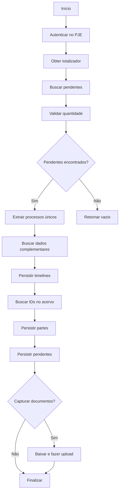

**Diagram sources**
- [backend/captura/services/trt/pendentes-manifestacao.service.ts](file://backend/captura/services/trt/pendentes-manifestacao.service.ts#L125-L456)

### Serviço de Processos Arquivados

O serviço `arquivadosCapture` captura processos arquivados, utilizando parâmetros específicos na API do PJE para filtrar apenas processos arquivados.

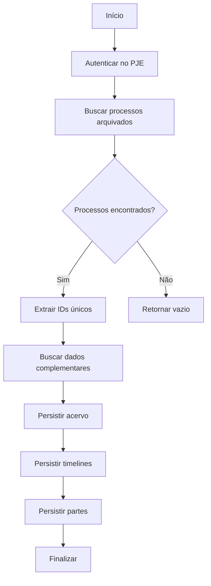

**Diagram sources**
- [backend/captura/services/trt/arquivados.service.ts](file://backend/captura/services/trt/arquivados.service.ts#L104-L351)

### Serviço de Audiências

O serviço `audienciasCapture` captura audiências marcadas para o advogado, com suporte a filtros de data e status. Para audiências realizadas, ele também pode buscar e armazenar atas.

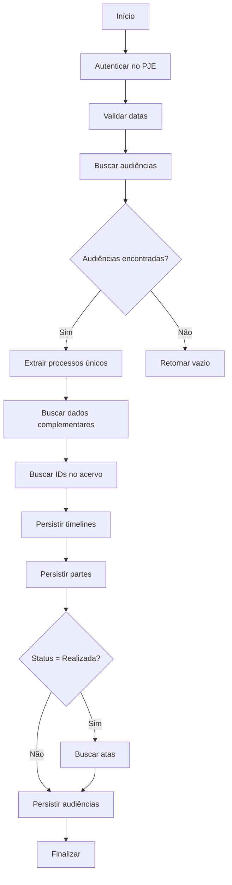

**Diagram sources**
- [backend/captura/services/trt/audiencias.service.ts](file://backend/captura/services/trt/audiencias.service.ts#L133-L481)

**Section sources**
- [backend/captura/services/trt/acervo-geral.service.ts](file://backend/captura/services/trt/acervo-geral.service.ts#L1-L354)
- [backend/captura/services/trt/pendentes-manifestacao.service.ts](file://backend/captura/services/trt/pendentes-manifestacao.service.ts#L1-L456)
- [backend/captura/services/trt/arquivados.service.ts](file://backend/captura/services/trt/arquivados.service.ts#L1-L351)
- [backend/captura/services/trt/audiencias.service.ts](file://backend/captura/services/trt/audiencias.service.ts#L1-L481)

## Autenticação no PJE

O processo de autenticação no PJE é centralizado no serviço `autenticarPJE`, que implementa todo o fluxo necessário para acessar o sistema do tribunal.

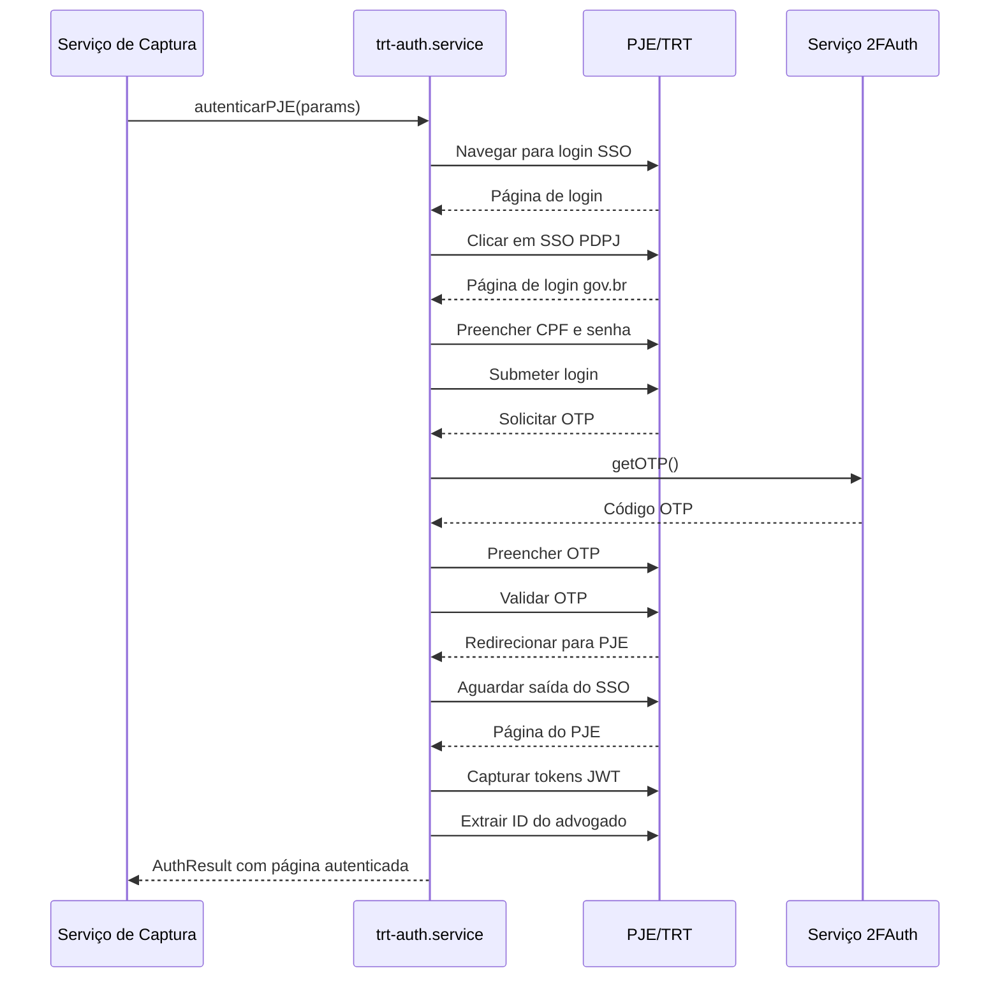

**Diagram sources**
- [backend/captura/services/trt/trt-auth.service.ts](file://backend/captura/services/trt/trt-auth.service.ts#L539-L603)

O serviço de autenticação inclui várias funcionalidades importantes:

- **Anti-detecção**: Aplica configurações para remover flags que identificam automação de browser
- **Processamento de OTP**: Gerencia o código de autenticação de dois fatores via serviço 2FAuth
- **Redirecionamentos SSO**: Aguarda e valida os múltiplos redirecionamentos do sistema SSO
- **Extração de tokens**: Captura os tokens JWT e cookies necessários para acessar a API do PJE
- **Extração de informações**: Extrai o ID do advogado do JWT para uso nas chamadas subsequentes

**Section sources**
- [backend/captura/services/trt/trt-auth.service.ts](file://backend/captura/services/trt/trt-auth.service.ts#L1-L603)

## Tipos e Parâmetros

Os tipos e parâmetros utilizados no sistema de captura estão bem definidos e tipados com TypeScript, garantindo segurança de tipos e documentação clara.

### Tipos Principais

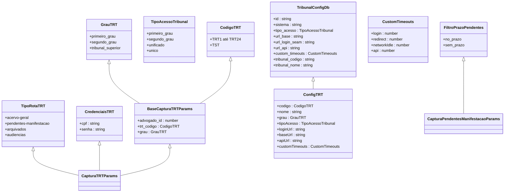

**Diagram sources**
- [backend/types/captura/trt-types.ts](file://backend/types/captura/trt-types.ts#L1-L126)

### Parâmetros de Captura

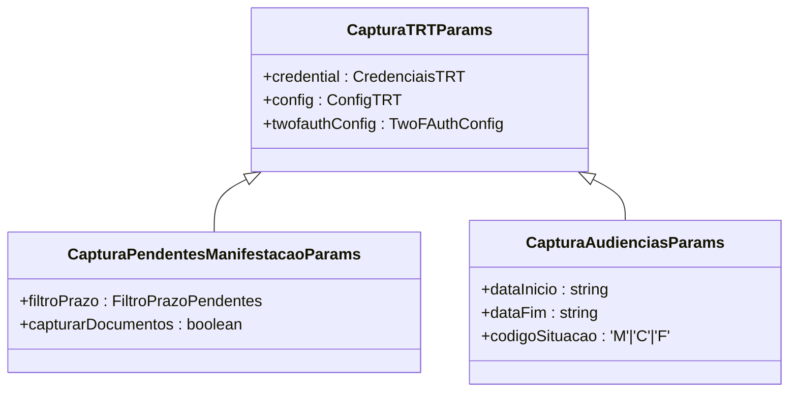

**Diagram sources**
- [backend/captura/services/trt/trt-capture.service.ts](file://backend/captura/services/trt/trt-capture.service.ts#L11-L36)

**Section sources**
- [backend/types/captura/trt-types.ts](file://backend/types/captura/trt-types.ts#L1-L126)
- [backend/captura/services/trt/trt-capture.service.ts](file://backend/captura/services/trt/trt-capture.service.ts#L1-L36)

## Persistência de Dados

O sistema de persistência de dados é dividido entre diferentes bancos de dados e serviços, dependendo do tipo de dado e requisitos de acesso.

### Arquitetura de Persistência

```mermaid
graph TD
A[API de Captura] --> B[Camada de Serviço]
B --> C[Camada de Persistência]
C --> D[Supabase (PostgreSQL)]
C --> E[MongoDB]
C --> F[Backblaze B2]
D --> G[Tabelas: acervo, expedientes, audiencias, etc.]
E --> H[Timeline e auditoria]
F --> I[Documentos e atas]
```

**Diagram sources**
- [README.md](file://README.md#L62-L63)

### Fluxo de Persistência

O fluxo de persistência segue uma ordem específica para garantir integridade referencial:

1. **Processos no acervo**: Primeiro são persistidos os processos principais na tabela `acervo`
2. **Timeline**: Em seguida, a timeline é persistida no MongoDB para armazenamento de documentos e eventos
3. **Partes**: As partes dos processos são persistidas com vínculo ao ID do acervo
4. **Dados específicos**: Finalmente, os dados específicos da captura são persistidos (pendentes, audiências, etc.)

Esta ordem é crucial para garantir que os vínculos entre entidades sejam mantidos corretamente.

**Section sources**
- [backend/captura/services/trt/acervo-geral.service.ts](file://backend/captura/services/trt/acervo-geral.service.ts#L197-L294)
- [backend/captura/services/trt/pendentes-manifestacao.service.ts](file://backend/captura/services/trt/pendentes-manifestacao.service.ts#L231-L348)
- [backend/captura/services/trt/arquivados.service.ts](file://backend/captura/services/trt/arquivados.service.ts#L193-L290)
- [backend/captura/services/trt/audiencias.service.ts](file://backend/captura/services/trt/audiencias.service.ts#L245-L418)

## Logs e Monitoramento

O sistema inclui um mecanismo robusto de logs e monitoramento para rastrear o progresso e identificar problemas durante a captura.

### Serviço de Logs

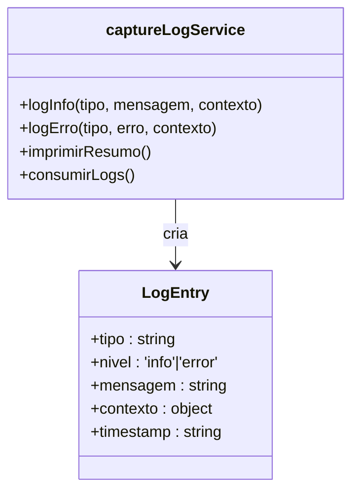

**Diagram sources**
- [backend/captura/services/persistence/capture-log.service.ts](file://backend/captura/services/persistence/capture-log.service.ts)

### Fluxo de Logs

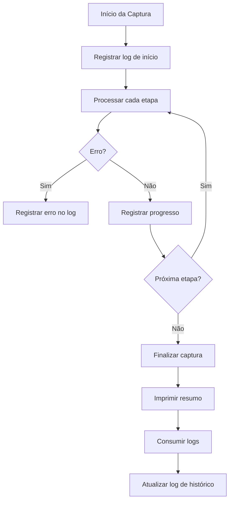

**Section sources**
- [backend/captura/services/persistence/capture-log.service.ts](file://backend/captura/services/persistence/capture-log.service.ts)
- [backend/captura/services/trt/acervo-geral.service.ts](file://backend/captura/services/trt/acervo-geral.service.ts#L295-L297)
- [backend/captura/services/trt/pendentes-manifestacao.service.ts](file://backend/captura/services/trt/pendentes-manifestacao.service.ts#L346-L348)
- [backend/captura/services/trt/arquivados.service.ts](file://backend/captura/services/trt/arquivados.service.ts#L292-L293)
- [backend/captura/services/trt/audiencias.service.ts](file://backend/captura/services/trt/audiencias.service.ts#L418-L420)

## Considerações de Segurança

O sistema implementa várias medidas de segurança para proteger dados sensíveis e garantir operações seguras.

### Proteção de Credenciais

As credenciais dos advogados são armazenadas de forma segura no banco de dados, com criptografia adequada. Durante a captura, as credenciais são descriptografadas apenas na memória e nunca são registradas em logs.

### Autenticação de Dois Fatores

O sistema utiliza autenticação de dois fatores (2FA) através do serviço 2FAuth para acessar o PJE, adicionando uma camada extra de segurança ao processo de login.

### Anti-detecção de Automação

O serviço de autenticação aplica várias técnicas de anti-detecção para evitar que o sistema de automação seja identificado pelo PJE, incluindo:
- Remoção da flag `navigator.webdriver`
- Sobrescrita do array `navigator.plugins`
- Definição de `navigator.languages` para valores plausíveis

### Validação de Dados

Todos os dados recebidos são validados rigorosamente antes do processamento, tanto na API quanto nos serviços de negócio, para prevenir injeção de dados maliciosos.

**Section sources**
- [backend/captura/services/trt/trt-auth.service.ts](file://backend/captura/services/trt/trt-auth.service.ts#L64-L83)
- [app/api/captura/trt/acervo-geral/route.ts](file://app/api/captura/trt/acervo-geral/route.ts#L144-L149)
- [app/api/captura/trt/pendentes-manifestacao/route.ts](file://app/api/captura/trt/pendentes-manifestacao/route.ts#L196-L200)
- [app/api/captura/trt/arquivados/route.ts](file://app/api/captura/trt/arquivados/route.ts#L150-L155)
- [app/api/captura/trt/audiencias/route.ts](file://app/api/captura/trt/audiencias/route.ts#L184-L189)