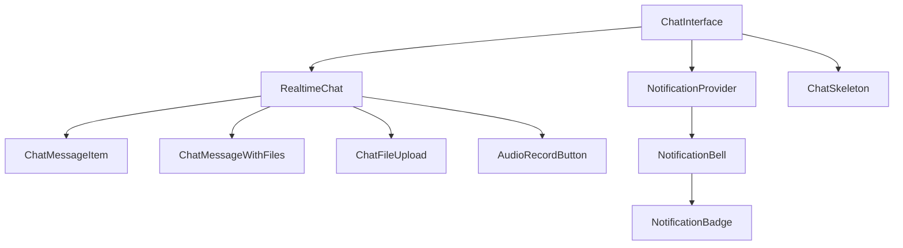
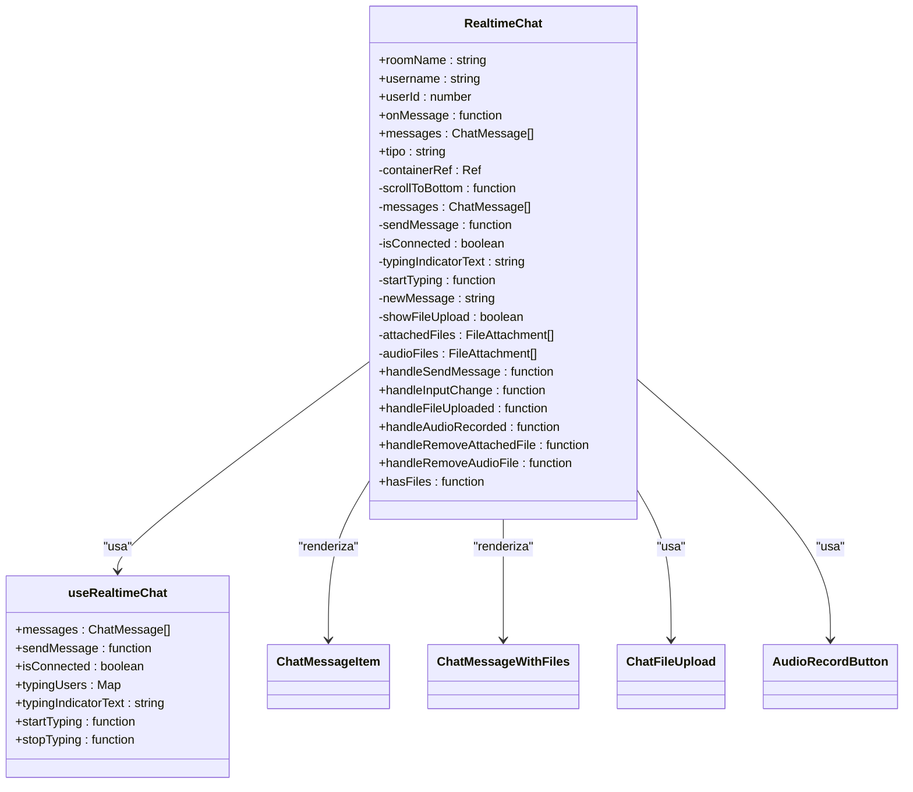
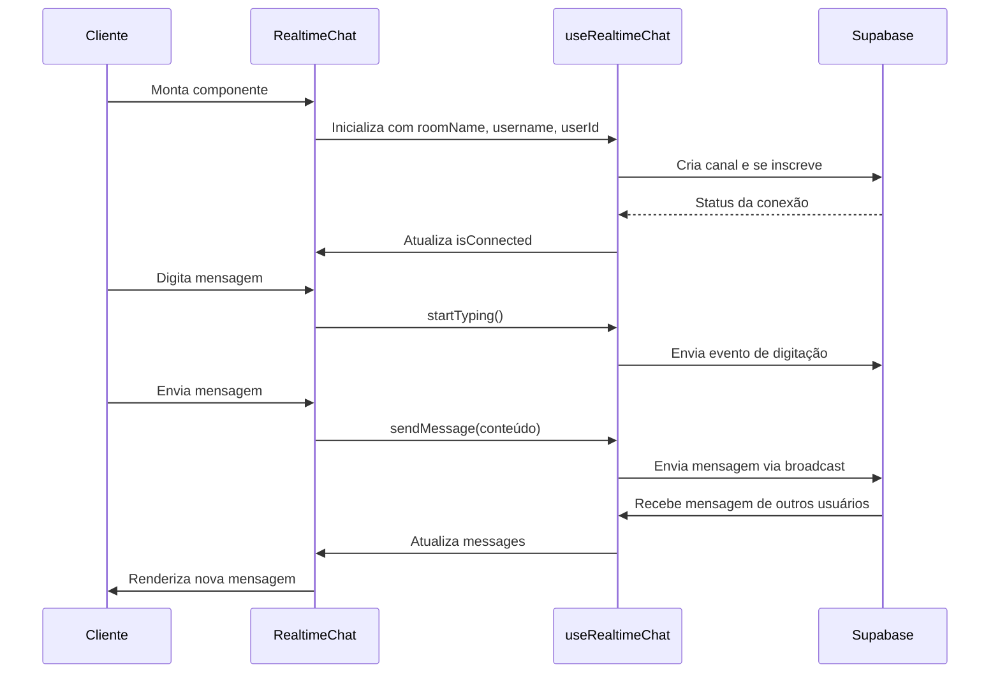
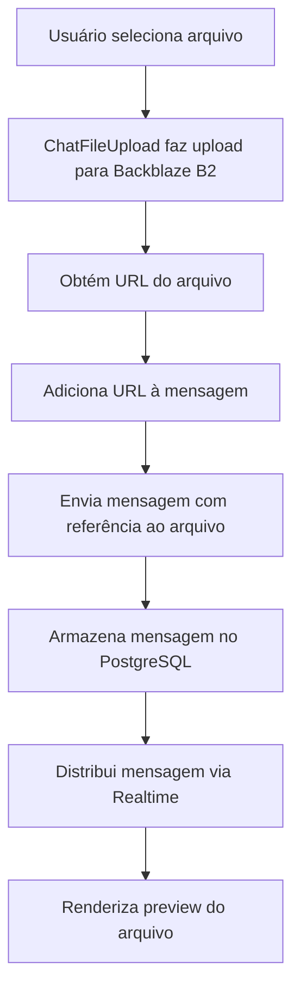
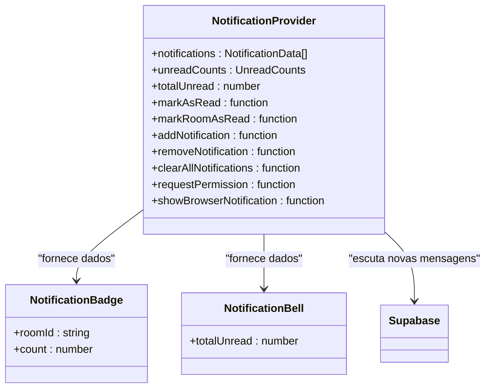
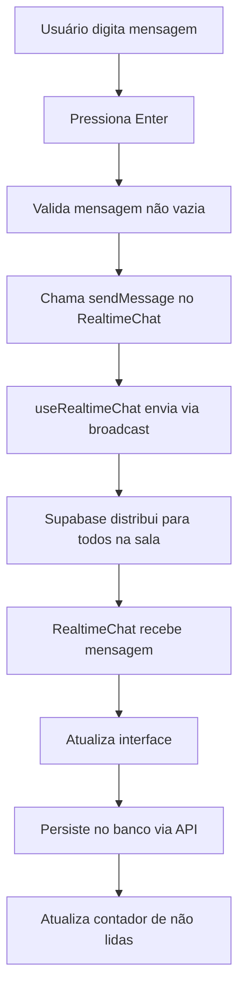
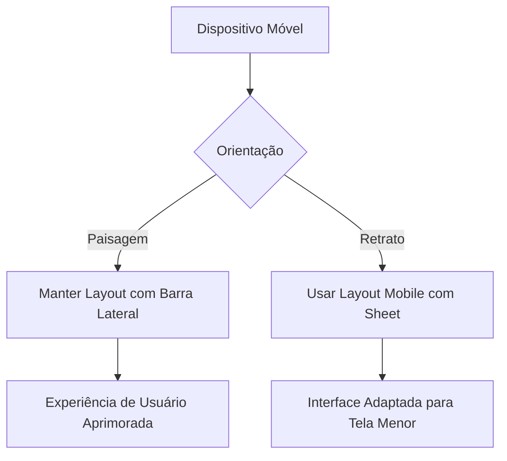

# Chat Interno

<cite>
**Arquivos Referenciados neste Documento**   
- [chat-interface.tsx](file://components/chat/chat-interface.tsx)
- [chat-skeleton.tsx](file://components/chat/chat-skeleton.tsx)
- [realtime-chat.tsx](file://components/realtime-chat.tsx)
- [use-realtime-chat.tsx](file://hooks/use-realtime-chat.tsx)
- [use-notifications.tsx](file://hooks/use-notifications.tsx)
- [notification-badge.tsx](file://components/chat/notification-badge.tsx)
- [chat-message.tsx](file://components/chat-message.tsx)
- [chat-message-with-files.tsx](file://components/chat/chat-message-with-files.tsx)
- [spec.md](file://openspec/specs/chat-interno/spec.md)
- [use-orientation.ts](file://hooks/use-orientation.ts)
- [page.tsx](file://app/(dashboard)/chat/page.tsx)
</cite>

## Sumário
1. [Introdução](#introdução)
2. [Estrutura do Chat Interno](#estrutura-do-chat-interno)
3. [Componentes Principais](#componentes-principais)
4. [Funcionalidades do Chat](#funcionalidades-do-chat)
5. [Notificações e Presença](#notificações-e-presença)
6. [Integração com Documentos](#integração-com-documentos)
7. [Fluxo de Mensagens](#fluxo-de-mensagens)
8. [Tipos de Salas](#tipos-de-salas)
9. [Edição e Exclusão de Mensagens](#edição-e-exclusão-de-mensagens)
10. [Reações e Emojis](#reações-e-emojis)
11. [Detecção de Orientação em Dispositivos Móveis](#detecção-de-orientação-em-dispositivos-móveis)

## Introdução

O sistema de **Chat Interno** é uma funcionalidade central do Sinesys, projetada para facilitar a comunicação entre os membros do escritório de advocacia. O chat permite troca de mensagens em tempo real, integração com documentos, notificações e presença de usuários online. A implementação utiliza tecnologias como Supabase Realtime, Redis e Backblaze B2 para armazenamento de arquivos.

O chat está disponível em uma página dedicada acessível por todos os usuários autenticados, além de ser integrado ao editor de documentos para discussões contextuais. O sistema segue princípios de Domain-Driven Design (DDD) e possui uma arquitetura em camadas bem definida.

## Estrutura do Chat Interno

O chat interno é composto por vários componentes React que trabalham em conjunto para fornecer uma experiência de comunicação em tempo real. A estrutura principal inclui:

- Interface principal do chat
- Skeleton loader para carregamento
- Componentes de mensagens
- Sistema de notificações
- Gerenciamento de arquivos

**Fontes do Diagrama**
- [chat-interface.tsx](file://components/chat/chat-interface.tsx)
- [realtime-chat.tsx](file://components/realtime-chat.tsx)
- [chat-message.tsx](file://components/chat-message.tsx)
- [chat-message-with-files.tsx](file://components/chat/chat-message-with-files.tsx)
- [use-notifications.tsx](file://hooks/use-notifications.tsx)
- [notification-badge.tsx](file://components/chat/notification-badge.tsx)
- [chat-skeleton.tsx](file://components/chat/chat-skeleton.tsx)

**Fontes da Seção**
- [chat-interface.tsx](file://components/chat/chat-interface.tsx)
- [chat-skeleton.tsx](file://components/chat/chat-skeleton.tsx)

## Componentes Principais

Os componentes principais do chat interno são responsáveis por diferentes aspectos da interface e funcionalidade. Cada componente tem uma responsabilidade bem definida e se comunica com outros componentes através de props e callbacks.

### ChatInterface

O componente `ChatInterface` é o container principal do chat, responsável por gerenciar o estado inicial, buscar mensagens existentes e coordenar a comunicação entre os componentes internos. Ele utiliza o padrão de provider para fornecer contexto de notificações.

**Fontes da Seção**
- [chat-interface.tsx](file://components/chat/chat-interface.tsx)

### RealtimeChat

O componente `RealtimeChat` é responsável pela comunicação em tempo real utilizando o Supabase Realtime. Ele gerencia a conexão com o canal, envio e recebimento de mensagens, e indicação de digitação.

**Fontes do Diagrama**
- [realtime-chat.tsx](file://components/realtime-chat.tsx)
- [use-realtime-chat.tsx](file://hooks/use-realtime-chat.tsx)

**Fontes da Seção**
- [realtime-chat.tsx](file://components/realtime-chat.tsx)

### useRealtimeChat

O hook personalizado `useRealtimeChat` gerencia a lógica de comunicação em tempo real com o Supabase. Ele cria um canal de comunicação, escuta eventos de mensagens e digitação, e fornece funções para envio de mensagens.

**Fontes do Diagrama**
- [use-realtime-chat.tsx](file://hooks/use-realtime-chat.tsx)
- [realtime-chat.tsx](file://components/realtime-chat.tsx)

**Fontes da Seção**
- [use-realtime-chat.tsx](file://hooks/use-realtime-chat.tsx)

## Funcionalidades do Chat

O chat interno oferece diversas funcionalidades para melhorar a comunicação entre os membros do escritório. Estas funcionalidades incluem envio de mensagens de texto, arquivos, áudio, e formatação avançada.

### Envio de Mensagens

O sistema permite o envio de mensagens de texto com suporte a formatação básica. As mensagens são persistidas no banco de dados PostgreSQL e transmitidas em tempo real via Supabase Realtime.

**Fontes da Seção**
- [realtime-chat.tsx](file://components/realtime-chat.tsx)
- [use-realtime-chat.tsx](file://hooks/use-realtime-chat.tsx)

### Envio de Arquivos

Os usuários podem enviar arquivos ao chat, que são armazenados no Backblaze B2. O sistema suporta diferentes tipos de arquivos, incluindo imagens, vídeos, áudios e documentos.

**Fontes do Diagrama**
- [realtime-chat.tsx](file://components/realtime-chat.tsx)
- [chat-message-with-files.tsx](file://components/chat/chat-message-with-files.tsx)

**Fontes da Seção**
- [realtime-chat.tsx](file://components/realtime-chat.tsx)
- [chat-message-with-files.tsx](file://components/chat/chat-message-with-files.tsx)

### Gravação de Áudio

O chat permite gravação de áudio diretamente no navegador. Os áudios gravados são processados e podem ser enviados como mensagens.

**Fontes da Seção**
- [realtime-chat.tsx](file://components/realtime-chat.tsx)
- [chat-message-with-files.tsx](file://components/chat/chat-message-with-files.tsx)

## Notificações e Presença

O sistema de notificações informa os usuários sobre novas mensagens, mesmo quando não estão visualizando o chat ativo. A presença de usuários online é mostrada em tempo real.

### Sistema de Notificações

O componente `NotificationProvider` gerencia o estado de notificações, contadores de mensagens não lidas e integração com notificações do navegador.

**Fontes do Diagrama**
- [use-notifications.tsx](file://hooks/use-notifications.tsx)
- [notification-badge.tsx](file://components/chat/notification-badge.tsx)

**Fontes da Seção**
- [use-notifications.tsx](file://hooks/use-notifications.tsx)
- [notification-badge.tsx](file://components/chat/notification-badge.tsx)

### Presença de Usuários

O sistema utiliza Supabase Realtime Presence para mostrar quais usuários estão online na sala de chat. Também exibe um indicador quando alguém está digitando.

**Fontes da Seção**
- [use-realtime-chat.tsx](file://hooks/use-realtime-chat.tsx)
- [realtime-chat.tsx](file://components/realtime-chat.tsx)

## Integração com Documentos

O chat está integrado ao editor de documentos, permitindo discussões contextuais sobre documentos específicos. Quando um documento é aberto, um chat lateral é disponibilizado.

### Chat Lateral no Editor

O chat lateral permite comunicação sem sair do editor de documentos. Ele se conecta automaticamente à sala do documento e mostra o histórico de mensagens.

**Fontes da Seção**
- [spec.md](file://openspec/specs/chat-interno/spec.md)

### Notificações no Editor

Quando novas mensagens chegam na sala do documento enquanto o chat lateral está fechado, um badge com contador é exibido no botão de chat.

**Fontes da Seção**
- [spec.md](file://openspec/specs/chat-interno/spec.md)

## Fluxo de Mensagens

O fluxo de mensagens no chat interno envolve várias etapas, desde a entrada do usuário até a persistência e distribuição da mensagem.

**Fontes do Diagrama**
- [realtime-chat.tsx](file://components/realtime-chat.tsx)
- [use-realtime-chat.tsx](file://hooks/use-realtime-chat.tsx)

**Fontes da Seção**
- [realtime-chat.tsx](file://components/realtime-chat.tsx)
- [use-realtime-chat.tsx](file://hooks/use-realtime-chat.tsx)

## Tipos de Salas

O sistema suporta diferentes tipos de salas de chat para atender a diferentes necessidades de comunicação.

### Sala Geral

A sala geral é pública e acessível por todos os usuários do escritório. É a sala padrão ao acessar a página de chat.

**Fontes da Seção**
- [spec.md](file://openspec/specs/chat-interno/spec.md)

### Sala de Documento

Cada documento possui uma sala de chat associada, criada automaticamente quando necessário. Apenas usuários com acesso ao documento podem participar.

**Fontes da Seção**
- [spec.md](file://openspec/specs/chat-interno/spec.md)

### Sala Privada

Salas privadas permitem conversas 1-on-1 entre dois usuários. O nome da sala é baseado nos nomes dos participantes.

**Fontes da Seção**
- [spec.md](file://openspec/specs/chat-interno/spec.md)

## Edição e Exclusão de Mensagens

Os usuários podem editar e excluir suas próprias mensagens, com restrições de tempo para edição.

### Edição de Mensagens

Mensagens podem ser editadas até 15 minutos após o envio. Após a edição, um indicador "(editado)" é exibido.

**Fontes da Seção**
- [spec.md](file://openspec/specs/chat-interno/spec.md)

### Exclusão de Mensagens

A exclusão de mensagens é um soft delete - o conteúdo é substituído por "[Mensagem deletada]" mas permanece no histórico.

**Fontes da Seção**
- [spec.md](file://openspec/specs/chat-interno/spec.md)

## Reações e Emojis

O sistema permite reações rápidas a mensagens usando emojis, facilitando a comunicação não verbal.

### Reações a Mensagens

Os usuários podem reagir a mensagens com emojis, com contagem de reações exibida sob a mensagem.

**Fontes da Seção**
- [spec.md](file://openspec/specs/chat-interno/spec.md)

### Remoção de Reações

Os usuários podem remover suas próprias reações clicando novamente no emoji.

**Fontes da Seção**
- [spec.md](file://openspec/specs/chat-interno/spec.md)

## Detecção de Orientação em Dispositivos Móveis

A nova funcionalidade de detecção de orientação em dispositivos móveis foi implementada para melhorar a experiência do usuário ao usar o chat em dispositivos móveis. Esta funcionalidade permite que a interface do chat mantenha o layout com barra lateral mesmo em dispositivos móveis quando em orientação horizontal, prevenindo mudanças de layout desnecessárias ao girar o dispositivo.

### Implementação da Detecção de Orientação

A detecção de orientação é realizada através do hook `useIsLandscape` que verifica se o dispositivo está em modo paisagem. Quando em modo paisagem, o layout do chat mantém a barra lateral visível, proporcionando uma experiência de usuário mais consistente.

**Fontes do Diagrama**
- [use-orientation.ts](file://hooks/use-orientation.ts)
- [page.tsx](file://app/(dashboard)/chat/page.tsx)

**Fontes da Seção**
- [use-orientation.ts](file://hooks/use-orientation.ts)
- [page.tsx](file://app/(dashboard)/chat/page.tsx)