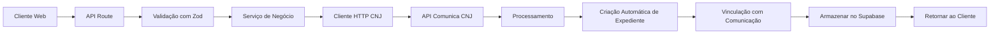
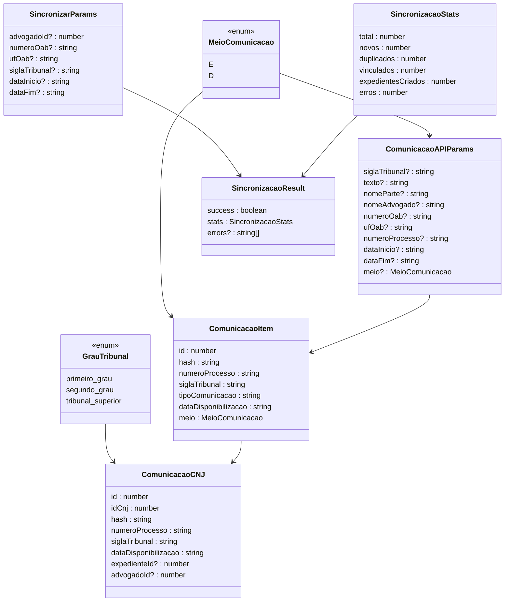
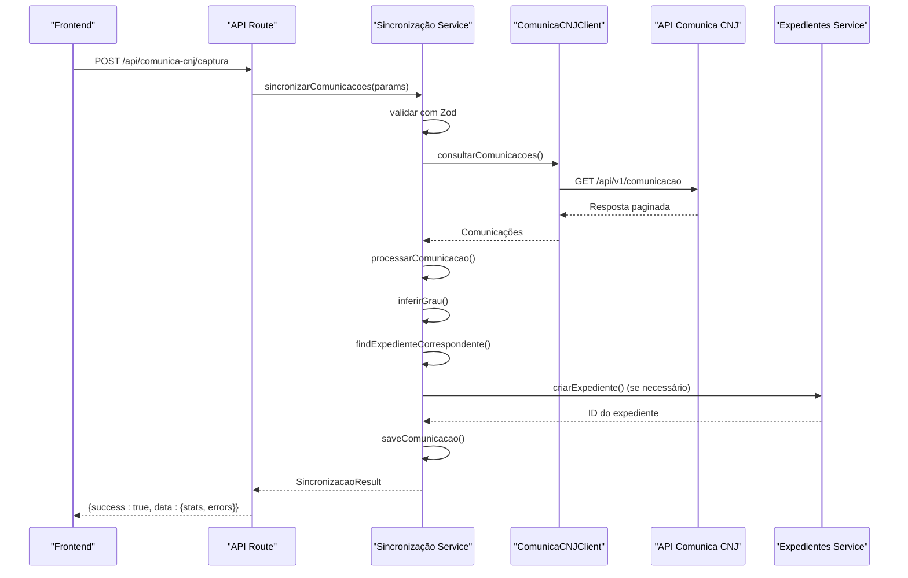
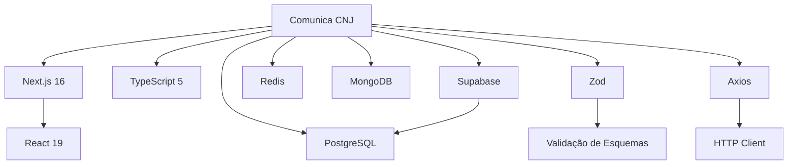

# Comunica CNJ

<cite>
**Arquivos Referenciados neste Documento**   
- [index.ts](file://src/core/comunica-cnj/index.ts)
- [domain.ts](file://src/core/comunica-cnj/domain.ts)
- [cnj-client.ts](file://src/core/comunica-cnj/cnj-client.ts)
- [service.ts](file://src/core/comunica-cnj/service.ts)
- [repository.ts](file://src/core/comunica-cnj/repository.ts)
- [route.ts](file://src/app/api/comunica-cnj/consulta/route.ts)
- [route.ts](file://src/app/api/comunica-cnj/captura/route.ts)
- [route.ts](file://src/app/api/comunica-cnj/capturadas/route.ts)
- [route.ts](file://src/app/api/comunica-cnj/tribunais/route.ts)
- [comunica-cnj-integration.sql](file://supabase/migrations/aplicadas/20251204140000_add_comunica_cnj_integration.sql)
</cite>

## Atualização do Sumário
**Alterações Realizadas**   
- Atualizado para refletir a expansão do sistema Comunica CNJ com nova camada de serviço robusta
- Adicionada documentação sobre validação com Zod, tratamento de erros estruturado e integração com o módulo de expedientes
- Incluída lógica para criação automática de expedientes a partir de comunicações processuais
- Atualizados diagramas de arquitetura e fluxos de dados

## Sumário
1. [Introdução](#introdução)
2. [Estrutura do Projeto](#estrutura-do-projeto)
3. [Componentes Principais](#componentes-principais)
4. [Visão Geral da Arquitetura](#visão-geral-da-arquitetura)
5. [Análise Detalhada dos Componentes](#análise-detalhada-dos-componentes)
6. [Análise de Dependências](#análise-de-dependências)
7. [Considerações de Desempenho](#considerações-de-desempenho)
8. [Guia de Solução de Problemas](#guia-de-solução-de-problemas)
9. [Conclusão](#conclusão)

## Introdução
O sistema **Comunica CNJ** foi expandido com uma nova camada de serviço robusta para consulta e sincronização de comunicações processuais, integrando validação com Zod, tratamento de erros estruturado e lógica para criação automática de expedientes. Este módulo integrado ao sistema de gestão jurídica Sinesys permite a automação completa da captura de dados processuais a partir da API pública do Conselho Nacional de Justiça (CNJ), incluindo a vinculação inteligente com o módulo de expedientes. A arquitetura é baseada em Next.js com App Router, TypeScript, Supabase como backend as a service, e implementa padrões de validação rigorosos e tratamento de erros em camadas.

## Estrutura do Projeto

```mermaid
graph TB
subgraph "Frontend"
A[app/(dashboard)/comunica-cnj] --> B[Componentes UI]
C[app/api/comunica-cnj] --> D[Rotas de API]
end
subgraph "Backend"
E[src/core/comunica-cnj] --> F[Domínio]
G[src/core/comunica-cnj] --> H[Cliente HTTP]
I[src/core/comunica-cnj] --> J[Serviços]
K[src/core/comunica-cnj] --> L[Repositório]
end
subgraph "Infraestrutura"
M[Supabase] --> N[PostgreSQL]
O[Redis] --> P[Cache]
Q[MongoDB] --> R[Auditoria]
end
B --> D
D --> E
E --> M
F --> O
J --> Q
```

**Fontes do Diagrama**
- [index.ts](file://src/core/comunica-cnj/index.ts)
- [domain.ts](file://src/core/comunica-cnj/domain.ts)
- [cnj-client.ts](file://src/core/comunica-cnj/cnj-client.ts)
- [service.ts](file://src/core/comunica-cnj/service.ts)
- [repository.ts](file://src/core/comunica-cnj/repository.ts)

**Fontes da Seção**
- [index.ts](file://src/core/comunica-cnj/index.ts#L1-L36)
- [comunica-cnj-integration.sql](file://supabase/migrations/aplicadas/20251204140000_add_comunica_cnj_integration.sql#L100-L158)

## Componentes Principais

O sistema Comunica CNJ foi expandido com três camadas principais: API, serviços de negócio e persistência. A camada de API (`app/api/comunica-cnj`) gerencia as requisições HTTP, autenticação e validação de entrada com Zod. A camada de serviço (`src/core/comunica-cnj/service.ts`) contém a lógica de negócio para consulta, sincronização e criação automática de expedientes. A camada de persistência (`src/core/comunica-cnj/repository.ts`) interage com o banco de dados Supabase para armazenamento de comunicações e vinculação com expedientes. O frontend utiliza componentes React com shadcn/ui para interface de usuário consistente e acessível.

**Fontes da Seção**
- [service.ts](file://src/core/comunica-cnj/service.ts#L1-L728)
- [repository.ts](file://src/core/comunica-cnj/repository.ts#L1-L490)
- [domain.ts](file://src/core/comunica-cnj/domain.ts#L1-L604)

## Visão Geral da Arquitetura



**Fontes do Diagrama**
- [route.ts](file://src/app/api/comunica-cnj/consulta/route.ts#L1-L323)
- [route.ts](file://src/app/api/comunica-cnj/captura/route.ts#L1-L250)
- [service.ts](file://src/core/comunica-cnj/service.ts#L148-L414)

## Análise Detalhada dos Componentes

### Análise da Camada de Domínio

A camada de domínio define os tipos e validações para integração com a API pública do Comunica CNJ, utilizando Zod para validação robusta de esquemas. Os tipos incluem parâmetros de busca, respostas da API, entidades de banco de dados e esquemas de validação para diferentes operações.



**Fontes do Diagrama**
- [domain.ts](file://src/core/comunica-cnj/domain.ts#L1-L604)
- [service.ts](file://src/core/comunica-cnj/service.ts#L148-L414)

**Fontes da Seção**
- [domain.ts](file://src/core/comunica-cnj/domain.ts#L1-L604)
- [cnj-client.ts](file://src/core/comunica-cnj/cnj-client.ts#L1-L574)

### Fluxo de Sincronização de Comunicações

O fluxo de sincronização de comunicações processuais envolve múltiplas etapas de validação, consulta, processamento e criação de expedientes, com tratamento estruturado de erros.



**Fontes do Diagrama**
- [route.ts](file://src/app/api/comunica-cnj/captura/route.ts#L140-L250)
- [service.ts](file://src/core/comunica-cnj/service.ts#L309-L414)
- [repository.ts](file://src/core/comunica-cnj/repository.ts#L279-L319)

**Fontes da Seção**
- [service.ts](file://src/core/comunica-cnj/service.ts#L309-L414)
- [route.ts](file://src/app/api/comunica-cnj/captura/route.ts#L140-L250)

### Análise da Criação Automática de Expedientes

A lógica de criação automática de expedientes a partir de comunicações CNJ envolve a extração de dados processuais, inferência de grau do tribunal e vinculação com o módulo de expedientes.

```mermaid
flowchart TD
A[Comunicação CNJ] --> B{Expediente Existe?}
B --> |Sim| C[Vincular Comunicação]
B --> |Não| D[Criar Novo Expediente]
D --> E[Extrair Partes dos Destinatários]
E --> F[Inferir Grau do Tribunal]
F --> G[Buscar Data de Autuação no Acervo]
G --> H[Gerar ID PJN Negativo]
H --> I[Preparar Dados do Expediente]
I --> J[criarExpediente()]
J --> K[Retornar ID do Expediente]
K --> L[Vincular Comunicação]
L --> M[Salvar Comunicação]
style D fill:#FF9800,stroke:#F57C00,color:white
style J fill:#4CAF50,stroke:#388E3C,color:white
```

**Fontes do Diagrama**
- [service.ts](file://src/core/comunica-cnj/service.ts#L595-L670)
- [service.ts](file://src/core/comunica-cnj/service.ts#L430-L474)
- [repository.ts](file://src/core/comunica-cnj/repository.ts#L428-L479)

**Fontes da Seção**
- [service.ts](file://src/core/comunica-cnj/service.ts#L595-L670)
- [repository.ts](file://src/core/comunica-cnj/repository.ts#L428-L479)

## Análise de Dependências



**Fontes do Diagrama**
- [package.json](file://package.json#L40-L188)
- [domain.ts](file://src/core/comunica-cnj/domain.ts#L7)
- [cnj-client.ts](file://src/core/comunica-cnj/cnj-client.ts#L7)

**Fontes da Seção**
- [package.json](file://package.json#L1-L228)
- [domain.ts](file://src/core/comunica-cnj/domain.ts#L1-L604)

## Considerações de Desempenho
O sistema implementa múltiplas estratégias de otimização de desempenho, incluindo cache Redis para consultas frequentes, pré-carregamento de dados com SWR no frontend e otimizações de build com Next.js. A configuração do service worker permite funcionamento offline e cache inteligente de recursos estáticos. O uso de conexões remotas com Browserless em produção reduz o consumo de recursos locais durante a automação de navegador. A validação com Zod é realizada de forma eficiente, minimizando o overhead de processamento.

## Guia de Solução de Problemas

O sistema inclui mecanismos robustos de logging e tratamento de erros estruturado, especialmente no processo de sincronização de comunicações. Problemas comuns incluem falhas de rate limit, timeouts de rede e erros de validação. O sistema implementa retries automáticos, verificação de estado da página e fallbacks para próximos códigos OTP. A configuração anti-detecção remove flags de automação no navegador para evitar bloqueios. Os erros são categorizados com códigos específicos (VALIDATION_ERROR, EXTERNAL_SERVICE_ERROR, DATABASE_ERROR) para facilitar a depuração.

**Fontes da Seção**
- [service.ts](file://src/core/comunica-cnj/service.ts#L151-L161)
- [service.ts](file://src/core/comunica-cnj/service.ts#L276-L287)
- [service.ts](file://src/core/comunica-cnj/service.ts#L299-L308)

## Conclusão
O sistema Comunica CNJ representa uma solução completa e robusta para integração automatizada com a API pública do Conselho Nacional de Justiça, particularmente com o sistema de comunicações processuais. Sua arquitetura modular em três camadas promove separação de responsabilidades e facilita manutenção. A implementação de validação com Zod, tratamento de erros estruturado e criação automática de expedientes cria um sistema resiliente e escalável para necessidades jurídicas complexas. A integração com o módulo de expedientes permite uma gestão processual unificada e eficiente.