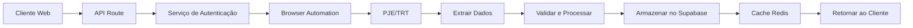

# Comunica CNJ

<cite>
**Arquivos Referenciados neste Documento**   
- [README.md](file://README.md)
- [package.json](file://package.json)
- [next.config.ts](file://next.config.ts)
- [tsconfig.json](file://tsconfig.json)
- [trt-auth.service.ts](file://backend/captura/services/trt/trt-auth.service.ts)
- [trt-capture.service.ts](file://backend/captura/services/trt/trt-capture.service.ts)
- [types.ts](file://backend/captura/services/trt/types.ts)
- [app/api/comunica-cnj](file://app/api/comunica-cnj)
- [app/(dashboard)/comunica-cnj](file://app/(dashboard)/comunica-cnj)
</cite>

## Sumário
1. [Introdução](#introdução)
2. [Estrutura do Projeto](#estrutura-do-projeto)
3. [Componentes Principais](#componentes-principais)
4. [Visão Geral da Arquitetura](#visão-geral-da-arquitetura)
5. [Análise Detalhada dos Componentes](#análise-detalhada-dos-componentes)
6. [Análise de Dependências](#análise-de-dependências)
7. [Considerações de Desempenho](#considerações-de-desempenho)
8. [Guia de Solução de Problemas](#guia-de-solução-de-problemas)
9. [Conclusão](#conclusão)

## Introdução
O sistema **Comunica CNJ** é um módulo integrado ao sistema de gestão jurídica Sinesys, desenvolvido para automatizar a comunicação com tribunais brasileiros, especialmente com o Conselho Nacional de Justiça (CNJ) e Tribunais Regionais do Trabalho (TRT). O sistema permite a captura automatizada de dados processuais, gestão de audiências, pendências de manifestação e integração com o Processo Judicial Eletrônico (PJE). A arquitetura é baseada em Next.js com App Router, TypeScript, Supabase como backend as a service, e utiliza Puppeteer e Playwright para automação de navegador.

## Estrutura do Projeto

```mermaid
graph TB
subgraph "Frontend"
A[app/(dashboard)/comunica-cnj] --> B[Componentes UI]
C[app/api/comunica-cnj] --> D[Rotas de API]
end
subgraph "Backend"
E[backend/captura/services/trt] --> F[Autenticação PJE]
G[backend/captura/services/trt] --> H[Captura de Dados]
I[backend/types/captura] --> J[Tipos de Dados]
end
subgraph "Infraestrutura"
K[Supabase] --> L[PostgreSQL]
M[Redis] --> N[Cache]
O[MongoDB] --> P[Auditoria]
end
B --> D
D --> E
E --> K
F --> M
H --> O
```

**Fontes do Diagrama**
- [trt-auth.service.ts](file://backend/captura/services/trt/trt-auth.service.ts)
- [trt-capture.service.ts](file://backend/captura/services/trt/trt-capture.service.ts)
- [app/(dashboard)/comunica-cnj](file://app/(dashboard)/comunica-cnj)
- [app/api/comunica-cnj](file://app/api/comunica-cnj)

**Fontes da Seção**
- [README.md](file://README.md#L1-L800)
- [package.json](file://package.json#L1-L228)
- [next.config.ts](file://next.config.ts#L1-L142)
- [tsconfig.json](file://tsconfig.json#L1-L55)

## Componentes Principais

O sistema Comunica CNJ é composto por três camadas principais: API, serviços de negócio e persistência. A camada de API (`app/api/comunica-cnj`) gerencia as requisições HTTP, autenticação e validação de entrada. A camada de serviço (`backend/captura/services/trt`) contém a lógica de negócio para autenticação no PJE e captura de dados. A camada de persistência interage com os bancos de dados Supabase, Redis e MongoDB para armazenamento e cache de informações. O frontend utiliza componentes React com shadcn/ui para interface de usuário consistente e acessível.

**Fontes da Seção**
- [README.md](file://README.md#L73-L101)
- [trt-auth.service.ts](file://backend/captura/services/trt/trt-auth.service.ts#L1-L603)
- [trt-capture.service.ts](file://backend/captura/services/trt/trt-capture.service.ts#L1-L36)

## Visão Geral da Arquitetura



**Fontes do Diagrama**
- [trt-auth.service.ts](file://backend/captura/services/trt/trt-auth.service.ts#L539-L603)
- [trt-capture.service.ts](file://backend/captura/services/trt/trt-capture.service.ts#L1-L36)

## Análise Detalhada dos Componentes

### Análise do Serviço de Autenticação TRT

O serviço de autenticação TRT é responsável por realizar o login no sistema PJE utilizando credenciais de advogados, incluindo autenticação de dois fatores via 2FAuth. O processo envolve navegação com Playwright, detecção de campos OTP, preenchimento automático de códigos e tratamento de erros de rede.


**Fontes do Diagrama**
- [trt-auth.service.ts](file://backend/captura/services/trt/trt-auth.service.ts#L14-L38)
- [trt-capture.service.ts](file://backend/captura/services/trt/trt-capture.service.ts#L11-L36)

**Fontes da Seção**
- [trt-auth.service.ts](file://backend/captura/services/trt/trt-auth.service.ts#L1-L603)
- [trt-capture.service.ts](file://backend/captura/services/trt/trt-capture.service.ts#L1-L36)

### Fluxo de Autenticação no PJE

O fluxo de autenticação no PJE/TRT envolve múltiplas etapas de segurança, incluindo login SSO gov.br, verificação de dois fatores e extração de tokens JWT para acesso às APIs do tribunal.


**Fontes do Diagrama**
- [trt-auth.service.ts](file://backend/captura/services/trt/trt-auth.service.ts#L287-L537)
- [app/api/comunica-cnj](file://app/api/comunica-cnj)

**Fontes da Seção**
- [trt-auth.service.ts](file://backend/captura/services/trt/trt-auth.service.ts#L1-L603)

### Análise de Tipos de Captura

Os tipos de captura definem a estrutura de parâmetros para diferentes tipos de operações de captura de dados no sistema PJE/TRT, garantindo consistência e validação de entrada.


**Fontes do Diagrama**
- [trt-capture.service.ts](file://backend/captura/services/trt/trt-capture.service.ts#L11-L36)
- [types.ts](file://backend/captura/services/trt/types.ts)

**Fontes da Seção**
- [trt-capture.service.ts](file://backend/captura/services/trt/trt-capture.service.ts#L1-L36)
- [types.ts](file://backend/captura/services/trt/types.ts#L1-L5)

## Análise de Dependências


**Fontes do Diagrama**
- [package.json](file://package.json#L40-L188)
- [README.md](file://README.md#L44-L65)

**Fontes da Seção**
- [package.json](file://package.json#L1-L228)
- [README.md](file://README.md#L1-L800)

## Considerações de Desempenho
O sistema implementa múltiplas estratégias de otimização de desempenho, incluindo cache Redis para consultas frequentes, pré-carregamento de dados com SWR no frontend e otimizações de build com Next.js. A configuração do service worker permite funcionamento offline e cache inteligente de recursos estáticos. O uso de conexões remotas com Browserless em produção reduz o consumo de recursos locais durante a automação de navegador.

## Guia de Solução de Problemas

O sistema inclui mecanismos robustos de logging e tratamento de erros, especialmente no processo de autenticação PJE. Problemas comuns incluem falhas de OTP, timeouts de rede e detecção de automação. O sistema implementa retries automáticos, verificação de estado da página e fallbacks para próximos códigos OTP. A configuração anti-detecção remove flags de automação no navegador para evitar bloqueios.

**Fontes da Seção**
- [trt-auth.service.ts](file://backend/captura/services/trt/trt-auth.service.ts#L89-L232)
- [README.md](file://README.md#L814-L850)

## Conclusão
O sistema Comunica CNJ representa uma solução completa para integração automatizada com tribunais brasileiros, particularmente com o PJE/TRT. Sua arquitetura modular em três camadas promove separação de responsabilidades e facilita manutenção. A implementação de autenticação robusta com 2FA, captura de dados confiável e armazenamento em múltiplos bancos de dados cria um sistema resiliente e escalável para necessidades jurídicas complexas.