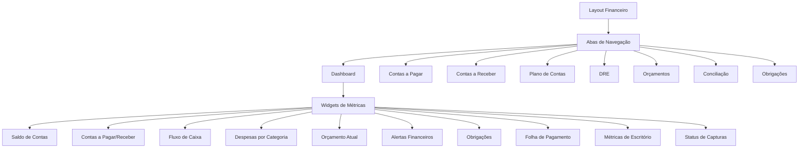
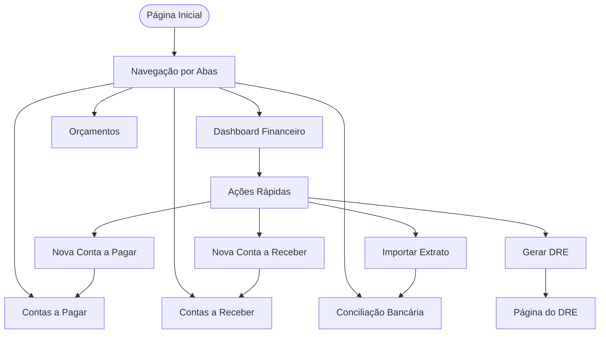

# Dashboard Financeiro

<cite>
**Arquivos Referenciados neste Documento**  
- [dashboard.md](file://docs/financeiro/dashboard.md)
- [page.tsx](file://app/(dashboard)/financeiro/page.tsx)
- [layout.tsx](file://app/(dashboard)/financeiro/layout.tsx)
- [widget-saldo-contas](file://app/(dashboard)/dashboard/components/widgets/widget-saldo-contas)
- [widget-contas-pagar-receber](file://app/(dashboard)/dashboard/components/widgets/widget-contas-pagar-receber)
- [widget-fluxo-caixa](file://app/(dashboard)/dashboard/components/widgets/widget-fluxo-caixa)
- [widget-despesas-categoria](file://app/(dashboard)/dashboard/components/widgets/widget-despesas-categoria)
- [widget-orcamento-atual](file://app/(dashboard)/dashboard/components/widgets/widget-orcamento-atual)
- [widget-alertas-financeiros](file://app/(dashboard)/dashboard/components/widgets/widget-alertas-financeiros)
- [obrigacoes-widget](file://app/(dashboard)/dashboard/components/obrigacoes-widget)
- [widget-folha-pagamento](file://app/(dashboard)/dashboard/components/widgets/widget-folha-pagamento)
- [route.ts](file://src/app/api/dashboard/metricas/route.ts)
- [route.ts](file://src/app/api/dashboard/capturas/route.ts)
- [dashboard-metricas.persistence.ts](file://backend/dashboard/services/persistence/dashboard-metricas.persistence.ts)
- [types.ts](file://backend/types/dashboard/types.ts)
- [metricas-actions.ts](file://src/features/dashboard/actions/metricas-actions.ts)
- [service.ts](file://src/features/dashboard/service.ts)
</cite>

## Resumo das Atualizações
**Alterações Realizadas**  
- Atualização da seção **API e Cache** para incluir novos endpoints e configurações de cache
- Adição da seção **Métricas de Escritório** com detalhes sobre agregação de dados
- Adição da seção **Status de Capturas** com informações sobre monitoramento de integrações
- Atualização do diagrama de estrutura para refletir a nova camada de serviço
- Revisão geral para refletir operações em paralelo e otimizações de desempenho

## Sumário
1. [Introdução](#introdução)
2. [Estrutura do Dashboard Financeiro](#estrutura-do-dashboard-financeiro)
3. [Componentes Principais](#componentes-principais)
4. [Funcionalidades e Navegação](#funcionalidades-e-navegação)
5. [Widgets Disponíveis](#widgets-disponíveis)
6. [API e Cache](#api-e-cache)
7. [Alertas Financeiros](#alertas-financeiros)
8. [Métricas de Escritório](#métricas-de-escritório)
9. [Status de Capturas](#status-de-capturas)

## Introdução

O **Dashboard Financeiro** é um painel centralizado dentro do sistema Sinesys, projetado para fornecer uma visão abrangente e em tempo real da saúde financeira do escritório de advocacia. Ele integra métricas essenciais, gráficos analíticos e alertas proativos, permitindo que gestores e contadores tomem decisões informadas com rapidez. O dashboard faz parte do módulo financeiro do sistema, acessível apenas a usuários autenticados com permissões adequadas.

O painel é construído com base em uma arquitetura moderna que separa a camada de apresentação (Next.js App Router) da lógica de negócio e da persistência de dados, garantindo escalabilidade e manutenibilidade. Ele utiliza componentes reutilizáveis e um sistema de cache para otimizar o desempenho e a experiência do usuário.

## Estrutura do Dashboard Financeiro

A estrutura do dashboard é organizada em torno de um layout hierárquico que facilita a navegação e a visualização de informações. O componente principal é a página `page.tsx`, localizada em `app/(dashboard)/financeiro/`, que serve como o ponto de entrada e orquestrador dos widgets. O layout da seção financeira é definido em `layout.tsx`, que implementa um sistema de abas para navegação entre os diferentes módulos do financeiro.

**Fontes do Diagrama**  
- [layout.tsx](file://app/(dashboard)/financeiro/layout.tsx)
- [page.tsx](file://app/(dashboard)/financeiro/page.tsx)

**Fontes da Seção**  
- [layout.tsx](file://app/(dashboard)/financeiro/layout.tsx)
- [page.tsx](file://app/(dashboard)/financeiro/page.tsx)

## Componentes Principais

Os componentes principais do dashboard são widgets especializados que exibem dados específicos de forma clara e concisa. Cada widget é um componente React independente, importado e renderizado na página principal. Esses componentes são responsáveis por buscar seus dados, geralmente através de chamadas à API, e por renderizar a interface de usuário com base nesses dados.

A arquitetura do frontend segue o padrão de camadas descrito no README do projeto, com a camada de apresentação (UI) consumindo dados da camada de aplicação (API) e, indiretamente, da camada de domínio e persistência. Os widgets utilizam hooks e utilitários do sistema para gerenciar estado, cache e interações do usuário.

**Fontes da Seção**  
- [page.tsx](file://app/(dashboard)/financeiro/page.tsx)
- [widget-saldo-contas](file://app/(dashboard)/dashboard/components/widgets/widget-saldo-contas)
- [widget-contas-pagar-receber](file://app/(dashboard)/dashboard/components/widgets/widget-contas-pagar-receber)

## Funcionalidades e Navegação

O dashboard oferece uma série de funcionalidades de ação rápida diretamente na interface. Na parte superior da página, são exibidos botões para ações comuns, como criar uma nova conta a pagar, criar uma nova conta a receber, importar um extrato bancário ou gerar um DRE (Demonstrativo de Resultados do Exercício). Esses botões redirecionam o usuário para as páginas específicas de cada funcionalidade.

A navegação entre os diferentes módulos do financeiro é feita através de um conjunto de abas localizadas logo abaixo do cabeçalho. Essas abas permitem que o usuário acesse rapidamente outras áreas do sistema financeiro sem precisar voltar à página inicial do dashboard.

**Fontes do Diagrama**  
- [page.tsx](file://app/(dashboard)/financeiro/page.tsx)
- [layout.tsx](file://app/(dashboard)/financeiro/layout.tsx)

**Fontes da Seção**  
- [page.tsx](file://app/(dashboard)/financeiro/page.tsx)
- [layout.tsx](file://app/(dashboard)/financeiro/layout.tsx)

## Widgets Disponíveis

O dashboard é composto por vários widgets que apresentam diferentes aspectos da situação financeira. Cada widget é projetado para fornecer uma visão clara e imediata de uma métrica específica.

- **Saldo de Contas**: Exibe o saldo consolidado de todas as contas bancárias e financeiras do escritório.
- **Contas a Pagar/Receber**: Mostra o valor total das contas a pagar e a receber, geralmente dividido por status (vencidas, a vencer, pagas).
- **Fluxo de Caixa**: Apresenta um gráfico de linha que projeta o fluxo de caixa mensal, permitindo uma visão de curto e médio prazo.
- **Despesas por Categoria**: Exibe um gráfico de pizza ou barras que mostra a distribuição das despesas por categoria (ex: honorários, escritório, viagens).
- **Orçamento Atual**: Compara as despesas reais com o orçamento previsto, destacando categorias que estão acima do planejado.
- **Alertas Financeiros**: Lista de alertas críticos, como contas vencidas, saldos negativos ou orçamentos estourados.
- **Obrigações**: Mostra um resumo das obrigações fiscais e trabalhistas pendentes.
- **Folha de Pagamento**: Fornece um resumo da folha de pagamento, incluindo valores a pagar e pendências.

**Fontes da Seção**  
- [page.tsx](file://app/(dashboard)/financeiro/page.tsx)
- [dashboard.md](file://docs/financeiro/dashboard.md)

## API e Cache

O dashboard consome dados de uma API RESTful, com endpoints específicos para fornecer as métricas consolidadas. O endpoint principal é `GET /api/financeiro/dashboard`, que retorna um objeto JSON com todas as métricas necessárias para renderizar os widgets. Para projeções de fluxo de caixa, é utilizado o endpoint `GET /api/financeiro/dashboard/fluxo-caixa?meses=6`.

Para otimizar o desempenho e reduzir a carga no banco de dados, o sistema utiliza o Redis como camada de cache. As métricas e alertas do dashboard são armazenados em cache com um TTL (Time To Live) de 5 minutos, conforme especificado na documentação. Isso garante que os dados sejam atualizados com frequência suficiente para serem úteis, sem sobrecarregar os serviços de backend.

A nova arquitetura implementa uma camada de serviço para agregação de dados que executa operações em paralelo, melhorando significativamente o desempenho. Os endpoints `/api/dashboard/metricas` e `/api/dashboard/capturas` foram adicionados para fornecer dados específicos com cache otimizado.

**Fontes da Seção**  
- [dashboard.md](file://docs/financeiro/dashboard.md)
- [route.ts](file://src/app/api/dashboard/metricas/route.ts)
- [route.ts](file://src/app/api/dashboard/capturas/route.ts)
- [service.ts](file://src/features/dashboard/service.ts)

## Alertas Financeiros

O sistema de alertas é um componente crucial do dashboard, projetado para identificar proativamente problemas financeiros. Os alertas são gerados com base em regras de negócio definidas no backend e incluem:

- **Contas vencidas**: Contas a pagar que não foram liquidadas até a data de vencimento.
- **Saldo negativo**: Qualquer conta bancária com saldo abaixo de zero.
- **Orçamentos estourados**: Categorias de despesas que excederam o limite orçamentário.
- **Folha pendente**: Processos de pagamento de salários que estão atrasados.
- **Transações não conciliadas**: Lançamentos no extrato bancário que não foram associados a uma conta no sistema.

Esses alertas são exibidos de forma destacada no widget de alertas financeiros, permitindo que o usuário tome ações corretivas imediatamente.

**Fontes da Seção**  
- [dashboard.md](file://docs/financeiro/dashboard.md)
- [widget-alertas-financeiros](file://app/(dashboard)/dashboard/components/widgets/widget-alertas-financeiros)

## Métricas de Escritório

O endpoint `GET /api/dashboard/metricas` fornece métricas consolidadas do escritório para superadmins, incluindo indicadores de desempenho e comparações com períodos anteriores. Este endpoint executa múltiplas consultas em paralelo para otimizar o tempo de resposta.

As métricas incluem:
- **Total de Processos**: Contagem total de processos no acervo.
- **Processos Ativos**: Processos ativos únicos por número de processo.
- **Audiências do Mês**: Número de audiências agendadas no mês corrente.
- **Expedientes Pendentes e Vencidos**: Total de expedientes não baixados e vencidos.
- **Taxa de Resolução**: Percentual de expedientes resolvidos dentro do prazo.
- **Comparativos Mensais**: Variação percentual em relação ao mês anterior para processos, audiências e expedientes.

O cache para este endpoint tem um TTL de 10 minutos, definido pela chave `dashboard:metricas` no Redis.

**Fontes da Seção**  
- [route.ts](file://src/app/api/dashboard/metricas/route.ts)
- [dashboard-metricas.persistence.ts](file://backend/dashboard/services/persistence/dashboard-metricas.persistence.ts)
- [types.ts](file://backend/types/dashboard/types.ts)
- [metricas-actions.ts](file://src/features/dashboard/actions/metricas-actions.ts)

## Status de Capturas

O endpoint `GET /api/dashboard/capturas` fornece o status das últimas execuções de captura de dados do PJE-TRT, permitindo monitorar a integridade e disponibilidade dos dados. Este endpoint é especialmente útil para administradores técnicos que precisam garantir a continuidade das operações de captura.

Os dados incluem:
- **Tribunal e Grau**: Identificação do TRT e grau (primeiro ou segundo) da captura.
- **Última Execução**: Data e hora da última execução bem-sucedida.
- **Status**: Indicador de status (sucesso, erro, pendente, executando).
- **Mensagem de Erro**: Detalhes do erro em caso de falha.
- **Contagem de Registros**: Número de processos, audiências e expedientes capturados.

Devido à natureza volátil desses dados, o cache tem um TTL reduzido de 2 minutos, definido pela chave `dashboard:capturas` no Redis.

**Fontes da Seção**  
- [route.ts](file://src/app/api/dashboard/capturas/route.ts)
- [dashboard-metricas.persistence.ts](file://backend/dashboard/services/persistence/dashboard-metricas.persistence.ts)
- [types.ts](file://backend/types/dashboard/types.ts)