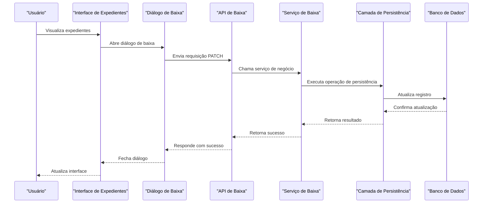
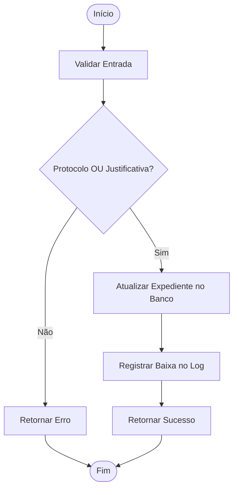
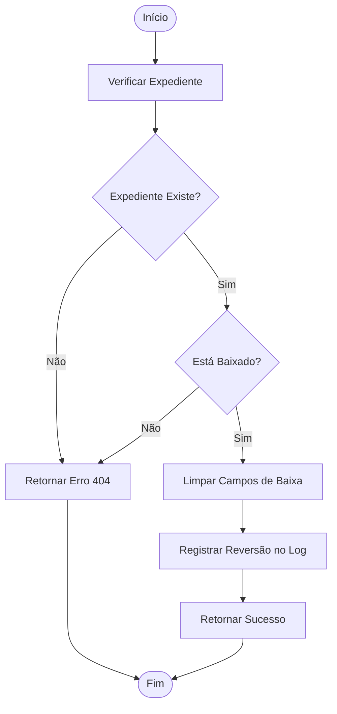
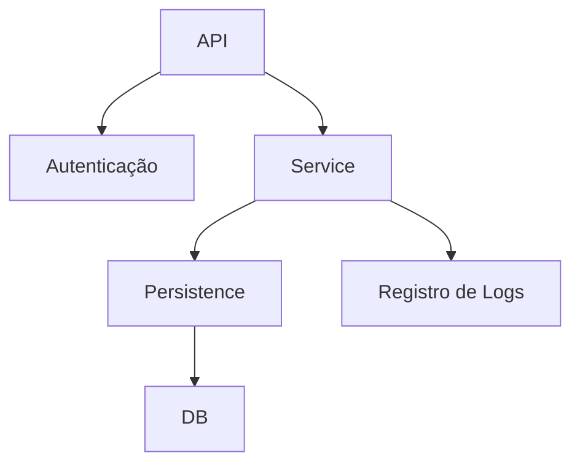

# Expedientes Baixa Workflow

<cite>
**Arquivos Referenciados neste Documento**   
- [page.tsx](file://app/(dashboard)/expedientes/page.tsx)
- [baixa-expediente.service.ts](file://backend/pendentes/services/baixa-expediente.service.ts)
- [baixa-expediente-persistence.service.ts](file://backend/pendentes/services/persistence/baixa-expediente-persistence.service.ts)
- [expedientes-baixar-dialog.tsx](file://components/expedientes-baixar-dialog.tsx)
- [expedientes-reverter-baixa-dialog.tsx](file://components/expedientes-reverter-baixa-dialog.tsx)
- [route.ts](file://app/api/pendentes-manifestacao/[id]/baixa/route.ts)
- [route.ts](file://app/api/pendentes-manifestacao/[id]/reverter-baixa/route.ts)
</cite>

## Sumário
1. [Introdução](#introdução)
2. [Estrutura do Projeto](#estrutura-do-projeto)
3. [Componentes Principais](#componentes-principais)
4. [Visão Geral da Arquitetura](#visão-geral-da-arquitetura)
5. [Análise Detalhada dos Componentes](#análise-detalhada-dos-componentes)
6. [Análise de Dependências](#análise-de-dependências)
7. [Considerações de Desempenho](#considerações-de-desempenho)
8. [Guia de Solução de Problemas](#guia-de-solução-de-problemas)
9. [Conclusão](#conclusão)

## Introdução
Este documento fornece uma análise detalhada do fluxo de trabalho de baixa de expedientes no sistema Sinesys, utilizado pelo escritório Zattar Advogados. O fluxo permite que os usuários marquem expedientes pendentes de manifestação como "baixados" (respondidos) e revertam essa ação quando necessário. O sistema foi projetado para garantir rastreabilidade, validação de dados e integridade das informações jurídicas.

## Estrutura do Projeto
A funcionalidade de baixa de expedientes está distribuída entre diferentes camadas da aplicação, seguindo uma arquitetura modular e escalável. Os principais diretórios envolvidos são:

- `app/(dashboard)/expedientes/`: Contém a interface de usuário para visualização e gerenciamento de expedientes.
- `backend/pendentes/services/`: Implementa a lógica de negócio para operações de baixa e reversão.
- `components/`: Armazena componentes reutilizáveis da interface, como diálogos de baixa e reversão.
- `app/api/pendentes-manifestacao/[id]/`: Define as rotas da API para baixar e reverter expedientes.

```mermaid
graph TB
subgraph "Frontend"
UI[Interface de Expedientes]
Dialogs[Diálogos de Baixa e Reversão]
end
subgraph "API"
API[Rotas de Baixa e Reversão]
end
subgraph "Backend"
Services[Serviços de Negócio]
Persistence[Camada de Persistência]
Database[(Banco de Dados)]
end
UI --> Dialogs
Dialogs --> API
API --> Services
Services --> Persistence
Persistence --> Database
```

**Fontes do Diagrama**
- [page.tsx](file://app/(dashboard)/expedientes/page.tsx)
- [expedientes-baixar-dialog.tsx](file://components/expedientes-baixar-dialog.tsx)
- [expedientes-reverter-baixa-dialog.tsx](file://components/expedientes-reverter-baixa-dialog.tsx)
- [route.ts](file://app/api/pendentes-manifestacao/[id]/baixa/route.ts)
- [route.ts](file://app/api/pendentes-manifestacao/[id]/reverter-baixa/route.ts)

**Fontes da Seção**
- [page.tsx](file://app/(dashboard)/expedientes/page.tsx)

## Componentes Principais
Os componentes principais do fluxo de baixa de expedientes incluem a página de listagem, os diálogos de baixa e reversão, e os serviços de backend que processam as operações. A integração entre frontend e backend é feita através de chamadas à API, garantindo separação clara de responsabilidades.

**Fontes da Seção**
- [page.tsx](file://app/(dashboard)/expedientes/page.tsx)
- [expedientes-baixar-dialog.tsx](file://components/expedientes-baixar-dialog.tsx)
- [expedientes-reverter-baixa-dialog.tsx](file://components/expedientes-reverter-baixa-dialog.tsx)

## Visão Geral da Arquitetura
O fluxo de baixa de expedientes segue um padrão de arquitetura em camadas, onde cada camada tem responsabilidades bem definidas. A interface do usuário interage com os serviços de backend através de uma API RESTful, que valida as requisições e coordena as operações de persistência.



**Fontes do Diagrama**
- [page.tsx](file://app/(dashboard)/expedientes/page.tsx)
- [expedientes-baixar-dialog.tsx](file://components/expedientes-baixar-dialog.tsx)
- [route.ts](file://app/api/pendentes-manifestacao/[id]/baixa/route.ts)
- [baixa-expediente.service.ts](file://backend/pendentes/services/baixa-expediente.service.ts)
- [baixa-expediente-persistence.service.ts](file://backend/pendentes/services/persistence/baixa-expediente-persistence.service.ts)

## Análise Detalhada dos Componentes

### Análise do Componente de Baixa de Expediente
O componente de baixa de expediente permite que o usuário marque um expediente como respondido, fornecendo um ID de protocolo ou uma justificativa. O sistema valida que pelo menos um dos dois campos seja preenchido antes de prosseguir.



**Fontes do Diagrama**
- [expedientes-baixar-dialog.tsx](file://components/expedientes-baixar-dialog.tsx)
- [baixa-expediente.service.ts](file://backend/pendentes/services/baixa-expediente.service.ts)
- [baixa-expediente-persistence.service.ts](file://backend/pendentes/services/persistence/baixa-expediente-persistence.service.ts)

**Fontes da Seção**
- [expedientes-baixar-dialog.tsx](file://components/expedientes-baixar-dialog.tsx)
- [baixa-expediente.service.ts](file://backend/pendentes/services/baixa-expediente.service.ts)

### Análise do Componente de Reversão de Baixa
O componente de reversão de baixa permite que o usuário reverta a baixa de um expediente, marcando-o novamente como pendente. O sistema remove os dados de protocolo e justificativa, mas mantém o registro da ação nos logs.



**Fontes do Diagrama**
- [expedientes-reverter-baixa-dialog.tsx](file://components/expedientes-reverter-baixa-dialog.tsx)
- [reverter-baixa.service.ts](file://backend/pendentes/services/reverter-baixa.service.ts)
- [reverter-baixa-persistence.service.ts](file://backend/pendentes/services/persistence/reverter-baixa-persistence.service.ts)

**Fontes da Seção**
- [expedientes-reverter-baixa-dialog.tsx](file://components/expedientes-reverter-baixa-dialog.tsx)
- [reverter-baixa.service.ts](file://backend/pendentes/services/reverter-baixa.service.ts)

## Análise de Dependências
O fluxo de baixa de expedientes depende de várias camadas do sistema, incluindo autenticação, persistência e registro de logs. As principais dependências são:

- **Autenticação**: O sistema valida a identidade do usuário antes de executar qualquer operação.
- **Persistência**: A camada de persistência interage diretamente com o banco de dados para atualizar registros.
- **Logs**: Todas as operações são registradas para fins de auditoria e rastreabilidade.



**Fontes do Diagrama**
- [route.ts](file://app/api/pendentes-manifestacao/[id]/baixa/route.ts)
- [route.ts](file://app/api/pendentes-manifestacao/[id]/reverter-baixa/route.ts)
- [baixa-expediente.service.ts](file://backend/pendentes/services/baixa-expediente.service.ts)
- [reverter-baixa.service.ts](file://backend/pendentes/services/reverter-baixa.service.ts)

**Fontes da Seção**
- [route.ts](file://app/api/pendentes-manifestacao/[id]/baixa/route.ts)
- [route.ts](file://app/api/pendentes-manifestacao/[id]/reverter-baixa/route.ts)

## Considerações de Desempenho
O sistema foi projetado para minimizar o número de chamadas ao banco de dados, utilizando cache quando possível. As operações de baixa e reversão são atômicas e rápidas, garantindo uma experiência de usuário responsiva. A validação de entrada é realizada no frontend e no backend para evitar chamadas desnecessárias ao banco de dados.

## Guia de Solução de Problemas
Problemas comuns no fluxo de baixa de expedientes incluem falhas de autenticação, dados inválidos e erros de conexão com o banco de dados. O sistema fornece mensagens de erro claras para ajudar na identificação e resolução de problemas.

**Fontes da Seção**
- [route.ts](file://app/api/pendentes-manifestacao/[id]/baixa/route.ts)
- [route.ts](file://app/api/pendentes-manifestacao/[id]/reverter-baixa/route.ts)
- [expedientes-baixar-dialog.tsx](file://components/expedientes-baixar-dialog.tsx)
- [expedientes-reverter-baixa-dialog.tsx](file://components/expedientes-reverter-baixa-dialog.tsx)

## Conclusão
O fluxo de trabalho de baixa de expedientes no sistema Sinesys é robusto, seguro e fácil de usar. A arquitetura em camadas garante separação clara de responsabilidades, enquanto a validação rigorosa de dados e o registro de logs asseguram a integridade das informações jurídicas. O sistema permite que os usuários gerenciem eficientemente seus expedientes pendentes, com a capacidade de reverter ações quando necessário.