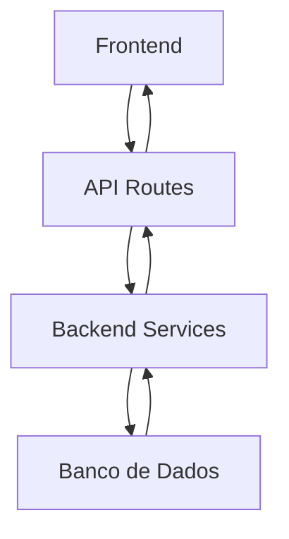
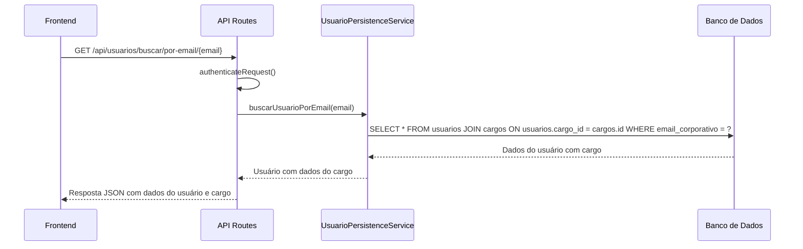
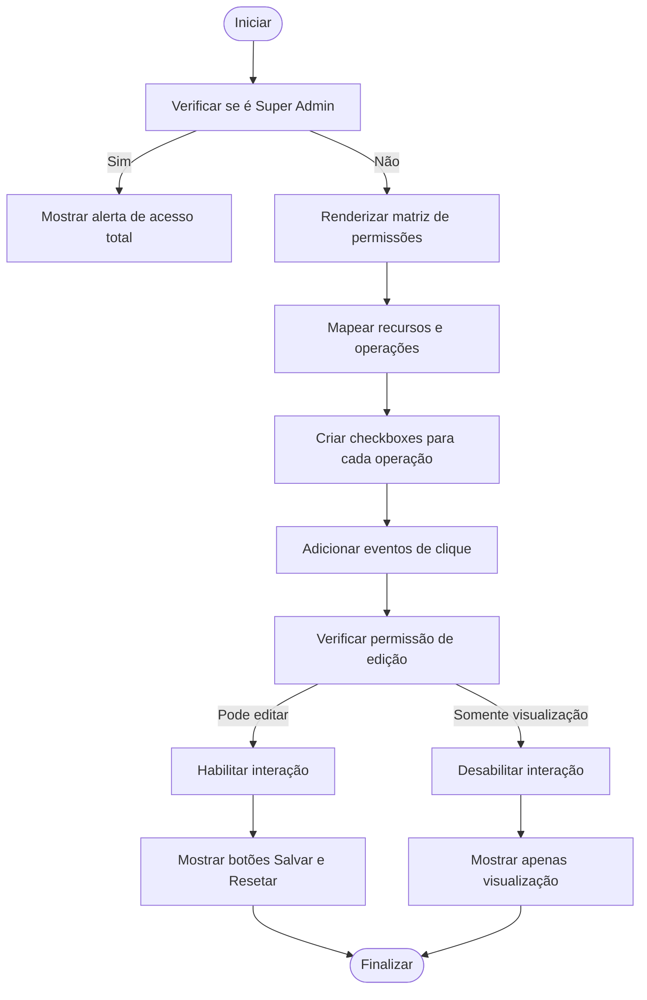
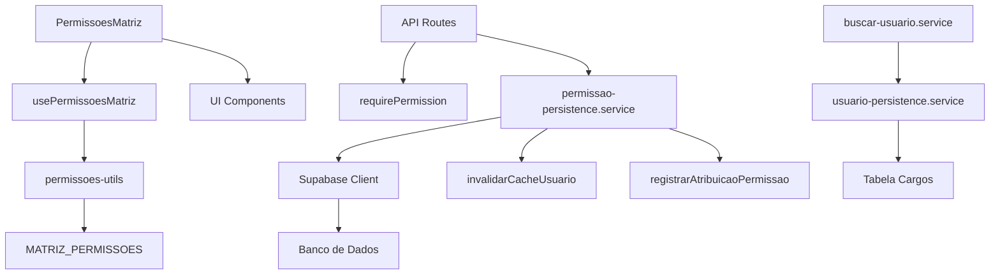

# Gestão Usuários Permissões

<cite>
**Arquivos Referenciados neste Documento**   
- [route.ts](file://app/api/permissoes/recursos/route.ts)
- [route.ts](file://app/api/permissoes/usuarios/[id]/route.ts)
- [permissao-persistence.service.ts](file://backend/permissoes/services/persistence/permissao-persistence.service.ts)
- [permissoes-matriz.tsx](file://components/usuarios/permissoes-matriz.tsx)
- [use-permissoes-matriz.ts](file://lib/hooks/use-permissoes-matriz.ts)
- [permissoes-utils.ts](file://lib/utils/permissoes-utils.ts)
- [08_usuarios.sql](file://supabase/schemas/08_usuarios.sql)
- [20250118120100_create_permissoes.sql](file://supabase/migrations/20250118120100_create_permissoes.sql)
- [usuario-persistence.service.ts](file://backend/usuarios/services/persistence/usuario-persistence.service.ts) - *Atualizado para incluir dados do cargo na consulta por e-mail*
- [route.ts](file://app/api/usuarios/buscar/por-email/[email]/route.ts) - *Consulta por e-mail corporativo atualizada*
</cite>

## Atualização do Sumário
**Alterações Realizadas**   
- Atualização da seção "Introdução" para refletir a inclusão de dados do cargo na consulta por e-mail
- Atualização da seção "Estrutura do Projeto" com novos arquivos afetados
- Atualização da seção "Componentes Principais" com informações sobre a consulta por e-mail
- Atualização da seção "Visão Geral da Arquitetura" com novo diagrama de sequência
- Atualização da seção "Análise Detalhada dos Componentes" com análise do serviço de persistência de usuário
- Sistema de rastreamento de fontes atualizado com novos arquivos analisados

## Sumário
1. [Introdução](#introdução)
2. [Estrutura do Projeto](#estrutura-do-projeto)
3. [Componentes Principais](#componentes-principais)
4. [Visão Geral da Arquitetura](#visão-geral-da-arquitetura)
5. [Análise Detalhada dos Componentes](#análise-detalhada-dos-componentes)
6. [Análise de Dependências](#análise-de-dependências)
7. [Considerações de Desempenho](#considerações-de-desempenho)
8. [Guia de Solução de Problemas](#guia-de-solução-de-problemas)
9. [Conclusão](#conclusão)

## Introdução
Este documento fornece uma análise detalhada do sistema de gestão de permissões para usuários no sistema Sinesys, utilizado pelo escritório de advocacia Zattar Advogados. O sistema implementa um modelo de controle de acesso baseado em permissões granulares, permitindo atribuir direitos específicos por recurso e operação, sem depender de papéis ou cargos fixos. A arquitetura combina camadas frontend e backend com persistência em banco de dados PostgreSQL via Supabase, garantindo segurança, auditoria e escalabilidade. Recentemente, o serviço de persistência de usuário foi atualizado para incluir dados do cargo na consulta por e-mail corporativo, trazendo informações do cargo em uma única consulta.

## Estrutura do Projeto
A estrutura do projeto organiza os componentes relacionados a permissões em diretórios específicos, separando claramente as camadas de frontend, backend e banco de dados. Os principais diretórios envolvidos são:

- `app/api/permissoes`: Rotas da API para gerenciamento de permissões
- `backend/permissoes`: Serviços de persistência e lógica de negócios
- `components/usuarios`: Componentes React para interface de gestão de permissões
- `lib/hooks`: Hooks personalizados para gerenciamento de estado
- `lib/utils`: Utilitários para manipulação de permissões
- `supabase/schemas`: Definições de esquema do banco de dados
- `supabase/migrations`: Migrações do banco de dados



**Fontes do Diagrama**
- [route.ts](file://app/api/permissoes/usuarios/[id]/route.ts)
- [permissao-persistence.service.ts](file://backend/permissoes/services/persistence/permissao-persistence.service.ts)
- [20250118120100_create_permissoes.sql](file://supabase/migrations/20250118120100_create_permissoes.sql)

**Fontes da Seção**
- [app/api/permissoes](file://app/api/permissoes)
- [backend/permissoes](file://backend/permissoes)
- [components/usuarios](file://components/usuarios)
- [backend/usuarios/services/persistence/usuario-persistence.service.ts](file://backend/usuarios/services/persistence/usuario-persistence.service.ts)
- [app/api/usuarios/buscar/por-email/[email]/route.ts](file://app/api/usuarios/buscar/por-email/[email]/route.ts)

## Componentes Principais
Os componentes principais do sistema de permissões incluem rotas API para listagem e manipulação de permissões, serviços de persistência para operações no banco de dados, componentes de interface para visualização e edição, e utilitários para transformação de dados. O sistema permite listar todas as permissões disponíveis, visualizar e modificar permissões por usuário, com suporte a operações em lote e substituição completa. Recentemente, foi implementada uma atualização no serviço de persistência de usuário para incluir dados do cargo na consulta por e-mail corporativo, permitindo que informações do cargo sejam retornadas em uma única consulta.

**Fontes da Seção**
- [route.ts](file://app/api/permissoes/recursos/route.ts)
- [route.ts](file://app/api/permissoes/usuarios/[id]/route.ts)
- [permissao-persistence.service.ts](file://backend/permissoes/services/persistence/permissao-persistence.service.ts)
- [permissoes-matriz.tsx](file://components/usuarios/permissoes-matriz.tsx)
- [usuario-persistence.service.ts](file://backend/usuarios/services/persistence/usuario-persistence.service.ts)
- [route.ts](file://app/api/usuarios/buscar/por-email/[email]/route.ts)

## Visão Geral da Arquitetura
A arquitetura do sistema de permissões segue um padrão de camadas bem definido, com comunicação entre frontend, API, serviços backend e banco de dados. O frontend consome APIs RESTful que validam permissões de acesso antes de delegar para serviços de persistência. Esses serviços interagem com o banco de dados PostgreSQL, aplicando regras de segurança em nível de linha (RLS) e registrando auditorias. A atualização recente permite que a consulta por e-mail corporativo retorne também os dados do cargo do usuário.



**Fontes do Diagrama**
- [route.ts](file://app/api/usuarios/buscar/por-email/[email]/route.ts)
- [usuario-persistence.service.ts](file://backend/usuarios/services/persistence/usuario-persistence.service.ts)

## Análise Detalhada dos Componentes

### Análise do Componente de Matriz de Permissões
O componente `PermissoesMatriz` é responsável por exibir e permitir a edição das permissões de um usuário em formato de matriz, agrupando por recurso e operação. Ele utiliza um layout responsivo com checkboxes para cada permissão, mostrando contadores de permissões ativas e fornecendo confirmação antes de salvar alterações.



**Fontes do Diagrama**
- [permissoes-matriz.tsx](file://components/usuarios/permissoes-matriz.tsx)
- [permissoes-utils.ts](file://lib/utils/permissoes-utils.ts)

**Fontes da Seção**
- [permissoes-matriz.tsx](file://components/usuarios/permissoes-matriz.tsx)
- [use-permissoes-matriz.ts](file://lib/hooks/use-permissoes-matriz.ts)

### Análise do Serviço de Persistência
O serviço `usuario-persistence.service` implementa operações CRUD para usuários, incluindo busca por e-mail corporativo com dados do cargo. A consulta foi atualizada para incluir um JOIN com a tabela de cargos, permitindo retornar informações do cargo em uma única consulta. Cada operação inclui tratamento de erros e formatação adequada dos dados.

```mermaid
classDiagram
class UsuarioPersistenceService {
+buscarUsuarioPorId(usuarioId : number) Promise~Usuario~
+buscarUsuarioPorCpf(cpf : string) Promise~Usuario~
+buscarUsuarioPorEmail(email : string) Promise~Usuario~
+listarUsuarios(params : ListarUsuariosParams) Promise~ListarUsuariosResult~
+criarUsuario(params : UsuarioDados) Promise~OperacaoUsuarioResult~
+atualizarUsuario(id : number, params : Partial<UsuarioDados>) Promise~OperacaoUsuarioResult~
}
class SupabaseClient {
+from(table : string) QueryBuilder
+select(query? : string) QueryBuilder
+eq(column : string, value : any) QueryBuilder
+ilike(column : string, value : string) QueryBuilder
+order(column : string, options : OrderOptions) QueryBuilder
+range(start : number, end : number) QueryBuilder
+single() Promise~{data : T, error : Error}~
}
UsuarioPersistenceService --> SupabaseClient : "usa"
```

**Fontes do Diagrama**
- [usuario-persistence.service.ts](file://backend/usuarios/services/persistence/usuario-persistence.service.ts)

**Fontes da Seção**
- [usuario-persistence.service.ts](file://backend/usuarios/services/persistence/usuario-persistence.service.ts)
- [route.ts](file://app/api/usuarios/buscar/por-email/[email]/route.ts)
- [types.ts](file://backend/types/usuarios/types.ts)

## Análise de Dependências
O sistema de permissões depende de vários componentes internos e serviços externos. As principais dependências incluem o cliente Supabase para acesso ao banco de dados, funções de autenticação e autorização, e utilitários de auditoria. O frontend depende de hooks personalizados e componentes UI para construção da interface. A atualização recente adicionou uma dependência implícita entre o serviço de persistência de usuários e a tabela de cargos.



**Fontes do Diagrama**
- [permissoes-matriz.tsx](file://components/usuarios/permissoes-matriz.tsx)
- [use-permissoes-matriz.ts](file://lib/hooks/use-permissoes-matriz.ts)
- [permissao-persistence.service.ts](file://backend/permissoes/services/persistence/permissao-persistence.service.ts)
- [usuario-persistence.service.ts](file://backend/usuarios/services/persistence/usuario-persistence.service.ts)

**Fontes da Seção**
- [package.json](file://package.json)
- [backend/utils](file://backend/utils)
- [components/ui](file://components/ui)
- [backend/usuarios/services/persistence/usuario-persistence.service.ts](file://backend/usuarios/services/persistence/usuario-persistence.service.ts)

## Considerações de Desempenho
O sistema implementa várias otimizações de desempenho, incluindo cache de permissões, índices de banco de dados para consultas frequentes, e operações em lote para minimizar round trips. A invalidação de cache após alterações garante consistência, enquanto os índices no banco de dados aceleram consultas de verificação de permissões. A atualização recente para incluir dados do cargo na consulta por e-mail pode impactar o desempenho, mas o uso de índices adequados na tabela de cargos minimiza esse impacto.

**Fontes da Seção**
- [permissao-persistence.service.ts](file://backend/permissoes/services/persistence/permissao-persistence.service.ts)
- [20250118120100_create_permissoes.sql](file://supabase/migrations/20250118120100_create_permissoes.sql)
- [authorization.ts](file://backend/utils/auth/authorization.ts)
- [usuario-persistence.service.ts](file://backend/usuarios/services/persistence/usuario-persistence.service.ts)

## Guia de Solução de Problemas
Problemas comuns no sistema de permissões incluem falhas de autenticação, erros de autorização, problemas de sincronização entre frontend e backend, e inconsistências no banco de dados. O sistema inclui logs de auditoria detalhados e mensagens de erro específicas para facilitar a depuração. Para problemas relacionados à consulta por e-mail corporativo, verifique se o usuário existe e se o cargo associado está ativo.

**Fontes da Seção**
- [route.ts](file://app/api/permissoes/usuarios/[id]/route.ts)
- [permissao-persistence.service.ts](file://backend/permissoes/services/persistence/permissao-persistence.service.ts)
- [auditoria-permissoes.ts](file://backend/utils/logs/auditoria-permissoes.ts)
- [route.ts](file://app/api/usuarios/buscar/por-email/[email]/route.ts)

## Conclusão
O sistema de gestão de permissões para usuários no Sinesys é uma implementação robusta e flexível de controle de acesso baseado em permissões granulares. Sua arquitetura modular separa claramente as camadas de apresentação, lógica de negócios e persistência, facilitando manutenção e escalabilidade. A combinação de segurança, auditoria e interface intuitiva torna o sistema adequado para ambientes corporativos complexos como escritórios de advocacia. A atualização recente para incluir dados do cargo na consulta por e-mail corporativo melhora a eficiência do sistema, permitindo obter informações completas do usuário em uma única chamada.