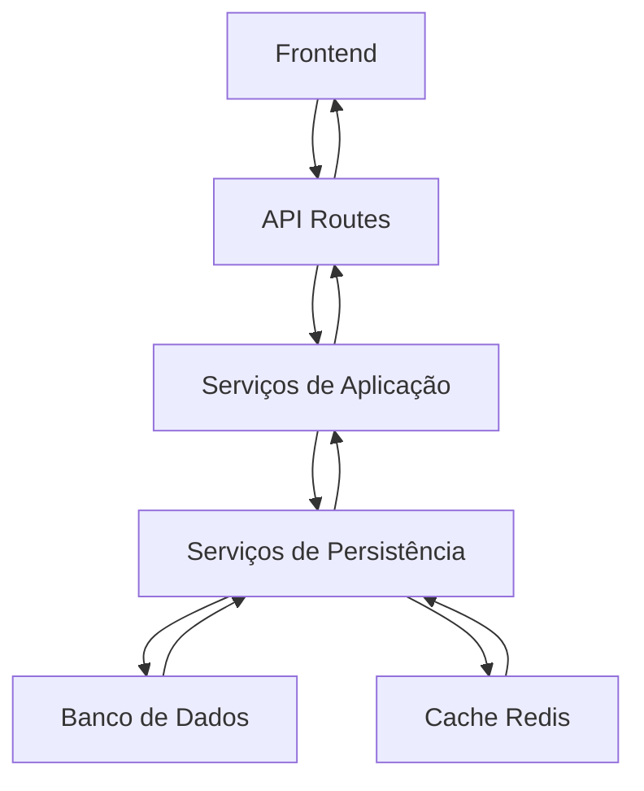
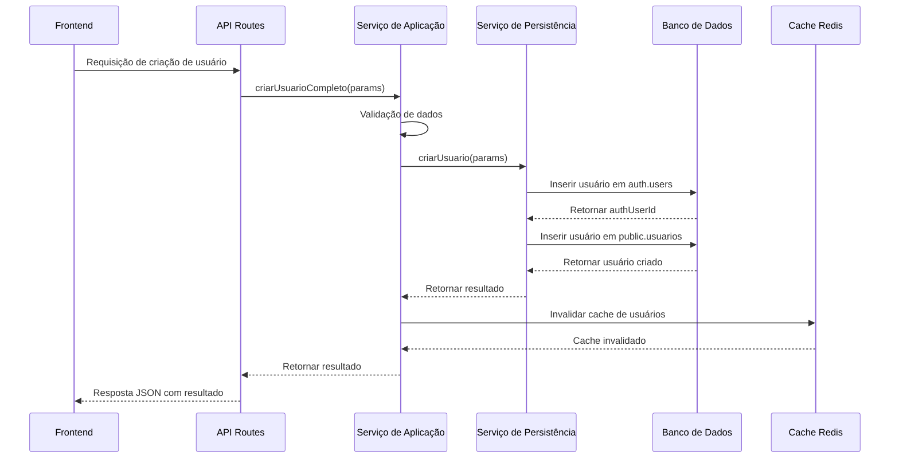
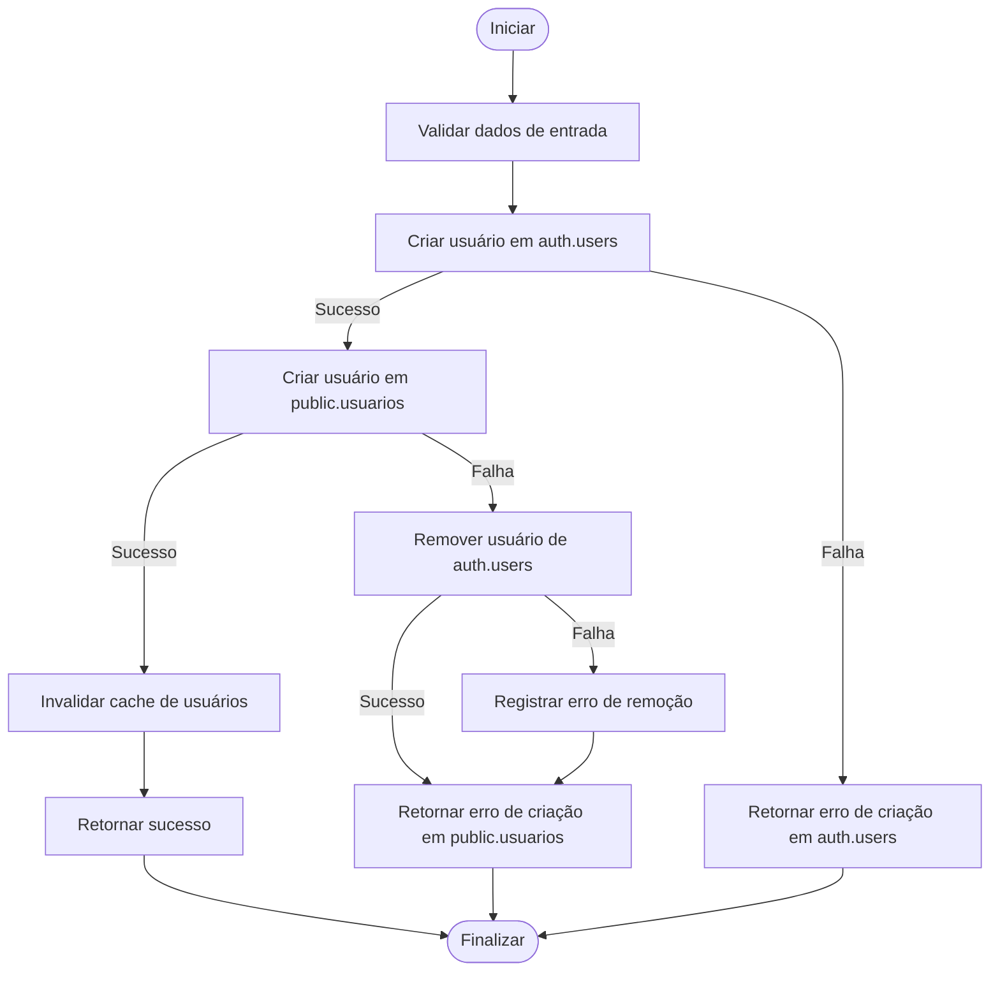
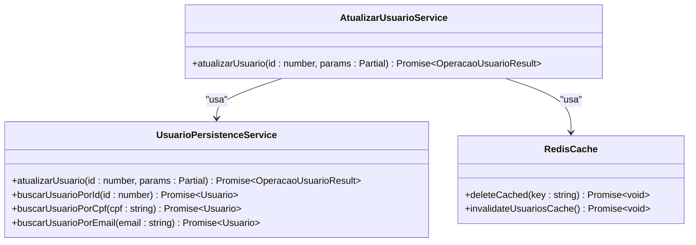
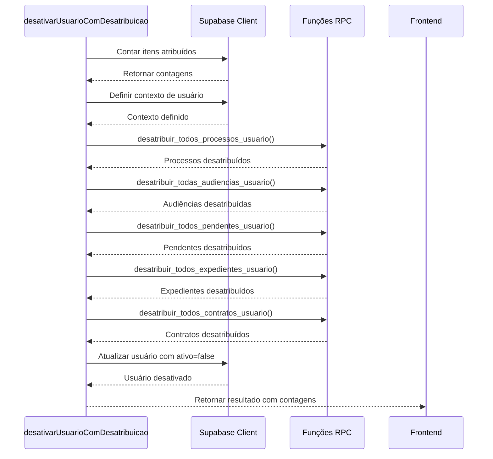
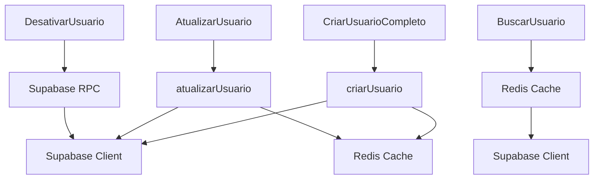

# Gestão Usuários Permissões

<cite>
**Arquivos Referenciados neste Documento**   
- [criar-usuario-completo.service.ts](file://backend/usuarios/services/usuarios/criar-usuario-completo.service.ts)
- [atualizar-usuario.service.ts](file://backend/usuarios/services/usuarios/atualizar-usuario.service.ts)
- [desativar-usuario.service.ts](file://backend/usuarios/services/usuarios/desativar-usuario.service.ts)
- [usuario-persistence.service.ts](file://backend/usuarios/services/persistence/usuario-persistence.service.ts)
- [criar-usuario.service.ts](file://backend/usuarios/services/usuarios/criar-usuario.service.ts)
- [listar-usuarios.service.ts](file://backend/usuarios/services/usuarios/listar-usuarios.service.ts)
- [08_usuarios.sql](file://supabase/schemas/08_usuarios.sql)
</cite>

## Atualização do Sumário
**Alterações Realizadas**   
- Atualização da seção "Introdução" para refletir a refatoração completa do módulo de gestão de usuários com nova arquitetura feature-sliced
- Atualização da seção "Estrutura do Projeto" com nova organização de serviços e camadas
- Adição da seção "Visão Geral da Arquitetura Feature-Sliced" para documentar a nova arquitetura
- Adição da seção "Análise Detalhada dos Componentes" com análise dos novos serviços de criação, atualização e desativação
- Atualização da seção "Análise de Dependências" com novas dependências de cache Redis e validação
- Atualização da seção "Considerações de Desempenho" com estratégias de cache e invalidação
- Sistema de rastreamento de fontes atualizado com novos arquivos analisados

## Sumário
1. [Introdução](#introdução)
2. [Estrutura do Projeto](#estrutura-do-projeto)
3. [Componentes Principais](#componentes-principais)
4. [Visão Geral da Arquitetura Feature-Sliced](#visão-geral-da-arquitetura-feature-sliced)
5. [Análise Detalhada dos Componentes](#análise-detalhada-dos-componentes)
6. [Análise de Dependências](#análise-de-dependências)
7. [Considerações de Desempenho](#considerações-de-desempenho)
8. [Guia de Solução de Problemas](#guia-de-solução-de-problemas)
9. [Conclusão](#conclusão)

## Introdução
Este documento fornece uma análise detalhada do sistema de gestão de usuários no sistema Sinesys, que passou por uma refatoração completa com nova arquitetura feature-sliced. O sistema implementa um modelo robusto de gestão de usuários com validação Zod, padrão repository, server actions e utilitários de formatação. A arquitetura combina camadas frontend e backend com persistência em banco de dados PostgreSQL via Supabase, garantindo segurança, auditoria e escalabilidade. A implementação inclui lógica robusta para criação, atualização e desativação de usuários com verificação de duplicatas e cache Redis.

## Estrutura do Projeto
A estrutura do projeto foi refatorada para seguir o padrão feature-sliced, organizando os componentes relacionados a usuários em diretórios específicos que separam claramente as camadas de serviço, persistência e utilitários. Os principais diretórios envolvidos são:

- `backend/usuarios/services/usuarios`: Serviços de aplicação para operações de usuário
- `backend/usuarios/services/persistence`: Serviços de persistência para operações no banco de dados
- `backend/usuarios/services/avatar`: Serviços específicos para manipulação de avatar
- `backend/utils/redis`: Utilitários para cache e invalidação de cache
- `supabase/schemas`: Definições de esquema do banco de dados
- `supabase/migrations`: Migrações do banco de dados



**Fontes do Diagrama**
- [criar-usuario-completo.service.ts](file://backend/usuarios/services/usuarios/criar-usuario-completo.service.ts)
- [usuario-persistence.service.ts](file://backend/usuarios/services/persistence/usuario-persistence.service.ts)
- [08_usuarios.sql](file://supabase/schemas/08_usuarios.sql)

**Fontes da Seção**
- [backend/usuarios/services/usuarios](file://backend/usuarios/services/usuarios)
- [backend/usuarios/services/persistence](file://backend/usuarios/services/persistence)
- [backend/utils/redis](file://backend/utils/redis)
- [supabase/schemas](file://supabase/schemas)

## Componentes Principais
Os componentes principais do sistema de gestão de usuários incluem serviços de aplicação para criação, atualização e desativação de usuários, serviços de persistência para operações no banco de dados, e utilitários para cache e formatação. O sistema implementa uma arquitetura feature-sliced com separação clara entre camadas de serviço e persistência. Os serviços de aplicação contêm a lógica de negócio e validação, enquanto os serviços de persistência gerenciam diretamente as operações no banco de dados.

**Fontes da Seção**
- [criar-usuario-completo.service.ts](file://backend/usuarios/services/usuarios/criar-usuario-completo.service.ts)
- [atualizar-usuario.service.ts](file://backend/usuarios/services/usuarios/atualizar-usuario.service.ts)
- [desativar-usuario.service.ts](file://backend/usuarios/services/usuarios/desativar-usuario.service.ts)
- [usuario-persistence.service.ts](file://backend/usuarios/services/persistence/usuario-persistence.service.ts)

## Visão Geral da Arquitetura Feature-Sliced
A arquitetura do sistema de gestão de usuários segue um padrão feature-sliced bem definido, com comunicação entre frontend, API, serviços de aplicação, serviços de persistência e banco de dados. O frontend consome APIs RESTful que delegam para serviços de aplicação, que por sua vez utilizam serviços de persistência para interagir com o banco de dados PostgreSQL. A arquitetura implementa o padrão repository e utiliza cache Redis para melhorar o desempenho.



**Fontes do Diagrama**
- [criar-usuario-completo.service.ts](file://backend/usuarios/services/usuarios/criar-usuario-completo.service.ts)
- [usuario-persistence.service.ts](file://backend/usuarios/services/persistence/usuario-persistence.service.ts)

## Análise Detalhada dos Componentes

### Análise do Serviço de Criação de Usuário Completo
O serviço `criarUsuarioCompleto` implementa a lógica para criar um usuário completo no sistema, incluindo a criação em ambos `auth.users` e `public.usuarios`. O serviço segue um fluxo transacional onde primeiro cria o usuário em `auth.users` e depois em `public.usuarios`, com tratamento de erro para remover o usuário de `auth.users` caso a criação em `public.usuarios` falhe.



**Fontes do Diagrama**
- [criar-usuario-completo.service.ts](file://backend/usuarios/services/usuarios/criar-usuario-completo.service.ts)

**Fontes da Seção**
- [criar-usuario-completo.service.ts](file://backend/usuarios/services/usuarios/criar-usuario-completo.service.ts)
- [usuario-persistence.service.ts](file://backend/usuarios/services/persistence/usuario-persistence.service.ts)

### Análise do Serviço de Atualização de Usuário
O serviço `atualizarUsuario` implementa a lógica para atualizar um usuário existente, com validações robustas para prevenir duplicatas em campos únicos como CPF e e-mail corporativo. O serviço verifica a existência do usuário, valida os dados de entrada, verifica duplicidades e atualiza o registro no banco de dados.



**Fontes do Diagrama**
- [atualizar-usuario.service.ts](file://backend/usuarios/services/usuarios/atualizar-usuario.service.ts)
- [usuario-persistence.service.ts](file://backend/usuarios/services/persistence/usuario-persistence.service.ts)

**Fontes da Seção**
- [atualizar-usuario.service.ts](file://backend/usuarios/services/usuarios/atualizar-usuario.service.ts)
- [usuario-persistence.service.ts](file://backend/usuarios/services/persistence/usuario-persistence.service.ts)

### Análise do Serviço de Desativação de Usuário
O serviço `desativarUsuarioComDesatribuicao` implementa a lógica para desativar um usuário e desatribuir automaticamente todos os itens atribuídos a ele. O serviço conta os itens atribuídos antes da desativação, define o contexto do usuário que está executando a operação, desatribui os itens usando funções RPC e finalmente desativa o usuário.



**Fontes do Diagrama**
- [desativar-usuario.service.ts](file://backend/usuarios/services/usuarios/desativar-usuario.service.ts)

**Fontes da Seção**
- [desativar-usuario.service.ts](file://backend/usuarios/services/usuarios/desativar-usuario.service.ts)
- [usuario-persistence.service.ts](file://backend/usuarios/services/persistence/usuario-persistence.service.ts)

### Análise do Serviço de Persistência
O serviço `usuario-persistence.service` implementa operações CRUD para usuários com validações robustas, verificação de duplicatas e gerenciamento de cache. O serviço utiliza cache Redis para melhorar o desempenho das operações de leitura e implementa invalidação de cache após operações de escrita.

```mermaid
classDiagram
class UsuarioPersistenceService {
+criarUsuario(params : UsuarioDados) Promise~OperacaoUsuarioResult~
+atualizarUsuario(id : number, params : Partial<UsuarioDados>) Promise~OperacaoUsuarioResult~
+buscarUsuarioPorId(id : number) Promise~Usuario~
+buscarUsuarioPorCpf(cpf : string) Promise~Usuario~
+buscarUsuarioPorEmail(email : string) Promise~Usuario~
+listarUsuarios(params : ListarUsuariosParams) Promise~ListarUsuariosResult~
}
class SupabaseClient {
+from(table : string) QueryBuilder
+select(query? : string) QueryBuilder
+eq(column : string, value : any) QueryBuilder
+ilike(column : string, value : string) QueryBuilder
+order(column : string, options : OrderOptions) QueryBuilder
+range(start : number, end : number) QueryBuilder
+single() Promise~{data : T, error : Error}~
+insert(data : object) QueryBuilder
+update(data : object) QueryBuilder
}
class RedisCache {
+getCached(key : string) Promise~T~
+setCached(key : string, value : T) Promise~void~
+deleteCached(key : string) Promise~void~
+invalidateUsuariosCache() Promise~void~
}
UsuarioPersistenceService --> SupabaseClient : "usa"
UsuarioPersistenceService --> RedisCache : "usa"
```

**Fontes do Diagrama**
- [usuario-persistence.service.ts](file://backend/usuarios/services/persistence/usuario-persistence.service.ts)

**Fontes da Seção**
- [usuario-persistence.service.ts](file://backend/usuarios/services/persistence/usuario-persistence.service.ts)
- [criar-usuario.service.ts](file://backend/usuarios/services/usuarios/criar-usuario.service.ts)
- [listar-usuarios.service.ts](file://backend/usuarios/services/usuarios/listar-usuarios.service.ts)

## Análise de Dependências
O sistema de gestão de usuários depende de vários componentes internos e serviços externos. As principais dependências incluem o cliente Supabase para acesso ao banco de dados, funções de autenticação e autorização, utilitários de auditoria e cache Redis. Os serviços de aplicação dependem dos serviços de persistência para operações no banco de dados, e ambos dependem dos utilitários de cache para gerenciamento de desempenho.



**Fontes do Diagrama**
- [criar-usuario-completo.service.ts](file://backend/usuarios/services/usuarios/criar-usuario-completo.service.ts)
- [atualizar-usuario.service.ts](file://backend/usuarios/services/usuarios/atualizar-usuario.service.ts)
- [desativar-usuario.service.ts](file://backend/usuarios/services/usuarios/desativar-usuario.service.ts)
- [usuario-persistence.service.ts](file://backend/usuarios/services/persistence/usuario-persistence.service.ts)

**Fontes da Seção**
- [package.json](file://package.json)
- [backend/utils](file://backend/utils)
- [backend/usuarios/services/persistence/usuario-persistence.service.ts](file://backend/usuarios/services/persistence/usuario-persistence.service.ts)

## Considerações de Desempenho
O sistema implementa várias otimizações de desempenho, incluindo cache de usuários em Redis, índices de banco de dados para consultas frequentes, e invalidação de cache após alterações para garantir consistência. O cache utiliza chaves específicas para diferentes tipos de consultas (por ID, CPF, e-mail) e implementa invalidação em cascata para manter a consistência dos dados.

**Fontes da Seção**
- [usuario-persistence.service.ts](file://backend/usuarios/services/persistence/usuario-persistence.service.ts)
- [08_usuarios.sql](file://supabase/schemas/08_usuarios.sql)
- [redis](file://backend/utils/redis)

## Guia de Solução de Problemas
Problemas comuns no sistema de gestão de usuários incluem falhas na criação de usuários devido a duplicatas, erros de autenticação, problemas de sincronização entre `auth.users` e `public.usuarios`, e inconsistências no cache. O sistema inclui logs detalhados para facilitar a depuração, com mensagens específicas para cada tipo de erro.

**Fontes da Seção**
- [criar-usuario-completo.service.ts](file://backend/usuarios/services/usuarios/criar-usuario-completo.service.ts)
- [atualizar-usuario.service.ts](file://backend/usuarios/services/usuarios/atualizar-usuario.service.ts)
- [desativar-usuario.service.ts](file://backend/usuarios/services/usuarios/desativar-usuario.service.ts)
- [usuario-persistence.service.ts](file://backend/usuarios/services/persistence/usuario-persistence.service.ts)

## Conclusão
O sistema de gestão de usuários no Sinesys é uma implementação robusta e escalável que segue os princípios de arquitetura feature-sliced. Sua arquitetura modular separa claramente as camadas de aplicação, persistência e cache, facilitando manutenção e escalabilidade. A combinação de validações robustas, verificação de duplicatas, cache Redis e integração com Supabase Auth torna o sistema adequado para ambientes corporativos complexos como escritórios de advocacia. A refatoração completa com nova arquitetura melhora significativamente a manutenibilidade e a confiabilidade do sistema.