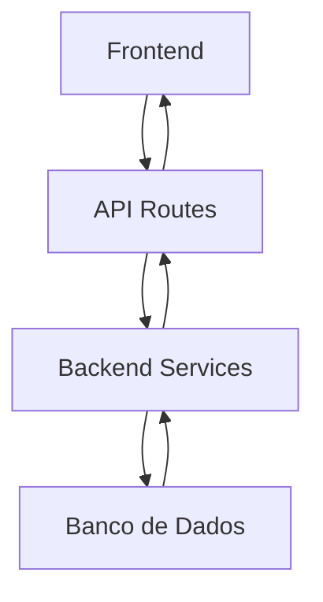
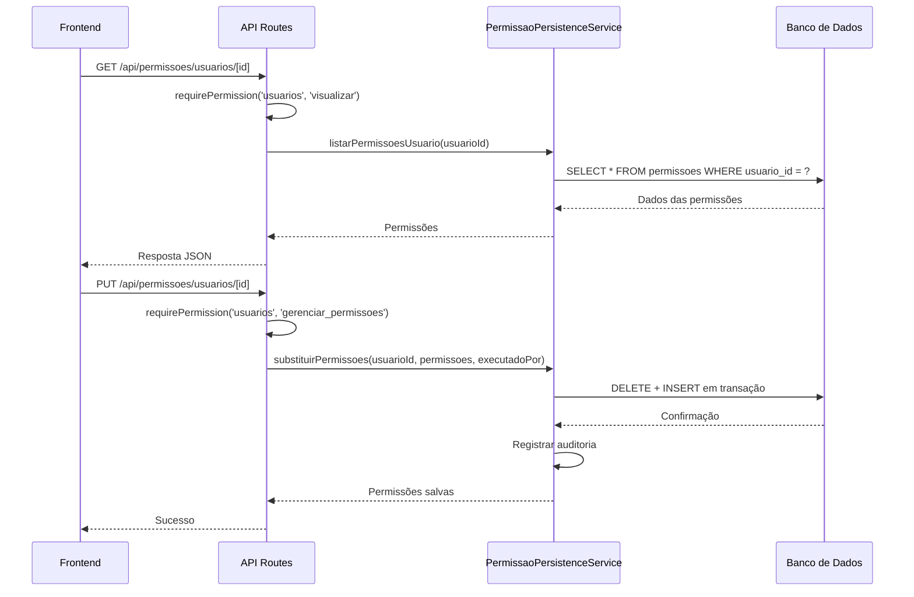
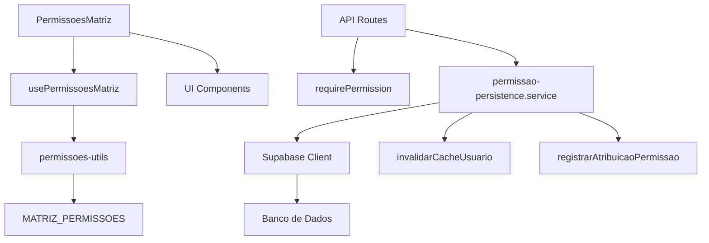

# Gestao Usuarios Permissoes

<cite>
**Arquivos Referenciados neste Documento**   
- [route.ts](file://app/api/permissoes/recursos/route.ts)
- [route.ts](file://app/api/permissoes/usuarios/[id]/route.ts)
- [permissao-persistence.service.ts](file://backend/permissoes/services/persistence/permissao-persistence.service.ts)
- [permissoes-matriz.tsx](file://components/usuarios/permissoes-matriz.tsx)
- [use-permissoes-matriz.ts](file://lib/hooks/use-permissoes-matriz.ts)
- [permissoes-utils.ts](file://lib/utils/permissoes-utils.ts)
- [08_usuarios.sql](file://supabase/schemas/08_usuarios.sql)
- [20250118120100_create_permissoes.sql](file://supabase/migrations/20250118120100_create_permissoes.sql)
</cite>

## Sumário
1. [Introdução](#introdução)
2. [Estrutura do Projeto](#estrutura-do-projeto)
3. [Componentes Principais](#componentes-principais)
4. [Visão Geral da Arquitetura](#visão-geral-da-arquitetura)
5. [Análise Detalhada dos Componentes](#análise-detalhada-dos-componentes)
6. [Análise de Dependências](#análise-de-dependências)
7. [Considerações de Desempenho](#considerações-de-desempenho)
8. [Guia de Solução de Problemas](#guia-de-solução-de-problemas)
9. [Conclusão](#conclusão)

## Introdução
Este documento fornece uma análise detalhada do sistema de gestão de permissões para usuários no sistema Sinesys, utilizado pelo escritório de advocacia Zattar Advogados. O sistema implementa um modelo de controle de acesso baseado em permissões granulares, permitindo atribuir direitos específicos por recurso e operação, sem depender de papéis ou cargos fixos. A arquitetura combina camadas frontend e backend com persistência em banco de dados PostgreSQL via Supabase, garantindo segurança, auditoria e escalabilidade.

## Estrutura do Projeto
A estrutura do projeto organiza os componentes relacionados a permissões em diretórios específicos, separando claramente as camadas de frontend, backend e banco de dados. Os principais diretórios envolvidos são:

- `app/api/permissoes`: Rotas da API para gerenciamento de permissões
- `backend/permissoes`: Serviços de persistência e lógica de negócios
- `components/usuarios`: Componentes React para interface de gestão de permissões
- `lib/hooks`: Hooks personalizados para gerenciamento de estado
- `lib/utils`: Utilitários para manipulação de permissões
- `supabase/schemas`: Definições de esquema do banco de dados
- `supabase/migrations`: Migrações do banco de dados



**Fontes do Diagrama**
- [route.ts](file://app/api/permissoes/usuarios/[id]/route.ts)
- [permissao-persistence.service.ts](file://backend/permissoes/services/persistence/permissao-persistence.service.ts)
- [20250118120100_create_permissoes.sql](file://supabase/migrations/20250118120100_create_permissoes.sql)

**Fontes da Seção**
- [app/api/permissoes](file://app/api/permissoes)
- [backend/permissoes](file://backend/permissoes)
- [components/usuarios](file://components/usuarios)

## Componentes Principais
Os componentes principais do sistema de permissões incluem rotas API para listagem e manipulação de permissões, serviços de persistência para operações no banco de dados, componentes de interface para visualização e edição, e utilitários para transformação de dados. O sistema permite listar todas as permissões disponíveis, visualizar e modificar permissões por usuário, com suporte a operações em lote e substituição completa.

**Fontes da Seção**
- [route.ts](file://app/api/permissoes/recursos/route.ts)
- [route.ts](file://app/api/permissoes/usuarios/[id]/route.ts)
- [permissao-persistence.service.ts](file://backend/permissoes/services/persistence/permissao-persistence.service.ts)
- [permissoes-matriz.tsx](file://components/usuarios/permissoes-matriz.tsx)

## Visão Geral da Arquitetura
A arquitetura do sistema de permissões segue um padrão de camadas bem definido, com comunicação entre frontend, API, serviços backend e banco de dados. O frontend consome APIs RESTful que validam permissões de acesso antes de delegar para serviços de persistência. Esses serviços interagem com o banco de dados PostgreSQL, aplicando regras de segurança em nível de linha (RLS) e registrando auditorias.



**Fontes do Diagrama**
- [route.ts](file://app/api/permissoes/usuarios/[id]/route.ts)
- [permissao-persistence.service.ts](file://backend/permissoes/services/persistence/permissao-persistence.service.ts)

## Análise Detalhada dos Componentes

### Análise do Componente de Matriz de Permissões
O componente `PermissoesMatriz` é responsável por exibir e permitir a edição das permissões de um usuário em formato de matriz, agrupando por recurso e operação. Ele utiliza um layout responsivo com checkboxes para cada permissão, mostrando contadores de permissões ativas e fornecendo confirmação antes de salvar alterações.


**Fontes do Diagrama**
- [permissoes-matriz.tsx](file://components/usuarios/permissoes-matriz.tsx)
- [permissoes-utils.ts](file://lib/utils/permissoes-utils.ts)

**Fontes da Seção**
- [permissoes-matriz.tsx](file://components/usuarios/permissoes-matriz.tsx)
- [use-permissoes-matriz.ts](file://lib/hooks/use-permissoes-matriz.ts)

### Análise do Serviço de Persistência
O serviço `permissao-persistence.service` implementa operações CRUD para permissões, incluindo listagem, verificação, atribuição individual e em lote, revogação e substituição completa. Cada operação inclui invalidação de cache e registro de auditoria, garantindo consistência e rastreabilidade.

```mermaid
classDiagram
class PermissaoPersistenceService {
+listarPermissoesUsuario(usuarioId : number) Promise~Permissao[]~
+verificarPermissao(usuarioId : number, recurso : Recurso, operacao : Operacao) Promise~boolean~
+atribuirPermissao(usuarioId : number, recurso : Recurso, operacao : Operacao, permitido : boolean, executadoPor? : number) Promise~Permissao~
+atribuirPermissoesBatch(usuarioId : number, permissoes : AtribuirPermissaoDTO[], executadoPor? : number) Promise~Permissao[]~
+revogarPermissao(usuarioId : number, recurso : Recurso, operacao : Operacao, executadoPor? : number) Promise~void~
+revogarTodasPermissoes(usuarioId : number) Promise~void~
+substituirPermissoes(usuarioId : number, permissoes : AtribuirPermissaoDTO[], executadoPor? : number) Promise~Permissao[]~
}
class SupabaseClient {
+from(table : string) QueryBuilder
+select(query? : string) QueryBuilder
+eq(column : string, value : any) QueryBuilder
+upsert(data : object | object[], options? : UpsertOptions) QueryBuilder
+delete() QueryBuilder
+single() Promise~{data : T, error : Error}~
}
PermissaoPersistenceService --> SupabaseClient : "usa"
```

**Fontes do Diagrama**
- [permissao-persistence.service.ts](file://backend/permissoes/services/persistence/permissao-persistence.service.ts)

**Fontes da Seção**
- [permissao-persistence.service.ts](file://backend/permissoes/services/persistence/permissao-persistence.service.ts)
- [utils/authorization.ts](file://backend/utils/auth/authorization.ts)
- [utils/auditoria-permissoes.ts](file://backend/utils/logs/auditoria-permissoes.ts)

## Análise de Dependências
O sistema de permissões depende de vários componentes internos e serviços externos. As principais dependências incluem o cliente Supabase para acesso ao banco de dados, funções de autenticação e autorização, e utilitários de auditoria. O frontend depende de hooks personalizados e componentes UI para construção da interface.



**Fontes do Diagrama**
- [permissoes-matriz.tsx](file://components/usuarios/permissoes-matriz.tsx)
- [use-permissoes-matriz.ts](file://lib/hooks/use-permissoes-matriz.ts)
- [permissao-persistence.service.ts](file://backend/permissoes/services/persistence/permissao-persistence.service.ts)

**Fontes da Seção**
- [package.json](file://package.json)
- [backend/utils](file://backend/utils)
- [components/ui](file://components/ui)

## Considerações de Desempenho
O sistema implementa várias otimizações de desempenho, incluindo cache de permissões, índices de banco de dados para consultas frequentes, e operações em lote para minimizar round trips. A invalidação de cache após alterações garante consistência, enquanto os índices no banco de dados aceleram consultas de verificação de permissões.

**Fontes da Seção**
- [permissao-persistence.service.ts](file://backend/permissoes/services/persistence/permissao-persistence.service.ts)
- [20250118120100_create_permissoes.sql](file://supabase/migrations/20250118120100_create_permissoes.sql)
- [authorization.ts](file://backend/utils/auth/authorization.ts)

## Guia de Solução de Problemas
Problemas comuns no sistema de permissões incluem falhas de autenticação, erros de autorização, problemas de sincronização entre frontend e backend, e inconsistências no banco de dados. O sistema inclui logs de auditoria detalhados e mensagens de erro específicas para facilitar a depuração.

**Fontes da Seção**
- [route.ts](file://app/api/permissoes/usuarios/[id]/route.ts)
- [permissao-persistence.service.ts](file://backend/permissoes/services/persistence/permissao-persistence.service.ts)
- [auditoria-permissoes.ts](file://backend/utils/logs/auditoria-permissoes.ts)

## Conclusão
O sistema de gestão de permissões para usuários no Sinesys é uma implementação robusta e flexível de controle de acesso baseado em permissões granulares. Sua arquitetura modular separa claramente as camadas de apresentação, lógica de negócios e persistência, facilitando manutenção e escalabilidade. A combinação de segurança, auditoria e interface intuitiva torna o sistema adequado para ambientes corporativos complexos como escritórios de advocacia.