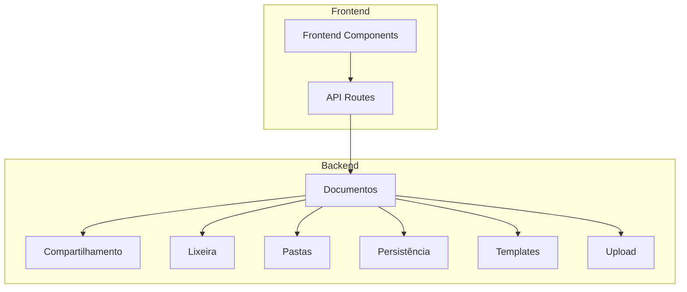
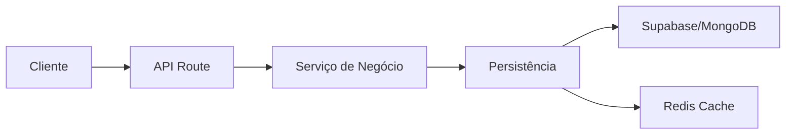
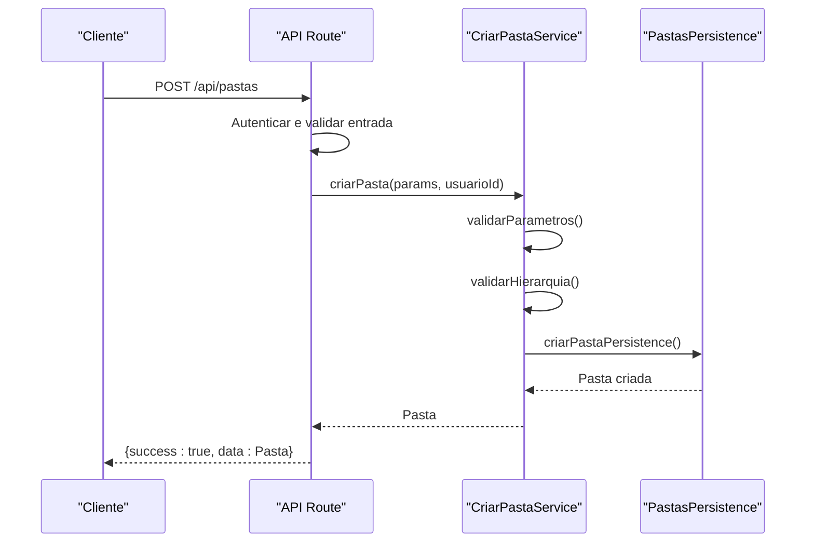
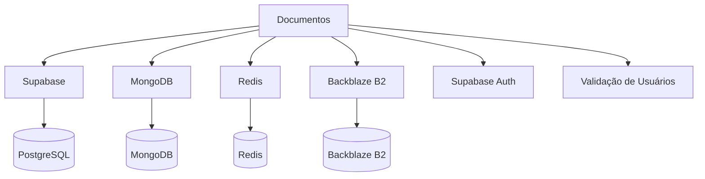

# Gestão de Documentos

<cite>
**Arquivos Referenciados neste Documento**   
- [documentos-persistence.service.ts](file://backend/documentos/services/persistence/documentos-persistence.service.ts)
- [compartilhar-documento.service.ts](file://backend/documentos/services/compartilhamento/compartilhar-documento.service.ts)
- [atualizar-permissao.service.ts](file://backend/documentos/services/compartilhamento/atualizar-permissao.service.ts)
- [listar-compartilhamentos.service.ts](file://backend/documentos/services/compartilhamento/listar-compartilhamentos.service.ts)
- [remover-compartilhamento.service.ts](file://backend/documentos/services/compartilhamento/remover-compartilhamento.service.ts)
- [criar-pasta.service.ts](file://backend/documentos/services/pastas/criar-pasta.service.ts)
- [pastas-persistence.service.ts](file://backend/documentos/services/persistence/pastas-persistence.service.ts)
- [compartilhamento-persistence.service.ts](file://backend/documentos/services/persistence/compartilhamento-persistence.service.ts)
</cite>

## Sumário
1. [Introdução](#introdução)
2. [Estrutura do Projeto](#estrutura-do-projeto)
3. [Componentes Principais](#componentes-principais)
4. [Visão Geral da Arquitetura](#visão-geral-da-arquitetura)
5. [Análise Detalhada dos Componentes](#análise-detalhada-dos-componentes)
6. [Análise de Dependências](#análise-de-dependências)
7. [Considerações de Desempenho](#considerações-de-desempenho)
8. [Guia de Solução de Problemas](#guia-de-solução-de-problemas)
9. [Conclusão](#conclusão)

## Introdução
O sistema Sinesys é uma solução abrangente de gestão jurídica projetada para escritórios de advocacia, com foco especial na integração com sistemas PJE/TRT (Processo Judicial Eletrônico / Tribunal Regional do Trabalho). Este documento fornece uma análise detalhada da funcionalidade de gestão de documentos, que inclui criação, compartilhamento, organização em pastas e controle de versões. A arquitetura do sistema segue princípios de Domain-Driven Design (DDD) e um padrão de camadas bem definido, promovendo separação de responsabilidades e facilitando a manutenção.

## Estrutura do Projeto
A estrutura do projeto é organizada em camadas bem definidas, com foco na separação de responsabilidades. A funcionalidade de documentos está localizada principalmente no diretório `backend/documentos/services`, que contém subdiretórios para diferentes aspectos da gestão de documentos: compartilhamento, lixeira, pastas, persistência, templates e upload. Cada serviço é responsável por uma funcionalidade específica, permitindo modularidade e reutilização de código.

**Fontes do Diagrama**
- [documentos-persistence.service.ts](file://backend/documentos/services/persistence/documentos-persistence.service.ts)
- [compartilhar-documento.service.ts](file://backend/documentos/services/compartilhamento/compartilhar-documento.service.ts)
- [criar-pasta.service.ts](file://backend/documentos/services/pastas/criar-pasta.service.ts)

**Fontes da Seção**
- [documentos-persistence.service.ts](file://backend/documentos/services/persistence/documentos-persistence.service.ts)
- [compartilhar-documento.service.ts](file://backend/documentos/services/compartilhamento/compartilhar-documento.service.ts)
- [criar-pasta.service.ts](file://backend/documentos/services/pastas/criar-pasta.service.ts)

## Componentes Principais
Os componentes principais do sistema de gestão de documentos incluem serviços de persistência para operações CRUD, serviços de compartilhamento para controle de acesso, serviços de pastas para organização hierárquica e serviços de templates para reutilização de documentos. A camada de persistência interage diretamente com o banco de dados Supabase (PostgreSQL), enquanto os serviços de negócio implementam as regras de validação e orquestração. O sistema também integra armazenamento em Backblaze B2 para arquivos grandes e utiliza Redis para cache, melhorando o desempenho das operações frequentes.

**Fontes da Seção**
- [documentos-persistence.service.ts](file://backend/documentos/services/persistence/documentos-persistence.service.ts)
- [compartilhamento-persistence.service.ts](file://backend/documentos/services/persistence/compartilhamento-persistence.service.ts)
- [pastas-persistence.service.ts](file://backend/documentos/services/persistence/pastas-persistence.service.ts)

## Visão Geral da Arquitetura
A arquitetura do sistema de gestão de documentos segue um padrão de camadas clássico, com camadas distintas de API, serviço e persistência. A camada de API (Next.js API Routes) lida com autenticação, validação de entrada e formatação de resposta. A camada de serviço contém a lógica de negócio pura, incluindo validações de regras de negócio e orquestração de operações. A camada de persistência gerencia o acesso direto ao banco de dados, execução de queries e auditoria. Essa separação permite que cada camada evolua independentemente, facilitando testes e manutenção.

**Fontes do Diagrama**
- [documentos-persistence.service.ts](file://backend/documentos/services/persistence/documentos-persistence.service.ts)
- [compartilhar-documento.service.ts](file://backend/documentos/services/compartilhamento/compartilhar-documento.service.ts)

## Análise Detalhada dos Componentes

### Análise do Componente de Compartilhamento
O componente de compartilhamento gerencia o acesso colaborativo a documentos, permitindo que usuários compartilhem documentos com permissões específicas (visualizar ou editar). O serviço implementa validações rigorosas para garantir que apenas o criador do documento possa compartilhá-lo e que o usuário de destino exista no sistema. O compartilhamento é implementado através de uma tabela de relacionamento que vincula documentos a usuários com permissões específicas.

#### Para Componentes Orientados a Objetos:

```mermaid
classDiagram
class CompartilharDocumentoService {
+compartilharDocumento(params, compartilhadoPor) DocumentoCompartilhado
+compartilharDocumentoComMultiplos(documentoId, usuarioIds, permissao, compartilhadoPor) DocumentoCompartilhado[]
}
class AtualizarPermissaoService {
+atualizarPermissao(documentoId, usuarioId, novaPermissao, solicitanteId) DocumentoCompartilhado
+promoverParaEditor(documentoId, usuarioId, solicitanteId) DocumentoCompartilhado
+rebaixarParaVisualizador(documentoId, usuarioId, solicitanteId) DocumentoCompartilhado
}
class ListarCompartilhamentosService {
+listarCompartilhamentosDocumento(documentoId, solicitanteId) DocumentoCompartilhadoComUsuario[]
+listarDocumentosCompartilhadosComUsuario(usuarioId) DocumentoCompartilhadoComUsuario[]
}
class RemoverCompartilhamentoService {
+removerCompartilhamento(documentoId, usuarioId, solicitanteId) void
+removerTodosCompartilhamentosDocumento(documentoId, solicitanteId) void
}
CompartilharDocumentoService --> CompartilhamentoPersistence : "usa"
AtualizarPermissaoService --> CompartilhamentoPersistence : "usa"
ListarCompartilhamentosService --> CompartilhamentoPersistence : "usa"
RemoverCompartilhamentoService --> CompartilhamentoPersistence : "usa"
```

**Fontes do Diagrama**
- [compartilhar-documento.service.ts](file://backend/documentos/services/compartilhamento/compartilhar-documento.service.ts)
- [atualizar-permissao.service.ts](file://backend/documentos/services/compartilhamento/atualizar-permissao.service.ts)
- [listar-compartilhamentos.service.ts](file://backend/documentos/services/compartilhamento/listar-compartilhamentos.service.ts)
- [remover-compartilhamento.service.ts](file://backend/documentos/services/compartilhamento/remover-compartilhamento.service.ts)

**Fontes da Seção**
- [compartilhar-documento.service.ts](file://backend/documentos/services/compartilhamento/compartilhar-documento.service.ts)
- [atualizar-permissao.service.ts](file://backend/documentos/services/compartilhamento/atualizar-permissao.service.ts)
- [listar-compartilhamentos.service.ts](file://backend/documentos/services/compartilhamento/listar-compartilhamentos.service.ts)
- [remover-compartilhamento.service.ts](file://backend/documentos/services/compartilhamento/remover-compartilhamento.service.ts)

### Análise do Componente de Pastas
O componente de pastas permite a organização hierárquica de documentos, semelhante a um sistema de arquivos tradicional. O serviço de criação de pastas implementa validações para garantir a integridade da hierarquia, evitando ciclos (uma pasta não pode ser filha de sua própria subpasta). As pastas podem ser do tipo comum ou privada, com cores personalizadas para identificação visual. O sistema também valida que a pasta pai exista e não esteja na lixeira antes de criar uma nova pasta.

#### Para Componentes de API/Serviço:

**Fontes do Diagrama**
- [criar-pasta.service.ts](file://backend/documentos/services/pastas/criar-pasta.service.ts)
- [pastas-persistence.service.ts](file://backend/documentos/services/persistence/pastas-persistence.service.ts)

**Fontes da Seção**
- [criar-pasta.service.ts](file://backend/documentos/services/pastas/criar-pasta.service.ts)
- [pastas-persistence.service.ts](file://backend/documentos/services/persistence/pastas-persistence.service.ts)

## Análise de Dependências
O sistema de gestão de documentos depende de vários serviços externos e internos. A principal dependência é o banco de dados Supabase (PostgreSQL) para persistência de dados, complementado pelo MongoDB para auditoria e timelines. O armazenamento de arquivos é gerenciado pelo Backblaze B2, enquanto o Redis é usado para cache de operações frequentes. Internamente, os serviços de documentos dependem de serviços de autenticação, validação de usuários e utilitários de Supabase. A arquitetura modular minimiza dependências circulares, com cada serviço dependendo apenas da camada de persistência e de serviços de utilitários compartilhados.

**Fontes do Diagrama**
- [documentos-persistence.service.ts](file://backend/documentos/services/persistence/documentos-persistence.service.ts)
- [compartilhamento-persistence.service.ts](file://backend/documentos/services/persistence/compartilhamento-persistence.service.ts)

**Fontes da Seção**
- [documentos-persistence.service.ts](file://backend/documentos/services/persistence/documentos-persistence.service.ts)
- [compartilhamento-persistence.service.ts](file://backend/documentos/services/persistence/compartilhamento-persistence.service.ts)

## Considerações de Desempenho
O sistema implementa várias estratégias para otimizar o desempenho. O uso de Redis como cache distribuído reduz significativamente a latência das consultas frequentes, seguindo o padrão Cache-Aside (Lazy Loading). Operações de listagem são paginadas e indexadas adequadamente no banco de dados para evitar consultas pesadas. O sistema também utiliza RPCs (Remote Procedure Calls) no Supabase para operações complexas, reduzindo a quantidade de round-trips entre aplicação e banco de dados. Para documentos grandes, o armazenamento é offloadado para o Backblaze B2, aliviando a carga do banco de dados principal.

## Guia de Solução de Problemas
Problemas comuns no sistema de gestão de documentos incluem falhas de compartilhamento devido a permissões incorretas, erros de criação de pastas por hierarquia inválida e problemas de desempenho em listagens grandes. Para compartilhamento, verifique se o usuário de destino existe e se o solicitante é o criador do documento. Para criação de pastas, valide que a pasta pai não está na lixeira e que não há ciclos na hierarquia. Problemas de desempenho podem ser mitigados verificando a configuração do Redis e a eficácia do cache. Logs detalhados estão disponíveis no MongoDB para auditoria e troubleshooting.

**Fontes da Seção**
- [compartilhar-documento.service.ts](file://backend/documentos/services/compartilhamento/compartilhar-documento.service.ts)
- [criar-pasta.service.ts](file://backend/documentos/services/pastas/criar-pasta.service.ts)
- [documentos-persistence.service.ts](file://backend/documentos/services/persistence/documentos-persistence.service.ts)

## Conclusão
O sistema de gestão de documentos do Sinesys apresenta uma arquitetura bem projetada e modular, seguindo princípios de Domain-Driven Design e separação de camadas. A implementação robusta de compartilhamento, organização em pastas e controle de versões atende às necessidades complexas de escritórios de advocacia. A integração com múltiplos serviços de armazenamento e cache demonstra um compromisso com desempenho e escalabilidade. Recomenda-se continuar investindo na documentação das APIs e na criação de testes automatizados para garantir a estabilidade contínua do sistema.