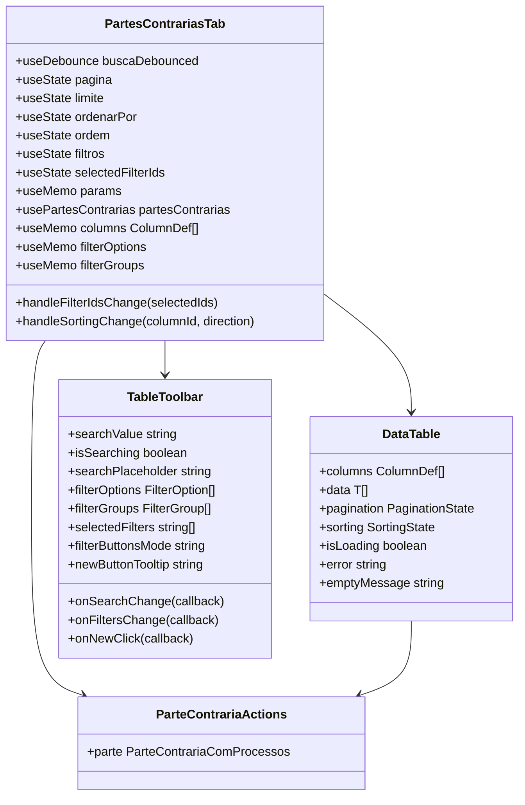
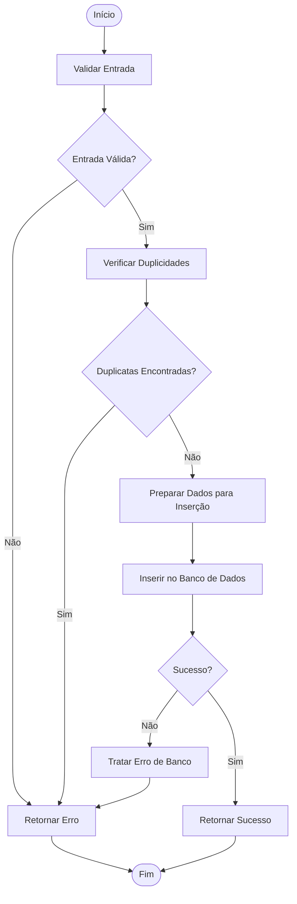
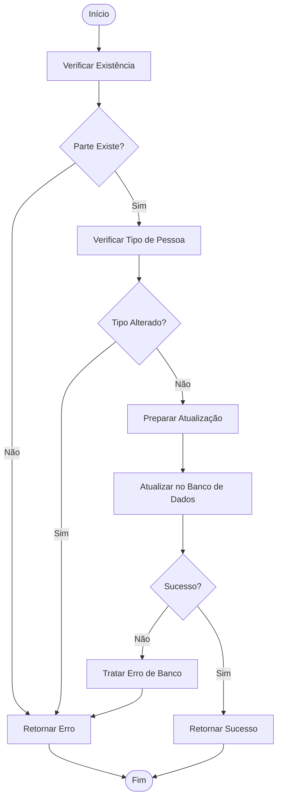
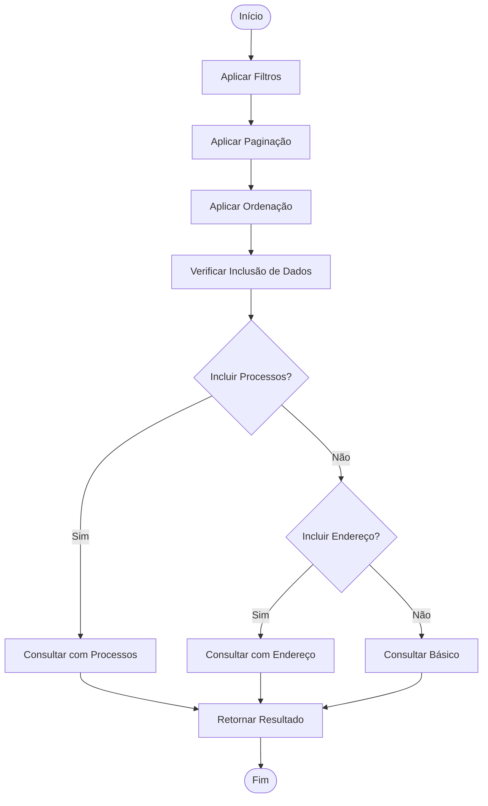
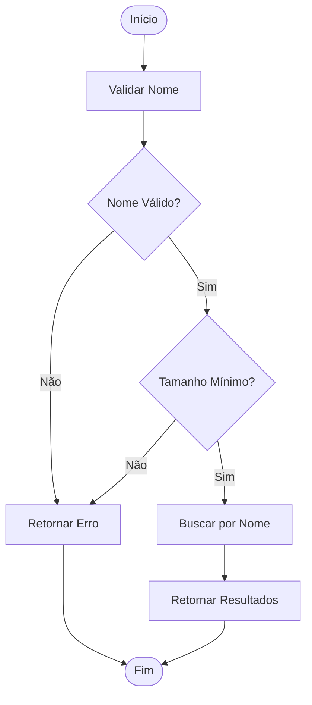
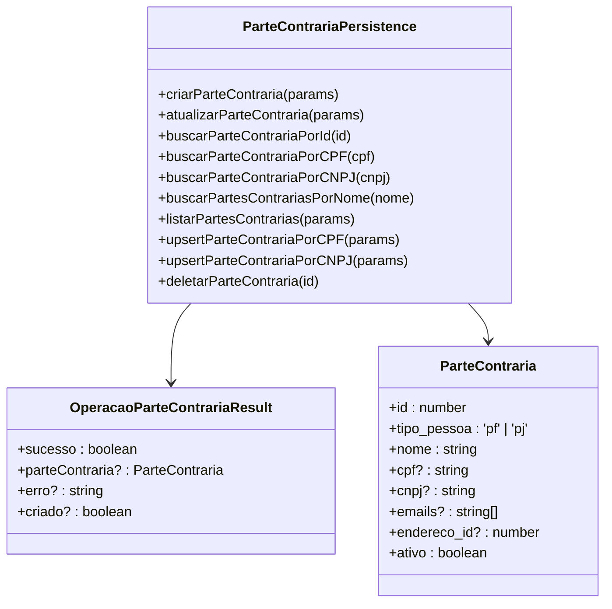
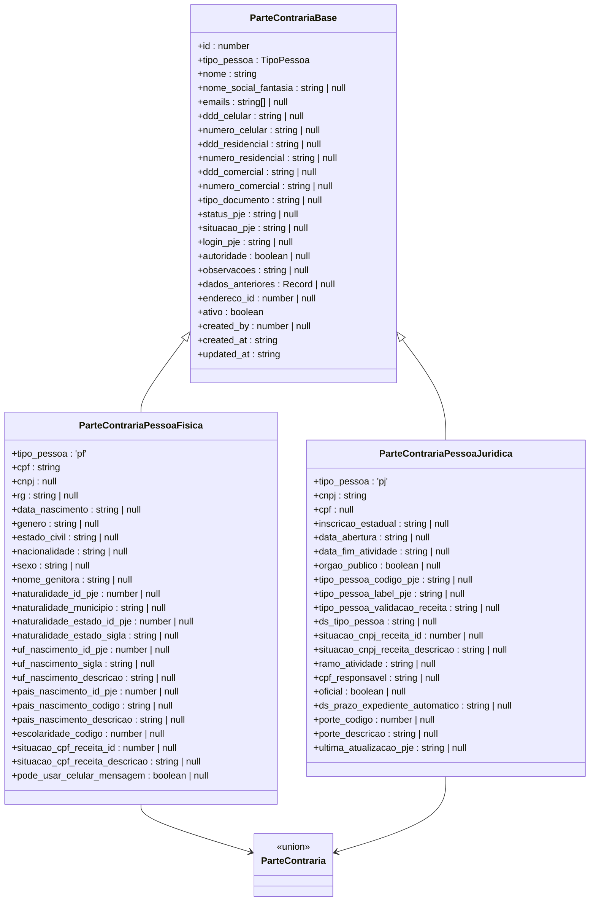
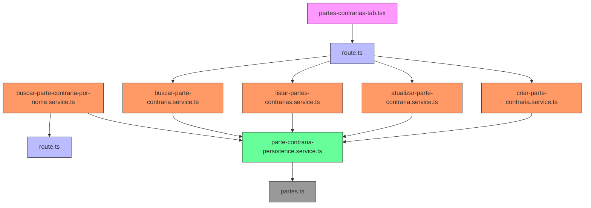

# Gestão de Partes

<cite>
**Arquivos Referenciados neste Documento**   
- [partes-contrarias-tab.tsx](file://app/(dashboard)/partes/components/partes-contrarias-tab.tsx)
- [route.ts](file://app/api/partes-contrarias/route.ts)
- [route.ts](file://app/api/partes-contrarias/[id]/route.ts)
- [route.ts](file://app/api/partes-contrarias/buscar/por-nome/[nome]/route.ts)
- [criar-parte-contraria.service.ts](file://backend/partes-contrarias/services/partes-contrarias/criar-parte-contraria.service.ts)
- [atualizar-parte-contraria.service.ts](file://backend/partes-contrarias/services/partes-contrarias/atualizar-parte-contraria.service.ts)
- [listar-partes-contrarias.service.ts](file://backend/partes-contrarias/services/partes-contrarias/listar-partes-contrarias.service.ts)
- [buscar-parte-contraria.service.ts](file://backend/partes-contrarias/services/partes-contrarias/buscar-parte-contraria.service.ts)
- [buscar-parte-contraria-por-nome.service.ts](file://backend/partes-contrarias/services/partes-contrarias/buscar-parte-contraria-por-nome.service.ts)
- [parte-contraria-persistence.service.ts](file://backend/partes-contrarias/services/persistence/parte-contraria-persistence.service.ts)
- [partes.ts](file://types/domain/partes.ts)
</cite>

## Sumário
1. [Introdução](#introdução)
2. [Estrutura do Projeto](#estrutura-do-projeto)
3. [Componentes Principais](#componentes-principais)
4. [Visão Geral da Arquitetura](#visão-geral-da-arquitetura)
5. [Análise Detalhada dos Componentes](#análise-detalhada-dos-componentes)
6. [Análise de Dependências](#análise-de-dependências)
7. [Considerações de Desempenho](#considerações-de-desempenho)
8. [Guia de Solução de Problemas](#guia-de-solução-de-problemas)
9. [Conclusão](#conclusão)

## Introdução
O sistema de Gestão de Partes Contrárias é um componente fundamental do sistema jurídico Sinesys, projetado para gerenciar eficientemente as partes envolvidas em processos judiciais. Esta documentação fornece uma visão abrangente da arquitetura, funcionalidades e implementação do módulo de partes contrárias, abrangendo desde a interface do usuário até a camada de persistência de dados.

## Estrutura do Projeto
A estrutura do projeto segue uma arquitetura em camadas bem definida, com separação clara de responsabilidades entre as diferentes camadas do sistema. O módulo de partes contrárias está organizado em diretórios específicos que refletem essa arquitetura em camadas.

```mermaid
graph TD
A[Frontend] --> B[API Routes]
B --> C[Serviços de Negócio]
C --> D[Persistência]
D --> E[Banco de Dados]
subgraph Frontend
F[partes-contrarias-tab.tsx]
end
subgraph API
G[route.ts]
H[[id]/route.ts]
I[buscar/por-nome/[nome]/route.ts]
end
subgraph Serviços
J[criar-parte-contraria.service.ts]
K[atualizar-parte-contraria.service.ts]
L[listar-partes-contrarias.service.ts]
M[buscar-parte-contraria.service.ts]
N[buscar-parte-contraria-por-nome.service.ts]
end
subgraph Persistência
O[parte-contraria-persistence.service.ts]
end
subgraph Tipos
P[partes.ts]
end
F --> G
G --> J
H --> K
I --> N
J --> O
K --> O
L --> O
M --> O
N --> O
O --> P
```

**Fontes do Diagrama**
- [partes-contrarias-tab.tsx](file://app/(dashboard)/partes/components/partes-contrarias-tab.tsx)
- [route.ts](file://app/api/partes-contrarias/route.ts)
- [route.ts](file://app/api/partes-contrarias/[id]/route.ts)
- [route.ts](file://app/api/partes-contrarias/buscar/por-nome/[nome]/route.ts)
- [criar-parte-contraria.service.ts](file://backend/partes-contrarias/services/partes-contrarias/criar-parte-contraria.service.ts)
- [atualizar-parte-contraria.service.ts](file://backend/partes-contrarias/services/partes-contrarias/atualizar-parte-contraria.service.ts)
- [listar-partes-contrarias.service.ts](file://backend/partes-contrarias/services/partes-contrarias/listar-partes-contrarias.service.ts)
- [buscar-parte-contraria.service.ts](file://backend/partes-contrarias/services/partes-contrarias/buscar-parte-contraria.service.ts)
- [buscar-parte-contraria-por-nome.service.ts](file://backend/partes-contrarias/services/partes-contrarias/buscar-parte-contraria-por-nome.service.ts)
- [parte-contraria-persistence.service.ts](file://backend/partes-contrarias/services/persistence/parte-contraria-persistence.service.ts)
- [partes.ts](file://types/domain/partes.ts)

**Fontes da Seção**
- [partes-contrarias-tab.tsx](file://app/(dashboard)/partes/components/partes-contrarias-tab.tsx)

## Componentes Principais
Os componentes principais do módulo de partes contrárias estão organizados em camadas distintas, cada uma com responsabilidades específicas. A camada de frontend fornece a interface de usuário, enquanto as camadas de API, serviços e persistência gerenciam a lógica de negócio e o acesso aos dados.

**Fontes da Seção**
- [partes-contrarias-tab.tsx](file://app/(dashboard)/partes/components/partes-contrarias-tab.tsx)
- [route.ts](file://app/api/partes-contrarias/route.ts)
- [criar-parte-contraria.service.ts](file://backend/partes-contrarias/services/partes-contrarias/criar-parte-contraria.service.ts)
- [parte-contraria-persistence.service.ts](file://backend/partes-contrarias/services/persistence/parte-contraria-persistence.service.ts)

## Visão Geral da Arquitetura
A arquitetura do módulo de partes contrárias segue o padrão de camadas, com fluxo de dados bem definido entre as diferentes camadas do sistema. A arquitetura promove baixo acoplamento e alta coesão, facilitando a manutenção e evolução do sistema.

```mermaid
graph LR
A[Cliente] --> B[API Route]
B --> C[Serviço de Negócio]
C --> D[Persistência]
D --> E[Supabase/MongoDB]
D --> F[Redis Cache]
subgraph Camadas
B[API]
C[Serviço]
D[Persistência]
end
subgraph Operações
B1[GET /partes-contrarias]
B2[POST /partes-contrarias]
B3[GET /partes-contrarias/{id}]
B4[PATCH /partes-contrarias/{id}]
B5[GET /partes-contrarias/buscar/por-nome/{nome}]
end
B1 --> C1[listarPartesContrarias]
B2 --> C2[criarParteContraria]
B3 --> C3[obterParteContrariaPorId]
B4 --> C4[atualizarParteContraria]
B5 --> C5[buscarParteContrariaPorNome]
C1 --> D1[listarPartesContrariasDb]
C2 --> D2[criarParteContrariaDb]
C3 --> D3[buscarParteContrariaPorId]
C4 --> D4[atualizarParteContrariaDb]
C5 --> D5[buscarPartesContrariasPorNome]
```

**Fontes do Diagrama**
- [route.ts](file://app/api/partes-contrarias/route.ts)
- [route.ts](file://app/api/partes-contrarias/[id]/route.ts)
- [route.ts](file://app/api/partes-contrarias/buscar/por-nome/[nome]/route.ts)
- [criar-parte-contraria.service.ts](file://backend/partes-contrarias/services/partes-contrarias/criar-parte-contraria.service.ts)
- [atualizar-parte-contraria.service.ts](file://backend/partes-contrarias/services/partes-contrarias/atualizar-parte-contraria.service.ts)
- [listar-partes-contrarias.service.ts](file://backend/partes-contrarias/services/partes-contrarias/listar-partes-contrarias.service.ts)
- [buscar-parte-contraria.service.ts](file://backend/partes-contrarias/services/partes-contrarias/buscar-parte-contraria.service.ts)
- [buscar-parte-contraria-por-nome.service.ts](file://backend/partes-contrarias/services/partes-contrarias/buscar-parte-contraria-por-nome.service.ts)
- [parte-contraria-persistence.service.ts](file://backend/partes-contrarias/services/persistence/parte-contraria-persistence.service.ts)

## Análise Detalhada dos Componentes

### Análise do Componente de Interface
O componente de interface para partes contrárias fornece uma tabela interativa com funcionalidades avançadas de busca, filtragem e ordenação. O componente é projetado para ser responsivo e oferecer uma experiência de usuário intuitiva.



**Fontes do Diagrama**
- [partes-contrarias-tab.tsx](file://app/(dashboard)/partes/components/partes-contrarias-tab.tsx)

**Fontes da Seção**
- [partes-contrarias-tab.tsx](file://app/(dashboard)/partes/components/partes-contrarias-tab.tsx)

### Análise dos Serviços de Negócio
Os serviços de negócio implementam a lógica de negócio para operações com partes contrárias, incluindo criação, atualização, listagem e busca. Cada serviço segue um padrão consistente de validação, execução e tratamento de erros.

#### Fluxo de Criação de Parte Contrária


**Fontes do Diagrama**
- [criar-parte-contraria.service.ts](file://backend/partes-contrarias/services/partes-contrarias/criar-parte-contraria.service.ts)
- [parte-contraria-persistence.service.ts](file://backend/partes-contrarias/services/persistence/parte-contraria-persistence.service.ts)

#### Fluxo de Atualização de Parte Contrária


**Fontes do Diagrama**
- [atualizar-parte-contraria.service.ts](file://backend/partes-contrarias/services/partes-contrarias/atualizar-parte-contraria.service.ts)
- [parte-contraria-persistence.service.ts](file://backend/partes-contrarias/services/persistence/parte-contraria-persistence.service.ts)

#### Fluxo de Listagem de Partes Contrárias


**Fontes do Diagrama**
- [listar-partes-contrarias.service.ts](file://backend/partes-contrarias/services/partes-contrarias/listar-partes-contrarias.service.ts)
- [parte-contraria-persistence.service.ts](file://backend/partes-contrarias/services/persistence/parte-contraria-persistence.service.ts)

#### Fluxo de Busca por Nome


**Fontes do Diagrama**
- [buscar-parte-contraria-por-nome.service.ts](file://backend/partes-contrarias/services/partes-contrarias/buscar-parte-contraria-por-nome.service.ts)
- [parte-contraria-persistence.service.ts](file://backend/partes-contrarias/services/persistence/parte-contraria-persistence.service.ts)

**Fontes da Seção**
- [criar-parte-contraria.service.ts](file://backend/partes-contrarias/services/partes-contrarias/criar-parte-contraria.service.ts)
- [atualizar-parte-contraria.service.ts](file://backend/partes-contrarias/services/partes-contrarias/atualizar-parte-contraria.service.ts)
- [listar-partes-contrarias.service.ts](file://backend/partes-contrarias/services/partes-contrarias/listar-partes-contrarias.service.ts)
- [buscar-parte-contraria-por-nome.service.ts](file://backend/partes-contrarias/services/partes-contrarias/buscar-parte-contraria-por-nome.service.ts)

### Análise da Camada de Persistência
A camada de persistência gerencia todas as operações de CRUD na tabela partes_contrarias, incluindo validações, normalizações e tratamento de erros. A camada é projetada para ser reutilizável e fornecer uma interface consistente para os serviços de negócio.



**Fontes do Diagrama**
- [parte-contraria-persistence.service.ts](file://backend/partes-contrarias/services/persistence/parte-contraria-persistence.service.ts)

**Fontes da Seção**
- [parte-contraria-persistence.service.ts](file://backend/partes-contrarias/services/persistence/parte-contraria-persistence.service.ts)

### Análise dos Tipos de Domínio
Os tipos de domínio definem a estrutura de dados para partes contrárias, incluindo discriminação entre pessoas físicas e jurídicas. Os tipos são organizados de forma a promover reutilização e consistência em todo o sistema.



**Fontes do Diagrama**
- [partes.ts](file://types/domain/partes.ts)

**Fontes da Seção**
- [partes.ts](file://types/domain/partes.ts)

## Análise de Dependências
A análise de dependências mostra as relações entre os diferentes componentes do módulo de partes contrárias. As dependências são bem definidas e seguem o princípio de inversão de dependência, onde módulos de alto nível não dependem diretamente de módulos de baixo nível.



**Fontes do Diagrama**
- [partes-contrarias-tab.tsx](file://app/(dashboard)/partes/components/partes-contrarias-tab.tsx)
- [route.ts](file://app/api/partes-contrarias/route.ts)
- [route.ts](file://app/api/partes-contrarias/[id]/route.ts)
- [route.ts](file://app/api/partes-contrarias/buscar/por-nome/[nome]/route.ts)
- [criar-parte-contraria.service.ts](file://backend/partes-contrarias/services/partes-contrarias/criar-parte-contraria.service.ts)
- [atualizar-parte-contraria.service.ts](file://backend/partes-contrarias/services/partes-contrarias/atualizar-parte-contraria.service.ts)
- [listar-partes-contrarias.service.ts](file://backend/partes-contrarias/services/partes-contrarias/listar-partes-contrarias.service.ts)
- [buscar-parte-contraria.service.ts](file://backend/partes-contrarias/services/partes-contrarias/buscar-parte-contraria.service.ts)
- [buscar-parte-contraria-por-nome.service.ts](file://backend/partes-contrarias/services/partes-contrarias/buscar-parte-contraria-por-nome.service.ts)
- [parte-contraria-persistence.service.ts](file://backend/partes-contrarias/services/persistence/parte-contraria-persistence.service.ts)
- [partes.ts](file://types/domain/partes.ts)

**Fontes da Seção**
- [partes-contrarias-tab.tsx](file://app/(dashboard)/partes/components/partes-contrarias-tab.tsx)
- [route.ts](file://app/api/partes-contrarias/route.ts)
- [criar-parte-contraria.service.ts](file://backend/partes-contrarias/services/partes-contrarias/criar-parte-contraria.service.ts)
- [atualizar-parte-contraria.service.ts](file://backend/partes-contrarias/services/partes-contrarias/atualizar-parte-contraria.service.ts)
- [listar-partes-contrarias.service.ts](file://backend/partes-contrarias/services/partes-contrarias/listar-partes-contrarias.service.ts)
- [buscar-parte-contraria.service.ts](file://backend/partes-contrarias/services/partes-contrarias/buscar-parte-contraria.service.ts)
- [buscar-parte-contraria-por-nome.service.ts](file://backend/partes-contrarias/services/partes-contrarias/buscar-parte-contraria-por-nome.service.ts)
- [parte-contraria-persistence.service.ts](file://backend/partes-contrarias/services/persistence/parte-contraria-persistence.service.ts)
- [partes.ts](file://types/domain/partes.ts)

## Considerações de Desempenho
O módulo de partes contrárias foi projetado com considerações de desempenho em mente, incluindo otimizações de consulta, uso de cache e paginação eficiente. As consultas são otimizadas para minimizar o tempo de resposta e o uso de recursos.

**Fontes da Seção**
- [listar-partes-contrarias.service.ts](file://backend/partes-contrarias/services/partes-contrarias/listar-partes-contrarias.service.ts)
- [parte-contraria-persistence.service.ts](file://backend/partes-contrarias/services/persistence/parte-contraria-persistence.service.ts)

## Guia de Solução de Problemas
Este guia fornece orientações para solução de problemas comuns no módulo de partes contrárias, incluindo erros de validação, problemas de integridade de dados e falhas de autenticação.

**Fontes da Seção**
- [criar-parte-contraria.service.ts](file://backend/partes-contrarias/services/partes-contrarias/criar-parte-contraria.service.ts)
- [atualizar-parte-contraria.service.ts](file://backend/partes-contrarias/services/partes-contrarias/atualizar-parte-contraria.service.ts)
- [parte-contraria-persistence.service.ts](file://backend/partes-contrarias/services/persistence/parte-contraria-persistence.service.ts)

## Conclusão
O módulo de Gestão de Partes Contrárias é uma componente essencial do sistema jurídico Sinesys, fornecendo funcionalidades robustas para gerenciar partes envolvidas em processos judiciais. A arquitetura em camadas bem definida, combinada com práticas de codificação consistentes e documentação abrangente, torna o sistema fácil de manter e evoluir. A implementação segue padrões modernos de desenvolvimento de software, garantindo escalabilidade, desempenho e confiabilidade.