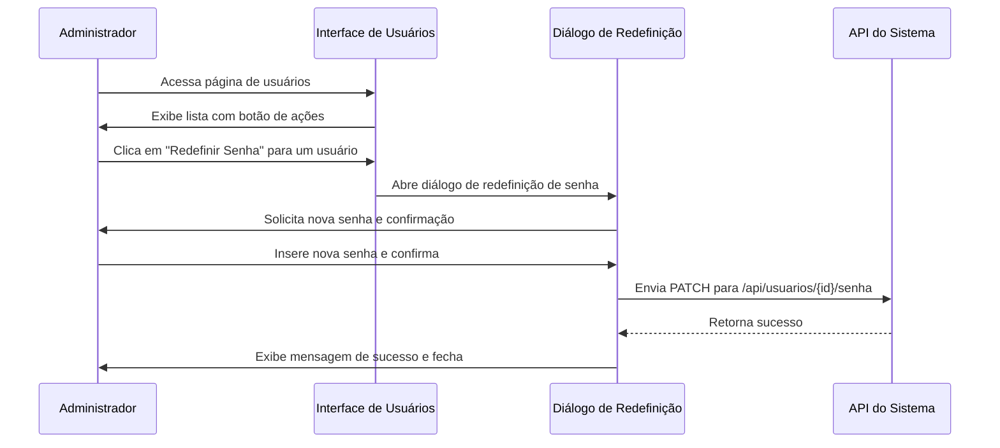
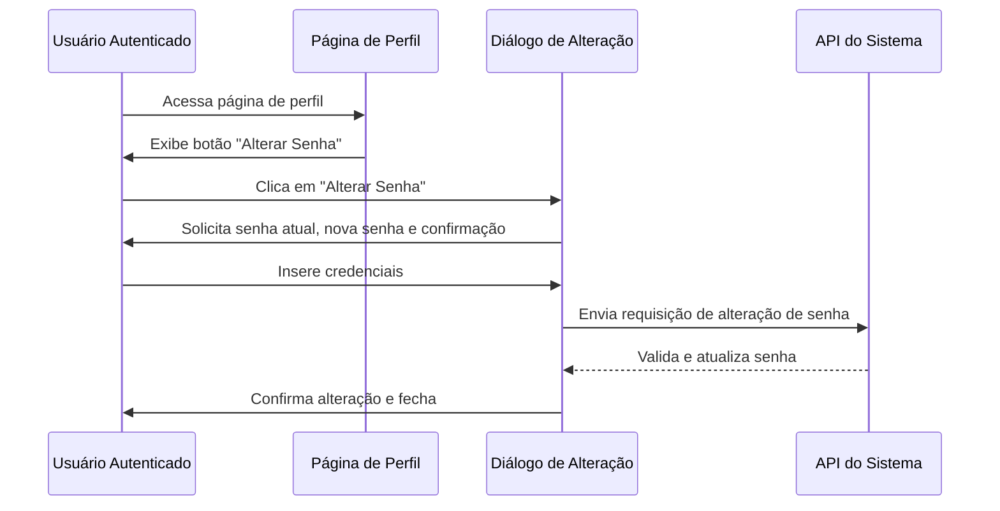
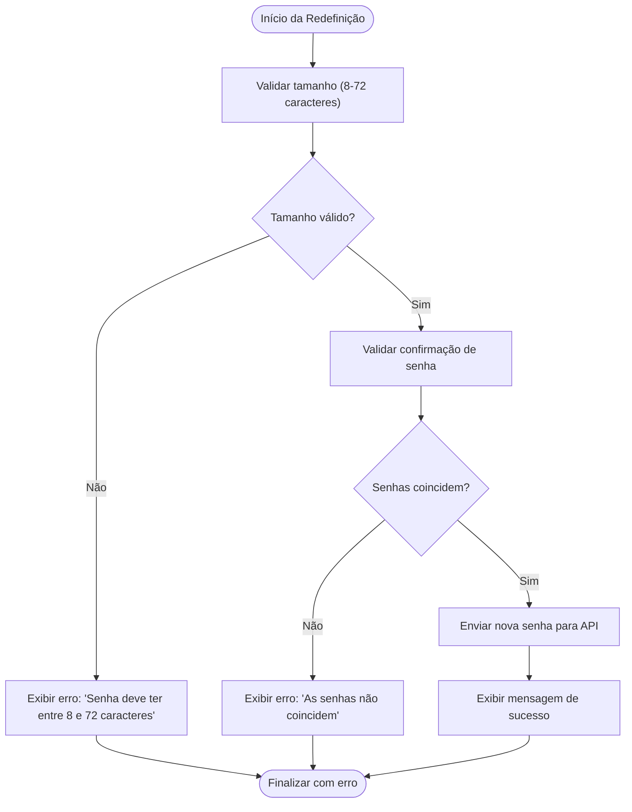

# Gestão de Senhas de Usuários

<cite>
**Arquivos Referenciados neste Documento**   
- [redefinir-senha-dialog.tsx](file://app\(dashboard)\usuarios\components\redefinir-senha-dialog.tsx)
- [usuarios\page.tsx](file://app\(dashboard)\usuarios\page.tsx)
- [usuario-card.tsx](file://app\(dashboard)\usuarios\components\usuario-card.tsx)
- [perfil\page.tsx](file://app\(dashboard)\perfil\page.tsx)
</cite>

## Sumário
1. [Introdução](#introdução)
2. [Fluxo de Redefinição de Senha por Administrador](#fluxo-de-redefinição-de-senha-por-administrador)
3. [Fluxo de Alteração de Senha pelo Usuário](#fluxo-de-alteração-de-senha-pelo-usuário)
4. [Validações de Senha](#validações-de-senha)
5. [Segurança e Boas Práticas](#segurança-e-boas-práticas)

## Introdução

O sistema Sinesys implementa um mecanismo robusto para gestão de senhas de usuários, permitindo tanto a redefinição administrativa quanto a alteração autônoma pelo próprio usuário. Este documento detalha os fluxos, componentes e regras de validação envolvidos na gestão de senhas, com foco na segurança e usabilidade.

A funcionalidade de redefinição de senha é acessível apenas para usuários com permissões administrativas, garantindo controle sobre as credenciais do sistema. Paralelamente, usuários comuns podem alterar suas próprias senhas através de uma interface segura na página de perfil.

## Fluxo de Redefinição de Senha por Administrador

O processo de redefinição de senha por administrador é iniciado a partir da listagem de usuários, onde um administrador pode selecionar um usuário específico e redefinir sua senha.

**Fontes da seção**
- [usuarios\page.tsx](file://app\(dashboard)\usuarios\page.tsx#L298-L304)
- [usuario-card.tsx](file://app\(dashboard)\usuarios\components\usuario-card.tsx#L110-L119)

**Fontes do diagrama**
- [usuarios\page.tsx](file://app\(dashboard)\usuarios\page.tsx#L298-L304)
- [redefinir-senha-dialog.tsx](file://app\(dashboard)\usuarios\components\redefinir-senha-dialog.tsx#L98-L104)

## Fluxo de Alteração de Senha pelo Usuário

Usuários podem alterar suas próprias senhas através da página de perfil, acessível após autenticação no sistema. Este fluxo garante que apenas o usuário autenticado possa modificar sua própria senha.

**Fontes da seção**
- [perfil\page.tsx](file://app\(dashboard)\perfil\page.tsx#L1-L36)

## Validações de Senha

O sistema aplica validações rigorosas para garantir a segurança das senhas definidas pelos usuários. As regras são aplicadas tanto na redefinição administrativa quanto na alteração autônoma.

| Regra de Validação | Valor | Descrição |
|-------------------|-------|---------|
| **Tamanho Mínimo** | 8 caracteres | Impede o uso de senhas muito curtas |
| **Tamanho Máximo** | 72 caracteres | Limitação técnica do sistema de autenticação |
| **Confirmação** | Obrigatória | Garante que a senha foi digitada corretamente |
| **Complexidade** | Não aplicada diretamente | Delegada ao sistema de autenticação externo |

**Fontes da seção**
- [redefinir-senha-dialog.tsx](file://app\(dashboard)\usuarios\components\redefinir-senha-dialog.tsx#L57-L75)

**Fontes do diagrama**
- [redefinir-senha-dialog.tsx](file://app\(dashboard)\usuarios\components\redefinir-senha-dialog.tsx#L57-L75)

## Segurança e Boas Práticas

O sistema implementa diversas práticas de segurança para proteger o processo de gestão de senhas:

1. **Criptografia de Senhas**: As senhas são armazenadas de forma criptografada no banco de dados, utilizando algoritmos seguros de hash.
2. **Validação no Backend**: Além da validação frontend, o backend realiza validações adicionais para garantir a integridade dos dados.
3. **Proteção contra Força Bruta**: O sistema de autenticação externo (Supabase) implementa mecanismos para prevenir ataques de força bruta.
4. **Auditoria de Ações**: Todas as alterações de senha são registradas no sistema de auditoria para rastreabilidade.
5. **Interface Segura**: Os campos de senha utilizam o tipo `password` com opção de visualização controlada, balanceando segurança e usabilidade.

A arquitetura em camadas do sistema garante que a lógica de validação de senhas esteja isolada na camada de serviço, permitindo manutenção e atualizações sem impactar outras partes do sistema.

**Fontes da seção**
- [redefinir-senha-dialog.tsx](file://app\(dashboard)\usuarios\components\redefinir-senha-dialog.tsx)
- [README.md](file://README.md#L71-L99)