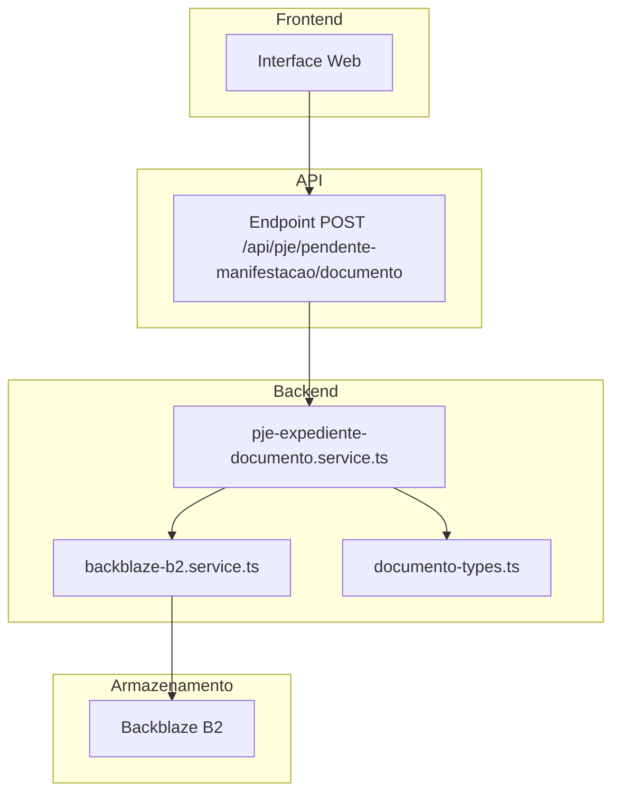
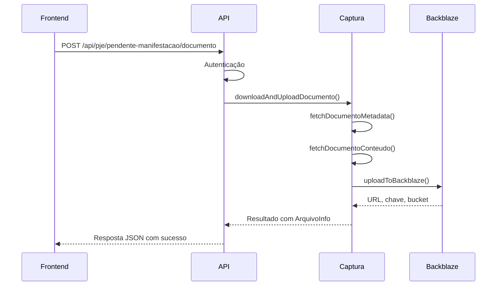
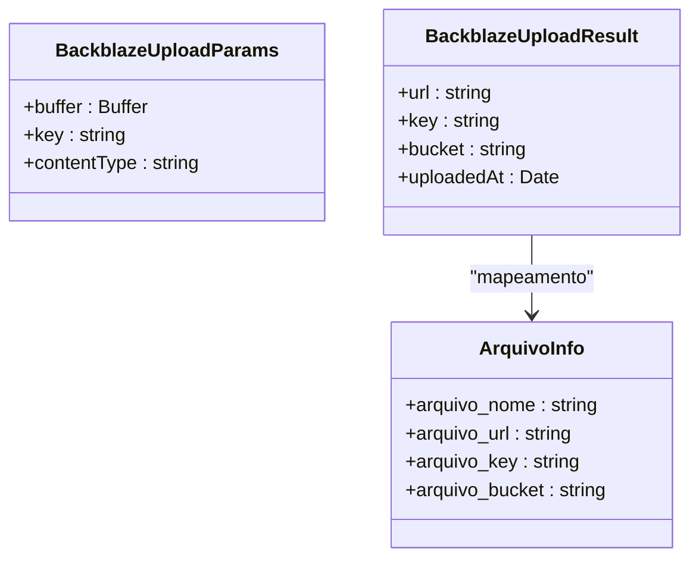
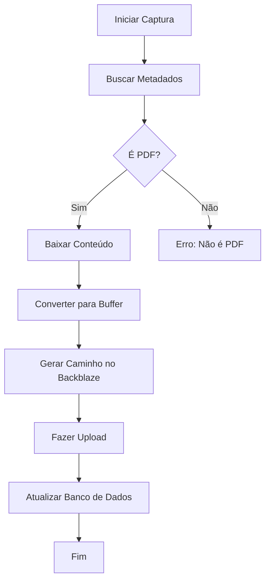

# Migração para Backblaze B2

<cite>
**Arquivos Referenciados neste Documento**  
- [backblaze-b2.service.ts](file://backend/storage/backblaze-b2.service.ts)
- [documento-types.ts](file://backend/types/pje-trt/documento-types.ts)
- [pje-expediente-documento.service.ts](file://backend/captura/services/pje/pje-expediente-documento.service.ts)
- [route.ts](file://app/api/pje/pendente-manifestacao/documento/route.ts)
</cite>

## Sumário
1. [Introdução](#introdução)
2. [Estrutura do Projeto](#estrutura-do-projeto)
3. [Componentes Principais](#componentes-principais)
4. [Visão Geral da Arquitetura](#visão-geral-da-arquitetura)
5. [Análise Detalhada dos Componentes](#análise-detalhada-dos-componentes)
6. [Análise de Dependências](#análise-de-dependências)
7. [Considerações de Desempenho](#considerações-de-desempenho)
8. [Guia de Solução de Problemas](#guia-de-solução-de-problemas)
9. [Conclusão](#conclusão)

## Introdução
Este documento fornece uma análise detalhada da implementação e integração do serviço Backblaze B2 no sistema Sinesys, utilizado pelo escritório Zattar Advogados. O Backblaze B2 foi adotado como solução de armazenamento de objetos compatível com S3, substituindo ou complementando soluções anteriores como o Google Drive. O sistema utiliza o serviço para armazenar documentos legais capturados do PJE (Processo Judicial Eletrônico), garantindo acesso rápido, persistência e integração segura com o frontend e o banco de dados.

A migração para o Backblaze B2 permite maior controle sobre o armazenamento, redução de custos e melhor desempenho na gestão de arquivos PDF de processos judiciais. Este documento detalha a arquitetura, os componentes principais, as interfaces de dados e os fluxos de operação envolvidos na integração.

## Estrutura do Projeto
A integração com o Backblaze B2 está localizada principalmente no diretório `backend/storage/`, com interfaces de dados definidas em `backend/types/pje-trt/` e serviços de captura em `backend/captura/services/pje/`. O endpoint da API que orquestra o upload está localizado em `app/api/pje/pendente-manifestacao/documento/route.ts`.

O serviço é projetado para ser reutilizável, com funções específicas para upload e exclusão de arquivos, além de interfaces bem definidas para integração com outros módulos do sistema.



**Fontes do Diagrama**  
- [backblaze-b2.service.ts](file://backend/storage/backblaze-b2.service.ts)
- [pje-expediente-documento.service.ts](file://backend/captura/services/pje/pje-expediente-documento.service.ts)
- [route.ts](file://app/api/pje/pendente-manifestacao/documento/route.ts)

**Fontes da Seção**  
- [backblaze-b2.service.ts](file://backend/storage/backblaze-b2.service.ts)
- [documento-types.ts](file://backend/types/pje-trt/documento-types.ts)

## Componentes Principais
Os componentes principais envolvidos na integração com o Backblaze B2 são:

- **backblaze-b2.service.ts**: Fornece funções para upload e exclusão de arquivos no Backblaze B2, utilizando o AWS SDK v3 para compatibilidade com a API S3.
- **documento-types.ts**: Define as interfaces TypeScript para metadados de arquivos armazenados, incluindo URL, chave, nome e bucket.
- **pje-expediente-documento.service.ts**: Serviço que coordena a captura de documentos do PJE e seu upload para o Backblaze B2.
- **route.ts**: Endpoint da API que recebe requisições do frontend, autentica o usuário e inicia o processo de captura e upload.

Esses componentes trabalham em conjunto para garantir que documentos do PJE sejam armazenados de forma segura e acessível.

**Fontes da Seção**  
- [backblaze-b2.service.ts](file://backend/storage/backblaze-b2.service.ts#L1-L153)
- [documento-types.ts](file://backend/types/pje-trt/documento-types.ts#L1-L209)

## Visão Geral da Arquitetura
A arquitetura de integração com o Backblaze B2 segue um padrão de serviços modulares, onde cada componente tem uma responsabilidade bem definida. O fluxo começa com uma requisição HTTP ao endpoint da API, que valida os parâmetros e autentica o usuário. Em seguida, o serviço de captura do PJE é chamado para buscar o documento, que é então convertido em um buffer e enviado ao serviço de armazenamento.

O serviço de armazenamento utiliza o AWS SDK para se comunicar com o Backblaze B2 via API S3-Compatible, garantindo compatibilidade e simplicidade na integração. Após o upload bem-sucedido, as informações do arquivo são retornadas e persistidas no banco de dados.



**Fontes do Diagrama**  
- [backblaze-b2.service.ts](file://backend/storage/backblaze-b2.service.ts#L77-L152)
- [pje-expediente-documento.service.ts](file://backend/captura/services/pje/pje-expediente-documento.service.ts#L225-L262)
- [route.ts](file://app/api/pje/pendente-manifestacao/documento/route.ts#L1-L25)

## Análise Detalhada dos Componentes

### Análise do Serviço Backblaze B2
O serviço `backblaze-b2.service.ts` é responsável por todas as operações de armazenamento no Backblaze B2. Ele utiliza um cliente S3 singleton para manter uma conexão eficiente com o serviço, evitando a criação de múltiplas instâncias.

#### Interfaces de Dados


**Fontes do Diagrama**  
- [backblaze-b2.service.ts](file://backend/storage/backblaze-b2.service.ts#L13-L34)
- [documento-types.ts](file://backend/types/pje-trt/documento-types.ts#L134-L164)

#### Funções Principais
- `uploadToBackblaze()`: Realiza o upload de um arquivo para o Backblaze B2, recebendo um buffer, uma chave (path) e o tipo MIME.
- `deleteFromBackblaze()`: Remove um arquivo do bucket com base na chave fornecida.
- `getS3Client()`: Cria ou retorna uma instância singleton do cliente S3 configurado com as credenciais do Backblaze.

O serviço valida as variáveis de ambiente necessárias (`B2_ENDPOINT`, `B2_REGION`, `B2_KEY_ID`, `B2_APPLICATION_KEY`, `B2_BUCKET`) antes de qualquer operação, garantindo que a configuração esteja completa.

**Fontes da Seção**  
- [backblaze-b2.service.ts](file://backend/storage/backblaze-b2.service.ts#L1-L153)

### Análise do Fluxo de Captura de Documentos
O serviço `pje-expediente-documento.service.ts` coordena todo o processo de captura de documentos do PJE. Ele inicia buscando os metadados do documento, valida se é um PDF, obtém o conteúdo em base64, converte para buffer e chama o serviço de upload.

O caminho do arquivo no Backblaze B2 é gerado com base no número do processo, ID do pendente e ID do documento, garantindo organização e unicidade.



**Fontes do Diagrama**  
- [pje-expediente-documento.service.ts](file://backend/captura/services/pje/pje-expediente-documento.service.ts#L225-L262)
- [backblaze-b2.service.ts](file://backend/storage/backblaze-b2.service.ts#L77-L114)

**Fontes da Seção**  
- [pje-expediente-documento.service.ts](file://backend/captura/services/pje/pje-expediente-documento.service.ts#L1-L300)

## Análise de Dependências
O serviço de armazenamento depende do pacote `@aws-sdk/client-s3` para comunicação com o Backblaze B2. Ele também depende das variáveis de ambiente para configuração, o que exige que o ambiente de execução esteja devidamente configurado.

O serviço de captura depende do serviço de armazenamento e das interfaces definidas em `documento-types.ts`. O endpoint da API depende de ambos, além dos utilitários de autenticação.

```mermaid
graph LR
A[route.ts] --> B[pje-expediente-documento.service.ts]
B --> C[backblaze-b2.service.ts]
C --> D[@aws-sdk/client-s3]
B --> E[documento-types.ts]
A --> F[api-auth.ts]
```

**Fontes do Diagrama**  
- [backblaze-b2.service.ts](file://backend/storage/backblaze-b2.service.ts#L8)
- [pje-expediente-documento.service.ts](file://backend/captura/services/pje/pje-expediente-documento.service.ts#L1)
- [route.ts](file://app/api/pje/pendente-manifestacao/documento/route.ts#L1)

**Fontes da Seção**  
- [backblaze-b2.service.ts](file://backend/storage/backblaze-b2.service.ts#L8)
- [pje-expediente-documento.service.ts](file://backend/captura/services/pje/pje-expediente-documento.service.ts#L1)
- [route.ts](file://app/api/pje/pendente-manifestacao/documento/route.ts#L1)

## Considerações de Desempenho
O uso de um cliente S3 singleton evita a sobrecarga de criar múltiplas conexões. O upload é feito diretamente em memória com buffers, o que é eficiente para arquivos de tamanho moderado (até alguns MB). Para arquivos maiores, pode ser necessário implementar upload em partes.

O serviço inclui logs detalhados para monitoramento, incluindo tamanho do arquivo, tempo de upload e status de sucesso ou erro. A URL pública do arquivo é construída diretamente a partir do endpoint, bucket e chave, sem necessidade de chamadas adicionais à API.

## Guia de Solução de Problemas
Erros comuns e suas soluções:

- **Erro de configuração do Backblaze**: Verifique se todas as variáveis de ambiente (`B2_ENDPOINT`, `B2_REGION`, `B2_KEY_ID`, `B2_APPLICATION_KEY`, `B2_BUCKET`) estão definidas.
- **Falha no upload**: Verifique a conexão de rede, permissões do bucket e integridade do buffer.
- **Arquivo não encontrado após upload**: Confirme que a chave (key) está correta e que o bucket está acessível publicamente.
- **Erro 403 no PJE**: A credencial de autenticação pode estar expirada; realize nova autenticação.

Os logs do serviço incluem mensagens com emojis para facilitar a identificação visual de operações (📤 para upload, ✅ para sucesso, ❌ para erro).

**Fontes da Seção**  
- [backblaze-b2.service.ts](file://backend/storage/backblaze-b2.service.ts#L51-L55)
- [backblaze-b2.service.ts](file://backend/storage/backblaze-b2.service.ts#L87-L88)
- [backblaze-b2.service.ts](file://backend/storage/backblaze-b2.service.ts#L116-L119)

## Conclusão
A migração para o Backblaze B2 foi implementada de forma modular, segura e eficiente, integrando-se perfeitamente ao ecossistema existente do Sinesys. O uso de interfaces bem definidas e serviços especializados permite fácil manutenção e expansão futura. A arquitetura garante que os documentos legais sejam armazenados de forma persistente e acessível, melhorando a experiência do usuário e a eficiência operacional do escritório.