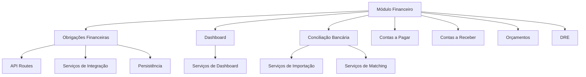
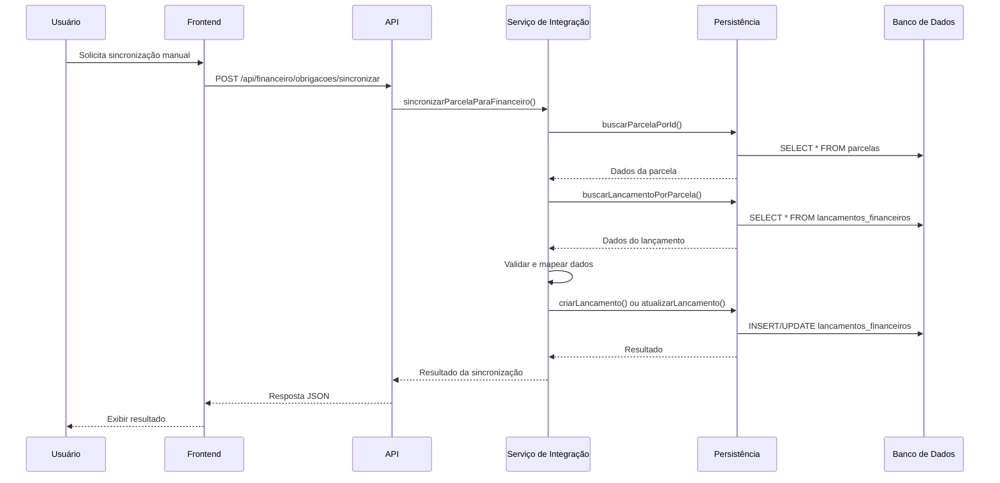
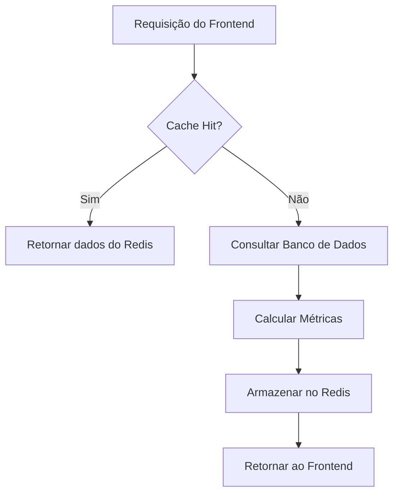
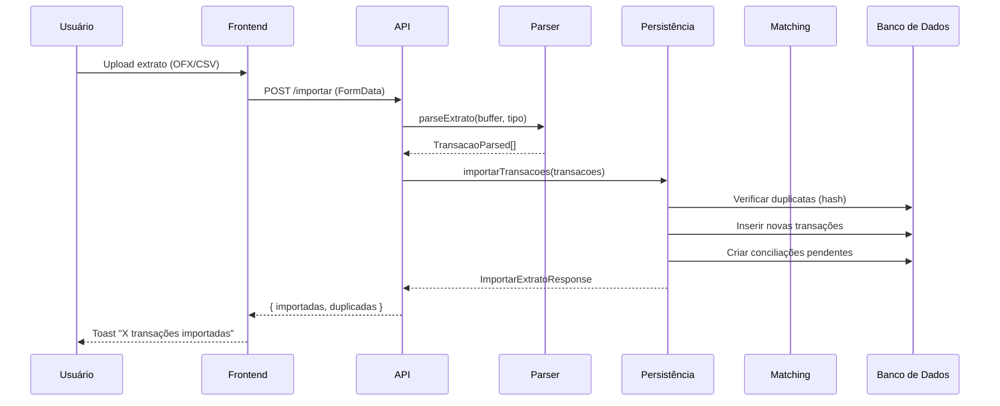
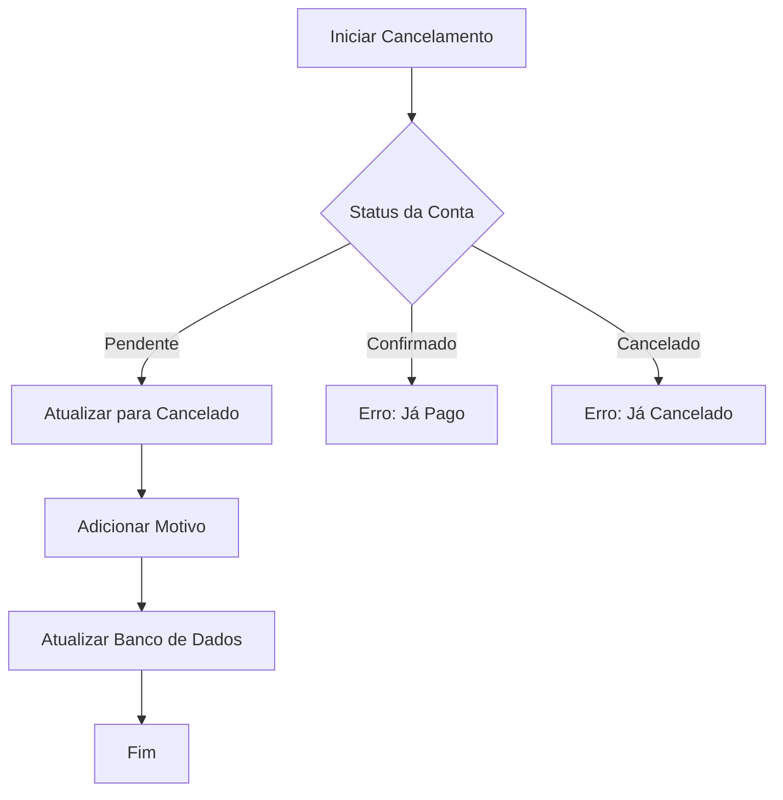
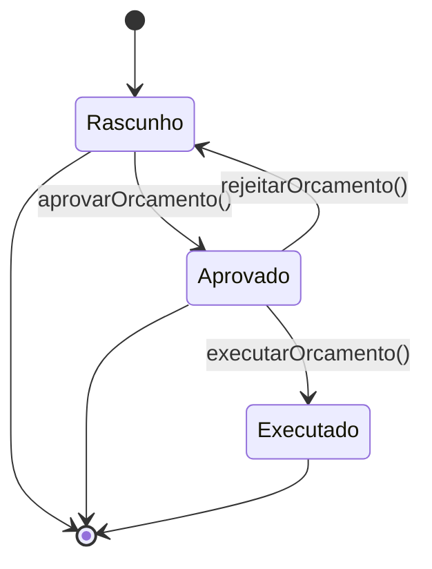

# Módulo Financeiro

<cite>
**Arquivos Referenciados neste Documento**   
- [obrigacoes-integracao.service.ts](file://backend/financeiro/obrigacoes/services/integracao/obrigacoes-integracao.service.ts)
- [obrigacoes-persistence.service.ts](file://backend/financeiro/obrigacoes/services/persistence/obrigacoes-persistence.service.ts)
- [dashboard-financeiro.service.ts](file://backend/financeiro/dashboard/services/dashboard/dashboard-financeiro.service.ts)
- [dashboard-financeiro.persistence.ts](file://backend/financeiro/dashboard/services/persistence/dashboard-financeiro.persistence.ts)
- [importar-extrato.service.ts](file://backend/financeiro/conciliacao-bancaria/services/conciliacao-bancaria/importar-extrato.service.ts)
- [matching-automatico.service.ts](file://backend/financeiro/conciliacao-bancaria/services/matching/matching-automatico.service.ts)
- [conciliacao-bancaria-persistence.service.ts](file://backend/financeiro/conciliacao-bancaria/services/persistence/conciliacao-bancaria-persistence.service.ts)
- [cancelar-conta.service.ts](file://backend/financeiro/contas-pagar/services/contas-pagar/cancelar-conta.service.ts)
- [cancelar-conta.service.ts](file://backend/financeiro/contas-receber/services/contas-receber/cancelar-conta.service.ts)
- [aprovar-orcamento.service.ts](file://backend/financeiro/orcamento/services/orcamento/aprovar-orcamento.service.ts)
- [README.md](file://backend/financeiro/obrigacoes/README.md)
- [dashboard.md](file://docs/financeiro/dashboard.md)
- [conciliacao-bancaria.md](file://docs/financeiro/conciliacao-bancaria.md)
- [exportacoes.md](file://docs/financeiro/exportacoes.md)
</cite>

## Sumário
1. [Introdução](#introdução)
2. [Estrutura do Módulo Financeiro](#estrutura-do-módulo-financeiro)
3. [Módulo de Obrigações Financeiras](#módulo-de-obrigações-financeiras)
4. [Dashboard Financeiro](#dashboard-financeiro)
5. [Conciliação Bancária](#conciliação-bancária)
6. [Exportações Financeiras](#exportações-financeiras)
7. [Contas a Pagar e Receber](#contas-a-pagar-e-receber)
8. [Orçamentos](#orçamentos)
9. [Conclusão](#conclusão)

## Introdução

O módulo financeiro do sistema Sinesys é uma solução integrada que centraliza todas as obrigações financeiras do escritório, originadas tanto de acordos judiciais quanto de lançamentos avulsos. Este módulo atua como uma ponte entre os dados jurídicos e o sistema de gestão financeira, garantindo consistência, automação e visibilidade total sobre o fluxo de caixa.

A arquitetura do módulo segue os princípios de Domain-Driven Design (DDD) e uma estrutura em camadas bem definida, separando claramente as responsabilidades entre a camada de API, serviços de negócio e persistência. Essa separação permite manutenção eficiente, testes isolados e escalabilidade.

**Seção fontes**
- [README.md](file://backend/financeiro/obrigacoes/README.md)

## Estrutura do Módulo Financeiro

O módulo financeiro é organizado em submódulos especializados, cada um com sua própria estrutura de serviços e persistência. A principal organização inclui:

- **obrigacoes**: Integração entre acordos judiciais e lançamentos financeiros.
- **dashboard**: Métricas consolidadas e indicadores de desempenho.
- **conciliacao-bancaria**: Importação e conciliação de extratos bancários.
- **contas-pagar** e **contas-receber**: Gestão de contas avulsas.
- **orcamento**: Planejamento e controle orçamentário.
- **dre**: Demonstrativo de Resultados do Exercício.

Cada submódulo possui uma estrutura padronizada com diretórios `services` para lógica de negócio e `persistence` para acesso ao banco de dados, promovendo reutilização e consistência.

**Fontes do diagrama**
- [backend/financeiro](file://backend/financeiro)

**Seção fontes**
- [backend/financeiro](file://backend/financeiro)

## Módulo de Obrigações Financeiras

O módulo de obrigações financeiras é o coração do sistema, responsável por consolidar todas as obrigações do escritório. Ele sincroniza automaticamente parcelas de acordos judiciais com lançamentos financeiros, mantendo a consistência entre os sistemas jurídico e financeiro.

### Funcionalidades Principais

- **Sincronização Automática**: Triggers no banco de dados criam lançamentos financeiros automaticamente quando parcelas são efetivadas.
- **Sincronização Manual**: API para forçar sincronização de parcelas específicas ou de acordos completos.
- **Verificação de Consistência**: Detecção de inconsistências entre parcelas e lançamentos, com alertas para correção.
- **Sincronização Bidirecional**: Alterações em lançamentos refletem nas parcelas e vice-versa.
- **Dashboard Consolidado**: Visão unificada de todas as obrigações, com filtros por cliente, processo e status.

### Arquitetura de Serviços

O serviço de integração é implementado em três camadas principais:

1. **Camada de Integração**: Coordena a sincronização entre acordos e lançamentos.
2. **Camada de Serviço**: Contém a lógica de negócio para validações e mapeamentos.
3. **Camada de Persistência**: Gerencia o acesso ao banco de dados e queries consolidadas.

**Fontes do diagrama**
- [obrigacoes-integracao.service.ts](file://backend/financeiro/obrigacoes/services/integracao/obrigacoes-integracao.service.ts)
- [obrigacoes-persistence.service.ts](file://backend/financeiro/obrigacoes/services/persistence/obrigacoes-persistence.service.ts)

**Seção fontes**
- [obrigacoes-integracao.service.ts](file://backend/financeiro/obrigacoes/services/integracao/obrigacoes-integracao.service.ts)
- [obrigacoes-persistence.service.ts](file://backend/financeiro/obrigacoes/services/persistence/obrigacoes-persistence.service.ts)
- [README.md](file://backend/financeiro/obrigacoes/README.md)

## Dashboard Financeiro

O dashboard financeiro fornece uma visão consolidada das métricas financeiras do escritório, com foco em alertas, fluxo de caixa e indicadores de desempenho.

### Componentes Principais

- **Cards de Métricas**: Exibem valores consolidados como saldo atual, contas a pagar/receber pendentes e vencimentos próximos.
- **Gráficos de Fluxo de Caixa**: Projeção mensal de receitas e despesas.
- **Indicadores de Risco**: Alertas para contas vencidas, saldo negativo e orçamentos estourados.
- **Cache com Redis**: Métricas são armazenadas em cache por 5 minutos para melhorar o desempenho.

### APIs do Dashboard

- `GET /api/financeiro/dashboard`: Retorna métricas consolidadas.
- `GET /api/financeiro/dashboard/fluxo-caixa?meses=6`: Retorna projeção de fluxo de caixa para os próximos meses.

**Fontes do diagrama**
- [dashboard-financeiro.service.ts](file://backend/financeiro/dashboard/services/dashboard/dashboard-financeiro.service.ts)
- [dashboard-financeiro.persistence.ts](file://backend/financeiro/dashboard/services/persistence/dashboard-financeiro.persistence.ts)

**Seção fontes**
- [dashboard-financeiro.service.ts](file://backend/financeiro/dashboard/services/dashboard/dashboard-financeiro.service.ts)
- [dashboard-financeiro.persistence.ts](file://backend/financeiro/dashboard/services/persistence/dashboard-financeiro.persistence.ts)
- [dashboard.md](file://docs/financeiro/dashboard.md)

## Conciliação Bancária

O módulo de conciliação bancária permite importar extratos bancários em formatos OFX e CSV, detectar duplicatas e sugerir conciliações automáticas com base em algoritmos de similaridade.

### Fluxo de Importação

1. O usuário faz upload do extrato bancário.
2. O sistema valida o arquivo e o tipo.
3. O parser correspondente (OFX ou CSV) processa o arquivo.
4. Transações são importadas e verificadas contra duplicatas usando hash.
5. Transações novas são inseridas no banco de dados.
6. O sistema cria registros de conciliação pendente.

### Algoritmo de Matching

O algoritmo de matching automático calcula um score de similaridade entre transações bancárias e lançamentos financeiros com base em:

- **Valor**: Até 40 pontos (diferença de até 5%)
- **Data**: Até 30 pontos (janela de 30 dias)
- **Descrição**: Até 30 pontos (similaridade de strings)

**Thresholds:**
- ≥90: Concilia automaticamente
- 70-89: Grava sugestões para revisão manual
- <70: Deixa pendente

**Fontes do diagrama**
- [importar-extrato.service.ts](file://backend/financeiro/conciliacao-bancaria/services/conciliacao-bancaria/importar-extrato.service.ts)
- [matching-automatico.service.ts](file://backend/financeiro/conciliacao-bancaria/services/matching/matching-automatico.service.ts)
- [conciliacao-bancaria-persistence.service.ts](file://backend/financeiro/conciliacao-bancaria/services/persistence/conciliacao-bancaria-persistence.service.ts)

**Seção fontes**
- [importar-extrato.service.ts](file://backend/financeiro/conciliacao-bancaria/services/conciliacao-bancaria/importar-extrato.service.ts)
- [matching-automatico.service.ts](file://backend/financeiro/conciliacao-bancaria/services/matching/matching-automatico.service.ts)
- [conciliacao-bancaria-persistence.service.ts](file://backend/financeiro/conciliacao-bancaria/services/persistence/conciliacao-bancaria-persistence.service.ts)
- [conciliacao-bancaria.md](file://docs/financeiro/conciliacao-bancaria.md)

## Exportações Financeiras

O módulo de exportações permite gerar relatórios financeiros em formatos PDF e CSV, facilitando a análise e compartilhamento de dados.

### Formatos Suportados

- **PDF**: Relatórios completos com formatação profissional.
- **CSV**: Dados tabulares compatíveis com Excel.
- **Excel**: Via conversão de CSV para planilhas.

### Endpoints de Exportação

- `GET /api/financeiro/plano-contas/exportar?formato=pdf|csv`
- `GET /api/financeiro/contas-pagar/exportar?formato=pdf|csv`
- `GET /api/financeiro/contas-receber/exportar?formato=pdf|csv`
- `GET /api/financeiro/conciliacao-bancaria/exportar?formato=pdf|csv`
- `GET /api/financeiro/orcamentos/{id}/exportar?formato=pdf|csv|excel`

Cada resposta retorna o arquivo com o cabeçalho `Content-Disposition: attachment`, garantindo o download direto no navegador.

**Seção fontes**
- [exportacoes.md](file://docs/financeiro/exportacoes.md)

## Contas a Pagar e Receber

Os módulos de contas a pagar e receber gerenciam lançamentos financeiros avulsos, com funcionalidades para cancelamento, recebimento e pagamento.

### Cancelamento de Contas

O serviço de cancelamento valida se a conta pode ser cancelada com base no status atual:

- **Contas a Pagar**: Não podem ser canceladas se já foram pagas (`confirmado`).
- **Contas a Receber**: Não podem ser canceladas se já foram recebidas (`confirmado`) ou estornadas (`estornado`).

O cancelamento pode ser feito individualmente, em lote ou com opção de cancelar contas recorrentes filhas.

**Fontes do diagrama**
- [cancelar-conta.service.ts](file://backend/financeiro/contas-pagar/services/contas-pagar/cancelar-conta.service.ts)
- [cancelar-conta.service.ts](file://backend/financeiro/contas-receber/services/contas-receber/cancelar-conta.service.ts)

**Seção fontes**
- [cancelar-conta.service.ts](file://backend/financeiro/contas-pagar/services/contas-pagar/cancelar-conta.service.ts)
- [cancelar-conta.service.ts](file://backend/financeiro/contas-receber/services/contas-receber/cancelar-conta.service.ts)

## Orçamentos

O módulo de orçamentos permite planejamento financeiro com aprovação formal e execução controlada.

### Fluxo de Aprovação

1. Orçamento é criado no status `rascunho`.
2. Usuário aprova o orçamento, que passa para `aprovado`.
3. Orçamento aprovado pode ser executado, gerando lançamentos financeiros.
4. Orçamento pode ser rejeitado, voltando para `rascunho`.

### Validações de Aprovação

Antes de aprovar, o sistema valida:
- Orçamento está no status `rascunho`.
- Possui pelo menos um item.
- Valor total é maior que zero.
- Data de início não é anterior à data atual.

**Fontes do diagrama**
- [aprovar-orcamento.service.ts](file://backend/financeiro/orcamento/services/orcamento/aprovar-orcamento.service.ts)

**Seção fontes**
- [aprovar-orcamento.service.ts](file://backend/financeiro/orcamento/services/orcamento/aprovar-orcamento.service.ts)

## Conclusão

O módulo financeiro do Sinesys oferece uma solução completa e integrada para a gestão financeira de escritórios de advocacia. Com foco em automação, consistência de dados e visibilidade, o módulo elimina redundâncias, reduz erros e melhora a eficiência operacional.

A arquitetura em camadas e o uso de padrões como DDD garantem que o sistema seja manutenível, escalável e alinhado com as necessidades de negócio. A integração entre os módulos jurídicos e financeiros cria um fluxo de trabalho contínuo, desde a captura de dados processuais até a gestão do fluxo de caixa.