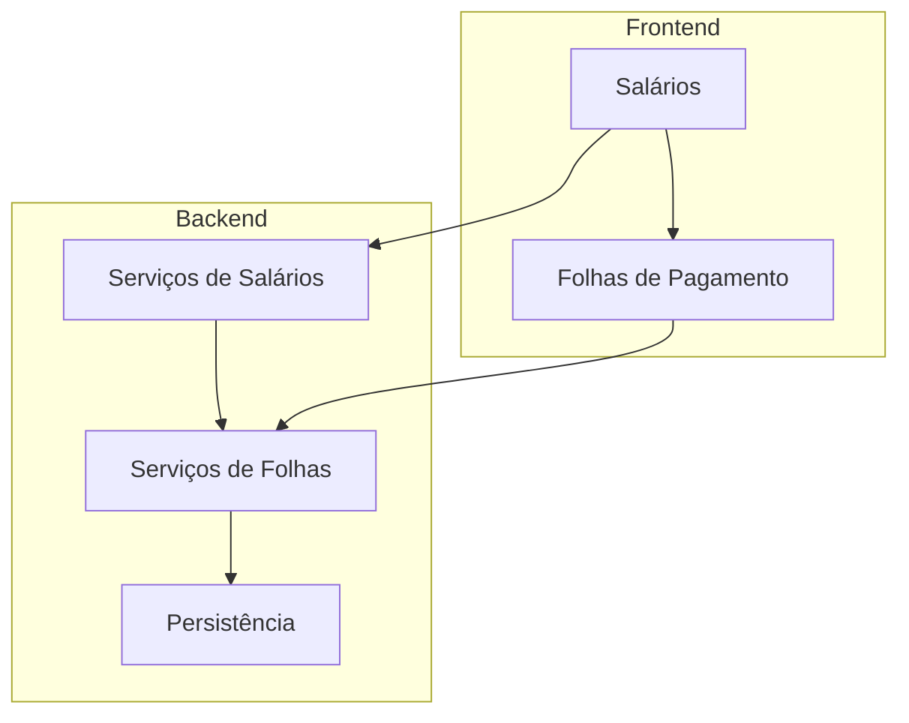
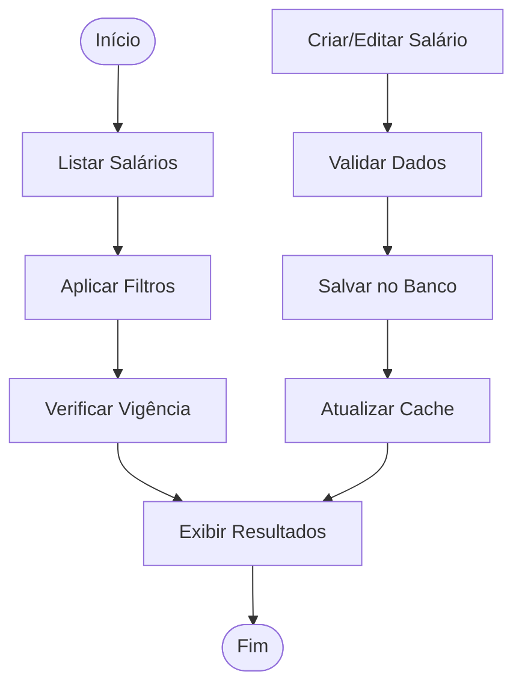
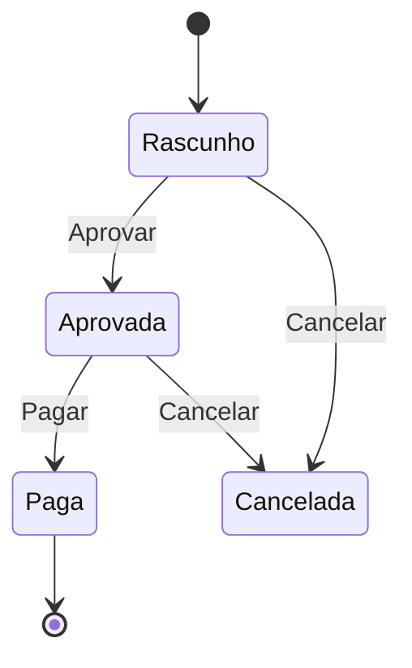
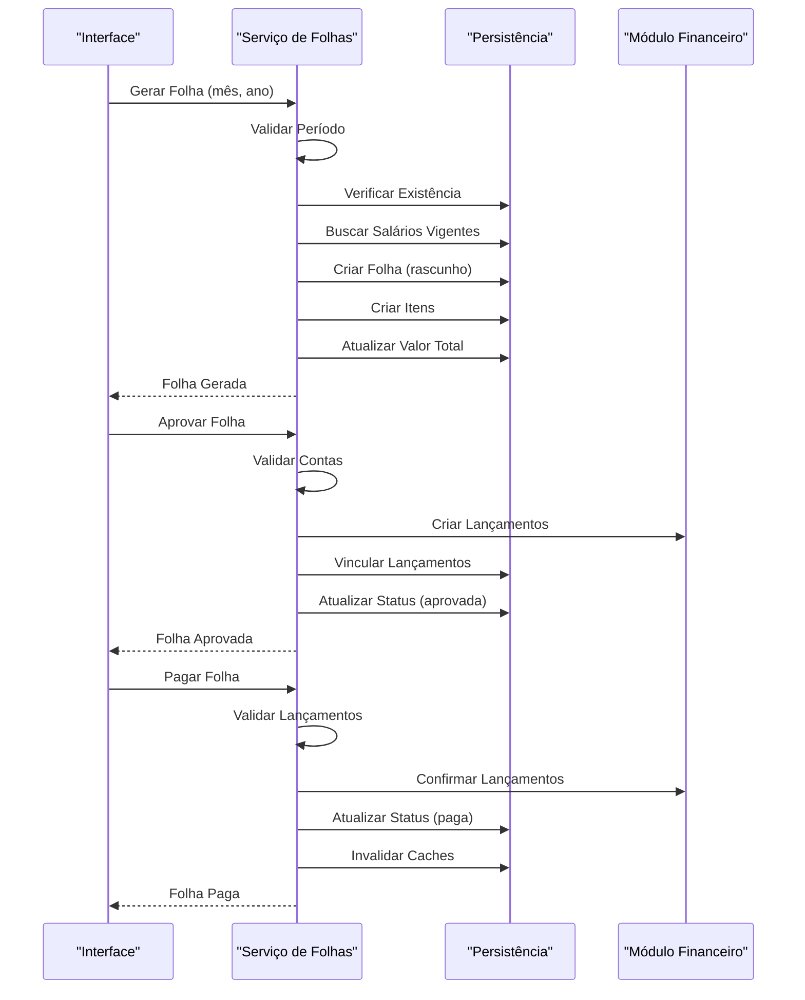

# Recursos Humanos

<cite>
**Arquivos Referenciados neste Documento**   
- [folhas-pagamento.tsx](file://app/(dashboard)/rh/folhas-pagamento/page.tsx)
- [salarios.tsx](file://app/(dashboard)/rh/salarios/page.tsx)
- [gerar-folha.service.ts](file://backend/rh/salarios/services/folhas/gerar-folha.service.ts)
- [aprovar-folha.service.ts](file://backend/rh/salarios/services/folhas/aprovar-folha.service.ts)
- [pagar-folha.service.ts](file://backend/rh/salarios/services/folhas/pagar-folha.service.ts)
- [folhas-pagamento-persistence.service.ts](file://backend/rh/salarios/services/persistence/folhas-pagamento-persistence.service.ts)
- [salarios-persistence.service.ts](file://backend/rh/salarios/services/persistence/salarios-persistence.service.ts)
</cite>

## Sumário
1. [Introdução](#introdução)
2. [Estrutura do Módulo de RH](#estrutura-do-módulo-de-rh)
3. [Gestão de Salários](#gestão-de-salários)
4. [Folhas de Pagamento](#folhas-de-pagamento)
5. [Fluxo de Processamento de Folha](#fluxo-de-processamento-de-folha)
6. [Análise de Componentes](#análise-de-componentes)
7. [Conclusão](#conclusão)

## Introdução

O módulo de Recursos Humanos (RH) do sistema Sinesys é responsável pela gestão de salários e folhas de pagamento dos funcionários. Este documento apresenta uma análise detalhada da arquitetura, funcionalidades e fluxos de trabalho relacionados à gestão salarial e processamento de folhas de pagamento, com foco nos componentes principais e sua interação.

**Arquivos Referenciados neste Documento**   
- [folhas-pagamento.tsx](file://app/(dashboard)/rh/folhas-pagamento/page.tsx)
- [salarios.tsx](file://app/(dashboard)/rh/salarios/page.tsx)
- [gerar-folha.service.ts](file://backend/rh/salarios/services/folhas/gerar-folha.service.ts)
- [aprovar-folha.service.ts](file://backend/rh/salarios/services/folhas/aprovar-folha.service.ts)
- [pagar-folha.service.ts](file://backend/rh/salarios/services/folhas/pagar-folha.service.ts)

## Estrutura do Módulo de RH

O módulo de RH está organizado em duas principais áreas funcionais: gestão de salários e processamento de folhas de pagamento. A estrutura do código reflete essa divisão, com componentes de interface do usuário (frontend) e serviços de negócio (backend) separados por responsabilidade.

**Fontes do Diagrama**
- [salarios.tsx](file://app/(dashboard)/rh/salarios/page.tsx)
- [folhas-pagamento.tsx](file://app/(dashboard)/rh/folhas-pagamento/page.tsx)
- [gerar-folha.service.ts](file://backend/rh/salarios/services/folhas/gerar-folha.service.ts)

## Gestão de Salários

A gestão de salários permite o cadastro, edição e histórico de salários dos funcionários, com controle de vigência e status. O sistema suporta múltiplos salários por funcionário com diferentes períodos de vigência.

### Funcionalidades Principais

- Cadastro de salários com data de início e fim de vigência
- Visualização de histórico salarial por funcionário
- Cálculo de custo total de pessoal
- Filtros avançados por funcionário, cargo e período

**Fontes do Diagrama**
- [salarios.tsx](file://app/(dashboard)/rh/salarios/page.tsx)
- [salarios-persistence.service.ts](file://backend/rh/salarios/services/persistence/salarios-persistence.service.ts)

**Fontes da Seção**
- [salarios.tsx](file://app/(dashboard)/rh/salarios/page.tsx)
- [salarios-persistence.service.ts](file://backend/rh/salarios/services/persistence/salarios-persistence.service.ts)

## Folhas de Pagamento

O processamento de folhas de pagamento é dividido em três etapas principais: geração, aprovação e pagamento. Cada etapa possui validações específicas e altera o status da folha.

### Etapas do Processamento

1. **Geração**: Criação da folha com base nos salários vigentes
2. **Aprovação**: Validação e criação de lançamentos financeiros
3. **Pagamento**: Confirmação dos lançamentos e atualização do status

**Fontes do Diagrama**
- [gerar-folha.service.ts](file://backend/rh/salarios/services/folhas/gerar-folha.service.ts)
- [aprovar-folha.service.ts](file://backend/rh/salarios/services/folhas/aprovar-folha.service.ts)
- [pagar-folha.service.ts](file://backend/rh/salarios/services/folhas/pagar-folha.service.ts)

**Fontes da Seção**
- [folhas-pagamento.tsx](file://app/(dashboard)/rh/folhas-pagamento/page.tsx)
- [gerar-folha.service.ts](file://backend/rh/salarios/services/folhas/gerar-folha.service.ts)

## Fluxo de Processamento de Folha

O fluxo completo de processamento de uma folha de pagamento envolve múltiplas validações e integrações entre diferentes serviços do sistema.

**Fontes do Diagrama**
- [gerar-folha.service.ts](file://backend/rh/salarios/services/folhas/gerar-folha.service.ts)
- [aprovar-folha.service.ts](file://backend/rh/salarios/services/folhas/aprovar-folha.service.ts)
- [pagar-folha.service.ts](file://backend/rh/salarios/services/folhas/pagar-folha.service.ts)
- [folhas-pagamento-persistence.service.ts](file://backend/rh/salarios/services/persistence/folhas-pagamento-persistence.service.ts)

## Análise de Componentes

### Componente de Folhas de Pagamento

O componente de folhas de pagamento fornece uma interface para visualização, filtragem e geração de folhas mensais.

**Fontes da Seção**
- [folhas-pagamento.tsx](file://app/(dashboard)/rh/folhas-pagamento/page.tsx)

### Serviço de Geração de Folha

O serviço de geração de folha valida o período, verifica a existência de folhas anteriores e cria uma nova folha com base nos salários vigentes.

**Fontes da Seção**
- [gerar-folha.service.ts](file://backend/rh/salarios/services/folhas/gerar-folha.service.ts)

### Serviço de Aprovação de Folha

O serviço de aprovação valida as contas contábeis e bancárias, cria lançamentos financeiros e vincula-os aos itens da folha.

**Fontes da Seção**
- [aprovar-folha.service.ts](file://backend/rh/salarios/services/folhas/aprovar-folha.service.ts)

### Serviço de Pagamento de Folha

O serviço de pagamento confirma os lançamentos financeiros e atualiza o status da folha para "paga".

**Fontes da Seção**
- [pagar-folha.service.ts](file://backend/rh/salarios/services/folhas/pagar-folha.service.ts)

## Conclusão

O módulo de Recursos Humanos do Sinesys oferece uma solução completa para gestão salarial e processamento de folhas de pagamento, com um fluxo de trabalho bem definido e integração com o módulo financeiro. A arquitetura em camadas garante separação de responsabilidades e facilita a manutenção e evolução do sistema.