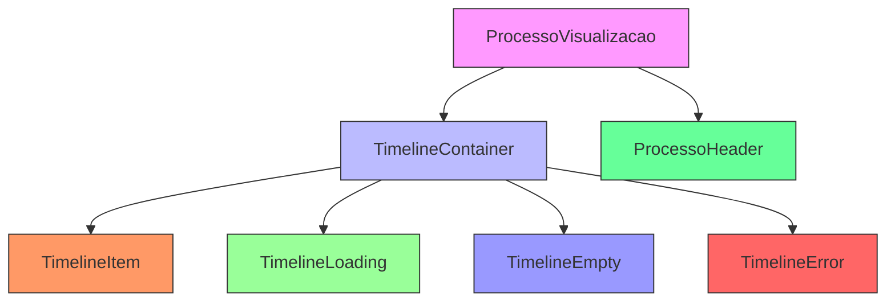
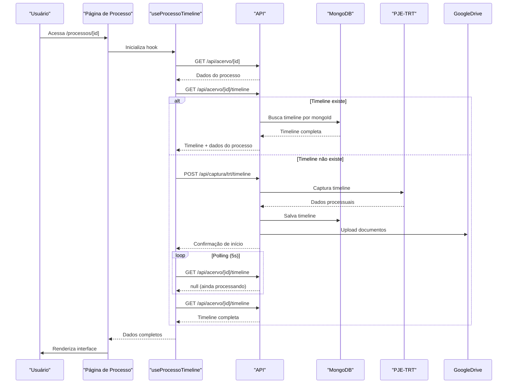
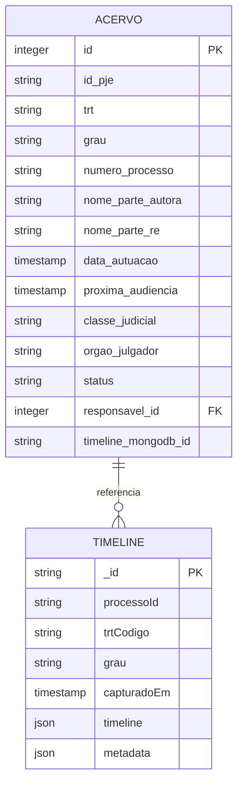

# Visualizacao Processo Timeline

<cite>
**Arquivos Referenciados neste Documento**   
- [use-processo-timeline.ts](file://app/_lib/hooks/use-processo-timeline.ts) - *Implementação completa do hook para gerenciamento de timeline*
- [timeline-container.tsx](file://components/processos/timeline-container.tsx) - *Container principal da timeline atualizado*
- [timeline-item.tsx](file://components/processos/timeline-item.tsx) - *Renderização de itens individuais da timeline*
- [timeline-loading.tsx](file://components/processos/timeline-loading.tsx) - *Estado de carregamento e captura*
- [timeline-empty.tsx](file://components/processos/timeline-empty.tsx) - *Estado vazio da timeline*
- [timeline-error.tsx](file://components/processos/timeline-error.tsx) - *Tratamento de erros na timeline*
- [processo-visualizacao.tsx](file://app/(dashboard)/processos/[id]/processo-visualizacao.tsx) - *Página de visualização do processo*
- [route.ts](file://app/api/acervo/[id]/timeline/route.ts) - *Rota de API para timeline existente*
- [route.ts](file://app/api/captura/trt/timeline/route.ts) - *Rota de API para captura de timeline*
- [timeline-persistence.service.ts](file://backend/captura/services/timeline/timeline-persistence.service.ts) - *Serviço de persistência da timeline no MongoDB*
- [responsive-dialog.tsx](file://components/ui/responsive-dialog.tsx) - *Componente de diálogo responsivo para interface móvel*
</cite>

## Sumário
1. [Introdução](#introdução)
2. [Estrutura de Componentes](#estrutura-de-componentes)
3. [Fluxo de Dados e Processamento](#fluxo-de-dados-e-processamento)
4. [Estados de Interface](#estados-de-interface)
5. [Arquitetura de Dados](#arquitetura-de-dados)
6. [Análise Detalhada dos Componentes](#análise-detalhada-dos-componentes)
7. [Considerações de Performance](#considerações-de-performance)
8. [Conclusão](#conclusão)

## Introdução
O sistema de visualização de processo com timeline no Sinesys implementa uma solução completa para exibição de movimentações processuais e documentos, com captura automática sob demanda do PJE/TRT. A funcionalidade utiliza uma arquitetura híbrida que combina PostgreSQL para dados relacionais e MongoDB para armazenamento de documentos, permitindo uma visualização rica e eficiente dos processos jurídicos.

A implementação segue o padrão de "lazy loading", onde a timeline é capturada apenas quando o usuário expressa interesse em visualizá-la, otimizando recursos e tempo de processamento. O sistema verifica automaticamente a existência da timeline no MongoDB e, caso não exista, inicia o processo de captura através dos endpoints de integração com o PJE-TRT.

**Atualizado** A visualização de timeline foi atualizada para usar o novo componente ResponsiveDialog, melhorando significativamente a responsividade na interface móvel. Esta mudança garante uma experiência de usuário consistente em diferentes dispositivos, utilizando diálogos modais em desktop e sheets em dispositivos móveis.

**Section sources**
- [use-processo-timeline.ts](file://app/_lib/hooks/use-processo-timeline.ts#L1-L316) - *Hook principal atualizado com lógica completa de captura*
- [processo-visualizacao.tsx](file://app/(dashboard)/processos/[id]/processo-visualizacao.tsx#L1-L203) - *Página de processo com integração ao hook*
- [responsive-dialog.tsx](file://components/ui/responsive-dialog.tsx#L1-L278) - *Implementação do componente responsivo*

## Estrutura de Componentes
A visualização de processo com timeline é composta por uma hierarquia de componentes React que trabalham em conjunto para fornecer uma experiência de usuário completa. A estrutura principal é organizada em torno do componente `ProcessoVisualizacao`, que coordena os diferentes estados e componentes da interface.

Os componentes principais incluem:
- `TimelineContainer`: Container principal que gerencia a lista de itens da timeline
- `TimelineItem`: Renderiza um item individual da timeline (documento ou movimento)
- `TimelineLoading`: Exibe estados de carregamento e captura
- `TimelineEmpty`: Estado vazio quando não há itens na timeline
- `TimelineError`: Trata e exibe erros de carregamento

A arquitetura de componentes segue o princípio de responsabilidade única, onde cada componente tem uma função específica e bem definida, facilitando a manutenção e testes.

**Fontes do diagrama**
- [timeline-container.tsx](file://components/processos/timeline-container.tsx#L1-L88) - *Implementação do container principal*
- [timeline-item.tsx](file://components/processos/timeline-item.tsx#L1-L193) - *Componente de item individual*

## Fluxo de Dados e Processamento
O fluxo de dados na visualização de processo com timeline segue um padrão bem definido que começa com a navegação do usuário e termina com a renderização completa da interface. O processo envolve múltiplas etapas de verificação, captura e exibição de dados.

Quando o usuário acessa a página de visualização de um processo, o hook `useProcessoTimeline` é acionado, iniciando uma sequência de operações:

1. Busca os dados do processo no PostgreSQL via endpoint `/api/acervo/[id]`
2. Verifica a existência da timeline no MongoDB através do campo `timeline_mongodb_id`
3. Se a timeline não existir, inicia a captura via POST `/api/captura/trt/timeline`
4. Durante a captura, realiza polling periódico para verificar a conclusão
5. Após a conclusão, carrega a timeline completa e a exibe na interface

O sistema implementa um mecanismo de polling com timeout configurável (60 tentativas de 5 segundos, totalizando 5 minutos), garantindo que a interface não fique travada indefinidamente em caso de falhas.

**Fontes do diagrama**
- [use-processo-timeline.ts](file://app/_lib/hooks/use-processo-timeline.ts#L1-L316) - *Lógica completa do hook de timeline*
- [route.ts](file://app/api/acervo/[id]/timeline/route.ts#L1-L148) - *Rota de obtenção da timeline*
- [route.ts](file://app/api/captura/trt/timeline/route.ts#L1-L205) - *Rota de captura da timeline*

## Estados de Interface
O sistema implementa quatro estados principais de interface para cobrir todos os cenários possíveis durante a visualização de um processo:

### Estado de Carregamento
O estado de carregamento é exibido durante a inicialização da página e durante o processo de captura. Ele apresenta um skeleton com animações de pulsação para indicar que a interface está ativa. Quando a captura está em andamento, uma mensagem contextual é exibida com o progresso e um ícone de spinner animado.

### Estado de Captura
Durante a captura da timeline, o sistema exibe mensagens de progresso contextualizadas que evoluem com o tempo decorrido:
- Até 10 segundos: "Iniciando captura da timeline..."
- 10-60 segundos: "Capturando movimentos e documentos do PJE... (isso pode levar alguns minutos)"
- 60-120 segundos: "Baixando documentos e enviando para Google Drive..."
- Após 120 segundos: "Processando documentos... Quase pronto!"

### Estado Vazio
O estado vazio é exibido quando a timeline foi capturada mas não contém nenhum item. Ele apresenta uma ilustração com ícone de busca e uma mensagem informativa explicando que o processo não possui movimentações ou documentos no PJE.

### Estado de Erro
O sistema implementa tratamento de erros granular com mensagens específicas para diferentes tipos de falha:
- Processo não encontrado
- Erro de autenticação no PJE
- Timeout na captura
- Configuração incompleta (advogado não configurado)

Cada erro tem uma mensagem de solução específica e, quando aplicável, um botão de tentativa novamente.

**Section sources**
- [timeline-loading.tsx](file://components/processos/timeline-loading.tsx#L1-L92) - *Implementação do estado de carregamento*
- [timeline-empty.tsx](file://components/processos/timeline-empty.tsx#L1-L46) - *Estado vazio da timeline*
- [timeline-error.tsx](file://components/processos/timeline-error.tsx#L1-L114) - *Tratamento de erros com mensagens específicas*

## Arquitetura de Dados
A arquitetura de dados da visualização de processo com timeline utiliza um modelo híbrido que combina PostgreSQL e MongoDB para otimizar o armazenamento e recuperação de diferentes tipos de dados.

### Modelo Relacional (PostgreSQL)
O PostgreSQL armazena os dados relacionais do processo na tabela `acervo`, incluindo:
- Identificadores (ID, ID do PJE)
- Metadados básicos (TRT, grau, número do processo)
- Informações das partes (autora, ré)
- Datas importantes (autuação, próxima audiência)
- Referência para a timeline no MongoDB (`timeline_mongodb_id`)

### Modelo Documental (MongoDB)
O MongoDB armazena a timeline completa como um documento enriquecido, com a seguinte estrutura:
- `processoId`: ID do processo no PJE
- `trtCodigo`: Código do TRT
- `grau`: Grau da instância
- `capturadoEm`: Data/hora da captura
- `timeline`: Array de itens da timeline
- `metadata`: Metadados da timeline (totais, versão do schema)

Cada item da timeline contém:
- `id`: Identificador único
- `titulo`: Título do movimento ou documento
- `data`: Data/hora do evento
- `documento`: Indicador se é um documento
- `tipo`: Tipo do documento (ex: "Certidão", "Petição")
- `nomeResponsavel`: Nome do responsável
- `nomeSignatario`: Nome do signatário (se assinado)
- `googleDrive`: Links para visualização e download

**Fontes do diagrama**
- [route.ts](file://app/api/acervo/[id]/timeline/route.ts#L1-L148) - *Estrutura de dados da timeline*
- [timeline-persistence.service.ts](file://backend/captura/services/timeline/timeline-persistence.service.ts#L1-L203) - *Serviço de persistência no MongoDB*

## Análise Detalhada dos Componentes

### Hook useProcessoTimeline
O hook `useProcessoTimeline` é o coração da funcionalidade, encapsulando toda a lógica de verificação, captura e gerenciamento de estado. Ele utiliza o padrão de custom hook do React para fornecer uma interface consistente e reutilizável.

O hook retorna um objeto com as seguintes propriedades:
- `processo`: Dados do processo ou null
- `timeline`: Timeline completa ou null
- `isLoading`: Indicador de carregamento inicial
- `isCapturing`: Indicador de captura em andamento
- `error`: Objeto de erro ou null
- `captureProgress`: Mensagem de progresso contextual
- `refetch`: Função para recarregar dados

A implementação utiliza `useEffect` para carregar os dados iniciais e `useCallback` para memoizar funções importantes, garantindo eficiência na renderização.

**Section sources**
- [use-processo-timeline.ts](file://app/_lib/hooks/use-processo-timeline.ts#L1-L316) - *Implementação completa do hook com todas as funcionalidades*

### Componente TimelineContainer
O `TimelineContainer` é responsável por renderizar a lista completa de itens da timeline, ordenados cronologicamente (descendente - mais recente primeiro). Ele implementa otimizações de performance utilizando `useMemo` para memorizar a ordenação dos itens.

O componente exibe um cabeçalho com estatísticas da timeline:
- Número total de itens
- Número de documentos
- Número de movimentos

A ordenação é feita pelo campo `data` de cada item, garantindo que os eventos mais recentes apareçam no topo da lista.

**Section sources**
- [timeline-container.tsx](file://components/processos/timeline-container.tsx#L1-L88) - *Implementação do container com ordenação e estatísticas*

### Componente TimelineItem
O `TimelineItem` renderiza um item individual da timeline com uma representação visual diferenciada para documentos e movimentos. Documentos são representados com ícone azul de documento, enquanto movimentos usam ícone cinza de atividade.

Para documentos, o componente exibe ações específicas:
- Botão "Ver Documento" que abre o link de visualização no Google Drive
- Botão "Download" que abre o link de download
- Badges indicando tipo do documento e status de assinatura

O componente utiliza animações de entrada com Framer Motion para uma experiência de usuário mais suave, com um pequeno delay entre os itens para criar um efeito de sequência.

**Section sources**
- [timeline-item.tsx](file://components/processos/timeline-item.tsx#L1-L193) - *Implementação completa do item com ações e animações*

### Componente ResponsiveDialog
O componente `ResponsiveDialog` foi recentemente integrado à visualização de timeline para melhorar a experiência em dispositivos móveis. Ele implementa uma abordagem responsiva que adapta o comportamento da interface com base no tamanho da tela:

- Em desktop (≥640px): Utiliza o componente `Dialog` padrão com modal centralizado
- Em dispositivos móveis (<640px): Utiliza o componente `Sheet` com comportamento de bottom sheet ou fullscreen

Esta mudança melhora significativamente a usabilidade em dispositivos móveis, garantindo que:
- Formulários sejam responsivos sem scroll horizontal
- Botões fiquem posicionados adequadamente (sticky no bottom em mobile)
- Scroll vertical funcione quando o conteúdo excede a viewport
- O scroll do background seja prevenido quando o diálogo estiver aberto

O componente fornece uma API consistente com wrappers para todos os elementos do diálogo (Header, Title, Description, Footer, Close), permitindo que os componentes superiores utilizem uma interface única que se adapta automaticamente ao dispositivo.

**Section sources**
- [responsive-dialog.tsx](file://components/ui/responsive-dialog.tsx#L1-L278) - *Implementação completa do componente responsivo*

## Considerações de Performance
O sistema implementa várias otimizações de performance para garantir uma experiência de usuário fluida, mesmo com timelines extensas contendo centenas de itens.

### Estratégia de Captura Sob Demanda
A captura sob demanda (lazy loading) é a principal otimização, evitando a carga desnecessária de recursos. Apenas os processos que os usuários realmente visualizam têm sua timeline capturada, economizando tempo de processamento e largura de banda.

### Memoização e Otimizações do React
Os componentes utilizam técnicas de memoização para evitar renderizações desnecessárias:
- `useMemo` para memorizar a ordenação dos itens da timeline
- `useCallback` para memoizar funções de callback
- Componentes funcionais com props bem definidas

### Paginação e Virtualização
Embora não implementada nesta versão, a arquitetura permite a adição futura de paginação ou virtualização para lidar com timelines muito extensas. A estrutura atual já prepara o terreno para essas melhorias.

### Tempo de Resposta
O sistema é projetado para atender aos seguintes SLAs de performance:
- Carregamento inicial (timeline existente): < 2 segundos
- Captura completa (processo médio ~50 documentos): < 3 minutos
- Interface responsiva durante a captura

## Conclusão
A implementação da visualização de processo com timeline no Sinesys representa uma solução robusta e eficiente para a gestão jurídica de processos. A arquitetura híbrida que combina PostgreSQL e MongoDB permite um equilíbrio ideal entre dados relacionais estruturados e documentos processuais flexíveis.

O padrão de "lazy loading" com captura sob demanda otimiza recursos e proporciona uma experiência de usuário mais rápida, enquanto a separação clara de responsabilidades entre componentes facilita a manutenção e evolução do sistema.

A recente atualização para o componente `ResponsiveDialog` demonstra o compromisso com a experiência do usuário em diferentes dispositivos, garantindo que a interface seja intuitiva e funcional tanto em desktop quanto em dispositivos móveis. Esta melhoria na responsividade torna a plataforma mais acessível e eficiente para advogados que precisam acessar informações processuais em qualquer lugar.

A solução está bem preparada para escalar, com possibilidades de melhorias futuras como paginação, filtros avançados e cache adicional, mantendo a simplicidade e eficácia da implementação atual.