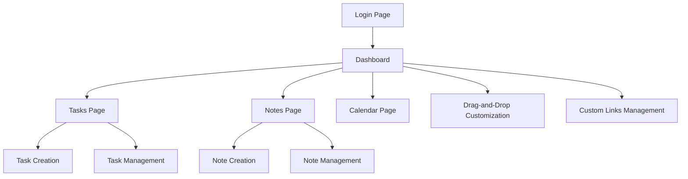

## 1. Product Overview
A customizable user dashboard application that provides personalized workspace with statistics, notes, tasks, and useful links. The dashboard adapts to each user's context, showing only their data, with special permissions for Super Admin users.

This product solves the problem of scattered personal productivity tools by centralizing tasks, notes, and quick access to resources in one customizable interface.

## 2. Core Features

### 2.1 User Roles
| Role | Registration Method | Core Permissions |
|------|---------------------|------------------|
| Normal User | Email registration | Access personal dashboard, create/edit own content |
| Super Admin | System assignment | Access all user data, system-wide configuration |

### 2.2 Feature Module
Our dashboard application consists of the following main pages:
1. **Dashboard**: Personalized workspace with draggable components including statistics, notes, tasks, and custom links.
2. **Tasks**: Dedicated task management page with list view for organizing and tracking personal tasks.
3. **Calendar**: Personal scheduling and event management (future consideration).
4. **Notes**: Dedicated notes management page for creating and organizing personal notes.

### 2.3 Page Details
| Page Name | Module Name | Feature description |
|-----------|-------------|---------------------|
| Dashboard | Stats Component | Display personalized statistics and metrics relevant to the user |
| Dashboard | Custom Links | Allow users to add, edit, and organize their frequently used links |
| Dashboard | Notes Widget | Quick note creation and display of recent notes |
| Dashboard | Task Widget | Create and view personal tasks directly from dashboard |
| Dashboard | Drag-and-Drop | Reorganize dashboard components through intuitive drag-and-drop interface |
| Tasks | Task List | View all personal tasks in organized list format |
| Tasks | Task Creation | Add new tasks with title, description, and status |
| Tasks | Task Management | Edit, delete, and update task status |
| Notes | Note Creation | Create and save text-based notes |
| Notes | Note Management | Edit, delete, and organize personal notes |

## 3. Core Process
**User Flow:**
1. User logs in and lands on personalized dashboard
2. User can drag-and-drop components to customize layout
3. User creates tasks/notes directly from dashboard widgets
4. User accesses dedicated pages for detailed task/note management
5. All content is automatically filtered to show only user's data

**Super Admin Flow:**
1. Super Admin can access system-wide data and configurations
2. Super Admin can view aggregated statistics across all users

## 4. User Interface Design

### 4.1 Design Style
- **Primary Colors**: Modern blue (#3B82F6) for primary actions, gray (#6B7280) for secondary elements
- **Secondary Colors**: White backgrounds with subtle gray borders (#E5E7EB)
- **Button Style**: Rounded corners (8px radius), subtle shadows on hover
- **Font**: System fonts (Inter, sans-serif) with clear hierarchy
- **Layout Style**: Card-based components with consistent spacing (16px grid)
- **Icons**: Minimalist line icons, consistent throughout the application

### 4.2 Page Design Overview
| Page Name | Module Name | UI Elements |
|-----------|-------------|-------------|
| Dashboard | Stats Cards | Grid layout with 2-4 cards showing key metrics, clean typography, subtle animations |
| Dashboard | Widget Container | Draggable cards with grab handles, visual feedback during drag operations |
| Dashboard | Custom Links | Icon-based link cards with editable titles and URLs, add/remove buttons |
| Dashboard | Notes Widget | Text preview cards with creation timestamp, expandable for full content |
| Dashboard | Task Widget | Compact task list with checkbox status, priority indicators |
| Tasks | Task List View | Full-width table/list with sortable columns, status badges |
| Notes | Notes Grid | Card-based grid layout with search and filter options |

### 4.3 Responsiveness
Desktop-first design approach with mobile adaptation. Touch interaction optimization for drag-and-drop functionality on tablets and mobile devices.