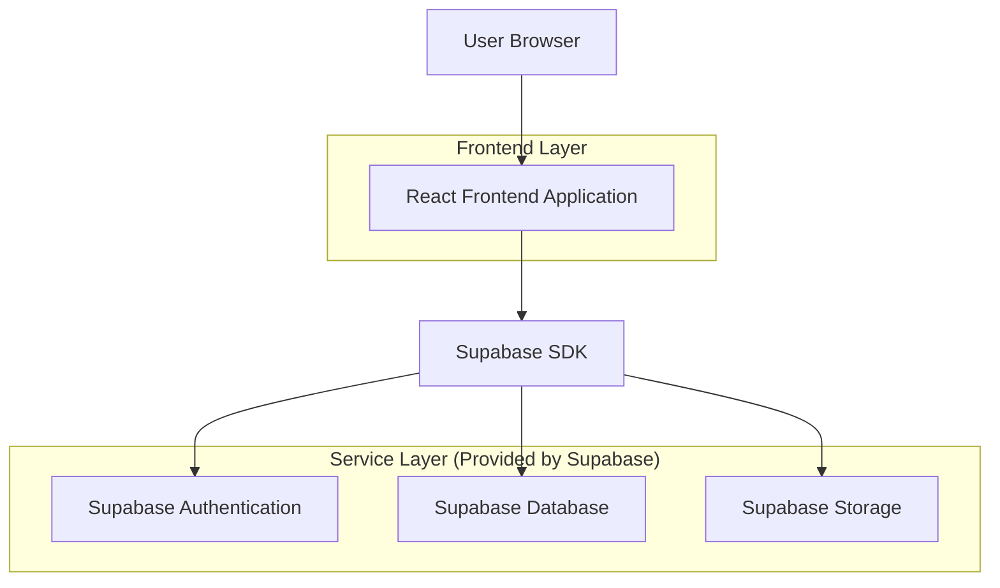
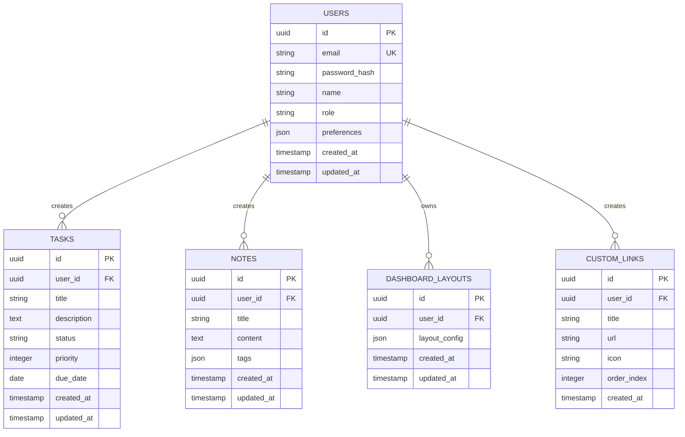

## 1. Architecture design



## 2. Technology Description
- Frontend: React@18 + tailwindcss@3 + vite
- Initialization Tool: vite-init
- Backend: Supabase (Authentication, Database, Storage)
- UI Components: ShadCN UI primitives with custom modifications
- Drag-and-Drop: React DnD or similar library

## 3. Route definitions
| Route | Purpose |
|-------|---------|
| / | Dashboard page, main personalized workspace |
| /login | Login page, user authentication |
| /register | Registration page, new user signup |
| /tasks | Task management page, list view of all tasks |
| /notes | Notes management page, grid/list view of notes |
| /calendar | Calendar page, scheduling and events (future) |
| /profile | User profile page, settings and preferences |

## 4. API definitions

### 4.1 Core API (Supabase SDK)

**Authentication**
```
supabase.auth.signInWithPassword
supabase.auth.signUp
supabase.auth.signOut
supabase.auth.getSession
```

**Database Operations**
```
supabase.from('tasks').select('*')
supabase.from('tasks').insert([task])
supabase.from('tasks').update([task]).eq('id', id)
supabase.from('tasks').delete().eq('id', id)

supabase.from('notes').select('*')
supabase.from('notes').insert([note])
supabase.from('notes').update([note]).eq('id', id)
supabase.from('notes').delete().eq('id', id)

supabase.from('dashboard_layout').select('*')
supabase.from('dashboard_layout').upsert([layout])
```

**Storage Operations**
```
supabase.storage.from('user-files').upload(file)
supabase.storage.from('user-files').download(path)
```

## 5. Server architecture diagram
Not applicable - using Supabase as Backend-as-a-Service

## 6. Data model

### 6.1 Data model definition


### 6.2 Data Definition Language

**Users Table**
```sql
-- create table
CREATE TABLE users (
    id UUID PRIMARY KEY DEFAULT gen_random_uuid(),
    email VARCHAR(255) UNIQUE NOT NULL,
    password_hash VARCHAR(255) NOT NULL,
    name VARCHAR(100) NOT NULL,
    role VARCHAR(20) DEFAULT 'user' CHECK (role IN ('user', 'super_admin')),
    preferences JSONB DEFAULT '{}',
    created_at TIMESTAMP WITH TIME ZONE DEFAULT NOW(),
    updated_at TIMESTAMP WITH TIME ZONE DEFAULT NOW()
);

-- create index
CREATE INDEX idx_users_email ON users(email);
CREATE INDEX idx_users_role ON users(role);
```

**Tasks Table**
```sql
-- create table
CREATE TABLE tasks (
    id UUID PRIMARY KEY DEFAULT gen_random_uuid(),
    user_id UUID REFERENCES users(id) ON DELETE CASCADE,
    title VARCHAR(255) NOT NULL,
    description TEXT,
    status VARCHAR(20) DEFAULT 'pending' CHECK (status IN ('pending', 'in_progress', 'completed')),
    priority INTEGER DEFAULT 1 CHECK (priority BETWEEN 1 AND 5),
    due_date DATE,
    created_at TIMESTAMP WITH TIME ZONE DEFAULT NOW(),
    updated_at TIMESTAMP WITH TIME ZONE DEFAULT NOW()
);

-- create index
CREATE INDEX idx_tasks_user_id ON tasks(user_id);
CREATE INDEX idx_tasks_status ON tasks(status);
CREATE INDEX idx_tasks_priority ON tasks(priority);
CREATE INDEX idx_tasks_due_date ON tasks(due_date);
```

**Notes Table**
```sql
-- create table
CREATE TABLE notes (
    id UUID PRIMARY KEY DEFAULT gen_random_uuid(),
    user_id UUID REFERENCES users(id) ON DELETE CASCADE,
    title VARCHAR(255) NOT NULL,
    content TEXT,
    tags JSONB DEFAULT '[]',
    created_at TIMESTAMP WITH TIME ZONE DEFAULT NOW(),
    updated_at TIMESTAMP WITH TIME ZONE DEFAULT NOW()
);

-- create index
CREATE INDEX idx_notes_user_id ON notes(user_id);
CREATE INDEX idx_notes_created_at ON notes(created_at DESC);
```

**Dashboard Layouts Table**
```sql
-- create table
CREATE TABLE dashboard_layouts (
    id UUID PRIMARY KEY DEFAULT gen_random_uuid(),
    user_id UUID REFERENCES users(id) ON DELETE CASCADE UNIQUE,
    layout_config JSONB NOT NULL DEFAULT '{}',
    created_at TIMESTAMP WITH TIME ZONE DEFAULT NOW(),
    updated_at TIMESTAMP WITH TIME ZONE DEFAULT NOW()
);

-- create index
CREATE INDEX idx_dashboard_layouts_user_id ON dashboard_layouts(user_id);
```

**Custom Links Table**
```sql
-- create table
CREATE TABLE custom_links (
    id UUID PRIMARY KEY DEFAULT gen_random_uuid(),
    user_id UUID REFERENCES users(id) ON DELETE CASCADE,
    title VARCHAR(255) NOT NULL,
    url VARCHAR(500) NOT NULL,
    icon VARCHAR(100),
    order_index INTEGER DEFAULT 0,
    created_at TIMESTAMP WITH TIME ZONE DEFAULT NOW()
);

-- create index
CREATE INDEX idx_custom_links_user_id ON custom_links(user_id);
CREATE INDEX idx_custom_links_order ON custom_links(user_id, order_index);
```

**Row Level Security Policies**
```sql
-- Grant basic access to anon role
GRANT SELECT ON tasks TO anon;
GRANT SELECT ON notes TO anon;
GRANT SELECT ON custom_links TO anon;

-- Grant full access to authenticated role
GRANT ALL PRIVILEGES ON tasks TO authenticated;
GRANT ALL PRIVILEGES ON notes TO authenticated;
GRANT ALL PRIVILEGES ON dashboard_layouts TO authenticated;
GRANT ALL PRIVILEGES ON custom_links TO authenticated;

-- Create RLS policies for user isolation
ALTER TABLE tasks ENABLE ROW LEVEL SECURITY;
ALTER TABLE notes ENABLE ROW LEVEL SECURITY;
ALTER TABLE dashboard_layouts ENABLE ROW LEVEL SECURITY;
ALTER TABLE custom_links ENABLE ROW LEVEL SECURITY;

-- User can only see their own data
CREATE POLICY "Users can view own tasks" ON tasks FOR SELECT USING (auth.uid() = user_id);
CREATE POLICY "Users can manage own tasks" ON tasks FOR ALL USING (auth.uid() = user_id);

CREATE POLICY "Users can view own notes" ON notes FOR SELECT USING (auth.uid() = user_id);
CREATE POLICY "Users can manage own notes" ON notes FOR ALL USING (auth.uid() = user_id);

CREATE POLICY "Users can view own layout" ON dashboard_layouts FOR SELECT USING (auth.uid() = user_id);
CREATE POLICY "Users can manage own layout" ON dashboard_layouts FOR ALL USING (auth.uid() = user_id);

CREATE POLICY "Users can view own links" ON custom_links FOR SELECT USING (auth.uid() = user_id);
CREATE POLICY "Users can manage own links" ON custom_links FOR ALL USING (auth.uid() = user_id);
```