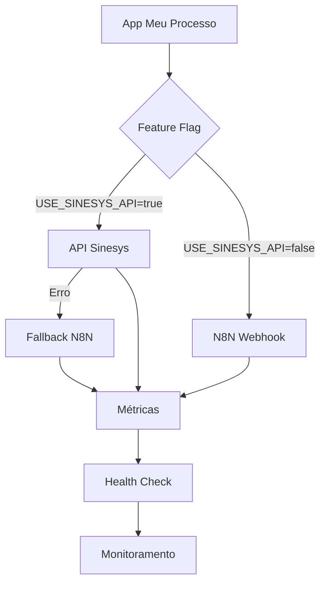

# Guia de Deploy e Rollback - API Meu Processo

**Versão:** 1.0  
**Data:** 08/12/2025  
**Status:** Fase 6 - Pronto para Deploy

---

## 📋 Índice

1. [Visão Geral](#visão-geral)
2. [Pré-requisitos](#pré-requisitos)
3. [Configuração](#configuração)
4. [Estratégia de Deploy](#estratégia-de-deploy)
5. [Monitoramento](#monitoramento)
6. [Rollback](#rollback)
7. [Troubleshooting](#troubleshooting)
8. [Checklist](#checklist)

---

## 🎯 Visão Geral

### Contexto

A API Meu Processo foi migrada do webhook N8N para consumir dados diretamente das APIs REST do Sinesys, mantendo compatibilidade com o formato legado.

### Feature Flag

O sistema suporta **toggle em tempo real** entre as duas fontes de dados:

- **Sinesys API** (novo) - API REST nativa do Sinesys
- **N8N Webhook** (legado) - Webhook atual em produção

### Arquitetura de Deploy



---

## ✅ Pré-requisitos

### 1. Variáveis de Ambiente

Adicionar ao `.env.local` (ou `.env.production`):

```env
# =============================================================================
# MEU PROCESSO - Migração de Webhook N8N para API Sinesys
# =============================================================================

# Feature flag para ativar/desativar nova API
MEU_PROCESSO_USE_SINESYS_API=false

# URL do webhook N8N (fallback quando USE_SINESYS_API=false)
MEU_PROCESSO_N8N_WEBHOOK_URL=https://workflows.platform.sinesys.app/webhook/meu-processo
MEU_PROCESSO_N8N_WEBHOOK_USER=meu_processo
MEU_PROCESSO_N8N_WEBHOOK_PASSWORD=yC2su27Gr3vxr4G7

# Timeout para chamadas da API (ms)
MEU_PROCESSO_TIMEOUT=30000

# Número de tentativas em caso de falha
MEU_PROCESSO_RETRIES=2

# Tempo de cache (segundos)
MEU_PROCESSO_CACHE_TTL=300
```

### 2. API Keys

Garantir que as seguintes chaves estão configuradas:

```env
# Chave para autenticação entre serviços
SERVICE_API_KEY=sua_api_key_segura

# Supabase (se usar API Sinesys)
NEXT_PUBLIC_SUPABASE_URL=https://seu-projeto.supabase.co
NEXT_PUBLIC_SUPABASE_PUBLISHABLE_OR_ANON_KEY=sua_anon_key
SUPABASE_SECRET_KEY=sua_secret_key
```

### 3. Testes Locais

Verificar que tudo funciona localmente:

```bash
# 1. Build da aplicação
npm run build

# 2. Testar com N8N (modo legado)
MEU_PROCESSO_USE_SINESYS_API=false npm run dev

# 3. Testar com Sinesys API (modo novo)
MEU_PROCESSO_USE_SINESYS_API=true npm run dev

# 4. Executar testes
npm test
```

---

## 🚀 Estratégia de Deploy

### Fase 1: Deploy em Staging (Dia 1)

#### 1.1 Deploy da Aplicação

```bash
# 1. Fazer build de produção
npm run build

# 2. Deploy no ambiente de staging
# (via Vercel, CapRover, Docker, etc.)
```

#### 1.2 Configurar Variáveis de Ambiente

No painel de administração do ambiente de staging:

```env
MEU_PROCESSO_USE_SINESYS_API=true
MEU_PROCESSO_N8N_WEBHOOK_URL=https://workflows.platform.sinesys.app/webhook/meu-processo
MEU_PROCESSO_N8N_WEBHOOK_USER=meu_processo
MEU_PROCESSO_N8N_WEBHOOK_PASSWORD=yC2su27Gr3vxr4G7
SERVICE_API_KEY=chave_staging
```

#### 1.3 Verificar Health Check

```bash
curl -X GET https://staging.sinesys.app/api/meu-processo/health \
  -H "x-service-api-key: chave_staging"
```

**Resposta esperada:**
```json
{
  "status": "healthy",
  "checks": {
    "configuration": { "status": "pass" },
    "sinesys_api": { "status": "pass" },
    "n8n_webhook": { "status": "pass" }
  }
}
```

#### 1.4 Testar com CPFs Reais

```bash
# Teste 1: CPF válido
curl -X POST https://staging.sinesys.app/api/meu-processo/consulta \
  -H "Content-Type: application/json" \
  -H "x-service-api-key: chave_staging" \
  -d '{"cpf":"12345678901"}'

# Teste 2: CPF inexistente
curl -X POST https://staging.sinesys.app/api/meu-processo/consulta \
  -H "Content-Type: application/json" \
  -H "x-service-api-key: chave_staging" \
  -d '{"cpf":"00000000000"}'
```

### Fase 2: Testes com Usuários Beta (Dias 2-3)

#### 2.1 Selecionar Usuários Beta

- 5-10 CPFs de clientes ativos
- Variedade de cenários (com/sem processos, com/sem audiências, etc.)
- Notificar clientes sobre teste

#### 2.2 Coletar Feedback

Monitorar:
- ✅ Dados retornados estão corretos?
- ✅ Performance é aceitável (< 5s)?
- ✅ Não há erros inesperados?

#### 2.3 Ajustes e Correções

- Corrigir bugs identificados
- Ajustar transformadores se necessário
- Re-deploy em staging

### Fase 3: Deploy Gradual em Produção (Canary Deployment)

#### 3.1 Deploy Inicial (10% do Tráfego)

**Dia 4 - Manhã:**

1. Deploy da aplicação em produção
2. Manter feature flag **DESLIGADA** inicialmente:

```env
MEU_PROCESSO_USE_SINESYS_API=false
```

3. Verificar health check em produção:

```bash
curl -X GET https://api.sinesys.com.br/api/meu-processo/health \
  -H "x-service-api-key: chave_producao"
```

#### 3.2 Ativar Nova API (50% do Tráfego)

**Dia 4 - Tarde (se tudo ok):**

1. Ativar feature flag:

```env
MEU_PROCESSO_USE_SINESYS_API=true
```

2. Monitorar métricas por 2 horas

```bash
# Verificar métricas a cada 15 minutos
curl -X GET https://api.sinesys.com.br/api/meu-processo/metrics \
  -H "x-service-api-key: chave_producao"
```

#### 3.3 Ativar 100% do Tráfego

**Dia 5 (se métricas ok):**

1. Verificar alertas:

```bash
curl -X GET "https://api.sinesys.com.br/api/meu-processo/metrics?alerts=true" \
  -H "x-service-api-key: chave_producao"
```

**Critérios para 100%:**
- ✅ Taxa de erro < 5%
- ✅ Latência P95 < 10s
- ✅ Nenhum alerta crítico
- ✅ Fallback sendo usado < 10% do tempo

2. Manter configuração por mais 48h de monitoramento intensivo

### Fase 4: Desativação do N8N (Dia 7-14)

**Após 1 semana sem incidentes:**

1. Remover credenciais do N8N (fallback):

```env
# Comentar ou remover
# MEU_PROCESSO_N8N_WEBHOOK_URL=...
# MEU_PROCESSO_N8N_WEBHOOK_USER=...
# MEU_PROCESSO_N8N_WEBHOOK_PASSWORD=...
```

2. Desativar webhook N8N no servidor

3. Manter código de fallback por mais 1 mês (comentado)

---

## 📊 Monitoramento

### Endpoints de Monitoramento

#### 1. Health Check

**Endpoint:** `GET /api/meu-processo/health`

**Frequência:** A cada 1 minuto

**Alertas:**
- Status `unhealthy` → Alerta crítico
- Status `degraded` → Alerta warning

**Exemplo de integração com Uptime Kuma:**

```yaml
name: Meu Processo API Health
type: http
url: https://api.sinesys.com.br/api/meu-processo/health
method: GET
headers:
  x-service-api-key: ${SERVICE_API_KEY}
interval: 60
retries: 3
success_status_codes: [200]
```

#### 2. Métricas

**Endpoint:** `GET /api/meu-processo/metrics`

**Frequência:** A cada 5 minutos

**Monitorar:**
- Taxa de erro (`failed_requests / total_requests`)
- Latência P95 e P99
- Distribuição de API source (`sinesys` vs `n8n` vs `fallback`)
- Alertas ativos

**Exemplo de script de monitoramento:**

```bash
#!/bin/bash
# monitor-metrics.sh

API_KEY="sua_chave_api"
API_URL="https://api.sinesys.com.br/api/meu-processo/metrics"

while true; do
  echo "$(date): Verificando métricas..."
  
  curl -s -X GET "$API_URL?alerts=true" \
    -H "x-service-api-key: $API_KEY" \
    | jq '.alerts.items[] | select(.severity == "critical")'
  
  sleep 300 # 5 minutos
done
```

### Dashboards Recomendados

#### Métricas Principais

1. **Taxa de Sucesso**
   - Gráfico de linha: `successful_requests / total_requests * 100`
   - Alerta: < 95%

2. **Latência**
   - Gráfico de linha: P50, P95, P99
   - Alerta: P95 > 10s

3. **API Source Distribution**
   - Gráfico de pizza: % Sinesys, % N8N, % Fallback
   - Alerta: Fallback > 10%

4. **Taxa de Erro por Tipo**
   - Gráfico de barras: Erros agrupados por `error_type`
   - Identificar padrões de erro

### Logs

**Estrutura de logs:**

```json
{
  "timestamp": "2025-12-08T15:30:45.123Z",
  "level": "info",
  "context": "MeuProcesso",
  "message": "Dados encontrados com sucesso",
  "data": {
    "cpf": "***.***.*01",
    "api_source": "sinesys",
    "duration_ms": 1234,
    "processos": 3,
    "audiencias": 2
  }
}
```

**Centralizar logs em:**
- Sentry (erros e exceções)
- Datadog / New Relic (APM)
- Elasticsearch + Kibana (logs estruturados)

---

## 🔄 Rollback

### Cenários de Rollback

#### Cenário 1: Alta Taxa de Erro (> 20%)

**Ação imediata:**

1. Desativar feature flag:

```env
MEU_PROCESSO_USE_SINESYS_API=false
```

2. Reiniciar aplicação (se necessário)

3. Verificar logs para identificar causa raiz

**Tempo estimado:** < 5 minutos

#### Cenário 2: Latência Inaceitável (P95 > 30s)

**Ação:**

1. Verificar se é problema da API Sinesys ou geral
2. Se específico da API Sinesys, desativar feature flag
3. Investigar performance (queries lentas, timeout, etc.)

**Tempo estimado:** < 10 minutos

#### Cenário 3: Dados Incorretos

**Ação:**

1. **NÃO desativar imediatamente** - pode ser transformador
2. Testar endpoint específico para confirmar
3. Se confirmado, desativar feature flag
4. Corrigir transformador
5. Re-deploy com correção

**Tempo estimado:** 30 minutos - 2 horas

### Procedimento de Rollback Completo

```bash
# 1. Conectar ao servidor
ssh user@production-server

# 2. Editar variáveis de ambiente
vim .env.production

# Alterar:
# MEU_PROCESSO_USE_SINESYS_API=true
# Para:
MEU_PROCESSO_USE_SINESYS_API=false

# 3. Salvar e reiniciar
pm2 restart sinesys
# ou
docker-compose restart app
# ou
kubectl rollout restart deployment/sinesys

# 4. Verificar saúde
curl -X GET https://api.sinesys.com.br/api/meu-processo/health \
  -H "x-service-api-key: $API_KEY"

# 5. Monitorar métricas
curl -X GET https://api.sinesys.com.br/api/meu-processo/metrics \
  -H "x-service-api-key: $API_KEY"
```

### Comunicação

**Template de comunicação para rollback:**

```
🚨 ROLLBACK EXECUTADO

Horário: [timestamp]
Motivo: [descrição do problema]
Ação: Feature flag MEU_PROCESSO_USE_SINESYS_API desativada
Status: Sistema operando com N8N webhook (modo legado)
Impacto: Nenhum - usuários não afetados
Próximos passos: [plano de correção]

Responsável: [nome]
```

---

## 🔧 Troubleshooting

### Problema: "Autenticação inválida"

**Causa:** `SERVICE_API_KEY` não configurada ou incorreta

**Solução:**
1. Verificar variável de ambiente
2. Confirmar que cliente está enviando header correto
3. Regenerar chave se necessário

### Problema: "CPF inválido"

**Causa:** Formato do CPF não aceito

**Solução:**
1. Garantir que CPF tem 11 dígitos numéricos
2. Remover pontuação (`.`, `-`)
3. Validar com regex: `/^\d{11}$/`

### Problema: "Erro ao processar consulta"

**Causa:** Erro genérico na API Sinesys ou N8N

**Solução:**
1. Verificar logs do servidor
2. Testar endpoint manualmente
3. Verificar conectividade com Supabase/MongoDB
4. Confirmar que webhook N8N está ativo

### Problema: "Timeline não disponível"

**Causa:** Processo ainda não teve timeline capturada

**Solução:**
- Aguardar sincronização automática (dispara lazy)
- Ou: disparar captura manual via dashboard Sinesys
- Ou: retornar dados sem timeline temporariamente

### Problema: Alta latência

**Possíveis causas:**
1. MongoDB lento (timeline grande)
2. Redis offline (sem cache)
3. Múltiplas queries ao Supabase

**Solução:**
1. Verificar status do MongoDB e Redis
2. Otimizar queries (adicionar índices)
3. Considerar criar endpoint agregado no Sinesys

---

## ✅ Checklist de Deploy

### Pré-Deploy

- [ ] Todos os testes passando (unit + integration)
- [ ] Build local sem erros
- [ ] Variáveis de ambiente documentadas
- [ ] Health check testado localmente
- [ ] Métricas testadas localmente
- [ ] Feature flag configurada (false inicialmente)
- [ ] Credenciais N8N (fallback) configuradas

### Deploy em Staging

- [ ] Deploy executado com sucesso
- [ ] Health check retorna "healthy"
- [ ] Teste com 5 CPFs diferentes
- [ ] Métricas sendo coletadas
- [ ] Logs estruturados funcionando
- [ ] Feature flag toggle testado (false → true → false)

### Deploy em Produção

- [ ] Backup do código atual
- [ ] Deploy executado
- [ ] Health check produção OK
- [ ] Feature flag inicialmente false
- [ ] Monitoramento ativo (Uptime Kuma, etc.)
- [ ] Alertas configurados
- [ ] Equipe notificada
- [ ] Plano de rollback revisado

### Pós-Deploy (Primeiras 48h)

- [ ] Verificar métricas a cada 1h
- [ ] Taxa de erro < 5%
- [ ] Latência P95 < 10s
- [ ] Nenhum alerta crítico
- [ ] Fallback < 10%
- [ ] Feedback de usuários beta positivo
- [ ] Logs sem erros inesperados

### Desativação N8N (Após 1 semana)

- [ ] 7 dias sem incidentes
- [ ] Métricas estáveis
- [ ] Taxa de erro consistentemente < 2%
- [ ] Zero uso de fallback
- [ ] Aprovação da equipe
- [ ] Webhook N8N desativado
- [ ] Credenciais removidas (mantidas em backup)

---

## 📞 Contatos de Emergência

**Responsável Técnico:** [Nome]  
**Telefone:** [Número]  
**Email:** [Email]

**Suporte Sinesys:** [Contato]  
**Suporte N8N:** [Contato]

---

**Documento preparado por:** Qoder AI  
**Última atualização:** 08/12/2025  
**Versão:** 1.0
