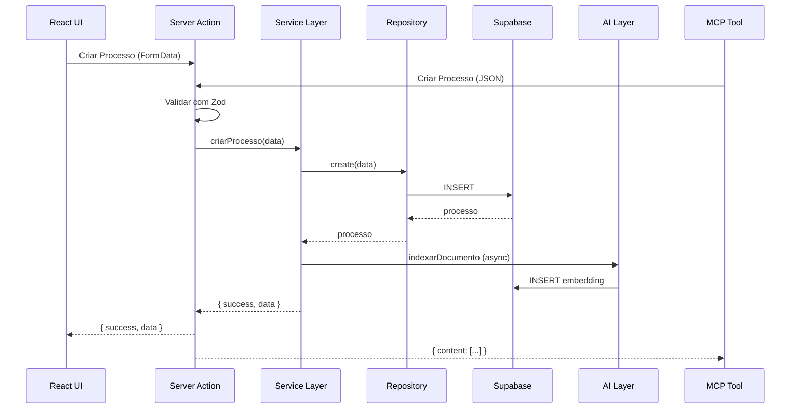

# Arquitetura Sinesys 2.0

## Visão Geral

O Sinesys é um sistema de gestão jurídica desenvolvido com arquitetura AI-First, utilizando Next.js 16, React 19, Supabase e integração MCP (Model Context Protocol).

```
┌─────────────────────────────────────────────────────────────────┐
│                         CAMADA UI                               │
│  React 19 + Next.js 16 + Tailwind CSS + shadcn/ui               │
└─────────────────────────────────────────────────────────────────┘
                              │
                              ▼
┌─────────────────────────────────────────────────────────────────┐
│                    CAMADA DE SERVER ACTIONS                     │
│  Safe Action Wrapper + Validação Zod + Autenticação             │
└─────────────────────────────────────────────────────────────────┘
                              │
              ┌───────────────┴───────────────┐
              ▼                               ▼
┌─────────────────────────┐     ┌─────────────────────────┐
│      API MCP SSE        │     │    Service Layer        │
│  /api/mcp (ferramentas) │     │  Business Logic         │
└─────────────────────────┘     └─────────────────────────┘
              │                               │
              └───────────────┬───────────────┘
                              ▼
┌─────────────────────────────────────────────────────────────────┐
│                    CAMADA DE REPOSITÓRIO                        │
│  Supabase Client + Queries Tipadas                              │
└─────────────────────────────────────────────────────────────────┘
                              │
              ┌───────────────┼───────────────┐
              ▼               ▼               ▼
┌───────────────────┐ ┌───────────────┐ ┌───────────────┐
│     Supabase      │ │    Redis      │ │   AI/RAG      │
│  PostgreSQL + RLS │ │    Cache      │ │  pgvector     │
└───────────────────┘ └───────────────┘ └───────────────┘
```

## Estrutura de Diretórios

```
sinesys/
├── src/
│   ├── app/                    # App Router (Next.js 16)
│   │   ├── (auth)/             # Rotas autenticadas
│   │   ├── api/                # API Routes
│   │   │   └── mcp/            # Endpoint MCP SSE
│   │   └── layout.tsx
│   │
│   ├── features/               # Feature-Sliced Design (22 módulos)
│   │   ├── processos/          # Gestão de processos
│   │   │   ├── actions/        # Server Actions
│   │   │   ├── components/     # Componentes React
│   │   │   ├── domain.ts       # Entidades + Zod schemas
│   │   │   ├── service.ts      # Lógica de negócio
│   │   │   ├── repository.ts   # Acesso a dados
│   │   │   ├── RULES.md        # Regras de negócio (IA context)
│   │   │   └── index.ts        # Barrel exports
│   │   ├── partes/
│   │   ├── audiencias/
│   │   ├── documentos/
│   │   ├── financeiro/
│   │   ├── busca/              # Busca semântica
│   │   └── ... (17 outros módulos)
│   │
│   ├── lib/                    # Bibliotecas compartilhadas
│   │   ├── ai/                 # Camada de IA/RAG
│   │   │   ├── embedding.ts    # Geração de vetores
│   │   │   ├── indexing.ts     # Pipeline de ingestão
│   │   │   ├── retrieval.ts    # Busca semântica
│   │   │   └── index.ts
│   │   ├── mcp/                # Integração MCP
│   │   │   ├── server.ts       # McpServer singleton
│   │   │   ├── registry.ts     # Registro de ferramentas
│   │   │   └── utils.ts        # Helpers
│   │   ├── auth/               # Autenticação
│   │   ├── supabase/           # Clientes Supabase
│   │   ├── redis/              # Cache Redis
│   │   └── safe-action.ts      # Wrapper de actions
│   │
│   └── components/             # Componentes globais
│       └── ui/                 # shadcn/ui
│
├── supabase/
│   └── migrations/             # Migrações SQL
│
├── scripts/
│   ├── ai/                     # Scripts de IA
│   │   └── reindex-all.ts
│   └── mcp/                    # Scripts MCP
│       ├── check-registry.ts
│       └── dev-server.ts
│
├── .mcp.json                   # Configuração MCP
└── package.json
```

## Padrão de Feature

Cada feature segue a estrutura Domain → Service → Repository → Actions:

### domain.ts
Define entidades, enums, schemas Zod e tipos:
```typescript
// Entidade
export interface Processo { ... }

// Schemas
export const createProcessoSchema = z.object({ ... });
export const updateProcessoSchema = z.object({ ... });

// Tipos inferidos
export type CreateProcessoInput = z.infer<typeof createProcessoSchema>;
```

### service.ts
Implementa lógica de negócio:
```typescript
export async function criarProcesso(
  input: CreateProcessoInput
): Promise<Result<Processo, ServiceError>> {
  // Validação de regras de negócio
  // Chamada ao repository
  // Indexação para IA (after())
}
```

### repository.ts
Acesso a dados via Supabase:
```typescript
export async function create(
  data: CreateProcessoInput
): Promise<Result<Processo, RepositoryError>> {
  const supabase = await createClient();
  // Query Supabase
}
```

### actions/
Server Actions para UI e MCP:
```typescript
export const actionCriarProcesso = authenticatedAction(
  createProcessoSchema,
  async (data, { user }) => {
    const result = await criarProcesso(data);
    revalidatePath('/processos');
    return result.data;
  }
);
```

### RULES.md
Contexto de regras de negócio para agentes de IA:
```markdown
# Regras de Negócio - Processos

## Validação
- Número CNJ: formato NNNNNNN-DD.AAAA.J.TT.OOOO

## Regras
- Não arquivar processo com audiências pendentes
...
```

## Integração MCP

O servidor MCP expõe Server Actions como ferramentas para agentes de IA:

### Endpoint SSE
```
GET  /api/mcp      → Inicia conexão SSE
POST /api/mcp      → Executa ferramenta
```

### Registro de Ferramentas
```typescript
// src/lib/mcp/registry.ts
registerMcpTool({
  name: 'criar_processo',
  description: 'Cria um novo processo no sistema',
  schema: createProcessoSchema,
  handler: async (args) => {
    const result = await actionCriarProcesso(args);
    return actionResultToMcp(result);
  },
});
```

### Configuração
```json
// .mcp.json
{
  "mcpServers": {
    "sinesys": {
      "type": "sse",
      "url": "http://localhost:3000/api/mcp"
    }
  }
}
```

## Camada de IA/RAG

Pipeline para busca semântica e contexto para LLMs:

### Indexação
```typescript
import { indexarDocumento } from '@/lib/ai/indexing';

// Após criar processo
after(async () => {
  await indexarDocumento({
    texto: `Processo ${processo.numeroProcesso}...`,
    metadata: { tipo: 'processo', id: processo.id }
  });
});
```

### Busca Semântica
```typescript
import { buscaSemantica } from '@/lib/ai/retrieval';

const resultados = await buscaSemantica('trabalhista RJ', {
  limite: 10,
  threshold: 0.7,
  filtros: { tipo: 'processo' }
});
```

### Contexto RAG
```typescript
import { obterContextoRAG } from '@/lib/ai/retrieval';

const { contexto, fontes } = await obterContextoRAG(
  'Quais processos estão com audiência próxima?',
  2000 // max tokens
);
```

## IA no Editor de Documentos (Plate)

O editor de documentos utiliza **Plate** com plugins de IA (`@platejs/ai`) e streaming via **Vercel AI SDK**.

- Endpoint: `POST /api/plate/ai`
- Autenticação: `x-service-api-key`, `Authorization: Bearer <JWT>`, ou sessão via cookies (mesma utilidade de `@/lib/auth/api-auth`).
- Rate limiting: reaproveita `@/lib/mcp/rate-limit` (Redis; fail-open se indisponível).

### Variáveis de ambiente

- `AI_GATEWAY_API_KEY` (obrigatória)
- `AI_DEFAULT_MODEL` (opcional)
- `AI_TOOL_CHOICE_MODEL` (opcional)
- `AI_COMMENT_MODEL` (opcional)

## Safe Action Wrapper

Wrapper padronizado para Server Actions:

```typescript
import { authenticatedAction } from '@/lib/safe-action';

// Action autenticada com validação automática
export const actionCriar = authenticatedAction(
  schema,
  async (data, { user }) => {
    // `data` já validado pelo schema
    // `user` injetado automaticamente
    return { ... };
  }
);

// Compatível com UI (FormData) e MCP (JSON)
await actionCriar(formData);  // UI
await actionCriar({ ... });   // MCP
```

## Fluxo de Dados



## Scripts de Manutenção

```bash
# Verificar registro MCP
npm run mcp:check

# Servidor MCP de desenvolvimento
npm run mcp:dev

# Reindexar documentos para IA
npm run ai:reindex
```

## Configurações de Ambiente

```env
# Supabase
NEXT_PUBLIC_SUPABASE_URL=
NEXT_PUBLIC_SUPABASE_PUBLISHABLE_OR_ANON_KEY=
SUPABASE_SERVICE_ROLE_KEY=

# Redis (opcional)
ENABLE_REDIS_CACHE=true
REDIS_URL=
REDIS_PASSWORD=

# IA/Embeddings
OPENAI_API_KEY=
AI_EMBEDDING_PROVIDER=openai  # ou cohere
AI_EMBEDDING_CACHE_ENABLED=true

# MCP
SINESYS_API_TOKEN=
```

## Princípios de Design

1. **AI-First**: Toda funcionalidade é exposta como ferramenta MCP
2. **Type-Safe**: Validação com Zod em todas as camadas
3. **Dual-Use**: Actions funcionam com UI e agentes
4. **Feature-Sliced**: Módulos isolados e coesos
5. **Conhecimento Vivo**: Documentos indexados automaticamente
6. **Segurança**: RLS no Supabase + autenticação em Actions
