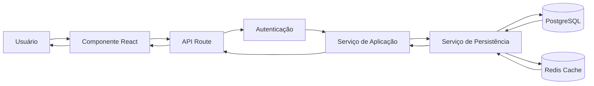
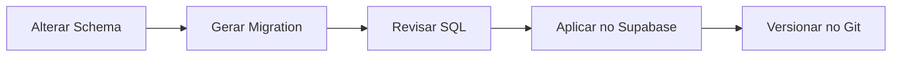
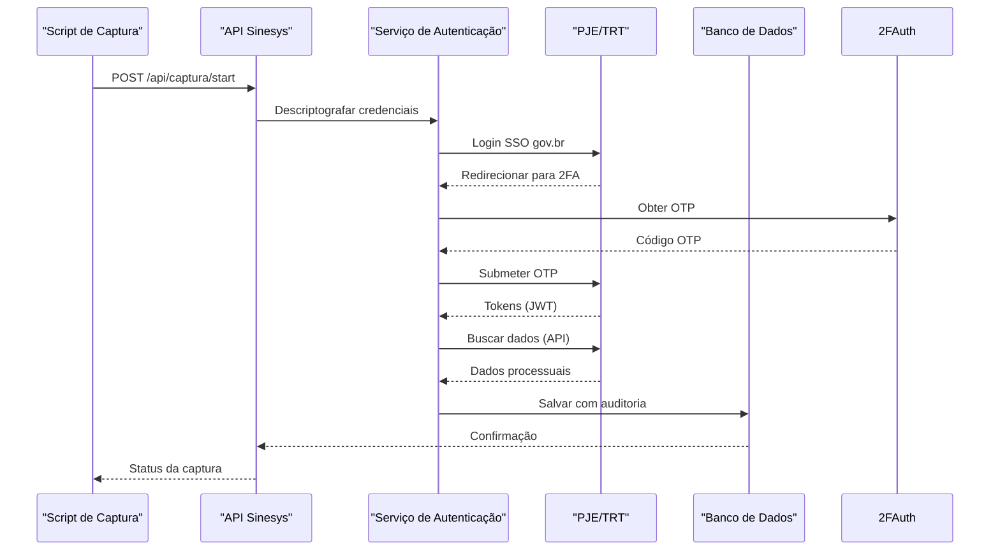
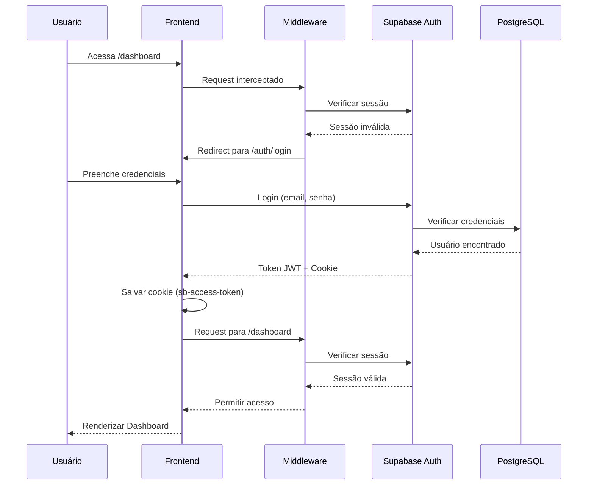
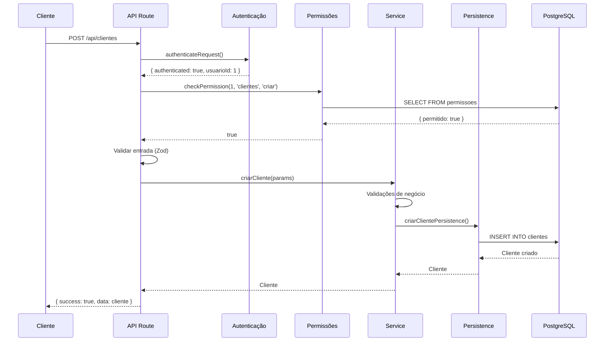
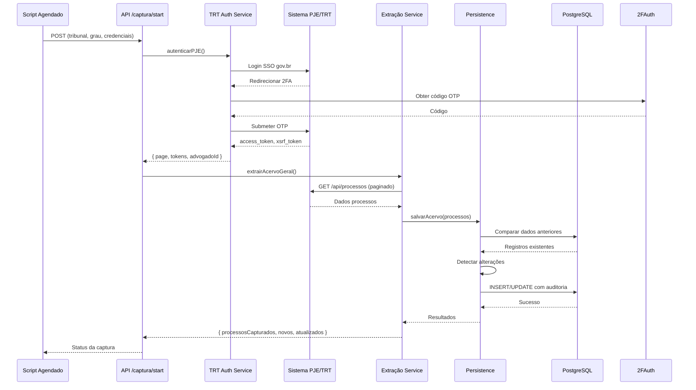
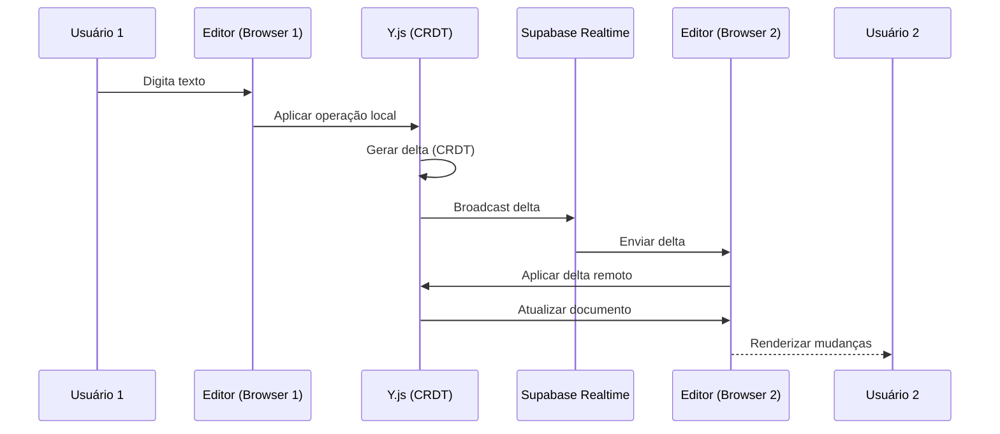

# Arquitetura do Sistema Sinesys

> **Documento de Arquitetura de Software**  
> Sistema de Gestão Jurídica para Zattar Advogados  
> Versão: 1.0  
> Data: Dezembro 2025

---

## Sumário

1. [Visão Geral do Sistema](#1-visão-geral-do-sistema)
2. [Stack Tecnológica](#2-stack-tecnológica)
3. [Estrutura de Diretórios](#3-estrutura-de-diretórios)
4. [Arquitetura em Camadas](#4-arquitetura-em-camadas)
5. [Arquitetura Frontend](#5-arquitetura-frontend)
6. [Arquitetura Backend](#6-arquitetura-backend)
7. [Banco de Dados e Persistência](#7-banco-de-dados-e-persistência)
8. [Autenticação e Segurança](#8-autenticação-e-segurança)
9. [API e Integração](#9-api-e-integração)
10. [Módulos Funcionais](#10-módulos-funcionais)
11. [Infraestrutura e Deploy](#11-infraestrutura-e-deploy)
12. [Fluxos de Dados](#12-fluxos-de-dados)
13. [Padrões e Boas Práticas](#13-padrões-e-boas-práticas)

---

## 1. Visão Geral do Sistema

### 1.1. Propósito

O **Sinesys** é um sistema completo de gestão jurídica desenvolvido especificamente para o escritório **Zattar Advogados**. O sistema integra captura automatizada de dados do PJE/TRT, gerenciamento de processos, controle de audiências, expedientes, obrigações financeiras e muito mais.

### 1.2. Características Principais

- **Sistema Full-Stack**: Frontend e Backend integrados em uma única aplicação Next.js
- **Arquitetura em Camadas**: Separação clara entre apresentação, aplicação, domínio e infraestrutura
- **Progressive Web App (PWA)**: Funciona offline e pode ser instalado como aplicativo
- **Realtime**: Colaboração em tempo real com Supabase Realtime
- **Responsive**: Interface adaptável para desktop, tablet e mobile
- **Type-Safe**: TypeScript em toda a aplicação com tipagem estrita

### 1.3. Escala do Sistema

- **+40 Módulos Funcionais**
- **+170 Componentes UI Reutilizáveis**
- **+36 Schemas de Banco de Dados**
- **+50 Endpoints de API REST**
- **52 Tools MCP** para integração com IA

---

## 2. Stack Tecnológica

### 2.1. Frontend

| Tecnologia         | Versão | Função                                    |
| ------------------ | ------ | ----------------------------------------- |
| **Next.js**        | 16.x   | Framework React com App Router e SSR      |
| **React**          | 19.2   | Biblioteca de interface do usuário        |
| **TypeScript**     | 5.x    | Tipagem estática e segurança de tipos     |
| **Tailwind CSS**   | 4.x    | Framework CSS utility-first               |
| **shadcn/ui**      | -      | Biblioteca de componentes reutilizáveis   |
| **Radix UI**       | -      | Primitivos de UI acessíveis               |
| **Framer Motion**  | 12.x   | Animações e transições                    |
| **TanStack Table** | 8.x    | Tabelas avançadas com filtros e ordenação |
| **SWR**            | 2.x    | Fetching de dados e cache client-side     |

### 2.2. Backend

| Tecnologia             | Versão | Função                           |
| ---------------------- | ------ | -------------------------------- |
| **Next.js API Routes** | 16.x   | Endpoints HTTP RESTful           |
| **Supabase**           | 2.x    | Backend-as-a-Service (Auth + DB) |
| **PostgreSQL**         | 15.x   | Banco de dados relacional        |
| **Redis**              | -      | Cache e sessões                  |
| **MongoDB**            | 7.x    | Banco de dados NoSQL auxiliar    |
| **Playwright**         | 1.56   | Automação de captura de dados    |

### 2.3. Bibliotecas Especializadas

- **Plate.js** (52.x): Editor de texto rico (WYSIWYG)
- **Y.js**: Colaboração em tempo real (CRDT)
- **CopilotKit**: Integração com IA (Assistentes)
- **Recharts**: Gráficos e visualizações
- **pdf-lib**: Geração e manipulação de PDFs
- **ExcelJS**: Export/Import de Excel
- **Axios**: Cliente HTTP

### 2.4. DevOps e Infraestrutura

| Tecnologia       | Função                                   |
| ---------------- | ---------------------------------------- |
| **Docker**       | Containerização                          |
| **Docker Swarm** | Orquestração de containers               |
| **Traefik**      | Proxy reverso e load balancer            |
| **Backblaze B2** | Armazenamento de objetos (S3-compatible) |
| **Vercel**       | Deploy alternativo (desenvolvimento)     |

---

## 3. Estrutura de Diretórios

### 3.1. Visão Geral

```
sinesys/
├── app/                      # Aplicação Next.js (App Router)
│   ├── (dashboard)/          # Grupo de rotas do dashboard
│   ├── _lib/                 # Bibliotecas e utilitários do app
│   ├── actions/              # Server Actions
│   ├── api/                  # Endpoints de API REST
│   ├── auth/                 # Páginas de autenticação
│   └── globals.css           # Estilos globais
├── backend/                  # Lógica de negócio e serviços
│   ├── {modulo}/services/    # Serviços de aplicação
│   │   ├── {modulo}/         # Lógica de negócio
│   │   └── persistence/      # Camada de persistência
│   ├── auth/                 # Autenticação e autorização
│   ├── types/                # Tipos TypeScript do backend
│   └── utils/                # Utilitários do backend
├── components/               # Componentes React reutilizáveis
│   ├── ui/                   # Componentes base (shadcn/ui)
│   ├── layout/               # Componentes de layout
│   ├── shared/               # Componentes compartilhados
│   └── {dominio}/            # Componentes específicos de domínio
├── lib/                      # Bibliotecas e configurações
│   ├── supabase/             # Cliente Supabase
│   ├── copilotkit/           # Configuração IA
│   └── utils/                # Utilitários gerais
├── hooks/                    # React Hooks customizados
├── types/                    # Tipos TypeScript compartilhados
│   ├── domain/               # Entidades de domínio
│   └── contracts/            # DTOs e contratos
├── supabase/                 # Banco de dados
│   ├── migrations/           # Migrações SQL
│   └── schemas/              # Schemas declarativos
├── scripts/                  # Scripts auxiliares
├── docs/                     # Documentação
└── public/                   # Arquivos estáticos
```

### 3.2. Convenções de Nomenclatura

#### Diretórios

- **Backend**: `kebab-case` (ex: `acordos-condenacoes/`)
- **Componentes**: `kebab-case` (ex: `table-toolbar/`)
- **Módulos**: Nome do domínio no singular/plural conforme contexto

#### Arquivos

- **Componentes React**: `kebab-case.tsx` (ex: `user-avatar.tsx`)
- **Serviços**: `{nome}.service.ts` (ex: `cliente.service.ts`)
- **Persistência**: `{entidade}-persistence.service.ts`
- **Types**: `{dominio}-types.ts` ou `types.ts`
- **Testes**: `{nome}.test.ts` ou `{nome}.spec.ts`

#### Código

- **TypeScript**: `camelCase` para variáveis/funções, `PascalCase` para tipos/classes
- **SQL**: `snake_case` para tabelas e colunas
- **CSS**: `kebab-case` para classes

---

## 4. Arquitetura em Camadas

O Sinesys segue uma **arquitetura em camadas** inspirada em **Domain-Driven Design (DDD)** para promover separação de responsabilidades, manutenibilidade e testabilidade.

### 4.1. Diagrama de Camadas

```
┌─────────────────────────────────────────────────────────────┐
│         CAMADA DE APRESENTAÇÃO (Presentation Layer)         │
│  - Componentes React                                        │
│  - Páginas Next.js                                          │
│  - Hooks customizados                                       │
│  - Estado da UI                                             │
│  Localização: app/(dashboard)/, components/                │
└─────────────────────┬───────────────────────────────────────┘
                      │
                      ▼
┌─────────────────────────────────────────────────────────────┐
│              CAMADA DE API (API Layer)                      │
│  - Next.js API Routes                                       │
│  - Validação de entrada (Zod)                               │
│  - Autenticação e autorização                               │
│  - Formatação de resposta                                   │
│  Localização: app/api/                                      │
└─────────────────────┬───────────────────────────────────────┘
                      │
                      ▼
┌─────────────────────────────────────────────────────────────┐
│           CAMADA DE APLICAÇÃO (Application Layer)           │
│  - Serviços de aplicação                                    │
│  - Casos de uso                                             │
│  - DTOs (Data Transfer Objects)                             │
│  - Orquestração de lógica de negócio                        │
│  Localização: backend/{modulo}/services/{modulo}/           │
└─────────────────────┬───────────────────────────────────────┘
                      │
                      ▼
┌─────────────────────────────────────────────────────────────┐
│            CAMADA DE DOMÍNIO (Domain Layer)                 │
│  - Entidades                                                │
│  - Value Objects                                            │
│  - Agregados                                                │
│  - Regras de negócio puras                                  │
│  Localização: types/domain/                                 │
└─────────────────────┬───────────────────────────────────────┘
                      │
                      ▼
┌─────────────────────────────────────────────────────────────┐
│        CAMADA DE INFRAESTRUTURA (Infrastructure Layer)      │
│  - Persistência (Repositórios)                              │
│  - APIs externas (PJE/TRT)                                  │
│  - Cache (Redis)                                            │
│  - Storage (Backblaze B2)                                   │
│  Localização: backend/{modulo}/services/persistence/        │
└─────────────────────────────────────────────────────────────┘
```

### 4.2. Responsabilidades por Camada

#### Camada de Apresentação

- Renderizar interface do usuário
- Capturar interações do usuário
- Gerenciar estado local da UI
- Validação de formulários (frontend)
- Feedback visual (loading, erros, sucesso)

**Exemplos**:

- `app/(dashboard)/processos/page.tsx`
- `components/ui/data-table.tsx`
- `hooks/use-viewport.ts`

#### Camada de API

- Receber requisições HTTP
- Validar entrada com schemas Zod
- Autenticar e autorizar usuários
- Invocar serviços de aplicação
- Retornar respostas padronizadas

**Formato de Resposta**:

```typescript
// Sucesso
{ success: true, data: T }

// Erro
{ success: false, error: string }
```

**Exemplos**:

- `app/api/clientes/route.ts`
- `app/api/acervo/[id]/route.ts`

#### Camada de Aplicação

- Implementar casos de uso
- Orquestrar múltiplas operações
- Validar regras de negócio
- Transformar DTOs em entidades de domínio
- Independente de detalhes de infraestrutura

**Exemplos**:

- `backend/clientes/services/clientes/criar-cliente.service.ts`
- `backend/acervo/services/acervo/listar-processos.service.ts`

#### Camada de Domínio

- Definir entidades e value objects
- Encapsular regras de negócio puras
- Sem dependências externas
- Reutilizável em qualquer contexto

**Exemplos**:

- `types/domain/cliente.ts`
- `types/domain/processo.ts`

#### Camada de Infraestrutura

- Acesso ao banco de dados
- Integração com APIs externas
- Cache e armazenamento
- Detalhes técnicos de implementação

**Exemplos**:

- `backend/clientes/services/persistence/cliente-persistence.service.ts`
- `backend/captura/services/trt/trt-auth.service.ts`

### 4.3. Fluxo de Dados Entre Camadas



---

## 5. Arquitetura Frontend

### 5.1. Estrutura do Frontend

```
app/
├── (dashboard)/              # Grupo de rotas protegidas
│   ├── layout.tsx            # Layout do dashboard (sidebar + header)
│   ├── processos/            # Módulo de processos
│   │   ├── page.tsx          # Página principal
│   │   └── [id]/             # Detalhes do processo
│   ├── audiencias/           # Módulo de audiências
│   ├── expedientes/          # Módulo de expedientes
│   └── ...                   # Outros módulos
├── _lib/                     # Bibliotecas internas do app
│   ├── hooks/                # Hooks React customizados
│   ├── types/                # Tipos específicos do app
│   └── utils/                # Utilitários do app
├── auth/                     # Páginas de autenticação
│   ├── login/
│   └── callback/
└── api/                      # API Routes
    └── ...
```

### 5.2. Componentes UI

#### Sistema de Design Baseado em shadcn/ui

```
components/ui/
├── badge.tsx                 # Badges e labels
├── button.tsx                # Botões primários
├── card.tsx                  # Cards e containers
├── data-table.tsx            # Tabelas de dados
├── dialog.tsx                # Modais e diálogos
├── form.tsx                  # Formulários (react-hook-form)
├── input.tsx                 # Inputs de texto
├── select.tsx                # Selects e dropdowns
├── table-toolbar.tsx         # Barra de ferramentas de tabelas
├── responsive-table.tsx      # Tabelas responsivas
└── ...                       # +170 componentes
```

#### Componentes Responsivos

O sistema possui uma estratégia completa de responsividade:

**Breakpoints**:

```typescript
{
  sm: 640,   // Mobile landscape
  md: 768,   // Tablet portrait
  lg: 1024,  // Desktop
  xl: 1280,  // Desktop large
  '2xl': 1536 // Desktop XL
}
```

**Hooks de Responsividade**:

- `useViewport()`: Detecta tamanho da tela e breakpoint atual
- `useOrientation()`: Detecta orientação (portrait/landscape)
- `useBreakpoint()`: Verifica se está em breakpoint específico

**Componentes Adaptativos**:

- `ResponsiveTable`: Alterna entre tabela e cards em mobile
- `ResponsiveDialog`: Sheet em mobile, Dialog em desktop
- `ResponsiveFilterPanel`: Filtros inline (desktop) ou Sheet (mobile)
- `ResponsiveFormLayout`: Layout de formulários adaptável

### 5.3. Roteamento e Navegação

#### App Router (Next.js 16)

O Sinesys utiliza o **App Router** do Next.js com **Route Groups** para organização:

```
app/
├── (dashboard)/              # Rotas protegidas com autenticação
│   └── layout.tsx            # Layout compartilhado (sidebar)
├── (public)/                 # Rotas públicas
│   └── formulario/
└── auth/                     # Autenticação (sem layout)
```

#### Navegação

**Componentes**:

- `AppSidebar`: Navegação lateral com módulos
- `AppBreadcrumb`: Breadcrumb dinâmico
- `MobileNav`: Menu mobile (Sheet)

**Configuração**:

```typescript
// components/layout/app-sidebar.tsx
const navItems = [
  {
    title: "Dashboard",
    url: "/dashboard",
    icon: Home,
  },
  {
    title: "Processos",
    url: "/processos",
    icon: FileText,
  },
  // ...
];
```

### 5.4. Gerenciamento de Estado

#### Estratégias de Estado

| Tipo de Estado         | Solução                  | Exemplo                    |
| ---------------------- | ------------------------ | -------------------------- |
| **Estado Local**       | `useState`, `useReducer` | Formulários, UI temporária |
| **Estado do Servidor** | SWR, React Query         | Dados de API               |
| **Estado Global**      | Context API, Zustand     | Tema, usuário autenticado  |
| **URL State**          | Next.js Router           | Filtros, paginação         |

#### Fetching de Dados com SWR

```typescript
// Exemplo: Listar processos com cache
import useSWR from "swr";

function ProcessosPage() {
  const { data, error, isLoading } = useSWR(
    "/api/acervo?pagina=1&limite=20",
    fetcher,
    {
      revalidateOnFocus: false,
      dedupingInterval: 60000, // 1 minuto
    }
  );

  if (isLoading) return <Spinner />;
  if (error) return <Error />;

  return <DataTable data={data.processos} />;
}
```

### 5.5. Formulários e Validação

#### React Hook Form + Zod

```typescript
import { useForm } from "react-hook-form";
import { zodResolver } from "@hookform/resolvers/zod";
import { z } from "zod";

const clienteSchema = z.object({
  nome: z.string().min(3, "Mínimo 3 caracteres"),
  cpf: z.string().regex(/^\d{11}$/, "CPF inválido"),
  email: z.string().email("E-mail inválido"),
});

type ClienteFormData = z.infer<typeof clienteSchema>;

function ClienteForm() {
  const form = useForm<ClienteFormData>({
    resolver: zodResolver(clienteSchema),
  });

  const onSubmit = async (data: ClienteFormData) => {
    const response = await fetch("/api/clientes", {
      method: "POST",
      body: JSON.stringify(data),
    });
    // ...
  };

  return <Form {...form} onSubmit={onSubmit} />;
}
```

### 5.6. Temas e Estilização

#### Sistema de Temas (Dark/Light)

```typescript
// Configuração em app/layout.tsx
<ThemeProvider
  attribute="class"
  defaultTheme="system"
  enableSystem
  disableTransitionOnChange
>
  {children}
</ThemeProvider>
```

#### Variáveis CSS (Tailwind)

```css
/* globals.css */
:root {
  --background: 0 0% 100%;
  --foreground: 222.2 84% 4.9%;
  --primary: 221.2 83.2% 53.3%;
  /* ... */
}

.dark {
  --background: 222.2 84% 4.9%;
  --foreground: 210 40% 98%;
  /* ... */
}
```

---

## 6. Arquitetura Backend

### 6.1. Estrutura do Backend

```
backend/
├── {modulo}/                 # Um diretório por módulo funcional
│   ├── services/
│   │   ├── {modulo}/         # Serviços de aplicação (lógica de negócio)
│   │   │   ├── criar-{entidade}.service.ts
│   │   │   ├── listar-{entidade}s.service.ts
│   │   │   ├── atualizar-{entidade}.service.ts
│   │   │   └── deletar-{entidade}.service.ts
│   │   └── persistence/      # Serviços de persistência (acesso a dados)
│   │       └── {entidade}-persistence.service.ts
│   └── types/                # Tipos específicos do módulo (opcional)
│       └── types.ts
├── auth/                     # Autenticação e autorização
│   ├── api-auth.ts           # Autenticação de requisições
│   └── permissions.ts        # Sistema de permissões
├── types/                    # Tipos compartilhados
│   ├── {modulo}/
│   │   └── types.ts
│   └── api.ts
└── utils/                    # Utilitários do backend
    ├── supabase/
    │   ├── server.ts         # Cliente Supabase (SSR)
    │   └── service-client.ts # Cliente Supabase (Service Role)
    ├── validation/           # Schemas de validação
    ├── logging/              # Logging estruturado
    └── cache/                # Cache Redis
```

### 6.2. Padrão de Serviços

#### Camada de Aplicação (Business Logic)

**Responsabilidades**:

- Validar regras de negócio
- Orquestrar múltiplas operações
- Transformar dados
- Independente de detalhes de persistência

**Exemplo**:

```typescript
// backend/clientes/services/clientes/criar-cliente.service.ts
import { criarCliente as criarClientePersistence } from "../persistence/cliente-persistence.service";
import type {
  CriarClienteParams,
  Cliente,
} from "@/backend/types/clientes/types";

export async function criarCliente(
  params: CriarClienteParams
): Promise<Cliente> {
  // 1. Validações de negócio
  if (!params.nome || params.nome.trim().length < 3) {
    throw new Error("Nome deve ter pelo menos 3 caracteres");
  }

  // 2. Normalização
  const dadosNormalizados = {
    ...params,
    nome: params.nome.trim().toUpperCase(),
    cpf: params.cpf.replace(/\D/g, ""),
  };

  // 3. Regras de negócio
  if (params.tipo === "PF" && !validarCPF(dadosNormalizados.cpf)) {
    throw new Error("CPF inválido");
  }

  // 4. Persistência
  return await criarClientePersistence(dadosNormalizados);
}
```

#### Camada de Persistência (Data Access)

**Responsabilidades**:

- Acesso ao banco de dados
- Queries e filtros
- Auditoria e logging
- Manipulação de relações

**Exemplo**:

```typescript
// backend/clientes/services/persistence/cliente-persistence.service.ts
import { createServiceClient } from "@/backend/utils/supabase/service-client";
import type {
  Cliente,
  CriarClienteParams,
} from "@/backend/types/clientes/types";

export async function criarCliente(
  params: CriarClienteParams
): Promise<Cliente> {
  const supabase = createServiceClient();

  const { data, error } = await supabase
    .from("clientes")
    .insert({
      nome: params.nome,
      cpf: params.cpf,
      tipo: params.tipo,
      email: params.email,
    })
    .select()
    .single();

  if (error) {
    throw new Error(`Erro ao criar cliente: ${error.message}`);
  }

  return data;
}

export async function listarClientes(
  filtros: ListarClientesParams
): Promise<ClientesPaginados> {
  const supabase = createServiceClient();

  let query = supabase.from("clientes").select("*", { count: "exact" });

  // Filtros
  if (filtros.busca) {
    query = query.or(
      `nome.ilike.%${filtros.busca}%,cpf.ilike.%${filtros.busca}%`
    );
  }

  if (filtros.tipo) {
    query = query.eq("tipo", filtros.tipo);
  }

  // Ordenação
  query = query.order("nome", { ascending: true });

  // Paginação
  const from = (filtros.pagina - 1) * filtros.limite;
  const to = from + filtros.limite - 1;
  query = query.range(from, to);

  const { data, error, count } = await query;

  if (error) {
    throw new Error(`Erro ao listar clientes: ${error.message}`);
  }

  return {
    clientes: data || [],
    total: count || 0,
    pagina: filtros.pagina,
    limite: filtros.limite,
  };
}
```

### 6.3. API Routes (Next.js)

#### Estrutura de Endpoint

```
app/api/
├── clientes/
│   ├── route.ts              # GET (listar), POST (criar)
│   └── [id]/
│       ├── route.ts          # GET (buscar), PATCH (atualizar), DELETE (deletar)
│       └── avatar/
│           └── route.ts      # POST (upload), DELETE (remover)
├── acervo/
│   ├── route.ts
│   └── [id]/
│       ├── route.ts
│       └── timeline/
│           └── route.ts
└── health/
    └── route.ts              # Health check
```

#### Exemplo de Endpoint

```typescript
// app/api/clientes/route.ts
import { NextRequest, NextResponse } from "next/server";
import { authenticateRequest } from "@/backend/auth/api-auth";
import {
  criarCliente,
  listarClientes,
} from "@/backend/clientes/services/clientes";
import { z } from "zod";

// Schema de validação
const criarClienteSchema = z.object({
  nome: z.string().min(3),
  cpf: z.string().regex(/^\d{11}$/),
  tipo: z.enum(["PF", "PJ"]),
  email: z.string().email().optional(),
});

/**
 * @swagger
 * /api/clientes:
 *   post:
 *     summary: Criar novo cliente
 *     tags: [Clientes]
 *     security:
 *       - bearerAuth: []
 *     requestBody:
 *       required: true
 *       content:
 *         application/json:
 *           schema:
 *             type: object
 *             required: [nome, cpf, tipo]
 *             properties:
 *               nome:
 *                 type: string
 *               cpf:
 *                 type: string
 *               tipo:
 *                 type: string
 *                 enum: [PF, PJ]
 *     responses:
 *       200:
 *         description: Cliente criado
 */
export async function POST(request: NextRequest) {
  try {
    // 1. Autenticação
    const auth = await authenticateRequest(request);
    if (!auth.authenticated) {
      return NextResponse.json(
        { success: false, error: "Não autenticado" },
        { status: 401 }
      );
    }

    // 2. Validação
    const body = await request.json();
    const validacao = criarClienteSchema.safeParse(body);

    if (!validacao.success) {
      return NextResponse.json(
        { success: false, error: validacao.error.errors[0].message },
        { status: 400 }
      );
    }

    // 3. Lógica de negócio
    const cliente = await criarCliente(validacao.data);

    // 4. Resposta
    return NextResponse.json({
      success: true,
      data: cliente,
    });
  } catch (error) {
    console.error("Erro ao criar cliente:", error);
    return NextResponse.json(
      { success: false, error: "Erro interno do servidor" },
      { status: 500 }
    );
  }
}

/**
 * @swagger
 * /api/clientes:
 *   get:
 *     summary: Listar clientes
 *     tags: [Clientes]
 *     security:
 *       - bearerAuth: []
 *     parameters:
 *       - name: pagina
 *         in: query
 *         schema:
 *           type: integer
 *       - name: limite
 *         in: query
 *         schema:
 *           type: integer
 *       - name: busca
 *         in: query
 *         schema:
 *           type: string
 *     responses:
 *       200:
 *         description: Lista de clientes
 */
export async function GET(request: NextRequest) {
  try {
    const auth = await authenticateRequest(request);
    if (!auth.authenticated) {
      return NextResponse.json(
        { success: false, error: "Não autenticado" },
        { status: 401 }
      );
    }

    const { searchParams } = new URL(request.url);
    const filtros = {
      pagina: parseInt(searchParams.get("pagina") || "1"),
      limite: parseInt(searchParams.get("limite") || "20"),
      busca: searchParams.get("busca") || undefined,
      tipo: searchParams.get("tipo") as "PF" | "PJ" | undefined,
    };

    const resultado = await listarClientes(filtros);

    return NextResponse.json({
      success: true,
      data: resultado,
    });
  } catch (error) {
    console.error("Erro ao listar clientes:", error);
    return NextResponse.json(
      { success: false, error: "Erro interno do servidor" },
      { status: 500 }
    );
  }
}
```

### 6.4. Tipos e Contratos

#### Organização de Tipos

```
types/
├── domain/                   # Entidades de domínio
│   ├── cliente.ts
│   ├── processo.ts
│   └── audiencia.ts
├── contracts/                # DTOs e contratos de API
│   ├── clientes/
│   │   ├── criar-cliente.ts
│   │   ├── listar-clientes.ts
│   │   └── atualizar-cliente.ts
│   └── processos/
│       └── ...
├── sinesys/                  # Tipos específicos do sistema
│   └── database.ts
└── index.ts                  # Re-exports
```

#### Exemplo de Tipos

```typescript
// types/domain/cliente.ts
export interface Cliente {
  id: number;
  nome: string;
  cpf: string;
  tipo: "PF" | "PJ";
  email: string | null;
  telefone: string | null;
  ativo: boolean;
  created_at: string;
  updated_at: string;
}

// types/contracts/clientes/criar-cliente.ts
export interface CriarClienteParams {
  nome: string;
  cpf: string;
  tipo: "PF" | "PJ";
  email?: string;
  telefone?: string;
}

// types/contracts/clientes/listar-clientes.ts
export interface ListarClientesParams {
  pagina: number;
  limite: number;
  busca?: string;
  tipo?: "PF" | "PJ";
}

export interface ClientesPaginados {
  clientes: Cliente[];
  total: number;
  pagina: number;
  limite: number;
}
```

---

## 7. Banco de Dados e Persistência

### 7.1. Tecnologias de Persistência

| Tecnologia                | Uso                                          |
| ------------------------- | -------------------------------------------- |
| **PostgreSQL** (Supabase) | Banco de dados principal (dados relacionais) |
| **Redis**                 | Cache, sessões, locks distribuídos           |
| **MongoDB**               | Dados não estruturados (logs, capturas)      |
| **Backblaze B2**          | Armazenamento de objetos (PDFs, imagens)     |

### 7.2. Estrutura do Banco de Dados

#### Schemas SQL Declarativos

```
supabase/schemas/
├── 00_permissions.sql        # Permissões do service_role
├── 01_enums.sql              # Enums do sistema
├── 02_advogados.sql          # Tabela de advogados
├── 03_credenciais.sql        # Credenciais de captura
├── 04_acervo.sql             # Processos (acervo)
├── 05_acervo_unificado_view.sql
├── 06_expedientes.sql        # Expedientes
├── 07_audiencias.sql         # Audiências
├── 08_usuarios.sql           # Usuários do sistema
├── 09_clientes.sql           # Clientes
├── 10_partes_contrarias.sql  # Partes contrárias
├── 11_contratos.sql          # Contratos
├── 12_contrato_processos.sql # Relação contrato-processo
├── 13_tribunais.sql          # Tribunais
├── 14_logs_alteracao.sql     # Auditoria
├── 15_enderecos.sql          # Endereços
├── 16_terceiros.sql          # Terceiros
├── 17_processo_partes.sql    # Relação processo-partes
├── 18_representantes.sql     # Representantes legais
├── 19_audiencias_auxiliares.sql
├── 20_acordos_condenacoes.sql # Obrigações financeiras
├── 21_capturas.sql           # Logs de captura
├── 22_cargos_permissoes.sql  # Sistema de permissões
├── 23_dashboard.sql          # Views do dashboard
├── 24_processos_cliente_por_cpf_view.sql
├── 25_assinatura_digital.sql # Assinatura digital
├── 26_plano_contas.sql       # Plano de contas
├── 27_centros_custo.sql      # Centros de custo
├── 28_contas_bancarias.sql   # Contas bancárias
├── 29_lancamentos_financeiros.sql
├── 30_salarios.sql           # Salários (RH)
├── 31_conciliacao_bancaria.sql
├── 32_orcamento.sql          # Orçamento
├── 33_financeiro_functions.sql
├── 34_financeiro_views.sql
├── 35_financeiro_integracao.sql
└── 36_financeiro_seed.sql
```

#### Principais Tabelas

| Tabela                | Descrição                | Registros Estimados |
| --------------------- | ------------------------ | ------------------- |
| `acervo_geral`        | Processos de 1º grau     | ~50.000             |
| `acervo_segundo_grau` | Processos de 2º grau     | ~5.000              |
| `audiencias`          | Audiências agendadas     | ~10.000             |
| `expedientes`         | Expedientes/Prazos       | ~30.000             |
| `acordos_condenacoes` | Obrigações financeiras   | ~2.000              |
| `clientes`            | Clientes do escritório   | ~500                |
| `usuarios`            | Usuários do sistema      | ~50                 |
| `capturas`            | Logs de captura de dados | ~1.000              |

### 7.3. Row Level Security (RLS)

#### Estratégia de RLS

O Sinesys implementa **RLS (Row Level Security)** em todas as tabelas para garantir segurança no nível do banco de dados.

**Políticas Padrão**:

```sql
-- Service Role: Acesso total (usado pelas APIs backend)
CREATE POLICY "Service role tem acesso total"
  ON public.clientes
  FOR ALL
  TO service_role
  USING (true)
  WITH CHECK (true);

-- Authenticated: Leitura para colaboração
CREATE POLICY "Usuários autenticados podem visualizar clientes"
  ON public.clientes
  FOR SELECT
  TO authenticated
  USING (true);

-- Usuários autenticados podem inserir (backend valida permissões)
CREATE POLICY "Usuários autenticados podem inserir clientes"
  ON public.clientes
  FOR INSERT
  TO authenticated
  WITH CHECK (true);
```

**Observações**:

- Políticas RLS são camada adicional de segurança
- Autorização principal é feita no backend via `checkPermission()`
- Service role bypassa RLS (usado em serviços backend)
- Funções helper usam `SECURITY DEFINER` com `search_path` fixo

### 7.4. Migrações

#### Fluxo de Migrações



**Comandos**:

```bash
# Gerar migration a partir de schemas
supabase db diff -f nome_da_migration

# Aplicar migrations
supabase db push

# Reset (desenvolvimento)
supabase db reset
```

#### Convenções de Migrações

- **Formato**: `YYYYMMDDHHmmss_descricao.sql`
- **Localização**: `supabase/migrations/`
- **SQL**: Sempre em lowercase
- **Comentários**: Abundantes, especialmente em operações destrutivas
- **Idempotência**: Usar `IF EXISTS`, `IF NOT EXISTS`

### 7.5. Views e Funções

#### Views Materializadas

```sql
-- View unificada de acervo (1º e 2º grau)
CREATE OR REPLACE VIEW public.acervo_unificado_view AS
SELECT
  id,
  numero_processo,
  tribunal_id,
  grau,
  classe_judicial,
  orgao_julgador,
  -- ...
FROM public.acervo_geral
WHERE ativo = true
UNION ALL
SELECT
  id,
  numero_processo,
  tribunal_id,
  grau,
  -- ...
FROM public.acervo_segundo_grau
WHERE ativo = true;
```

#### Funções de Banco

```sql
-- Função helper para obter ID do usuário
CREATE OR REPLACE FUNCTION public.get_usuario_id_from_auth()
RETURNS BIGINT
LANGUAGE SQL
STABLE
SECURITY DEFINER
SET search_path = public
AS $$
  SELECT id FROM public.usuarios
  WHERE auth_user_id = auth.uid()
  LIMIT 1;
$$;
```

### 7.6. Cache com Redis

#### Estratégias de Cache

```typescript
// backend/utils/cache/redis-cache.ts
import Redis from "ioredis";

const redis = new Redis(process.env.REDIS_URL);

// Cache de permissões (5 minutos)
export async function cachePermissoes(
  usuarioId: number,
  permissoes: Permissao[]
) {
  await redis.setex(
    `permissoes:${usuarioId}`,
    300, // 5 minutos
    JSON.stringify(permissoes)
  );
}

// Lock distribuído (para evitar capturas duplicadas)
export async function acquireLock(key: string, ttl: number): Promise<boolean> {
  const result = await redis.set(
    `lock:${key}`,
    "locked",
    "EX",
    ttl,
    "NX" // Só cria se não existir
  );
  return result === "OK";
}
```

---

## 8. Autenticação e Segurança

### 8.1. Autenticação Multi-Camada

O Sinesys implementa **três métodos de autenticação** para diferentes contextos:

```
┌─────────────────────────────────────────────────────────────┐
│                  MÉTODOS DE AUTENTICAÇÃO                    │
├─────────────────────────────────────────────────────────────┤
│ 1. Session Cookie (sb-access-token)                         │
│    ↳ Usuários no frontend (navegador)                       │
│    ↳ Supabase Auth gerencia sessão automaticamente          │
├─────────────────────────────────────────────────────────────┤
│ 2. Bearer Token (JWT)                                        │
│    ↳ APIs externas, integrações, mobile                     │
│    ↳ Header: Authorization: Bearer <token>                  │
├─────────────────────────────────────────────────────────────┤
│ 3. Service API Key                                           │
│    ↳ Scripts automatizados, jobs agendados                  │
│    ↳ Header: x-service-api-key: <key>                       │
└─────────────────────────────────────────────────────────────┘
```

#### Implementação

```typescript
// backend/auth/api-auth.ts
export async function authenticateRequest(
  request: NextRequest
): Promise<AuthResult> {
  // 1. Service API Key (prioridade mais alta)
  const serviceApiKey = request.headers.get("x-service-api-key");
  if (serviceApiKey === process.env.SERVICE_API_KEY) {
    return {
      authenticated: true,
      userId: "system",
      source: "service",
    };
  }

  // 2. Bearer Token (JWT)
  const authHeader = request.headers.get("authorization");
  if (authHeader?.startsWith("Bearer ")) {
    const token = authHeader.substring(7);
    const { data, error } = await supabase.auth.getUser(token);
    if (!error && data.user) {
      return {
        authenticated: true,
        userId: data.user.id,
        source: "bearer",
      };
    }
  }

  // 3. Session Cookie (frontend)
  const supabase = createClient();
  const { data } = await supabase.auth.getUser();
  if (data.user) {
    return {
      authenticated: true,
      userId: data.user.id,
      source: "session",
    };
  }

  return { authenticated: false };
}
```

### 8.2. Sistema de Permissões Granulares

#### Estrutura de Permissões

O sistema implementa **81 permissões granulares** organizadas por recurso e operação:

```sql
-- Tabela de permissões
CREATE TABLE public.permissoes (
  id BIGSERIAL PRIMARY KEY,
  usuario_id BIGINT NOT NULL REFERENCES public.usuarios(id),
  recurso VARCHAR(50) NOT NULL,      -- ex: 'acervo', 'clientes', 'audiencias'
  operacao VARCHAR(20) NOT NULL,     -- ex: 'visualizar', 'criar', 'editar', 'deletar'
  permitido BOOLEAN DEFAULT true,
  created_at TIMESTAMP DEFAULT NOW()
);

-- Índice para performance
CREATE INDEX idx_permissoes_usuario_recurso_operacao
  ON public.permissoes(usuario_id, recurso, operacao);
```

#### Verificação de Permissões

```typescript
// backend/auth/permissions.ts
export async function checkPermission(
  usuarioId: number,
  recurso: string,
  operacao: string
): Promise<boolean> {
  // 1. Verificar cache
  const cacheKey = `permissao:${usuarioId}:${recurso}:${operacao}`;
  const cached = await redis.get(cacheKey);
  if (cached !== null) {
    return cached === "true";
  }

  // 2. Verificar se é super admin
  const usuario = await buscarUsuarioPorId(usuarioId);
  if (usuario?.is_super_admin) {
    await redis.setex(cacheKey, 300, "true");
    return true;
  }

  // 3. Consultar permissão específica
  const supabase = createServiceClient();
  const { data } = await supabase
    .from("permissoes")
    .select("permitido")
    .eq("usuario_id", usuarioId)
    .eq("recurso", recurso)
    .eq("operacao", operacao)
    .single();

  const permitido = data?.permitido ?? false;
  await redis.setex(cacheKey, 300, permitido ? "true" : "false");

  return permitido;
}
```

#### Uso nas APIs

```typescript
// app/api/clientes/route.ts
export async function POST(request: NextRequest) {
  const auth = await authenticateRequest(request);
  if (!auth.authenticated) {
    return NextResponse.json({ error: "Não autenticado" }, { status: 401 });
  }

  // Verificar permissão
  const temPermissao = await checkPermission(
    auth.usuarioId!,
    "clientes",
    "criar"
  );

  if (!temPermissao) {
    return NextResponse.json({ error: "Sem permissão" }, { status: 403 });
  }

  // Prosseguir com a criação...
}
```

### 8.3. Segurança de Dados

#### Criptografia

- **Em Trânsito**: HTTPS/TLS 1.3
- **Em Repouso**: AES-256 (Supabase)
- **Credenciais**: Criptografadas no banco (algoritmo AES)

#### Proteções Implementadas

| Proteção          | Implementação                        |
| ----------------- | ------------------------------------ |
| **CSRF**          | Tokens CSRF em formulários           |
| **XSS**           | Sanitização de HTML (DOMPurify)      |
| **SQL Injection** | Prepared statements (Supabase)       |
| **Rate Limiting** | Middleware do Next.js                |
| **Audit Log**     | Triggers no banco (`logs_alteracao`) |

---

## 9. API e Integração

### 9.1. Documentação da API (Swagger)

A documentação interativa da API está disponível em:

**URL**: `http://localhost:3000/docs` (desenvolvimento)

#### Geração Automática

A documentação é gerada automaticamente via **swagger-jsdoc** a partir de anotações JSDoc:

```typescript
/**
 * @swagger
 * /api/clientes:
 *   get:
 *     summary: Listar todos os clientes
 *     tags:
 *       - Clientes
 *     security:
 *       - bearerAuth: []
 *     parameters:
 *       - name: busca
 *         in: query
 *         schema:
 *           type: string
 *     responses:
 *       200:
 *         description: Lista de clientes
 *         content:
 *           application/json:
 *             schema:
 *               type: object
 *               properties:
 *                 success:
 *                   type: boolean
 *                 data:
 *                   type: array
 */
export async function GET(request: NextRequest) {
  // ...
}
```

### 9.2. Formato de Resposta Padronizado

Todas as APIs seguem o mesmo formato:

#### Sucesso

```json
{
  "success": true,
  "data": {
    // Dados retornados
  }
}
```

#### Erro

```json
{
  "success": false,
  "error": "Mensagem de erro descritiva"
}
```

### 9.3. Integração com PJE/TRT

O Sinesys integra com o sistema PJE/TRT para captura automatizada de dados processuais.

#### Fluxo de Captura



#### Componentes de Captura

```
backend/captura/
├── services/
│   ├── trt/
│   │   ├── trt-auth.service.ts        # Autenticação no PJE
│   │   ├── trt-capture.service.ts     # Orquestração
│   │   ├── acervo-geral.service.ts    # Captura de processos
│   │   ├── audiencias.service.ts      # Captura de audiências
│   │   └── pendentes.service.ts       # Captura de pendentes
│   └── persistence/
│       ├── acervo-persistence.service.ts
│       ├── audiencias-persistence.service.ts
│       └── pendentes-persistence.service.ts
└── types/
    └── trt-types.ts
```

### 9.4. MCP Server (Model Context Protocol)

O Sinesys possui um **MCP Server separado** com **52 tools** organizadas em 10 categorias:

**Repositório**: `sinesys-mcp-server` (separado)

**Categorias**:

1. Health & Info (2 tools)
2. Acervo/Processos (8 tools)
3. Audiências (6 tools)
4. Expedientes (7 tools)
5. Obrigações Financeiras (6 tools)
6. Captura de Dados (5 tools)
7. Clientes e Contratos (8 tools)
8. Usuários (4 tools)
9. Dashboard (2 tools)
10. Assistentes IA (4 tools)

---

## 10. Módulos Funcionais

### 10.1. Visão Geral dos Módulos

```
app/(dashboard)/
├── dashboard/                # Dashboard principal
├── processos/                # Gestão de processos
├── audiencias/               # Gestão de audiências
├── expedientes/              # Gestão de expedientes
├── acordos-condenacoes/      # Obrigações financeiras
├── contratos/                # Gestão de contratos
├── partes/                   # Clientes e partes contrárias
│   ├── clientes/
│   └── partes-contrarias/
├── usuarios/                 # Gestão de usuários
├── captura/                  # Captura de dados PJE/TRT
├── financeiro/               # Módulo financeiro completo
│   ├── plano-contas/
│   ├── lancamentos/
│   ├── conciliacao/
│   └── relatorios/
├── rh/                       # Recursos humanos
│   └── salarios/
├── documentos/               # Editor de documentos
├── assinatura-digital/       # Assinatura digital
├── assistentes/              # Assistentes IA
├── chat/                     # Chat interno
└── comunica-cnj/             # Integração CNJ
```

### 10.2. Módulo de Processos (Acervo)

#### Funcionalidades

- Listagem unificada (1º e 2º grau)
- Visualização de timeline
- Atribuição de responsável
- Filtros avançados (tribunal, classe judicial, status)
- Paginação e ordenação
- Busca textual (número, partes, assunto)

#### Arquivos Principais

```
app/(dashboard)/processos/
├── page.tsx                  # Listagem de processos
├── [id]/
│   ├── page.tsx              # Detalhes do processo
│   └── timeline/
│       └── page.tsx          # Timeline de movimentações
└── components/
    ├── processos-table.tsx
    ├── processo-filters.tsx
    └── timeline-view.tsx
```

### 10.3. Módulo de Audiências

#### Funcionalidades

- Visualizações: Semana, Mês, Lista
- Calendário interativo
- Observações e anotações
- Filtros por período, tipo, responsável
- Export para Excel
- Notificações de prazo

#### Arquivos Principais

```
app/(dashboard)/audiencias/
├── semana/
│   └── page.tsx              # Visualização semanal
├── mes/
│   └── page.tsx              # Visualização mensal
├── lista/
│   └── page.tsx              # Lista de audiências
└── components/
    ├── audiencia-calendar.tsx
    ├── audiencia-card.tsx
    └── audiencia-filters.tsx
```

### 10.4. Módulo de Expedientes

#### Funcionalidades

- Gerenciamento de prazos
- Workflow de baixa
- Status: Pendente, Em Andamento, Concluído
- Filtros por prazo, tipo, responsável
- Alertas de vencimento

#### Arquivos Principais

```
app/(dashboard)/expedientes/
├── lista/
│   └── page.tsx              # Lista de expedientes
├── semana/
│   └── page.tsx              # Visualização semanal
└── components/
    ├── expediente-card.tsx
    ├── baixa-expediente-dialog.tsx
    └── expediente-filters.tsx
```

### 10.5. Módulo de Obrigações Financeiras

#### Funcionalidades

- Acordos e condenações
- Parcelamento
- Repasses para clientes
- Declaração de valores
- Controle de pagamento

#### Arquivos Principais

```
app/(dashboard)/acordos-condenacoes/
├── lista/
│   └── page.tsx              # Lista de obrigações
├── [id]/
│   └── page.tsx              # Detalhes da obrigação
└── components/
    ├── obrigacoes-table.tsx
    ├── parcelas-table.tsx
    ├── repasse-dialog.tsx
    └── obrigacoes-filters.tsx
```

### 10.6. Módulo Financeiro

#### Funcionalidades Completas

- **Plano de Contas**: Hierárquico com categorias
- **Lançamentos**: Receitas e despesas
- **Conciliação Bancária**: Integração OFX
- **Centros de Custo**: Alocação de despesas
- **Orçamento**: Planejamento e acompanhamento
- **Relatórios**: DRE, Fluxo de Caixa, Balancete

#### Estrutura

```
app/(dashboard)/financeiro/
├── plano-contas/
├── lancamentos/
├── conciliacao/
├── centros-custo/
├── orcamento/
└── relatorios/
```

### 10.7. Módulo de Assinatura Digital

#### Funcionalidades

- Criação de formulários dinâmicos
- Templates PDF com campos mapeados
- Captura de assinatura manuscrita
- Geolocalização e foto
- URLs públicas (sem autenticação)
- Protocolo de finalização

#### Fluxo

1. Admin cria segmento e template
2. Admin mapeia campos no PDF
3. Admin cria formulário com schema JSON
4. Cliente acessa URL pública
5. Cliente preenche dados e assina
6. Sistema gera PDFs finais

---

## 11. Infraestrutura e Deploy

### 11.1. Containerização (Docker)

#### Dockerfile

```dockerfile
FROM node:20-alpine AS base

# Dependências
FROM base AS deps
WORKDIR /app
COPY package.json package-lock.json ./
RUN npm ci

# Build
FROM base AS builder
WORKDIR /app
COPY --from=deps /app/node_modules ./node_modules
COPY . .
ENV NEXT_TELEMETRY_DISABLED 1
RUN npm run build:prod

# Produção
FROM base AS runner
WORKDIR /app
ENV NODE_ENV production
ENV NEXT_TELEMETRY_DISABLED 1

COPY --from=builder /app/public ./public
COPY --from=builder /app/.next/standalone ./
COPY --from=builder /app/.next/static ./.next/static

EXPOSE 3000
ENV PORT 3000

CMD ["node", "server.js"]
```

#### Docker Compose

```yaml
version: "3.8"

services:
  app:
    build: .
    ports:
      - "3000:3000"
    environment:
      - NEXT_PUBLIC_SUPABASE_URL=${SUPABASE_URL}
      - SUPABASE_SECRET_KEY=${SUPABASE_SECRET_KEY}
      - REDIS_URL=${REDIS_URL}
    depends_on:
      - redis

  redis:
    image: redis:7-alpine
    ports:
      - "6379:6379"
    volumes:
      - redis_data:/data

volumes:
  redis_data:
```

### 11.2. Deploy com Docker Swarm

#### Stack Configuration

```yaml
version: "3.8"

services:
  sinesys:
    image: registry.example.com/sinesys:latest
    deploy:
      replicas: 2
      update_config:
        parallelism: 1
        delay: 10s
      restart_policy:
        condition: on-failure
      labels:
        - "traefik.enable=true"
        - "traefik.http.routers.sinesys.rule=Host(`app.sinesys.com`)"
        - "traefik.http.services.sinesys.loadbalancer.server.port=3000"
    environment:
      - NODE_ENV=production
    networks:
      - traefik-public
      - internal

  traefik:
    image: traefik:v2.10
    ports:
      - "80:80"
      - "443:443"
    volumes:
      - /var/run/docker.sock:/var/run/docker.sock:ro
      - ./traefik.yml:/traefik.yml:ro
      - ./acme.json:/acme.json
    networks:
      - traefik-public

networks:
  traefik-public:
    external: true
  internal:
    driver: overlay
```

### 11.3. Variáveis de Ambiente

```bash
# Supabase
NEXT_PUBLIC_SUPABASE_URL=https://xxx.supabase.co
SUPABASE_SECRET_KEY=eyJhbGci...
NEXT_PUBLIC_SUPABASE_PUBLISHABLE_KEY=eyJhbGci...

# Service API Key
SERVICE_API_KEY=seu-secret-key-aqui

# Redis
REDIS_URL=redis://redis:6379

# MongoDB (opcional)
MONGODB_URI=mongodb://mongo:27017/sinesys

# Backblaze B2
B2_ENDPOINT=s3.us-west-002.backblazeb2.com
B2_KEY_ID=xxx
B2_APPLICATION_KEY=xxx
B2_BUCKET_NAME=sinesys-storage

# 2FAuth (para captura)
TWOFA_URL=https://2fauth.example.com
TWOFA_TOKEN=xxx

# Next.js
NEXT_PUBLIC_APP_URL=https://app.sinesys.com
```

### 11.4. Otimizações de Build

#### Next.js Config

```typescript
// next.config.ts
export default {
  output: "standalone", // Build otimizado para Docker
  productionBrowserSourceMaps: false, // Reduz 500MB no build
  experimental: {
    serverSourceMaps: false, // Reduz memória no servidor
    webpackMemoryOptimizations: true,
    webpackBuildWorker: true,
  },
  webpack: (config) => {
    config.parallelism = 1; // Reduz uso de memória
    return config;
  },
};
```

### 11.5. PWA (Progressive Web App)

#### Configuração

```typescript
// next.config.ts
import withPWA from "@ducanh2912/next-pwa";

export default withPWA({
  dest: "public",
  disable: process.env.NODE_ENV === "development",
  register: true,
  fallbacks: {
    document: "/offline",
  },
  workboxOptions: {
    runtimeCaching: [
      {
        urlPattern: /^https:\/\/fonts\.(googleapis|gstatic)\.com\/.*/i,
        handler: "CacheFirst",
        options: {
          cacheName: "google-fonts",
          expiration: {
            maxEntries: 4,
            maxAgeSeconds: 365 * 24 * 60 * 60,
          },
        },
      },
      {
        urlPattern: /\/api\/.*/,
        handler: "NetworkFirst",
        options: {
          cacheName: "api-cache",
          networkTimeoutSeconds: 10,
        },
      },
    ],
  },
})(nextConfig);
```

#### Manifest

```json
// public/manifest.json
{
  "name": "Sinesys - Gestão Jurídica",
  "short_name": "Sinesys",
  "description": "Sistema de Gestão Jurídica para Zattar Advogados",
  "start_url": "/dashboard",
  "display": "standalone",
  "background_color": "#ffffff",
  "theme_color": "#3b82f6",
  "icons": [
    {
      "src": "/icon-192.png",
      "sizes": "192x192",
      "type": "image/png"
    },
    {
      "src": "/icon-512.png",
      "sizes": "512x512",
      "type": "image/png"
    }
  ]
}
```

---

## 12. Fluxos de Dados

### 12.1. Fluxo de Autenticação



### 12.2. Fluxo de Requisição API



### 12.3. Fluxo de Captura de Dados



### 12.4. Fluxo de Colaboração em Tempo Real



---

## 13. Padrões e Boas Práticas

### 13.1. Convenções de Código

#### TypeScript

```typescript
// ✅ BOM: Tipos explícitos
const calcularTotal = (valores: number[]): number => {
  return valores.reduce((acc, val) => acc + val, 0);
};

// ❌ RUIM: Tipos implícitos
const calcularTotal = (valores) => {
  return valores.reduce((acc, val) => acc + val, 0);
};

// ✅ BOM: Interfaces para objetos
interface Usuario {
  id: number;
  nome: string;
  email: string;
}

// ❌ RUIM: Usar 'any'
const buscarUsuario = (id: any): any => {
  // ...
};
```

#### Nomenclatura

```typescript
// Componentes React: PascalCase
function UserAvatar({ user }: UserAvatarProps) {}

// Funções e variáveis: camelCase
const calcularDesconto = (valor: number) => {};
const isAtivo = true;

// Constantes: UPPER_SNAKE_CASE
const MAX_TENTATIVAS = 3;
const API_BASE_URL = "https://api.example.com";

// Handlers de eventos: prefixo 'handle'
const handleClick = () => {};
const handleSubmit = (data) => {};

// Tipos/Interfaces: PascalCase
type ClienteFormData = {};
interface ApiResponse {}
```

#### Organização de Imports

```typescript
// 1. React e bibliotecas externas
import { useState, useEffect } from "react";
import { useForm } from "react-hook-form";

// 2. Componentes
import { Button } from "@/components/ui/button";
import { Form } from "@/components/ui/form";

// 3. Hooks
import { useViewport } from "@/hooks/use-viewport";

// 4. Utilitários e tipos
import { cn } from "@/lib/utils";
import type { Cliente } from "@/types/domain/cliente";

// 5. Estilos (se houver)
import styles from "./component.module.css";
```

### 13.2. Padrões de Componentes React

#### Estrutura de Componente

```typescript
"use client"; // Se necessário

import { useState } from "react";
import { Button } from "@/components/ui/button";
import type { Cliente } from "@/types/domain/cliente";

// Props interface
interface ClienteCardProps {
  cliente: Cliente;
  onEdit?: (cliente: Cliente) => void;
  onDelete?: (id: number) => void;
}

// Componente
export function ClienteCard({ cliente, onEdit, onDelete }: ClienteCardProps) {
  // 1. Hooks
  const [isExpanded, setIsExpanded] = useState(false);

  // 2. Handlers
  const handleEdit = () => {
    onEdit?.(cliente);
  };

  const handleDelete = () => {
    if (confirm("Tem certeza?")) {
      onDelete?.(cliente.id);
    }
  };

  // 3. Render
  return (
    <div className="border rounded-lg p-4">
      <h3>{cliente.nome}</h3>
      <p>{cliente.cpf}</p>

      <div className="flex gap-2 mt-4">
        <Button onClick={handleEdit}>Editar</Button>
        <Button variant="destructive" onClick={handleDelete}>
          Deletar
        </Button>
      </div>
    </div>
  );
}
```

#### Server Components vs Client Components

```typescript
// ✅ Server Component (padrão no App Router)
// Pode fazer fetch de dados diretamente
async function ProcessosPage() {
  const processos = await fetch("/api/acervo").then((r) => r.json());

  return <ProcessosTable data={processos} />;
}

// ✅ Client Component (usa hooks, interatividade)
("use client");

function ProcessosTable({ data }: { data: Processo[] }) {
  const [filtro, setFiltro] = useState("");
  const [ordenacao, setOrdenacao] = useState("nome");

  return <Table>{/* ... */}</Table>;
}
```

### 13.3. Padrões de Banco de Dados

#### Nomenclatura de Tabelas

```sql
-- ✅ BOM: snake_case, plural para coleções
CREATE TABLE clientes (
  id BIGSERIAL PRIMARY KEY,
  nome VARCHAR(255) NOT NULL,
  cpf VARCHAR(11) UNIQUE NOT NULL,
  created_at TIMESTAMP DEFAULT NOW(),
  updated_at TIMESTAMP DEFAULT NOW()
);

-- ❌ RUIM: CamelCase ou singular
CREATE TABLE Cliente (
  Id INT PRIMARY KEY,
  Nome VARCHAR(255)
);
```

#### Políticas RLS

```sql
-- ✅ BOM: Políticas granulares por operação
CREATE POLICY "Service role pode ler clientes"
  ON public.clientes
  FOR SELECT
  TO service_role
  USING (true);

CREATE POLICY "Service role pode inserir clientes"
  ON public.clientes
  FOR INSERT
  TO service_role
  WITH CHECK (true);

-- ❌ RUIM: Política genérica
CREATE POLICY "Service role acesso total"
  ON public.clientes
  FOR ALL
  TO service_role
  USING (true)
  WITH CHECK (true);
```

#### Índices

```sql
-- ✅ BOM: Índices em colunas de busca/filtro
CREATE INDEX idx_clientes_cpf ON public.clientes(cpf);
CREATE INDEX idx_clientes_nome_trgm ON public.clientes USING gin(nome gin_trgm_ops);
CREATE INDEX idx_processos_numero ON public.acervo_geral(numero_processo);

-- Índice composto para queries frequentes
CREATE INDEX idx_permissoes_lookup
  ON public.permissoes(usuario_id, recurso, operacao);
```

### 13.4. Tratamento de Erros

#### API Routes

```typescript
export async function POST(request: NextRequest) {
  try {
    // Lógica...
    return NextResponse.json({ success: true, data });
  } catch (error) {
    // Log estruturado
    console.error("Erro ao criar cliente:", {
      error: error instanceof Error ? error.message : "Erro desconhecido",
      stack: error instanceof Error ? error.stack : undefined,
      timestamp: new Date().toISOString(),
    });

    // Resposta genérica (não expor detalhes internos)
    return NextResponse.json(
      {
        success: false,
        error: "Erro ao processar requisição",
      },
      { status: 500 }
    );
  }
}
```

#### Frontend

```typescript
import { toast } from "sonner";

async function handleSubmit(data: FormData) {
  try {
    const response = await fetch("/api/clientes", {
      method: "POST",
      body: JSON.stringify(data),
    });

    const result = await response.json();

    if (!result.success) {
      toast.error(result.error || "Erro ao criar cliente");
      return;
    }

    toast.success("Cliente criado com sucesso!");
    router.push("/partes/clientes");
  } catch (error) {
    console.error(error);
    toast.error("Erro de conexão. Tente novamente.");
  }
}
```

### 13.5. Performance

#### Otimizações de Queries

```typescript
// ✅ BOM: Select específico + paginação
const { data } = await supabase
  .from("clientes")
  .select("id, nome, cpf, email") // Apenas campos necessários
  .range(0, 19) // Paginação
  .order("nome");

// ❌ RUIM: Select * sem paginação
const { data } = await supabase.from("clientes").select("*");
```

#### Memoização

```typescript
import { useMemo } from "react";

function ProcessosTable({ processos }: { processos: Processo[] }) {
  // ✅ BOM: Memoizar cálculos pesados
  const processosFiltrados = useMemo(() => {
    return processos
      .filter((p) => p.ativo)
      .sort((a, b) => a.numero_processo.localeCompare(b.numero_processo));
  }, [processos]);

  return <Table data={processosFiltrados} />;
}
```

#### Lazy Loading

```typescript
import { lazy, Suspense } from "react";
import { Skeleton } from "@/components/ui/skeleton";

// ✅ BOM: Lazy load de componentes pesados
const EditorDocumentos = lazy(() => import("@/components/documentos/editor"));

function DocumentosPage() {
  return (
    <Suspense fallback={<Skeleton className="h-96" />}>
      <EditorDocumentos />
    </Suspense>
  );
}
```

### 13.6. Segurança

#### Validação de Entrada

```typescript
import { z } from "zod";

// ✅ BOM: Validação com Zod
const clienteSchema = z.object({
  nome: z.string().min(3).max(255),
  cpf: z.string().regex(/^\d{11}$/),
  email: z.string().email().optional(),
});

export async function POST(request: NextRequest) {
  const body = await request.json();

  // Validar entrada
  const validacao = clienteSchema.safeParse(body);
  if (!validacao.success) {
    return NextResponse.json(
      { error: validacao.error.errors[0].message },
      { status: 400 }
    );
  }

  // Prosseguir...
}
```

#### Sanitização de HTML

```typescript
import DOMPurify from "dompurify";

// ✅ BOM: Sanitizar HTML do usuário
function DescricaoProcesso({ html }: { html: string }) {
  const htmlLimpo = DOMPurify.sanitize(html, {
    ALLOWED_TAGS: ["b", "i", "em", "strong", "p", "br"],
    ALLOWED_ATTR: [],
  });

  return <div dangerouslySetInnerHTML={{ __html: htmlLimpo }} />;
}
```

---

## Conclusão

O **Sinesys** é um sistema robusto e escalável que combina as melhores práticas de desenvolvimento moderno:

✅ **Arquitetura em Camadas**: Separação clara de responsabilidades  
✅ **Type-Safety**: TypeScript em todo o stack  
✅ **Segurança**: RLS, autenticação multi-camada, permissões granulares  
✅ **Performance**: Caching, lazy loading, otimização de queries  
✅ **Escalabilidade**: Containerização, microserviços, deploy automatizado  
✅ **UX**: Responsive design, PWA, colaboração em tempo real  
✅ **DX**: Documentação completa, padrões claros, ferramentas modernas

### Próximos Passos

1. **Monitoramento**: Implementar APM (Application Performance Monitoring)
2. **Testes**: Ampliar cobertura de testes (unit, integration, e2e)
3. **CI/CD**: Automatizar pipeline completo de deploy
4. **Observabilidade**: Logs estruturados, métricas, alertas
5. **Documentação**: Manter docs atualizadas conforme evolução

---

**Documento mantido por**: Equipe de Desenvolvimento Sinesys  
**Última atualização**: Dezembro 2025  
**Versão**: 1.0
