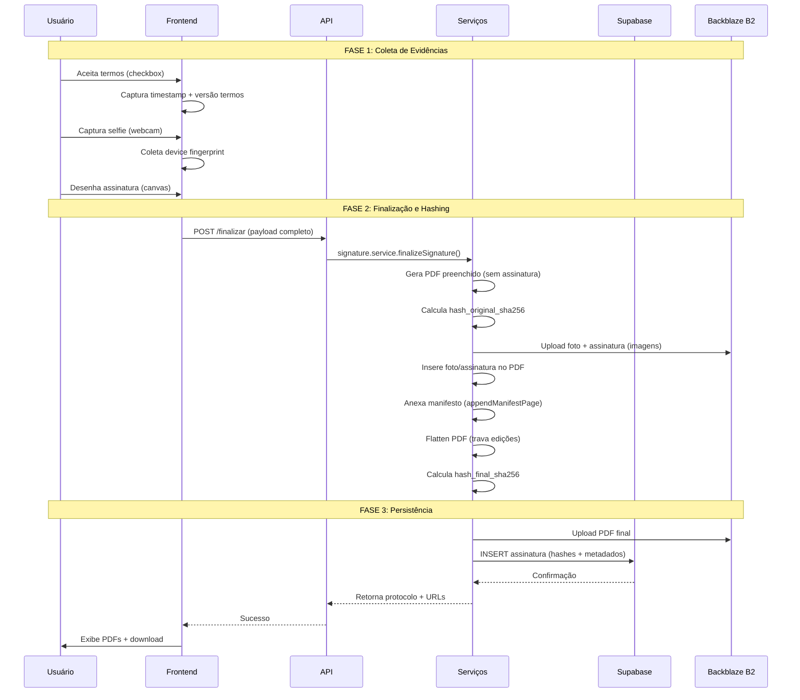
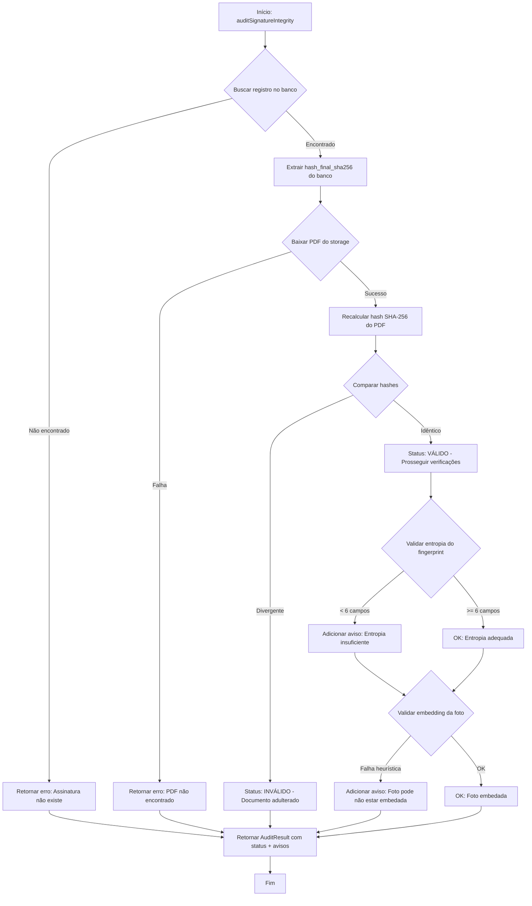

## Seção 1: Fundamentos Legais da MP 2.200-2/2001

A Medida Provisória nº 2.200-2, de 24 de agosto de 2001, instituiu a Infraestrutura de Chaves Públicas Brasileira (ICP-Brasil) e estabeleceu os fundamentos para a validade jurídica de documentos em forma eletrônica. Ela continua em vigor por força da Emenda Constitucional nº 32.

A MP distingue dois tipos principais de assinaturas eletrônicas:

1.  **Assinatura Eletrônica Qualificada (Art. 10, § 1º):** É a que utiliza certificado digital emitido no âmbito da ICP-Brasil. Possui presunção de veracidade em relação aos signatários, conferindo ao documento eletrônico o mesmo valor probatório de um documento com assinatura manuscrita.

2.  **Assinatura Eletrônica Avançada (Art. 10, § 2º):** É a que utiliza outros meios de comprovação da autoria e integridade de documentos em forma eletrônica, desde que admitido pelas partes como válido ou aceito pela pessoa a quem for oposto o documento.

O Sinesys implementa a **Assinatura Eletrônica Avançada**, cumprindo rigorosamente os quatro requisitos (alíneas) do § 2º para garantir sua validade jurídica:

> *a) estar associada ao signatário de maneira unívoca;*
> *b) que o signatário possa ser identificado de forma inequívoca;*
> *c) ser criada utilizando meios que o signatário possa manter sob seu controle exclusivo;*
> *d) estar vinculada aos dados a que se refere, de tal forma que qualquer modificação posterior seja detectável.*

A jurisprudência brasileira, notadamente o Superior Tribunal de Justiça (STJ), tem reiteradamente confirmado a validade de assinaturas eletrônicas que, mesmo fora do padrão ICP-Brasil, demonstram a autenticidade e a integridade do documento e a identificação do signatário (ex: REsp 1.495.920/DF).

---

## Seção 2: Implementação Técnica da Assinatura Eletrônica Avançada

O Sinesys mapeia cada requisito legal para uma robusta coleta de evidências técnicas, formando uma cadeia de custódia digital irrefutável.

-   **Alínea (a) - Associação unívoca:** A assinatura é vinculada a uma "impressão digital" do dispositivo (`device fingerprint`) que inclui dezenas de parâmetros (resolução de tela, hash de canvas, fuso horário, plataforma), além de endereço IP, geolocalização (com consentimento) e um timestamp preciso.

-   **Alínea (b) - Identificação inequívoca:** A identificação é garantida por múltiplos fatores:
    -   Validação do CPF do signatário.
    -   Coleta de dados pessoais completos (nome, endereço, etc.).
    -   **Captura de foto (selfie) em tempo real**, que serve como evidência biométrica facial.

-   **Alínea (c) - Controle exclusivo:** O processo ocorre inteiramente sob o controle do usuário:
    -   A captura de selfie e a assinatura manuscrita são feitas em tempo real, via webcam e canvas HTML5, sem permitir upload de arquivos preexistentes.
    -   O signatário deve manifestar seu consentimento explícito através do aceite dos termos legais, com o momento exato do aceite (timestamp) sendo registrado.

-   **Alínea (d) - Detecção de modificações:** A integridade do documento é garantida por um processo de **dual hashing SHA-256**:
    1.  **Hash Original:** Um hash SHA-256 é calculado a partir do documento PDF preenchido, *antes* da inserção da assinatura, foto e manifesto.
    2.  **Hash Final:** Após a inserção de todas as evidências (assinatura, foto, manifesto), o PDF é "achatado" (`flatten`) para remover a edição e um segundo hash SHA-256 é calculado sobre o documento final.
    Ambos os hashes são armazenados e registrados no manifesto de assinatura. Qualquer alteração, por menor que seja, no documento final resultará em um hash completamente diferente.

### Fluxo Técnico Completo

1.  **Verificação:** O processo inicia com a verificação do CPF do cliente.
2.  **Coleta de Dados:** O usuário preenche seus dados pessoais e as informações solicitadas no formulário dinâmico.
3.  **Captura de Evidências:** O sistema captura a foto (selfie) e a geolocalização.
4.  **Pré-visualização:** O usuário pré-visualiza o documento PDF já preenchido.
5.  **Consentimento:** O usuário lê e aceita os termos da assinatura eletrônica.
6.  **Assinatura:** O usuário desenha sua assinatura manuscrita em um campo na tela.
7.  **Finalização:** A API do Sinesys recebe todas as evidências, gera o documento final com o manifesto de assinatura, calcula os hashes e armazena tudo de forma segura.

---

## Seção 3: Cadeia de Custódia e Preservação de Evidências

A cadeia de custódia digital é a trilha de auditoria que comprova a integridade e a cronologia de todas as evidências coletadas.

### Evidências Coletadas

-   **Metadados Temporais:**
    -   `termos_aceite_data`: Timestamp UTC preciso do momento do aceite dos termos.
    -   `criado_em`: Timestamp da finalização do processo de assinatura.
-   **Identificação do Signatário:**
    -   `cliente_id`, nome completo, CPF, endereço.
    -   Foto (selfie) do signatário, embedada diretamente no PDF.
-   **Contexto Técnico:**
    -   `dispositivo_fingerprint_raw`: JSON com mais de 10 atributos do dispositivo.
    -   Endereço IP de origem e `User-Agent` do navegador.
    -   Geolocalização (latitude, longitude, acurácia).
-   **Integridade Documental:**
    -   `hash_original_sha256`: Hash do PDF antes da assinatura.
    -   `hash_final_sha256`: Hash do PDF completo, após a inclusão do manifesto e flatten.
-   **Consentimento:**
    -   `termos_aceite_versao`: Versão dos termos legais aceitos (ex: `v1.0-MP2200-2`).
    -   Texto da declaração de aceite.

### Armazenamento e Imutabilidade

-   **Metadados e Hashes:** Armazenados de forma segura no banco de dados Supabase (PostgreSQL).
-   **Arquivos (PDFs, Fotos):** Armazenados no Backblaze B2, um serviço de object storage com alta durabilidade. O acesso é feito via URLs assinadas e com políticas de retenção que garantem a preservação.
-   **Imutabilidade:** O PDF final é "achatado" (`flatten`), o que significa que todos os campos de formulário e anotações são fundidos em uma única camada, tornando o documento não editável. A combinação do `flatten` com os hashes SHA-256 e o manifesto embedado cria uma forte garantia de imutabilidade.

### Diagrama da Cadeia de Custódia



---

## Seção 4: Procedimentos de Auditoria Forense

O Sinesys fornece uma função de auditoria (`auditSignatureIntegrity`) para validar a integridade de qualquer assinatura a qualquer momento.

### Função de Auditoria

A função `auditSignatureIntegrity(assinaturaId)` executa os seguintes passos:
1.  Busca o registro da assinatura no banco de dados para obter os metadados e o `hash_final_sha256` armazenado.
2.  Baixa o arquivo PDF correspondente do storage (Backblaze B2).
3.  Recalcula o hash SHA-256 do arquivo PDF baixado.
4.  **Compara o hash recalculado com o `hash_final_sha256` armazenado**, utilizando uma comparação segura contra ataques de temporização (`timing-safe comparison`).
5.  Valida a entropia do `device fingerprint` para garantir que um número mínimo de identificadores do dispositivo foi coletado.
6.  Verifica heuristicamente se a foto do signatário está de fato embedada no PDF.
7.  Retorna um status: `valido` (se íntegro), `invalido` (se adulterado) ou `erro` (se houver falha técnica).

### Cenários de Auditoria

-   **Contestação Judicial:** Se uma das partes alegar que a assinatura é falsa ou que o documento foi alterado, a execução da função `auditSignatureIntegrity()` pode gerar um laudo técnico. Um hash divergente é uma prova conclusiva de adulteração.
-   **Verificação Interna:** A equipe de compliance pode auditar amostras de assinaturas periodicamente para garantir a conformidade contínua.
-   **Perícia Técnica:** Um perito judicial pode solicitar as evidências (registro do banco, PDF, logs), que permitirão a ele recalcular os hashes de forma independente e confirmar a integridade do processo.

### Checklist de Auditoria

-   [ ] O hash final calculado a partir do PDF confere com o hash armazenado no banco de dados?
-   [ ] O `device fingerprint` possui entropia suficiente (mínimo de 6 campos)?
-   [ ] A foto do signatário está embedada no documento PDF?
-   [ ] O timestamp do aceite dos termos é anterior ao timestamp de finalização da assinatura?
-   [ ] A geolocalização capturada é consistente com o endereço IP (quando disponível)?
-   [ ] O PDF está "achatado" (`flattened`) e não é editável?
-   [ ] O manifesto de assinatura contém todos os campos obrigatórios?

### Exemplo de Relatório de Auditoria (JSON)

```json
{
  "assinatura_id": "123e4567-e89b-12d3-a456-426614174000",
  "protocolo": "FS-20250110120000-A1B2C",
  "status": "valido",
  "verificacoes": {
    "hash_integridade": { "status": "ok", "hash_esperado": "a3c5f1...", "hash_calculado": "a3c5f1..." },
    "device_fingerprint": { "status": "ok", "campos_presentes": 8, "minimo_requerido": 6 },
    "foto_embedding": { "status": "ok", "tamanho_pdf": 1234567, "tamanho_foto": 45678 },
    "timeline": { "status": "ok", "aceite_termos": "2025-01-10T12:00:00Z", "finalizacao": "2025-01-10T12:05:30Z" }
  },
  "avisos": [],
  "erros": [],
  "auditado_em": "2025-01-15T10:30:00Z",
  "auditor": "sistema"
}
```
---

## Seção 5: Referências e Recursos

### Legislação

-   [Medida Provisória nº 2.200-2/2001](http://www.planalto.gov.br/ccivil_03/mpv/2200-2.htm)
-   [Lei nº 14.063/2020](https://www.in.gov.br/en/web/dou/-/lei-n-14.063-de-23-de-setembro-de-2020-279185994) (Dispõe sobre o uso de assinaturas eletrônicas em interações com entes públicos)
-   [Decreto nº 10.543/2020](https://www.in.gov.br/en/web/dou/-/decreto-n-10.543-de-13-de-novembro-de-2020-287893198) (Regulamenta a Lei nº 14.063/2020)

### Normas Técnicas

-   NIST FIPS 180-4 (Secure Hash Standard - SHA)
-   ISO/IEC 27001 (Information security management)

### Jurisprudência

-   **STJ, REsp 1.495.920/DF:** "É da essência do ato de vontade que a assinatura seja de próprio punho ou, sendo eletrônica, autenticada por processo que garanta a identificação do signatário." Reconhece a validade de outros meios de comprovação de autoria e integridade de documentos eletrônicos, mesmo que não certificados pela ICP-Brasil.
-   **Enunciado 297 da IV Jornada de Direito Civil (CJF):** "O documento eletrônico tem valor probante, desde que seja apto a conservar a integridade de seu conteúdo e idôneo a identificar seu autor, subscritor ou as partes em uma transação."

### Recursos Técnicos

-   **pdf-lib:** Biblioteca JavaScript para criação e modificação de documentos PDF.
-   **Node.js Crypto Module:** Implementação nativa de algoritmos criptográficos, incluindo SHA-256.
-   **Web Crypto API:** API de navegadores para operações criptográficas no frontend (usada para o hash de canvas do device fingerprint).

## Diagrama de Fluxo de Auditoria


