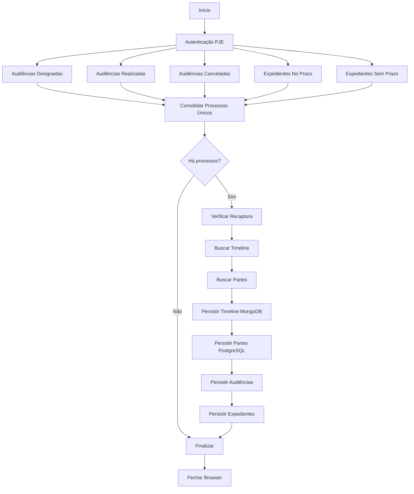

# 🚀 Captura Combinada

## Visão Geral

A **Captura Combinada** é um serviço otimizado que executa múltiplas capturas em uma única sessão autenticada do PJE/TRT, reduzindo drasticamente o tempo total de execução e o overhead de autenticação.

## 📋 O que é capturado?

Em uma única sessão, o serviço executa:

### 🎤 Audiências (3 tipos)

1. **Designadas** - Audiências marcadas (hoje → +1 ano)
2. **Realizadas** - Audiências concluídas (dia anterior)
3. **Canceladas** - Audiências canceladas (hoje → +1 ano)

### 📋 Expedientes (2 tipos)

4. **No Prazo** - Expedientes com prazo legal ativo
5. **Sem Prazo** - Expedientes sem prazo definido

### 🔄 Dados Complementares

6. **Timeline** - Movimentos e documentos de todos os processos únicos
7. **Partes** - Autores, réus, terceiros e representantes

## 🎯 Benefícios

### ⚡ Performance

- **1 autenticação** vs 5+ autenticações separadas
- Economia de ~**150s** de tempo de autenticação
- Sessão reutilizada para todas as requisições

### 🎁 Otimizações Inteligentes

- **Verificação de recaptura**: Pula processos atualizados < 24h
- **Processos únicos**: Elimina duplicatas automaticamente
- **Timeline + Partes** capturados uma única vez por processo
- **Rate limiting**: Delay de 300ms entre requisições

### 💾 Persistência Eficiente

- Timeline → MongoDB (flexível)
- Partes → PostgreSQL (estruturado)
- Audiências/Expedientes → PostgreSQL
- Payloads brutos → MongoDB (auditoria)

## 🔧 Como Usar

### Via Código

```typescript
import { capturaCombinada } from "@/backend/captura/services/trt/captura-combinada.service";
import { getTribunalConfig } from "@/backend/captura/services/trt/config";

const resultado = await capturaCombinada({
  credential: {
    usuario: "cpf",
    senha: "senha",
    certificado: "cert_path",
    senhaCertificado: "cert_pass",
  },
  config: getTribunalConfig("TRT3", "primeiro_grau"),
  twofauthConfig: {
    baseUrl: "http://localhost:8000",
    accountId: "account_id",
  },
});

console.log(resultado.resumo);
// {
//   totalAudienciasDesignadas: 50,
//   totalAudienciasRealizadas: 5,
//   totalAudienaciasCanceladas: 3,
//   totalExpedientesNoPrazo: 20,
//   totalExpedientesSemPrazo: 15,
//   totalProcessosUnicos: 75,
//   totalProcessosPulados: 10
// }
```

### Via Agendamento

1. Acesse o painel de agendamentos
2. Crie novo agendamento
3. Selecione **Tipo: Combinada**
4. Configure credenciais e recorrência
5. Salve

O agendamento executará automaticamente:

- Audiências Designadas (hoje → +1 ano)
- Audiências Realizadas (ontem)
- Audiências Canceladas (hoje → +1 ano)
- Expedientes No Prazo
- Expedientes Sem Prazo
- Timeline + Partes de todos os processos

### Via Script de Teste

```bash
# Configurar variáveis de ambiente
export TRT_USUARIO="seu_cpf"
export TRT_SENHA="sua_senha"
export TRT_CERTIFICADO="/path/to/cert.pfx"
export TRT_SENHA_CERTIFICADO="senha_cert"
export TWOFAUTH_URL="http://localhost:8000"
export TWOFAUTH_ACCOUNT_ID="account_id"

# Executar teste
npx ts-node scripts/captura/test-captura-combinada.ts
```

## 📊 Resultado Esperado

```typescript
interface CapturaCombinAdaResult {
  capturas: [
    { tipo: 'audiencias_designadas', total: 50, processos: [...] },
    { tipo: 'audiencias_realizadas', total: 5, processos: [...] },
    { tipo: 'audiencias_canceladas', total: 3, processos: [...] },
    { tipo: 'expedientes_no_prazo', total: 20, processos: [...] },
    { tipo: 'expedientes_sem_prazo', total: 15, processos: [...] }
  ],
  resumo: {
    totalAudienciasDesignadas: 50,
    totalAudienciasRealizadas: 5,
    totalAudienaciasCanceladas: 3,
    totalExpedientesNoPrazo: 20,
    totalExpedientesSemPrazo: 15,
    totalProcessosUnicos: 75,
    totalProcessosPulados: 10 // Atualizados < 24h
  },
  dadosComplementares: {
    processosUnicos: 75,
    processosPulados: 10,
    timelinesCapturadas: 65,
    partesCapturadas: 65,
    erros: 0
  },
  persistenciaAudiencias: { inseridos: 40, atualizados: 18, ... },
  persistenciaExpedientes: { inseridos: 25, atualizados: 10, ... },
  duracaoMs: 180000 // ~3 minutos
}
```

## 🔄 Fluxo de Execução



## ⚠️ Considerações

### Tempo de Execução

- Varia conforme quantidade de processos
- ~2-5 minutos para 50-100 processos
- Processamento em lote otimizado

### Limites

- Rate limiting: 300ms entre requisições
- Timeout de autenticação: 5 minutos
- Máximo recomendado: 500 processos/execução

### Erros Comuns

1. **Autenticação falhou**: Verificar credenciais e 2FA
2. **Timeout**: Muito processos - dividir em múltiplas execuções
3. **Processo pulado**: Atualizado < 24h (comportamento esperado)

## 📁 Arquivos Relacionados

- **Serviço**: [`backend/captura/services/trt/captura-combinada.service.ts`](../../backend/captura/services/trt/captura-combinada.service.ts)
- **Tipos**: [`backend/captura/services/trt/trt-capture.service.ts`](../../backend/captura/services/trt/trt-capture.service.ts)
- **Scheduler**: [`backend/captura/services/scheduler/executar-agendamento.service.ts`](../../backend/captura/services/scheduler/executar-agendamento.service.ts)
- **Migration**: [`supabase/migrations/add-tipo-captura-combinada.sql`](../../supabase/migrations/add-tipo-captura-combinada.sql)
- **Teste**: [`scripts/captura/test-captura-combinada.ts`](../../scripts/captura/test-captura-combinada.ts)

## 🎓 Lógica Interna

A captura combinada utiliza o serviço `dados-complementares.service.ts` que:

1. **Extrai processos únicos** de todas as listas (Set)
2. **Verifica recaptura** (consulta PostgreSQL `acervo.updated_at`)
3. **Busca timeline** via API do PJE
4. **Busca partes** via API do PJE
5. **Persiste dados** usando `persistirPartesProcesso` (sem refetch!)

Essa arquitetura elimina requisições duplicadas e aproveita ao máximo a sessão autenticada.
