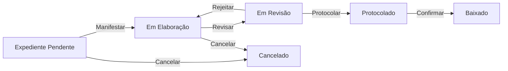
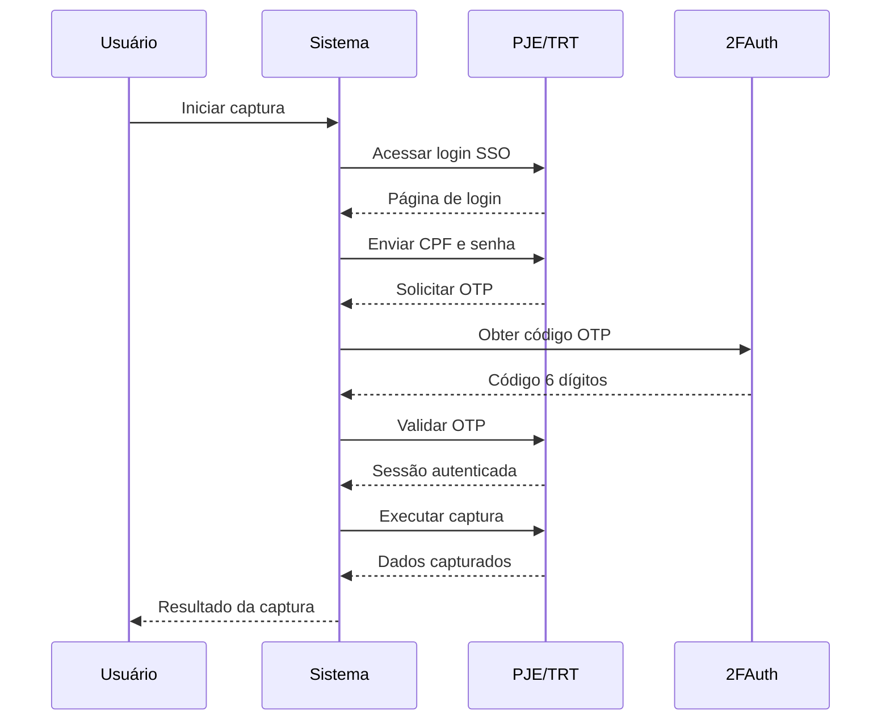
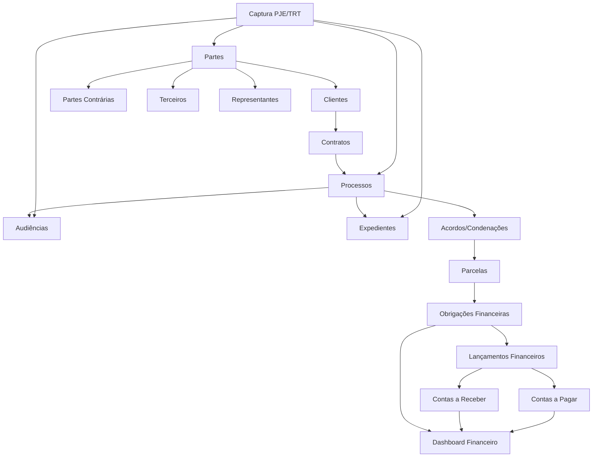
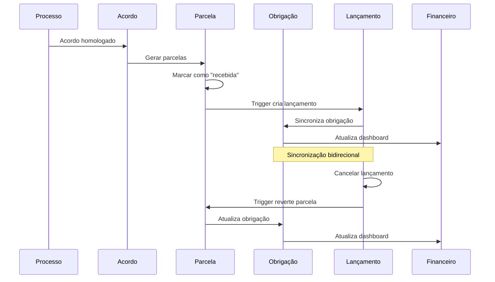

# Sinesys - Experiência do Usuário e Arquitetura de Informação

> Documento descritivo completo da estrutura de design, layout, fluxo de informações e organização modular do sistema Sinesys do ponto de vista da experiência do usuário.

---

## 1. Visão Geral do Sistema

O **Sinesys** é um sistema de gestão jurídica completo desenvolvido para escritórios de advocacia trabalhista, com foco especial na automação da captura de dados dos Tribunais Regionais do Trabalho (TRTs) e integração entre módulos jurídicos e financeiros.

### 1.1 Propósito e Público-Alvo

O sistema é projetado para advogados, assistentes jurídicos, gestores financeiros e administradores de escritórios de advocacia trabalhista. Cada perfil de usuário tem acesso a funcionalidades específicas através de um robusto sistema de permissões granulares (82 permissões em 13 recursos diferentes).

### 1.2 Filosofia de Design

O Sinesys adota uma abordagem **centrada no usuário** com os seguintes princípios:

- **Consistência**: Design system unificado baseado em shadcn/ui
- **Acessibilidade**: Componentes WCAG 2.1 compliant por padrão
- **Responsividade**: Mobile-first com adaptação fluida para todos os dispositivos
- **Eficiência**: Redução de cliques e automação de tarefas repetitivas
- **Clareza**: Hierarquia visual clara e feedback imediato de ações

---

## 2. Sistema de Design

### 2.1 Identidade Visual

#### 2.1.1 Paleta de Cores

**Modo Claro:**

- **Primary (Zattar Purple)**: `oklch(0.45 0.25 285)` - #5523eb
- **Background (Off-White)**: `oklch(0.96 0.01 270)` - #F4F4F8
- **Foreground (Zattar Charcoal)**: `oklch(0.24 0 0)` - #282828
- **Card (Pure White)**: `oklch(1 0 0)` - #FFFFFF
- **Accent (Action Orange)**: `oklch(0.68 0.22 45)` - #FF6B35
- **Destructive (Error Red)**: `oklch(0.6 0.2 25)` - #EA5455

**Modo Escuro:**

- **Background (Deep Charcoal)**: `oklch(0.18 0 0)`
- **Primary (Roxo mais claro)**: `oklch(0.55 0.25 285)`
- **Card**: `oklch(0.24 0 0)` - #282828
- Ajustes de contraste para garantir legibilidade

O sistema suporta **tema claro e escuro**, com transição suave gerenciada por CSS variables. A escolha do tema é persistida por usuário e pode ser alternada através do menu de perfil.

#### 2.1.2 Tipografia

O sistema utiliza uma hierarquia tipográfica consistente baseada no shadcn/ui:

**Fontes:**

- **Sans-serif (Interface)**: Inter - para corpo de texto e elementos de UI
- **Heading (Títulos)**: Montserrat - para títulos e destaques
- **Mono (Código)**: Geist Mono - para elementos técnicos

**Hierarquia de Títulos:**

| Elemento  | Tamanho        | Peso      | Uso                        |
| --------- | -------------- | --------- | -------------------------- |
| H1        | 4xl (2.25rem)  | Extrabold | Título principal da página |
| H2        | 3xl (1.875rem) | Semibold  | Seções principais          |
| H3        | 2xl (1.5rem)   | Semibold  | Subseções                  |
| H4        | xl (1.25rem)   | Semibold  | Títulos menores            |
| Parágrafo | base (1rem)    | Normal    | Corpo de texto             |
| Lead      | xl (1.25rem)   | Normal    | Texto introdutório         |
| Muted     | base (1rem)    | Normal    | Texto secundário           |

**Acessibilidade Tipográfica:**

- Line-height mínimo de 1.5 para corpo de texto
- Contraste mínimo de 4.5:1 para texto normal
- Contraste mínimo de 3:1 para texto grande
- Tamanho mínimo de fonte: 14px

### 2.2 Componentes Base

O sistema é construído sobre **shadcn/ui**, uma coleção de componentes reutilizáveis baseados em:

- **Radix UI**: Primitivos acessíveis
- **Tailwind CSS 4**: Framework utility-first
- **Lucide Icons**: Conjunto consistente de ícones
- **CVA (Class Variance Authority)**: Gerenciamento de variantes

#### 2.2.1 Componentes Primitivos

Componentes básicos incluem:

- Botões (variants: default, destructive, outline, secondary, ghost, link)
- Inputs e formulários
- Cards e containers
- Badges e labels
- Tooltips e popovers
- Dialogs e modais
- Dropdowns e selects
- Tables e grids

#### 2.2.2 Componentes Compostos

Componentes complexos construídos a partir de primitivos:

- **TableWithToolbar**: Tabela responsiva com busca, filtros e paginação
- **ResponsiveFilterPanel**: Sistema de filtros adaptativo
- **TableToolbar**: Barra de ferramentas unificada
- **ButtonGroup**: Agrupamento lógico de ações
- **Calendar**: Calendário com múltiplas visualizações

### 2.3 Design Responsivo

#### 2.3.1 Breakpoints

```css
--breakpoint-sm: 481px   /* Smartphones em landscape */
--breakpoint-md: 768px   /* Tablets */
--breakpoint-lg: 1025px  /* Laptops */
--breakpoint-xl: 1281px  /* Desktops */
--breakpoint-2xl: 1536px /* Telas grandes */
```

#### 2.3.2 Abordagem Mobile-First

Todo o sistema é desenvolvido com **mobile-first**, começando com layouts para dispositivos móveis e expandindo progressivamente:

- Componentes adaptam-se automaticamente ao tamanho da tela
- Tabelas transformam-se em cards em dispositivos móveis
- Sidebars colapsam em menus hamburguer
- Filtros inline em desktop viram sheets laterais em mobile
- Grids responsivos ajustam número de colunas automaticamente

---

## 3. Layout e Estrutura da Interface

### 3.1 Arquitetura de Layout

O sistema utiliza um layout **dashboard protegido** com estrutura hierárquica clara:

```
┌─────────────────────────────────────────────────────┐
│ Root Layout (app/layout.tsx)                        │
│ - Providers globais (Theme, Supabase, CopilotKit)  │
│ - Fontes (Inter, Montserrat, Geist Mono)           │
│ - PWA configuration                                 │
└─────────────────────────────────────────────────────┘
                        │
                        ▼
┌─────────────────────────────────────────────────────┐
│ Dashboard Layout (app/(dashboard)/layout.tsx)       │
│ ┌─────────────┬─────────────────────────────────┐ │
│ │             │                                 │ │
│ │  Sidebar    │    Main Content Area            │ │
│ │  (NavMain   │    (SidebarInset)               │ │
│ │   NavUser)  │                                 │ │
│ │             │    - Breadcrumb                 │ │
│ │             │    - Page Header                │ │
│ │             │    - Content                    │ │
│ │             │                                 │ │
│ └─────────────┴─────────────────────────────────┘ │
└─────────────────────────────────────────────────────┘
```

### 3.2 Sidebar (Navegação Principal)

A sidebar é o elemento central de navegação, organizada hierarquicamente em três seções:

#### 3.2.1 Estrutura da Sidebar

**Header:**

- Logo do escritório (Zattar Advogados)
- Seletor de equipe/escritório
- Versão/assinatura do sistema

**Content (Rolável):**

1. **Nav Principal** - Funcionalidades core do escritório:

   - Dashboard
   - Partes (Clientes, Partes Contrárias, Terceiros, Representantes)
   - Contratos
   - Processos
   - Audiências
   - Expedientes
   - ComunicaCNJ
   - Obrigações
   - Financeiro (Orçamentos, Contas a Pagar, Contas a Receber, Plano de Contas, DRE, Conciliação, Obrigações)

2. **Serviços** - Ferramentas e utilitários:
   - Assinatura Digital (Fluxo de Assinatura, Templates, Formulários, Segmentos)
   - Documentos
   - Chat
   - Assistentes

**Footer:**

- Configurações (Usuários)
- Perfil do usuário atual (com avatar, nome e email)
- Dropdown de ações (Perfil, Notificações, Ajuda, Tema, Sair)

#### 3.2.2 Comportamento da Sidebar

- **Collapsible**: Pode ser colapsada para ícones apenas (expandida/colapsada)
- **Estado persistente**: O estado (aberto/fechado) é mantido entre sessões
- **Hover expand**: Em modo colapsado, expande temporariamente no hover
- **Mobile**: Transforma em overlay lateral em dispositivos móveis
- **Itens expansíveis**: Menus com subitens expandem/colapsam com animação
- **Indicador de página ativa**: Item atual destacado visualmente
- **Tooltips**: Quando colapsada, mostra tooltips com nome dos itens

#### 3.2.3 Visual da Sidebar

**Modo Claro:**

- Fundo: Charcoal #282828 (escuro)
- Texto: Branco para contraste
- Item ativo: Roxo primary com fundo highlight
- Hover: Accent sutilmente mais claro

**Modo Escuro:**

- Fundo: Deep charcoal ainda mais escuro
- Mantém contraste adequado
- Bordas sutis para separação visual

### 3.3 Área de Conteúdo Principal

#### 3.3.1 Breadcrumb Navigation

Logo abaixo do header, um breadcrumb dinâmico mostra o caminho atual:

```
Início > Financeiro > Obrigações > Detalhes #1234
```

**Características:**

- Geração automática baseada na URL
- Links clicáveis para navegação reversa
- Truncamento inteligente de textos longos em mobile
- Labels customizados para rotas específicas

#### 3.3.2 Estrutura Típica de Página

```
┌─────────────────────────────────────────────────┐
│ Breadcrumb                                      │
├─────────────────────────────────────────────────┤
│ Page Header                                     │
│ ┌─────────────────────────────────────────────┐ │
│ │ Título Principal (H1)                       │ │
│ │ Descrição/Subtítulo                         │ │
│ │ [Botões de Ação Primária]                   │ │
│ └─────────────────────────────────────────────┘ │
├─────────────────────────────────────────────────┤
│ Content Area                                    │
│ ┌─────────────────────────────────────────────┐ │
│ │ Cards/Widgets/Listas                        │ │
│ │                                             │ │
│ │ - Grid responsivo de widgets (Dashboard)    │ │
│ │ - TableWithToolbar (Listagens)              │ │
│ │ - Formulários (Criação/Edição)              │ │
│ │ - Detalhes (Visualização)                   │ │
│ └─────────────────────────────────────────────┘ │
└─────────────────────────────────────────────────┘
```

---

## 4. Padrões de Interação e UX

### 4.1 Sistema de Tabelas Responsivas

Um dos componentes mais utilizados no sistema é o **TableWithToolbar**, que integra:

#### 4.1.1 TableToolbar

Barra de ferramentas unificada com:

**Elementos (da esquerda para direita):**

1. **Campo de Busca**: Input com ícone de lupa, debounce automático
2. **Separador visual**
3. **Filtros**: Três modos disponíveis
   - `single`: Botão único com dropdown (modo clássico)
   - `buttons`: Botões individuais por grupo de filtros
   - `panel`: Painel inline (desktop) ou Sheet lateral (mobile)
4. **Botões extras customizáveis**
5. **Seletor de visualização** (quando aplicável)
6. **Botão de criar novo** (ícone +)

**Comportamento:**

- Fundo branco com borda arredondada no topo
- Sticky quando a tabela rola
- Busca com feedback visual de loading
- Contador de filtros ativos
- Limpeza rápida de filtros

#### 4.1.2 ResponsiveTable

A tabela se adapta automaticamente:

**Desktop (≥768px):**

- Visualização em tabela tradicional
- Primeira coluna sticky (opcional)
- Ordenação por colunas
- Seleção de linhas com checkbox
- Ações de linha em dropdown
- Paginação com controles completos

**Mobile (<768px):**

- Transforma em cards verticais
- Mostra apenas colunas prioritárias
- Ações acessíveis por tap
- Scroll horizontal como fallback
- Paginação simplificada

**Zebra Striping:**

- Linhas alternadas com fundo sutilmente diferente
- Primeira coluna sempre com fundo branco
- Melhora escaneabilidade visual

#### 4.1.3 Filtros Responsivos

**Desktop:**

- Filtros inline ao lado da busca
- Grupos organizados visualmente
- Checkboxes com contadores

**Mobile:**

- Botão "Filtros" que abre Sheet lateral
- Lista vertical de grupos
- Footer com botão de limpar
- Scroll vertical para muitos filtros

### 4.2 Visualizações de Período

Módulos temporais (Audiências, Expedientes, Obrigações) oferecem múltiplas visualizações:

#### 4.2.1 Modos de Visualização

1. **Semana**: Calendário semanal com eventos
2. **Mês**: Grade mensal com badges de eventos
3. **Ano**: Visão anual consolidada
4. **Lista**: Tabela com filtros avançados

**Navegação entre modos:**

- Tabs horizontais no topo da página
- Persistência da seleção
- Mantém filtros entre mudanças de visualização
- Animação suave na transição

### 4.3 Formulários e Criação de Registros

#### 4.3.1 Padrão de Formulários

Formulários seguem uma estrutura consistente:

```
┌─────────────────────────────────────┐
│ Modal/Dialog ou Página Dedicada    │
├─────────────────────────────────────┤
│ Header                              │
│ - Título                            │
│ - Ícone representativo              │
│ - Botão de fechar (X)               │
├─────────────────────────────────────┤
│ Body (Rolável)                      │
│                                     │
│ Seções agrupadas logicamente:       │
│ ┌─────────────────────────────────┐ │
│ │ Seção 1: Dados Básicos          │ │
│ │ - Campo 1                       │ │
│ │ - Campo 2                       │ │
│ │ - Campo 3                       │ │
│ └─────────────────────────────────┘ │
│                                     │
│ ┌─────────────────────────────────┐ │
│ │ Seção 2: Informações Adicionais │ │
│ │ - Campo 4                       │ │
│ │ - Campo 5                       │ │
│ └─────────────────────────────────┘ │
├─────────────────────────────────────┤
│ Footer (Sticky)                     │
│ [Cancelar] [Salvar Rascunho] [Criar]│
└─────────────────────────────────────┘
```

**Validação:**

- Validação em tempo real
- Mensagens de erro contextuais
- Indicadores visuais de campos obrigatórios
- Bloqueio de envio até validação completa

### 4.4 Feedback e Estados

#### 4.4.1 Loading States

- **Skeleton loaders**: Para conteúdo que está carregando
- **Spinners**: Para ações em andamento
- **Progress bars**: Para uploads/downloads
- **Shimmer effect**: Em cards e listas

#### 4.4.2 Toasts e Notificações

Sistema de notificações usando **sonner**:

- **Sucesso**: Verde, ícone de check, mensagem clara
- **Erro**: Vermelho, ícone de alerta, descrição do problema
- **Warning**: Amarelo, ícone de atenção
- **Info**: Azul, ícone de informação
- **Loading**: Spinner com mensagem de progresso

**Posicionamento:**

- Desktop: Bottom-right
- Mobile: Top-center
- Auto-dismiss em 5 segundos (configurável)
- Persistente para erros críticos

---

## 5. Módulos e Funcionalidades

### 5.1 Dashboard Principal

O Dashboard é a página inicial após login, oferecendo uma visão consolidada do escritório.

#### 5.1.1 Organização em Widgets

O dashboard é composto por widgets modulares distribuídos em grid responsivo:

**Primeira Linha (3 colunas):**

- **Saldo das Contas**: Valor total em contas bancárias
- **Contas a Pagar/Receber**: Resumo de pendências financeiras
- **Alertas Financeiros**: Avisos de vencimentos e inconsistências

**Segunda Linha (2:1):**

- **Fluxo de Caixa** (2 colunas): Gráfico de barras de 6 meses
- **Despesas por Categoria** (1 coluna): Gráfico de pizza

**Terceira Linha (3 colunas):**

- **Orçamento Atual**: Comparativo previsto vs realizado
- **Obrigações Financeiras**: Resumo de obrigações vencidas/próximas
- **Folha de Pagamento**: Totais mensais

**Dashboard Personalizável (Admin):**

- Widgets arrastáveis e reposicionáveis
- Configuração salva por usuário
- Botão de personalizar (visível apenas no hover)
- Controles de drag discretos

#### 5.1.2 Características dos Widgets

**Padrão Visual:**

- Card com fundo branco
- Header com título e ícone representativo
- Link "Ver mais" para página detalhada
- Skeleton durante loading
- Mensagem de erro em caso de falha
- Responsividade em altura e largura

**Atualização:**

- Cache de 5 minutos (via Redis)
- Botão de atualizar manual
- Timestamp de última atualização no rodapé

### 5.2 Módulo de Partes

Gerenciamento centralizado de todas as entidades envolvidas em processos.

#### 5.2.1 Organização Hierárquica

**Rota Base**: `/partes` (redireciona para `/partes/clientes`)

**Submódulos:**

1. **Clientes**: Empresas/pessoas representadas pelo escritório
2. **Partes Contrárias**: Adversários em processos
3. **Terceiros**: Outras partes envolvidas
4. **Representantes**: Advogados e representantes legais

#### 5.2.2 Funcionalidades Comuns

- CRUD completo com validação
- Busca por nome, CPF/CNPJ
- Filtros por tipo (pessoa física/jurídica)
- Listagem com paginação
- Visualização de processos vinculados
- Histórico de interações
- Upload de documentos

#### 5.2.3 Integração entre Partes

**Fluxo de Vinculação:**

```
Cliente → Contrato → Processo → Partes Contrárias + Terceiros + Representantes
```

### 5.3 Módulo de Processos

Centro de gestão do acervo processual.

#### 5.3.1 Visualização Principal

**Lista de Processos** com:

- Número do processo
- Cliente principal
- Tribunal + Grau
- Status processual
- Responsável atribuído
- Data de última movimentação
- Badge de status colorido

**Filtros Avançados:**

- Por Tribunal (TRT1-24, TST)
- Por Grau (Primeiro, Segundo, Superior)
- Por Status (Ativo, Arquivado, Suspenso, etc.)
- Por Responsável
- Por Cliente
- Por Parte Contrária
- Por Data de Distribuição

#### 5.3.2 Detalhes do Processo

Página de detalhes com tabs:

1. **Informações Gerais**

   - Dados básicos do processo
   - Partes envolvidas
   - Valores da causa
   - Responsável

2. **Timeline**

   - Histórico de movimentações
   - Captura automática do PJE
   - Visualização cronológica
   - Filtros por tipo de movimentação

3. **Audiências**

   - Audiências agendadas
   - Histórico de audiências
   - URLs virtuais

4. **Expedientes**

   - Pendências ativas
   - Histórico de baixas
   - Prazos

5. **Documentos**

   - Gestão de documentos do processo
   - Upload e download
   - Categorização

6. **Acordos/Condenações**
   - Valores acordados
   - Parcelas
   - Honorários

### 5.4 Módulo de Audiências

Controle completo de audiências agendadas.

#### 5.4.1 Visualizações Disponíveis

**Rota Base**: `/audiencias`

**Modos:**

- `/audiencias/semana`: Calendário semanal
- `/audiencias/mes`: Grade mensal
- `/audiencias/ano`: Visão anual
- `/audiencias/lista`: Tabela com filtros

#### 5.4.2 Informações de Audiência

**Dados Capturados:**

- Data e hora
- Tipo (Conciliação, Instrução, Julgamento, etc.)
- Modalidade (Virtual, Presencial, Híbrida)
- URL da sala virtual
- Status (Marcada, Realizada, Cancelada, Adiada)
- Processo vinculado
- Observações

**Badge de Status:**

- Marcada: Azul
- Realizada: Verde
- Cancelada: Vermelho
- Adiada: Amarelo

#### 5.4.3 Sincronização com PJE

- Captura automática via API do TRT
- Atualização de URLs virtuais
- Detecção de cancelamentos/adiamentos
- Notificações de alterações

### 5.5 Módulo de Expedientes

Gestão de prazos e manifestações processuais.

#### 5.5.1 Tipos de Expedientes

1. **Pendentes de Manifestação** (capturados do PJE)

   - Prazo restante calculado automaticamente
   - Classificação por urgência
   - Documento PDF anexo (opcional)

2. **Expedientes Manuais** (criados internamente)
   - Controle de prazos internos
   - Tarefas não vinculadas ao PJE
   - Workflow de aprovação

#### 5.5.2 Workflow de Baixa



**Permissões:**

- Baixar expediente: Requer permissão específica
- Reverter baixa: Apenas administradores
- Editar tipo/descrição: Permissão granular

### 5.6 Módulo de Obrigações Financeiras

Visão consolidada de todas as obrigações do escritório.

#### 5.6.1 Tipos de Obrigações

| Tipo                 | Origem                     | Direção |
| -------------------- | -------------------------- | ------- |
| `acordo_recebimento` | Parcela de acordo judicial | Receber |
| `acordo_pagamento`   | Parcela de acordo judicial | Pagar   |
| `conta_receber`      | Lançamento financeiro      | Receber |
| `conta_pagar`        | Lançamento financeiro      | Pagar   |

#### 5.6.2 Dashboard de Obrigações

**Cards de Resumo:**

1. **Vencidas**: Total e valor em atraso (vermelho)
2. **Vencendo Hoje**: Urgência máxima (amarelo)
3. **Próximas 7 Dias**: Planejamento (azul)
4. **Próximas 30 Dias**: Visão mensal (verde)

**Tabela Principal:**

- Descrição da obrigação
- Cliente/Fornecedor
- Processo vinculado (se aplicável)
- Valor
- Data de vencimento
- Status (Pendente, Vencida, Efetivada, Cancelada)
- Ações (Ver, Sincronizar, Pagar/Receber)

#### 5.6.3 Sincronização Bidirecional

**Acordo → Financeiro (Automático via Trigger):**

```sql
Parcela.status = 'recebida' ou 'paga'
  ↓
Trigger: trigger_criar_lancamento_de_parcela()
  ↓
INSERT INTO lancamentos_financeiros
```

**Financeiro → Acordo (Trigger Reverso):**

```sql
Lançamento.status = 'cancelado' ou 'estornado'
  ↓
Trigger: trigger_sincronizar_parcela_de_lancamento()
  ↓
UPDATE parcelas SET status = 'pendente'
```

**Sincronização Manual:**

- API `/api/financeiro/obrigacoes/sincronizar`
- Verificação de consistência
- Detecção de divergências
- Correção forçada (para administradores)

### 5.7 Módulo Financeiro

Sistema completo de gestão financeira.

#### 5.7.1 Submódulos Financeiros

**Estrutura de Navegação:**

```
Financeiro (Dashboard)
├── Orçamentos
├── Contas a Pagar
├── Contas a Receber
├── Plano de Contas
├── DRE (Demonstrativo de Resultados)
├── Conciliação Bancária
└── Obrigações
```

#### 5.7.2 Dashboard Financeiro

Visualização consolidada com:

- Saldo atual de contas
- Fluxo de caixa projetado (6 meses)
- Despesas por categoria
- Orçamento vs Realizado
- Alertas de vencimentos
- Inadimplência

**Cache:**

- Redis com TTL de 5 minutos
- Invalidação automática em mudanças
- Atualização manual disponível

#### 5.7.3 Contas a Pagar/Receber

**Workflow Completo:**

1. Criação (manual ou via sincronização)
2. Aprovação (se necessário)
3. Agendamento
4. Confirmação de pagamento/recebimento
5. Conciliação bancária
6. Relatórios

**Estados:**

- Pendente
- Agendado
- Confirmado
- Cancelado
- Estornado

### 5.8 Módulo de Captura (PJE/TRT)

Automação de coleta de dados dos tribunais.

#### 5.8.1 Tipos de Captura

**Endpoints Disponíveis:**

1. **Acervo Geral**: `/api/captura/trt/acervo-geral`

   - Todos os processos ativos do advogado
   - Atualização de dados básicos
   - Sincronização de status

2. **Processos Arquivados**: `/api/captura/trt/arquivados`

   - Processos finalizados
   - Marcação de arquivo

3. **Audiências**: `/api/captura/trt/audiencias`

   - Audiências futuras
   - URLs virtuais
   - Tipo e modalidade

4. **Pendentes de Manifestação**: `/api/captura/trt/pendentes-manifestacao`

   - Expedientes com prazo
   - Download de PDFs (opcional)
   - Classificação por urgência

5. **Timeline**: Captura de movimentações processuais

6. **Partes**: Extração de clientes, partes contrárias e representantes

#### 5.8.2 Autenticação e Credenciais

**Fluxo de Autenticação:**



**Gerenciamento de Credenciais:**

- Cadastro por TRT e Grau
- Suporte a 2FA/OTP
- Integração com 2FAuth
- Ativação/Desativação
- Histórico de uso

#### 5.8.3 Interface de Captura

**Página de Captura** (`/captura`):

**Abas Disponíveis:**

1. **Histórico**: Lista de capturas realizadas
2. **Acervo Geral**: Formulário de captura
3. **Arquivados**: Formulário específico
4. **Audiências**: Captura de audiências
5. **Pendentes**: Captura de pendências
6. **Timeline**: Atualização de movimentações
7. **Partes**: Sincronização de partes

**Formulário Padrão:**

- Seleção de advogado
- Seleção de credenciais (multi-select)
- Opções adicionais (ex: capturar documentos)
- Botão de executar
- Feedback de progresso
- Resultado com detalhes

**Histórico de Capturas:**

- Data e hora
- Tipo de captura
- Tribunal e Grau
- Quantidade capturada
- Status (Sucesso, Erro, Parcial)
- Tempo de execução
- Logs de erro (se houver)

### 5.9 Módulo de Contratos

Gestão do ciclo de vida de contratos.

#### 5.9.1 Dados do Contrato

**Informações Principais:**

- Cliente contratante
- Tipo de contrato
- Área do direito
- Status (Ativo, Suspenso, Encerrado)
- Valor e forma de pagamento
- Vigência (início e fim)
- Processos associados

#### 5.9.2 Associação com Processos

**Fluxo:**

```
Contrato → Processos Vinculados → Acordos/Condenações → Obrigações Financeiras
```

**Visão Consolidada:**

- Total de processos vinculados
- Processos ativos vs arquivados
- Valores totais de acordos
- Honorários recebidos

### 5.10 Outros Módulos

#### 5.10.1 Assinatura Digital

**Submódulos:**

1. **Fluxo de Assinatura**: Gerenciamento de documentos para assinatura
2. **Templates**: Modelos reutilizáveis
3. **Formulários**: Coleta de dados
4. **Segmentos**: Categorização de documentos

**Integração:**

- Geração de PDFs
- Captura de assinaturas eletrônicas
- Validação de autenticidade
- Armazenamento seguro

#### 5.10.2 Documentos

- Repositório central de documentos
- Categorização por tipo
- Vínculo com processos/contratos
- Controle de versões
- Compartilhamento seguro

#### 5.10.3 Chat Interno

- Comunicação em tempo real
- Canais por processo/projeto
- Histórico persistente
- Notificações
- Compartilhamento de arquivos

#### 5.10.4 Assistentes (CopilotKit)

**Funcionalidades:**

- Navegação por voz
- Busca inteligente
- Resumo de processos
- Sugestões contextuais
- Automação de tarefas

**Ações Disponíveis:**

- `navegarPara`: Ir para módulo específico
- `mudarVisualizacao`: Alternar entre semana/mês/ano
- `atribuirResponsavel`: Atribuir processo a usuário
- `buscarProcesso`: Pesquisa por número

#### 5.10.5 Usuários e Permissões

**Sistema de Permissões:**

- 82 permissões em 13 recursos
- Granularidade por operação (listar, visualizar, criar, editar, deletar, etc.)
- Atribuição direta ao usuário (não baseado em roles)
- Cache em memória para performance
- Helpers reutilizáveis para validação

**Recursos Protegidos:**

- Advogados, Credenciais, Acervo, Audiências, Pendentes
- Expedientes Manuais, Usuários, Clientes, Partes Contrárias
- Terceiros, Representantes, Endereços, Contratos
- Processo-Partes, Acordos/Condenações, Parcelas
- Agendamentos, Captura, Tipos de Expedientes, Cargos
- Assinatura Digital, Assistentes, Obrigações
- Lançamentos Financeiros, Salários, Folhas de Pagamento
- DRE, Plano de Contas, Contas a Pagar/Receber, Orçamentos
- Conciliação Bancária

---

## 6. Fluxo de Informações e Integração entre Módulos

### 6.1 Mapa de Integração Geral



### 6.2 Fluxos Principais

#### 6.2.1 Fluxo de Captura → Visualização

1. **Captura de Dados (Backend)**

   - Autenticação no PJE
   - Extração via API ou scraping
   - Persistência no PostgreSQL
   - Registro em histórico

2. **Processamento**

   - Validação de dados
   - Deduplicação
   - Enriquecimento (vinculação com registros existentes)
   - Atualização de cache (Redis)

3. **Apresentação (Frontend)**
   - Listagens filtradas
   - Detalhes por registro
   - Notificações de novidades

#### 6.2.2 Fluxo Jurídico → Financeiro



**Pontos de Integração:**

1. Acordo/Condenação vinculado a Processo
2. Parcelas geradas automaticamente ou manualmente
3. Trigger automático cria lançamentos financeiros
4. Obrigações consolidam ambas as origens
5. Dashboard Financeiro agrega tudo

#### 6.2.3 Fluxo de Atribuição de Responsável

**Entidades Atribuíveis:**

- Processos
- Audiências
- Expedientes

**Permissões Necessárias:**

- `atribuir_responsavel`
- `desatribuir_responsavel`
- `transferir_responsavel`

**Workflow:**

1. Usuário seleciona processo/audiência/expediente
2. Clica em "Atribuir Responsável"
3. Seleciona usuário de lista
4. Sistema valida permissões
5. Registra atribuição com timestamp
6. Notifica responsável atribuído
7. Atualiza contadores de carga de trabalho

### 6.3 Transferência de Dados entre Módulos

#### 6.3.1 Compartilhamento de Clientes

**Cliente criado em:**

- Módulo de Partes → Disponível em Contratos, Processos, Acordos, Financeiro

**Cascata de Informações:**

```
Cliente
  ├── Contratos (N)
  │   └── Processos (N)
  └── Processos diretos (N)
      ├── Audiências
      ├── Expedientes
      └── Acordos
          └── Parcelas → Obrigações → Financeiro
```

#### 6.3.2 Sincronização de Status

**Processo arquivado:**

- Marca audiências futuras como canceladas
- Fecha expedientes pendentes
- Notifica sobre acordos ativos
- Atualiza dashboard

**Parcela efetivada:**

- Cria lançamento financeiro
- Atualiza obrigação
- Recalcula saldos
- Invalida cache do dashboard

---

## 7. Responsividade e Adaptação de Layout

### 7.1 Estratégias Responsivas

#### 7.1.1 Grid System

O sistema usa **Tailwind Grid** com breakpoints dinâmicos:

```tsx
// Exemplo de grid responsivo no Dashboard
<div className="grid gap-4 md:grid-cols-2 lg:grid-cols-3">
  <Widget1 />
  <Widget2 />
  <Widget3 />
</div>
```

**Comportamento:**

- `xs` (0-480px): 1 coluna
- `sm` (481-767px): 1 coluna
- `md` (768-1024px): 2 colunas
- `lg` (1025px+): 3 colunas

#### 7.1.2 Componentes Adaptativos

**TableToolbar → FilterPanel:**

```
Desktop (>768px):          Mobile (<768px):
┌─────────────────────────────────────┐ ┌─────────────────────────┐
│ [Busca] [Filtro A] [Filtro B] [+] │ │ [Busca]  [Filtros] │
└─────────────────────────────────────┘ └─────────────────────────┘
                                         │
                                         v
                                  ┌─────────────────────────┐
                                  │ Sheet Lateral      │
                                  │                    │
                                  │ ☐ Filtro A       │
                                  │ ☐ Filtro B       │
                                  │ ☐ Filtro C       │
                                  │                    │
                                  │ [Limpar Filtros]   │
                                  └─────────────────────────┘
```

**Sidebar Collapsible:**

```
Desktop Expandida:     Desktop Colapsada:    Mobile:
┌───────────────────┐  ┌─────────────┐  Overlay lateral
│ Logo             │  │ ■         │  que abre com
├───────────────────┤  ├─────────────┤  menu hamburguer
│ 🏠 Dashboard    │  │ 🏠       │  ┌───────────────────┐
│ 👥 Partes       │  │ 👥       │  │ Logo            │
│ 📝 Contratos    │  │ 📝       │  ├───────────────────┤
│ ...             │  │ ...      │  │ 🏠 Dashboard   │
└───────────────────┘  └─────────────┘  │ ...             │
                                   └───────────────────┘
```

### 7.2 Touch e Interação Móvel

#### 7.2.1 Áreas de Toque

**Tamanhos Mínimos:**

- Botões: 44x44px (padrão iOS/Android)
- Links: 40x40px
- Checkboxes: 36x36px

#### 7.2.2 Gestos Suportados

- **Swipe**: Navegação em carroseis
- **Tap**: Ações primárias
- **Long Press**: Menu contextual
- **Pinch**: Zoom em imagens/documentos
- **Pull to Refresh**: Atualização de listas

### 7.3 PWA (Progressive Web App)

#### 7.3.1 Características PWA

- **Instalável**: Adicionar à tela inicial
- **Offline-capable**: Service workers
- **Push notifications**: Notificações nativas
- **Sincronização em background**: Atualizações automáticas

#### 7.3.2 Manifest

```json
{
  "name": "Sinesys - Gestão Jurídica",
  "short_name": "Sinesys",
  "description": "Sistema de gestão jurídica trabalhista",
  "theme_color": "#5523eb",
  "background_color": "#F4F4F8",
  "display": "standalone",
  "orientation": "any",
  "icons": [...]
}
```

---

## 8. Performance e Otimizações

### 8.1 Estratégias de Cache

#### 8.1.1 Cache do Lado do Cliente

**React Query:**

- Stale time: 5 minutos
- Cache time: 30 minutos
- Refetch on window focus
- Retry automático (3x)

**Service Workers:**

- Cache de assets estáticos
- Estratégia: Cache-first para estáticos, Network-first para dados

#### 8.1.2 Cache do Lado do Servidor

**Redis:**

- Dashboard financeiro: TTL 5 minutos
- Listas de processos: TTL 2 minutos
- Permissões de usuário: TTL 15 minutos
- Invalidação automática em mudanças

### 8.2 Lazy Loading e Code Splitting

**Componentes:**

```tsx
// Carregamento sob demanda
const DashboardContent = dynamic(() => import("./dashboard-content"), {
  ssr: false,
  loading: () => <DashboardSkeleton />,
});
```

**Rotas:**

- Cada módulo em bundle separado
- Preload de rotas adjacentes
- Prefetch em hover de links

### 8.3 Otimizações de Imagem

**Next.js Image:**

- WebP automático
- Lazy loading nativo
- Responsive images (srcset)
- Placeholder blur

---

## 9. Acessibilidade (a11y)

### 9.1 Padrões WCAG 2.1

#### 9.1.1 Nível AA Compliance

**Contraste:**

- Texto normal: 4.5:1 mínimo
- Texto grande: 3:1 mínimo
- Elementos de UI: 3:1 mínimo

**Navegação:**

- Totalmente operável por teclado
- Focus visually clear
- Skip links para conteúdo principal

**Semântica:**

- HTML5 semântico correto
- ARIA labels onde necessário
- Landmarks apropriados

### 9.2 Navegação por Teclado

**Atalhos Principais:**

- `Tab`: Navegação entre elementos
- `Shift + Tab`: Navegação reversa
- `Enter`: Ativar botão/link
- `Space`: Selecionar checkbox/radio
- `Esc`: Fechar modais/dropdowns
- `Arrow keys`: Navegação em listas/menus

### 9.3 Screen Readers

**Compatibilidade:**

- NVDA (Windows)
- JAWS (Windows)
- VoiceOver (macOS/iOS)
- TalkBack (Android)

**Recursos:**

- ARIA live regions para notificações
- Descrições alternativas em imagens
- Labels em formulários
- Estado de elementos dinâmicos anunciado

---

## 10. Segurança e Privacidade na UX

### 10.1 Autenticação Visual

#### 10.1.1 Fluxo de Login

```
1. Página de Login
   ├── Email/CPF
   ├── Senha
   └── [Entrar] [Esqueci a Senha]

2. Autenticação 2FA (se habilitado)
   ├── Código OTP (6 dígitos)
   └── [Verificar]

3. Seleção de Escritório (se múltiplos)
   ├── Lista de escritórios com acesso
   └── [Continuar]

4. Dashboard Principal
```

#### 10.1.2 Indicadores de Sessão

- Avatar do usuário sempre visível
- Nome e cargo no dropdown
- Tempo de sessão restante (se aplicado)
- Botão de logout destacado

### 10.2 Feedback de Segurança

#### 10.2.1 Operações Sensíveis

**Confirmação em Duas Etapas:**

- Deletar processo
- Cancelar acordo
- Estornar pagamento
- Remover usuário
- Alterar permissões críticas

**Dialog de Confirmação:**

```
┌───────────────────────────────────┐
│ ⚠️  Confirmar Ação Destrutiva        │
├───────────────────────────────────┤
│                                   │
│ Tem certeza que deseja deletar o   │
│ processo #12345?                   │
│                                   │
│ Esta ação não pode ser desfeita. │
│                                   │
├───────────────────────────────────┤
│ [Cancelar]  [Sim, Deletar]         │
└───────────────────────────────────┘
```

### 10.3 Proteção de Dados

#### 10.3.1 Mascaramento de Informações

- CPF/CNPJ mascarados em listagens (**_._**.123-\*\*)
- Valores financeiros conforme permissão
- Dados sensíveis apenas para usuários autorizados

#### 10.3.2 Auditoria Visual

- Registro de "Criado por" e "Atualizado por" em detalhes
- Timestamp de última modificação
- Histórico de alterações (quando aplicável)

---

## 11. Guia de Boas Práticas para Desenvolvedores

### 11.1 Padrões de Componentes

#### 11.1.1 Estrutura de Componente

```tsx
// 1. Imports organizados
import * as React from "react";
import { Button } from "@/components/ui/button";
import { cn } from "@/lib/utils";
import type { MinhaInterface } from "@/types";

// 2. Types e Interfaces
interface MeuComponenteProps {
  titulo: string;
  onAction?: () => void;
}

// 3. Componente Principal
export function MeuComponente({ titulo, onAction }: MeuComponenteProps) {
  // 3.1. Hooks
  const [estado, setEstado] = React.useState(false);

  // 3.2. Handlers
  const handleClick = () => {
    // lógica
    onAction?.();
  };

  // 3.3. Render
  return (
    <div className="p-4">
      <h2>{titulo}</h2>
      <Button onClick={handleClick}>Ação</Button>
    </div>
  );
}
```

### 11.2 Nomenclatura e Organização

#### 11.2.1 Convenções de Nomes

**Componentes:**

- PascalCase: `TableToolbar`, `DashboardContent`
- Descritivos e específicos: `ObrigacoesWidget` > `Widget`

**Hooks:**

- camelCase com prefixo `use`: `useDashboard`, `useObrigacoes`

**Types/Interfaces:**

- PascalCase: `ObrigacaoComDetalhes`, `ResumoObrigacoes`
- Props com sufixo `Props`: `TableToolbarProps`

**Funções:**

- camelCase: `sincronizarAcordo`, `buscarProcesso`
- Verbos descritivos: `criar`, `atualizar`, `deletar`, `buscar`

#### 11.2.2 Estrutura de Arquivos

```
app/(dashboard)/modulo/
  ├── page.tsx              # Página principal
  ├── layout.tsx            # Layout do módulo (se necessário)
  ├── loading.tsx           # Estado de loading
  ├── error.tsx             # Página de erro
  ├── components/           # Componentes locais
  │   ├── modulo-form.tsx
  │   ├── modulo-details.tsx
  │   └── modulo-toolbar-filters.tsx
  └── [id]/                # Rota dinâmica
      └── page.tsx
```

### 11.3 Acessibilidade no Código

#### 11.3.1 ARIA Attributes

```tsx
// Correto
<Button
  aria-label="Deletar processo"
  aria-describedby="delete-warning"
  onClick={handleDelete}
>
  <Trash2 className="h-4 w-4" />
</Button>

// Errado
<div onClick={handleDelete}>
  <Trash2 />
</div>
```

#### 11.3.2 Semântica Correta

```tsx
// Correto
<nav aria-label="Navegação principal">
  <ul>
    <li><Link href="/">Início</Link></li>
  </ul>
</nav>

// Errado
<div className="nav">
  <div onClick={goHome}>Início</div>
</div>
```

### 11.4 Responsividade no Código

#### 11.4.1 Tailwind Breakpoints

```tsx
// Mobile-first correto
<div className="
  p-4              /* base */
  sm:p-6           /* ≥481px */
  md:p-8           /* ≥768px */
  lg:flex          /* ≥1025px - muda layout */
  lg:p-12
">
```

#### 11.4.2 Hooks de Viewport

```tsx
import { useViewport } from "@/hooks/use-viewport";

function MyComponent() {
  const { isMobile, isTablet } = useViewport();

  return isMobile ? <MobileView /> : <DesktopView />;
}
```

---

## 12. Conclusão

O **Sinesys** representa uma solução completa e moderna de gestão jurídica trabalhista, com foco especial em:

### 12.1 Pontos Fortes do Sistema

1. **Automação Inteligente**

   - Captura automatizada de 24 TRTs
   - Sincronização bidirecional jurídico-financeiro
   - Workflows otimizados

2. **Experiência do Usuário**

   - Design system consistente e acessível
   - Responsividade total (mobile-first)
   - Feedback imediato de ações
   - Navegação intuitiva

3. **Integração Perfeita**

   - Módulos interconectados
   - Transferência automática de dados
   - Visão consolidada
   - Single source of truth

4. **Performance e Escalabilidade**

   - Cache multinível (Redis + React Query)
   - Lazy loading e code splitting
   - PWA com offline-first
   - Otimizações automáticas

5. **Segurança Robusta**
   - Sistema de permissões granular (82 permissões)
   - Autenticação com 2FA
   - Auditoria completa
   - Proteção de dados sensíveis

### 12.2 Arquitetura de Informação

A organização hierárquica do sistema reflete o workflow natural de um escritório de advocacia:

```
Captura (PJE) → Processos → Audiências/Expedientes → Acordos → Financeiro
      ↓
    Partes → Clientes → Contratos
```

### 12.3 Filosofia de Design

O Sinesys adota uma abordagem **centrada no usuário**, priorizando:

- ✅ **Clareza** sobre complexidade
- ✅ **Consistência** sobre novidade
- ✅ **Eficiência** sobre recursos
- ✅ **Acessibilidade** como padrão, não opção
- ✅ **Responsividade** em todos os dispositivos

### 12.4 Visão Futura

O sistema está preparado para evoluir com:

- Inteligência Artificial para análise preditiva
- Automação ainda mais avançada
- Integrações com mais tribunais
- Analytics e insights automáticos
- Colaboração em tempo real expandida

---

## Apêndices

### A. Glossário de Termos

- **PJE**: Processo Judicial Eletrônico
- **TRT**: Tribunal Regional do Trabalho
- **Obrigação**: Compromisso financeiro (pagar ou receber)
- **Parcela**: Divisão de acordo/condenação
- **Lançamento**: Registro financeiro
- **Expediente**: Manifestação processual pendente
- **Captura**: Processo de extração de dados do PJE
- **Sincronização**: Atualização automática entre módulos

### B. Recursos Adicionais

**Documentação Técnica:**

- `/docs/financeiro/` - Detalhes do módulo financeiro
- `/docs/assinatura-digital/` - Sistema de assinatura
- `/backend/*/README.md` - Documentação de serviços

**Design System:**

- `/app/ajuda/design-system` - Catálogo de componentes
- `/app/ajuda/design-system/typography` - Tipografia
- `/app/ajuda/design-system/responsividade` - Guias responsivos

**API:**

- `/docs` - Swagger/OpenAPI interativo
- Autenticação: JWT, Session Cookie, API Key
- Formato padronizado de resposta

### C. Mapa de Rotas Completo

```
/dashboard                      # Dashboard principal
/partes
  /clientes                     # Gestão de clientes
  /partes-contrarias            # Partes adversárias
  /terceiros                    # Terceiros envolvidos
  /representantes               # Advogados/representantes
/contratos                      # Gestão de contratos
/processos                      # Acervo processual
/audiencias
  /semana                       # Calendário semanal
  /mes                          # Calendário mensal
  /ano                          # Visão anual
  /lista                        # Tabela de audiências
/expedientes
  /semana                       # Calendário semanal
  /mes                          # Calendário mensal
  /lista                        # Tabela de expedientes
/acordos-condenacoes
  /lista                        # Acordos e condenações
/financeiro
  (dashboard)                   # Dashboard financeiro
  /orcamentos                   # Orçamentos
  /contas-pagar                 # Contas a pagar
  /contas-receber               # Contas a receber
  /plano-contas                 # Plano de contas
  /dre                          # DRE
  /conciliacao-bancaria         # Conciliação
  /obrigacoes                   # Obrigações financeiras
/captura
  /historico                    # Histórico de capturas
  /acervo-geral                 # Captura de acervo
  /audiencias                   # Captura de audiências
  /pendentes                    # Captura de pendentes
/assinatura-digital
  /assinatura                   # Fluxo de assinatura
  /templates                    # Templates
  /formularios                  # Formulários
  /segmentos                    # Segmentos
/documentos                     # Repositório de documentos
/chat                           # Chat interno
/assistentes                    # Assistentes de IA
/usuarios                       # Gestão de usuários
/perfil                         # Perfil do usuário
/ajuda                          # Central de ajuda
```

---

**Documento gerado em**: Dezembro de 2024  
**Versão do Sistema**: Next.js 15 + Supabase + shadcn/ui  
**Mantenedor**: Equipe Sinesys
