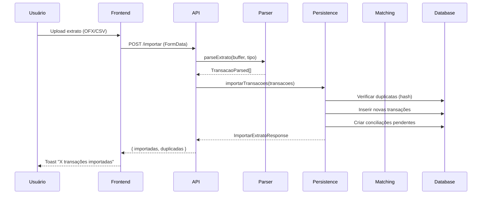
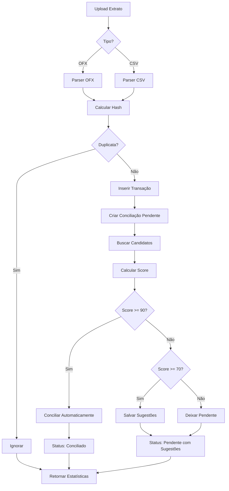

# Conciliação Bancária

## Visão Geral
Módulo para importar extratos bancários (OFX/CSV), detectar duplicatas, sugerir e executar conciliações automáticas/manual, e permitir revisão no frontend.

## Arquitetura
- Parsers (OFX/CSV) → Services de persistência (Supabase + Redis cache) → Matching automático → APIs REST → Hooks/Componentes React.

## Fluxos
### Importação e Conciliação

### Matching Automático

## Algoritmo de Matching
- Score 0-100 composto por valor (até 40), data (até 30) e descrição (até 30) usando similaridade de strings.
- Thresholds: >=90 concilia automaticamente; 70-89 grava sugestões; <70 deixa pendente.

## Detecção de Duplicatas
- Hash MD5 `${conta}-${data}-${valor}-${descricao}` para evitar reimportar transações já salvas.

## Formatos Suportados
- OFX: mapeia DTPOSTED, TRNAMT, MEMO/NAME, FITID, saldo (BALAMT).
- CSV: mapeamento flexível de colunas, inferência de tipo por sinal do valor.

## Troubleshooting
- Arquivo não importa: conferir extensão/encoding (UTF-8).
- Duplicatas não detectadas: checar descrição/valor/data iguais; hash depende desses campos.
- Sem sugestões: verificar janela de datas e status de lançamentos (confirmado).

## Exemplos
- OFX/CSV de exemplo, resposta de importação e sugestões estão documentados nos parsers e services.
