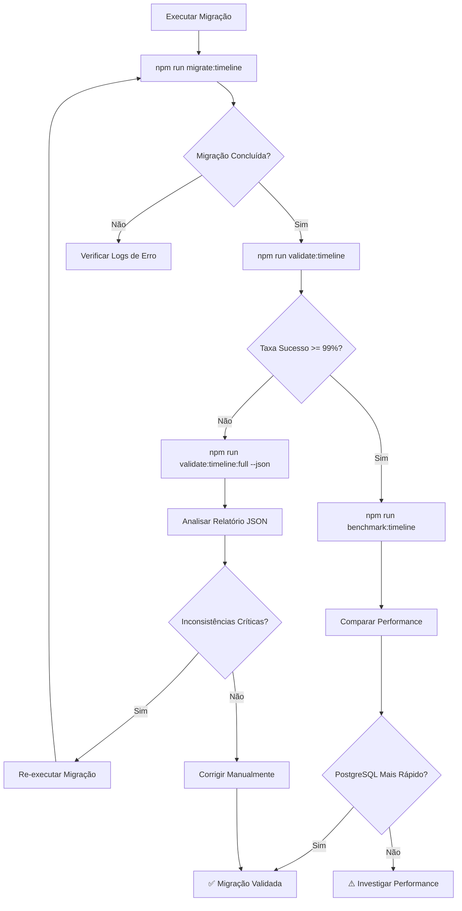

# Validação da Migração de Timeline MongoDB → PostgreSQL

Este documento descreve como validar e monitorar a migração de timeline do MongoDB para PostgreSQL usando as ferramentas desenvolvidas.

## Índice

- [Visão Geral](#visão-geral)
- [Ferramentas Disponíveis](#ferramentas-disponíveis)
- [Guia de Uso](#guia-de-uso)
- [Interpretação de Resultados](#interpretação-de-resultados)
- [Fluxo de Validação](#fluxo-de-validação)
- [Solução de Problemas](#solução-de-problemas)

---

## Visão Geral

A migração de timeline do MongoDB para PostgreSQL armazena os dados de timeline em formato JSONB na coluna `timeline_jsonb` da tabela `acervo`. Este documento fornece instruções para:

1. **Validar** a integridade dos dados migrados
2. **Comparar performance** entre PostgreSQL (JSONB) e MongoDB
3. **Testar** a funcionalidade de timeline unificada

---

## Ferramentas Disponíveis

### 1. Script de Validação

**Arquivo:** `scripts/database/migrations/validate-timeline-migration.ts`

Valida a integridade da migração comparando dados entre MongoDB e PostgreSQL.

**Modos de execução:**
- `quick`: Apenas contagem de registros (rápido)
- `sample`: Valida amostra aleatória (padrão)
- `full`: Valida todos os registros (demorado)

### 2. Script de Benchmark

**Arquivo:** `scripts/database/migrations/benchmark-timeline-performance.ts`

Compara performance de leitura entre PostgreSQL (JSONB) e MongoDB.

### 3. Testes de Integração

**Arquivo:** `src/features/acervo/__tests__/integration/timeline-migration.test.ts`

Testes automatizados que validam:
- Leitura de timeline do JSONB
- Agregação multi-instância
- Deduplicação de eventos
- Integridade MongoDB vs PostgreSQL
- Performance

---

## Guia de Uso

### Validação Rápida

Verifica quantos registros foram migrados, sem validar conteúdo.

```bash
npm run validate:timeline:quick
```

**Quando usar:**
- Verificação rápida após migração
- Monitoramento diário
- CI/CD pipelines

**Tempo de execução:** < 5 segundos

---

### Validação com Sample

Valida uma amostra aleatória de registros, comparando dados entre MongoDB e PostgreSQL.

```bash
# Sample padrão (50 registros)
npm run validate:timeline

# Sample customizado (100 registros)
npm run validate:timeline -- --sample-size 100

# Com logs detalhados
npm run validate:timeline -- --sample-size 50 --verbose
```

**Quando usar:**
- Validação padrão após migração
- Verificação semanal de integridade
- Testes em ambiente de staging

**Tempo de execução:** 10-30 segundos (dependendo do sample size)

---

### Validação Completa

Valida **todos** os registros migrados. Gera relatório JSON com detalhes.

```bash
npm run validate:timeline:full
```

**Quando usar:**
- Validação final antes de deploy em produção
- Investigação de inconsistências
- Auditoria completa

**Tempo de execução:** Vários minutos (dependendo do volume de dados)

**Relatório gerado:** `validation-report-{timestamp}.json`

---

### Benchmark de Performance

Compara performance de leitura entre PostgreSQL e MongoDB.

```bash
# Benchmark padrão (100 processos)
npm run benchmark:timeline

# Sample customizado (200 processos)
npm run benchmark:timeline -- --sample-size 200

# Salvar relatório em JSON
npm run benchmark:timeline -- --output benchmark-results.json
```

**Quando usar:**
- Após migração, para validar performance
- Monitoramento mensal de performance
- Antes de mudanças na infraestrutura

**Tempo de execução:** 1-3 minutos (dependendo do sample size)

**Métricas incluídas:**
- Média, mediana, P95, P99, min, max
- Comparação PostgreSQL vs MongoDB
- Performance de timeline unificada

---

### Testes de Integração

Executa suite completa de testes automatizados.

```bash
# Executar todos os testes de integração
npm run test:integration

# Executar apenas testes de timeline migration
npm run test -- timeline-migration.test.ts

# Executar com coverage
npm run test:coverage -- timeline-migration.test.ts
```

**Quando usar:**
- CI/CD pipelines
- Após mudanças no código de timeline
- Antes de deploy

**Cobertura de testes:**
- Leitura de JSONB ✅
- Timeline unificada ✅
- Integridade MongoDB vs PostgreSQL ✅
- Performance ✅

---

## Interpretação de Resultados

### Taxa de Sucesso

A taxa de sucesso indica a porcentagem de registros validados sem inconsistências.

#### ✅ Taxa >= 99% - Migração Bem-Sucedida

```
✨ Taxa de sucesso: 99.8%
✅ Migração validada com sucesso!
```

**Ação:** Nenhuma ação necessária. Inconsistências mínimas são aceitáveis.

---

#### ⚠️ Taxa < 99% - Investigar Inconsistências

```
✨ Taxa de sucesso: 95.2%
⚠️ Taxa de sucesso abaixo de 99%:
   - Analise as inconsistências detalhadas
   - Execute: npm run validate:timeline:full --json
   - Considere re-executar a migração para registros com falha
```

**Ação:**
1. Executar validação completa com `--json`
2. Analisar relatório detalhado
3. Verificar logs de erro da migração
4. Re-executar migração se necessário

---

#### ❌ Registros Pendentes > 0

```
💡 Ações recomendadas:
   - Há 150 registros pendentes de migração
   - Execute: npm run migrate:timeline
```

**Ação:**
1. Re-executar migração: `npm run migrate:timeline`
2. Validar novamente: `npm run validate:timeline`

---

### Tipos de Inconsistências

#### `missing_postgres`

Timeline não foi migrada para PostgreSQL.

**Solução:** Re-executar migração para o registro específico.

---

#### `missing_mongo`

Timeline não encontrada no MongoDB (ID inválido ou documento removido).

**Solução:**
- Verificar se o MongoDB ID está correto
- Verificar se o documento foi removido do MongoDB

---

#### `timeline_length`

Quantidade de itens diferente entre MongoDB e PostgreSQL.

```
Quantidade de itens diferente: MongoDB=45, PostgreSQL=42
```

**Solução:**
1. Verificar logs de migração para o processo
2. Re-executar migração para o registro
3. Comparar dados manualmente se persistir

---

#### `metadata`

Metadados inconsistentes (totalDocumentos, totalMovimentos).

```
totalDocumentos diferente: MongoDB=10, PostgreSQL=9
```

**Solução:**
1. Re-executar migração
2. Verificar lógica de contagem no script de migração

---

### Resultados de Benchmark

#### ✅ PostgreSQL Mais Rápido

```
🔍 Análise:
   ✅ PostgreSQL é 35.2% mais rápido que MongoDB
   ✅ Timeline unificada dentro do limite aceitável (< 2000ms)
```

**Interpretação:** Migração bem-sucedida, performance melhorou.

---

#### ⚠️ MongoDB Ligeiramente Mais Rápido (< 20%)

```
🔍 Análise:
   ⚠️  MongoDB é 12.3% mais rápido (diferença aceitável < 20%)
   ✅ Timeline unificada dentro do limite aceitável (< 2000ms)
```

**Interpretação:** Performance similar, aceitável. Possível overhead de parsing JSONB.

**Ação:** Monitorar. Considerar otimizações (índices, caching).

---

#### ❌ MongoDB Significativamente Mais Rápido (>= 20%)

```
🔍 Análise:
   ❌ MongoDB é 45.8% mais rápido (diferença significativa)
```

**Interpretação:** Performance degradou. Investigar.

**Ação:**
1. Verificar índices no PostgreSQL
2. Analisar queries executadas
3. Considerar otimizações (EXPLAIN ANALYZE)
4. Revisar configuração do PostgreSQL

---

#### ⚠️ Timeline Unificada Lenta

```
🔍 Análise:
   ⚠️  Timeline unificada acima do limite recomendado (3500ms > 2000ms)
```

**Interpretação:** Agregação de múltiplas instâncias está lenta.

**Ação:**
1. Verificar número de instâncias sendo agregadas
2. Otimizar queries de busca
3. Implementar caching se necessário

---

## Fluxo de Validação

### Fluxo Recomendado Após Migração



---

### Checklist de Validação

- [ ] **1. Migração Executada**
  ```bash
  npm run migrate:timeline
  ```

- [ ] **2. Validação Rápida**
  ```bash
  npm run validate:timeline:quick
  ```
  - Verificar se há registros pendentes
  - Confirmar que registros foram migrados

- [ ] **3. Validação com Sample**
  ```bash
  npm run validate:timeline -- --sample-size 100
  ```
  - Taxa de sucesso >= 99%
  - Inconsistências mínimas

- [ ] **4. Validação Completa (Produção)**
  ```bash
  npm run validate:timeline:full
  ```
  - Gerar relatório JSON completo
  - Analisar todas as inconsistências

- [ ] **5. Benchmark de Performance**
  ```bash
  npm run benchmark:timeline
  ```
  - PostgreSQL >= MongoDB (ou diferença < 20%)
  - Timeline unificada < 2000ms

- [ ] **6. Testes de Integração**
  ```bash
  npm run test:integration
  ```
  - Todos os testes passando
  - Coverage adequado

- [ ] **7. Aprovação Final**
  - Documentar resultados
  - Comunicar stakeholders
  - Deploy em produção

---

## Solução de Problemas

### Problema: Validação retorna erro "Nenhum registro encontrado"

**Causa:** Migração não foi executada ou falhou completamente.

**Solução:**
```bash
# Re-executar migração
npm run migrate:timeline

# Validar novamente
npm run validate:timeline:quick
```

---

### Problema: Taxa de sucesso muito baixa (< 90%)

**Causa:** Problemas na migração, dados corrompidos, ou conexão instável.

**Solução:**
1. Verificar logs de erro da migração
2. Verificar conectividade MongoDB e PostgreSQL
3. Re-executar migração com retry habilitado
4. Validar dados no MongoDB (alguns documentos podem estar corrompidos)

---

### Problema: Benchmark mostra PostgreSQL muito mais lento

**Causa:** Índices faltando, queries não otimizadas, ou configuração inadequada.

**Solução:**
1. Verificar índices:
   ```sql
   SELECT * FROM pg_indexes WHERE tablename = 'acervo';
   ```

2. Analisar query plan:
   ```sql
   EXPLAIN ANALYZE
   SELECT timeline_jsonb FROM acervo WHERE id = 123;
   ```

3. Considerar índice GIN para JSONB:
   ```sql
   CREATE INDEX idx_acervo_timeline_jsonb_gin ON acervo USING GIN (timeline_jsonb);
   ```

4. Revisar configuração PostgreSQL (shared_buffers, work_mem, etc.)

---

### Problema: Testes de integração falhando

**Causa:** Ambiente de teste sem dados migrados, conexões não configuradas.

**Solução:**
1. Verificar variáveis de ambiente (`.env.test`)
2. Executar migração no ambiente de teste
3. Verificar conectividade MongoDB e Supabase
4. Revisar setup do Jest

---

### Problema: Relatório JSON não é gerado

**Causa:** Permissões de escrita, path incorreto.

**Solução:**
1. Verificar permissões do diretório
2. Executar com `--verbose` para debug:
   ```bash
   npm run validate:timeline:full -- --verbose
   ```

3. Verificar espaço em disco

---

## Scripts NPM - Referência Rápida

| Script | Descrição | Tempo |
|--------|-----------|-------|
| `npm run validate:timeline` | Validação sample (padrão: 50) | ~20s |
| `npm run validate:timeline:quick` | Apenas contagem | < 5s |
| `npm run validate:timeline:full` | Validação completa + JSON | minutos |
| `npm run benchmark:timeline` | Benchmark de performance | 1-3min |
| `npm run test:integration` | Testes automatizados | ~30s |

---

## Contato e Suporte

Para dúvidas ou problemas com a validação da migração:

1. Verifique este documento primeiro
2. Consulte os logs de erro detalhados
3. Abra uma issue no repositório com:
   - Comando executado
   - Output completo (com `--verbose`)
   - Relatório JSON (se aplicável)
   - Versão do Node.js e dependências

---

**Última atualização:** 2025-12-31
